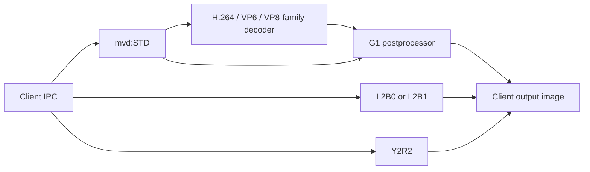

# MVD Services

Completed local reference based on 3DBrew revision 21607 and this repository’s reverse engineering.

## Table of contents

- [Scope and evidence](#scope)
- [Services and hardware resources](#services)
- [MVD service mvd:STD](#std)
- [Initialization, decoding and output lifecycle](#lifecycle)
- [Decoder input and output structures](#outputs)
- [MVDSTD configuration structure](#config)
- [SKATER configuration observations](#skater)
- [MVD result codes](#results)
- [Work-buffer sizing and client memory](#sizing)
- [Auxiliary IPC transport conventions](#aux-transport)
- [MVD services l2b:u and l2b2:u](#l2b)
- [MVD service y2r2:u](#y2r)
- [Auxiliary conversion, DMA and lifetime](#aux-driver)
- [Pixel packing and hardware-dependent conversion](#packing)
- [Supported codecs, H.264 levels and profiles](#support)
- [Implementation defects and result caveats](#sharp-edges)
- [Recovery paths and remaining questions](#recovery)

<a id="scope"></a>

## Scope and evidence

This page completes [3DBrew's MVD Services article](https://www.3dbrew.org/w/index.php?title=MVD_Services&oldid=21607) using the reverse engineering in this repository. The source revision is **21607**, last edited **2021-09-28 12:30**, fetched directly on **2026-09-28**. An [attributed Markdown source snapshot](RE/sources/3dbrew-mvd-services-21607.md) preserves the article before completion; [page history](https://www.3dbrew.org/w/index.php?title=MVD_Services&action=history) credits its contributors.

The additions concern the supplied `mvd.i64`, whose original firmware version is not identified. They establish Hantro G1-family library inclusion and this binary's behavior, not an exact Nintendo SDK/Hantro release or a conformance result for every firmware. Addresses labeled as code addresses are IDA virtual addresses. The hardware assumption is one console revision, ASIC ID `0x67312398`, with the supplied GBATEK reference register values; the database's MMIO bytes are placeholders.

The original article's release-history and SKATER browser observations remain attributed to 3DBrew. Recovered command roles, layouts, branches and result semantics come from the database/source comparison. Hardware-dependent conclusions are marked as such. No new console experiment was performed, and this local document has not been submitted to the wiki.

MVD is used for compressed-picture decoding and hardware image conversion on New Nintendo 3DS. The source article reports that the New 3DS Internet Browser (SKATER) uses `mvd:STD` for video and color conversion of decoded MJPEG pictures. That observation does not establish a JPEG decoder in the MVD service: its exposed decoder groups are H.264, VP6 and VP8-family operations.

#### Terminology

A codec reconstructs pictures from compressed data. H.264 carries parameter sets and coded slices in NAL units; decoded pictures can be retained as references or held for display reordering. VP8 also retains reference pictures, including last/golden/alternate roles. The recovered WebP mode uses an intra-only VP8-family path; it is not evidence for a general lossless/animated WebP or RIFF-container decoder.

The postprocessor (**PP**) receives pixels after decoding, or directly in standalone conversion. YCbCr separates luma (Y) from chroma (Cb/Cr). In 4:2:0, each chroma component has half the luma width and height. Semiplanar storage means a Y plane plus interleaved CbCr; these are two planes of one picture. RGB channels, tiled pixel addressing and byte order are separate layout properties. The [writeup's primer](writeup.md#primer) explains these concepts in more detail.

#### Corrections to the source page

| Source-page interpretation | Recovered meaning |
|---|---|
| Unknown command groups | H.264, VP8/VP7/WebP, VP6 and Hantro PP APIs |
| Configuration `0x00020001` labeled H.264 | YCbCr 4:2:0 semiplanar pixel layout; the initialization command chooses the codec |
| Configuration output addresses treated as two images | Luma/RGB and, for applicable formats, the chroma plane of the same image |
| `0x17002` labeled busy | Picture ready for output/dequeue |
| `0x17004` described only as partial input consumption | Headers ready; client can query dimensions and configure output |
| `0xD961710F` described as generic configuration failure | Invalid PP output format |
| Bus error's native status listed as `-0xFB` | Decoder native status `-256` (`-0x100`) maps to `0xF96171C8` |
| Limits 2048/4672 presented generically | Legacy product `0x8170` PP branches; other products and effective capabilities differ |
| L2B getter headers containing output-word counts | Conventional getter requests have no normal input words; reply counts are separate |
| `y2r2:u` treated as an exact Y2R copy | Shared command vocabulary through `0x2C`, plus `0x2D` and binary-specific transport/lifecycle behavior |
| Browser High10 results treated as hardware support | Preserved as historical reports; native ten-bit reconstruction is not established |


<a id="services"></a>

## Services and hardware resources

Each registered service permits one session; the main loop has four active-session slots in total. The module multiplexes a notification handle, four listening ports and up to four client sessions.

| Service | Dispatcher | Context |
|---|---|---|
| mvd:STD | `0x1124E8` | `0x12100C` |
| l2b:u | `0x111E64` | `0x121220` |
| l2b2:u | `0x111E64` | `0x121270` |
| y2r2:u | `0x11328C` | `0x121014` |

| Service/engine | Physical bank reported by reference | CPU virtual register window in this module | DMA FIFO virtual address(es) | IRQ |
|---|---|---|---|---|
| `mvd:STD`, G1 | `0x10207000` | `0x1ED07000` | Hardware accesses decoder/PP memory through bus addresses | `0x4F` |
| `l2b:u`, engine 0 | `0x10130000` on the source page | `0x1EC30000` | Input `0x1EE30000`, output `0x1EE30200` | `0x45` |
| `l2b2:u`, engine 1 | Not independently assigned here | `0x1EC31000` | Input `0x1EE31000`, output `0x1EE31200` | `0x46` |
| `y2r2:u`, engine 1 | Not inferred from the older Y2R page | `0x1EC32000` | Y `0x1EE32000`, U `0x1EE32080`, V `0x1EE32100`, YUYV `0x1EE32180`, output `0x1EE32200` | `0x4E` |

CPU register windows, peripheral DMA endpoints, client virtual addresses and bus addresses are distinct. Both L2B services share their command dispatcher while selecting separate contexts. The exposed Y2R service selects engine 1 even though the register initializer has an engine-0 branch.




<a id="std"></a>

## MVD service mvd:STD

### Dispatch and state

Dispatcher: `0x1124E8`. Its session context begins with a decoder pointer at `+0` and a postprocessor pointer at `+4`; the decoder slot is shared by the H.264, VP6 and VP8 families. These are alternative decoder lifetimes, not three independently stored instances.

The dispatcher selects the low byte of the command ID (`header >> 16`). For commands with translated handles/buffers it checks the expected header/descriptor shape; many scalar-only commands go directly to their handler without an equivalent full-header check. The table gives the normal request encoding, not a promise that every malformed header is rejected.

A process handle uses the two-word shared-handle descriptor (`0`, handle). Mapped read/write buffers have descriptor low nibbles `0xA`/`0xC`. Most replies contain one normal result word; larger results are listed below. The service constructs a command-zero error reply for invalid descriptors or unknown commands.

#### Complete command table

The source revision lists every command below as available since **8.1.0-0 New3DS**. The final column preserves its SKATER-use observations, which were not independently re-audited here. Request/reply payloads exclude the header; “process handle” includes the shared-handle descriptor.

| ID | Request header | Recovered operation | Request payload | Reply payload | SKATER use (3DBrew) |
| --- | --- | --- | --- | --- | --- |
| `0x01` | `0x00010082` | Initialize | client work-buffer VA, size; process handle | result | Yes |
| `0x02` | `0x00020000` | Shutdown | — | result | Yes |
| `0x03` | `0x00030300` | CalculateWorkBufSize | 12-word packed request; meaningful bytes and dimensions below | result, byte count | Yes |
| `0x04` | `0x000400C0` | CalculateImageSize | width, height, output format | result, byte count | No |
| `0x05` | `0x00050100` | H264Initialize | s8 noOutputReordering, s8 freezeConcealment, s8 displaySmoothing, referenceFrameFormat | result | Yes |
| `0x06` | `0x00060000` | H264EnableMvc | — | result | No |
| `0x07` | `0x00070000` | H264Release | — | result | Yes |
| `0x08` | `0x00080142` | H264Decode / ProcessNALUnit | stream VA, bus address, size, picture ID, skipNonReference; process handle | result, current stream VA, current bus address, bytes left | Yes |
| `0x09` | `0x00090042` | H264NextPicture / ControlFrameRendering | s8 endOfStream; process handle | result, 0x40-byte picture | Yes |
| `0x0A` | `0x000A0000` | H264GetInfo | — | result, 0x40-byte info | Yes |
| `0x0B` | `0x000B0000` | H264Peek | — | result, 0x40-byte picture | No |
| `0x0C` | `0x000C0100` | Vp8Initialize | u8 format, s8 freezeConcealment, frame-buffer count, referenceFrameFormat | result | No |
| `0x0D` | `0x000D0000` | Vp8Release | — | result | No |
| `0x0E` | `0x000E0202` | Vp8Decode | 8-word VP8DecInput; process handle | result, one output word | No |
| `0x0F` | `0x000F0042` | Vp8NextPicture | s8 endOfStream; process handle | result, 0x40-byte picture | No |
| `0x10` | `0x00100000` | Vp8GetInfo | — | result, 0x28-byte info | No |
| `0x11` | `0x00110000` | Vp8Peek | — | result, 0x40-byte picture | No |
| `0x12` | `0x001200C0` | Vp6Initialize | s8 freezeConcealment, frame-buffer count, referenceFrameFormat | result | No |
| `0x13` | `0x00130000` | Vp6Release | — | result | No |
| `0x14` | `0x001400C2` | Vp6Decode | stream VA, bus address, size; process handle | result, one output word | No |
| `0x15` | `0x00150042` | Vp6NextPicture | s8 endOfStream; process handle | result, 0x24-byte picture | No |
| `0x16` | `0x00160000` | Vp6GetInfo | — | result, 0x24-byte info | No |
| `0x17` | `0x00170000` | Vp6Peek | — | result, 0x24-byte picture | No |
| `0x18` | `0x00180000` | PpInitialize | — | result | Yes |
| `0x19` | `0x00190000` | PpRelease | — | result | Yes |
| `0x1A` | `0x001A0000` | PpGetResult / standalone conversion | — | result | Yes |
| `0x1B` | `0x001B0040` | PpEnableCombinedMode | u8 decoder type | result | Yes |
| `0x1C` | `0x001C0000` | PpDisableCombinedMode | — | result | Yes |
| `0x1D` | `0x001D0042` | PpGetConfig | size word; writable mapped buffer | result; returned mapped-buffer descriptor/address | Yes |
| `0x1E` | `0x001E0044` | PpSetConfig | size word; process handle; readable mapped buffer | result; returned mapped-buffer descriptor/address | Yes |
| `0x1F` | `0x001F0902` | SetupOutputBuffers | count, 17 VA pairs, per-buffer size; process handle | result | No |
| `0x20` | `0x00200002` | GetNextOutput | process handle | result, luma/RGB client VA, chroma client VA | No |
| `0x21` | `0x00210100` | OverrideOutputBuffers | current luma VA, current chroma VA, replacement luma VA, replacement chroma VA | result | No |

### Other codec groups

`0C` format values are 1 = VP7, 2 = VP8, 3 = WebP. Capability checks are performed for VP7 or VP8/WebP. Frame-buffer counts are capped at 16, with minima 3 for VP7 and 4 for VP8; WebP uses one. `12` initializes VP6, with frame-buffer count clamped to 3..16. Concealment can be disabled by the old-product compatibility path.

For PP attachment (`1B`), the function first range-checks 1..11 but the compiled switch implements **only** 1 = H.264, 6 = VP6, 9 = VP8, 10 = WebP. Other values return parameter error. VP7 initialization exists, but there is no separate VP7 PP attachment case; do not infer full combined-mode support from the range check.

`0E` consumes the eight fields of `VP8DecInput`: stream VA, stream bus address, byte length, WebP slice height, optional luma VA, luma bus address, optional chroma VA, chroma bus address. The service stages the input stream, but the additional user-picture pointers are forwarded with the input structure. Their accepted use depends on the decoder's WebP and buffer-mode paths.


<a id="lifecycle"></a>

## Initialization, decoding and output lifecycle

### Lifecycle and decoding

For H.264 with postprocessing, the logical sequence is initialize work-buffer access (`01`), initialize decoder (`05`), initialize PP (`18`), attach PP to H.264 (`1B`, value 1), decode (`08`), inspect info after headers (`0A`), configure output (`1E`), and retrieve pictures (`09`). Retrieval invokes the linked postprocessor as needed. At end of stream, use a nonzero `endOfStream` to flush pending output. Detach (`1C`), release PP (`19`), release decoder (`07`), then shut down (`02`). This explains the corresponding sequence in libctru.

`09` is an end-of-stream-aware picture dequeue operation. A zero argument means normal operation; a nonzero value requests draining/flush behavior. Its returned `0x17002` indicates a populated picture. It is not simply an asynchronous conversion-busy flag. `0B` peeks rather than dequeuing.

For standalone pixel conversion, no decoder is needed: initialize, initialize PP, set configuration, call `1A`, then release PP and shut down. `PPGetResult` checks idle state and, when no decoder is attached, runs the PP and waits for it. With a decoder attached it returns the stored combined-operation result instead.

`05` arguments correspond directly to Hantro's no-output-reordering, freeze concealment, display smoothing, and reference-frame format. The three byte-sized values are sign-extended by the IPC dispatcher. The reference-format word uses bit 0 for tiled references and bit 30 for field-DPB support in this build. These are not pixel-format values.

`06` invokes `H264DecSetMvc`. It checks the capability structure's MVC field, which this build forces to zero. Thus its existence in the ABI does not establish working MVC support. The gated write is now identified as `storage.mvcEnabled = 1` at `+0x39DC`; [the MVC state analysis](writeup.md#mvc) distinguishes this request flag from the neighboring parser state.


### Multibuffer output

`1F` translates client VAs into bus addresses, saves both representations and calls `PPDecSetMultipleOutput`. The Hantro routine requires 1..17 entries, a linked decoder and nonzero luma addresses, with a legacy-product restriction. Its validation happens **after** the service wrapper's translation loop; the wrapper does not clamp that first loop to 17.

`20` asks PP for the next selected output, then matches its luma bus address to saved mappings and returns the corresponding client VA pair. It can rerun PP when a buffered picture's configuration ID differs from the current setup. It does not mean dequeue the next compressed input frame.

`21` replaces the output at PP's current display index if both current addresses match, with idle/combined/multibuffer checks. It is not inherently restricted to entry zero. The wrapper saves one extra replacement mapping on its first override only, so repeated overrides are not a general-purpose refresh of every VA mapping.

See [memory and results](#sizing) for static implementation defects and [methodology](writeup.md#corrections) for verification limits.

#### Browser procedures retained from the source

The source article reports that SKATER initializes and shuts down MVD whenever its video player is entered/exited. Its standalone color-conversion sequence initializes the service with work-buffer size 1, then initializes PP. That is a reported client sequence, not a general work-buffer sizing rule for decoders. For H.264, parameter-set NALs are supplied before normal picture processing.

When draining H.264 output, use a nonzero `endOfStream` and continue while next-picture returns picture-ready (`0x17002`). This loop consumes queued display pictures; it is not waiting for a busy status to clear. Other results must still be interpreted, rather than all being assumed successful completion.


<a id="outputs"></a>

## Decoder input and output structures

### Output structures

All offsets below are bytes. Pointer values are 32-bit.

#### H.264 info, 0x40 bytes (`0A`)

| Offset | Field |
|---|---|
| 00, 04 | stored picture width, height |
| 08, 0C | video range, matrix coefficients |
| 10, 14, 18, 1C | crop left, crop width, crop top, crop height |
| 20 | output pixel format |
| 24, 28 | sample aspect ratio width, height |
| 2C, 30 | monochrome, interlaced sequence |
| 34 | DPB storage mode: frame/field state, initialized to -1 before sequence setup |
| 38, 3C | picture buffer count, multibuffer PP requirement |

#### H.264 picture, 0x40 bytes (`09`, `0B`)

`00/04`: stored width/height; `08/0C/10/14`: crop left/width/top/height; `18/1C`: output pointer/bus address; `20`: picture ID; `24`: IDR flag; `28`: concealed macroblock count; `2C`: interlaced; `30`: field picture; `34`: top field; `38`: MVC view ID; `3C`: output layout byte (raster/tiled), followed by padding. Peek does not necessarily populate every field that dequeue populates. Replies copy the full structure even on paths that do not fill it; consumers must inspect the result before using fields.

#### VP8 info, 0x28 bytes (`10`)

`00/04`: version/profile; `08/0C`: coded width/height; `10/14`: rounded frame width/height; `18/1C`: scaled width/height; `20`: `constantZero`, one byte written as zero on success; `21..23`: padding not initialized by the getter; `24`: output pixel format. The original purpose of the extra byte is unknown, but its [zero-only behavior is established](writeup.md#definitions).

#### VP8 picture, 0x40 bytes (`0F`, `11`)

`00/04`: coded width/height; `08/0C`: frame width/height; `10/14`: luma/chroma strides; `18/1C`: luma pointer/bus address; `20/24`: chroma pointer/bus address; `28`: picture ID; `2C`: intra flag; `30`: golden-frame flag; `34`: concealed macroblocks; `38`: slice rows; `3C`: output layout byte plus padding. Strides select stored stride values when nonzero, otherwise the frame stride. Several picture metadata fields are explicitly zeroed in this build.

#### VP6 info and picture, each 0x24 bytes (`15`..`17`)

Info: version, profile, frame width, frame height, scaled width, scaled height, scaling mode, `constantZero` byte at `1C`, padding at `1D..1F`, output pixel format at `20`. The byte is zero on success; the getter does not initialize the padding. Both VP6/VP8 replies copy their full records, including padding, and early errors do not guarantee initialized metadata.

Picture: frame width, frame height, output pointer, output bus address, picture ID, intra flag, golden-frame flag, concealed macroblocks, output layout byte plus padding. The observed next-picture routine zeroes picture ID, intra/golden flags, and concealed-macroblock count.


<a id="config"></a>

## MVDSTD configuration structure

### Identity and complete field map

`MVDSTD_Config` is Hantro `PPConfig`, exactly `0x11C` bytes. Evidence: field accesses in `PPCheckConfig` (`0x10635C`), copy size in `PPGetConfig` (`0x1074FC`), default values in `PPInitDataStructures` (`0x107720`), and register setup in `PPSetupHW` (`0x108540`). This also explains matching pixel-format constants in `source/inc/ppapi.h`.

All fields are four bytes; signed fields matter for brightness, contrast, saturation, mask coordinates and framebuffer placement. Bus addresses are not ordinary process pointers.

| Offset | Hantro field | Type |
|---|---|---|
| `0x000` | `ppInImg.pixFormat` | `u32` |
| `0x004` | `ppInImg.picStruct` | `u32` |
| `0x008` | `ppInImg.videoRange` | `u32` |
| `0x00C` | `ppInImg.width` | `u32` |
| `0x010` | `ppInImg.height` | `u32` |
| `0x014` | `ppInImg.bufferBusAddr` | `u32` |
| `0x018` | `ppInImg.bufferCbBusAddr` | `u32` |
| `0x01C` | `ppInImg.bufferCrBusAddr` | `u32` |
| `0x020` | `ppInImg.bufferBusAddrBot` | `u32` |
| `0x024` | `ppInImg.bufferBusAddrChBot` | `u32` |
| `0x028` | `ppInImg.vc1MultiResEnable` | `u32` |
| `0x02C` | `ppInImg.vc1RangeRedFrm` | `u32` |
| `0x030` | `ppInImg.vc1RangeMapYEnable` | `u32` |
| `0x034` | `ppInImg.vc1RangeMapYCoeff` | `u32` |
| `0x038` | `ppInImg.vc1RangeMapCEnable` | `u32` |
| `0x03C` | `ppInImg.vc1RangeMapCCoeff` | `u32` |
| `0x040` | `ppInCrop.enable` | `u32` |
| `0x044` | `ppInCrop.originX` | `u32` |
| `0x048` | `ppInCrop.originY` | `u32` |
| `0x04C` | `ppInCrop.height` | `u32` |
| `0x050` | `ppInCrop.width` | `u32` |
| `0x054` | `ppInRotation.rotation` | `u32` |
| `0x058` | `ppOutImg.pixFormat` | `u32` |
| `0x05C` | `ppOutImg.width` | `u32` |
| `0x060` | `ppOutImg.height` | `u32` |
| `0x064` | `ppOutImg.bufferBusAddr` | `u32` |
| `0x068` | `ppOutImg.bufferChromaBusAddr` | `u32` |
| `0x06C` | `ppOutRgb.rgbTransform` | `u32` |
| `0x070` | `ppOutRgb.contrast` | `i32` |
| `0x074` | `ppOutRgb.brightness` | `i32` |
| `0x078` | `ppOutRgb.saturation` | `i32` |
| `0x07C` | `ppOutRgb.alpha` | `u32` |
| `0x080` | `ppOutRgb.transparency` | `u32` |
| `0x084` | `ppOutRgb.rgbTransformCoeffs.a` | `u32` |
| `0x088` | `ppOutRgb.rgbTransformCoeffs.b` | `u32` |
| `0x08C` | `ppOutRgb.rgbTransformCoeffs.c` | `u32` |
| `0x090` | `ppOutRgb.rgbTransformCoeffs.d` | `u32` |
| `0x094` | `ppOutRgb.rgbTransformCoeffs.e` | `u32` |
| `0x098` | `ppOutRgb.rgbBitmask.maskR` | `u32` |
| `0x09C` | `ppOutRgb.rgbBitmask.maskG` | `u32` |
| `0x0A0` | `ppOutRgb.rgbBitmask.maskB` | `u32` |
| `0x0A4` | `ppOutRgb.rgbBitmask.maskAlpha` | `u32` |
| `0x0A8` | `ppOutRgb.ditheringEnable` | `u32` |
| `0x0AC` | `ppOutMask1.enable` | `u32` |
| `0x0B0` | `ppOutMask1.originX` | `i32` |
| `0x0B4` | `ppOutMask1.originY` | `i32` |
| `0x0B8` | `ppOutMask1.height` | `u32` |
| `0x0BC` | `ppOutMask1.width` | `u32` |
| `0x0C0` | `ppOutMask1.alphaBlendEna` | `u32` |
| `0x0C4` | `ppOutMask1.blendComponentBase` | `u32` |
| `0x0C8` | `ppOutMask1.blendOriginX` | `i32` |
| `0x0CC` | `ppOutMask1.blendOriginY` | `i32` |
| `0x0D0` | `ppOutMask1.blendWidth` | `u32` |
| `0x0D4` | `ppOutMask1.blendHeight` | `u32` |
| `0x0D8` | `ppOutMask2.enable` | `u32` |
| `0x0DC` | `ppOutMask2.originX` | `i32` |
| `0x0E0` | `ppOutMask2.originY` | `i32` |
| `0x0E4` | `ppOutMask2.height` | `u32` |
| `0x0E8` | `ppOutMask2.width` | `u32` |
| `0x0EC` | `ppOutMask2.alphaBlendEna` | `u32` |
| `0x0F0` | `ppOutMask2.blendComponentBase` | `u32` |
| `0x0F4` | `ppOutMask2.blendOriginX` | `i32` |
| `0x0F8` | `ppOutMask2.blendOriginY` | `i32` |
| `0x0FC` | `ppOutMask2.blendWidth` | `u32` |
| `0x100` | `ppOutMask2.blendHeight` | `u32` |
| `0x104` | `ppOutFrmBuffer.enable` | `u32` |
| `0x108` | `ppOutFrmBuffer.writeOriginX` | `i32` |
| `0x10C` | `ppOutFrmBuffer.writeOriginY` | `i32` |
| `0x110` | `ppOutFrmBuffer.frameBufferWidth` | `u32` |
| `0x114` | `ppOutFrmBuffer.frameBufferHeight` | `u32` |
| `0x118` | `ppOutDeinterlace.enable` | `u32` |

### Input meaning

`picStruct`: 0 = frame or top field, 1 = bottom field, 2 = separate top and bottom fields, 3 = top/bottom fields stored as a frame, 4 = top field in a frame, 5 = bottom field in a frame. The extra addresses at `0x18..0x24` are chroma planes and bottom-field planes; they are not unexplained extra images.

`videoRange`: 0 = limited/studio range; 1 = full range. Values above one fail validation. The six words at `0x28..0x3C` are VC-1 range/multiresolution fields inherited from the common PP API; their presence does not mean a VC-1 decoder is compiled into MVD.

The input pixel format describes the already-decoded image entering PP. In combined mode, the H.264 decoder's natural format is semiplanar 4:2:0 or tiled 4:2:0, or monochrome for a monochrome sequence.

### Pixel-format values

| Value | Hantro name / layout |
|---|---|
| `0x010001` | YCbCr 4:2:2 interleaved: Y Cb Y Cr (YUYV) |
| `0x010005` | Y Cr Y Cb (YVYU) |
| `0x010006` | Cb Y Cr Y (UYVY) |
| `0x010007` | Cr Y Cb Y (VYUY) |
| `0x010002` | YCbCr 4:2:2 semiplanar |
| `0x010004` | YCbCr 4:4:0 |
| `0x010008..0x01000B` | The corresponding four 4:2:2 interleaved orders, tiled 4×4 |
| `0x020000` | YCbCr 4:2:0 planar |
| `0x020001` | YCbCr 4:2:0 semiplanar: Y plane plus interleaved CbCr |
| `0x020002` | YCbCr 4:2:0 tiled |
| `0x080000` | YCbCr 4:0:0 (monochrome) |
| `0x100001` | YCbCr 4:1:1 semiplanar |
| `0x200001` | YCbCr 4:4:4 semiplanar |
| `0x040000` | Custom 16-bit RGB masks |
| `0x040001` | RGB 5:5:5 |
| `0x040002` | RGB 5:6:5 |
| `0x040003` | BGR 5:5:5 |
| `0x040004` | BGR 5:6:5 |
| `0x041000` | Custom 32-bit RGB masks |
| `0x041001` | RGB32 |
| `0x041002` | BGR32 |

These are **library layout names**, not an assertion about byte order seen by a 3DS display framebuffer. libctru names `0x040002` BGR565 and `0x040004` RGB565, opposite the Hantro bit-layout names. Preserve that distinction when interoperating with libctru. Output-endian and swap register settings also affect memory interpretation.

The format list is not an all-modes support matrix. The input/output predicates and hardware feature bits restrict legal choices. In particular `0x020001` uses two output planes at `0x64` and `0x68`; these are luma and chroma, not two independent output pictures. Custom RGB formats need valid channel masks. Tiled output depends on PP capability and product checks.

The matched `PPIsInPixFmtOk` at `0x107860` makes the canonical-format restrictions more precise:

* 4:2:0 semiplanar is accepted in both standalone and linked modes; tiled 4:2:0 excludes the JPEG-linked case
* 4:2:0 planar and YUYV are standalone-only inputs; the other three interleaved 4:2:2 orders additionally exclude product `0x8170`
* Monochrome is linked H.264/JPEG only, and H.264 monochrome excludes `0x8170`
* 4:2:2 semiplanar, 4:4:0, 4:1:1 and 4:4:4 are JPEG-linked only in the common predicate. Since this build has no JPEG attachment case, those are not ordinary reachable combined configurations through `1B`

`PPIsOutPixFmtOk` at `0x107918` accepts semiplanar 4:2:0, YUYV and the listed custom/fixed RGB formats without a product restriction in this predicate. Other interleaved 4:2:2 orders exclude `0x8170`; tiled 4×4 output additionally requires the tiled-output capability. Geometry, addresses and other validation still apply. The source's additional YCrCb semiplanar cases are absent from these observed branches.

### Crop, orientation, RGB and masks

Cropping uses input-space X/Y, height and width. X/Y must be multiples of 16; crop dimensions must be multiples of eight. Minimum width is 16 standalone or 48 combined; minimum height is 16. The observed validation checks origins and dimensions individually against the input dimensions; it does not simply enforce `origin + extent <= input extent` in this initial crop block.

Rotation at `0x54`: 0 none, 1 right 90°, 2 left 90°, 3 horizontal flip, 4 vertical flip, 5 180°. Combined mode rejects nonzero rotation for certain subsampled input layouts (`0x010004`, `0x010002`, `0x100001`, `0x200001`); additional JPEG-specific compatibility checks survive in common PP code despite the missing JPEG decoder attachment case.

RGB transform at `0x6C`: 0 custom coefficients, 1 BT.601, 2 BT.709. The signed adjustments are contrast (`-64..64`), brightness (`-128..127`) and saturation (`-64..128`). Alpha is at `0x7C`, transparency at `0x80`; their applicable constraints depend on 16/32-bit output. Dithering is `0xA8`, gated by hardware support.

| Transform / input range | a | b | c | d | e |
|---|---:|---:|---:|---:|---:|
| BT.601 limited | 298 | 409 | 208 | 100 | 516 |
| BT.601 full | 256 | 350 | 179 | 86 | 443 |
| BT.709 limited | 298 | 459 | 137 | 55 | 544 |
| BT.709 full | 256 | 403 | 120 | 48 | 475 |

`PPSetConfig` installs these values into its internal configuration for transforms 1/2. The four channel masks at `0x98..0xA4` are used for custom RGB. Overlapping masks, unsuitable runs of bits, and masks exceeding 16 bits for custom RGB16 fail validation.

Mask 1 (`0xAC..0xD4`) and mask 2 (`0xD8..0x100`) each describe enable, signed output-space X/Y, height, width, alpha-blend enable, blend-source bus address, and optional blend-source crop X/Y/width/height. An enabled alpha-blend source must have a nonzero eight-byte-aligned address. Mask geometry and blending/cropping support have additional checks in `0x106088` and `0x106008`.

The framebuffer block at `0x104..0x114` supplies signed placement coordinates and framebuffer dimensions. Negative coordinates are possible: validation checks whether any output overlaps the framebuffer. Semiplanar output imposes even vertical placement and framebuffer height. Framebuffer width is limited to 4096 in this code. Deinterlacing is `0x118`, requires capability support and an accepted 4:2:0 or monochrome input format.

### Dimensions and scaling

The often quoted limits of 2048 standalone / 4672 combined belong to the **legacy `hwId == 0x8170` branch**, not all G1-compatible products.

For other products, the standalone input maximum is 4096 per dimension. The usual combined maximum is `511 * 16`; WebP and a special JPEG path use `1024 * 16`. Minimum input width is 16 standalone / 48 combined; minimum input height is 16 for either. Alignment is 16 pixels standalone and eight combined. H.264 decoding has its own tighter capability/SPS checks; passing PP validation does not establish decoder support for that size.

Output dimensions must be at least 16 and fit the initialized PP output maxima. Output width comes from the capability reader; the output-height limit is 4096. Scaling must be supported. After crop and rotation, ordinary upscaling is bounded by three times input width and `3 * inputHeight - 2`; downscaling is bounded by a factor of 70. Mixed horizontal upscaling with vertical downscaling, or vice versa, fails this validation path. VC-1 multiresolution and tiled-output paths add restrictions.

Required image-plane addresses are nonzero and eight-byte aligned. In combined mode PP takes decoder input addresses through callbacks, so standalone input-address checks are skipped. Output-address validation still applies.

### Service-layer caveat

Although PP knows these layouts, the wrapper at `0x112D24` only assigns its cache-maintenance length for output formats `0x010001`, `0x040002`, and `0x041002`. Other accepted PP formats reach that call with an uninitialized size register. This is a static implementation defect, not evidence that every format listed above was tested on hardware. See [memory and results](#sizing).

### Internal scaling state

The twelve scaling words and final WebP-support word in `MvdPpContainer` are identified; see [database layouts](writeup.md#layouts). `PPSetupScaling` is at `0x10CFEC`, framebuffer writing/clipping at `0x107D5C`, RGB transform coefficients at `0x108234`, RGB masks at `0x107F3C`/`0x108194`, and dithering at `0x107CB8`. The supplied register reference selects fast-scaling support mode 1 and reports a 1920-pixel PP width limit, with the software height limit of 4096; see [hardware](#support) for the conditional feature matrix and chip-revision workaround. Shared decoder-to-PP fields include the additional luma/chroma strides documented in [decoder internals](writeup.md#decoders).

### Configuration transport

`1D` copies `0x11C` bytes from the current Hantro configuration. `1E` passes the mapped configuration directly to `PPSetConfig`. In both cases the explicit size word is not used to bound the configuration access; descriptor length is recovered mainly to build the returned descriptor. Do not interpret the caller-supplied size as a server-side structure-version negotiation.

The lower PP routine can overwrite the output addresses in the supplied configuration when multibuffer mode is active. Other state changes include keeping the previous configuration and installing standard color-transform coefficients in its internal copy. See [postprocessor](#config).


<a id="skater"></a>

## SKATER configuration observations

The following values are retained from the fetched source article. The field names are supplied by the recovered `PPConfig` layout. The browser itself was not reverse engineered again for this completion, so its recorded use should not be generalized to every browser/firmware version.

| Offset | Recovered field | Source-reported value or origin |
| --- | --- | --- |
| `0x0` | `ppInImg.pixFormat` | `0x00020001`, hard-coded; YCbCr 4:2:0 semiplanar |
| `0x8` | `ppInImg.videoRange` | Loaded from unique input state. This is the 'range' field in the following debug print: "H264 w=%d h=%d range=%d pics=%d multi=%d\n". |
| `0xC` | `ppInImg.width` | Loaded from unique input state. |
| `0x10` | `ppInImg.height` | Loaded from unique input state. |
| `0x40` | `ppInCrop.enable` | 0x1, hard-coded. |
| `0x44` | `ppInCrop.originX` | Loaded from unique input state. |
| `0x48` | `ppInCrop.originY` | Loaded from unique input state. |
| `0x4C` | `ppInCrop.height` | Loaded from unique input state. |
| `0x50` | `ppInCrop.width` | Loaded from unique input state. |
| `0x54` | `ppInRotation.rotation` | 0x0, hard-coded. |
| `0x58` | `ppOutImg.pixFormat` | Loaded from unique input state. |
| `0x5C` | `ppOutImg.width` | Loaded from unique input state. |
| `0x60` | `ppOutImg.height` | Loaded from unique input state. |
| `0x64` | `ppOutImg.bufferBusAddr` | No written value specified in the source table |
| `0x68` | `ppOutImg.bufferChromaBusAddr` | Zero in the reported video configuration; this field is the chroma output base when the selected output format uses it |
| `0xA8` | `ppOutRgb.ditheringEnable` | 0x1, hard-coded. |
| `0xAC` | `ppOutMask1.enable` | 0x0, hard-coded. |
| `0xD8` | `ppOutMask2.enable` | 0x0, hard-coded. |
| `0x104` | `ppOutFrmBuffer.enable` | 0x1, hard-coded. |
| `0x108` | `ppOutFrmBuffer.writeOriginX` | Loaded from unique input state. |
| `0x10C` | `ppOutFrmBuffer.writeOriginY` | Loaded from unique input state. |
| `0x110` | `ppOutFrmBuffer.frameBufferWidth` | Loaded from unique input state. |
| `0x114` | `ppOutFrmBuffer.frameBufferHeight` | Loaded from unique input state. |
| `0x118` | `ppOutDeinterlace.enable` | 0x0, hard-coded. |

The original phrase “unique input state” means browser state separate from the other fields used to build this configuration. The source reports that the browser first reads the current PP config, changes these fields, then writes it back, and that the observed config stayed stable during video playback. These observations do not make fields omitted by SKATER unsupported by the underlying PP API.


<a id="results"></a>

## MVD result codes

### Result conversion

The library returns signed Hantro status codes. `MvdNormalizeLibraryStatus` (`0x112BC4`) and `MvdConvertLibraryResult` (`0x10B608`) turn these into 3DS results. Native success zero normally becomes `0x00017000`; several lifecycle and sizing wrappers instead return raw zero directly.

| Native decoder status | 3DS result | Meaning |
|---:|---|---|
| 0 | `0x00017000` | OK |
| 1 | `0x00017001` | Stream processed |
| 2 | `0x00017002` | Picture ready for output |
| 3 | `0x00017003` | Picture decoded |
| 4 | `0x00017004` | Headers ready |
| 5 | `0x00017005` | Advanced tools |
| 6, H.264 | `0x00017006` | Pending flush |
| 6, VP8 class | `0x00017038` | Slice ready |
| 7 | `0x00017007` | Nonreference picture skipped |

Not every decoder defines or emits every positive status. Picture-ready from next-picture is a successful dequeue, not a generic busy result. Headers-ready is an event at which the client can inspect dimensions and set up postprocessing.

Normalization special-cases PP timeout (-257 → 455) and PP system error (-259 → 457), and VP8-class slice-ready (6 → 56). Otherwise a negative status becomes `abs(status)+200` for magnitudes below 900, or `abs(status)-100` for magnitudes at least 900; the normalized value is truncated to 16 bits. Positive values pass through the same 16-bit return type. The subsequent conversion is a switch/decision tree, **not** unconditional addition to a base result.

| Native error | Result | Meaning |
|---:|---|---|
| -1 | `0xE16170C9` | Parameter error |
| -2 | `0xD96170CA` | Stream error |
| -3 | `0xD96170CB` | Not initialized |
| -4 | `0xD86170CC` | Memory allocation failure |
| -5 | `0xD96170CD` | Decoder initialization failure |
| -6 | `0xD96170CE` | Invalid headers |
| -8 | `0xD96170D0` | Unsupported stream |
| -254 | `0xD96171C6` | Hardware reservation failure |
| decoder -255 / PP -257 | `0xD96171C7` | Hardware timeout |
| -256 | `0xF96171C8` | Hardware bus error |
| decoder -257 / PP -259 | `0xD96171C9` | System error |
| -258 | `0xD96171CA` | DWL error |
| PP -512 | `0xD96172C8` | Combined-mode error |
| PP -513 | `0xD96172C9` | Decoder runtime error |
| -999 | `0xD9617383` | Evaluation limit |
| -1000 | `0xD9617384` | Unsupported format |

PP configuration errors -64 through -83 map consecutively to `0xD9617108` through `0xD961711B`: input size, input address, input format, crop, rotation, output size, output address, output format, video adjustment, RGB masks, framebuffer, mask 1, mask 2, deinterlace, input picture structure, input range mapping, alpha blending unsupported, deinterlacing unsupported, dithering unsupported, scaling unsupported. Thus `0xD961710F` specifically means invalid output format.

Several unmapped statuses fall through to **raw zero**. In particular PP_BUSY (-128) normalizes to 328, which has no conversion case. Raw zero therefore does not prove that every lower-level operation succeeded. This observation is about this converter, not a claim that every IPC path can reach PP_BUSY. The decision tree also has narrow default branches between enumerated cases, so the table must not be extrapolated to arbitrary native integers.

Initialize, shutdown, release and size-query wrappers have direct-zero success paths. Codec initialize/decode/info/picture and ordinary PP operations generally use the converter. Kernel failures and wrapper-specific failures need not follow the Hantro mapping.


<a id="sizing"></a>

## Work-buffer sizing and client memory

### Work-buffer sizing (`03`)

Anchors: wrapper `0x11307C`, selection `0x102E84`, level calculation `0x1142F8`, macroblock calculation `0x10B3F0`, DPB calculation `0x119D78`, reference storage `0x10E9D4`. The request contains 12 normal words. Offsets below are relative to the payload, immediately after the IPC header:

| Payload offset | Meaning |
|---|---|
| `0x00` | Unused leading byte |
| `0x01` | Enable level-based candidate |
| `0x02` | Level candidate flags |
| `0x03` | Double level candidate's image allocation |
| `0x04` | Level-table index |
| `0x05`, `0x06` | Enable reference candidate A, reference count A |
| `0x07`, `0x08` | Enable reference candidate B, reference count B |
| `0x09..0x27` | Not used by this calculation |
| `0x28`, `0x2C` | Width, height (u32) |

The internal structure reorders width/height ahead of the eight control bytes. The returned size is the **maximum** of the enabled candidates, not their sum. It is zero if no method is enabled or the 32-bit width×height product is zero.

Let `M = ceil(width/16) * ceil(height/16)` and `Y = 384*M`. The implementation uses floating-point conversion and `ceilf`, rather than a pure integer alignment expression; the formula describes ordinary image sizes. Extremely large inputs can overflow integer intermediates or lose float precision.

* Candidate A: `Y * clamp(countA, 2, 16) + 67584`
* Candidate B: `Y * clamp(countB, 2, 16) + 2136`
* Level candidate: if flags are zero, it contributes zero. Otherwise require `M <= maxFrameMbs`, then set `R = min(floor(maxDpbMbs/M), 16)`. If `R` is zero, contribute zero. Start with `S = Y*(R+1)`; if `flags & 6` is nonzero, add `floor(S/6)`. If the doubling byte is nonzero, double the resulting `S`. Return `S+4040`

These formulas describe the code rather than assigning unproven codec meanings to candidate A/B. The flag test enabling the level path is **any nonzero byte**, not only bit zero. The final fixed 4040-byte allowance is added after doubling.

The 17-entry table at `0x11A0D0`, now typed as `g_mvdH264LevelLimits`, stores index, maximum frame macroblocks, maximum DPB macroblocks in 12-byte `MvdH264LevelLimit` records. The index is not range-checked by the sizing helper.

| Index | maxFrameMbs | maxDpbMbs |
|---:|---:|---:|
| 0, 1 | 99 | 396 |
| 2 | 396 | 900 |
| 3, 4, 5 | 396 | 2376 |
| 6 | 792 | 4752 |
| 7, 8 | 1620 | 8100 |
| 9 | 3600 | 18000 |
| 10 | 5120 | 20480 |
| 11, 12 | 8192 | 32768 |
| 13 | 8704 | 34816 |
| 14 | 22080 | 110400 |
| 15, 16 | 36864 | 184320 |

`ceilf` at `0x119DDC` and `floorf` at `0x119E6C` take/return `s0`. Their recovered `__usercall` prototypes are necessary: treating them as integer-returning functions produced misleading pseudocode. The wrapper's overlapping stack-byte extraction was checked in disassembly.

### Image-size query (`04`)

`0x102D08` clamps each dimension to 1920. Formats `0x010001` and `0x040002` return two bytes per pixel; `0x041002` returns four. Other formats call an assertion routine; if that routine returns, control falls through to the four-byte calculation. This helper is not a general PP plane-size calculator, nor does its clamp define all decoder/PP limits.

### Work memory and address translation

The initialized client process and work-buffer range underpin decoder allocations. DWL memory helpers have Nintendo-specific heap, copy, cache and interrupt implementations. They are not the Linux DWL device-file implementation.

`MvdClientVirtualToBus` (`0x10B5D8`) uses `MvdTranslateLinearRange` (`0x10B9BE`). It translates either the `0x14000000..0x1C000000` region or `0x30000000..0x40000000` region to a bus region beginning at `0x20000000`, subtracting the corresponding virtual base. It checks the supplied start and computed end against the selected range. Arithmetic is 32-bit and the endpoint check admits the upper endpoint for a zero-sized range. This is fixed linear-window arithmetic, not arbitrary process page-table translation.

`MvdCopyMemory` (`0x10F474`) classifies an address at or above `0x30000000` as belonging to the currently selected client process, and lower addresses as belonging to the current process pseudo-handle. Local-to-local copying uses the runtime memcpy. Cross-process paths configure process DMA and cache maintenance. `MvdFillMemory` (`0x118D04`) similarly uses local memset for local memory and temporary filled storage plus copying for client memory. Callers temporarily install the process handle around library operations and reset it afterwards; this is global operation context.

The arithmetic translator recognizing the old `0x14*` linear window therefore does **not** imply that client pointers in that window work throughout the service. The copying layer treats them as module-local addresses. This distinction explains why client-facing usage should use the `0x30*` window despite the translation helper containing both ranges.

For normal decoded-picture allocations, **the returned virtual addresses belong to the client**, not to private module memory. `MvdDwlAllocateLinear` (`0x10F56C`) stores the client work-buffer cursor directly in `MvdLinearMem.virtualAddress` and derives `busAddress` separately. For example, `VP8DecPeek` (`0x1113F0`) copies `prevOutBuffer->virtualAddress` into the returned luma pointer; the chroma pointer comes from its allocation descriptor or an offset into the same picture allocation. H.264/VP6 `output_vaddr` and VP8 `luma_vaddr`/`chroma_vaddr` describe decoded storage through this normal allocation path. The decoder manages the allocations and reference-picture lifetime within memory supplied by the client.

Conceptually, the picture VA is `client_work_buffer + allocation_offset`, while the paired bus address lets G1 access the same bytes. The address returned through IPC locates the pixels without copying the image into the reply. MVD's software copy layer accesses client memory through process DMA and the selected client process handle; storing a client VA in a decoder descriptor does not make it a module-local pointer.

Client CPU access requires a valid picture result, hardware completion, the appropriate layout and plane strides, and cache coherence. Retaining an address does not prevent the decoder from reusing that picture buffer. PP is useful for conversion/resizing and output into separately registered buffers; it is not required merely to make the normal decoded-picture VA accessible. Optional WebP user-picture buffers follow a separate path, and these allocator findings do not establish that every such mode works. The H.264 compressed-stream progress pointer discussed below is a different case: it points into freed module scratch.

The decode wrappers copy compressed input to module-owned scratch memory for software parsing. The hardware stream bus address remains the caller's supplied address. H.264 frees the scratch after decoding, but returns the library's current-stream pointer into that scratch along with the bus position and bytes left. The returned virtual pointer is therefore not a durable client pointer; use the bus/remaining-byte progress information to reason about consumption. This behavior also explains why both stream VA and bus address are supplied.

### DWL allocation and pre-enable cache maintenance

Hardware buffers are allocated from a global cursor in the caller-provided work buffer. Individual `DWLFreeLinear` and `DWLFreeRefFrm` calls are no-ops. The allocator advances by the exact requested byte count, without alignment or rollback on later range-check failure. This differs from local heap allocation. The PP enable path also has a separate cache flush based on programmed output dimensions and format; its bus-to-client helper uses a permissive OR condition verified in disassembly. See [platform glue](writeup.md#dwl) for the exact predicates, addresses and wait behavior.


<a id="aux-transport"></a>

## Auxiliary IPC transport conventions

The auxiliary tables distinguish consumed request words, emitted reply counts and bytes actually written. The two L2B services share all 23 cases; Y2R2 has 45 cases. `Req N/T` gives consumed normal words and translated words for a conventional request; **only DMA rows enforce the complete header and descriptor**. Other rows describe bytes read, not accepted-header constraints. `Reply N/T` is the header actually emitted. Output byte counts exclude the four-byte result and the header. Scalar outputs are only partially written within their reply word.

For DMA rows the exact header is `(id << 16) | 0x102`, word 5 must be zero (one shared process handle), and word 6 holds that handle. Normal words 1..4 contain address, size, signed low-halfword unit and signed low-halfword gap. Event replies emit a zero shared-handle descriptor followed by one event handle.

Unknown IDs return header `0x40` and result `0xD900182F`; malformed DMA requests return header `0x40` and `0xD9001830`. Scalar dispatch selects `(header >> 16) & 0xFF`, ignoring the high command-ID byte and transport counts. Thus non-DMA command aliases can reach a case, while DMA aliases fail exact-header validation.


For the tables below, `header = (commandId << 16) | (normalWords << 6) | translatedWords`. Conventional scalar request headers reflect consumed input, not a promise that all other scalar headers are rejected. DMA rows require an exact header and shared-process-handle descriptor. Reply headers are generated separately from the actual emitted normal/translation counts.

This corrects the source article's L2B getter entries: for example, GetInputFormat normally requests `0x00020000` and replies with `0x00020080`; StartConversion normally requests `0x00120000`; SetPackageParameter consumes two normal words (`0x00150080`), not one. GetTransferEndEvent requests `0x00070000` and replies with `0x00070042`, including a shared event descriptor.


<a id="l2b"></a>

## MVD services l2b:u and l2b2:u

### l2b:u and l2b2:u

Each operation has an implicit engine context. A scalar setter consumes one word, reading only the stated low byte/halfword. A scalar getter returns result plus a word whose low byte/halfword is written. Unwritten upper bytes should not be treated as data. Ordinary actions return one result word.

| ID | Operation | Conventional request header | Emitted reply header | Consumed arguments / output parameter type | Written output after result |
| --- | --- | --- | --- | --- | --- |
| `0x01` | SetInputFormat | `0x00010040` | `0x00010040` | `MvdRgbFormat format` | — |
| `0x02` | GetInputFormat | `0x00020000` | `0x00020080` | `MvdRgbFormat *format` | 1 byte |
| `0x03` | SetOutputFormat | `0x00030040` | `0x00030040` | `MvdRgbFormat format` | — |
| `0x04` | GetOutputFormat | `0x00040000` | `0x00040080` | `MvdRgbFormat *format` | 1 byte |
| `0x05` | SetTransferEndInterrupt | `0x00050040` | `0x00050040` | `s8 enable` | — |
| `0x06` | GetTransferEndInterrupt | `0x00060000` | `0x00060080` | `u8 *enable` | 1 byte |
| `0x07` | GetTransferEndEvent | `0x00070000` | `0x00070042` | `Handle *event` | shared event handle |
| `0x08` | SetSending | `0x00080102` (exact) | `0x00080040` | `Handle process, void *address, u32 size, s16 unit, s16 gap` | — |
| `0x09` | IsDoneSending | `0x00090000` | `0x00090080` | `u8 *done` | 1 byte |
| `0x0A` | SetReceiving | `0x000A0102` (exact) | `0x000A0040` | `Handle process, void *address, u32 size, s16 unit, s16 gap` | — |
| `0x0B` | IsDoneReceiving | `0x000B0000` | `0x000B0080` | `u8 *done` | 1 byte |
| `0x0C` | SetInputLineWidth | `0x000C0040` | `0x000C0040` | `s16 width` | — |
| `0x0D` | GetInputLineWidth | `0x000D0000` | `0x000D0080` | `u16 *width` | 2 bytes |
| `0x0E` | SetInputLines | `0x000E0040` | `0x000E0040` | `s16 lines` | — |
| `0x0F` | GetInputLines | `0x000F0000` | `0x000F0080` | `u16 *lines` | 2 bytes |
| `0x10` | SetAlpha | `0x00100040` | `0x00100040` | `u16 alpha` | — |
| `0x11` | GetAlpha | `0x00110000` | `0x00110080` | `u16 *alpha` | 2 bytes |
| `0x12` | StartConversion | `0x00120000` | `0x00120040` | — | — |
| `0x13` | StopConversion | `0x00130000` | `0x00130040` | — | — |
| `0x14` | IsBusyConversion | `0x00140000` | `0x00140080` | `u8 *busy` | 1 byte |
| `0x15` | SetPackageParameter | `0x00150080` | `0x00150040` | `MvdL2bParams *params` | — |
| `0x16` | GetPackageParameter | `0x00160000` | `0x00160140` | `MvdL2bParams *params` | 8 bytes; 2 advertised words unwritten |
| `0x17` | PingProcess | `0x00170000` | `0x00170080` | `u8 *sessions` | 1 byte |

`07` returns result and a shared event-handle descriptor/address. `08` and `0A` consume address, size, signed 16-bit transfer unit and gap in four separate normal words, followed by the process-handle descriptor. Receive's direct IPC wrapper is `0x112242`; it calls DMA setup at `0x112318` and closes the process handle on success. The sender closes its handle in `0x11216C` on the active setup path.

The DMA configuration uses devices 23/24 for engine zero and 25/26 for engine one. Its burst selection starts at 64 and halves until the transfer unit is divisible by that size. Source cache **clean** (StoreProcessDataCache, SVC `0x53`) and destination invalidation precede DMA. Instruction decoding confirms SVC `0x53`, distinguishing source cache cleaning from a flush operation. The receive and send contexts are at offsets 12 and 40. The status commands query their DMA state; `09` is a completion query, not a general blocking wait command.

The line-width and line-count setters both require positive multiples of eight, at most 1024. The encoded register value for 1024 is zero. Alpha's low byte is written to a halfword at register offset `0x20`. The format setters clear input bits 0..1 or output bits 8..9 and OR in the supplied value (shifted for output), without a separate range-validation branch. Published hardware-reference evidence and the no-swap DMA setting establish the packing described below.

`15` consumes this **eight-byte** block, spanning two words:

| Byte offset | Field |
|---|---|
| 0 | u8 input format |
| 1 | u8 output format |
| 2 | s16 line width |
| 4 | s16 line count |
| 6 | u16 alpha |

The setter applies fields sequentially and returns at the first failing operation, with no rollback. `16` fills this same block. Its reply header advertises **five normal words**, but the dispatcher writes only result plus the two data words. The remaining advertised words are not populated by that path. `17` returns the context's session-count byte, incremented during session acceptance.


<a id="y2r"></a>

## MVD service y2r2:u

### y2r2:u

The operation ordering matches libctru's Y2R client API through `2C`, with an additional `2D` getter. This is a comparison of interfaces, not evidence that Nintendo included libctru. Context arguments shown below are implicit and omitted from the table. Parameter blocks are packed as described afterwards.

| ID | Operation | Conventional request header | Emitted reply header | Consumed arguments / output parameter type | Written output after result |
| --- | --- | --- | --- | --- | --- |
| `0x01` | SetInputFormat | `0x00010040` | `0x00010040` | `u8 format` | — |
| `0x02` | GetInputFormat | `0x00020000` | `0x00020080` | `u8 *format` | 1 byte |
| `0x03` | SetOutputFormat | `0x00030040` | `0x00030040` | `MvdRgbFormat format` | — |
| `0x04` | GetOutputFormat | `0x00040000` | `0x00040080` | `MvdRgbFormat *format` | 1 byte |
| `0x05` | SetRotation | `0x00050040` | `0x00050040` | `u8 rotation` | — |
| `0x06` | GetRotation | `0x00060000` | `0x00060080` | `u8 *rotation` | 1 byte |
| `0x07` | SetBlockAlignment | `0x00070040` | `0x00070040` | `u8 alignment` | — |
| `0x08` | GetBlockAlignment | `0x00080000` | `0x00080080` | `u8 *alignment` | 1 byte |
| `0x09` | SetSpacialDithering | `0x00090040` | `0x00090040` | `s8 enable` | — |
| `0x0A` | GetSpacialDithering | `0x000A0000` | `0x000A0080` | `u8 *enable` | 1 byte |
| `0x0B` | SetTemporalDithering | `0x000B0040` | `0x000B0040` | `s8 enable` | — |
| `0x0C` | GetTemporalDithering | `0x000C0000` | `0x000C0080` | `u8 *enable` | 1 byte |
| `0x0D` | SetTransferEndInterrupt | `0x000D0040` | `0x000D0040` | `s8 enable` | — |
| `0x0E` | GetTransferEndInterrupt | `0x000E0000` | `0x000E0080` | `u8 *enable` | 1 byte |
| `0x0F` | GetTransferEndEvent | `0x000F0000` | `0x000F0042` | `Handle *event` | shared event handle |
| `0x10` | SetSendingY | `0x00100102` (exact) | `0x00100040` | `Handle process, void *address, u32 size, s16 unit, s16 gap` | — |
| `0x11` | SetSendingU | `0x00110102` (exact) | `0x00110040` | `Handle process, void *address, u32 size, s16 unit, s16 gap` | — |
| `0x12` | SetSendingV | `0x00120102` (exact) | `0x00120040` | `Handle process, void *address, u32 size, s16 unit, s16 gap` | — |
| `0x13` | SetSendingYUYV | `0x00130102` (exact) | `0x00130040` | `Handle process, void *address, u32 size, s16 unit, s16 gap` | — |
| `0x14` | IsDoneSendingYUYV | `0x00140000` | `0x00140080` | `u8 *done` | 1 byte |
| `0x15` | IsDoneSendingY | `0x00150000` | `0x00150080` | `u8 *done` | 1 byte |
| `0x16` | IsDoneSendingU | `0x00160000` | `0x00160080` | `u8 *done` | 1 byte |
| `0x17` | IsDoneSendingV | `0x00170000` | `0x00170080` | `u8 *done` | 1 byte |
| `0x18` | SetReceiving | `0x00180102` (exact) | `0x00180040` | `Handle process, void *address, u32 size, s16 unit, s16 gap` | — |
| `0x19` | IsDoneReceiving | `0x00190000` | `0x00190080` | `u8 *done` | 1 byte |
| `0x1A` | SetInputLineWidth | `0x001A0040` | `0x001A0040` | `s16 width` | — |
| `0x1B` | GetInputLineWidth | `0x001B0000` | `0x001B0080` | `u16 *width` | 2 bytes |
| `0x1C` | SetInputLines | `0x001C0040` | `0x001C0040` | `s16 lines` | — |
| `0x1D` | GetInputLines | `0x001D0000` | `0x001D0080` | `u16 *lines` | 2 bytes |
| `0x1E` | SetCoefficients | `0x001E0100` | `0x001E0040` | `MvdY2rCoefficients coefficients` | — |
| `0x1F` | GetCoefficients | `0x001F0000` | `0x001F0140` | `MvdY2rCoefficients *coefficients` | 16 bytes |
| `0x20` | SetStandardCoefficient | `0x00200040` | `0x00200040` | `u8 index` | — |
| `0x21` | GetStandardCoefficient | `0x00210040` | `0x00210140` | `MvdY2rCoefficients *coefficients, u8 index` | 16 bytes |
| `0x22` | SetAlpha | `0x00220040` | `0x00220040` | `u16 alpha` | — |
| `0x23` | GetAlpha | `0x00230000` | `0x00230080` | `u16 *alpha` | 2 bytes |
| `0x24` | SetDitheringWeightParams | `0x00240200` | `0x00240040` | `MvdY2rDitherWeights weights` | — |
| `0x25` | GetDitheringWeightParams | `0x00250000` | `0x00250240` | `MvdY2rDitherWeights *weights` | 32 bytes |
| `0x26` | StartConversion | `0x00260000` | `0x00260040` | — | — |
| `0x27` | StopConversion | `0x00270000` | `0x00270040` | — | — |
| `0x28` | IsBusyConversion | `0x00280000` | `0x00280080` | u8 output | 1 byte |
| `0x29` | SetConversionParams | `0x002900C0` | `0x00290040` | `MvdY2rParams *params` | — |
| `0x2A` | PingProcess | `0x002A0000` | `0x002A0080` | `u8 *sessions` | 1 byte |
| `0x2B` | DriverInitialize | `0x002B0000` | `0x002B0040` | — | — |
| `0x2C` | DriverFinalize | `0x002C0000` | `0x002C0040` | — | — |
| `0x2D` | GetConversionParams | `0x002D0000` | `0x002D0200` | `MvdY2rParams *params` | 12 bytes; 4 advertised words unwritten |

Scalar setters/getters and event return use the same transport conventions as L2B. DMA setup commands `10..13` and `18` consume four normal words (VA, size, signed 16-bit unit, signed 16-bit gap) and a shared process handle. Coefficients are eight 16-bit values (16 bytes), passed in four words for `1E` and returned after result by `1F`/`21`. Dithering weights are sixteen 16-bit values (32 bytes), passed in eight words by `24` and returned after result by `25`.

`29` reads exactly three words holding a **12-byte** conversion-parameter structure:

| Byte offset | Field |
|---|---|
| 0, 1, 2, 3 | u8 input format, output format, rotation, block alignment |
| 4, 6 | Signed 16-bit line width, line count |
| 8 | u8 standard-coefficient index |
| 9 | Unused byte |
| 10 | u16 alpha |

This matches the packed libctru structure; its client nevertheless advertises seven normal words in the command header. The module's scalar dispatcher does not use that count to determine how many bytes to copy here. Do not replace the packed byte fields with four C enum-sized words.

`2D` reads current settings into the same structure. It compares all eight current coefficients against each of four standard tables, returning an index 0..3 on a match and **4 when none matches**. The padding byte at offset 9 is not written. The dispatcher advertises **eight normal reply words** while explicitly writing result plus only three data words; the remaining four words are not populated by this branch.

Y2R's line width requires a positive multiple of eight up to 1024, encoded as zero for 1024. Its line-count setter is different: it rejects zero and values above 1024, leaves the register unchanged for exactly 1024, and otherwise writes the low ten bits. The signed dispatcher load and the setter's absence of a negative check are relevant for malformed values. This is the observed code, not a recommendation to pass such values. Format, rotation and alignment setters clear the corresponding register fields then OR in shifted input, without independently validating every enum value.

These auxiliary interfaces use direct platform results, not the Hantro decoder/PP result converter. Pixel packing is supported by the separate hardware-reference evidence; numerical edge behavior and DMA timing remain qualified.

The following driver section explains module/session lifetimes, interrupt binding, DMA setup/completion and process-handle ownership. See [auxiliary drivers](#aux-driver). The pixel-packing section establishes reference component ordering; acknowledgement, IRQ and strobe behavior remains qualified.


<a id="aux-driver"></a>

## Auxiliary conversion, DMA and lifetime

### Lifetime and session behavior

At startup, `main` (`0x1001A8`) initializes both L2B interrupt objects and the Y2R2 singleton. L2B interrupt initialization (`0x1103D8`) initializes registers, creates a reset-type-0 event, and binds the selected interrupt at priority 8 with manual-clear argument zero. Y2R initialization (`0x100724`) follows the same pattern for IRQ `0x4E`. IRQ lifetime is longer than a client session.

On L2B session acceptance, `MvdL2bOpenSession` (`0x110398`) requires the interrupt object to exist and the session-open flag to be clear. It calls register initialization and sets session-open. The register initializer's return is ignored: the first open after process startup may encounter already-initialized register state without producing an IPC failure. The main loop increments the session-count byte. `CloseClientHandle` (`0x100808`) decrements it and calls `MvdL2bCloseSession` (`0x10FF54`), which stops/closes both DMA handles and finalizes register state while retaining the interrupt event.

Y2R session acceptance increments the count. Client command `2B` requires the interrupt object to exist, invokes register initialization for engine 1, and returns success without forwarding that initializer's result. Command `2C` stops/closes all four DMA handles and finalizes registers; its register-finalization result is also discarded. Session closure automatically invokes the same command-`2C` implementation. Neither command destroys the bound interrupt event; module shutdown does that through `MvdY2rFinalizeInterrupt` (`0x100790`). Most scalar register accessors do not test either initialization byte, so these lifecycle flags do not form a general per-command authorization or readiness gate.

`MvdY2rInitializeStaticState` (`0x11475C`) clears the singleton DMA/event handles and register-initialized byte. The termination callback `MvdBeginAuxiliaryServiceTermination` at `0x1197B8` sets the module termination flag, closes the L2B sessions, finalizes Y2R register/DMA state, then sets each driver's `terminating` byte. The main loop continues until its client sessions are gone before unregistering services and destroying interrupt resources. Commands already present in this teardown interval can therefore see the early-return paths described below.

### Register programming

Offsets below are relative to the selected CPU register bank. The binary performs read/modify/write operations directly; the database's zero-filled hardware segments are not live register evidence.

| Offset | Access in this code | Meaning / behavior |
|---|---|---|
| `0x00` | 32-bit control; some byte reads | Format, conversion and interrupt controls |
| `0x04` | 16-bit | Input width |
| `0x06` | 16-bit | Input line count |
| `0x08` | Write 1 | Reset operation; Y2R writes a halfword, L2B a word |
| `0x10..1E` | Eight halfwords, Y2R only | Conversion coefficients |
| `0x20` | Halfword read/write | Alpha; setter retains only low eight input bits |
| `0x100/108/110/118` | Halfword read/write, Y2R only | Four groups of dithering weights |

Control fields established by setters/getters:

| Bits | L2B | Y2R |
|---|---|---|
| `0..1` / `0..2` | Input format uses bits 0..1 | Input format uses bits 0..2 |
| `8..9` | Output format | Output format |
| `10..11` | No interpretation assigned | Rotation |
| `12` | No interpretation assigned | Block alignment |
| `16` | No interpretation assigned | Spatial dithering |
| `17` | No interpretation assigned | Temporal dithering |
| `22`, `23` | Input/output DMA enable; enabled during initialization, disabled during finalization | Same roles and lifecycle |
| `24..25` | Conditional write-back helpers | Part of Y2R's larger group |
| `26..28` | No interpretation assigned | Conditional write-back helpers |
| `29` | Cleared during initialization | Cleared during initialization |
| `30` | Transfer-end interrupt enable | Transfer-end interrupt enable |
| `31` | Start/stop and busy read | Start/stop and busy read |

The [hardware follow-up](#packing) corroborates bits 22/23 as input/output DMA enables, L2B bits 24/25 as input/output DRQ, and Y2R bits 27/28 as YUYV input/output DRQ. Their helpers now have semantic names. Bit 29 and Y2R bits 24..26 retain numeric names because the hardware reference is tentative. Write-back helpers read the entire control word and, when their bit is set, write the word ORed with that same bit. Other set status bits are also included in that write. Exact acknowledgement/clear effects remain unconfirmed.

Format writes clear the documented field mask and OR the supplied value, without a separate enum-range check. L2B output and Y2R output use an input byte shifted by 8. Y2R rotation/alignment wrappers shift by 10/12 and truncate to 16 bits; malformed enum values can set neighboring control bits. Valid Y2R enum vocabulary matches local libctru (`include/3ds/services/y2r.h`): input 0..4, output 0..3, rotation 0..3 and alignment 0..1. Published hardware findings now corroborate L2B input/output IDs 0=RGBA8888, 1=RGB888, 2=RGBA5551, 3=RGB565. RGBA8888 memory order is `AA BB GG RR`; L2B replaces incoming alpha. See the [evidence chain and limits](#packing). A one-byte `MvdRgbFormat` now types both L2B package format fields and the Y2R output field; the corresponding seven getter/setter prototypes preserve byte-sized values and outputs. Raw register writers retain their integer/shifted-bit interfaces.

Both drivers require width to be positive, at most 1024, and divisible by eight. L2B applies the same rule to line count. The value 1024 is stored as zero; getters return raw halfwords and do not expand zero back to 1024. Y2R line count is different: zero and signed values above 1024 fail, exactly 1024 succeeds **without writing**, and negative values reach `lines & 0x3FF`. Both scalar dispatchers use `LDRSH` for width/line arguments; the package readers also sign-extend those fields. Types now preserve `s16` width/line inputs and packed fields. The alpha path keeps its low byte regardless of the sign-extended transport load.

StartConversion checks `conversionBlocked`, reads busy, conditionally performs the status write-back sequence when idle, and sets bit 31. It does not wait for completion. StopConversion clears bit 31; DMA handles are stopped/closed through the separate lifecycle/setup routines. The L2B start helper's apparent address-symbol arithmetic is a constant construction: `0x1EC30000 << 15`, truncated to 32 bits, is `0x80000000`.

#### Coefficients and dithering

Two identical 64-byte preset arrays now have types: `g_y2rStandardCoefficientPresets` (`0x11A1A4`) and `g_y2rStandardCoefficientMatchTable` (`0x11A08C`). Each contains four 16-byte `MvdY2rCoefficients` records. Raw halfword values are:

| Index | Eight coefficient words |
|---|---|
| 0 | 256, 358, 182, 88, 453, 59793, 4334, 58277 |
| 1 | 256, 403, 119, 47, 475, 59085, 2684, 57935 |
| 2 | 298, 408, 208, 100, 516, 58402, 4338, 56677 |
| 3 | 298, 458, 136, 54, 540, 57596, 2460, 56287 |

The first five words are masked to ten bits when written; the last three are stored intact. Their signed-offset interpretation and preset vocabulary are described in libctru's header, but the numbers above are binary observations. The two source-like stack copies are now typed as four records, replacing misleading 80-byte integer arrays. GetConversionParams compares every word and returns index 4 if no preset matches. GetStandardCoefficient rejects index 4 or above without filling its output.

The dither writer takes a **32-byte record by value**, split across R1–R3 and the stack; the coefficient writer takes a **16-byte record by value**. Correcting these prototypes removes false duplicated arguments. For each dither group `i`, the stored halfword is the low 16 bits of `((w[4*i]&3)<<2) | ((w[4*i+1]&3)<<6) | ((w[4*i+2]&3)<<10) | (w[4*i+3]<<14)`. The reader extracts two bits at shifts 2, 6, 10 and 14. Initialization supplies groups `[1,2,3,0]`, `[3,0,1,2]`, `[0,3,2,1]`, `[2,1,0,3]`. It also clears coefficients and alpha and disables spatial/temporal dithering.

### DMA ABI and flow

The kernel configuration agrees with local libctru's `DmaDeviceConfig` and `DmaConfig` declarations in `include/3ds/svc.h`. Applying that layout does not attribute Nintendo's wrapper implementation to libctru.

| Configuration offset | Field |
|---|---|
| `0x00` | s8 channel ID, set to -1 |
| `0x01` | s8 endian-swap size, set to 0 |
| `0x02` | Flags: sending 6, receiving 5 |
| `0x03` | Padding |
| `0x04` | Ten-byte source-device configuration |
| `0x0E` | Ten-byte destination-device configuration |

Each device record contains signed-byte device ID/alignment mask followed by signed-halfword burst size, transfer size, burst stride and transfer stride. Sending uses destination-is-device plus wait-available; receiving uses source-is-device plus wait-available. The selected device record receives alignment mask 4, burst size `B`, transfer size `unit`, burst stride `B`, and transfer stride `unit+gap` truncated to 16 bits. The unselected device record is not populated by each setup call.

`B` begins at 64 and is repeatedly halved until the **signed division remainder** of `unit / B` is zero. A zero unit therefore selects 64; this layer does not reject zero/negative units or gaps. Actual kernel acceptance and resulting transfers were not tested.

| Transfer | Device ID | Peripheral VA | Handle/config reuse |
|---|---:|---|---|
| L2B0 send | 23 | `0x1EE30000` | Context send |
| L2B0 receive | 24 | `0x1EE30200` | Context receive |
| L2B1 send | 25 | `0x1EE31000` | Context send |
| L2B1 receive | 26 | `0x1EE31200` | Context receive |
| Y2R2 Y | 18 | `0x1EE32000` | Y handle, config 1 |
| Y2R2 U | 19 | `0x1EE32080` | U handle, config 2 |
| Y2R2 V | 20 | `0x1EE32100` | V handle, config 3 |
| Y2R2 YUYV | 21 | `0x1EE32180` | Reuses Y handle/config 1; stops and closes Y/U/V handles first |
| Y2R2 RGB receive | 22 | `0x1EE32200` | Receive handle, config 0 |

Sending first calls **StoreProcessDataCache**, SVC `0x53`, on the source process/range. Receiving calls InvalidateProcessDataCache, SVC `0x52`, on the destination. The sending operation is cache cleaning, not SVC `0x54` flushing. Cache-operation results are discarded in these paths. The peripheral side uses the current-process pseudo-handle `0xFFFF8001`. Its literal copies at `0x11A004` and `0x11A088` are now typed/named for L2B and Y2R respectively.

The common helpers are now `MvdDmaStop`, `MvdDmaStopAndClose`, `MvdDmaTryStart`, `MvdDmaGetState` and `MvdDmaIsDone`. Setup stops an existing transfer; when conversion is not blocked it also closes the old handle, starts the replacement, then polls state. Sending waits for a state other than 0; receiving waits for a state at least 2. The libctru state vocabulary is starting=0, waiting-for-destination=1, waiting-for-source=2, running=3, done=4. These loops wait for setup progress, not completion, and contain no software timeout.

`MvdDmaTryStart` returns false for result description `0x3F0`; other negative results panic. Driver callers ignore the Boolean and proceed to poll. On that false-return path, the destination handle remains zero and `MvdDmaGetState` returns zero, so the static control flow loops indefinitely. This is a conditional failure path, not a claim that a normal workload causes it. `IsDone*` instead performs a zero-time wait on the DMA handle; a zero handle counts as done, and description `0x3FE` is treated as timeout after SDK result handling.

Process-handle ownership differs during termination. L2B sending skips both setup **and handle close** when its terminating byte is already set. L2B receiving still returns success through a wrapper that closes the process handle. Y2R Y/U/V senders always close the received handle, including their termination early-out; YUYV and RGB wrappers close it on successful helper return, which includes the termination early-out. Thus the L2B sending path can retain the received process handle during teardown. No live resource-leak experiment was performed.

### Results and IPC limits

These services return platform result words directly, without Hantro status conversion.

| Condition | L2B result | Y2R result |
|---|---|---|
| Already initialized/open | `0xD8216FF9` | `0xD82053F9` |
| Not initialized/open | `0xD8216FF8` | `0xD82053F8` |
| Invalid engine | `0xE0E16C02` | `0xE0E05002` |
| Invalid dimensions | `0xE0E16FFD` | `0xE0E053FD` |
| Invalid coefficient index | — | `0xE0E053ED` |
| Conversion blocked | `0xC9416C01` | `0xC9405001` |

Some initialization/finalization results above are discarded by higher-level wrappers; their presence in a low-level routine does not imply every command returns them. Package setters apply fields in order and stop at the first reported failure, without rollback. Scalar commands generally do not require a full matching request header. DMA commands do. Reply padding, advertised-but-unwritten words, and invalid coefficient-getter output are detailed in [auxiliary ipc](#aux-transport).

### Output initialization limits

The byte and halfword getter paths write only one or two bytes at word 2. They do not clear the unused bytes. L2B `16` and Y2R2 `2D` advertise more reply words than they fill. Y2R2 `2D` also copies the unwritten padding byte at offset 9 in its 12-byte parameter scratch record. These are static stores, not a live capture of the bytes delivered by the kernel.

Y2R2 `21` always copies the 16-byte coefficient scratch record into the reply after calling the getter, including when an index of 4 or greater makes that getter return `0xE0E053ED` without writing the record. Consequently those output bytes are undefined on that error path. Event scratch handles, in contrast, are initialized to zero before their getters.

The exposed command matrices and driver semantics are derived from this binary. Matching libctru command ordering does not establish that libctru code is linked.


<a id="packing"></a>

## Pixel packing and hardware-dependent conversion

### L2B and Y2R pixel order

**RGBA8888 uses increasing-address bytes `AA BB GG RR`, corresponding to the little-endian word `0xRRGGBBAA`.** This is supported by the published hardware findings, not just by the suggestive name RGBA8888.

The evidence chain is:

1. GBATEK's [GPU texture format table](https://problemkaputt.de/gbatek.htm#3dsgputextureformats) places red at bits 31:24, green at 23:16, blue at 15:8 and alpha at 7:0.
2. Its [L2B description](https://problemkaputt.de/gbatek.htm#3dsvideol2bregistersrgbtorgbaconverternew3ds) identifies RGB/RGBA conversion into texture order. The author's [original hardware investigation](https://forums.nesdev.org/viewtopic.php?start=210&t=18490), March 2020, also describes Y2R output with alpha in the low bits and reports observing L2B/Y2R FIFO output. This supplies hardware evidence beyond API enum names.
3. MVD programs these format fields directly. Its DMA configurations set `endianSwapSize` to zero. No software component shuffle occurs in the traced L2B/Y2R transfer paths. Thus the low-to-high bytes of the packed pixel reach memory in the order above.

For the documented hardware formats, the input/output IDs are:

| ID | L2B input | L2B/Y2R output | Packed component layout |
|---|---|---|---|
| 0 | RGBX8888; input alpha ignored | RGBA8888 | `0xRRGGBBAA`; bytes `AA BB GG RR` |
| 1 | RGB888 | RGB888 | `0xRRGGBB`; bytes `BB GG RR` |
| 2 | RGBX5551; input alpha ignored | RGBA5551 | R 15:11, G 10:6, B 5:1, A 0 |
| 3 | RGB565 | RGB565 | R 15:11, G 10:5, B 4:0 |

These IDs agree with local libctru's Y2R output enum. They are not Hantro PP format constants. L2B output alpha comes from its alpha register: the full byte for format 0 and its high bit for format 2. Consequently an RGBA8888-to-RGBA8888 operation need not preserve the input word even when RGB is unchanged.

Component packing and pixel addressing are separate. L2B produces tiled texture order; Y2R selects linear or tiled addressing using control bit 12. Swizzling reorders complete pixels, not the bytes within a pixel. Source/destination DMA gaps can additionally change where transfer units reside in memory.

An unambiguous example is R=`11`, G=`22`, B=`33`, alpha register=`A5` (hexadecimal). Format-0 output is word `0x112233A5`, or bytes `A5 33 22 11`. A future console confirmation can use an 8×8 constant RGB888 input containing repeated `33 22 11`, select output format 0, and compare the received bytes against that sequence. Constant color removes tiling from this specific check. This is an expected vector derived from the evidence, **not an executed test**. Exact 5/6-bit expansion, rounding and cross-format conversion behavior are not established by it.

### Y2R numerical model located

Yuri Kunde Schlesner's [original conversion implementation](https://github.com/azahar-emu/azahar/blob/3e6663da433d98a0bf4db1256ea3ccdefd404a0c/src/core/hw/y2r.cpp), dated 2015-06-08, describes the arithmetic as matching the hardware in the author's tests. The same author's [libctru addition](https://github.com/devkitPro/libctru/commit/8a7601098887e6c723a3f32b9283370d480e90e2) documents a bias of 0.75. These are related evidence from the same researcher, not two independent hardware confirmations.

With raw unsigned ten-bit multipliers `C0..C4`, signed 16-bit offsets `Or, Og, Ob`, and eight-bit input samples, the published model is:

```text
Tr = C0*Y + C1*V
Tg = C0*Y - C2*V - C3*U
Tb = C0*Y + C4*U

channel(T, O) = clamp_0_255(((T >> 3) + O + 24) >> 5)
```

The shifts are arithmetic. The effective bias is `24/32 = 0.75`, not ordinary nearest rounding with a half-unit bias. MVD's coefficient writer masks the five multipliers to ten bits and writes all sixteen bits of each offset, consistent with this representation. This is a published Y2R model; transferring it to the separate Y2R2 block is a supported hypothesis, not a measured result in this project. It does not settle dithering, L2B expansion, or the exact precision of every intermediate silicon operation.

A compact discriminator sets `C0=64`, the other multipliers and offsets to zero, disables both dithering modes, and supplies Y values 0, 1, 2, 3. The model predicts grayscale values **0, 1, 1, 1**. A half-unit-bias model instead gives **0, 0, 1, 1**. Those sequences were calculated on the host; they were not received from Y2R2.

The [public Y2R hardware-test branch](https://github.com/yuriks/hwtests/tree/b0672822b89add7c283f9c141a939f54fbfaab82/source/tests/y2r) was also inspected. Its active tests convert 128×128 images through `y2r:u`, use RGB24 output and save PNGs after exchanging R/B bytes. It contains no corresponding checked result set in that tree, no active 1024-dimension case, and no L2B/Y2R2-specific test. Its existence therefore does not close these outstanding cases.

### L2B conversion precision

Known packing and alpha replacement do not determine expansion of five/six-bit channels to eight bits. A few constant-color blocks distinguish plausible mappings without a large test suite:

| Input channel | Zero-fill low bits | Replicate high bits | Scale to 255, round nearest |
|---|---:|---:|---:|
| Five-bit value 3 | 24 | 24 | 25 |
| Five-bit value 4 | 32 | 33 | 33 |
| Six-bit value 11 | 44 | 44 | 45 |
| Six-bit value 16 | 64 | 65 | 65 |

These are candidate predictions, not measured conversion rules. Use RGBA5551 or RGB565 input with RGBA8888 output and fixed alpha, one channel at a time. Conversely, eight-bit values near a quantization boundary distinguish truncation from rounding when producing 5551/565. Constant 8×8 blocks remove pixel swizzling as a source of ambiguity. Actual samples are required before naming an expansion or quantization rule in IDA.

### Dimension-zero behavior and a testing trap

The four setters were rechecked in the saved database:

| Operation | Setter | Behavior for argument 1024 |
|---|---|---|
| L2B width | `0x10FD7C` | Writes zero |
| L2B line count | `0x10FD44` | Writes zero |
| Y2R width | `0x10F9C4` | Writes zero |
| Y2R line count | `0x10F998` | Returns success without writing |

Thus three setters clearly encode the API maximum as zero, but the silicon counter interpretation remains unobserved. An emulator change permitting 128 tiles per row does not demonstrate what a zero MMIO value means on this target.

In particular, **`SetInputLines(1024)` is not a valid experiment for Y2R zero-height semantics**. If height was explicitly set to eight beforehand, that call retains eight. During `MvdY2rRegistersInitialize`, the call at `0x1100BC` is likewise a no-op after the earlier bank `+0x08` strobe. The final height then depends on the strobe's unresolved effects and previous hardware state. The driver does not explicitly initialize height to zero there. An IDA comment now records this dependency.

Width-zero tests can use ordinary 1024-width IPC configuration while fixing height at eight. A raw Y2R zero-height test needs a path that actually writes zero and confirms readback; it must not use the successful no-op as a substitute. Record received byte count and completion state to distinguish a maximum-count encoding from immediate completion or a stalled transfer.

### DMA events and timing

The local libctru header, at checkout `0a376398d19505df3c236342827a3a72a42dd41e`, records an early Y2R completion-event observation for a 400×240 image with a one-line receive transfer unit; two/four/eight-line units avoided it in those observations. See [Y2RU_SetReceiving documentation](https://github.com/devkitPro/libctru/blob/0a376398d19505df3c236342827a3a72a42dd41e/libctru/include/3ds/services/y2r.h). This is a concrete published caveat, not a measured timing guarantee for Y2R2 or L2B.

MVD provides separate observables: the conversion event, control busy bit and DMA-handle completion. `MvdDmaIsDone` at `0x10B874` polls the DMA handle with a zero timeout; a zero handle reports done. Consequently a completion sample is meaningful only after successful setup of a real DMA handle. The conversion event alone is insufficient evidence that all destination bytes have arrived.

The smallest useful timing capture uses a sentinel-filled output buffer and records event time, busy state, receive-DMA completion and final byte contents for one-line versus eight-line receive units. Record input mode and pixel format as well. Exact throughput, FIFO thresholds, IRQ bit 29, status acknowledgement and the reset/strobe effects cannot be inferred from service call order. The offline database supplies no clocked peripheral execution; those questions remain blocked.


<a id="support"></a>

## Supported codecs, H.264 levels and profiles

### Supplied GBATEK register dump

The investigation uses the following user-supplied GBATEK register excerpt. It is reference hardware evidence, **not a register capture from this database or an independently repeated measurement**. No placeholder MMIO bytes were patched with these values.

| Physical address | Bank offset | Value | Interpretation |
|---|---|---|---|
| `0x10207000` | `0x000` | `0x67312398` | Product `0x6731`, revision low halfword `0x2398` |
| `0x102070C8` | `0x0C8` | `0x07B4AF80` | Decoder synthesis word 1 |
| `0x102070D8` | `0x0D8` | `0xC09A0000` | Decoder synthesis word 2 |
| `0x102070E4` | `0x0E4` | `0x8516FFFF` | Decoder fuse word |
| `0x1020718C` | `0x18C` | `0xFFFFFFFF` | PP fuse word |
| `0x10207190` | `0x190` | `0xFF874780` | PP synthesis word |

The excerpt reports a 512-byte bank mirrored throughout `0x10207200..0x10207FFF`. Its R/W entries with `FFFFFFFF` are not treated as normal initialized decoder state. Physical offsets agree with the bank used at virtual `0x1ED07000` by MVD.

Applying the binary's synthesis extraction, product gates and fuse filtering to those six reference values gives:

| Capability | Synthesis | Fuse / software effect | Effective report |
|---|---:|---|---:|
| H.264 | 3 | Enabled | 3 |
| MPEG-4 | 1 | Fuse disabled | 0 |
| Sorenson Spark | 1 | Fuse disabled | 0 |
| VP6 | 1 | Enabled | 1 |
| VP7 | 0 | Fuse also disabled | 0 |
| VP8 | 1 | Enabled | 1 |
| WebP | 1 | Shares VP8 fuse check | 1 |
| MPEG-2, VC-1, JPEG, AVS, RealVideo, custom MPEG-4 | 0 | No enablement | 0 |
| MVC | 0 | Also unconditionally cleared by software | 0 |
| Maximum decoder width | 1920 | Fuse limit 1920 | 1920 pixels |
| Maximum PP output width | 1920 | Fuse limit 4096 | 1920 pixels |
| Reference buffer support | 1, plus synthesis/product flags | Fuse enabled | Bitmask 11 |
| Tiled references | 1 | No further removal | 1 |
| Hardware error concealment | 0 | — | 0 |
| Programmable stride | 0 | — | 0 |
| Field DPB ordering | 0 | — | 0 |

The H.264 capability value 3 is the library's high-profile hardware tier; it does not independently prove High10/10-bit decoding. The [hardware follow-up](#packing) additionally establishes the fixed eight-bit DPB sample layout and proves both VP8 motion-vector-concealment entry calls are disabled under this reference capability state. The JPEG-extension bit is set, but JPEG decoding itself is absent from the effective report. A set extension bit is not sufficient to enable its parent codec.

PP is present. Its synthesis word advertises blending, deinterlacing, dithering, tiled 4×4 output, pixel-accurate output, blend cropping, configurable endian handling and tiled input. Scaling bits 27:26 are 3, selecting fast-scaling support mode 1 in `PPSelectOutputSize`; the PP fuse word does not remove these features. The software sets a separate maximum output height of 4096. These are capability/validation limits, not evidence that every combination is valid or has been executed.

`PPInitHW` enables a horizontal coefficient-rounding workaround only when `DWLReadAsicID() >> 3 == 216408617`, i.e. IDs `0x67311148..0x6731114F`. The supplied `0x67312398` does not meet this test.

#### Interpreting the source page's browser table

The snapshot retains the original browser-test table and its test-page links. For levels **1, 1b, 1.1, 1.2, 1.3, 2, 2.1, 2.2, 3, 3.1 and 3.2**, that table reports success for Baseline, Main, High and High10, with High 4:2:2 and High 4:4:4 Predictive untested. For **4, 4.1, 4.2, 5, 5.1 and 5.2**, its cells say “No (untested)”; lack of a test does not establish hardware rejection.

Those entries remain **historical browser reports**, not this investigation's measured MVD conformance matrix. Profile identifies a coding-tool set, level constrains resource use, and bit depth describes sample precision. Correct playback of a browser sample, header acceptance and a hardware capability tier do not independently establish all three.

### H.264 High10: stronger negative evidence, not a hardware result

The header parser at `0x117016` and `0x117022` decodes the two depth-minus-eight fields into the same scratch word. It checks decoding success but neither validates nor retains their values. Header acceptance therefore cannot demonstrate High10 decoding.

`h264bsdInitDpb` at `0x118084` supplies a second independent observation. Let `N` be the macroblock count:

| Configuration | Sample bytes | Motion-vector bytes | Allocation before optional second chroma |
|---|---:|---:|---:|
| Ordinary 4:2:0 path | `384*N` | 0 | `384*N + 32` |
| High-profile 4:2:0 path | `384*N` | `64*N` | `448*N + 32` |
| High-profile monochrome | `256*N` | `64*N` | `320*N + 32` |

The instructions selecting 256/384 and 320/448 are at `0x118128..0x118142`. Optional second chroma adds `128*N` bytes; it is not selected by bit depth. `H264DecDecode` passes `h264ProfileSupport == 3` as `highSupported` to software-resource allocation. This is a profile-tier flag, not ten-bit sample allocation.

A 4:2:0 macroblock has 384 samples. Reserving 384 bytes and placing motion-vector data immediately afterward is the native eight-bit layout. This strongly rules against interpreting the exposed DPB as native 10-bit samples. It does **not** alone exclude a hypothetical internal high-depth decode with eight-bit output, nor distinguish rejection, incorrect decode, and correct downconversion for a High10 stream. No such hardware behavior was measured. High10 support should remain unclaimed; settling that residual question requires identified-console tests with a genuine ten-bit stream and a known output reference.

### High10: evidence checked and why it remains blocked

The [3DBrew table](https://www.3dbrew.org/wiki/MVD_Services#Supported_H.264_Levels_and_Profiles) reports High10 results from browser tests. Its linked original test is `http://mtheall.com/~mtheall/pie/high10.html`. On 2026-09-28 both the original HTTP URL and its HTTPS equivalent returned HTTP 404. An Internet Archive index request returned the archive's temporary-unavailability page. Thus the test stream's SPS, actual sample precision and recorded decoder output could not be checked. The table remains a published claim, not verified evidence of ten-bit reconstruction here.

The target binary supplies two independent negative indicators, detailed in [hardware followup](#packing): SPS depth fields are discarded, and reference-picture allocation uses eight-bit sample storage. The [upstream Hantro Linux driver at v6.12](https://github.com/torvalds/linux/blob/v6.12/drivers/media/platform/verisilicon/hantro_drv.c#L257) also rejects nonzero H.264 `bit_depth_luma_minus8`. That is corroborating evidence about another driver in the IP family, not a proof of how Nintendo's different software/hardware combination responds to the stream.

The remaining distinction is observable behavior: rejection, corrupt output, or correct reconstruction followed by eight-bit output. None follows solely from accepting profile ID 110 or decoding an SPS successfully. Native ten-bit DPB output is inconsistent with the recovered storage layout; true High10 decoding remains unclaimed.

A sufficient console experiment needs:

* A small valid eight-bit control stream and a genuine ten-bit 4:2:0 stream, for example 64×64, with at least one reference-dependent picture
* Recorded SPS values showing `profile_idc=110` and both depth-minus-eight values equal to 2 in the ten-bit case; a filename or container codec label is insufficient
* A software-decoded reference and a pattern exercising sample precision, rather than only a flat image
* Every MVD decode/next-picture result and the decoded output before optional PP conversion when accessible; otherwise the exact PP configuration and comparison transformation

No stream was decoded on a console during this investigation. An unavailable old web test is not a reason to classify either success or failure as established.


<a id="sharp-edges"></a>

## Implementation defects and result caveats

### Static implementation defects and sharp edges

These were observed in code; no malformed-input or hardware experiments were run.

* `0x112EF4` (`1F`) translates and writes entries using the caller count **before** the later 17-entry clamp and lower PP validation. Its stack output table and global mapping table are finite; the loop index is narrowed to u8. Excess counts can exceed those tables, and very large counts can prevent index progress beyond 255. The later check does not protect the first loop
* `0x112DE8` (`20`) allocates an eight-byte output object without a null check, and scans mappings even if `PPGetNextOutput` fails. Matching compares only luma bus address; the last duplicate match wins. A missing match leaves the caller output untouched. It scans `count+1` entries to include the saved override mapping
* `0x112FE0` (`21`) saves the extra VA mapping only on the first override. Subsequent replacements do not refresh that extra mapping
* `0x113248` (`19`) has a clearing loop whose stores repeatedly use the fixed current count as the index, rather than the loop counter. It then resets the count. This was checked in disassembly; it does not clear all previous entries
* `0x112D24` (`1E`) sets cache size only for `0x010001`, `0x040002` and `0x041002`. Other formats reach cache invalidation with an uninitialized R5 size. These branches were checked in disassembly
* `1D`/`1E` do not use the explicit size word to bound the `0x11C` configuration access
* Info/picture IPC replies can copy full stack structures on native paths that did not populate all fields. A nonnegative IPC result alone is insufficient to assume all picture fields are valid; interpret the specific native event and function contract

These findings do not establish exploitability, kernel mapping behavior, or effects on a running console. They do constrain which API sequences and results can safely be interpreted from the static code.

Other important boundaries are described above: auxiliary getters can leave padding or advertised words unwritten; invalid coefficient queries still copy the untouched scratch record; DMA startup can loop after a recoverable start failure; L2B send-handle ownership differs during termination; and Y2R `SetInputLines(1024)` succeeds without writing. These are instruction/control-flow observations, not console exploit demonstrations.

The ordinary module heap and the client work-buffer allocator have different lifetimes. Heap free can reclaim allocations; `DWLFreeLinear` and `DWLFreeRefFrm` do not restore the global work-buffer cursor. The [full writeup](writeup.md#heap) documents allocator metadata and preconditions.


<a id="recovery"></a>

## Recovery paths and remaining questions

H.264 includes a conditional workaround that clears `frame_num` bit 12 in the hardware-facing slice header and accepts the corresponding masked value during software access-unit boundary checks. It is absent from the supplied reference source revision and disabled for product `0x6731` builds at or above `0x2390`; target `0x67312398` therefore does not activate it. Its historical silicon cause remains unknown.

VP8 includes motion-vector concealment that estimates an approximate picture after missing/damaged input. The supplied synthesis state reports hardware error-concealment support zero, disabling both recovered entry gates. A missing lower-left boundary guard exists inside the dormant helper chain, but normal initialized target execution does not reach it. Ordinary freeze recovery, which can repeat a previous reference and restore entropy state, remains relevant. A picture-decoded result during recovery need not mean a newly reconstructed source picture. These mechanisms and their instruction anchors are documented in the [workaround chapter](writeup.md#recovery).

The source-definition pass identifies the zero-only capability slot at `+0x18` as `jpegProgSupport` from a complete 22-word source-layout match. Register ordinal 10 is abort control. Four register ordinals remain unidentified: 8, 128, 282 and 598. The original purposes of the extra constant-zero VP6/VP8 info bytes remain unknown even though their wire behavior is established.

Remaining hardware questions require measurements or specifications: High10 execution, L2B expansion/quantization, Y2R2 arithmetic edges, zero-dimension hardware semantics, IRQ/DRQ acknowledgement and strobe effects, and precise DMA/event timing. No alternate console revision is assumed. See [remaining evidence requirements](writeup.md#remaining).

#### Evidence and further reading

The database contains 800 functions with no remaining `sub_*` names; 786 applied declarations and 726/730 named register ordinals are inventoried in the [consolidated writeup](writeup.md). Hantro source-family inclusion is established; exact firmware, upstream Hantro release and Nintendo SDK/compiler provenance are not.

Source comparison uses `buildroot-ltc` commit `31cf5593a5bb4de4608425886e93f4be628f87f4`, particularly `system/hlibg1v6`, and libctru commit `0a376398d19505df3c236342827a3a72a42dd41e`. libctru supplies client/kernel ABI comparisons; its inclusion in Nintendo's module is not claimed.

This completion retains attribution to the [3DBrew contributors](https://www.3dbrew.org/w/index.php?title=MVD_Services&action=history), with a [revision-pinned source snapshot](RE/sources/3dbrew-mvd-services-21607.md) for comparison. The [writeup](writeup.md) and `RE/` topic reports provide the detailed source matches, recovered structures, instruction addresses, tables and validation limits behind the additions.
