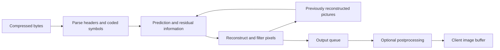
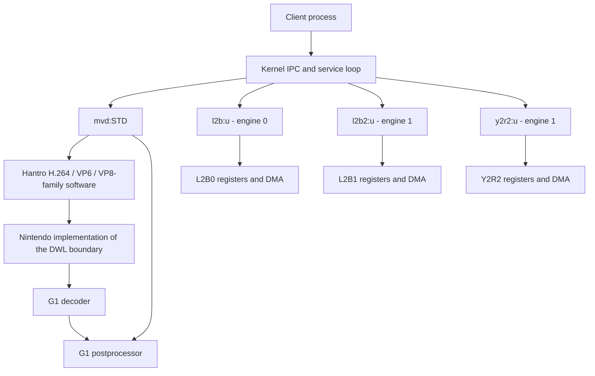
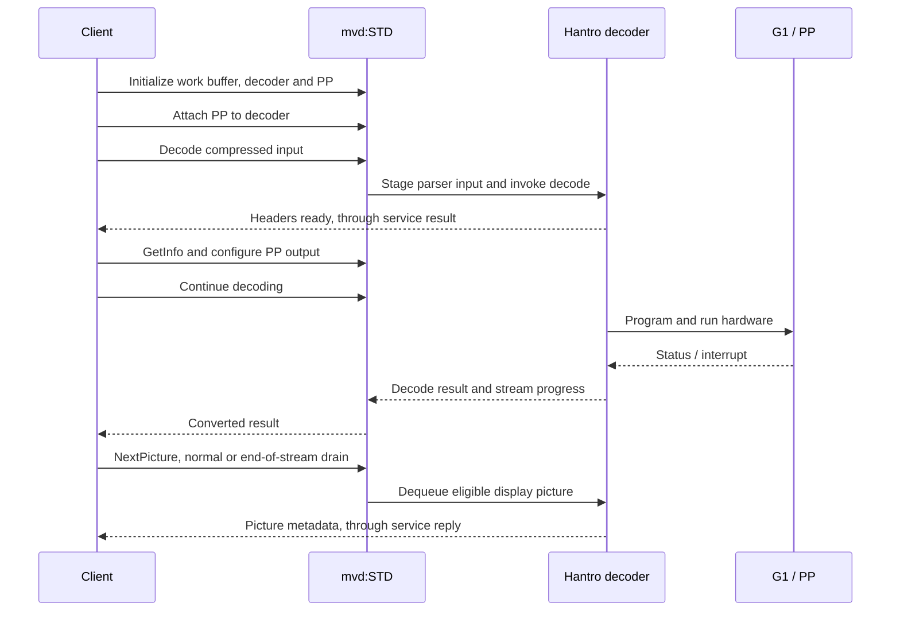
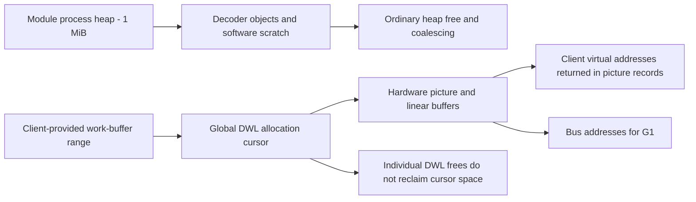

# MVD sysmodule: reverse-engineering writeup

## Table of contents

- [Scope and principal findings](#overview)
- [Codec and hardware concepts](#primer)
- [Service architecture and picture flow](#architecture)
- [External-code identification and ABI differences](#source)
- [G1 registers and effective capabilities](#hardware)
- [The mvd:STD IPC interface](#std)
- [Client API: full command IDs and prototypes](#client-api)
  - [mvd:STD](#client-api-std)
  - [l2b:u and l2b2:u](#client-api-l2b)
  - [y2r2:u](#client-api-y2r2)
  - [Lifecycle and convenience functions](#client-api-helpers)
- [Postprocessor configuration and validation](#pp)
- [Results, sizing and client memory](#memory)
- [Decoder internals and hardware coordination](#decoders)
- [H.264 parsing, prediction and picture buffers](#h264)
- [Parser metadata and codec support](#metadata)
- [MVC flags and the DPB-size latch](#mvc)
- [Workarounds and error recovery](#recovery)
- [VP6 entropy and Huffman machinery](#vp6)
- [L2B and Y2R2 IPC interfaces](#aux-services)
- [L2B and Y2R2 driver internals](#aux-drivers)
- [Pixel packing and numerical behavior](#pixels)
- [H.264 bit-depth evidence and hardware limits](#depth)
- [Nintendo DWL implementation](#dwl)
- [Startup, SDK services and runtime](#runtime)
- [Process heap and allocation](#heap)
- [Recovered definitions and remaining semantic gaps](#definitions)
- [Constant-data attribution and complete table catalog](#data)
- [Recovered pointer lifetimes and analysis views](#readability)
- [Disassembly corrections and analysis method](#corrections)
- [What is complete and what remains](#remaining)
- [Appendix A: recovered internal layouts](#layouts)
- [Appendix B: complete register-field inventory](#registers)
- [Appendix C: applied function names and prototypes](#functions)
- [References and evidence provenance](#references)


<a id="overview"></a>

## Scope and principal findings

MVD is a New Nintendo 3DS system module exposing compressed-picture decoding, postprocessing, and separate pixel-conversion engines. This writeup consolidates the investigation of the supplied `mvd.i64`, completed through 2026-09-28. It presents the latest conclusions by subject; earlier analysis-pass counts and superseded guesses are not the current status.

**MVD includes Hantro decoder-library code.** Matching API implementations, parser algorithms, error values, structures, constant tables and register-access machinery establish shared software ancestry. This is stronger evidence than compatibility with the Hantro G1 hardware alone. Nintendo-specific memory, kernel, IPC and interrupt implementations surround that library.

| Area | Current finding |
|---|---|
| Functions | 800 IDA function entries, zero remaining `sub_*` names; 786 names/prototypes in the explicit inventory below |
| Register definitions | 726 of 730 ordinals named; four retain unknown semantics |
| Constant data | Three codec-data passes added 88 arrays covering 15,802 bytes; auxiliary/platform tables are tracked separately |
| Main service | All 33 `mvd:STD` commands have functional roles |
| Auxiliary services | 23 commands shared by two L2B services, plus 45 Y2R2 commands: 91 auxiliary service/command combinations |
| Assumed hardware | One console revision, ASIC ID `0x67312398`, using the supplied GBATEK register excerpt as reference evidence |
| Effective codec capabilities | H.264, VP6, VP8/WebP enabled; MVC forced off; VP7 disabled by the supplied capability state |
| Postprocessing | The 284-byte service configuration is Hantro `PPConfig`; decoder selection and pixel-format selection are separate |
| Pixel packing | L2B/Y2R RGBA8888 uses increasing-address bytes `AA BB GG RR`; L2B replaces incoming alpha |
| Recovery paths | H.264 frame-number workaround and VP8 motion-vector concealment are disabled on the assumed target; ordinary freeze recovery remains relevant |

The 800-function count and 786-row inventory measure different things: some useful function names predate the explicit attribution inventory. Zero auto-generated names does not mean that every symbol has an exact upstream identity, every indirect target is known, or hardware conformance has been measured.

Addresses are **IDA virtual addresses**, unless explicitly labeled physical; they are not file offsets. Pointers and ordinary words in this ARM32 image are four bytes. `u8/u16/u32` and `s8/s16/s32` denote unsigned and signed integers of the indicated bit width. Structure offsets are bytes; G1 register-table word indices must be multiplied by four to obtain bank byte offsets.

The database originated from a GDB remote process and does not identify an exact firmware version or original executable checksum. Its hardware segments contain zero-filled placeholders, not captured device state. The supplied register excerpt is not a new measurement. No console decoding, malformed-input execution, throughput test or live MMIO experiment was performed. Findings about software branches are distinguished throughout from claims about silicon behavior.

The document is self-contained: explanations and recovered interfaces appear in the main chapters; full constant, structure, register and function inventories appear at the end. The original topic reports remain in `RE/` as an analysis record.


<a id="primer"></a>

## Codec and hardware concepts

### From a compressed stream to a picture

A compressed stream contains instructions for reconstructing pictures, not a flat array of display pixels. A **codec** defines how those instructions are encoded and decoded. A container such as MP4, WebM or RIFF additionally packages streams, metadata and timing; identifying a codec does not imply that this service parses its surrounding container.

A typical decoder predicts a small image region from neighboring pixels in the same picture (**intra prediction**) or from previously reconstructed pictures (**inter prediction**). A **motion vector** tells it where to sample a reference picture. The stream carries a correction, called the **residual**, for differences between prediction and the desired result. Transform and quantization coding represent that correction compactly. Entropy coding compresses the symbols further using their expected frequencies. Reconstruction combines prediction with decoded residuals and may filter block boundaries.

A **macroblock** covers a 16×16 luma region in the paths discussed here; smaller blocks can carry separate prediction or transform data. The stored picture may be padded to a macroblock boundary even when the visible dimensions are smaller. A crop rectangle specifies which pixels should be displayed. Stored width, coded width, visible width and row stride therefore need not be identical.



This diagram explains the data dependencies, not an assertion that every stage runs on the CPU. MVD parses and manages state in software, then programs the G1 accelerator for the relevant decoding/reconstruction path.

### H.264 vocabulary

H.264, also called AVC, separates coded data into **NAL units** (Network Abstraction Layer units). A NAL may carry a sequence parameter set (**SPS**), a picture parameter set (**PPS**), or a coded slice. The parameter sets describe how subsequent picture data must be interpreted. A **slice** contains coded regions of a picture; an **access unit** groups data belonging to a picture. Annex B framing separates NALs with start-code prefixes. Emulation-prevention bytes keep payload data from accidentally looking like those prefixes.

An **IDR** picture establishes a reference reset point. A decoder's **decoded picture buffer (DPB)** keeps reconstructed pictures needed for future prediction or pending display. Decode order can differ from display order: a reference needed by a B picture must be available before that B picture is decoded. **Picture order count (POC)** helps select display order; `frame_num` serves a different numbering role. A decoded picture consequently need not be immediately available for display. These terms follow the [H.264 specification](https://www.itu.int/rec/T-REC-H.264).

The remaining H.264 terms describe mechanisms visible in the recovered implementation:

| Term | Meaning needed to read this analysis |
|---|---|
| CAVLC | Context-adaptive variable-length coding, one way of coding transform/residual information |
| CABAC | Context-adaptive binary arithmetic coding, another entropy-coding method with probability contexts |
| VLC/RLC paths | Hantro's compressed-bitstream path versus software preparation of run/level and macroblock control data for the ASIC; these are implementation modes, not distinct video formats |
| Short-/long-term reference | A picture retained for prediction under different reference-management rules |
| MMCO | Memory-management control operation from the stream; changes which pictures remain references |
| VUI | Video usability information: aspect ratio, color/timing and buffering-related metadata |
| HRD/CPB | Hypothetical reference decoder / coded picture buffer: a model of compressed-data buffering and timing, distinct from reconstructed-picture DPB storage |
| SAR | Sample aspect ratio: the displayed width-to-height relationship of a sample |
| MVC | Multiview coding, an H.264 extension carrying related views; presence of its parser does not establish that MVD enables it |
| Field picture | One alternating-line field of interlaced video; a frame can contain top and bottom fields |
| Profile / level / bit depth | A coding-tool set, a set of resource limits, and precision per sample respectively; none is interchangeable with the other two |

For example, increasing output buffers can help with reordered pictures without changing the codec profile. Accepting an SPS marked as a high profile proves neither complete stream support nor ten-bit sample reconstruction.

### VP8, VP7, VP6 and WebP

VP8 uses key frames and inter frames. Key frames start without dependencies on previous pictures; inter frames can use retained **last**, **golden** and **alternate** reference pictures. These names describe reference roles, not three distinct output color planes. Some decoded pictures are retained without being shown. Probability contexts support its boolean arithmetic coder, and a frame can update those contexts or leave the previous contexts in force. Coefficient partitions divide coded residual data. This explains why MVD tracks both reference buffers and saved entropy state. [VP8 decoding guide, RFC 6386](https://www.rfc-editor.org/rfc/rfc6386)

VP6 and VP7 are separate codec generations, not VP8 profiles. The matched VP6 implementation has its own headers, probability state and Huffman-table machinery. MVD routes VP7, VP8 and its WebP mode through one API family, but their capability checks and buffer requirements differ.

**WebP is an image format with a container**, supporting more than one kind of payload. Lossy WebP uses VP8-coded image data; lossless WebP uses a different bitstream. The recovered MVD WebP mode takes the VP8-family intra-only path, including optional sliced output. This does not establish general RIFF parsing, lossless decoding, animation or arbitrary WebP feature support. [WebP container specification](https://developers.google.com/speed/webp/docs/riff_container)

**Error concealment** attempts to produce usable output after damaged or missing input. Repeating a previous picture is freeze recovery; estimating motion can produce an approximate new picture. Neither recreates missing source information exactly. Error concealment is not automatically a workaround for a hardware defect.

### A few more terms used in the recovered code

| Term | Plain-language meaning |
|---|---|
| I, P and B pictures/slices | Intra coding, prediction from a reference list, and prediction using two reference lists. The exact reference rules depend on the codec; these labels are not service result codes |
| Exp-Golomb code | A variable-length representation of integers used in many H.264 header fields |
| Huffman code | A prefix-code scheme giving symbols variable-length bit patterns; VP6 builds tables for its hardware path |
| Boolean arithmetic coder | A decoder that recovers binary decisions using a probability model; it is not simply reading one raw input bit per decision |
| Entropy context | Stored probability state for decoding future symbols; losing it can affect pictures after the damaged one |
| Run/level (RLC) data | Compact descriptions of zero runs and nonzero residual coefficient values |
| Quantizer / scaling list | Controls for reconstructing residual coefficient magnitudes; this differs from resizing the output image |
| Scan order | The order in which a two-dimensional block's coefficients are visited |
| Loop filter | Filtering in the reconstruction loop, whose output can itself be used as a reference |
| Segmentation in VP8 | Grouping blocks so that selected coding/filter parameters can differ; unrelated to virtual-memory segments |
| Golden / alternate reference | Retained prediction pictures; neither name means the frame is necessarily displayed now |
| Intra-only | A picture path that does not require previous decoded pictures for prediction, as used by the recovered WebP mode |
| ASIC / MMIO | The dedicated hardware circuit and its memory-mapped control/status registers |
| Synthesis configuration / fuses | Hardware feature reporting and configuration restrictions, which software combines into effective capabilities |
| DWL | Hantro's Decoder Wrapper Layer: the library's platform boundary for allocation, registers, reservation and waiting |
| SVC | An ARM supervisor-call instruction used here to enter a kernel service |
| TLS / BSS | Thread-local storage, and the program's zero-initialized static storage region |
| Vtable / callback | A table used for indirect method dispatch, and a function invoked through a stored callable address |
| Clean / invalidate / flush cache | Write dirty CPU data back, discard cached copies, or perform the combined maintenance operation named by the platform API |

### Pixel formats, conversion and transfer

Decoded video commonly separates luma **Y**, which carries brightness-like detail, from chroma **Cb/Cr** (often loosely called U/V), which carries color differences. In **4:2:0**, chroma has half the horizontal and vertical sample resolution of luma. An eight-bit 16×16 luma region therefore has 256 luma bytes plus two 8×8 chroma planes: **384 sample bytes**. Monochrome uses only luma.

**Planar** storage places Y, Cb and Cr separately. **Semiplanar** storage places Y separately and interleaves the two chroma components. Packed YUYV instead interleaves luma and chroma within one stream. **RGB/RGBA** stores color channels, optionally including alpha. A format's packed integer layout and its increasing-address byte sequence differ on a little-endian CPU. Row stride is the distance between rows; it need not equal visible width times bytes per pixel.

**Tiled** storage groups pixels into small blocks to suit texture/hardware access. Tiling changes pixel positions in memory, independently of channel byte order. A hardware FIFO is a streaming port, so its DMA endpoint is not necessarily the same address as the CPU's register window.

The G1 **postprocessor (PP)** can convert, resize, crop and apply other image operations. L2B and Y2R2 are separate engines: L2B converts RGB-family data to texture-oriented output; Y2R2 converts luma/chroma input to RGB-family output. Their format IDs must not be substituted for Hantro PP format constants.

**DMA** transfers data without copying every byte through ordinary CPU loads/stores. Cache maintenance makes CPU-visible buffers and DMA-visible memory agree. An **IRQ** is a hardware interrupt; an event exposes a notification to software. A **DRQ** is a DMA request condition. An engine's event, busy bit and receive-DMA completion are different observables.

A **virtual address** belongs to a process mapping; a **bus address** is the address supplied for hardware memory access. IPC transfers command words plus descriptors for handles or mapped buffers. A successful IPC transport only says the request/reply exchange completed; the operation's result word still needs interpretation.


<a id="architecture"></a>

## Service architecture and picture flow

The module registers four services, each allowing one session. The two L2B services share a dispatcher but have distinct engine contexts. `mvd:STD` has an eight-byte session context containing one decoder pointer and one PP pointer: H.264, VP6 and VP8-family instances are alternative lifetimes of the decoder slot.

| Service | Dispatcher | Context |
|---|---|---|
| mvd:STD | `0x1124E8` | `0x12100C` |
| l2b:u | `0x111E64` | `0x121220` |
| l2b2:u | `0x111E64` | `0x121270` |
| y2r2:u | `0x11328C` | `0x121014` |



The arrows between G1 and PP describe combined operation. PP also works standalone. L2B/Y2R2 are independently exposed conversion paths; this analysis does not require routing every decoder output through either one.



This is a representative H.264 sequence, not a requirement that every input submission yields headers or one output. A picture can remain queued for ordering, and one input can require multiple calls. `Peek` inspects without dequeuing. PP `GetNextOutput` selects a postprocessor buffer; it is not another compressed-input decoder.


<a id="source"></a>

## External-code identification and ABI differences

### Reference material

The source used for comparison is `/Users/elouan/Documents/git_dl/buildroot-ltc/system/hlibg1v6`, in buildroot-ltc commit `31cf5593a5bb4de4608425886e93f4be628f87f4`. Client-side comparison uses `/Users/elouan/Documents/git/libctru`, commit `0a376398d19505df3c236342827a3a72a42dd41e`, especially `libctru/source/services/mvd.c` and `libctru/include/3ds/services/mvd.h`.

[3DBrew MVD Services](https://www.3dbrew.org/wiki/MVD_Services) was consulted as a baseline, including its indexed revision 21607 when direct access returned HTTP 403. The findings below are independently grounded in the database and local source; the wiki's field names and experimental support claims are not treated as authoritative symbol information.

### Why this is shared code

Several independent fingerprints agree:

| Binary anchor | Source counterpart | Evidence |
|---|---|---|
| `0x107670` | `source/pp/ppapi.c: PPInit` | Same hardware product gate (`0x8170` / `0x6731`), DWL client 4, allocation/zero/init/configure/release sequence |
| `0x107A44` | `PPSetConfig` | Same multibuffer address substitution, previous/current configuration copies, BT.601/709 coefficient branches, format selection and hardware setup |
| `0x10635C` | `source/pp/ppinternal.c: PPCheckConfig` | Same sequence of input, crop, rotation, output, scaling, framebuffer, RGB, masks, deinterlace and range-map checks; same negative error vocabulary |
| `0x106AF0` | `PPDecCombinedModeEnable` | Same idle/already-linked checks and PP callback registration, with compiled codec cases reduced to 1, 6, 9 and 10 |
| `0x103BE0` | `source/h264high/h264decapi.c: H264DecInit` | Same no-reorder/freeze/smoothing/reference-format arguments, self-pointer validation design, capability gate and reference-filter setup |
| `0x102F2C` | `H264DecDecode` | Same 20-byte input, 12-byte output, parser/ASIC state machine, status values and stream-position accounting |
| `0x103AD4` | `H264DecGetInfo` | Same dimensions, range, matrix, crop, SAR, monochrome/interlace and DPB information, with an extra word in this build |
| `0x109628` | `source/vp6/vp6hwd_api.c: VP6DecInit` | Same DWL client 7, reference count clamped to 3..16, concealment and tiled-reference handling |
| `0x110EA0` | `source/vp8/vp8decapi.c: VP8DecInit` | Same VP7/VP8/WebP selector, DWL client 10, buffer minima 3/4/1 and mode-specific branches |
| `0x10F324`, `0x10E0FC` | `source/common/regdrv.c: SetDecRegister`, `GetDecRegister` | Identical table-driven word/width/shift insertion and extraction algorithm |
| `0x11A38C` | `source/common/8170table.h` | Ordered register triples align across long runs; 698 ordered source transfers initially; later one IRQ name and 26 call-site-derived names, then one G1-corroborated abort-control name; four entries remain unnamed |

Together these establish Hantro software ancestry at function and data-layout level. A generic Hantro-compatible register map alone would not establish that ancestry.

### Differences that affect type recovery

* The local Linux APIs have an added `mmuEnable` argument. The observed MVD H.264/VP6/VP8 initialization entry points do not take that argument; PP initialization takes only an instance-output pointer.
* `PPConfig` is exactly `0x11C` bytes and `PPOutputBuffers` is `0x8C` bytes in both the observed ABI and source.
* MVD H.264 info is `0x40` bytes, versus the reference header's `0x3C`. The additional word follows `interlacedSequence` and carries the DPB storage-mode state.
* MVD VP8 info is `0x28` bytes, versus source `0x24`; VP6 info is `0x24`, versus source `0x20`. Each has a zeroed byte plus padding before the final format word. Its semantic name remains unresolved.
* MVD VP8 picture is `0x40` bytes, with luma/chroma stride words before the output pointers. The source header lacks those two words. Format is stored with a byte write at the end.
* The recovered PP container is `0x57C` bytes. Its frame bookkeeping includes two bottom-field addresses per buffer, and its stored combined result is a signed halfword. Importing the reference container wholesale would mislabel later members.
* The capability structure is 100 bytes with reordered members and extra fields, versus the reference `DWLHwConfig_t`'s 84 bytes. Its first 22 words match the separate `DecHwConfig` definition, identifying `jpegProgSupport`; three extension words follow.
* The MVD register table contains 730 meaningful entries including the two aggregate IRQ fields; the local table has 701. Aligned names were transferred by ordered triple matching, not by copying enum ordinals.

* MVD linear memory descriptors are 12 bytes; the Linux `uid` word is absent. H.264 DPB is 1680 bytes, and decoder-to-PP interface is 104 bytes with two extra stride words. Internal container allocations are H.264 15860, VP6 2424 and VP8 4224 bytes.
* VP8 adds separate chroma buffers, stride controls and hardware-concealment state; the tiled-reference helper adds a DPB-mode argument. See [decoder internals](#decoders).

* MVD H.264 storage has distinct `mvcEnabled` and `mvcDpbLimit` words between `currentMarked` and `view`, where the supplied source has one `mvc` member. The API enable write and NAL gate use `mvcEnabled`; prefix processing copies it to `mvcDpbLimit`. The latter caps the requested DPB size at 8 in software-resource allocation, an additional condition absent from the supplied routine. See [MVC latch analysis](#mvc).
* MVD access-unit-boundary state is 76 bytes, with an extra masked previous frame number. VP8 adds coefficient-probability progress and a fully recovered concealment tail. Six concealment helpers have descriptive names because no exact counterpart was found in the local revision; this is not an attribution of authorship. VP6’s 4544-byte Huffman workspace is source-matched. See [H.264 parsing and DPB chapter](#h264).

These differences indicate a related Hantro branch, not a byte-identical build of the provided source revision. The exact upstream release and Nintendo's patch history are not established.

### Database treatment

Known library functions retain upstream API/internal names. Platform adaptations are explicitly distinguished: the DWL API wraps MVD heap allocation, cross-process copying and interrupt handling rather than Linux device nodes or `mmap`. The existence of `DWLInit` does **not** mean the Linux DWL implementation was included.

Public data types were imported where layouts match. `Mvd*` structures describe observed ABI variants. Unresolved container fields remain reserved instead of importing plausible but incompatible members. Original named service-dispatch functions were preserved; the old generic `ValidateConfig` and `ConvertErrorCode` names were refined.

[The function inventory](#functions) records applied names and prototypes. This is an inventory of identified functions, not a claim that every runtime, SDK, or internal decoder routine has been attributed to an exact source function.


<a id="hardware"></a>

## G1 registers and effective capabilities

### Register layout

The module uses the G1 register bank at virtual address `0x1ED07000`. The table-driven accessors are `SetDecRegister` (`0x10F324`) and `GetDecRegister` (`0x10E0FC`); masks start at `0x11A308`, and register-field triples at `0x11A38C`. Each triple holds register word index, field width and bit shift. A field's byte offset in the hardware bank is four times its word index.

| Bank offset | Purpose | Evidence |
|---|---|---|
| `0x000` | ASIC ID, product in high halfword | `DWLReadAsicID`, `0x10E044` |
| `0x004` | Decoder control/IRQ fields | Register table word 1 |
| `0x0C8` | Decoder synthesis configuration | `DWLReadAsicConfig`, `0x10DE0C` |
| `0x0D8` | Additional decoder synthesis configuration | Same |
| `0x0E4` | Decoder fuse status | `DWLReadAsicFuseStatus`, `0x101788` |
| `0x0F0` | PP control/IRQ fields, first PP shadow word | PP run/flush/refresh |
| `0x18C` | PP fuse status | Fuse reader |
| `0x190` | PP synthesis configuration | Configuration reader |

The PP container holds **41 register words**, representing bank words 60 through 100. Several PP calls form a pointer 60 words before this array when invoking the common register accessor. That is an indexing convention: the common register table uses absolute bank word numbers. It is not evidence of a full decoder shadow array inside the PP object.

### Register-name transfer

The binary table has 730 entries, versus 701 in the local source including aggregate IRQ entries. Copying the Linux enumeration unchanged would silently assign incorrect names after insertions.

Ordered `(word, width, shift)` sequences were aligned against `source/common/8170table.h`, using matching runs of at least three triples. This yielded 698 transferred names in the database's `MvdHwIf` enum. Subsequent call-site analysis identified 26 additional fields, including PP dimension/mask/clipping extensions, the 13-bit display width, VP8 stride/chroma controls and H.264 field-DPB mode. These use an `MVD_HWIF_` prefix to distinguish recovered semantics from transferred source names. The isolated source `HWIF_DEC_IRQ` entry was also confirmed from IRQ-clear callers, bringing that checkpoint to 725 named entries. The [definition follow-up](#definitions) adds `HWIF_DEC_ABORT_E` at ordinal 10 using independent G1 driver evidence, bringing the current total to 726; four remain unresolved. Field 19 is now `MVD_HWIF_DEC_DATA_DISC_E_ALIAS`, supported by the shared initializer’s source-matched data-discard operation at `0x10DD96`, in addition to its duplicate triple. Field 579 is now named `MVD_HWIF_VP8_CONCEALMENT_MODE` from the normal/concealment setup paths (values 0/1); values 2/3 remain unknown. Repeated triples are common because fields overlap for different codecs; sequence context is part of the evidence, and equal triples alone do not establish a semantic match. See [register appendix](#registers) for the exact mapping.

Register names inherited from other codec modes do **not** imply that their corresponding software decoders are compiled or accessible through IPC. The common register map spans more modes than this module exposes.

### Capability filtering

`DWLReadAsicConfig` first clears a 100-byte structure, reads synthesis words, conditionally reads fuse status for the applicable product IDs, and limits capabilities/dimensions to the fuse values. This differs from the local source's 84-byte `DWLHwConfig`; the separate source `DecHwConfig` matches the first 22 words as explained in the definition chapter. Applying that source structure wholesale would place several fields incorrectly.

The function extracts H.264, MPEG-4, VC-1, MPEG-2, JPEG, VP6, VP7, VP8, AVS, RealVideo, PP, reference-buffer and layout-related capabilities even though not all corresponding software codecs exist here. Decoder width combines low eleven bits of the first synthesis word with extension bits in the second. PP width uses thirteen bits of the PP synthesis word. PP presence gates both its configuration word and width.

Crucially, the MVC capability at structure word 20 is assigned **zero unconditionally** before fuse filtering, and is never enabled later. `H264DecSetMvc` checks it and returns format-not-supported. This is a concrete software restriction independent of unknown fuse values.

The product gates recognize legacy `0x8170` and special `0x6731` paths, with other version thresholds around `0x8190` and `0x9170`. Seeing those constants in branches does not identify the actual console ASIC ID. PP limits and feature workarounds vary by these branches.

`MvdDwlCreate` (`0x118CB0`) accepts client types 1 (H.264), 4 (PP), 7 (VP6) and 10 (VP8 family). `PPDecCombinedModeEnable` accepts only switch cases 1 (H.264), 6 (VP6), 9 (VP8) and 10 (WebP), although an initial range check admits 1..11. The two numbering schemes are different. They should not be conflated with either PP pixel formats or VP8DecFormat values.

`MvdBindDecoderInterrupt` (`0x114264`) creates the decoder event and binds interrupt `0x4F` once, guarded by a global initialized flag. L2B initialization reads interrupt IDs `0x45`/`0x46` from `0x11A000` for its two engines. These bindings are independent of whether the database contains a live register snapshot.

### Supplied GBATEK register dump

The user supplied the following GBATEK excerpt during the continuation. It is reference hardware evidence, **not a register capture from this database or an independently repeated measurement**. No placeholder MMIO bytes were patched with these values.

| Physical address | Bank offset | Value | Interpretation |
|---|---|---|---|
| `0x10207000` | `0x000` | `0x67312398` | Product `0x6731`, revision low halfword `0x2398` |
| `0x102070C8` | `0x0C8` | `0x07B4AF80` | Decoder synthesis word 1 |
| `0x102070D8` | `0x0D8` | `0xC09A0000` | Decoder synthesis word 2 |
| `0x102070E4` | `0x0E4` | `0x8516FFFF` | Decoder fuse word |
| `0x1020718C` | `0x18C` | `0xFFFFFFFF` | PP fuse word |
| `0x10207190` | `0x190` | `0xFF874780` | PP synthesis word |

The excerpt reports a 512-byte bank mirrored throughout `0x10207200..0x10207FFF`. Its R/W entries with `FFFFFFFF` are not treated as normal initialized decoder state. Physical offsets agree with the bank used at virtual `0x1ED07000` by MVD.

Applying the binary's synthesis extraction, product gates and fuse filtering to those six reference values gives:

| Capability | Synthesis | Fuse / software effect | Effective report |
|---|---:|---|---:|
| H.264 | 3 | Enabled | 3 |
| MPEG-4 | 1 | Fuse disabled | 0 |
| Sorenson Spark | 1 | Fuse disabled | 0 |
| VP6 | 1 | Enabled | 1 |
| VP7 | 0 | Fuse also disabled | 0 |
| VP8 | 1 | Enabled | 1 |
| WebP | 1 | Shares VP8 fuse check | 1 |
| MPEG-2, VC-1, JPEG, AVS, RealVideo, custom MPEG-4 | 0 | No enablement | 0 |
| MVC | 0 | Also unconditionally cleared by software | 0 |
| Maximum decoder width | 1920 | Fuse limit 1920 | 1920 pixels |
| Maximum PP output width | 1920 | Fuse limit 4096 | 1920 pixels |
| Reference buffer support | 1, plus synthesis/product flags | Fuse enabled | Bitmask 11 |
| Tiled references | 1 | No further removal | 1 |
| Hardware error concealment | 0 | — | 0 |
| Programmable stride | 0 | — | 0 |
| Field DPB ordering | 0 | — | 0 |

The H.264 capability value 3 is the library's high-profile hardware tier; it does not independently prove High10/10-bit decoding. The [hardware follow-up](#pixels) additionally establishes the fixed eight-bit DPB sample layout and proves both VP8 motion-vector-concealment entry calls are disabled under this reference capability state. The JPEG-extension bit is set, but JPEG decoding itself is absent from the effective report. A set extension bit is not sufficient to enable its parent codec.

PP is present. Its synthesis word advertises blending, deinterlacing, dithering, tiled 4×4 output, pixel-accurate output, blend cropping, configurable endian handling and tiled input. Scaling bits 27:26 are 3, selecting fast-scaling support mode 1 in `PPSelectOutputSize`; the PP fuse word does not remove these features. The software sets a separate maximum output height of 4096. These are capability/validation limits, not evidence that every combination is valid or has been executed.

`PPInitHW` enables a horizontal coefficient-rounding workaround only when `DWLReadAsicID() >> 3 == 216408617`, i.e. IDs `0x67311148..0x6731114F`. The supplied `0x67312398` does not meet this test.

### What the database cannot establish

The mapped hardware segments in this supplied database are zero-filled placeholders, including the ASIC ID, synthesis and fuse words. Their values must not be interpreted as captured hardware state. At the user’s instruction, the investigation now assumes a single console revision and uses the supplied GBATEK values as its target state. Revision-to-revision matching is therefore outside the remaining work; the assumption does not turn placeholder bytes into measured values.

The register-write allowlist matches the writable ranges of the supplied dump; see [DWL implementation](#dwl). No actual decoding, interrupt timing, cache-coherency or throughput measurements were performed. The [hardware-validation status](#remaining) records the remaining blockers, published Y2R numerical/timing evidence, and the observations required to settle actual High10, conversion-edge and peripheral-timing behavior.


<a id="std"></a>

## The mvd:STD IPC interface

### Dispatch and state

Dispatcher: `0x1124E8`. Its session context begins with a decoder pointer at `+0` and a postprocessor pointer at `+4`; the decoder slot is shared by the H.264, VP6 and VP8 families. These are alternative decoder lifetimes, not three independently stored instances.

The dispatcher selects the low byte of the command ID (`header >> 16`). For commands with translated handles/buffers it checks the expected header/descriptor shape; many scalar-only commands go directly to their handler without an equivalent full-header check. The table gives the normal request encoding, not a promise that every malformed header is rejected.

A process handle uses the two-word shared-handle descriptor (`0`, handle). Mapped read/write buffers have descriptor low nibbles `0xA`/`0xC`. Most replies contain one normal result word; larger results are listed below. The service constructs a command-zero error reply for invalid descriptors or unknown commands.

### Command table

Client function declarations for every row are in the [full command ID and prototype reference](#client-api-std).

| Command number | Full command ID / request header | Meaning | Handler | Request after header | Reply after header |
|---|---|---|---|---|---|
| `0x01` | `0x00010082` | Initialize | `0x112D88` | client work-buffer VA, size; process handle | result |
| `0x02` | `0x00020000` | Shutdown | `0x112CBC` | — | result |
| `0x03` | `0x00030300` | CalculateWorkBufSize | `0x11307C` | 12-word packed request; meaningful bytes and dimensions below | result, byte count |
| `0x04` | `0x000400C0` | CalculateImageSize | `0x1130B2` | width, height, output format | result, byte count |
| `0x05` | `0x00050100` | H264Initialize | `0x113150` | s8 noOutputReordering, s8 freezeConcealment, s8 displaySmoothing, referenceFrameFormat | result |
| `0x06` | `0x00060000` | H264EnableMvc | `0x112CA8` | — | result |
| `0x07` | `0x00070000` | H264Release | `0x112D16` | — | result |
| `0x08` | `0x00080142` | H264Decode / ProcessNALUnit | `0x112C04` | stream VA, bus address, size, picture ID, skipNonReference; process handle | result, current stream VA, current bus address, bytes left |
| `0x09` | `0x00090042` | H264NextPicture / ControlFrameRendering | `0x112EC0` | s8 endOfStream; process handle | result, 0x40-byte picture |
| `0x0A` | `0x000A0000` | H264GetInfo | `0x112CE0` | — | result, 0x40-byte info |
| `0x0B` | `0x000B0000` | H264Peek | `0x113164` | — | result, 0x40-byte picture |
| `0x0C` | `0x000C0100` | Vp8Initialize | `0x113118` | u8 format, s8 freezeConcealment, frame-buffer count, referenceFrameFormat | result |
| `0x0D` | `0x000D0000` | Vp8Release | `0x112C9C` | — | result |
| `0x0E` | `0x000E0202` | Vp8Decode | `0x1131E0` | 8-word VP8DecInput; process handle | result, one output word |
| `0x0F` | `0x000F0042` | Vp8NextPicture | `0x112E8C` | s8 endOfStream; process handle | result, 0x40-byte picture |
| `0x10` | `0x00100000` | Vp8GetInfo | `0x112C7E` | — | result, 0x28-byte info |
| `0x11` | `0x00110000` | Vp8Peek | `0x11313E` | — | result, 0x40-byte picture |
| `0x12` | `0x001200C0` | Vp6Initialize | `0x113108` | s8 freezeConcealment, frame-buffer count, referenceFrameFormat | result |
| `0x13` | `0x00130000` | Vp6Release | `0x112C90` | — | result |
| `0x14` | `0x001400C2` | Vp6Decode | `0x113178` | stream VA, bus address, size; process handle | result, one output word |
| `0x15` | `0x00150042` | Vp6NextPicture | `0x112E58` | s8 endOfStream; process handle | result, 0x24-byte picture |
| `0x16` | `0x00160000` | Vp6GetInfo | `0x112C6C` | — | result, 0x24-byte info |
| `0x17` | `0x00170000` | Vp6Peek | `0x11312C` | — | result, 0x24-byte picture |
| `0x18` | `0x00180000` | PpInitialize | `0x1130C8` | — | result |
| `0x19` | `0x00190000` | PpRelease | `0x113248` | — | result |
| `0x1A` | `0x001A0000` | PpGetResult / standalone conversion | `0x112D04` | — | result |
| `0x1B` | `0x001B0040` | PpEnableCombinedMode | `0x112FB4` | u8 decoder type | result |
| `0x1C` | `0x001C0000` | PpDisableCombinedMode | `0x112FCA` | — | result |
| `0x1D` | `0x001D0042` | PpGetConfig | `0x112CF2` | size word; writable mapped buffer | result; returned mapped-buffer descriptor/address |
| `0x1E` | `0x001E0044` | PpSetConfig | `0x112D24` | size word; process handle; readable mapped buffer | result; returned mapped-buffer descriptor/address |
| `0x1F` | `0x001F0902` | SetupOutputBuffers | `0x112EF4` | count, 17 VA pairs, per-buffer size; process handle | result |
| `0x20` | `0x00200002` | GetNextOutput | `0x112DE8` | process handle | result, luma/RGB client VA, chroma client VA |
| `0x21` | `0x00210100` | OverrideOutputBuffers | `0x112FE0` | current luma VA, current chroma VA, replacement luma VA, replacement chroma VA | result |

### Lifecycle and decoding

For H.264 with postprocessing, the logical sequence is initialize work-buffer access (`01`), initialize decoder (`05`), initialize PP (`18`), attach PP to H.264 (`1B`, value 1), decode (`08`), inspect info after headers (`0A`), configure output (`1E`), and retrieve pictures (`09`). Retrieval invokes the linked postprocessor as needed. At end of stream, use a nonzero `endOfStream` to flush pending output. Detach (`1C`), release PP (`19`), release decoder (`07`), then shut down (`02`). This explains the corresponding sequence in libctru.

`09` is an end-of-stream-aware picture dequeue operation. A zero argument means normal operation; a nonzero value requests draining/flush behavior. Its returned `0x17002` indicates a populated picture. It is not simply an asynchronous conversion-busy flag. `0B` peeks rather than dequeuing.

For standalone pixel conversion, no decoder is needed: initialize, initialize PP, set configuration, call `1A`, then release PP and shut down. `PPGetResult` checks idle state and, when no decoder is attached, runs the PP and waits for it. With a decoder attached it returns the stored combined-operation result instead.

`05` arguments correspond directly to Hantro's no-output-reordering, freeze concealment, display smoothing, and reference-frame format. The three byte-sized values are sign-extended by the IPC dispatcher. The reference-format word uses bit 0 for tiled references and bit 30 for field-DPB support in this build. These are not pixel-format values.

`06` invokes `H264DecSetMvc`. It checks the capability structure's MVC field, which this build forces to zero. Thus its existence in the ABI does not establish working MVC support. The gated write is now identified as `storage.mvcEnabled = 1` at `+0x39DC`; [the MVC state analysis](#mvc) distinguishes this request flag from the neighboring parser state.

#### Profile and bit-depth limits

The SPS parser `h264bsdDecodeSeqParamSet` at `0x116F78` has the Hantro high-profile syntax path for `profile_idc >= 100`. It reads `chroma_format_idc`, then both unsigned Exp-Golomb `bit_depth_*_minus8` fields. The latter values are overwritten in a temporary and are neither retained in the recovered SPS structure nor numerically validated there. The chroma-format value is also not bounded to one in this block. This matches the supplied source's parsing behavior, including its ineffective chroma-range check.

Consequently, an accepted SPS or a successful browser playback experiment does not by itself establish native 10-bit, 4:2:2 or 4:4:4 reconstruction. This analysis does not validate the wiki's empirical High10 support table. It establishes the parser behavior and capability-dependent decoder paths; an actual profile/bit-depth support matrix still requires correctly characterized streams and hardware output comparison. Likewise, the work-size helper's 17-entry level table is allocation logic, not a list of guaranteed hardware-supported levels.

### Other codec groups

`0C` format values are 1 = VP7, 2 = VP8, 3 = WebP. Capability checks are performed for VP7 or VP8/WebP. Frame-buffer counts are capped at 16, with minima 3 for VP7 and 4 for VP8; WebP uses one. `12` initializes VP6, with frame-buffer count clamped to 3..16. Concealment can be disabled by the old-product compatibility path.

For PP attachment (`1B`), the function first range-checks 1..11 but the compiled switch implements **only** 1 = H.264, 6 = VP6, 9 = VP8, 10 = WebP. Other values return parameter error. VP7 initialization exists, but there is no separate VP7 PP attachment case; do not infer full combined-mode support from the range check.

`0E` consumes the eight fields of `VP8DecInput`: stream VA, stream bus address, byte length, WebP slice height, optional luma VA, luma bus address, optional chroma VA, chroma bus address. The service stages the input stream, but the additional user-picture pointers are forwarded with the input structure. Their accepted use depends on the decoder's WebP and buffer-mode paths.

### Output structures

All offsets below are bytes. Pointer values are 32-bit.

#### H.264 info, 0x40 bytes (`0A`)

| Offset | Field |
|---|---|
| 00, 04 | stored picture width, height |
| 08, 0C | video range, matrix coefficients |
| 10, 14, 18, 1C | crop left, crop width, crop top, crop height |
| 20 | output pixel format |
| 24, 28 | sample aspect ratio width, height |
| 2C, 30 | monochrome, interlaced sequence |
| 34 | DPB storage mode: frame/field state, initialized to -1 before sequence setup |
| 38, 3C | picture buffer count, multibuffer PP requirement |

#### H.264 picture, 0x40 bytes (`09`, `0B`)

`00/04`: stored width/height; `08/0C/10/14`: crop left/width/top/height; `18/1C`: output pointer/bus address; `20`: picture ID; `24`: IDR flag; `28`: concealed macroblock count; `2C`: interlaced; `30`: field picture; `34`: top field; `38`: MVC view ID; `3C`: output layout byte (raster/tiled), followed by padding. Peek does not necessarily populate every field that dequeue populates. Replies copy the full structure even on paths that do not fill it; consumers must inspect the result before using fields.

#### VP8 info, 0x28 bytes (`10`)

`00/04`: version/profile; `08/0C`: coded width/height; `10/14`: rounded frame width/height; `18/1C`: scaled width/height; `20`: `constantZero`, one byte written as zero on success; `21..23`: padding not initialized by the getter; `24`: output pixel format. The original purpose of the extra byte is unknown, but its [zero-only behavior is established](#mvc).

#### VP8 picture, 0x40 bytes (`0F`, `11`)

`00/04`: coded width/height; `08/0C`: frame width/height; `10/14`: luma/chroma strides; `18/1C`: luma pointer/bus address; `20/24`: chroma pointer/bus address; `28`: picture ID; `2C`: intra flag; `30`: golden-frame flag; `34`: concealed macroblocks; `38`: slice rows; `3C`: output layout byte plus padding. Strides select stored stride values when nonzero, otherwise the frame stride. Several picture metadata fields are explicitly zeroed in this build.

#### VP6 info and picture, each 0x24 bytes (`15`..`17`)

Info: version, profile, frame width, frame height, scaled width, scaled height, scaling mode, `constantZero` byte at `1C`, padding at `1D..1F`, output pixel format at `20`. The byte is zero on success; the getter does not initialize the padding. Both VP6/VP8 replies copy their full records, including padding, and early errors do not guarantee initialized metadata.

Picture: frame width, frame height, output pointer, output bus address, picture ID, intra flag, golden-frame flag, concealed macroblocks, output layout byte plus padding. The observed next-picture routine zeroes picture ID, intra/golden flags, and concealed-macroblock count.

### Configuration transport

`1D` copies `0x11C` bytes from the current Hantro configuration. `1E` passes the mapped configuration directly to `PPSetConfig`. In both cases the explicit size word is not used to bound the configuration access; descriptor length is recovered mainly to build the returned descriptor. Do not interpret the caller-supplied size as a server-side structure-version negotiation.

The lower PP routine can overwrite the output addresses in the supplied configuration when multibuffer mode is active. Other state changes include keeping the previous configuration and installing standard color-transform coefficients in its internal copy. See [postprocessor chapter](#pp).

### Multibuffer output

`1F` translates client VAs into bus addresses, saves both representations and calls `PPDecSetMultipleOutput`. The Hantro routine requires 1..17 entries, a linked decoder and nonzero luma addresses, with a legacy-product restriction. Its validation happens **after** the service wrapper's translation loop; the wrapper does not clamp that first loop to 17.

`20` asks PP for the next selected output, then matches its luma bus address to saved mappings and returns the corresponding client VA pair. It can rerun PP when a buffered picture's configuration ID differs from the current setup. It does not mean dequeue the next compressed input frame.

`21` replaces the output at PP's current display index if both current addresses match, with idle/combined/multibuffer checks. It is not inherently restricted to entry zero. The wrapper saves one extra replacement mapping on its first override only, so repeated overrides are not a general-purpose refresh of every VA mapping.

See [results and memory chapter](#memory) for static implementation defects and [analysis method and corrections](#corrections) for verification limits.


<a id="client-api"></a>

## Client API: full command IDs and prototypes

This is the complete client-facing C interface in the maintained [MVD](libctru-mvd/include/3ds/services/mvd.h), [L2B](libctru-mvd/include/3ds/services/l2b.h) and [Y2R2](libctru-mvd/include/3ds/services/y2r2.h) headers. Prototypes below reproduce those declarations, including parameter names, pointer types and `const` qualifiers. They are **client wrapper prototypes**, not sysmodule handler prototypes: the session/context pointer is implicit in the client, and process-handle descriptors are constructed by the wrapper.

**Full command ID** below means the complete 32-bit IPC request header written to `cmdbuf[0]`, displayed with eight hexadecimal digits. It includes the command number and both payload-word counts:

```c
full_command_id = (command_number << 16) | (normal_words << 6) | translated_words;
```

For example, `MVDSTD_ProcessNALUnit` sends **`0x00080142`**, not just command number `0x08`: it carries five normal words and two translated words for the shared process handle. Output pointer arguments identify client destinations populated from the reply; they do not automatically contribute request words. The mapped PP configuration buffers are explicit exceptions, detailed in the [STD transport table](#std).

The command number occupies the upper 16 bits, although these dispatchers normally select only its low byte. Request-header acceptance rules remain those described in the service chapters. The values below are the headers **actually constructed by the completed client**, rather than every header a permissive scalar dispatcher might accept. They are request headers, not reply headers. A client validation failure can return before any IPC is sent.

The 101 direct command wrappers cover **124 service/command pairs**: 33 STD commands, 23 commands for each of the two L2B services, and 45 Y2R2 commands. All 14 additional public lifecycle/convenience/inline functions are listed separately with their underlying command sequences or an explicit “no command” designation.

<a id="client-api-std"></a>

### mvd:STD command prototypes

These calls use the active `mvd:STD` handle. Use `mvdstdOpen` for an explicit codec/PP lifecycle, or the convenience initializer for standalone PP or H.264 with PP. Only one decoder family occupies the session at a time. `MVDSTD_InputFormat` names decoded pixels entering PP; it is not a codec selector.

| Full command ID (`cmdbuf[0]`) | Client C prototype |
|---|---|
| `0x00010082` | `Result MVDSTD_Initialize(u32* work_buffer, u32 size);` |
| `0x00020000` | `Result MVDSTD_Shutdown(void);` |
| `0x00030300` | `Result MVDSTD_CalculateWorkBufSize(const MVDSTD_CalculateWorkBufSizeConfig* config, u32* size);` |
| `0x000400C0` | `Result MVDSTD_CalculateImageSize(u32 width, u32 height, MVDSTD_PixelFormat format, u32* size);` |
| `0x00050100` | `Result MVDSTD_H264Initialize(s8 no_output_reordering, s8 freeze_concealment, s8 display_smoothing, u32 reference_format);` |
| `0x00060000` | `Result MVDSTD_H264EnableMvc(void);` |
| `0x00070000` | `Result MVDSTD_H264Release(void);` |
| `0x00080142` | `Result MVDSTD_ProcessNALUnit(u32 stream_vaddr, u32 stream_bus_address, u32 size, u32 picture_id, u32 skip_nonreference, MVDSTD_ProcessNALUnitOut* out);` |
| `0x00090042` | `Result MVDSTD_H264NextPicture(s8 end_of_stream, MVDSTD_H264Picture* picture);` |
| `0x000A0000` | `Result MVDSTD_H264GetInfo(MVDSTD_H264Info* info);` |
| `0x000B0000` | `Result MVDSTD_H264Peek(MVDSTD_H264Picture* picture);` |
| `0x000C0100` | `Result MVDSTD_Vp8Initialize(MVDSTD_Vp8Format format, s8 freeze_concealment, u32 buffer_count, u32 reference_format);` |
| `0x000D0000` | `Result MVDSTD_Vp8Release(void);` |
| `0x000E0202` | `Result MVDSTD_Vp8Decode(const MVDSTD_Vp8Input* input);` |
| `0x000F0042` | `Result MVDSTD_Vp8NextPicture(s8 end_of_stream, MVDSTD_Vp8Picture* picture);` |
| `0x00100000` | `Result MVDSTD_Vp8GetInfo(MVDSTD_Vp8Info* info);` |
| `0x00110000` | `Result MVDSTD_Vp8Peek(MVDSTD_Vp8Picture* picture);` |
| `0x001200C0` | `Result MVDSTD_Vp6Initialize(s8 freeze_concealment, u32 buffer_count, u32 reference_format);` |
| `0x00130000` | `Result MVDSTD_Vp6Release(void);` |
| `0x001400C2` | `Result MVDSTD_Vp6Decode(u32 stream_vaddr, u32 stream_bus_address, u32 size);` |
| `0x00150042` | `Result MVDSTD_Vp6NextPicture(s8 end_of_stream, MVDSTD_Vp6Picture* picture);` |
| `0x00160000` | `Result MVDSTD_Vp6GetInfo(MVDSTD_Vp6Info* info);` |
| `0x00170000` | `Result MVDSTD_Vp6Peek(MVDSTD_Vp6Picture* picture);` |
| `0x00180000` | `Result MVDSTD_PpInitialize(void);` |
| `0x00190000` | `Result MVDSTD_PpRelease(void);` |
| `0x001A0000` | `Result MVDSTD_PpGetResult(void);` |
| `0x001B0040` | `Result MVDSTD_PpEnableCombinedMode(u8 decoder_type);` |
| `0x001C0000` | `Result MVDSTD_PpDisableCombinedMode(void);` |
| `0x001D0042` | `Result MVDSTD_GetConfig(MVDSTD_Config* config);` |
| `0x001E0044` | `Result MVDSTD_SetConfig(MVDSTD_Config* config);` |
| `0x001F0902` | `Result mvdstdSetupOutputBuffers(MVDSTD_OutputBuffersEntryList* entrylist, u32 bufsize);` |
| `0x00200002` | `Result MVDSTD_GetNextOutput(MVDSTD_OutputBuffersEntry* output);` |
| `0x00210100` | `Result mvdstdOverrideOutputBuffers(void* cur_outdata0, void* cur_outdata1, void* new_outdata0, void* new_outdata1);` |

<a id="client-api-l2b"></a>

### l2b:u and l2b2:u command prototypes

**Every row applies to both services with the same full command ID.** Pass `L2B_ENGINE_0` for `l2b:u` or `L2B_ENGINE_1` for `l2b2:u`; the `engine` argument selects a local service handle and is not an additional IPC payload word. Open the selected service with `l2bInit(engine)`. DMA wrappers append the current-process shared handle internally.

| Full command ID (`cmdbuf[0]`) | Client C prototype |
|---|---|
| `0x00010040` | `Result L2BU_SetInputFormat(L2B_Engine engine, L2BU_Format value);` |
| `0x00020000` | `Result L2BU_GetInputFormat(L2B_Engine engine, L2BU_Format* value);` |
| `0x00030040` | `Result L2BU_SetOutputFormat(L2B_Engine engine, L2BU_Format value);` |
| `0x00040000` | `Result L2BU_GetOutputFormat(L2B_Engine engine, L2BU_Format* value);` |
| `0x00050040` | `Result L2BU_SetTransferEndInterrupt(L2B_Engine engine, bool value);` |
| `0x00060000` | `Result L2BU_GetTransferEndInterrupt(L2B_Engine engine, bool* value);` |
| `0x00070000` | `Result L2BU_GetTransferEndEvent(L2B_Engine engine, Handle* event);` |
| `0x00080102` | `Result L2BU_SetSending(L2B_Engine engine, const void* buffer, u32 size, s16 transfer_unit, s16 transfer_gap);` |
| `0x00090000` | `Result L2BU_IsDoneSending(L2B_Engine engine, bool* value);` |
| `0x000A0102` | `Result L2BU_SetReceiving(L2B_Engine engine, void* buffer, u32 size, s16 transfer_unit, s16 transfer_gap);` |
| `0x000B0000` | `Result L2BU_IsDoneReceiving(L2B_Engine engine, bool* value);` |
| `0x000C0040` | `Result L2BU_SetInputLineWidth(L2B_Engine engine, u16 value);` |
| `0x000D0000` | `Result L2BU_GetInputLineWidth(L2B_Engine engine, u16* value);` |
| `0x000E0040` | `Result L2BU_SetInputLines(L2B_Engine engine, u16 value);` |
| `0x000F0000` | `Result L2BU_GetInputLines(L2B_Engine engine, u16* value);` |
| `0x00100040` | `Result L2BU_SetAlpha(L2B_Engine engine, u16 value);` |
| `0x00110000` | `Result L2BU_GetAlpha(L2B_Engine engine, u16* value);` |
| `0x00120000` | `Result L2BU_StartConversion(L2B_Engine engine);` |
| `0x00130000` | `Result L2BU_StopConversion(L2B_Engine engine);` |
| `0x00140000` | `Result L2BU_IsBusyConversion(L2B_Engine engine, bool* value);` |
| `0x00150080` | `Result L2BU_SetPackageParameter(L2B_Engine engine, const L2BU_ConversionParams* params);` |
| `0x00160000` | `Result L2BU_GetPackageParameter(L2B_Engine engine, L2BU_ConversionParams* params);` |
| `0x00170000` | `Result L2BU_PingProcess(L2B_Engine engine, u8* value);` |

<a id="client-api-y2r2"></a>

### y2r2:u command prototypes

These calls use the `y2r2:u` handle acquired by `y2r2Init`. The separate upstream `Y2RU_*` interface targets `y2r:u`, not this service. The completed copy uses the `Y2R2U_*` namespace so both clients can coexist.

`Y2R2U_SetConversionParams` sends **`0x002900C0`**: command `0x29`, three normal words, no translated words. The unmodified upstream `Y2RU_SetConversionParams` sends **`0x002901C0`**, advertising seven normal words although its structure copy fills only three. This writeup records both values explicitly; the table uses the completed MVD client's three-word request. The additional `GetConversionParams` command sends **`0x002D0000`** regardless of the oversized word count in its reply.

| Full command ID (`cmdbuf[0]`) | Client C prototype |
|---|---|
| `0x00010040` | `Result Y2R2U_SetInputFormat(Y2R2U_InputFormat format);` |
| `0x00020000` | `Result Y2R2U_GetInputFormat(Y2R2U_InputFormat* format);` |
| `0x00030040` | `Result Y2R2U_SetOutputFormat(Y2R2U_OutputFormat format);` |
| `0x00040000` | `Result Y2R2U_GetOutputFormat(Y2R2U_OutputFormat* format);` |
| `0x00050040` | `Result Y2R2U_SetRotation(Y2R2U_Rotation rotation);` |
| `0x00060000` | `Result Y2R2U_GetRotation(Y2R2U_Rotation* rotation);` |
| `0x00070040` | `Result Y2R2U_SetBlockAlignment(Y2R2U_BlockAlignment alignment);` |
| `0x00080000` | `Result Y2R2U_GetBlockAlignment(Y2R2U_BlockAlignment* alignment);` |
| `0x00090040` | `Result Y2R2U_SetSpacialDithering(bool enable);` |
| `0x000A0000` | `Result Y2R2U_GetSpacialDithering(bool* enabled);` |
| `0x000B0040` | `Result Y2R2U_SetTemporalDithering(bool enable);` |
| `0x000C0000` | `Result Y2R2U_GetTemporalDithering(bool* enabled);` |
| `0x000D0040` | `Result Y2R2U_SetTransferEndInterrupt(bool should_interrupt);` |
| `0x000E0000` | `Result Y2R2U_GetTransferEndInterrupt(bool* should_interrupt);` |
| `0x000F0000` | `Result Y2R2U_GetTransferEndEvent(Handle* end_event);` |
| `0x00100102` | `Result Y2R2U_SetSendingY(const void* src_buf, u32 image_size, s16 transfer_unit, s16 transfer_gap);` |
| `0x00110102` | `Result Y2R2U_SetSendingU(const void* src_buf, u32 image_size, s16 transfer_unit, s16 transfer_gap);` |
| `0x00120102` | `Result Y2R2U_SetSendingV(const void* src_buf, u32 image_size, s16 transfer_unit, s16 transfer_gap);` |
| `0x00130102` | `Result Y2R2U_SetSendingYUYV(const void* src_buf, u32 image_size, s16 transfer_unit, s16 transfer_gap);` |
| `0x00140000` | `Result Y2R2U_IsDoneSendingYUYV(bool* is_done);` |
| `0x00150000` | `Result Y2R2U_IsDoneSendingY(bool* is_done);` |
| `0x00160000` | `Result Y2R2U_IsDoneSendingU(bool* is_done);` |
| `0x00170000` | `Result Y2R2U_IsDoneSendingV(bool* is_done);` |
| `0x00180102` | `Result Y2R2U_SetReceiving(void* dst_buf, u32 image_size, s16 transfer_unit, s16 transfer_gap);` |
| `0x00190000` | `Result Y2R2U_IsDoneReceiving(bool* is_done);` |
| `0x001A0040` | `Result Y2R2U_SetInputLineWidth(u16 line_width);` |
| `0x001B0000` | `Result Y2R2U_GetInputLineWidth(u16* line_width);` |
| `0x001C0040` | `Result Y2R2U_SetInputLines(u16 num_lines);` |
| `0x001D0000` | `Result Y2R2U_GetInputLines(u16* num_lines);` |
| `0x001E0100` | `Result Y2R2U_SetCoefficients(const Y2R2U_ColorCoefficients* coefficients);` |
| `0x001F0000` | `Result Y2R2U_GetCoefficients(Y2R2U_ColorCoefficients* coefficients);` |
| `0x00200040` | `Result Y2R2U_SetStandardCoefficient(Y2R2U_StandardCoefficient coefficient);` |
| `0x00210040` | `Result Y2R2U_GetStandardCoefficient(Y2R2U_ColorCoefficients* coefficients, Y2R2U_StandardCoefficient standardCoeff);` |
| `0x00220040` | `Result Y2R2U_SetAlpha(u16 alpha);` |
| `0x00230000` | `Result Y2R2U_GetAlpha(u16* alpha);` |
| `0x00240200` | `Result Y2R2U_SetDitheringWeightParams(const Y2R2U_DitheringWeightParams* params);` |
| `0x00250000` | `Result Y2R2U_GetDitheringWeightParams(Y2R2U_DitheringWeightParams* params);` |
| `0x00260000` | `Result Y2R2U_StartConversion(void);` |
| `0x00270000` | `Result Y2R2U_StopConversion(void);` |
| `0x00280000` | `Result Y2R2U_IsBusyConversion(bool* is_busy);` |
| `0x002900C0` | `Result Y2R2U_SetConversionParams(const Y2R2U_ConversionParams* params);` |
| `0x002A0000` | `Result Y2R2U_PingProcess(u8* ping);` |
| `0x002B0000` | `Result Y2R2U_DriverInitialize(void);` |
| `0x002C0000` | `Result Y2R2U_DriverFinalize(void);` |
| `0x002D0000` | `Result Y2R2U_GetConversionParams(Y2R2U_ConversionParams* params);` |

<a id="client-api-helpers"></a>

### Lifecycle and convenience function prototypes

These functions do not each correspond to a new service command. The sequence column names only commands on the target MVD/L2B/Y2R2 service; service-manager requests and kernel SVCs used to acquire/close handles are separate. Sequences describe valid calls and the ordinary successful path, with the stated reference-count and mode conditions.

| Client C prototype | Full command ID(s) or local operation | Behavior |
|---|---|---|
| `Result mvdstdOpen(void);` | None on `mvd:STD` | Acquires its handle through the service manager; allocates no work buffer and sends no STD command |
| `void mvdstdClose(void);` | None on `mvd:STD` | Closes the raw handle; the caller must already have released codec/PP state and called Shutdown |
| `Result mvdstdInit(MVDSTD_Mode mode, MVDSTD_InputFormat input_type, MVDSTD_OutputFormat output_type, u32 size, MVDSTD_InitStruct* initstruct);` | `0x00010082`, optional `0x00050100`, `0x00180000`, optional `0x001B0040` | First initialization: Initialize → H264Initialize in video mode → PpInitialize → attach H.264 in video mode. Repeated successful acquisition only increments the reference count; failure cleanup releases the components already initialized |
| `void mvdstdExit(void);` | Optional `0x00090042` and `0x001C0000`; `0x00190000`; optional `0x00070000`; `0x00020000` | Last reference only: video mode drains with endOfStream=1 and detaches PP; release PP, release H.264 in video mode, then Shutdown and close/free client resources |
| `Result mvdstdCalculateBufferSize(const MVDSTD_CalculateWorkBufSizeConfig* config, u32* size_out);` | `0x00030300` | Calls CalculateWorkBufSize; temporarily acquires and closes the service handle if necessary |
| `void mvdstdGenerateDefaultConfig(MVDSTD_Config* config, u32 input_width, u32 input_height, u32 output_width, u32 output_height, u32* vaddr_colorconv_indata, u32* vaddr_outdata0, u32* vaddr_outdata1);` | None | Builds the client-side PP configuration and translates supplied VAs to bus addresses |
| `Result mvdstdConvertImage(MVDSTD_Config* config);` | `0x001E0044` → `0x001A0000` | Sets PP configuration, then runs standalone PP if configuration succeeded |
| `Result mvdstdProcessVideoFrame(void* inbuf_vaddr, size_t size, u32 flag, MVDSTD_ProcessNALUnitOut* out);` | `0x00080142` | Calls ProcessNALUnit with the new LINEAR input alias and a picture ID cycling through 0..17 |
| `Result mvdstdRenderVideoFrame(MVDSTD_Config* config, bool wait);` | Optional `0x001E0044`; `0x00090042` | Sets configuration when non-NULL, then dequeues with endOfStream=0; wait=true repeats while a picture is returned |
| `static inline bool mvdstdIsLegacyDecodeSuccess(Result result);` | None | Local inline result predicate; does not call the service |
| `Result l2bInit(L2B_Engine engine);` | None on the selected L2B service | Acquires the selected service handle through the service manager; first-session driver setup is performed by the server |
| `void l2bExit(L2B_Engine engine);` | None on the selected L2B service | Closes the handle at the last reference; server session closure performs DMA/register cleanup |
| `Result y2r2Init(void);` | `0x002B0000` | First reference acquires y2r2:u and invokes DriverInitialize; later references do not reinitialize the driver |
| `void y2r2Exit(void);` | `0x002C0000` | Last reference invokes DriverFinalize and closes the service handle |

The correctly spelled Y2R2 aliases are object-like macros, not extra exported functions or commands. Their effective call signatures are shown here to make name-based lookup complete:

| Alias call signature | Full command ID | Expands to |
|---|---|---|
| `Result Y2R2U_SetSpatialDithering(bool enable);` | `0x00090040` | `Y2R2U_SetSpacialDithering` |
| `Result Y2R2U_GetSpatialDithering(bool* enabled);` | `0x000A0000` | `Y2R2U_GetSpacialDithering` |

`MVD_CHECKNALUPROC_SUCCESS(x)` is a local function-like macro expanding to `mvdstdIsLegacyDecodeSuccess(x)`, returns `bool`, and evaluates `x` once. It has no IPC command ID.

### Types, results and ownership at the client boundary

The public record names in these prototypes correspond to the [STD output structures](#std), [284-byte PP configuration](#pp), [work-size request](#memory), and [auxiliary parameter blocks](#aux-services). The maintained headers provide the full field declarations, legacy aliases and per-argument documentation. `Result` is signed 32-bit, `Handle` is unsigned 32-bit, and the service/client ABI uses 32-bit pointers; enums in packed auxiliary records occupy explicit byte fields. `MVDSTD_OutputBuffersEntry` contains client pointers. Codec picture records use explicit `u32` fields for virtual and bus addresses: in the normal work-buffer allocation path, their virtual addresses also identify client memory, while their bus addresses identify the same storage to hardware. See [work memory and address translation](#work-memory-and-address-translation) for ownership, access and lifetime details.

Normal codec and PP success is often `MVD_STATUS_OK` (`0x17000`); lifecycle/sizing commands and auxiliary services can return raw zero. Do not equate every nonnegative result with populated metadata: info is copied only on `MVD_STATUS_OK`, and pictures only on `MVD_STATUS_PICTURE_READY`. Unwritten Peek fields and reply padding are sanitized by the completed client as documented in its headers. Event getters return caller-owned shared handles that must be closed. Optional STD output pointers may be NULL to discard a reply, while auxiliary output pointers are required. The client functions do not remove the server defects or hardware-validation limits discussed elsewhere in this writeup.

The prototypes and complete header values in this chapter were cross-checked against the maintained `.h` declarations and `.c` request construction. This documentation update did not change the clients or claim a new console execution result.


<a id="pp"></a>

## Postprocessor configuration and validation

### Identity and complete field map

`MVDSTD_Config` is Hantro `PPConfig`, exactly `0x11C` bytes. Evidence: field accesses in `PPCheckConfig` (`0x10635C`), copy size in `PPGetConfig` (`0x1074FC`), default values in `PPInitDataStructures` (`0x107720`), and register setup in `PPSetupHW` (`0x108540`). This also explains matching pixel-format constants in `source/inc/ppapi.h`.

All fields are four bytes; signed fields matter for brightness, contrast, saturation, mask coordinates and framebuffer placement. Bus addresses are not ordinary process pointers.

| Offset | Hantro field | Type |
|---|---|---|
| `0x000` | `ppInImg.pixFormat` | `u32` |
| `0x004` | `ppInImg.picStruct` | `u32` |
| `0x008` | `ppInImg.videoRange` | `u32` |
| `0x00C` | `ppInImg.width` | `u32` |
| `0x010` | `ppInImg.height` | `u32` |
| `0x014` | `ppInImg.bufferBusAddr` | `u32` |
| `0x018` | `ppInImg.bufferCbBusAddr` | `u32` |
| `0x01C` | `ppInImg.bufferCrBusAddr` | `u32` |
| `0x020` | `ppInImg.bufferBusAddrBot` | `u32` |
| `0x024` | `ppInImg.bufferBusAddrChBot` | `u32` |
| `0x028` | `ppInImg.vc1MultiResEnable` | `u32` |
| `0x02C` | `ppInImg.vc1RangeRedFrm` | `u32` |
| `0x030` | `ppInImg.vc1RangeMapYEnable` | `u32` |
| `0x034` | `ppInImg.vc1RangeMapYCoeff` | `u32` |
| `0x038` | `ppInImg.vc1RangeMapCEnable` | `u32` |
| `0x03C` | `ppInImg.vc1RangeMapCCoeff` | `u32` |
| `0x040` | `ppInCrop.enable` | `u32` |
| `0x044` | `ppInCrop.originX` | `u32` |
| `0x048` | `ppInCrop.originY` | `u32` |
| `0x04C` | `ppInCrop.height` | `u32` |
| `0x050` | `ppInCrop.width` | `u32` |
| `0x054` | `ppInRotation.rotation` | `u32` |
| `0x058` | `ppOutImg.pixFormat` | `u32` |
| `0x05C` | `ppOutImg.width` | `u32` |
| `0x060` | `ppOutImg.height` | `u32` |
| `0x064` | `ppOutImg.bufferBusAddr` | `u32` |
| `0x068` | `ppOutImg.bufferChromaBusAddr` | `u32` |
| `0x06C` | `ppOutRgb.rgbTransform` | `u32` |
| `0x070` | `ppOutRgb.contrast` | `i32` |
| `0x074` | `ppOutRgb.brightness` | `i32` |
| `0x078` | `ppOutRgb.saturation` | `i32` |
| `0x07C` | `ppOutRgb.alpha` | `u32` |
| `0x080` | `ppOutRgb.transparency` | `u32` |
| `0x084` | `ppOutRgb.rgbTransformCoeffs.a` | `u32` |
| `0x088` | `ppOutRgb.rgbTransformCoeffs.b` | `u32` |
| `0x08C` | `ppOutRgb.rgbTransformCoeffs.c` | `u32` |
| `0x090` | `ppOutRgb.rgbTransformCoeffs.d` | `u32` |
| `0x094` | `ppOutRgb.rgbTransformCoeffs.e` | `u32` |
| `0x098` | `ppOutRgb.rgbBitmask.maskR` | `u32` |
| `0x09C` | `ppOutRgb.rgbBitmask.maskG` | `u32` |
| `0x0A0` | `ppOutRgb.rgbBitmask.maskB` | `u32` |
| `0x0A4` | `ppOutRgb.rgbBitmask.maskAlpha` | `u32` |
| `0x0A8` | `ppOutRgb.ditheringEnable` | `u32` |
| `0x0AC` | `ppOutMask1.enable` | `u32` |
| `0x0B0` | `ppOutMask1.originX` | `i32` |
| `0x0B4` | `ppOutMask1.originY` | `i32` |
| `0x0B8` | `ppOutMask1.height` | `u32` |
| `0x0BC` | `ppOutMask1.width` | `u32` |
| `0x0C0` | `ppOutMask1.alphaBlendEna` | `u32` |
| `0x0C4` | `ppOutMask1.blendComponentBase` | `u32` |
| `0x0C8` | `ppOutMask1.blendOriginX` | `i32` |
| `0x0CC` | `ppOutMask1.blendOriginY` | `i32` |
| `0x0D0` | `ppOutMask1.blendWidth` | `u32` |
| `0x0D4` | `ppOutMask1.blendHeight` | `u32` |
| `0x0D8` | `ppOutMask2.enable` | `u32` |
| `0x0DC` | `ppOutMask2.originX` | `i32` |
| `0x0E0` | `ppOutMask2.originY` | `i32` |
| `0x0E4` | `ppOutMask2.height` | `u32` |
| `0x0E8` | `ppOutMask2.width` | `u32` |
| `0x0EC` | `ppOutMask2.alphaBlendEna` | `u32` |
| `0x0F0` | `ppOutMask2.blendComponentBase` | `u32` |
| `0x0F4` | `ppOutMask2.blendOriginX` | `i32` |
| `0x0F8` | `ppOutMask2.blendOriginY` | `i32` |
| `0x0FC` | `ppOutMask2.blendWidth` | `u32` |
| `0x100` | `ppOutMask2.blendHeight` | `u32` |
| `0x104` | `ppOutFrmBuffer.enable` | `u32` |
| `0x108` | `ppOutFrmBuffer.writeOriginX` | `i32` |
| `0x10C` | `ppOutFrmBuffer.writeOriginY` | `i32` |
| `0x110` | `ppOutFrmBuffer.frameBufferWidth` | `u32` |
| `0x114` | `ppOutFrmBuffer.frameBufferHeight` | `u32` |
| `0x118` | `ppOutDeinterlace.enable` | `u32` |

### Input meaning

`picStruct`: 0 = frame or top field, 1 = bottom field, 2 = separate top and bottom fields, 3 = top/bottom fields stored as a frame, 4 = top field in a frame, 5 = bottom field in a frame. The extra addresses at `0x18..0x24` are chroma planes and bottom-field planes; they are not unexplained extra images.

`videoRange`: 0 = limited/studio range; 1 = full range. Values above one fail validation. The six words at `0x28..0x3C` are VC-1 range/multiresolution fields inherited from the common PP API; their presence does not mean a VC-1 decoder is compiled into MVD.

The input pixel format describes the already-decoded image entering PP. In combined mode, the H.264 decoder's natural format is semiplanar 4:2:0 or tiled 4:2:0, or monochrome for a monochrome sequence.

### Pixel-format values

| Value | Hantro name / layout |
|---|---|
| `0x010001` | YCbCr 4:2:2 interleaved: Y Cb Y Cr (YUYV) |
| `0x010005` | Y Cr Y Cb (YVYU) |
| `0x010006` | Cb Y Cr Y (UYVY) |
| `0x010007` | Cr Y Cb Y (VYUY) |
| `0x010002` | YCbCr 4:2:2 semiplanar |
| `0x010004` | YCbCr 4:4:0 |
| `0x010008..0x01000B` | The corresponding four 4:2:2 interleaved orders, tiled 4×4 |
| `0x020000` | YCbCr 4:2:0 planar |
| `0x020001` | YCbCr 4:2:0 semiplanar: Y plane plus interleaved CbCr |
| `0x020002` | YCbCr 4:2:0 tiled |
| `0x080000` | YCbCr 4:0:0 (monochrome) |
| `0x100001` | YCbCr 4:1:1 semiplanar |
| `0x200001` | YCbCr 4:4:4 semiplanar |
| `0x040000` | Custom 16-bit RGB masks |
| `0x040001` | RGB 5:5:5 |
| `0x040002` | RGB 5:6:5 |
| `0x040003` | BGR 5:5:5 |
| `0x040004` | BGR 5:6:5 |
| `0x041000` | Custom 32-bit RGB masks |
| `0x041001` | RGB32 |
| `0x041002` | BGR32 |

These are **library layout names**, not an assertion about byte order seen by a 3DS display framebuffer. libctru names `0x040002` BGR565 and `0x040004` RGB565, opposite the Hantro bit-layout names. Preserve that distinction when interoperating with libctru. Output-endian and swap register settings also affect memory interpretation.

The format list is not an all-modes support matrix. The input/output predicates and hardware feature bits restrict legal choices. In particular `0x020001` uses two output planes at `0x64` and `0x68`; these are luma and chroma, not two independent output pictures. Custom RGB formats need valid channel masks. Tiled output depends on PP capability and product checks.

The matched `PPIsInPixFmtOk` at `0x107860` makes the canonical-format restrictions more precise:

* 4:2:0 semiplanar is accepted in both standalone and linked modes; tiled 4:2:0 excludes the JPEG-linked case
* 4:2:0 planar and YUYV are standalone-only inputs; the other three interleaved 4:2:2 orders additionally exclude product `0x8170`
* Monochrome is linked H.264/JPEG only, and H.264 monochrome excludes `0x8170`
* 4:2:2 semiplanar, 4:4:0, 4:1:1 and 4:4:4 are JPEG-linked only in the common predicate. Since this build has no JPEG attachment case, those are not ordinary reachable combined configurations through `1B`

`PPIsOutPixFmtOk` at `0x107918` accepts semiplanar 4:2:0, YUYV and the listed custom/fixed RGB formats without a product restriction in this predicate. Other interleaved 4:2:2 orders exclude `0x8170`; tiled 4×4 output additionally requires the tiled-output capability. Geometry, addresses and other validation still apply. The source's additional YCrCb semiplanar cases are absent from these observed branches.

### Crop, orientation, RGB and masks

Cropping uses input-space X/Y, height and width. X/Y must be multiples of 16; crop dimensions must be multiples of eight. Minimum width is 16 standalone or 48 combined; minimum height is 16. The observed validation checks origins and dimensions individually against the input dimensions; it does not simply enforce `origin + extent <= input extent` in this initial crop block.

Rotation at `0x54`: 0 none, 1 right 90°, 2 left 90°, 3 horizontal flip, 4 vertical flip, 5 180°. Combined mode rejects nonzero rotation for certain subsampled input layouts (`0x010004`, `0x010002`, `0x100001`, `0x200001`); additional JPEG-specific compatibility checks survive in common PP code despite the missing JPEG decoder attachment case.

RGB transform at `0x6C`: 0 custom coefficients, 1 BT.601, 2 BT.709. The signed adjustments are contrast (`-64..64`), brightness (`-128..127`) and saturation (`-64..128`). Alpha is at `0x7C`, transparency at `0x80`; their applicable constraints depend on 16/32-bit output. Dithering is `0xA8`, gated by hardware support.

| Transform / input range | a | b | c | d | e |
|---|---:|---:|---:|---:|---:|
| BT.601 limited | 298 | 409 | 208 | 100 | 516 |
| BT.601 full | 256 | 350 | 179 | 86 | 443 |
| BT.709 limited | 298 | 459 | 137 | 55 | 544 |
| BT.709 full | 256 | 403 | 120 | 48 | 475 |

`PPSetConfig` installs these values into its internal configuration for transforms 1/2. The four channel masks at `0x98..0xA4` are used for custom RGB. Overlapping masks, unsuitable runs of bits, and masks exceeding 16 bits for custom RGB16 fail validation.

Mask 1 (`0xAC..0xD4`) and mask 2 (`0xD8..0x100`) each describe enable, signed output-space X/Y, height, width, alpha-blend enable, blend-source bus address, and optional blend-source crop X/Y/width/height. An enabled alpha-blend source must have a nonzero eight-byte-aligned address. Mask geometry and blending/cropping support have additional checks in `0x106088` and `0x106008`.

The framebuffer block at `0x104..0x114` supplies signed placement coordinates and framebuffer dimensions. Negative coordinates are possible: validation checks whether any output overlaps the framebuffer. Semiplanar output imposes even vertical placement and framebuffer height. Framebuffer width is limited to 4096 in this code. Deinterlacing is `0x118`, requires capability support and an accepted 4:2:0 or monochrome input format.

### Dimensions and scaling

The often quoted limits of 2048 standalone / 4672 combined belong to the **legacy `hwId == 0x8170` branch**, not all G1-compatible products.

For other products, the standalone input maximum is 4096 per dimension. The usual combined maximum is `511 * 16`; WebP and a special JPEG path use `1024 * 16`. Minimum input width is 16 standalone / 48 combined; minimum input height is 16 for either. Alignment is 16 pixels standalone and eight combined. H.264 decoding has its own tighter capability/SPS checks; passing PP validation does not establish decoder support for that size.

Output dimensions must be at least 16 and fit the initialized PP output maxima. Output width comes from the capability reader; the output-height limit is 4096. Scaling must be supported. After crop and rotation, ordinary upscaling is bounded by three times input width and `3 * inputHeight - 2`; downscaling is bounded by a factor of 70. Mixed horizontal upscaling with vertical downscaling, or vice versa, fails this validation path. VC-1 multiresolution and tiled-output paths add restrictions.

Required image-plane addresses are nonzero and eight-byte aligned. In combined mode PP takes decoder input addresses through callbacks, so standalone input-address checks are skipped. Output-address validation still applies.

### Service-layer caveat

Although PP knows these layouts, the wrapper at `0x112D24` only assigns its cache-maintenance length for output formats `0x010001`, `0x040002`, and `0x041002`. Other accepted PP formats reach that call with an uninitialized size register. This is a static implementation defect, not evidence that every format listed above was tested on hardware. See [results and memory chapter](#memory).

### Internal scaling state

The PP container includes twelve recovered scaling words and a final WebP-support word; see [layout appendix](#layouts). `PPSetupScaling` is at `0x10CFEC`, framebuffer writing/clipping at `0x107D5C`, RGB transform coefficients at `0x108234`, RGB masks at `0x107F3C`/`0x108194`, and dithering at `0x107CB8`. The supplied register reference selects fast-scaling support mode 1 and reports a 1920-pixel PP width limit, with the software height limit of 4096; see [G1 hardware chapter](#hardware) for the conditional feature matrix and chip-revision workaround. Shared decoder-to-PP fields include the additional luma/chroma strides documented in [decoder internals](#decoders).


<a id="memory"></a>

## Results, sizing and client memory

### Result conversion

The library returns signed Hantro status codes. `MvdNormalizeLibraryStatus` (`0x112BC4`) and `MvdConvertLibraryResult` (`0x10B608`) turn these into 3DS results. Native success zero normally becomes `0x00017000`; several lifecycle and sizing wrappers instead return raw zero directly.

| Native decoder status | 3DS result | Meaning |
|---:|---|---|
| 0 | `0x00017000` | OK |
| 1 | `0x00017001` | Stream processed |
| 2 | `0x00017002` | Picture ready for output |
| 3 | `0x00017003` | Picture decoded |
| 4 | `0x00017004` | Headers ready |
| 5 | `0x00017005` | Advanced tools |
| 6, H.264 | `0x00017006` | Pending flush |
| 6, VP8 class | `0x00017038` | Slice ready |
| 7 | `0x00017007` | Nonreference picture skipped |

Not every decoder defines or emits every positive status. Picture-ready from next-picture is a successful dequeue, not a generic busy result. Headers-ready is an event at which the client can inspect dimensions and set up postprocessing.

Normalization special-cases PP timeout (-257 → 455) and PP system error (-259 → 457), and VP8-class slice-ready (6 → 56). Otherwise a negative status becomes `abs(status)+200` for magnitudes below 900, or `abs(status)-100` for magnitudes at least 900; the normalized value is truncated to 16 bits. Positive values pass through the same 16-bit return type. The subsequent conversion is a switch/decision tree, **not** unconditional addition to a base result.

| Native error | Result | Meaning |
|---:|---|---|
| -1 | `0xE16170C9` | Parameter error |
| -2 | `0xD96170CA` | Stream error |
| -3 | `0xD96170CB` | Not initialized |
| -4 | `0xD86170CC` | Memory allocation failure |
| -5 | `0xD96170CD` | Decoder initialization failure |
| -6 | `0xD96170CE` | Invalid headers |
| -8 | `0xD96170D0` | Unsupported stream |
| -254 | `0xD96171C6` | Hardware reservation failure |
| decoder -255 / PP -257 | `0xD96171C7` | Hardware timeout |
| -256 | `0xF96171C8` | Hardware bus error |
| decoder -257 / PP -259 | `0xD96171C9` | System error |
| -258 | `0xD96171CA` | DWL error |
| PP -512 | `0xD96172C8` | Combined-mode error |
| PP -513 | `0xD96172C9` | Decoder runtime error |
| -999 | `0xD9617383` | Evaluation limit |
| -1000 | `0xD9617384` | Unsupported format |

PP configuration errors -64 through -83 map consecutively to `0xD9617108` through `0xD961711B`: input size, input address, input format, crop, rotation, output size, output address, output format, video adjustment, RGB masks, framebuffer, mask 1, mask 2, deinterlace, input picture structure, input range mapping, alpha blending unsupported, deinterlacing unsupported, dithering unsupported, scaling unsupported. Thus `0xD961710F` specifically means invalid output format.

Several unmapped statuses fall through to **raw zero**. In particular PP_BUSY (-128) normalizes to 328, which has no conversion case. Raw zero therefore does not prove that every lower-level operation succeeded. This observation is about this converter, not a claim that every IPC path can reach PP_BUSY. The decision tree also has narrow default branches between enumerated cases, so the table must not be extrapolated to arbitrary native integers.

Initialize, shutdown, release and size-query wrappers have direct-zero success paths. Codec initialize/decode/info/picture and ordinary PP operations generally use the converter. Kernel failures and wrapper-specific failures need not follow the Hantro mapping.

### Work-buffer sizing (`03`)

Anchors: wrapper `0x11307C`, selection `0x102E84`, level calculation `0x1142F8`, macroblock calculation `0x10B3F0`, DPB calculation `0x119D78`, reference storage `0x10E9D4`. The request contains 12 normal words. Offsets below are relative to the payload, immediately after the IPC header:

| Payload offset | Meaning |
|---|---|
| `0x00` | Unused leading byte |
| `0x01` | Enable level-based candidate |
| `0x02` | Level candidate flags |
| `0x03` | Double level candidate's image allocation |
| `0x04` | Level-table index |
| `0x05`, `0x06` | Enable reference candidate A, reference count A |
| `0x07`, `0x08` | Enable reference candidate B, reference count B |
| `0x09..0x27` | Not used by this calculation |
| `0x28`, `0x2C` | Width, height (u32) |

The internal structure reorders width/height ahead of the eight control bytes. The returned size is the **maximum** of the enabled candidates, not their sum. It is zero if no method is enabled or the 32-bit width×height product is zero.

Let `M = ceil(width/16) * ceil(height/16)` and `Y = 384*M`. The implementation uses floating-point conversion and `ceilf`, rather than a pure integer alignment expression; the formula describes ordinary image sizes. Extremely large inputs can overflow integer intermediates or lose float precision.

* Candidate A: `Y * clamp(countA, 2, 16) + 67584`
* Candidate B: `Y * clamp(countB, 2, 16) + 2136`
* Level candidate: if flags are zero, it contributes zero. Otherwise require `M <= maxFrameMbs`, then set `R = min(floor(maxDpbMbs/M), 16)`. If `R` is zero, contribute zero. Start with `S = Y*(R+1)`; if `flags & 6` is nonzero, add `floor(S/6)`. If the doubling byte is nonzero, double the resulting `S`. Return `S+4040`

These formulas describe the code rather than assigning unproven codec meanings to candidate A/B. The flag test enabling the level path is **any nonzero byte**, not only bit zero. The final fixed 4040-byte allowance is added after doubling.

The 17-entry table at `0x11A0D0`, now typed as `g_mvdH264LevelLimits`, stores index, maximum frame macroblocks, maximum DPB macroblocks in 12-byte `MvdH264LevelLimit` records. The index is not range-checked by the sizing helper.

| Index | maxFrameMbs | maxDpbMbs |
|---:|---:|---:|
| 0, 1 | 99 | 396 |
| 2 | 396 | 900 |
| 3, 4, 5 | 396 | 2376 |
| 6 | 792 | 4752 |
| 7, 8 | 1620 | 8100 |
| 9 | 3600 | 18000 |
| 10 | 5120 | 20480 |
| 11, 12 | 8192 | 32768 |
| 13 | 8704 | 34816 |
| 14 | 22080 | 110400 |
| 15, 16 | 36864 | 184320 |

`ceilf` at `0x119DDC` and `floorf` at `0x119E6C` take/return `s0`. Their recovered `__usercall` prototypes are necessary: treating them as integer-returning functions produced misleading pseudocode. The wrapper's overlapping stack-byte extraction was checked in disassembly.

### Image-size query (`04`)

`0x102D08` clamps each dimension to 1920. Formats `0x010001` and `0x040002` return two bytes per pixel; `0x041002` returns four. Other formats call an assertion routine; if that routine returns, control falls through to the four-byte calculation. This helper is not a general PP plane-size calculator, nor does its clamp define all decoder/PP limits.

### Two distinct allocation domains



The process heap manages local objects. The client work buffer supplies hardware-facing allocations with a separate lifetime and address translation. A function named `Free` at one boundary must not be assumed to have the reclamation behavior of the other.

### Work memory and address translation

The initialized client process and work-buffer range underpin decoder allocations. DWL memory helpers have Nintendo-specific heap, copy, cache and interrupt implementations. They are not the Linux DWL device-file implementation.

`MvdClientVirtualToBus` (`0x10B5D8`) uses `MvdTranslateLinearRange` (`0x10B9BE`). It translates either the `0x14000000..0x1C000000` region or `0x30000000..0x40000000` region to a bus region beginning at `0x20000000`, subtracting the corresponding virtual base. It checks the supplied start and computed end against the selected range. Arithmetic is 32-bit and the endpoint check admits the upper endpoint for a zero-sized range. This is fixed linear-window arithmetic, not arbitrary process page-table translation.

`MvdCopyMemory` (`0x10F474`) classifies an address at or above `0x30000000` as belonging to the currently selected client process, and lower addresses as belonging to the current process pseudo-handle. Local-to-local copying uses the runtime memcpy. Cross-process paths configure process DMA and cache maintenance. `MvdFillMemory` (`0x118D04`) similarly uses local memset for local memory and temporary filled storage plus copying for client memory. Callers temporarily install the process handle around library operations and reset it afterwards; this is global operation context.

The arithmetic translator recognizing the old `0x14*` linear window therefore does **not** imply that client pointers in that window work throughout the service. The copying layer treats them as module-local addresses. This distinction explains why client-facing usage should use the `0x30*` window despite the translation helper containing both ranges.

For normal decoded-picture allocations, **the returned virtual addresses belong to the client**, not to private module memory. `MvdDwlAllocateLinear` (`0x10F56C`) stores the client work-buffer cursor directly in `MvdLinearMem.virtualAddress` and derives `busAddress` separately. For example, `VP8DecPeek` (`0x1113F0`) copies `prevOutBuffer->virtualAddress` into the returned luma pointer; the chroma pointer comes from its allocation descriptor or an offset into the same picture allocation. H.264/VP6 `output_vaddr` and VP8 `luma_vaddr`/`chroma_vaddr` describe decoded storage through this normal allocation path. The decoder manages the allocations and reference-picture lifetime within memory supplied by the client.

Conceptually, the picture VA is `client_work_buffer + allocation_offset`, while the paired bus address lets G1 access the same bytes. The address returned through IPC locates the pixels without copying the image into the reply. MVD's software copy layer accesses client memory through process DMA and the selected client process handle; storing a client VA in a decoder descriptor does not make it a module-local pointer.

Client CPU access requires a valid picture result, hardware completion, the appropriate layout and plane strides, and cache coherence. Retaining an address does not prevent the decoder from reusing that picture buffer. PP is useful for conversion/resizing and output into separately registered buffers; it is not required merely to make the normal decoded-picture VA accessible. Optional WebP user-picture buffers follow a separate path, and these allocator findings do not establish that every such mode works. The H.264 compressed-stream progress pointer discussed below is a different case: it points into freed module scratch.

The decode wrappers copy compressed input to module-owned scratch memory for software parsing. The hardware stream bus address remains the caller's supplied address. H.264 frees the scratch after decoding, but returns the library's current-stream pointer into that scratch along with the bus position and bytes left. The returned virtual pointer is therefore not a durable client pointer; use the bus/remaining-byte progress information to reason about consumption. This behavior also explains why both stream VA and bus address are supplied.

### Static implementation defects and sharp edges

These were observed in code; no malformed-input or hardware experiments were run.

* `0x112EF4` (`1F`) translates and writes entries using the caller count **before** the later 17-entry clamp and lower PP validation. Its stack output table and global mapping table are finite; the loop index is narrowed to u8. Excess counts can exceed those tables, and very large counts can prevent index progress beyond 255. The later check does not protect the first loop
* `0x112DE8` (`20`) allocates an eight-byte output object without a null check, and scans mappings even if `PPGetNextOutput` fails. Matching compares only luma bus address; the last duplicate match wins. A missing match leaves the caller output untouched. It scans `count+1` entries to include the saved override mapping
* `0x112FE0` (`21`) saves the extra VA mapping only on the first override. Subsequent replacements do not refresh that extra mapping
* `0x113248` (`19`) has a clearing loop whose stores repeatedly use the fixed current count as the index, rather than the loop counter. It then resets the count. This was checked in disassembly; it does not clear all previous entries
* `0x112D24` (`1E`) sets cache size only for `0x010001`, `0x040002` and `0x041002`. Other formats reach cache invalidation with an uninitialized R5 size. These branches were checked in disassembly
* `1D`/`1E` do not use the explicit size word to bound the `0x11C` configuration access
* Info/picture IPC replies can copy full stack structures on native paths that did not populate all fields. A nonnegative IPC result alone is insufficient to assume all picture fields are valid; interpret the specific native event and function contract

These findings do not establish exploitability, kernel mapping behavior, or effects on a running console. They do constrain which API sequences and results can safely be interpreted from the static code.

### DWL allocation and pre-enable cache continuation

Hardware buffers are allocated from a global cursor in the caller-provided work buffer. Individual `DWLFreeLinear` and `DWLFreeRefFrm` calls are no-ops. The allocator advances by the exact requested byte count, without alignment or rollback on later range-check failure. This differs from local heap allocation. The PP enable path also has a separate cache flush based on programmed output dimensions and format; its bus-to-client helper uses a permissive OR condition verified in disassembly. See [DWL implementation](#dwl) for the exact predicates, addresses and wait behavior.


<a id="decoders"></a>

## Decoder internals and hardware coordination

### Recovered layouts

The following sizes were checked in IDA against allocation sizes, array strides, copies and callback offsets. Source layouts were also examined with Clang targeting ARM32 and short enums; source sizes alone were not treated as proof of MVD layout.

| Type | MVD bytes | Evidence |
|---|---:|---|
| Linear memory descriptor | 12 | Virtual pointer, bus address, byte size; allocator and 12-byte picture-array strides |
| H.264 container | 15860 | Allocation/clear in `H264DecInit` |
| H.264 storage | 14864 | Begins at container byte 308; ASIC buffers begin at 15172 |
| H.264 DPB | 1680 | Explicit `0x690` backup/restore copies in `H264DecDecode` |
| H.264 buffered picture | 52 | Reference-list and picture-status indexing |
| H.264 output picture | 36 | Output-queue indexing |
| H.264 ASIC buffers | 176 | Five embedded linear descriptors and reference/control state |
| VP6 container | 2424 | Allocation/clear in `VP6DecInit` |
| VP6 ASIC buffers | 260 | Starts at 264, DWL pointer at 524 |
| VP6 parser state | 1480 | Starts at 768, PP block at 2248; header/probability accesses agree with source |
| VP8 container | 4224 | Allocation/clear in `VP8DecInit` |
| VP8 ASIC buffers | 812 | Starts at 268, DWL pointer at 1080 |
| VP8 parser state | 2612 | Starts at 1316; arithmetic coder starts at 3928 |
| Boolean arithmetic coder | 36 | Nine words; buffer pointer at 20, error flag at 32 |
| Reference-buffer controller | 228 | Initialization, statistics and setup offsets agree |
| Buffer queue | 16 | Age-array pointer, counter, count, previous anchor slot |
| Decoder-to-PP interface | 104 | PP start accesses plus callback-block boundaries |
| PP capability query | 20 | Five words in all three codecs |

The local `DWLLinearMem_t` includes a fourth `uid` word, which MVD does not have. Copying it into IDA would enlarge every embedded descriptor and corrupt downstream offsets. For example, the source DPB is 1820 bytes under ARM32 short-enum layout, while MVD is 1680. Its embedded descriptor plus 34 picture descriptors account for the 140-byte difference.

Short enums also matter: each H.264 DPB picture has two one-byte status values at offsets 24 and 25; PP status and multibuffer status occupy bytes 0 and 1 of the shared interface. Padding is explicit where required by the observed offsets.

The recovered H.264 storage includes typed SPS/PPS pointers, four DPBs, two picture-order states, current image, previous NAL header, four slice headers, stream state and output/concealment bookkeeping. The access-unit-boundary region, macroblock-layer payload and nested slice-reference commands are now typed; the additional storage word at `0x39DC` is now identified as `mvcEnabled`, distinct from the neighboring `mvcDpbLimit` latch (see [MVC state](#mvc)). VP8’s parser-tail word is `coeffProbsDecoded`, and its 40-byte tail now describes concealment/recovery state. See [H.264 parsing and DPB chapter](#h264) for the evidence, branch differences and remaining limits.

### Decoder-to-PP contract

`MvdDecPpInterface` follows the source `DecPpInterface` through `progressiveSequence`, then adds `lumaStride` and `chromaStride` at offsets 96 and 100. The local header's corresponding structure is 96 bytes with short enums. `PPDecStartPp` at `0x106EB0` consumes these extra fields and compares nonzero strides with the input width.

| Container | PP instance | Start/end/query callbacks | Interface | Query |
|---|---:|---|---:|---:|
| H.264 | 15636 | 15640 / 15644 / 15648 | 15656 | 15760 |
| VP6 | 2248 | 2252 / 2256 / 2260 | 2264 | 2368 |
| VP8 | 3964 | 3968 / 3972 / 3976 | 3980 | 4084 |

H.264 has an additional display callback at 15652, 17 sent-picture pointers at 15780, two queued-picture pointers at 15848 and a maximum multibuffer ID at 15856. `h264PpMultiInit`, `h264PpMultiMvc`, `h264PpMultiAddPic` and `h264PpMultiRemovePic` manage these exact fields.

The query words are tiled mode, pipeline accepted, deinterlace, multibuffer and configuration changed. VP6/VP8 prepare helpers query the PP before setting the interface's run state. With pipelining, the decoder supplies dimensions and layout while setting input bus addresses to zero; without it, the PP receives reference/output buffer addresses. H.264 additionally coordinates reordered output and separate field pictures.

### H.264 decode path

The source match extends from the API into `h264bsdDecode`, bitstream readers, Exp-Golomb decoding, SPS parsing, software-resource allocation, reference-picture access, ASIC setup and post-picture bookkeeping.

1. `H264DecDecode` validates the self pointer and input, then parses until a picture/header/status boundary
2. Header changes invoke `h264bsdAllocateSwResources` and `h264AllocateResources`, including DPB sizing and ASIC buffer allocation
3. VLC mode uses `H264SetupVlcRegs`; RLC mode uses `PrepareIntra4x4ModeData`, `PrepareMvData` and `PrepareRlcCount`
4. The active DPB and picture-order state are copied before running hardware, permitting restoration on the advanced-tools/fallback path
5. `H264RunAsic` programs reference/layout state, coordinates PP, waits, reads IRQ status and updates the stream cursor from the hardware stream-base register
6. `h264UpdateAfterPictureDecode` updates reference/output bookkeeping; next-picture retrieval is a separate operation

The internal API state values observed here are 1 for initialized decoding, 2 for continuation after a hardware buffer-empty result, and 3 for a deferred header transition while prior output is drained. A hardware buffer-empty condition preserves continuation state and returns stream-processed. A header-ready result is therefore not equivalent to picture-ready, and successful decode does not imply that a display picture is immediately available.

`h264InitPicFreezeOutput` copies a usable reference when possible, otherwise fills concealed output with neutral samples; it updates error-macroblock counts. `h264bsdFindNextStartCode` and `h264CheckCabacZeroWords` support recovery and stream-position handling.

`DecSetupTiledReference` is a four-argument MVD variant: registers, tiled support, DPB mode, interlaced flag. It enables tiled mode when supported and either the stream is progressive or field-DPB mode is selected. The local source has only three arguments and disables tiled references for interlaced streams. With the supplied reference registers, field-DPB support is zero, so that software branch is not proof of field-DPB availability on the referenced hardware.

The synthesis H.264 tier and parser acceptance still do not establish High10 decoding. No bit-depth or profile conformance tests were performed.

### VP6 decode path

The full `PB_INSTANCE` field layout matches the source after accounting for alignment: stream buffer and two arithmetic coders, Huffman-state pointer, version/profile/frame flags, dimensions, filtering controls, motion/vector probabilities, coefficient probabilities and scan-order tables.

`Vp6StrmInit`, `VP6HWLoadFrameHeader` and `VP6HWDecodeProbUpdates` precede the hardware path. `VP6HwdAsicProbUpdate` packs probability data into the ASIC table; `VP6HwdAsicInitPicture` programs references/filtering; `VP6HwdAsicStrmPosUpdate` sets partition addresses and bit offsets. `vp6PreparePpRun` and `VP6HwdAsicRun` coordinate PP and completion.

A dimension change releases/reallocates picture descriptors, sets state 3 and returns headers-ready. The following decode call consumes that saved header state and resumes picture processing, returning to state 1. Reference and golden buffers are updated on a successful frame; concealment can instead select the previous reference. The frame queue excludes active references when selecting the next output slot.

### VP8 / VP7 / WebP decode path

`vp8hwdDecodeFrameTag` extracts version, key-frame status, show-frame flag and first-partition size. `vp8hwdDecodeFrameHeader` dispatches VP7 versus VP8 syntax; `vp8hwdSetPartitionOffsets` computes coefficient partition positions, bounds them to the input and reports overflow. VP7 syntax exists in software even though the supplied reference synthesis/fuse state disables VP7 initialization.

The parser holds both current and saved entropy contexts. When entropy refresh is disabled, the API restores the saved probabilities and VP7 scan order after the hardware run. Reference updates handle independent last/golden/alternate refresh and copy operations.

The internal states are 1 (initialized), 3 (new headers), 4 (normal decoding) and 5 (middle of a sliced picture). A dimension change returns headers-ready in state 3; the next call allocates pictures and enters state 4. A slice IRQ returns slice-ready and enters state 5; `VP8HwdAsicContPicture` resumes with the remaining rows. WebP uses the intra-only path, including optional sliced output and caller-supplied luma/chroma buffers.

Compared with the local source, MVD's ASIC structure adds stride controls, separate arrays of luma/chroma memory descriptors, two motion-vector buffers, and 16-entry arrays of user luma/chroma virtual and bus addresses. Field names for the two encoded stride words intentionally do not assert a byte unit. The capability bits at synthesis-word-2 bits 13:12 and 11 are now identified by their consumers as hardware error concealment and programmable stride respectively.

For ordinary VP8 video the binary rejects dimensions below 48 pixels, width beyond the configured decoder limit, or padded area above `0x1000000`. The WebP-capable intra-only branch permits a different dimension path, up to `0x4000` in each direction, with additional allocation/area/slicing restrictions. This is a software validation path, not a tested maximum image size.


<a id="h264"></a>

## H.264 parsing, prediction and picture buffers

### H.264 source coverage

The source match now follows `h264bsdDecode` through NAL extraction, parameter-set activation, access-unit detection, slice headers, reference-list commands, slice-group maps, CAVLC macroblocks and hardware RLC preparation. Representative anchors are:

| Binary | Function | Reference below `source/h264high/` |
|---|---|---|
| `0x117E0E` | `h264bsdExtractNalUnit` | `legacy/h264hwd_byte_stream.c` |
| `0x116994` | `h264bsdDecodeNalUnit` | `legacy/h264hwd_nal_unit.c` |
| `0x1150E0` | `h264bsdCheckAccessUnitBoundary` | `h264hwd_storage.c` |
| `0x114EF8` | `h264bsdActivateParamSets` | `h264hwd_storage.c` |
| `0x116C68` | `h264bsdDecodePicParamSet` | `legacy/h264hwd_pic_param_set.c` |
| `0x117610` | `h264bsdDecodeSliceHeader` | `legacy/h264hwd_slice_header.c` |
| `0x1090B8` / `0x1018A4` | `RefPicListReordering` / `DecRefPicMarking` | `legacy/h264hwd_slice_header.c` |
| `0x117338` | `h264bsdDecodeSliceData` | `h264hwd_slice_data.c` |
| `0x11686C` / `0x1166C0` | `h264bsdDecodeMacroblockLayerCavlc` / `h264bsdDecodeMacroblock` | `h264hwd_macroblock_layer.c` |
| `0x10EC20` | `h264bsdDecodeResidualBlockCavlc` | `h264hwd_cavlc.c` |
| `0x111AF8` | `WriteRlcToAsic` | `h264hwd_macroblock_layer.c` |
| `0x108CFC` / `0x108EB2` | `PrepareInterPrediction` / `PrepareIntraPrediction` | `h264hwd_inter_prediction.c` / `h264hwd_intra_prediction.c` |
| `0x118864` / `0x1155E0` | `h264bsdReorderRefPicList` / `h264bsdCheckGapsInFrameNum` | `h264hwd_dpb.c` |

The four CAVLC table readers were independently compared: `DecodeCoeffToken` (`0x101B50`), `DecodeLevelPrefix` (`0x101C8A`), `DecodeTotalZeros` (`0x1024F8`) and `DecodeRunBefore` (`0x102258`). The nC ranges, lookahead shifts, threshold constants, chroma-DC special case and packed value/length results agree. `DecodeLevelPrefix` returns `0xFFFFFFFE` when no prefix is found; the residual-block routine returns `0xFFFFFFFF` on stream error/end. These distinct internal sentinels are not service result codes.

Macroblock prediction, residual and RLC structures now replace byte arrays. A macroblock-layer record is 1124 bytes, including 468 16-bit RLC words and 28 coefficient-count bytes. Persistent macroblock state is 160 bytes with 16 short motion vectors and four neighbor pointers. Slice headers contain two 276-byte reordering records, each with 17 commands, and a 716-byte reference-marking record with 35 MMCO entries. Array bounds here describe storage capacity, not accepted command counts for every bitstream.

#### Access-unit boundary variant

MVD's access-unit state is **76 bytes**, compared with 72 in the reference layout. An extra word at offset `0x24` follows `prevFrameNum`. In `h264bsdDecode`, it is assigned:

```c
aub.maskedPrevFrameNum = aub.prevFrameNum & ~decoder->workarounds.h264.frameNumMask;
```

`h264bsdCheckAccessUnitBoundary` compares the new frame number with both stored values. The frame-number difference contributes to a boundary only when it matches neither. Other checks still include field flags, reference/non-reference status, picture-order values, IDR status/ID and the relevant view state. The extra member is named `maskedPrevFrameNum`. The [workaround analysis](#recovery) connects it to an in-place bit-12 patch and the G1 build gate; the exact silicon fault remains unknown.

NAL headers, access-unit state, macroblock payload and slice commands are typed throughout `MvdH264Storage`. The 14864-byte storage and 15860-byte container sizes remain unchanged. The [MVC state analysis](#mvc) identifies the word at offset `0x39DC` as `mvcEnabled`, with no change to the neighboring field offsets.

#### Prototype and behavioral cautions

* `h264bsdExtractNalUnit` can compact away emulation-prevention bytes in place on the RLC path; its applied input pointer is mutable
* `h264bsdCompareSeqParamSets` can copy scaling-list data into the stored SPS, despite its comparison-like name
* `h264bsdGetRefPicData` returns a reference slot index or `-1` in this build, rather than a data pointer
* `h264bsdCheckPriorPicsFlag` uses four arguments in the binary; the reference's additional NAL argument is unused. `PredWeightTable` uses three; the initial decompilation's fourth argument was spurious
* Small enum fields in macroblock records are bytes, with explicit padding before word members. Importing the source with default four-byte enums would produce wrong offsets

### DPB allocation and lifetime

| Address | Applied name | Role |
|---|---|---|
| `0x118084` | `h264bsdInitDpb` | Allocate reference pictures, assign backing-buffer indices and allocate output records |
| `0x11894C` | `h264bsdResetDpb` | Reuse compatible allocation or free/reinitialize it |
| `0x10DC52` | `h264bsdFreeDpb` | Release reference allocations and the output-record array |
| `0x10D4FE` | `DpbBufFree` | Decrement reference/fullness counts when a picture becomes unused |
| `0x10AED0` | `OutBufFree` | Clear output ownership and recycle unowned backing buffers when smoothing is enabled |

These match `source/h264high/h264hwd_dpb.c`. Initialization clears the 1680-byte DPB, clamps the requested maximum reference count to at least one, sets the long-term-index sentinel to `0xFFFF`, and records `prevOutIdx = 0xFF`. With output reordering disabled, DPB size is the clamped reference count; otherwise it is the requested level-derived size.

Backing-buffer count begins at `dpbSize + 1`. Display smoothing adds one buffer for non-reordered output, or another `dpbSize + 1` buffers for reordered output. Without smoothing, multibuffer PP adds one. The first `dpbSize + 1` backing buffers belong to DPB slots; extras enter the free-buffer array. The ownership bits are 1 for DPB and 2 for output.

For high-profile-capable decoding, each picture payload is `macroblocks * (sampleBytes + 64)`, where `sampleBytes` is 256 for monochrome or 384 otherwise. The extra 64 bytes per macroblock hold direct motion vectors. Without that capability, the payload uses 384 bytes per macroblock. A requested second chroma output adds 128 bytes per macroblock for non-monochrome output, after recording its offset.

Two differences from the supplied source are explicit in the binary: each reference-buffer allocation requests **payload + 32 bytes**, and there is **no explicit clear of the allocated output-record array** after `DWLmalloc` returns. The output array uses 36-byte records. These observations do not establish a purpose for the extra 32 bytes or the contents returned by the allocator.

Reset avoids reallocating when picture area and effective DPB size agree, while updating maximum references, maximum frame number, no-reordering state, the long-term sentinel and `flushed`. Allocation failure returns the internal `0xFFFF` value. The functions named `DpbBufFree` and `OutBufFree` perform bookkeeping, not general heap frees; the separate platform allocator behavior remains documented in [DWL implementation](#dwl).

### Reference status and ABI corrections

The two status bytes in each 52-byte DPB picture have these source-confirmed values:

| Value | Meaning |
|---:|---|
| 0 | UNUSED |
| 1 | NON_EXISTING |
| 2 | SHORT_TERM |
| 3 | LONG_TERM |
| 4 | EMPTY |

Field selector 0 means top, 1 bottom and 2 frame. `IsReference` requires both field statuses to be references for a frame selector; `IsReferenceField` accepts either field. `IsShortTerm` includes NON_EXISTING as well as SHORT_TERM. `IsExisting` excludes NON_EXISTING, UNUSED and EMPTY. `IsLongTerm`, `IsLongTermField`, `IsShortTermField` and `IsUnused` now have corresponding pointer/selector prototypes.

An unusual source ABI is preserved: **`IsReference` at `0x10F5D0` takes a DPB picture by value**, not by pointer. Its first 16 bytes arrive in R0–R3 and its remaining 36 bytes on the stack; the field selector follows at caller SP+36. The prologue pushes R0–R3 to obtain a contiguous local picture. This explains the large copies in comparison routines. Fresh decompilation still sometimes splits the copied aggregate among overlapping temporaries; those are decompiler artifacts, not additional arguments or firmware copies to unrelated objects.

`FindDpbPic` (`0x10D54C`) uses four arguments. Disassembly showed the saved R3 field selector being passed to status predicates even when the initial pseudocode omitted it. Short-term lookup compares `frameNum`; long-term lookup compares `picNum`; missing pictures return `-1`.

The applied binary interfaces omit unused source arguments from `SlidingWindowRefPicMarking`, `Mmcop4`, `Mmcop5` and `h264DpbUpdateOutputList`. Callers may still place unused source arguments in registers. That does not make them consumed arguments in these implementations.

### Marking and memory-management operations

`h264bsdMarkDecRefPic` (`0x118394`) handles non-reference, IDR, adaptive marking and sliding-window cases. It also distinguishes the second field of a picture, coordinates delayed output/smoothing, and writes picture ID, error count, IDR, tiled-mode and field-picture metadata.

| Operation | Binary implementation | Action |
|---:|---|---|
| 1 | `Mmcop1`, `0x105D1C` | Mark the selected short-term picture/field unused |
| 2 | Inlined in `h264bsdMarkDecRefPic` | Find a long-term picture/field and mark it unused |
| 3 | `Mmcop3`, `0x105D98` | Remove a conflicting long-term assignment and convert a short-term reference |
| 4 | `Mmcop4`, `0x105E78` | Set the long-term-index limit and invalidate references beyond it |
| 5 | `Mmcop5`, `0x10AE80` | Mark references unused, drain displayable pictures and reset reference numbering |
| 6 | `Mmcop6`, `0x105F14` | Assign a long-term index to the current picture/field |

The field forms convert doubled picture numbering into a frame number and field parity. MMCO 3 rejects non-existing pictures via `IsExisting`. MMCO 1/2/3 results are discarded by the parent, as in the supplied source; this should not be described as propagation of every helper error.

The sliding-window helper removes the oldest short-term reference when the maximum is reached. `SetStatus` (`0x10D53E`) changes one field or both. `SetPoc` (`0x10D3A4`) similarly updates one or both picture-order counts. `GetPoc` (`0x10D380`) substitutes `INT_MAX` for empty fields and returns the minimum.

#### Confirmed source difference in MMCO 6

At `0x105FBC`, unsigned `BHI` rejects `numRefFrames > maxRefFrames`. Equality therefore reaches the insertion path, whereas the local C source requires strict `<` before insertion. The binary's parent additionally checks for `numRefFrames > maxRefFrames` after adaptive marking and reports failure. The helper can already have modified state before that parent check. This is a static behavioral difference; no malformed-stream experiment or externally observable consequence is claimed.

### Sorting, hardware reference lists and display output

`ShellSort` (`0x10DAD0`) and `ShellSortF` (`0x10DB60`) use gaps 7, 3 and 1 over `dpbSize + 1` indices. Their comparison helpers now have signed return types:

* `ComparePictures` / `CompareFields`: short-term references by descending picture number, then long-term references by ascending long-term number; the frame comparator additionally orders non-reference pictures needed for display
* `ComparePicturesB` / `CompareFieldsB`: short-term references around the current POC, followed by long-term references. The field comparator uses available short-term fields and an inclusive `<= currentPoc` partition, while the frame comparator uses `< currentPoc`

`H264InitRefPicList` (`0x10452C`) constructs B-list 0, B-list 1 and the P list, programs the corresponding register fields and copies P-list indices into the DPB and its backup for error handling. Its source counterparts `H264InitRefPicList1` (`0x1047E4`) and `H264InitRefPicList1F` (`0x1048D4`) rearrange POC partitions to form list 1. The frame helper swaps the first two entries when the active lists would otherwise be identical. The source's MVC branches remain present in these helpers despite MVD's separately documented capability filtering.

`OutputPicture` (`0x10D3BC`) contains the source `FindSmallestPicOrderCnt` scan inline. It selects the displayable picture with the smallest available-field POC, clears `toBeDisplayed`, copies metadata into a 36-byte output record, and sets output ownership. It reports incomplete field pictures through `fieldPicture` and `topField`. The ring has `dpbSize + 1` entries; on overflow it advances the read index and discards the oldest queued record, matching the source's damaged-MVC recovery branch.

`h264DpbUpdateOutputList` (`0x10B20A`) immediately queues the current picture in no-reordering mode; otherwise it emits pictures while DPB fullness exceeds capacity. It can swap the extra current-picture slot into an unused reference slot so the normal reference range remains usable. `h264DpbAdjStereoOutput` (`0x114B58`) reconciles view output counts using the source's queue adjustment.

`h264bsdDpbOutputPicture` (`0x117DC4`) returns null when the queue is empty or `noOutput` is set. Otherwise it advances the ring, records the backing-buffer index, calls `OutBufFree`, and returns the queued record. This completes the link to the already named `h264bsdNextOutputPicture` wrapper.

### Intra prediction and compact neighbor tables

`Intra16x16Prediction` (`0x105936`), `Intra4x4Prediction` (`0x105A9C`), `DetermineIntra4x4PredMode` (`0x102B44`), `CheckIntraChromaPrediction` (`0x1013E4`) and `GetIntraNeighbour` (`0x10D5FA`) match `source/h264high/h264hwd_intra_prediction.c`.

They validate neighbor availability, apply constrained-intra restrictions, derive the predicted 4×4 mode, and assemble ASIC macroblock control words. In this hardware decoder these helpers prepare mode/control state; their names do not imply that they reconstruct all output pixels in software. Chroma mode 0 needs no neighbor, mode 1 needs A, mode 2 needs B, and mode 3 needs A/B/D. The 16×16 mode is derived from the macroblock type by `h264bsdPredModeIntra16x16` (`0x11885C`).

`MvdH264Neighbour` is exactly two bytes: a one-byte macroblock selector followed by the block index. Selectors 0/1/2/3 identify A/B/C/D, 4 the current macroblock, and `0xFF` an unavailable neighbor. `h264bsdGetNeighbourMb` (`0x10D5CE`) maps those selectors to pointers. `h264bsdIsNeighbourAvailable` (`0x10EB82`) requires a non-null pointer with the same slice ID.

Three constant tables were compared byte-for-byte with the source initializers and typed as `const MvdH264Neighbour[24]`:

| Address | Applied table name | Accessor |
|---|---|---|
| `0x11C8A8` | `N_A_4x4B` | `h264bsdNeighbour4x4BlockA`, `0x10EBA4` |
| `0x11C8D8` | `N_B_4x4B` | `h264bsdNeighbour4x4BlockB`, `0x10EB98` |
| `0x11C908` | `N_D_4x4B` | `h264bsdNeighbour4x4BlockD`, `0x118838` |

Each covers 16 luma blocks, four Cb blocks and four Cr blocks. The reference's C accessor/table are under `#if 0`; no corresponding binary function was invented. `PrepareInterPrediction` resolves references through `h264bsdGetRefPicData` and writes partition/filter/neighbor/RLC controls; its direct callees are now named.


<a id="metadata"></a>

## Parser metadata and codec support

### VUI and HRD

`h264bsdDecodeVuiParameters` at `0x117A94` and `h264bsdDecodeHrdParameters` at `0x10EFA0` match `source/h264high/legacy/h264hwd_vui.c`. Evidence includes the complete syntax order, field offsets, end-of-stream checks, default constants, scaling shifts and error policy. Their types are the reference `vuiParameters_t` (952 bytes) and `hrdParameters_t` (412 bytes). `MvdH264Sps.vuiParameters` at `+0x58` now points to the former; the SPS remains 708 bytes. See the full offset maps in [layout appendix](#layouts).

VUI contains aspect ratio and extended SAR, overscan, video format/range, color primaries/transfer/matrix, chroma sample positions, timing, two HRD records and bitstream restrictions. HRD holds three 32-entry arrays: scaled bit rates, scaled CPB sizes and constant-bit-rate flags. The three removal/output delay lengths are decoded as five-bit values plus one; time-offset length is stored directly.

Important observed behavior, also present in the reference:

* The VUI object is cleared before parsing. Absent video-signal information defaults to format 5 and color identifiers 2. Absent restriction information defaults to motion vectors over boundaries enabled, byte/bit denominators 2/1, horizontal/vertical motion-vector limits 16, reorder count 16 and frame-buffer limit 16.
* Absent NAL HRD uses rate/size defaults 288000001; absent VCL HRD uses 240000001. Both use CPB count 1 and delay lengths 24.
* Any nonzero return from an HRD parser makes the VUI parser return success immediately. Later VUI fields remain as initialized; success therefore does not prove that every optional syntax element was consumed.
* The binary omits the reference's optional pedantic checks for zero timing values and several restriction limits. Chroma sample locations still reject values greater than 5.
* HRD rejects a resulting CPB count greater than 32 and rejects raw rate/size values equal to `UINT32_MAX` before incrementing them. The subsequent scaled arithmetic is 32-bit and has no separate overflow check.

The SPS caller at `0x116F78` allocates exactly 952 bytes. A VUI return of `UINT32_MAX` forces the restriction flag and restores `maxDecFrameBuffering` to the level-derived DPB size; other nonzero results propagate. When restrictions apply, it rejects `numReorderFrames > maxDecFrameBuffering`, a limit below `numRefFrames`, or a limit above the level-derived DPB size. Zero is converted to one for the final DPB allocation limit. These are software parser behaviors, not evidence of hardware profile or bit-depth conformance.

### Aspect ratio and the corrected attribution

| Address | Correct source counterpart | Role |
|---|---|---|
| `0x114B8E` | `h264GetSarInfo`, `h264decapi.c` | Expand predefined IDC values into an output ratio; delegate IDC 255 |
| `0x1150C4` | `h264bsdAspectRatioIdc`, `h264hwd_decoder.c` | Read the active SPS/VUI aspect-ratio code, or return zero |
| `0x1189C0` | `h264bsdSarSize`, `h264hwd_decoder.c` | Return explicitly encoded width/height only for extended SAR, otherwise zero/zero |

A corrected attribution is significant here: `0x114B8E` is `h264GetSarInfo`, not `h264bsdSarSize`, because this routine has the predefined-ratio switch and calls the actual SAR-size accessor. The function appendix and database use the corrected names.

The switch preserves the reference implementation's unusual literal results: IDC 6 returns 24:1 and IDC 7 returns 20:11. These are observed code values, not a claim that they are the intended H.264 standard ratios. Unknown IDC values yield zero/zero.

### SPS, picture order and slice groups

`DecodeMvcExtension` at `0x101EFA` matches the SPS helper in `legacy/h264hwd_seq_param_set.c`. It stores the two-view count/IDs in the SPS tail and consumes reference lists, applicable operations and optional MVC VUI syntax without retaining most of it. Several discarded-field reads and HRD calls do not propagate errors, just as in the reference. This parser's presence does not override the already documented clearing of advertised MVC support.

`GetDpbSize` at `0x102C34` implements the reference level/maximum-picture-size table. It returns `min(16, levelDpbBytes / (384 * picSizeInMbs))` for supported levels and valid picture sizes, with `0x7FFFFFFF` as the invalid result. This is distinct from the service work-buffer sizing helper.

`h264bsdDecodePicOrderCnt` at `0x116A5E` matches `legacy/h264hwd_pic_order_cnt.c`. Its four arguments are now typed as POC state, SPS, slice header and NAL metadata. It handles all three POC types, frame-number/LSB wraparound, reference/nonreference pictures, field/frame output and MMCO 5 resets. It writes the two-element POC array and previous-picture state; its source return type is void, replacing the decompiler's incidental integer return.

`DecodeBoxOutMap` (`0x101A3C`) and `DecodeForegroundLeftOverMap` (`0x101C20`) match the slice-group-map source. The former walks an expanding box in the requested direction until group 0 has the requested number of map units. The latter initializes all units to the leftover group and paints rectangular foreground groups in descending order. Their map/rectangle arguments are now pointer types.

`h264bsdInitMbNeighbours` (`0x118204`) fills the A/B/C/D pointers in each 160-byte macroblock record, nulling unavailable left, upper, upper-right and upper-left neighbors. `h264bsdInitStorage` (`0x1182A8`) clears 14864 bytes, sets invalid SPS/PPS IDs to 32/256 and sets the access-unit first-call flag.

`h264bsdValidParamSets` (`0x118C3C`) searches the 256 PPS slots for a PPS whose referenced SPS exists and passes `CheckPps`. It returns zero for success. `h264bsdCheckValidParamSets` (`0x1159C2`) converts that result into a positive Boolean. `h264bsdRbspTrailingBits` (`0x10AF3C`) consumes the remaining bits in the byte and reports end of stream; the optional source check of the actual stuffing pattern is absent.

### Scaling matrices and data attribution

`ScalingList` (`0x1091FC`) and `FallbackScaling` (`0x102BA8`) match the SPS source. The argument is now a pointer to 64-byte rows, covering eight lists. The first six lists use 16 values, the last two 64. Explicit deltas wrap modulo 256; a first zero scale selects the corresponding default. The signed Exp-Golomb reader's error status is discarded in both the source and binary. Fallback selects the default at indices 0, 3, 6 and 7, and copies the preceding 4x4 list for the other indices.

All six tables below were compared byte-for-byte against source initializers, then named and typed as constant `u32` arrays:

| Address | Name | Entries |
|---|---|---:|
| `0x11E194` | `default4x4Intra` | 16 |
| `0x11E1D4` | `default4x4Inter` | 16 |
| `0x11E214` | `default8x8Intra` | 64 |
| `0x11E314` | `default8x8Inter` | 64 |
| `0x11E414` | `zigZag4x4` | 16 |
| `0x11E454` | `zigZag8x8` | 64 |

### PP and reference-buffer support

`PPCheckTiledOutput` (`0x106A2C`) matches `pp/ppinternal.c`: only the four packed tiled-4x4 4:2:2 formats are accepted; output dimensions and enabled mask origins/sizes must be multiples of four; an enabled output framebuffer is rejected. Later failures can replace an earlier error result. `PPContinuousCheck` (`0x10D2FA`) checks that RGB bitmasks have one contiguous run of set bits; zero is accepted.

`PPDecSetOutBuffer` (`0x106D88`) selects the indexed output addresses and records setup ID plus input addresses for reruns. MVD additionally saves both bottom-field addresses, matching the previously recovered 20-byte buffer record. `PPDecWaitResult` (`0x1074A0`) rejects null/unlinked instances, waits only while PP is running, and otherwise returns `PP_BUSY`.

`MvdPpSetDecoderInput` (`0x106E3C`) has a descriptive name because its equivalent code is embedded inside the reference `PPDecStartPp`. It sets picture structure and all four input base addresses. For monochrome input, each chroma base is set to its corresponding luma base. Both this helper and `PPDecSetOutBuffer` subtract 240 bytes from the PP register-array pointer when using global decoder-register ordinals: PP begins at word 60. Hex-Rays can display this arithmetic as `pp[-1]`; it does not establish access to a previous container.

`h264PpMultiFindPic` (`0x114C30`) searches the sent-picture pointer array through `multiMaxId`, returning the matching index or the first index past that limit. `h264UseDisplaySmoothing` (`0x114EE6`) returns the Boolean value of `storage.useSmoothing`.

Four functions match `common/refbuffer.c`: `InitMemAccess` (`0x1057DC`), `UpdateMemModel` (`0x109298`), `GetSettings` (`0x102D54`) and `DecideParityMode` (`0x101A10`). They initialize per-format memory costs, calculate buffering-cycle costs, predict useful coverage/vertical offset and decide whether opposite-field parity is worthwhile. `GetSettings` disables reference buffering at widths of 16 macroblocks or less, compares predicted savings to buffering cost and quantizes the signed vertical offset to multiples of 16. These are software heuristics, not measured memory timings.

`vp8hwdResetProbs` (`0x1195C0`) matches `vp8/vp8hwd_probs.c`: reset intra-mode probabilities, choose 19-entry VP8 or 17-entry VP7 motion-vector contexts, then copy the 4×8×3×11 coefficient defaults. `VP6HwdAsicReleaseMem` (`0x10CBE0`) matches the probability-table release/descriptor-clear helper in `vp6/vp6hwd_asic.c`.

### Common register initialization and alias 19

`MvdInitDecoderRegisters` (`0x10DD30`) is called by H.264, VP6 and VP8 initialization. It factors register setup that is repeated within the reference codec initializers. Its descriptive name does not claim an exact standalone source symbol.

The setup selects output endian 1, input endian 0, stream endian 1, maximum burst 16, advanced prefetch enabled with threshold 8, all three 32-bit swaps enabled, hardware timeout enabled, internal clock gating disabled, IRQ delivery enabled and zero AXI IDs. The priority field is used for product `0x8170`; other products use single-command-disable. It also clears latency, data discard and unresolved ordinal 598.

Disassembly at `0x10DD96` proves ordinal 19 is written, between latency and output swap. Its triple is word 2, width 1, shift 18, identical to ordinal 20. The complete sequence matches the reference `HWIF_DEC_DATA_DISC_E` operation, supplying semantic evidence beyond the duplicate triple. Ordinal 19 is now `MVD_HWIF_DEC_DATA_DISC_E_ALIAS`. There are now 726 named register fields; ordinals 8, 128, 282 and 598 remain unnamed. Ordinal 10 is independently corroborated as abort control. A composite enum rendering of ordinal 598 must not be interpreted as known semantics.


<a id="mvc"></a>

## MVC flags and the DPB-size latch

### H.264: API enable flag versus prefix-NAL latch

The adjacent words in `MvdH264Storage` have different lifecycles:

| Offset | Current name | Established role |
|---|---|---|
| `+0x39DC` | `mvcEnabled` | API request/NAL acceptance flag; also affects reported PP buffer requirements |
| `+0x39E0` | `mvcDpbLimit` | Prefix-NAL latch used to limit the requested DPB size |

The second word was previously named `mvc`. The new name describes its recovered consumer rather than treating it as the request flag, current view, or count of views. It remains a four-byte member; no offsets changed.

#### Lifecycle

1. `H264DecInit` clears the allocated container. `h264bsdInitStorage` at `0x1182A8` independently clears all `0x3A10` storage bytes, including both flags
2. `H264DecSetMvc` writes `mvcEnabled = 1` at `0x10451C` only after the capability check. It does not set `mvcDpbLimit`
3. `h264bsdDecode` checks `mvcEnabled` at `0x115D4C` before accepting MVC NAL types 14, 15 and 20. In the prefix-NAL case, `0x11660A`–`0x11660C` copy it into `mvcDpbLimit`, while setting the current view to zero and updating `nonInterViewRef`
4. `h264bsdAllocateSwResources` reads the latch at `0x115070` and caps its requested DPB-size argument at eight
5. `h264bsdResetStorage` resets picture/macroblock decoding counters and flags, not the MVC latch. Parameter-set activation switches the active SPS, DPB and slice-header pointers without clearing it. SPS/PPS storage and resource shutdown likewise supply no recovered clear of this word

The full 796-function typed-expression scan found the prefix assignment and allocation read as the only explicit accesses to the second word. Inspection of initialization, reset, parameter-set and shutdown paths accounts for the bulk-clear lifecycle. Thus the recovered behavior is a latch retained across ordinary picture resets until decoder reinitialization, not a per-picture active-view flag. This is a statement about the recovered code; a typed-reference scan alone cannot exclude every unrecognized pointer alias or missing function boundary.

An accepted prefix traverses the nonzero enable gate, so the copy normally sets the latch to one. The `view`, `viewId`, `numViews` and `nonInterViewRef` members remain separate. A subset SPS supplies view IDs, while slice processing and parameter-set activation choose the current view; none of those values should be inferred from `mvcDpbLimit` alone.

On the assumed target, `DWLReadAsicConfig` unconditionally clears MVC support. Normal command `0x06` fails the capability check before setting `mvcEnabled`, and the prefix-NAL path cannot set the latch. This analysis does not establish usable MVC decoding on the console.

#### The eight-picture limit is not an absolute allocation limit

For the base view, `h264bsdAllocateSwResources` starts with the active SPS's `maxDpbSize`. For the dependent view, it takes the larger of that value and the base-view SPS's value. A set `mvcDpbLimit` then applies:

```text
requestedDpbSize = min(requestedDpbSize, 8)
```

That value is passed separately from `activeSps->numRefFrames` to `h264bsdResetDpb` and ultimately `h264bsdInitDpb`. The latter establishes:

```text
maxRefFrames = max(inputMaxRefFrames, 1)
effectiveDpbSize = noReordering ? maxRefFrames : requestedDpbSize

totalBuffers = effectiveDpbSize + 1
if displaySmoothing:
    totalBuffers += noReordering ? 1 : effectiveDpbSize + 1
else if multiBufferPp:
    totalBuffers = effectiveDpbSize + 2
```

The same effective-size selection appears in the reset routine's reuse decision. Therefore the latch caps the requested reorder-buffer size, **not necessarily the effective DPB size when reordering is disabled**, and certainly not the total number of allocated picture buffers. The no-reordering decision also includes POC type 2 and suitable VUI bitstream restrictions, not just the initialization argument. The SPS parser separately permits up to sixteen references for ordinary SPS input and fifteen for subset-SPS input; the eight limit does not replace those parser checks.

These are static control-flow and allocation findings, not a claim that every dormant MVC combination is valid or has been exercised. See [DPB analysis](#h264) for the allocation payload and output queues.

The API request flag also affects reported PP needs: `H264DecGetInfo` at `0x103B74` doubles `multiBuffPpSize` when `mvcEnabled` is nonzero. Before doubling, that requirement is two when reordering is disabled, otherwise `dpbSize+1`. This consumer is separate from the prefix latch and its requested-size cap.


<a id="recovery"></a>

## Workarounds and error recovery

This report consolidates the H.264 frame-number workaround and VP8 concealment/recovery paths in the supplied `mvd.i64`. The caller checks were re-examined on 2026-09-28. Addresses are IDA virtual addresses. Source paths below are relative to `/Users/elouan/Documents/git_dl/buildroot-ltc/system/hlibg1v6`.

The target is the single console revision assumed for this investigation: ASIC ID `0x67312398`, synthesis word 2 `0xC09A0000`, from the user-supplied GBATEK dump. These are reference values, not measurements from the database's placeholder MMIO.

| Mechanism | Purpose | Source attribution | Target applicability |
|---|---|---|---|
| H.264 frame-number bit-12 patch | Alter the hardware-facing slice header, with matching software boundary handling | Hantro-family decoder integration; extension absent from the supplied source revision | Disabled by the ASIC build gate |
| VP8 motion-vector concealment | Reconstruct an approximate picture after missing/damaged input | Additional helpers absent from the supplied source revision | Disabled by zero hardware error-concealment capability |
| VP8 freeze recovery | Output an existing reference and maintain recoverable decoder state | `vp8hwdFreeze` has a Hantro counterpart, extended in this binary | Ordinary freeze remains available; hardware-concealment-dependent latch setters are gated off |

VP8 concealment is error recovery, not an established silicon-erratum workaround. Neither an absent source match nor the descriptive `Mvd` naming establishes Nintendo authorship: the additional code may belong to another Hantro release or a platform customization.

### H.264 frame-number bit-12 workaround

#### Provenance and activation

`InitWorkarounds` at `0x105824` matches the family of `source/common/workaround.c::InitWorkarounds`, but contains an extra H.264 case. The local source's workaround union is eight bytes and contains MPEG/RV flags; this binary's recovered union is sixteen bytes. The local revision does not provide the H.264 extension or the patch helper.

The only recovered caller of `InitWorkarounds` is `H264DecInit` at `0x103D0C`, with decoder mode zero. That mode enables the H.264 workaround by default. For ASIC product `0x6731`, build `>= 0x2390` clears it at `0x1058CE`. Target build `0x2398` therefore disables it. The inherited MPEG/RV cases in this shared routine are not evidence of exposed MPEG/RV decoder paths in MVD.

The H.264 container contains this view at `+0x3D04`:

| Relative offset | Member | Meaning |
|---|---|---|
| `+0x00` | `enabled` | ASIC applicability flag |
| `+0x04` | `reservedWord1` | Initialized to zero; no established H.264 use |
| `+0x08` | `frameNumMask` | Set to `0x1000` when enabled, otherwise left zero |
| `+0x0C` | `annexBPatchActive` | Successful patch of initially prefixed input; drives framing adjustments |

`H264DecInit` checks the flag at `0x103D1A` and sets the mask at `0x103D20`. The second word overlaps the MPEG start-code flag in `MvdDecoderWorkarounds`; that union overlap does not give it an H.264 meaning.

#### Caller and stream mutation

`H264DecDecode` at `0x102F2C` resets `annexBPatchActive` for new input at `0x102F90`. Its only recovered call to `MvdH264PatchFrameNumBit12` is at `0x103404`, gated at `0x1033E2` by **both** `rlcMode == 0` and `workarounds.h264.enabled != 0`.

The call supplies the stream position before the just-consumed parser bytes, the corresponding restored length, the parsed slice-header `frameNum`, and the active SPS's `maxFrameNum`. Thus the helper reparses the encoded field using values already obtained by the decoder. It mutates the input buffer; it does not merely change a register or a private copy of the parsed frame number.

The recovered helper at `0x117F4E` has this prototype:

```c
u32 MvdH264PatchFrameNumBit12(
    u8 *stream, u32 length, u32 frameNum, u32 maxFrameNum,
    u32 *initialStartCodeBytes);
```

Its behavior is:

1. Initialize `*initialStartCodeBytes` to zero and exit unless `frameNum & 0x1000` is nonzero
2. Derive the frame-number width from `maxFrameNum`, giving `log2(maxFrameNum)` for the valid power-of-two SPS value
3. Recognize an initial Annex B prefix and record its length; prefixed input may be scanned past other NALs to a type 1, 5 or 20 NAL. Raw NAL input is also accepted
4. Skip the one-byte NAL header, or four bytes for type 20, and read three unsigned Exp-Golomb fields: `first_mb_in_slice`, `slice_type`, `pic_parameter_set_id`
5. Require the following fixed-width field to equal the supplied `frameNum`, then clear its numeric bit 12 in place

For the final write, relative to the parser's current byte pointer:

```text
bitIndex = bitPosInWord + frameNumBitWidth - 13
currentBytes[bitIndex >> 3] &= ~(0x80 >> (bitIndex & 7))
```

Disassembly at `0x118008`–`0x118022` establishes the MSB-first byte mask and store. This description covers the observed parser sequence; the helper is not a general slice-header validator using every SPS/PPS variation.

The return value is a framing signal as well as a patch result: **raw NAL input can be modified while the helper returns zero**. One means that the patch succeeded and the input initially had a start-code prefix. `initialStartCodeBytes` describes only that initial prefix, not the eventual slice offset after scanning other NALs.

At `0x10340C` the caller saves the result. When it is nonzero and the prefix length is nonzero, `0x10341E`–`0x103426` advance the hardware stream virtual/bus addresses and shorten its length by that prefix. Later, `0x1038B0`–`0x1038D4` use the flag to recover the next start code and update stream position/length after processing. These uses explain why `annexBPatchActive` must not be interpreted as a universal “input bytes changed” flag.

#### Software access-unit boundary accommodation

Before the access-unit boundary check, `h264bsdDecode` assigns at `0x115E40`:

```text
aub.maskedPrevFrameNum = aub.prevFrameNum & ~workarounds.h264.frameNumMask
```

`h264bsdCheckAccessUnitBoundary` treats a frame-number difference as a boundary only if the new number matches neither the original previous value nor this masked value. Field flags, reference status, picture order, IDR and view checks remain in effect. With a zero mask, the two stored comparisons are equivalent. This is a targeted accommodation for the patched header, not global renumbering of all decoder/reference state.

The access-unit structure has an additional word at `+0x24` and is 76 bytes, versus 72 in the supplied source. See [the access-unit analysis](#h264) and [recovered layouts](#layouts).

#### What remains unknown

The binary establishes which bit is cleared, when, and how software tolerates the altered header. It does **not** establish the historical silicon failure that required it. No matching erratum or explanatory source revision was located. It is therefore inappropriate to describe a specific frame-counter overflow, reference-buffer defect, or wraparound failure as proven.

Under the target assumption the workaround is inactive, so missing historical attribution does not leave target applicability unresolved. An affected-silicon erratum or matching source commentary is needed to establish the original reason; see [hardware completion/blockers](#remaining).

A decompiler pitfall is already commented in IDA: a stack word set to one participates in an OR check after the first Exp-Golomb read. It does not require a nonzero `first_mb_in_slice`; Hex-Rays merges that word and the output into an oversized local array.

### VP8 motion-vector concealment

#### Capability and entry conditions

`VP8DecInit` at `0x110EA0` zeroes the container. The only recovered assignment capable of making `hardwareEcSupport` nonzero is at `0x11100A`: it copies the hardware configuration value for VP8 format when caller-requested freeze concealment is disabled. Other initialization cases leave it zero. The configuration reader extracts synthesis word 2 bits 13:12 at `0x10DEF0`; `0xC09A0000` yields zero. No IPC override was found.

Both calls from `VP8DecDecode` at `0x1107CC` require nonzero `hardwareEcSupport`:

| Call | Additional conditions | Action |
|---|---|---|
| `0x110BAE`, missing/empty-input path | Freeze-until-key-frame latch clear and previous picture not a key frame | Reset restart X/Y and run temporal extrapolation |
| `0x110D16`, damaged-picture/hardware-error path | Previous picture not a key frame, or extrapolation disabled, or either restart coordinate nonzero | Run concealment from the selected restart point |

The second gate is at `0x110CF4`–`0x110D0E`. Failing it takes ordinary corrupted-reference handling. A previous key frame by itself does not categorically prohibit this second entry: the other alternatives matter.

The [reachability audit](#pixels) checked the recovered flag uses and caller chain. With normal initialization and the assumed target state, neither entry reaches the motion-vector helpers. This is independent of whether the binary contains their implementations.

#### Reconstruction path

| Function | Address | Role |
|---|---|---|
| `MvdVp8InitConcealment` | `0x1194A0` | Allocate and initialize vector workspace |
| `MvdVp8ReleaseConcealment` | `0x119568` | Release workspace |
| `MvdVp8RunConcealment` | `0x10BE30` | Generate vectors and run the ASIC in concealment mode |
| `MvdVp8ConcealMotionVectors` | `0x119150` | Temporal extrapolation and spatial replacement |
| `MvdVp8AccumulateConcealmentVector` | `0x10AE14` | Accumulate weighted vector components at checked block positions |
| `MvdVp8CollectNeighborVectors` | `0x114904` | Collect neighbors and choose a reference/vector |

These six helpers have no located exact counterparts in the supplied source revision. Their `Mvd` names describe recovered behavior, not established authorship.

The workspace allocates 36 bytes per 4×4 vector block, with 16 blocks per macroblock at the traced call. Packed vectors encode signed X in bits 31:18, signed Y in bits 17:5, and reference ID in bits 2:0; bits 4:3 remain unassigned.

Temporal extrapolation first clears the workspace and processes previous-picture macroblocks whose reference ID is zero. It projects each 4×4 block by the negative motion vector; fractional components distribute weights to as many as four adjacent accumulator positions. Weighted component sums produce last-reference vectors, with a zero vector used when the accumulated weight is zero. Spatial replacement collects up to twenty surrounding vectors, votes among reference IDs 0/4/5, averages vectors for the chosen reference, and replaces an invalid macroblock's sixteen vectors. ID zero wins ties involving zero; four wins a tie with five. In extrapolation mode the spatial pass covers the region before the restart macroblock and temporal results fill the remainder. Without extrapolation, spatial replacement covers the restart macroblock through the end. The weighting is described here; the [analysis-view chapter](#readability) records the related decompiler cautions.

`MvdVp8RunConcealment` clears the key-frame flag, chooses previous/current MV buffers, generates vectors, and sets `concealmentActive`. It then calls ASIC picture setup, stream-position setup and the ASIC runner before clearing the active flag. Extrapolation also resets the restart coordinates. Picture setup disables writing new motion vectors and supplies the generated buffer through `DIR_MV_BASE`. Register field 579, word 48 bits 13:12, changes from zero to one (`MVD_HWIF_VP8_CONCEALMENT_MODE`); values two and three remain unknown.

This produces an approximate reconstructed picture using estimated motion. It cannot recover the original missing compressed information exactly.

#### Defect within the inactive helper chain

The neighbor collector has a missing lower-left boundary guard. When X is nonzero but the row is outside the permitted lower-neighbor range, the slot can retain `0xFFFFFFFF`; the histogram increment at `0x114AE8` nevertheless uses that value. Its shifted index addresses the word immediately below SP. This is a conditional out-of-bounds access verified in disassembly, not a demonstrated exploit or established end-user trigger.

The zero capability gate excludes this helper chain from normal target execution. The defect in the recovery implementation is separate from the damaged-stream condition that concealment attempts to handle.

### VP8 freeze and entropy recovery

`vp8hwdFreeze` at `0x1193E4` has a counterpart in `source/vp8/vp8decapi.c` around line 1028. Both perform picture/output bookkeeping and disable PP pipelining. This binary adds entropy restoration, a freeze latch and MV-buffer clearing.

The routine increments the picture count, selects the previous reference for output, and increments output count only for a displayed frame. When coefficient probabilities have been decoded but entropy refresh is disabled, it restores the saved `0x44D`-byte entropy block and the 64-byte VP7 scan order. The parser flag `coeffProbsDecoded` at decoder `+0xA30` means that coefficient-probability updates completed, not that the entire header was valid.

Otherwise, when hardware concealment is supported and an entropy refresh has been seen, the routine sets `forceFreezeUntilKeyFrame` at `0x119446`. It also marks the picture broken and clears the previous MV buffer when present. A second latch setter exists after missing-input concealment: `0x110C14`–`0x110C1C` set both `pictureBroken` and the latch if entropy-refresh history is nonzero.

The normal decode decision at `0x110B54` permits decoding if the picture is a key frame, the picture-broken flag is clear, or both caller-requested `intraFreeze` and the extra freeze latch are clear. Otherwise it routes to freeze recovery. A **successfully decoded key frame**, on the ASIC completion path at `0x110D6C`–`0x110D7C`, clears both `pictureBroken` and `forceFreezeUntilKeyFrame`. Merely encountering a key-frame header does not establish recovery.

Unlike the motion-vector helper chain, the entire freeze routine is not guarded by hardware concealment support. Therefore ordinary freeze and entropy restoration remain relevant on the target. The two hardware-concealment-dependent latch-setting paths do not activate under its zero support flag. A `VP8DEC_PIC_DECODED` result on a recovery path can consequently represent a repeated reference picture rather than a newly reconstructed source picture.

The container fields are `pictureBroken` at `+0x1008`, `intraFreeze` at `+0x100C`, `hardwareEcSupport` at `+0x1050`, `concealmentActive` at `+0x1058`, restart X/Y at `+0x105C/+0x1060`, `previousKeyFrame` at `+0x1064`, `forceFreezeUntilKeyFrame` at `+0x1068`, and `entropyRefreshSeen` at `+0x106C`. See [database layouts](#layouts) for full types and workspace layout.

### Other workaround and evidence limits

The separate postprocessor horizontal coefficient-rounding workaround in `PPInitHW` applies when `DWLReadAsicID() >> 3 == 216408617`, corresponding to IDs `0x67311148..0x6731114F`. It is also inactive for target `0x67312398`; see [G1 hardware chapter](#hardware). This report does not reinterpret inherited MPEG/RV workaround branches as active MVD services.

This documentation pass checked the existing source comparisons and recovered layouts, followed the H.264 patch and VP8 concealment callers, and re-examined the access-unit mask and freeze-latch lifecycle in the decompilation. Earlier disassembly findings are identified by address where relevant. No firmware instructions, input streams, reference source trees or MMIO were changed, and no hardware decode experiment was performed. The newly clarified caller conditions require no speculative runtime test to document; the historical H.264 silicon cause remains explicitly unknown.


<a id="vp6"></a>

## VP6 entropy and Huffman machinery

### VP6 entropy and Huffman code

Source attribution now covers mode probabilities, motion-vector entropy updates, scan-order construction, context updates, boolean readers, probability-to-Huffman conversion, sorted-node insertion, tree construction and lookup-table generation. Counterparts are in `source/vp6/vp6dec.c`, `vp6decodemode.c`, `vp6decodemv.c`, `vp6scanorder.c`, `vp6booldec.c`, `vp6strmbuffer.c` and `vp6huffdec.c`.

`VP6HWAllocateHuffman` (`0x109924`) allocates `0x11C0` bytes, matching the recovered 4544-byte `MvdVp6Huffman`. It contains DC/AC/zero-run probabilities and trees, then the hardware lookup tables. Nodes are four bytes: two 16-bit token-or-pointer records. The selector is bit 0 and the token/index occupies bits 7:1. Sorted work nodes are 12 bytes. These layouts match the observed shifts, strides and table offsets, not merely the source field order.

`VP6HW_BuildHuffTree` (`0x10C9E0`) uses `InsertSorted` (`0x1058F0`) to combine weighted nodes. `VP6HW_CreateHuffmanLUT` (`0x10C9BE`) uses recursive `ProcessTreeNode` (`0x10CD8E`) to emit 16-bit entries with code and length packed into them. `VP6HW_ConvertDecodeBoolTrees` (`0x10A3DC`) drives the DC/AC/zero-run conversions. The parser's `huff` pointer now has this type; the 1480-byte parser size is unchanged.

`VP6HWConfigureMvEntropyDecoder` consumes only the parser pointer in this binary; the reference's extra frame-type parameter is unused. The applied prototype reflects the actual argument use.


<a id="aux-services"></a>

## L2B and Y2R2 IPC interfaces

The tables include the complete request header sent by the maintained client. Full C prototypes appear in the [L2B/L2B2](#client-api-l2b) and [Y2R2](#client-api-y2r2) client reference; the handler argument columns below describe the internal server functions instead.

### l2b:u and l2b2:u

Each operation has an implicit engine context. A scalar setter consumes one word, reading only the stated low byte/halfword. A scalar getter returns result plus a word whose low byte/halfword is written. Unwritten upper bytes should not be treated as data. Ordinary actions return one result word.

| Command number | Full command ID | Operation | Handler | Explicit handler arguments / data |
|---|---|---|---|---|
| `0x01` | `0x00010040` | SetInputFormat | `0x112290` | `MvdRgbFormat format` |
| `0x02` | `0x00020000` | GetInputFormat | `0x11227C` | `MvdRgbFormat *format` |
| `0x03` | `0x00030040` | SetOutputFormat | `0x1122BA` | `MvdRgbFormat format` |
| `0x04` | `0x00040000` | GetOutputFormat | `0x1122A4` | `MvdRgbFormat *format` |
| `0x05` | `0x00050040` | SetTransferEndInterrupt | `0x1124AE` | `s8 enable` |
| `0x06` | `0x00060000` | GetTransferEndInterrupt | `0x1124A4` | `u8 *enable` |
| `0x07` | `0x00070000` | GetTransferEndEvent | `0x112444` | `Handle *event` |
| `0x08` | `0x00080102` | SetSending | `0x11216C` | `Handle process, void *address, u32 size, s16 unit, s16 gap` |
| `0x09` | `0x00090000` | IsDoneSending | `0x1123DE` | `u8 *done` |
| `0x0A` | `0x000A0102` | SetReceiving | `0x112242` | `Handle process, void *address, u32 size, s16 unit, s16 gap` |
| `0x0B` | `0x000B0000` | IsDoneReceiving | `0x11244C` | `u8 *done` |
| `0x0C` | `0x000C0040` | SetInputLineWidth | `0x1123EE` | `s16 width` |
| `0x0D` | `0x000D0000` | GetInputLineWidth | `0x1123D4` | `u16 *width` |
| `0x0E` | `0x000E0040` | SetInputLines | `0x112272` | `s16 lines` |
| `0x0F` | `0x000F0000` | GetInputLines | `0x112268` | `u16 *lines` |
| `0x10` | `0x00100040` | SetAlpha | `0x1124C2` | `u16 alpha` |
| `0x11` | `0x00110000` | GetAlpha | `0x1124B8` | `u16 *alpha` |
| `0x12` | `0x00120000` | StartConversion | `0x1122C8` | — |
| `0x13` | `0x00130000` | StopConversion | `0x11229A` | — |
| `0x14` | `0x00140000` | IsBusyConversion | `0x11230C` | `u8 *busy` |
| `0x15` | `0x00150080` | SetPackageParameter | `0x11245C` | `MvdL2bParams *params` |
| `0x16` | `0x00160000` | GetPackageParameter | `0x1123F8` | `MvdL2bParams *params` |
| `0x17` | `0x00170000` | PingProcess | `0x112238` | `u8 *sessions` |

`07` returns result and a shared event-handle descriptor/address. `08` and `0A` consume address, size, signed 16-bit transfer unit and gap in four separate normal words, followed by the process-handle descriptor. Receive's direct IPC wrapper is `0x112242`; it calls DMA setup at `0x112318` and closes the process handle on success. The sender closes its handle in `0x11216C` on the active setup path.

The DMA configuration uses devices 23/24 for engine zero and 25/26 for engine one. Its burst selection starts at 64 and halves until the transfer unit is divisible by that size. Source cache **clean** (StoreProcessDataCache, SVC `0x53`) and destination invalidation precede DMA. The earlier flush label was corrected after repairing an ARM/Thumb decoding error. The receive and send contexts are at offsets 12 and 40. The status commands query their DMA state; `09` is a completion query, not a general blocking wait command.

The line-width and line-count setters both require positive multiples of eight, at most 1024. The encoded register value for 1024 is zero. Alpha's low byte is written to a halfword at register offset `0x20`. The format setters clear input bits 0..1 or output bits 8..9 and OR in the supplied value (shifted for output), without a separate range-validation branch. Published hardware evidence and the no-swap DMA setting establish the pixel packing described in the pixel chapter.

`15` consumes this **eight-byte** block, spanning two words:

| Byte offset | Field |
|---|---|
| 0 | u8 input format |
| 1 | u8 output format |
| 2 | s16 line width |
| 4 | s16 line count |
| 6 | u16 alpha |

The setter applies fields sequentially and returns at the first failing operation, with no rollback. `16` fills this same block. Its reply header advertises **five normal words**, but the dispatcher writes only result plus the two data words. The remaining advertised words are not populated by that path. `17` returns the context's session-count byte, incremented during session acceptance.

### y2r2:u

The operation ordering matches libctru's Y2R client API through `2C`, with an additional `2D` getter. This is a comparison of interfaces, not evidence that Nintendo included libctru. Context arguments shown below are implicit and omitted from the table. Parameter blocks are packed as described afterwards.

| Command number | Full command ID | Operation | Handler | Explicit handler arguments / data |
|---|---|---|---|---|
| `0x01` | `0x00010040` | SetInputFormat | `0x113BB8` | `u8 format` |
| `0x02` | `0x00020000` | GetInputFormat | `0x113BA0` | `u8 *format` |
| `0x03` | `0x00030040` | SetOutputFormat | `0x113BF4` | `MvdRgbFormat format` |
| `0x04` | `0x00040000` | GetOutputFormat | `0x113BD8` | `MvdRgbFormat *format` |
| `0x05` | `0x00050040` | SetRotation | `0x1138DC` | `u8 rotation` |
| `0x06` | `0x00060000` | GetRotation | `0x1138B0` | `u8 *rotation` |
| `0x07` | `0x00070040` | SetBlockAlignment | `0x113D74` | `u8 alignment` |
| `0x08` | `0x00080000` | GetBlockAlignment | `0x113D48` | `u8 *alignment` |
| `0x09` | `0x00090040` | SetSpacialDithering | `0x114044` | `s8 enable` |
| `0x0A` | `0x000A0000` | GetSpacialDithering | `0x113F98` | `u8 *enable` |
| `0x0B` | `0x000B0040` | SetTemporalDithering | `0x1140D4` | `s8 enable` |
| `0x0C` | `0x000C0000` | GetTemporalDithering | `0x114064` | `u8 *enable` |
| `0x0D` | `0x000D0040` | SetTransferEndInterrupt | `0x114104` | `s8 enable` |
| `0x0E` | `0x000E0000` | GetTransferEndInterrupt | `0x1140F4` | `u8 *enable` |
| `0x0F` | `0x000F0000` | GetTransferEndEvent | `0x113FA8` | `Handle *event` |
| `0x10` | `0x00100102` | SetSendingY | `0x113A70` | `Handle process, void *address, u32 size, s16 unit, s16 gap` |
| `0x11` | `0x00110102` | SetSendingU | `0x1138F0` | `Handle process, void *address, u32 size, s16 unit, s16 gap` |
| `0x12` | `0x00120102` | SetSendingV | `0x1139B0` | `Handle process, void *address, u32 size, s16 unit, s16 gap` |
| `0x13` | `0x00130102` | SetSendingYUYV | `0x113B78` | `Handle process, void *address, u32 size, s16 unit, s16 gap` |
| `0x14` | `0x00140000` | IsDoneSendingYUYV | `0x114074` | `u8 *done` |
| `0x15` | `0x00150000` | IsDoneSendingY | `0x113E8C` | `u8 *done` |
| `0x16` | `0x00160000` | IsDoneSendingU | `0x113E64` | `u8 *done` |
| `0x17` | `0x00170000` | IsDoneSendingV | `0x113E78` | `u8 *done` |
| `0x18` | `0x00180102` | SetReceiving | `0x113B30` | `Handle process, void *address, u32 size, s16 unit, s16 gap` |
| `0x19` | `0x00190000` | IsDoneReceiving | `0x113FB8` | `u8 *done` |
| `0x1A` | `0x001A0040` | SetInputLineWidth | `0x113D88` | `s16 width` |
| `0x1B` | `0x001B0000` | GetInputLineWidth | `0x113D64` | `u16 *width` |
| `0x1C` | `0x001C0040` | SetInputLines | `0x113B68` | `s16 lines` |
| `0x1D` | `0x001D0000` | GetInputLines | `0x113B58` | `u16 *lines` |
| `0x1E` | `0x001E0100` | SetCoefficients | `0x114088` | `MvdY2rCoefficients coefficients` |
| `0x1F` | `0x001F0000` | GetCoefficients | `0x114054` | `MvdY2rCoefficients *coefficients` |
| `0x20` | `0x00200040` | SetStandardCoefficient | `0x1140E4` | `u8 index` |
| `0x21` | `0x00210040` | GetStandardCoefficient | `0x11422C` | `MvdY2rCoefficients *coefficients, u8 index` |
| `0x22` | `0x00220040` | SetAlpha | `0x11424C` | `u16 alpha` |
| `0x23` | `0x00230000` | GetAlpha | `0x11423C` | `u16 *alpha` |
| `0x24` | `0x00240200` | SetDitheringWeightParams | `0x11418C` | `MvdY2rDitherWeights weights` |
| `0x25` | `0x00250000` | GetDitheringWeightParams | `0x114114` | `MvdY2rDitherWeights *weights` |
| `0x26` | `0x00260000` | StartConversion | `0x113C04` | — |
| `0x27` | `0x00270000` | StopConversion | `0x113BC8` | — |
| `0x28` | `0x00280000` | IsBusyConversion | `0x113C8C` | u8 output |
| `0x29` | `0x002900C0` | SetConversionParams | `0x113FCC` | `MvdY2rParams *params` |
| `0x2A` | `0x002A0000` | PingProcess | `0x1138CC` | `u8 *sessions` |
| `0x2B` | `0x002B0000` | DriverInitialize | `0x113C68` | — |
| `0x2C` | `0x002C0000` | DriverFinalize | `0x10FEF0` | — |
| `0x2D` | `0x002D0000` | GetConversionParams | `0x113EA0` | `MvdY2rParams *params` |

Scalar setters/getters and event return use the same transport conventions as L2B. DMA setup commands `10..13` and `18` consume four normal words (VA, size, signed 16-bit unit, signed 16-bit gap) and a shared process handle. Coefficients are eight 16-bit values (16 bytes), passed in four words for `1E` and returned after result by `1F`/`21`. Dithering weights are sixteen 16-bit values (32 bytes), passed in eight words by `24` and returned after result by `25`.

`29` reads exactly three words holding a **12-byte** conversion-parameter structure:

| Byte offset | Field |
|---|---|
| 0, 1, 2, 3 | u8 input format, output format, rotation, block alignment |
| 4, 6 | Signed 16-bit line width, line count |
| 8 | u8 standard-coefficient index |
| 9 | Unused byte |
| 10 | u16 alpha |

This matches the packed upstream libctru Y2R structure. Its `Y2RU_SetConversionParams` client advertises seven normal words with header `0x002901C0`; the completed local `Y2R2U_SetConversionParams` client sends exactly three with `0x002900C0`, as shown in the tables. The module's scalar dispatcher does not use that count to determine how many bytes to copy here. Do not replace the packed byte fields with four C enum-sized words.

`2D` reads current settings into the same structure. It compares all eight current coefficients against each of four standard tables, returning an index 0..3 on a match and **4 when none matches**. The padding byte at offset 9 is not written. The dispatcher advertises **eight normal reply words** while explicitly writing result plus only three data words; the remaining four words are not populated by this branch.

Y2R's line width requires a positive multiple of eight up to 1024, encoded as zero for 1024. Its line-count setter is different: it rejects zero and values above 1024, leaves the register unchanged for exactly 1024, and otherwise writes the low ten bits. The signed dispatcher load and the setter's absence of a negative check are relevant for malformed values. This is the observed code, not a recommendation to pass such values. Format, rotation and alignment setters clear the corresponding register fields then OR in shifted input, without independently validating every enum value.

These auxiliary interfaces use direct platform results, not the Hantro decoder/PP result converter. Pixel ordering is established by the separate hardware-reference evidence; detailed silicon behavior and DMA timing remain qualified.


### IPC word counts and output initialization

This supplements [auxiliary IPC interfaces](#aux-services) with per-command transport sizes. The two L2B services share all 23 cases; Y2R2 has 45 cases. `Req N/T` gives consumed normal words and translated words for a conventional request; **only DMA rows enforce the complete header and descriptor**. Other rows describe bytes read, not accepted-header constraints. `Reply N/T` is the header actually emitted. Output byte counts exclude the four-byte result and the header. Scalar outputs are only partially written within their reply word.

For DMA rows the exact header is `(id << 16) | 0x102`, word 5 must be zero (one shared process handle), and word 6 holds that handle. Normal words 1..4 contain address, size, signed low-halfword unit and signed low-halfword gap. Event replies emit a zero shared-handle descriptor followed by one event handle.

Unknown IDs return header `0x40` and result `0xD900182F`; malformed DMA requests return header `0x40` and `0xD9001830`. Scalar dispatch selects `(header >> 16) & 0xFF`, ignoring the high command-ID byte and transport counts. Thus non-DMA command aliases can reach a case, while DMA aliases fail exact-header validation.

### l2b:u / l2b2:u

| Command number | Full command ID | Operation | Req N/T | Reply N/T | Written output |
|---|---|---|---|---|---|
| `01` | `0x00010040` | SetInputFormat | 1/0 | 1/0 | — |
| `02` | `0x00020000` | GetInputFormat | 0/0 | 2/0 | 1 byte |
| `03` | `0x00030040` | SetOutputFormat | 1/0 | 1/0 | — |
| `04` | `0x00040000` | GetOutputFormat | 0/0 | 2/0 | 1 byte |
| `05` | `0x00050040` | SetTransferEndInterrupt | 1/0 | 1/0 | — |
| `06` | `0x00060000` | GetTransferEndInterrupt | 0/0 | 2/0 | 1 byte |
| `07` | `0x00070000` | GetTransferEndEvent | 0/0 | 1/2 | shared event handle |
| `08` | `0x00080102` | SetSending | 4/2 (exact) | 1/0 | — |
| `09` | `0x00090000` | IsDoneSending | 0/0 | 2/0 | 1 byte |
| `0A` | `0x000A0102` | SetReceiving | 4/2 (exact) | 1/0 | — |
| `0B` | `0x000B0000` | IsDoneReceiving | 0/0 | 2/0 | 1 byte |
| `0C` | `0x000C0040` | SetInputLineWidth | 1/0 | 1/0 | — |
| `0D` | `0x000D0000` | GetInputLineWidth | 0/0 | 2/0 | 2 bytes |
| `0E` | `0x000E0040` | SetInputLines | 1/0 | 1/0 | — |
| `0F` | `0x000F0000` | GetInputLines | 0/0 | 2/0 | 2 bytes |
| `10` | `0x00100040` | SetAlpha | 1/0 | 1/0 | — |
| `11` | `0x00110000` | GetAlpha | 0/0 | 2/0 | 2 bytes |
| `12` | `0x00120000` | StartConversion | 0/0 | 1/0 | — |
| `13` | `0x00130000` | StopConversion | 0/0 | 1/0 | — |
| `14` | `0x00140000` | IsBusyConversion | 0/0 | 2/0 | 1 byte |
| `15` | `0x00150080` | SetPackageParameter | 2/0 | 1/0 | — |
| `16` | `0x00160000` | GetPackageParameter | 0/0 | 5/0 | 8 bytes; 2 advertised words unwritten |
| `17` | `0x00170000` | PingProcess | 0/0 | 2/0 | 1 byte |

### y2r2:u

| Command number | Full command ID | Operation | Req N/T | Reply N/T | Written output |
|---|---|---|---|---|---|
| `01` | `0x00010040` | SetInputFormat | 1/0 | 1/0 | — |
| `02` | `0x00020000` | GetInputFormat | 0/0 | 2/0 | 1 byte |
| `03` | `0x00030040` | SetOutputFormat | 1/0 | 1/0 | — |
| `04` | `0x00040000` | GetOutputFormat | 0/0 | 2/0 | 1 byte |
| `05` | `0x00050040` | SetRotation | 1/0 | 1/0 | — |
| `06` | `0x00060000` | GetRotation | 0/0 | 2/0 | 1 byte |
| `07` | `0x00070040` | SetBlockAlignment | 1/0 | 1/0 | — |
| `08` | `0x00080000` | GetBlockAlignment | 0/0 | 2/0 | 1 byte |
| `09` | `0x00090040` | SetSpacialDithering | 1/0 | 1/0 | — |
| `0A` | `0x000A0000` | GetSpacialDithering | 0/0 | 2/0 | 1 byte |
| `0B` | `0x000B0040` | SetTemporalDithering | 1/0 | 1/0 | — |
| `0C` | `0x000C0000` | GetTemporalDithering | 0/0 | 2/0 | 1 byte |
| `0D` | `0x000D0040` | SetTransferEndInterrupt | 1/0 | 1/0 | — |
| `0E` | `0x000E0000` | GetTransferEndInterrupt | 0/0 | 2/0 | 1 byte |
| `0F` | `0x000F0000` | GetTransferEndEvent | 0/0 | 1/2 | shared event handle |
| `10` | `0x00100102` | SetSendingY | 4/2 (exact) | 1/0 | — |
| `11` | `0x00110102` | SetSendingU | 4/2 (exact) | 1/0 | — |
| `12` | `0x00120102` | SetSendingV | 4/2 (exact) | 1/0 | — |
| `13` | `0x00130102` | SetSendingYUYV | 4/2 (exact) | 1/0 | — |
| `14` | `0x00140000` | IsDoneSendingYUYV | 0/0 | 2/0 | 1 byte |
| `15` | `0x00150000` | IsDoneSendingY | 0/0 | 2/0 | 1 byte |
| `16` | `0x00160000` | IsDoneSendingU | 0/0 | 2/0 | 1 byte |
| `17` | `0x00170000` | IsDoneSendingV | 0/0 | 2/0 | 1 byte |
| `18` | `0x00180102` | SetReceiving | 4/2 (exact) | 1/0 | — |
| `19` | `0x00190000` | IsDoneReceiving | 0/0 | 2/0 | 1 byte |
| `1A` | `0x001A0040` | SetInputLineWidth | 1/0 | 1/0 | — |
| `1B` | `0x001B0000` | GetInputLineWidth | 0/0 | 2/0 | 2 bytes |
| `1C` | `0x001C0040` | SetInputLines | 1/0 | 1/0 | — |
| `1D` | `0x001D0000` | GetInputLines | 0/0 | 2/0 | 2 bytes |
| `1E` | `0x001E0100` | SetCoefficients | 4/0 | 1/0 | — |
| `1F` | `0x001F0000` | GetCoefficients | 0/0 | 5/0 | 16 bytes |
| `20` | `0x00200040` | SetStandardCoefficient | 1/0 | 1/0 | — |
| `21` | `0x00210040` | GetStandardCoefficient | 1/0 | 5/0 | 16 bytes |
| `22` | `0x00220040` | SetAlpha | 1/0 | 1/0 | — |
| `23` | `0x00230000` | GetAlpha | 0/0 | 2/0 | 2 bytes |
| `24` | `0x00240200` | SetDitheringWeightParams | 8/0 | 1/0 | — |
| `25` | `0x00250000` | GetDitheringWeightParams | 0/0 | 9/0 | 32 bytes |
| `26` | `0x00260000` | StartConversion | 0/0 | 1/0 | — |
| `27` | `0x00270000` | StopConversion | 0/0 | 1/0 | — |
| `28` | `0x00280000` | IsBusyConversion | 0/0 | 2/0 | 1 byte |
| `29` | `0x002900C0` | SetConversionParams | 3/0 | 1/0 | — |
| `2A` | `0x002A0000` | PingProcess | 0/0 | 2/0 | 1 byte |
| `2B` | `0x002B0000` | DriverInitialize | 0/0 | 1/0 | — |
| `2C` | `0x002C0000` | DriverFinalize | 0/0 | 1/0 | — |
| `2D` | `0x002D0000` | GetConversionParams | 0/0 | 8/0 | 12 bytes; 4 advertised words unwritten |

### Output initialization limits

The byte and halfword getter paths write only one or two bytes at word 2. They do not clear the unused bytes. L2B `16` and Y2R2 `2D` advertise more reply words than they fill. Y2R2 `2D` also copies the unwritten padding byte at offset 9 in its 12-byte parameter scratch record. These are static stores, not a live capture of the bytes delivered by the kernel.

Y2R2 `21` always copies the 16-byte coefficient scratch record into the reply after calling the getter, including when an index of 4 or greater makes that getter return `0xE0E053ED` without writing the record. Consequently those output bytes are undefined on that error path. Event scratch handles, in contrast, are initialized to zero before their getters.

The exposed command matrices and driver semantics are derived from this binary. Matching libctru command ordering does not establish that libctru code is linked.


<a id="aux-drivers"></a>

## L2B and Y2R2 driver internals

### Engines and address spaces

| Service | State | CPU register bank | DMA input | DMA output | Interrupt ID |
|---|---|---|---|---|---|
| `l2b:u` | `g_l2bContexts[0]`, `0x121220` | `0x1EC30000` | `0x1EE30000` | `0x1EE30200` | `0x45` |
| `l2b2:u` | `g_l2bContexts[1]`, `0x121270` | `0x1EC31000` | `0x1EE31000` | `0x1EE31200` | `0x46` |
| `y2r2:u` | `g_y2rContext`, `0x121014` | `0x1EC32000` | Y/U/V/YUYV ports below | `0x1EE32200` | `0x4E` |

`MvdL2bRegistersInitialize` (`0x110284`) accepts engine 0 or 1 and stores `engine << 12`. `MvdY2rRegistersInitialize` (`0x10FFF4`) also accepts 0 or 1 but stores `engine * 0x30000` relative to `0x1EC02000`. This service always requests Y2R engine 1. Presence of the engine-0 branch does not expose another service here.

The two words at `g_l2bDmaBaseAddresses` (`0x11A008`) are `0x1EB00000` and `0x1EB01000`; the driver adds `0x330000` for input and `0x330200` for output. These FIFO virtual addresses differ from CPU register addresses. The bytes at `g_l2bInterruptIds` (`0x11A000`) are **interrupt IDs**, verified at the BindInterrupt/UnbindInterrupt calls (`0x110430`, `0x110364`). The earlier attribution queue incorrectly described them as DMA request IDs; DMA device IDs are different constants.

The older [3DBrew Y2R register map](https://www.3dbrew.org/wiki/Y2R_Registers) supplies comparison vocabulary for control, dimensions, coefficients and alpha. The bank selection and addresses above come from this binary, not an assumption that the wiki's physical addresses are module virtual addresses.

### Recovered contexts

`MvdL2bContext` occupies 80 bytes, matching the spacing of the two service objects and their constructors. Its register subobject is eight bytes: register offset at 0 and initialized byte at 4. A DMA channel is a four-byte handle followed by a 24-byte configuration.

| L2B offset | Type/member | Evidence |
|---|---|---|
| `0x00` | `u32 engine` | Initializer and DMA/IRQ selection |
| `0x04` | `MvdL2bRegisterContext registers` | All register helpers |
| `0x0C` | `MvdDmaChannel receive` | Destination DMA, config at `0x10` |
| `0x28` | `MvdDmaChannel send` | Source DMA, config at `0x2C` |
| `0x44` | `u8 interruptInitialized` | Interrupt initialization/finalization gate |
| `0x45` | `u8 sessionOpen` | Open/close-session gate |
| `0x46..47` | Padding | No semantic member assigned |
| `0x48` | `Handle transferEndEvent` | Bind/unbind and event getter |
| `0x4C` | `u8 conversionBlocked` | Rejects conversion start; suppresses DMA start |
| `0x4D` | `u8 sessionCount` | Main-loop acceptance and close; PingProcess |
| `0x4E` | `u8 terminating` | Termination callback; skips DMA setup |
| `0x4F` | Padding | No semantic member assigned |

`MvdY2rContext` is a 36-byte analysis view of the global service state, starting at the registered context pointer. Most Y2R handlers ignore that explicit pointer and access the singleton instead. Its register subobject has the reverse order from L2B: initialized byte at 0 and register offset at 4.

| Y2R context offset | Member |
|---|---|
| `0x00` | `unresolvedWord0`; not assigned a vtable/object identity |
| `0x04` | `interruptInitialized` |
| `0x05` | `conversionBlocked` |
| `0x06` | `sessionCount` |
| `0x07` | `terminating` |
| `0x08` | `receiveDma` |
| `0x0C` | `sendYDma`, also used for YUYV |
| `0x10` | `sendUDma` |
| `0x14` | `sendVDma` |
| `0x18` | `transferEndEvent` |
| `0x1C` | `MvdY2rRegisterContext registers` |

Four separate `MvdDmaConfig` objects at `g_y2rDmaConfigs` (`0x1212C0`) describe receive, Y/YUYV, U and V respectively. The context types describe observed storage and accesses, not recovered original C++ class names. `conversionBlocked` names the branch behavior; no normal setter of that flag to one was recovered.

### Lifetime and session behavior

At startup, `main` (`0x1001A8`) initializes both L2B interrupt objects and the Y2R2 singleton. L2B interrupt initialization (`0x1103D8`) initializes registers, creates a reset-type-0 event, and binds the selected interrupt at priority 8 with manual-clear argument zero. Y2R initialization (`0x100724`) follows the same pattern for IRQ `0x4E`. IRQ lifetime is longer than a client session.

On L2B session acceptance, `MvdL2bOpenSession` (`0x110398`) requires the interrupt object to exist and the session-open flag to be clear. It calls register initialization and sets session-open. The register initializer's return is ignored: the first open after process startup may encounter already-initialized register state without producing an IPC failure. The main loop increments the session-count byte. `CloseClientHandle` (`0x100808`) decrements it and calls `MvdL2bCloseSession` (`0x10FF54`), which stops/closes both DMA handles and finalizes register state while retaining the interrupt event.

Y2R session acceptance increments the count. Client command `2B` requires the interrupt object to exist, invokes register initialization for engine 1, and returns success without forwarding that initializer's result. Command `2C` stops/closes all four DMA handles and finalizes registers; its register-finalization result is also discarded. Session closure automatically invokes the same command-`2C` implementation. Neither command destroys the bound interrupt event; module shutdown does that through `MvdY2rFinalizeInterrupt` (`0x100790`). Most scalar register accessors do not test either initialization byte, so these lifecycle flags do not form a general per-command authorization or readiness gate.

`MvdY2rInitializeStaticState` (`0x11475C`) clears the singleton DMA/event handles and register-initialized byte. The termination callback `MvdBeginAuxiliaryServiceTermination` at `0x1197B8` sets the module termination flag, closes the L2B sessions, finalizes Y2R register/DMA state, then sets each driver's `terminating` byte. The main loop continues until its client sessions are gone before unregistering services and destroying interrupt resources. Commands already present in this teardown interval can therefore see the early-return paths described below.

### Register programming

Offsets below are relative to the selected CPU register bank. The binary performs read/modify/write operations directly; the database's zero-filled hardware segments are not live register evidence.

| Offset | Access in this code | Meaning / behavior |
|---|---|---|
| `0x00` | 32-bit control; some byte reads | Format, conversion and interrupt controls |
| `0x04` | 16-bit | Input width |
| `0x06` | 16-bit | Input line count |
| `0x08` | Write 1 | Reset operation; Y2R writes a halfword, L2B a word |
| `0x10..1E` | Eight halfwords, Y2R only | Conversion coefficients |
| `0x20` | Halfword read/write | Alpha; setter retains only low eight input bits |
| `0x100/108/110/118` | Halfword read/write, Y2R only | Four groups of dithering weights |

Control fields established by setters/getters:

| Bits | L2B | Y2R |
|---|---|---|
| `0..1` / `0..2` | Input format uses bits 0..1 | Input format uses bits 0..2 |
| `8..9` | Output format | Output format |
| `10..11` | No interpretation assigned | Rotation |
| `12` | No interpretation assigned | Block alignment |
| `16` | No interpretation assigned | Spatial dithering |
| `17` | No interpretation assigned | Temporal dithering |
| `22`, `23` | Input/output DMA enable; enabled during initialization, disabled during finalization | Same roles and lifecycle |
| `24..25` | Conditional write-back helpers | Part of Y2R's larger group |
| `26..28` | No interpretation assigned | Conditional write-back helpers |
| `29` | Cleared during initialization | Cleared during initialization |
| `30` | Transfer-end interrupt enable | Transfer-end interrupt enable |
| `31` | Start/stop and busy read | Start/stop and busy read |

The [hardware follow-up](#pixels) corroborates bits 22/23 as input/output DMA enables, L2B bits 24/25 as input/output DRQ, and Y2R bits 27/28 as YUYV input/output DRQ. Their helpers now have semantic names. Bit 29 and Y2R bits 24..26 retain numeric names because the hardware reference is tentative. Write-back helpers read the entire control word and, when their bit is set, write the word ORed with that same bit. Other set status bits are also included in that write. Exact acknowledgement/clear effects remain unconfirmed.

Format writes clear the documented field mask and OR the supplied value, without a separate enum-range check. L2B output and Y2R output use an input byte shifted by 8. Y2R rotation/alignment wrappers shift by 10/12 and truncate to 16 bits; malformed enum values can set neighboring control bits. Valid Y2R enum vocabulary matches local libctru (`include/3ds/services/y2r.h`): input 0..4, output 0..3, rotation 0..3 and alignment 0..1. Published hardware findings now corroborate L2B input/output IDs 0=RGBA8888, 1=RGB888, 2=RGBA5551, 3=RGB565. RGBA8888 memory order is `AA BB GG RR`; L2B replaces incoming alpha. See the [evidence chain and limits](#pixels). A one-byte `MvdRgbFormat` now types both L2B package format fields and the Y2R output field; the corresponding seven getter/setter prototypes preserve byte-sized values and outputs. Raw register writers retain their integer/shifted-bit interfaces.

Both drivers require width to be positive, at most 1024, and divisible by eight. L2B applies the same rule to line count. The value 1024 is stored as zero; getters return raw halfwords and do not expand zero back to 1024. Y2R line count is different: zero and signed values above 1024 fail, exactly 1024 succeeds **without writing**, and negative values reach `lines & 0x3FF`. Both scalar dispatchers use `LDRSH` for width/line arguments; the package readers also sign-extend those fields. Types now preserve `s16` width/line inputs and packed fields. The alpha path keeps its low byte regardless of the sign-extended transport load.

StartConversion checks `conversionBlocked`, reads busy, conditionally performs the status write-back sequence when idle, and sets bit 31. It does not wait for completion. StopConversion clears bit 31; DMA handles are stopped/closed through the separate lifecycle/setup routines. The L2B start helper's apparent address-symbol arithmetic is a constant construction: `0x1EC30000 << 15`, truncated to 32 bits, is `0x80000000`.

#### Coefficients and dithering

Two identical 64-byte preset arrays now have types: `g_y2rStandardCoefficientPresets` (`0x11A1A4`) and `g_y2rStandardCoefficientMatchTable` (`0x11A08C`). Each contains four 16-byte `MvdY2rCoefficients` records. Raw halfword values are:

| Index | Eight coefficient words |
|---|---|
| 0 | 256, 358, 182, 88, 453, 59793, 4334, 58277 |
| 1 | 256, 403, 119, 47, 475, 59085, 2684, 57935 |
| 2 | 298, 408, 208, 100, 516, 58402, 4338, 56677 |
| 3 | 298, 458, 136, 54, 540, 57596, 2460, 56287 |

The first five words are masked to ten bits when written; the last three are stored intact. Their signed-offset interpretation and preset vocabulary are described in libctru's header, but the numbers above are binary observations. The two source-like stack copies are now typed as four records, replacing misleading 80-byte integer arrays. GetConversionParams compares every word and returns index 4 if no preset matches. GetStandardCoefficient rejects index 4 or above without filling its output.

The dither writer takes a **32-byte record by value**, split across R1–R3 and the stack; the coefficient writer takes a **16-byte record by value**. Correcting these prototypes removes false duplicated arguments. For each dither group `i`, the stored halfword is the low 16 bits of `((w[4*i]&3)<<2) | ((w[4*i+1]&3)<<6) | ((w[4*i+2]&3)<<10) | (w[4*i+3]<<14)`. The reader extracts two bits at shifts 2, 6, 10 and 14. Initialization supplies groups `[1,2,3,0]`, `[3,0,1,2]`, `[0,3,2,1]`, `[2,1,0,3]`. It also clears coefficients and alpha and disables spatial/temporal dithering.

### DMA ABI and flow

The kernel configuration agrees with local libctru's `DmaDeviceConfig` and `DmaConfig` declarations in `include/3ds/svc.h`. Applying that layout does not attribute Nintendo's wrapper implementation to libctru.

| Configuration offset | Field |
|---|---|
| `0x00` | s8 channel ID, set to -1 |
| `0x01` | s8 endian-swap size, set to 0 |
| `0x02` | Flags: sending 6, receiving 5 |
| `0x03` | Padding |
| `0x04` | Ten-byte source-device configuration |
| `0x0E` | Ten-byte destination-device configuration |

Each device record contains signed-byte device ID/alignment mask followed by signed-halfword burst size, transfer size, burst stride and transfer stride. Sending uses destination-is-device plus wait-available; receiving uses source-is-device plus wait-available. The selected device record receives alignment mask 4, burst size `B`, transfer size `unit`, burst stride `B`, and transfer stride `unit+gap` truncated to 16 bits. The unselected device record is not populated by each setup call.

`B` begins at 64 and is repeatedly halved until the **signed division remainder** of `unit / B` is zero. A zero unit therefore selects 64; this layer does not reject zero/negative units or gaps. Actual kernel acceptance and resulting transfers were not tested.

| Transfer | Device ID | Peripheral VA | Handle/config reuse |
|---|---:|---|---|
| L2B0 send | 23 | `0x1EE30000` | Context send |
| L2B0 receive | 24 | `0x1EE30200` | Context receive |
| L2B1 send | 25 | `0x1EE31000` | Context send |
| L2B1 receive | 26 | `0x1EE31200` | Context receive |
| Y2R2 Y | 18 | `0x1EE32000` | Y handle, config 1 |
| Y2R2 U | 19 | `0x1EE32080` | U handle, config 2 |
| Y2R2 V | 20 | `0x1EE32100` | V handle, config 3 |
| Y2R2 YUYV | 21 | `0x1EE32180` | Reuses Y handle/config 1; stops and closes Y/U/V handles first |
| Y2R2 RGB receive | 22 | `0x1EE32200` | Receive handle, config 0 |

Sending first calls **StoreProcessDataCache**, SVC `0x53`, on the source process/range. Receiving calls InvalidateProcessDataCache, SVC `0x52`, on the destination. The earlier description of sending as a cache *flush* was inaccurate. Cache-operation results are discarded in these paths. The peripheral side uses the current-process pseudo-handle `0xFFFF8001`. Its literal copies at `0x11A004` and `0x11A088` are now typed/named for L2B and Y2R respectively.

The common helpers are now `MvdDmaStop`, `MvdDmaStopAndClose`, `MvdDmaTryStart`, `MvdDmaGetState` and `MvdDmaIsDone`. Setup stops an existing transfer; when conversion is not blocked it also closes the old handle, starts the replacement, then polls state. Sending waits for a state other than 0; receiving waits for a state at least 2. The libctru state vocabulary is starting=0, waiting-for-destination=1, waiting-for-source=2, running=3, done=4. These loops wait for setup progress, not completion, and contain no software timeout.

`MvdDmaTryStart` returns false for result description `0x3F0`; other negative results panic. Driver callers ignore the Boolean and proceed to poll. On that false-return path, the destination handle remains zero and `MvdDmaGetState` returns zero, so the static control flow loops indefinitely. This is a conditional failure path, not a claim that a normal workload causes it. `IsDone*` instead performs a zero-time wait on the DMA handle; a zero handle counts as done, and description `0x3FE` is treated as timeout after SDK result handling.

Process-handle ownership differs during termination. L2B sending skips both setup **and handle close** when its terminating byte is already set. L2B receiving still returns success through a wrapper that closes the process handle. Y2R Y/U/V senders always close the received handle, including their termination early-out; YUYV and RGB wrappers close it on successful helper return, which includes the termination early-out. Thus the L2B sending path can retain the received process handle during teardown. No live resource-leak experiment was performed.

### Results and IPC limits

These services return platform result words directly, without Hantro status conversion.

| Condition | L2B result | Y2R result |
|---|---|---|
| Already initialized/open | `0xD8216FF9` | `0xD82053F9` |
| Not initialized/open | `0xD8216FF8` | `0xD82053F8` |
| Invalid engine | `0xE0E16C02` | `0xE0E05002` |
| Invalid dimensions | `0xE0E16FFD` | `0xE0E053FD` |
| Invalid coefficient index | — | `0xE0E053ED` |
| Conversion blocked | `0xC9416C01` | `0xC9405001` |

Some initialization/finalization results above are discarded by higher-level wrappers; their presence in a low-level routine does not imply every command returns them. Package setters apply fields in order and stop at the first reported failure, without rollback. Scalar commands generally do not require a full matching request header. DMA commands do. Reply padding, advertised-but-unwritten words, and invalid coefficient-getter output are detailed in [auxiliary IPC interfaces](#aux-services).


<a id="pixels"></a>

## Pixel packing and numerical behavior

### L2B and Y2R pixel order

**RGBA8888 uses increasing-address bytes `AA BB GG RR`, corresponding to the little-endian word `0xRRGGBBAA`.** This is supported by the published hardware findings, not just by the suggestive name RGBA8888.

The evidence chain is:

1. GBATEK's [GPU texture format table](https://problemkaputt.de/gbatek.htm#3dsgputextureformats) places red at bits 31:24, green at 23:16, blue at 15:8 and alpha at 7:0.
2. Its [L2B description](https://problemkaputt.de/gbatek.htm#3dsvideol2bregistersrgbtorgbaconverternew3ds) identifies RGB/RGBA conversion into texture order. The author's [original hardware investigation](https://forums.nesdev.org/viewtopic.php?start=210&t=18490), March 2020, also describes Y2R output with alpha in the low bits and reports observing L2B/Y2R FIFO output. This supplies hardware evidence beyond API enum names.
3. MVD programs these format fields directly. Its DMA configurations set `endianSwapSize` to zero. No software component shuffle occurs in the traced L2B/Y2R transfer paths. Thus the low-to-high bytes of the packed pixel reach memory in the order above.

For the documented hardware formats, the input/output IDs are:

| ID | L2B input | L2B/Y2R output | Packed component layout |
|---|---|---|---|
| 0 | RGBX8888; input alpha ignored | RGBA8888 | `0xRRGGBBAA`; bytes `AA BB GG RR` |
| 1 | RGB888 | RGB888 | `0xRRGGBB`; bytes `BB GG RR` |
| 2 | RGBX5551; input alpha ignored | RGBA5551 | R 15:11, G 10:6, B 5:1, A 0 |
| 3 | RGB565 | RGB565 | R 15:11, G 10:5, B 4:0 |

These IDs agree with local libctru's Y2R output enum. They are not Hantro PP format constants. L2B output alpha comes from its alpha register: the full byte for format 0 and its high bit for format 2. Consequently an RGBA8888-to-RGBA8888 operation need not preserve the input word even when RGB is unchanged.

Component packing and pixel addressing are separate. L2B produces tiled texture order; Y2R selects linear or tiled addressing using control bit 12. Swizzling reorders complete pixels, not the bytes within a pixel. Source/destination DMA gaps can additionally change where transfer units reside in memory.

An unambiguous example is R=`11`, G=`22`, B=`33`, alpha register=`A5` (hexadecimal). Format-0 output is word `0x112233A5`, or bytes `A5 33 22 11`. A future console confirmation can use an 8×8 constant RGB888 input containing repeated `33 22 11`, select output format 0, and compare the received bytes against that sequence. Constant color removes tiling from this specific check. This is an expected vector derived from the evidence, **not an executed test**. Exact 5/6-bit expansion, rounding and cross-format conversion behavior are not established by it.

### Control bits: resolved roles and retained uncertainty

The register masks and access widths below come from MVD; the DMA/DRQ interpretations are corroborated by the GBATEK hardware work linked above and its [Y2R register description](https://problemkaputt.de/gbatek.htm#3dsvideoy2rregistersyuvtorgbaconverter).

| Bit | L2B interpretation | Y2R interpretation | Confidence / database treatment |
|---|---|---|---|
| 22 | Input DMA enable | Input DMA enable | Semantic function names applied |
| 23 | Output DMA enable | Output DMA enable | Semantic function names applied |
| 24 | Input DRQ | Tentative Y input DRQ | L2B named; Y2R retains numeric name |
| 25 | Output DRQ | Tentative U input DRQ | L2B named; Y2R retains numeric name |
| 26 | No driver interpretation | Tentative V input DRQ | Numeric name retained |
| 27 | No driver interpretation | YUYV input DRQ | Semantic write-back name applied |
| 28 | No driver interpretation | Output DRQ | Semantic write-back name applied |
| 29 | Tentative DRQ interrupt enable | Tentative DRQ interrupt enable | Numeric names retained |

The correspondence is also consistent with the driver's receive/send DMA device selection: L2B input 23/25 and output 24/26; Y2R input 18–21 and output 22. Initialization enables bits 22 and 23; finalization disables both. This does not establish the exact interrupt condition associated with bit 29.

The status helpers perform a conditional read/modify/write of the **whole control word**. They do not issue a one-bit-only write. If several status bits are set, the write includes all of those bits. Therefore neither the helper name nor the code proves that only its nominal status is acknowledged. GBATEK itself leaves acknowledgement behavior tentative. Names use `WriteBack...Drq`, not an asserted `Clear...` or `Acknowledge...` operation.

Bank `+0x08` remains an incompletely characterized strobe/reset operation. Its observed writes and the driver's use are known; precise internal FIFO effects, DRQ timing and error-state behavior still require hardware evidence. Software acceptance of dimension 1024 also does not independently establish the hardware meaning of a zero dimension register.

### Y2R numerical model located

Yuri Kunde Schlesner's [original conversion implementation](https://github.com/azahar-emu/azahar/blob/3e6663da433d98a0bf4db1256ea3ccdefd404a0c/src/core/hw/y2r.cpp), dated 2015-06-08, describes the arithmetic as matching the hardware in the author's tests. The same author's [libctru addition](https://github.com/devkitPro/libctru/commit/8a7601098887e6c723a3f32b9283370d480e90e2) documents a bias of 0.75. These are related evidence from the same researcher, not two independent hardware confirmations.

With raw unsigned ten-bit multipliers `C0..C4`, signed 16-bit offsets `Or, Og, Ob`, and eight-bit input samples, the published model is:

```text
Tr = C0*Y + C1*V
Tg = C0*Y - C2*V - C3*U
Tb = C0*Y + C4*U

channel(T, O) = clamp_0_255(((T >> 3) + O + 24) >> 5)
```

The shifts are arithmetic. The effective bias is `24/32 = 0.75`, not ordinary nearest rounding with a half-unit bias. MVD's coefficient writer masks the five multipliers to ten bits and writes all sixteen bits of each offset, consistent with this representation. This is a published Y2R model; transferring it to the separate Y2R2 block is a supported hypothesis, not a measured result in this project. It does not settle dithering, L2B expansion, or the exact precision of every intermediate silicon operation.

A compact discriminator sets `C0=64`, the other multipliers and offsets to zero, disables both dithering modes, and supplies Y values 0, 1, 2, 3. The model predicts grayscale values **0, 1, 1, 1**. A half-unit-bias model instead gives **0, 0, 1, 1**. Those sequences were calculated on the host; they were not received from Y2R2.

The [public Y2R hardware-test branch](https://github.com/yuriks/hwtests/tree/b0672822b89add7c283f9c141a939f54fbfaab82/source/tests/y2r) was also inspected. Its active tests convert 128×128 images through `y2r:u`, use RGB24 output and save PNGs after exchanging R/B bytes. It contains no corresponding checked result set in that tree, no active 1024-dimension case, and no L2B/Y2R2-specific test. Its existence therefore does not close these outstanding cases.

### L2B conversion precision

Known packing and alpha replacement do not determine expansion of five/six-bit channels to eight bits. A few constant-color blocks distinguish plausible mappings without a large test suite:

| Input channel | Zero-fill low bits | Replicate high bits | Scale to 255, round nearest |
|---|---:|---:|---:|
| Five-bit value 3 | 24 | 24 | 25 |
| Five-bit value 4 | 32 | 33 | 33 |
| Six-bit value 11 | 44 | 44 | 45 |
| Six-bit value 16 | 64 | 65 | 65 |

These are candidate predictions, not measured conversion rules. Use RGBA5551 or RGB565 input with RGBA8888 output and fixed alpha, one channel at a time. Conversely, eight-bit values near a quantization boundary distinguish truncation from rounding when producing 5551/565. Constant 8×8 blocks remove pixel swizzling as a source of ambiguity. Actual samples are required before naming an expansion or quantization rule in IDA.

### Dimension-zero behavior and a testing trap

The four setters were rechecked in the saved database:

| Operation | Setter | Behavior for argument 1024 |
|---|---|---|
| L2B width | `0x10FD7C` | Writes zero |
| L2B line count | `0x10FD44` | Writes zero |
| Y2R width | `0x10F9C4` | Writes zero |
| Y2R line count | `0x10F998` | Returns success without writing |

Thus three setters clearly encode the API maximum as zero, but the silicon counter interpretation remains unobserved. An emulator change permitting 128 tiles per row does not demonstrate what a zero MMIO value means on this target.

In particular, **`SetInputLines(1024)` is not a valid experiment for Y2R zero-height semantics**. If height was explicitly set to eight beforehand, that call retains eight. During `MvdY2rRegistersInitialize`, the call at `0x1100BC` is likewise a no-op after the earlier bank `+0x08` strobe. The final height then depends on the strobe's unresolved effects and previous hardware state. The driver does not explicitly initialize height to zero there. An IDA comment now records this dependency.

Width-zero tests can use ordinary 1024-width IPC configuration while fixing height at eight. A raw Y2R zero-height test needs a path that actually writes zero and confirms readback; it must not use the successful no-op as a substitute. Record received byte count and completion state to distinguish a maximum-count encoding from immediate completion or a stalled transfer.

### DMA events and timing

The local libctru header, at checkout `0a376398d19505df3c236342827a3a72a42dd41e`, records an early Y2R completion-event observation for a 400×240 image with a one-line receive transfer unit; two/four/eight-line units avoided it in those observations. See [Y2RU_SetReceiving documentation](https://github.com/devkitPro/libctru/blob/0a376398d19505df3c236342827a3a72a42dd41e/libctru/include/3ds/services/y2r.h). This is a concrete published caveat, not a measured timing guarantee for Y2R2 or L2B.

MVD provides separate observables: the conversion event, control busy bit and DMA-handle completion. `MvdDmaIsDone` at `0x10B874` polls the DMA handle with a zero timeout; a zero handle reports done. Consequently a completion sample is meaningful only after successful setup of a real DMA handle. The conversion event alone is insufficient evidence that all destination bytes have arrived.

The smallest useful timing capture uses a sentinel-filled output buffer and records event time, busy state, receive-DMA completion and final byte contents for one-line versus eight-line receive units. Record input mode and pixel format as well. Exact throughput, FIFO thresholds, IRQ bit 29, status acknowledgement and the reset/strobe effects cannot be inferred from service call order. The offline database supplies no clocked peripheral execution; those questions remain blocked.


<a id="depth"></a>

## H.264 bit-depth evidence and hardware limits

### H.264 High10: stronger negative evidence, not a hardware result

The header parser at `0x117016` and `0x117022` decodes the two depth-minus-eight fields into the same scratch word. It checks decoding success but neither validates nor retains their values. Header acceptance therefore cannot demonstrate High10 decoding.

`h264bsdInitDpb` at `0x118084` supplies a second independent observation. Let `N` be the macroblock count:

| Configuration | Sample bytes | Motion-vector bytes | Allocation before optional second chroma |
|---|---:|---:|---:|
| Ordinary 4:2:0 path | `384*N` | 0 | `384*N + 32` |
| High-profile 4:2:0 path | `384*N` | `64*N` | `448*N + 32` |
| High-profile monochrome | `256*N` | `64*N` | `320*N + 32` |

The instructions selecting 256/384 and 320/448 are at `0x118128..0x118142`. Optional second chroma adds `128*N` bytes; it is not selected by bit depth. `H264DecDecode` passes `h264ProfileSupport == 3` as `highSupported` to software-resource allocation. This is a profile-tier flag, not ten-bit sample allocation.

A 4:2:0 macroblock has 384 samples. Reserving 384 bytes and placing motion-vector data immediately afterward is the native eight-bit layout. This strongly rules against interpreting the exposed DPB as native 10-bit samples. It does **not** alone exclude a hypothetical internal high-depth decode with eight-bit output, nor distinguish rejection, incorrect decode, and correct downconversion for a High10 stream. No such hardware behavior was measured. High10 support should remain unclaimed; settling that residual question requires identified-console tests with a genuine ten-bit stream and a known output reference.

### High10: evidence checked and why it remains blocked

The [3DBrew table](https://www.3dbrew.org/wiki/MVD_Services#Supported_H.264_Levels_and_Profiles) reports High10 results from browser tests. Its linked original test is `http://mtheall.com/~mtheall/pie/high10.html`. On 2026-09-28 both the original HTTP URL and its HTTPS equivalent returned HTTP 404. An Internet Archive index request returned the archive's temporary-unavailability page. Thus the test stream's SPS, actual sample precision and recorded decoder output could not be checked. The table remains a published claim, not verified evidence of ten-bit reconstruction here.

The target binary supplies two independent negative indicators, described above: SPS depth fields are discarded, and reference-picture allocation uses eight-bit sample storage. The [upstream Hantro Linux driver at v6.12](https://github.com/torvalds/linux/blob/v6.12/drivers/media/platform/verisilicon/hantro_drv.c#L257) also rejects nonzero H.264 `bit_depth_luma_minus8`. That is corroborating evidence about another driver in the IP family, not a proof of how Nintendo's different software/hardware combination responds to the stream.

The remaining distinction is observable behavior: rejection, corrupt output, or correct reconstruction followed by eight-bit output. None follows solely from accepting profile ID 110 or decoding an SPS successfully. Native ten-bit DPB output is inconsistent with the recovered storage layout; true High10 decoding remains unclaimed.

A sufficient console experiment needs:

* A small valid eight-bit control stream and a genuine ten-bit 4:2:0 stream, for example 64×64, with at least one reference-dependent picture
* Recorded SPS values showing `profile_idc=110` and both depth-minus-eight values equal to 2 in the ten-bit case; a filename or container codec label is insufficient
* A software-decoded reference and a pattern exercising sample precision, rather than only a flat image
* Every MVD decode/next-picture result and the decoded output before optional PP conversion when accessible; otherwise the exact PP configuration and comparison transformation

No stream was decoded on a console during the investigation. An unavailable old web test is not a reason to classify either success or failure as established.


<a id="dwl"></a>

## Nintendo DWL implementation

### Register access

`DWLReadReg` (`0x10D7C4`) forwards to `MvdDwlReadRegister` (`0x118D8C`), which reads a word at `0x1ED07000 + byteOffset`. The DWL instance is unused by this primitive.

`DWLWriteReg` (`0x10DA50`) forwards to `MvdDwlWriteRegister` (`0x118DFC`). Its `MvdIsWritableG1Register` predicate (`0x101416`) permits only these word indices:

```text
1..49, 51, 55, 59..74, 79..95
```

For aligned accesses this is exactly offsets `004..0C4`, `0CC`, `0DC`, `0EC..128`, and `13C..17C`. These agree with the writable ranges in the supplied GBATEK excerpt. Writes to ID, synthesis/fuse words and the other holes are silently omitted. The predicate shifts the offset by two and does not separately enforce alignment; normal library callers supply word-aligned offsets.

The disassembly preserves the byte offset in R3 and value in R2 across the predicate call. Hex-Rays initially displayed these as undefined temporaries because of its conservative call-clobber model. Register-spoil information and comments were applied. After invalidating the decompiler cache, fresh pseudocode correctly uses the original offset and value; the actual store was also checked in disassembly.

Enable forwards through a PP cache-maintenance helper before writing the control register; disable just uses the filtered register writer.

### Allocation lifetime

`MvdDwlCreate` allocates 44 bytes, accepts client types 1/4/7/10, stores the type, clears the last linear/reference allocation sizes, initializes a word at offset 20 to 400 and clears the global next-allocation-kind flag. The purpose of the 400-valued word is not established. `MvdDwlDestroy` frees this local instance.

`DWLMallocLinear` calls `MvdDwlAllocateLinear` (`0x10F56C`). It fills a 12-byte descriptor with virtual address, bus address and requested byte size. Allocations consume the global client work-buffer cursor and remaining count. `DWLMallocRefFrm` first sets a flag, allowing the shared allocator to record the request as a reference-frame allocation.

The descriptor retains a **client virtual address**; it is not remapped into module address space. Normal decoded-picture replies preserve these client work-buffer addresses alongside their hardware bus addresses. Decoder ownership of a buffer describes allocation and reuse, not the process address space containing it. See [work memory and address translation](#work-memory-and-address-translation) for the returned-picture path, CPU-access constraints and the separate H.264 scratch-pointer case.

The allocator adds the exact requested size; it does not round or align it here. Callers must arrange any required alignment through their sizes and initial buffer address. `DWLFreeLinear` (`0x10CD24`) and `DWLFreeRefFrm` (`0x10C918`) are empty functions, so individual library frees do not restore this cursor. Local `DWLmalloc`/`DWLfree` still use the module heap and are separate from hardware-buffer allocation.

The range predicate requires a nonempty client range starting at or above `0x30000000` and ending no later than `0x3FFFFFD8`, with wraparound rejected by the end-greater-than-start test. The cursor is advanced before this validation and is not rolled back on validation failure. After bus translation the return path checks the virtual pointer, rather than independently checking for a zero bus address. These are direct control-flow observations, not claims of reachable exploitation.

### Interrupt wait behavior

`DWLWaitHwReady` dispatches on DWL client type. H.264, VP6 and VP8 use `MvdWaitDecoderStatus` (`0x111A4C`); PP uses `MvdWaitPostprocessorStatus` (`0x111A9C`). Null/unrecognized instances return -1.

The supplied timeout argument is ignored. Each loop:

1. Uses the shared hardware event at `0x121050`
2. Checks status bits 19:12 of the decoder control word or PP control word
3. If no status is present, waits with a newly constructed one-second timeout and clears the event before checking again

The PP loop also stops when decoder status bit 18 is set. A status-driven completion returns 0; a timed-out event wait returns 1. Event signals without relevant status can cause another full one-second wait, so this is not an overall one-second deadline.

The time conversion is confirmed in disassembly: 1000 milliseconds multiplied by 1,000,000 gives nanoseconds for SVC 0x24. SVC 0x19 clears the event. The SDK result wrapper recognizes timeout by the low ten-bit description value 1022 and invokes the SDK error handler for negative results; its recovered policy is explained in the runtime chapter.

`MvdDwlReserveHardware` selects the PP lock at `0x12132C` or decoder lock at `0x121320`, then maps lock success to DWL result 0/-1. Hardware reservation uses a nonblocking recursive try-lock; ownership, release and thread lifetime are explained in the runtime chapter.

### PP cache flush before enable

`MvdFlushPpOutputBeforeStart` (`0x101374`) acts for PP client type 4. It reads output width, height and hardware format from bank word 85 (`0x154`). For RGB hardware format 0, word 79 bit 28 selects two versus four bytes per pixel. For hardware format 3 it uses two bytes per pixel. Other format cases return without a flush in this helper.

The helper uses the low eleven-bit width and height fields; it does not combine the later extension fields recovered in the register table. It reads the output bus address at `0x108`, converts it to a client address and invokes `svcFlushProcessDataCache` (SVC 0x54). Its return value is ignored. The byte count remains live in R3 across the address helper, which was verified directly in disassembly.

`MvdBusToClientVirtualForCache` at `0x101768` adds `0x10000000` when either `address >= 0x20000000` **or** the unsigned sum `address + size <= 0x30000000`; otherwise it returns zero. The OR is present in the branch instructions. This helper is therefore not a strict validation of the expected bus-address interval, and its behavior should not be rewritten as an AND in reconstructed code.

Other client-copy, DMA and wrapper cache-maintenance paths are described in [results and memory chapter](#memory). Their existence should not be confused with this additional flush immediately before PP enable.


<a id="runtime"></a>

## Startup, SDK services and runtime

### Startup and initializer tables

`MvdRuntimeProcessEntry` (`0x100000`) executes:

1. Clear linked BSS through exclusive end `0x1219CC` (`0x100024`). The output-mapping table is only the first object in this range.
2. Initialize built-in locale pointers (`0x100070`).
3. Initialize SDK state (`0x1000C8`): address arbiter, cached TLS base, address-arena records, initial thread runtime state, process-info cache, and an SRV reference.
4. Initialize the 1 MiB process heap (`0x1000A8`).
5. Run the self-relative initializer table, then the absolute initializer table.
6. Enter `main` through `0x100048`, then call `svcExitProcess`.

The absolute table walker at `0x100054` has equal begin/end addresses, `0x1207E8`, so it invokes nothing in this image. The relative walker at `0x10128C` traverses thirteen signed 32-bit offsets. Each destination is `entryAddress + signedEntry`; the low bit selects Thumb.

| Entry | Target | Role |
|---|---|---|
| `0x1207B4` | `0x114500` | L2B/service contexts, handle array and notification callback objects |
| `0x1207B8` | `0x11475C` | Y2R static state |
| `0x1207BC` | `0x114818` | DWL handles and decoder/PP locks |
| `0x1207C0` | `0x1144C8` | Fatal-error service state |
| `0x1207C4` | `0x1147EA` | Empty initializer |
| `0x1207C8` | `0x1147EC` | Object with process-exit vtable |
| `0x1207CC` | `0x1147BC` | Event object |
| `0x1207D0` | `0x11473C` | Owned current-thread handle |
| `0x1207D4` | `0x1148E0` | Clear static word `0x1210AC` |
| `0x1207D8` | `0x1147E8` | Empty initializer |
| `0x1207DC` | `0x114890` | Global heap-registry lock |
| `0x1207E0` | `0x1148B8` | Resource-slot finalizer placeholder |
| `0x1207E4` | `0x114884` | Clear static word `0x1210C4` |

The static guard at `0x10B36C` is a plain test/store of a word, without an exclusive operation. Several initializer sequences load object, destructor and process-entry addresses and then execute **NOPs**, not calls to a finalizer-registration routine. In particular, `0x1148B8` performs no object write or destructor registration. References to the process entry from these sequences are address references, not recursive startup calls.

The two clear-only static words have no other recovered direct consumers. Their source class identities remain unknown. The exit-object and event-object labels describe their vtable targets and observed fields; they do not claim recovered SDK class names.

### TLS, locale and termination

Both `0x1103D0` and `0x10F824` read `MRC p15,0,R0,c13,c0,3`. The latter result is also used as the thread identity in recursive locks. `0x1004BC` caches the initial TLS base at `0x1210A0`.

| TLS offset | Recovered use |
|---|---|
| `0x00..0x3F` | Sixteen words cleared by `0x1008BC` |
| `0x5C` | Pointer to the 32-byte runtime state |
| `0x60..0x7F` | Initial thread's inline runtime state |
| `0x80` | IPC command-buffer start, added explicitly by callers |

`MvdSdkTlsPrefix` describes the first `0x80` bytes only; it does not assert the size of the entire TLS or command-buffer area. Clearing the prefix does **not** clear the IPC command buffer.

The runtime state has a termination entry at `+4`, a default termination callback at `+8`, a byte flag at `+0xC`, a one-shot termination handler at `+0x10`, and an optional emergency-buffer pointer at `+0x1C`. The remaining words retain neutral names. Initial-thread setup installs `MvdRuntimeTerminate` and `MvdRuntimeDefaultTerminate`. Lazy setup at `0x100C60` allocates 32 bytes if the TLS slot is empty, installs the alternate default callback, and panics if allocation fails.

`MvdRuntimeInvokeTerminateHandler` (`0x100B94`) loads the `+0x10` handler, clears it before calling it, otherwise calls `+8`, and panics if the selected callback returns. The optional 136-byte emergency-buffer branch is constant-disabled in both observed initialization paths. Its acquire/release helpers nevertheless exist: a request of at most 128 bytes gets `buffer+8` only when the busy byte is clear; release accepts exactly that pointer.

The locale getters accept null, an empty string or `"C"`, rejecting any other nonempty name. The character-classification block starts at `0x120694`; startup installs the pointer one byte past its start. The numeric locale block at `0x1207A4` contains relative data including the decimal-point string. `0x119A84` writes `0x03000000` to FPSCR. These observations do not identify an exact runtime source checkout.

### SVC veneer ABIs

These signatures follow the actual save/load sequences and match the local kernel ABI reference. `Result` remains in returned R0. Hex-Rays' inline `SVC` rendering does not itself model output-register writes; its apparent assignment of the input register value to an output pointer is not the syscall's meaning.

| Address | SVC | Recovered ABI |
|---|---|---|
| `0x110150` | `0x2D` | `svcConnectToPort(Handle *out, const char *name)`; returned R1 is stored through saved R0 |
| `0x119930` | `0x01` | `svcControlMemory(u32 *out, address0, address1, size, operation, permission)`; stack operation to R0, permission to R4, returned R1 to `*out` |
| `0x119A6C` | `0x21` | `svcCreateAddressArbiter(Handle *out)` |
| `0x119A90` | `0x2B` | `svcGetProcessInfo(s64 *out, Handle process, u32 type)`; returned R1:R2 stored as 64 bits |
| `0x119AB4` | `0x0A` | `svcSleepThread(s64 timeoutNs)` consumes both R0 and R1 |
| `0x119AC4` | `0x35` | `svcGetProcessId(u32 *out, Handle process)` |
| `0x119B78` | `0x22` | `svcArbitrateAddress(Handle, address, action, value, s64 timeoutNs)`; stack timeout to R4:R5, preserving caller R4:R5 |
| `0x119CC8` | `0x27` | `svcDuplicateHandle(Handle *out, Handle original)` |

`svcBreak` (`0x119ABC`, SVC `0x3C`) consumes the reason in R0; its caller clears R1/R2. Existing AcceptSession, ReplyAndReceive, SendSyncRequest, CloseHandle and process-cache veneers retain their kernel roles.

`0x100914` queries current-process information type `20`, applies the SDK result policy on failure and caches the low word at `0x12107C`. Its high-word use and the original SDK name of the cached property are not inferred from the syscall number alone.

### SRV lifetime and command construction

`MvdSdkAcquireSrvReference` (`0x110484`) initializes SRV globals once and serializes access with the reference lock. If the count is nonpositive, `0x1005D4` connects to `srv:` and registers the client. Otherwise it increments the count and returns a level-1 status with summary 1, module 25, description `0x3F9`.

ConnectToPort retries only when the decoded result has level `-5`, summary `4`, and description `0x3FA`, sleeping **500,000 ns** between attempts. The module field is not part of that predicate. After a successful connection, RegisterClient runs and the count increments **even if the registration reply fails**; the registration result is returned to the caller.

Final release at `0x1006C8` closes the cached handle. Close failure enters the default panic path. Successful close decrements the reference count and clears the handle. A nonfinal release decrements the count and returns level 1 / summary 1 / module 25 / description `0x3F0`. The low-level close routine changes the count only after successful kernel close.

| SRV command | Builder | Request | Successful-transport handling |
|---|---|---|---|
| `1` RegisterClient | `0x1009FC` | 0 normal words, 2 translation words; PID descriptor `0x20` | Return reply word 1 |
| `2` EnableNotification | `0x100A34` | No payload | Copy handle from word 3, return word 1 |
| `3` RegisterService | `0x100630` | Exactly 8 name bytes, name length, maximum sessions | Copy handle from word 3, return word 1 |
| `4` UnregisterService | `0x100684` | Exactly 8 name bytes and name length | Return word 1 |
| `0xB` ReceiveNotification | `0x100A70` | No payload | Copy notification ID from word 2, return word 1 |

The builders test the transport result first. Handle/ID outputs listed above are copied before any separate check of the server result. `EnableNotification` at `0x100520` adds such a check before publishing its temporary handle. The RegisterService session limit is a scalar, not the pointer inferred by its previous prototype.

### Notification objects and service loop

A `NotificationEntry` prefix is 16 bytes: vtable at `+0`, circular-list `prev` and `next` at `+4/+8`, ID at `+0xC`. Registration (`0x100578`) appends under the notification lock. Lookup (`0x1009B8`) returns the first matching entry; duplicate IDs are not rejected. Receive/dispatch (`0x10053C`) invokes the callback while still holding the recursive lock, and returns success when no callback matches.

The 28-byte `MvdSdkMemberCallback` embeds this prefix and adds object pointer `+0x10`, function word `+0x14`, and encoded adjustment `+0x18`. Invocation (`0x119860`) is:

```
adjustedThis = object + (signedEncodedAdjustment >> 1)
if encodedAdjustment & 1:
    target = *(functionPointer *)(*(u32 *)adjustedThis + functionWord)
else:
    target = functionWord
branch to target with R0 = adjustedThis
```

This is the observed member-function dispatch representation. It does not establish the original class name or compiler version. The termination notification uses a callback that ignores its object argument; the stack word copied into that object field is not initialized as a meaningful object by `main`.

`main` (`0x1001A8`) registers four service ports and multiplexes **nine handle slots**: notification semaphore at index 0, ports at 1–4, and at most four active sessions at 5–8. `g_mvdServiceDispatchTable` (`0x11A04C`) contains four dispatch function pointers followed by four **context pointers**, not eight function pointers. The contexts are the STD state, the two L2B contexts and the Y2R context. The mutable session table at `0x1218C4` stores `{serviceIndex, context}` pairs.

After dispatch, the selected session becomes the next reply target. Without a pending reply, the loop writes `0xFFFF0000` to the command header before waiting. Shutdown waits for the termination flag and a handle count of five, meaning all client sessions have drained. It then unregisters ports and finalizes the auxiliary interrupt state.

On kernel result `0xC920181A`, `MvdCloseClientSession` (`0x100808`) uses the returned index, or searches for the previous reply handle when the index is `-1`. It closes the session, performs service-specific L2B/Y2R cleanup, and fills its slot from the final active session. The helper assumes the kernel-reported index or reply handle identifies a current session; it has no independent not-found recovery path.

### Recursive locks and exclusive updates

`MvdSdkRecursiveLock` is twelve bytes:

| Offset | Field | Meaning |
|---|---|---|
| `0` | signed counter | Free value 1, held value -1, more-negative values account for queued contenders |
| `4` | owner TLS pointer | Current owner identity, or zero after final release |
| `8` | recursion depth | Number of acquisitions by the current owner |

`0x10FED0` performs a recursive blocking acquisition; `0x111C9E` is a **nonblocking try-lock**. DWL reservation uses the latter, so an unavailable hardware lock fails immediately rather than waiting in this helper. Scoped guards contain only a pointer to this lock.

The counter transitions are recoverable without assigning a source-library class:

| Operation | Predicate | Replacement |
|---|---|---|
| Fast acquire | `counter > 0` | `-counter` |
| Enqueue | `counter < 0` | `counter - 1` |
| Wake handoff | `counter > 0` | `1 - counter` |
| Release | unconditional | `-counter` |

Final recursive release clears the owner and atomically negates the counter. A resulting value above 1 signals one waiter with arbiter action 0/value 1. A contender enqueues, waits using action 1/value 0, and retries the handoff transition after wakeup. The wrappers pass zero timeout words and ignore arbitration results. No additional memory-barrier behavior is inferred beyond the inspected instructions.

Six ARM helpers at `0x119AE0`, `0x119B2C`, `0x119B90`, `0x119BDC`, `0x119C28`, and `0x119C74` implement LDREX/callback/STREX loops. A failed exclusive store retries; a rejected callback executes CLREX and returns zero. The previous extra C parameters were register-save artifacts. Compare/exchange uses a 12-byte `{expected, desired, observed}` context; its public wrapper returns the old value, not a boolean.

`MvdSdkAddressWaitState` is a separate eight-byte object. Initialization stores auxiliary word 1 and value -2 or -1 according to mode. Waiting on -2 makes **one** arbitration call and returns. State -1 and unrecognized states wait and recheck; state 0 is consumed atomically to -1; state 1 returns immediately. Kernel errors are ignored. This explains why the fatal-report wait must not be represented as an unconditional infinite C loop.

### Result policy and fatal-error reporting

The result builder (`0x100AA8`) packs signed level at bits 27–31, six summary bits at 21–26, module shifted by 10, and ten description bits. It does not separately mask the module argument. The level accessor sign-extends five bits.

`MvdSdkHandleUnexpectedResult` (`0x110220`) reads the configuration byte at `0x1FF80014` and the signed policy byte at `0x121080`. Its strict branch is equivalent to both low bits being clear:

* Strict branch: level -1 first reports a generic fatal error; then the default panic path is reached if reporting returns. Other levels go directly to that panic path.
* Other branch: levels -7 and +1 return; every other level is reported.

The original semantic names of those configuration/policy bits are not established here. The reporting PC comes from saved LR. `panicIfFailed` (`0x110468`) independently captures a PC with `MOV R1,PC` before reporting a negative result.

`MvdSdkFatalErrorInfo` is exactly 128 bytes, matching the local err:f wire-layout reference:

| Offset | Size | Field |
|---|---:|---|
| `0` | 1 | Type |
| `1` | 1 | Revision high |
| `2` | 2 | Revision low |
| `4` | 4 | Result |
| `8` | 4 | Caller PC |
| `0xC` | 4 | Process ID |
| `0x10` | 8 | Title ID |
| `0x18` | 8 | Application title ID |
| `0x20` | 96 | Type-specific payload |

The generic builder at `0x10FEAC` writes type, revision high 0, revision low `0xE56D`, result and caller PC into the global packet at `0x121338`. Reporting fills the process ID using the current-process pseudo-handle. The builder does not populate title IDs or the payload. The stored revision value is not sufficient to identify this firmware image's provenance.

`MvdSdkReportFatalError` (`0x100CD4`) serializes err:f handling with a recursive lock. On connection success it sends command 1 with 32 normal words, then closes the port; process-ID and report results are ignored. On connection result `0xD0401834`, **type 2 only** sleeps 5 ms while holding the lock, releases it and retries. Other connection failures leave the retry path. Types 2 and 5 may return. Other types wait on a private state initialized to -2; see the one-call/error caveat above. The libctru wire reference labels types 2 and 5 as card removal and log-only respectively.

The optional global abort callback (`0x121038`) is cleared before invocation. `0x100FD0` forwards R0–R3 and **two** stack words: six words total. `0x100E7C` supplies reason, four zero words, and incoming R1 as the final word. Some panic callers do not initialize that auxiliary register; its original API meaning is unresolved. Callback ABI forwarding is established, not the semantics of all six fields.

### Runtime memory and arithmetic helpers

The former `memcpy` label at `0x10FE24` and `__aeabi_memcpy` label at `0x10FABC` obscured their return behavior. Both advance R0 as bytes are copied and return **destination + size**. They are now `MvdRuntimeCopyBytesAdvance` and `MvdRuntimeCopyAlignedBytesAdvance`. The wrapper at `0x119D40` saves R0 before the call and restores it afterward, providing the original-destination return. This also repairs the undefined-looking local-copy return in `MvdCopyMemory` caused by the wrapper's former void prototype.

The fill wrapper at `0x119D4C` uses `(destination, value, size)` and preserves the original destination. `0x119D68` accepts `(destination, size, value)`, replicates the low byte, and enters the shared body at `0x10ADD8`. Zeroing entries at `0x10ADD4` and `0x10F518` share byte/bulk fill bodies. Shared-body jumps can remain visible in decompilation; they are not additional unresolved external calls.

`MvdUnsignedDivideWithRemainder` (`0x10F668`) takes dividend in R0 and divisor in R1, returning quotient in R0 and remainder in R1. Its arithmetic chunks are shared with the signed helper. Division by zero calls the return-only default handler (`0x1144B8`) with zero and restores the original dividend as remainder. The applied eight-byte return view describes both registers. **Hex-Rays still reports local-allocation failure for this register-pair/shared-chunk body**; its pseudocode is not reliable evidence for the carry algorithm. Alternative scalar/scattered return representations did not resolve that limitation, so the verified register-pair declaration was retained.

`0x119D28` returns the low 64 bits of a 64-bit product. `0x1199CC` implements unsigned-byte string comparison with an aligned zero-detection path; the aligned RRX path preserves the comparison sign despite an apparently reversed intermediate subtraction. `0x114496` iterates array constructors. The inherited `__ARM_common_switch8_thumb` helper uses R3 as index and the LR-relative byte table to branch to the selected target, rather than behaving like an ordinary four-argument C function. These roles do not prove exact runtime-source provenance.

### Handles and residual limits

Owned-handle destructors close and clear their handle word. Thread objects are eight bytes: handle, joined byte, auxiliary byte and padding. Construction duplicates current-thread pseudo-handle `0xFFFF8000`; join occurs once before destruction. The twelve-byte event object has a vtable, handle and state byte; its final unconditional close sees zero after a preceding conditional close.

The resource-slot helpers access a 16-bit bitmap only for indices below 16. They do not establish the original resource class. The zero process-handle constants at `0x11A014` and `0x11A1A0`, and current-process pseudo-handle `0xFFFF8001` at `0x11A19C`, now have separate four-byte definitions. Adjacent data is not absorbed into those definitions.

Remaining uncertainty is concentrated in exact SDK/runtime source identities, unused/static class and padding fields, the auxiliary abort-callback word, and the explicitly noted decompiler limitations. Hardware timing and codec interpretation limits remain in [remaining questions](#remaining) and [MVC latch analysis](#mvc); naming every function does not resolve those independently.


<a id="heap"></a>

## Process heap and allocation

### Process memory and object layout

`MvdRuntimeInitializeProcessHeap` (`0x1000A8`) requests **1 MiB at `0x08000000`** before constructing the heap. `MvdSdkResizeProcessHeap` (`0x1000F0`) accepts only multiples of `0x1000`; other sizes return `0xE0E01BF2`. Growth commits the newly added tail with read/write permission. Shrinking frees the removed tail with permission zero. The cached committed size at `0x12108C` changes only after a successful SVC. Equal old/new sizes still take the free branch with zero length.

The constructor (`0x10013C`) aligns the object address upward to four bytes and reserves **100 bytes** for `MvdSdkHeapObject`. It initializes the expanded heap over the remainder, initializes the recursive lock and publishes `g_mvdHeap` and the small heap-interface object.

| Heap-object offset | Size | Recovered field |
|---|---:|---|
| `0x00` | 4 | Vtable pointer |
| `0x04` | 20 | Five zeroed words, original class roles unknown |
| `0x18` | 60 | Embedded expanded heap |
| `0x54` | 4 | Allocation count |
| `0x58` | 12 | Recursive lock |
| `0x64` | — | Beginning of managed block region |

The twelve-byte interface at `0x1213C4` contains a vtable pointer, heap pointer and three initialized flag bytes. The vtable-address regions referenced at `0x120640` and `0x120658` contain zero words in the supplied image; they do not identify additional callable virtual methods or source classes.

`MvdSdkInitializeHeapObject` (`0x1004CC`) panics if expanded-heap initialization fails. Expanded initialization (`0x10093C`) aligns the managed range inward to four-byte boundaries, rejects reversed ranges or fewer than **20 bytes**, installs signature `0x45585048`, initializes policy/group state and creates one free block. The reuse-padding byte is set by the allocation wrapper before allocation; the initializer does not independently initialize every byte of the state view.

### Heap header, registry and address arenas

The common header is 36 bytes:

| Offset | Size | Field |
|---|---:|---|
| `0x00` | 4 | Signature `0x45585048` for this expanded heap |
| `0x04` | 4 | Previous heap in registry list |
| `0x08` | 4 | Next heap in registry list |
| `0x0C` | 12 | Child-heap intrusive list |
| `0x18` | 4 | Managed begin address |
| `0x1C` | 4 | Managed end address, exclusive |
| `0x20` | 4 | Options; initializer takes an eight-bit value |

`MvdSdkRegisterHeapHeader` (`0x100B10`) initializes the child list with link offset 4 and lazily initializes the root list at `0x12186C`. `0x100D76` recursively searches half-open managed ranges and returns the deepest containing heap. Registration searches using the **header's own address**, then appends it to that containing heap's child list or to the root list.

The generic intrusive-list view is twelve bytes: first pointer, last pointer, 16-bit count and 16-bit embedded-link offset. List append uses that offset to access an object's previous/next fields. Unlike the notification list, these lists are null-terminated. `MvdSdkListNext(list, NULL)` selects the first object.

Two 24-byte address-arena records are also initialized during startup:

| Record | Managed bounds | Initialization |
|---|---|---|
| `0x121854` | `0x0E000000..0x10000000` | `0x100480` |
| `0x12183C` | `0x10000000..0x14000000` | `0x100498` |

Each contains begin/end words, an unnamed word and a recursive lock. These functions record bounds; they do **not** map those ranges with ControlMemory. The shared construction helper clears state, then installs bounds only when both existing endpoints are zero. The separate global lock at `0x121830` has an initializer; its existence is not evidence that every registry operation acquires it.

### Block layout and allocation policy

The expanded state immediately follows the common header:

| State offset | Size | Field |
|---|---:|---|
| `0x00` | 8 | Free-list first/last pointers |
| `0x08` | 8 | Used-list first/last pointers |
| `0x10` | 2 | Group ID |
| `0x12` | 2 | Allocation flags; bit 0 selects best fit |
| `0x14` | 1 | Reuse alignment padding |
| `0x15` | 3 | Unassigned padding/reserved bytes |

Every block begins with a **16-byte header**:

| Offset | Size | Field |
|---|---:|---|
| `0` | 2 | Signature: free `0x4652`, used `0x5544` |
| `2` | 2 | Used-block metadata |
| `4` | 4 | Payload size, excluding header |
| `8` | 4 | Previous block |
| `0xC` | 4 | Next block |

The block signatures above are numeric halfwords; their little-endian bytes should not be confused with a source-level multicharacter constant's spelling.

Used metadata contains:

* Bits 0–7: low eight bits of the current group ID, even though the setter stores sixteen bits.
* Bits 8–14: absorbed prefix length between the consumed-range start and the used header, limited to seven bits.
* Bit 15: allocation direction, set for allocation from the back.

`MvdHeapGetBlockEnd` (`0x10F790`) returns `header + 16 + payloadSize`. `MvdHeapGetBlockRange` (`0x10125C`) subtracts the seven-bit absorbed-prefix count to reconstruct the full consumed interval. This is why free must recover the range rather than merely inserting the nominal user buffer.

### Allocation search and splitting

`MvdExpandedHeapAllocate` (`0x100FF4`) changes a size of zero to one, then rounds upward to a multiple of four. The signed alignment selects the search direction:

* Nonnegative alignment: scan the free list from the first block and align the user pointer upward.
* Negative alignment: scan backward from the last block, using the magnitude to align the user pointer downward from the available tail.

Policy bit 0 clear chooses the first suitable block in that direction. Set chooses the smallest fitting block by its payload size; an exact-size match terminates the search. Equal-size candidates do not replace the first selected candidate. The code uses the usual `alignment-1` masks but does not validate a nonzero power-of-two alignment. The ordinary MVD allocation wrapper supplies the valid fixed value 4.

`MvdExpandedHeapCarveBlock` (`0x101124`) removes the chosen free block and forms prefix/suffix intervals around the user allocation and its header. A reusable fragment must be at least **20 bytes**: a 16-byte header plus four payload bytes.

| Direction | Prefix fragment | Suffix fragment |
|---|---|---|
| From front | Split only if at least 20 bytes and reuse-padding is enabled; otherwise absorb | Split if at least 20 bytes; otherwise absorb |
| From back | Split if at least 20 bytes; otherwise absorb | Split only if at least 20 bytes and reuse-padding is enabled; otherwise absorb |

The consumed interval is optionally cleared when common-header options bit 0 is set. The helper then initializes a used header at `userPointer - 16`, records metadata, and appends it to the used list. Clearing occurs **before** writing the used header and covers the consumed range, including absorbed padding. An unsplit tail contributes to the resulting block's payload size.

`MvdSdkHeapAllocateLocked` (`0x100DAC`) holds the heap object's recursive lock while setting group/best-fit/reuse-padding policy, allocating, and incrementing the allocation count on success. `MvdHeapAlloc` (`0x10F82C`) always requests:

```
size = caller's size
alignment = 4
groupId = 0
bestFit = 0
reuseAlignmentPadding = 0
```

The process heap is created with options zero. Ordinary allocations therefore use forward first fit, group zero and no allocator-driven clearing. The separate calloc wrapper clears explicitly.

### Free and coalescing

`MvdHeapFree` (`0x10F500`) accepts null as a no-op. Otherwise `0x119840` holds the object lock around `0x111DB6`, which frees the block and decrements the allocation count.

`MvdExpandedHeapFree` (`0x111DC8`) reads the header at `allocation - 16`, recovers its consumed interval, removes it from the used list, and passes the interval to the coalescer at `0x111DEC`.

The coalescer maintains the free list in increasing address order. It merges a successor exactly when `freedEnd == successorHeader`, and a predecessor exactly when `predecessorEnd == freedBegin`. It removes merged headers, writes one free header and inserts the merged block after the remaining predecessor. A final range shorter than 16 bytes is rejected; this lower-level threshold differs from the allocation splitter's 20-byte minimum.

`MvdHeapBlockListRemove` (`0x10F7BC`) returns the **previous block pointer in R0**. R1 happens to hold the next pointer. The former 64-bit return inferred from an LDM pair was incorrect for these callers and made list manipulation misleading.

The inspected free path does not independently validate the used signature, allocation ownership, or duplicate frees. The count decrements without checking the coalescer's boolean. These are observed preconditions of internal allocator use, not claims that malformed allocations were exercised.

### Calloc and emergency buffer

`MvdRuntimeCalloc` (`0x1148EC`), reached through the veneer at `0x10189C`, multiplies count and element size in 32 bits, calls `MvdHeapAlloc`, then clears the computed number of bytes on success. There is no multiplication-overflow check. Because allocation converts zero to one before rounding, a zero product can still produce a minimum allocation, while calloc clears zero bytes.

The runtime emergency-buffer allocator at `0x100C18` requests 136 bytes and clears only its busy byte. The payload begins at offset 8 and is at most 128 bytes. Both normal runtime-state initialization paths keep this feature disabled with a constant; its presence does not imply ordinary allocations use it as a fallback.


<a id="definitions"></a>

## Recovered definitions and remaining semantic gaps

### Capability slot: recovered source layout

The earlier comparison used `source/inc/dwl.h`, whose `DWLHwConfig` orders members differently. The overlooked `source/inc/decapicommon.h:149–173` defines `DecHwConfig` with precisely the first **22 words** of MVD's capability record. All member offsets, widths and previously established names match; MVD appends three words at `+0x58`, `+0x5C` and `+0x60` for hardware error concealment, stride and field-DPB support.

The matching prefix is:

```
mpeg4Support, customMpeg4Support, h264Support, vc1Support,
mpeg2Support, jpegSupport, jpegProgSupport, maxDecPicWidth,
ppSupport, ppConfig, maxPpOutPicWidth, sorensonSparkSupport,
refBufSupport, tiledModeSupport, vp6Support, vp7Support,
vp8Support, avsSupport, jpegESupport, rvSupport,
mvcSupport, webpSupport
```

Thus `MvdDwlHwConfig.unresolvedWord6` is now `jpegProgSupport`, a `u32` at `+0x18`. The structure remains 100 bytes. This identification comes from a full layout match, not the zero stored there.

The behavioral result remains unchanged: `DWLReadAsicConfig` clears the record at `0x10DE14`, never subsequently writes this slot, and no active consumer was recovered. The reader instead encodes progressive JPEG capability through `jpegSupport == 2`, subject to synthesis/fuse checks. The recovered legacy name therefore does **not** establish an additional enabled JPEG service or capability.

### Ordinal 10: decoder abort control

The adjacent G2 package's `software/source/common/8170table.h` gives `HWIF_DEC_ABORT_E` the triple `(1, 1, 5)`. MVD ordinal 10 has that exact triple at `0x11A404`, between IRQ and IRQ-disable definitions. Cross-generation position alone would be insufficient.

Independent G1 evidence comes from NXP's Hantro driver: `IS_G1` identifies ASIC family `0x6731`; its release/reset paths write `HANTRODEC_DEC_ABORT` when stopping an enabled decoder. The corresponding header defines that mask as `0x20` in register word 1. The supplied console ID `0x67312398` belongs to that family. This corroborates abort-control semantics for the G1 register location, with the `HWIF_DEC_ABORT_E` spelling supplied by the adjacent Hantro table. See [NXP driver](https://coral.googlesource.com/linux-imx/+/refs/heads/release-beaker/drivers/mxc/hantro/hantrodec.c) and [register definitions](https://coral.googlesource.com/linux-imx/+/refs/heads/release-beaker/drivers/mxc/hantro/dwl_defs.h).

The enum now includes `HWIF_DEC_ABORT_E = 10`. An IDA comment records both sources and the limit: **no recovered MVD call or selector array selects ordinal 10**. This names the definition; it does not prove that the console's configured hardware implements abort, that MVD requests abort, or that the downloaded NXP driver was compiled into MVD.

### Remaining blockers

| Item | Established evidence | Why no further name was applied |
|---|---|---|
| Ordinal 8, word 1 bit 11 | G2 defines `HWIF_DEC_ABORT_INT` at the same location and in the same IRQ neighborhood | No recovered MVD ordinal consumer; the independent Linux IRQ-expansion patch explicitly labels abort status as G2-and-later. The G1 control-bit evidence above does not independently establish this status bit |
| Ordinal 128, word 7 bit 13 | Located in the VC1 definition sequence between `PQINDEX` and `BILIN_MC_E`; no recovered consumer | VP8 `CH_MV_RES` aliases the bit in a different codec sequence. VC1 `FAST_UVMC_E` is elsewhere, at word 5 bit 20. Neither is a supported assignment here |
| Ordinal 282, word 20 full width | Aliases ordinal 281 `REFER6_BASE`, next to VP8 stride/chroma definitions; no recovered consumer | H.264 reference selectors use 281. Rockchip VP8's word-20 scan-map fields do not identify a distinct full-word alias |
| Ordinal 598, word 58 bit 31 | Only recovered selection is initialization to zero at `0x10DDE2`; supplied register dump has zero at this word | A zero write does not identify a feature. Rockchip's VP8 header names the whole word `reg58_debug` without defining this bit; its H.264 header leaves words 58 onward as an array |
| VP6 info `+0x1C`, VP8 info `+0x20` | Each getter writes one zero byte; three following padding bytes are not written; whole 36/40-byte records are copied by IPC | Available local API headers omit these bytes. No consumer distinguishes their meanings; `constantZero` remains the accurate descriptive name. Do not infer DPB mode or interlacing from position alone |

The [Linux patch](https://lkml.iu.edu/hypermail/linux/kernel/2010.1/04574.html) is useful negative evidence for transferring the abort-status name indiscriminately. It is not a specification for the console revision. Hardware capability and original source spelling remain separate questions.

Closing these blockers requires a matching Hantro branch/API header or register specification, or an additional consumer that constrains the field. Repeating the previous all-code accessor scan cannot recover names from absent uses or zero-only writes. No alternate console revision is assumed.

### Search scope and provenance

The original G1 register table, its two identical testbench copies and the distinct bootloader G1 copy were compared. None supplies the missing ordinal definitions beyond aliases already known. The adjacent G2 table supplied the abort-bit candidates. Rockchip's primary MPP headers and VP8 implementation were checked at commit `14729dd578e570e5f00fd1dd2113f5429012d64b`: [H.264 VDPU1 registers](https://github.com/rockchip-linux/mpp/blob/14729dd578e570e5f00fd1dd2113f5429012d64b/mpp/hal/rkdec/h264d/hal_h264d_vdpu1_reg.h), [VP8 VDPU1 registers](https://github.com/rockchip-linux/mpp/blob/14729dd578e570e5f00fd1dd2113f5429012d64b/mpp/hal/vpu/vp8d/hal_vp8d_vdpu1_reg.h), and [VP8 setup](https://github.com/rockchip-linux/mpp/blob/14729dd578e570e5f00fd1dd2113f5429012d64b/mpp/hal/vpu/vp8d/hal_vp8d_vdpu1.c). These comparisons do not claim Rockchip or G2 code inclusion in MVD.

Relevant source SHA-256 values, allowing the mutable local/NXP references to be distinguished:

| Source | SHA-256 |
|---|---|
| Local G1 `source/inc/decapicommon.h` | `9d0bd267ee2520cf4317d51bb434f61ae16a2ff440810355abd85d1cd4b0927e` |
| Local G2 `software/source/common/8170table.h` | `4be495d25e6fd758bf02985cd2b72f05980cb5890efa8d6d6900266683b700fe` |
| NXP `hantrodec.c`, decoded source | `2776f3bc0b6c5186ef0d9d757d3611615a4e06112c68a46d6c787a64a66953c8` |
| NXP `dwl_defs.h`, decoded source | `4f6de9569c08f1b74b91372644cc03b1e1aac74159fb9bdbae5c5be39453ca40` |

### VP6/VP8 additional info bytes

The two fields previously called `extraFlag` are now named `constantZero`, preserving their one-byte types:

| Output | Offset | Writer | Behavior after successful validation |
|---|---|---|---|
| `MvdVp6Info` | `+0x1C` | `VP6DecGetInfo`, `0x109618` | `STRB` of zero |
| `MvdVp8Info` | `+0x20` | `VP8DecGetInfo`, `0x110E94` | `STRB` of zero |

No nonzero writer, test or transformation was found. The wrapper functions call the library query and convert its result. `MVDSTD_HandleCommands` copies the complete 36-byte VP6 or 40-byte VP8 record into the reply. It does not interpret the extra byte. The supplied `source/inc/vp6decapi.h` and `vp8decapi.h` have no corresponding extra field.

This establishes the wire behavior without guessing a historical field name such as DPB mode. **Only the byte is zeroed, not the whole four-byte slot.** The next three bytes are padding that the getter does not initialize; the dispatcher copies them as part of the record. Neither getter's early error return guarantees valid metadata. Consumers should use successful result codes, read the defined byte widths and ignore padding.

The field's original intended meaning remains unavailable in the supplied source revision. Its behavior in this build is no longer an open codec question.


<a id="data"></a>

## Constant-data attribution and complete table catalog

### Method and evidence

The complete `.rodata` range `0x11A000..0x121000` was read in 512-byte chunks, with returned lengths checked. Integer-literal array initializers in the local Hantro `source/h264high`, `source/vp6`, `source/vp8` and `source/common` C files were flattened, encoded in little-endian order using their declared element widths, and compared against this range. Signed values were encoded at their declared width. Macro-based dimensions were resolved from the source headers and checked against the initializer element counts.

Of 75 candidate literal arrays of at least 16 bytes, 69 match in full. The selected placements cover 15,358 bytes; 62 newly named arrays account for 14,266 bytes. Five separately checked register-selector arrays add 320 bytes, bringing the new attribution to 14,586 bytes. This is a bounded scan, not an inventory of every constant in the module: smaller arrays, structures, computed initializers and general enum expressions were outside the literal scan.

The matching source revision is identified in [external-code identification](#source). Exact table bytes strongly corroborate the existing function matches but do not prove that Nintendo used that exact checkout. Source-local names are preserved where useful; names assigned to compiler-emitted local initializer copies are identified below.

### Full literal matches

All declarations below were applied or were already present in IDA. Paths are relative to the reference tree's `source/`. “Existing” marks the seven arrays named before the constant-data scans. Array extents are explicit even where the source uses macros or an inferred first dimension.

| Address | IDA declaration | Bytes | Source | Status |
|---|---|---:|---|---|
| `0x11A2A0` | `const i32 mbDataPerFormat[13][2]` | 104 | `common/refbuffer.c` | New |
| `0x11A308` | `const u32 g_hantroRegisterMasks[33]` | 132 | `common/regdrv.c` | Existing |
| `0x11C710` | `const u32 h264List0InitialValues[34]` | 136 | `h264high/h264hwd_asic.c` | New |
| `0x11C798` | `const u32 h264List1InitialValues[34]` | 136 | `h264high/h264hwd_asic.c` | New |
| `0x11C820` | `const u32 h264ListPInitialValues[34]` | 136 | `h264high/h264hwd_asic.c` | New |
| `0x11CBB8` | `const u32 mcFilter[8][6]` | 192 | `vp8/vp8hwd_asic.c` | New |
| `0x11CC78` | `const u16 YDcQLookup[128]` | 256 | `vp8/vp8hwd_asic.c` | New |
| `0x11CD78` | `const u16 YAcQLookup[128]` | 256 | `vp8/vp8hwd_asic.c` | New |
| `0x11CE78` | `const u16 Y2DcQLookup[128]` | 256 | `vp8/vp8hwd_asic.c` | New |
| `0x11CF78` | `const u16 Y2AcQLookup[128]` | 256 | `vp8/vp8hwd_asic.c` | New |
| `0x11D078` | `const u16 UvDcQLookup[128]` | 256 | `vp8/vp8hwd_asic.c` | New |
| `0x11D178` | `const u16 UvAcQLookup[128]` | 256 | `vp8/vp8hwd_asic.c` | New |
| `0x11D278` | `const u32 Vp7DefaultScan[16]` | 64 | `vp8/vp8hwd_decoder.c` | New |
| `0x11D2B8` | `const u32 vp70FeatureBits[4]` | 16 | `vp8/vp8hwd_headers.c` | New |
| `0x11D2C8` | `const u32 vp71FeatureBits[4]` | 16 | `vp8/vp8hwd_headers.c` | New |
| `0x11D304` | `const u32 cabacInitValues[920]` | 3680 | `h264high/h264hwd_cabac.c` | New |
| `0x11E164` | `const u32 mvdOffs[4]` | 16 | `h264high/h264hwd_macroblock_layer.c` | New |
| `0x11E174` | `const u32 CeilLog2NumSliceGroups[8]` | 32 | `h264high/legacy/h264hwd_pic_param_set.c` | New |
| `0x11E194` | `const u32 default4x4Intra[16]` | 64 | `h264high/legacy/h264hwd_seq_param_set.c` | Existing |
| `0x11E1D4` | `const u32 default4x4Inter[16]` | 64 | `h264high/legacy/h264hwd_seq_param_set.c` | Existing |
| `0x11E214` | `const u32 default8x8Intra[64]` | 256 | `h264high/legacy/h264hwd_seq_param_set.c` | Existing |
| `0x11E314` | `const u32 default8x8Inter[64]` | 256 | `h264high/legacy/h264hwd_seq_param_set.c` | Existing |
| `0x11E414` | `const u32 zigZag4x4[16]` | 64 | `h264high/legacy/h264hwd_seq_param_set.c` | Existing |
| `0x11E454` | `const u32 zigZag8x8[64]` | 256 | `h264high/legacy/h264hwd_seq_param_set.c` | Existing |
| `0x11E574` | `const u8 codedBlockPatternIntra4x4[48]` | 48 | `h264high/legacy/h264hwd_vlc.c` | New |
| `0x11E5A4` | `const u8 codedBlockPatternInter[48]` | 48 | `h264high/legacy/h264hwd_vlc.c` | New |
| `0x11E5D4` | `const u8 VP6HWModeVq[3][16][20]` | 960 | `vp6/vp6gconst.c` | New |
| `0x11E994` | `const u8 VP6HWBaselineXmittedProbs[4][2][10]` | 80 | `vp6/vp6gconst.c` | New |
| `0x11E9E4` | `const u8 VP6HWMvUpdateProbs[2][17]` | 34 | `vp6/vp6gconst.c` | New |
| `0x11EA14` | `const u8 VP6HW_DefaultMvLongProbs[2][8]` | 16 | `vp6/vp6gconst.c` | New |
| `0x11EA28` | `const u8 VP6HW_DefaultScanBands[64]` | 64 | `vp6/vp6gconst.c` | New |
| `0x11EA68` | `const i32 VP6HW_BicubicFilterSet[17][8][4]` | 2176 | `vp6/vp6gconst.c` | New |
| `0x11F2E8` | `const u8 VP6HWDcUpdateProbs[2][11]` | 22 | `vp6/vp6gconst.c` | New |
| `0x11F2FE` | `const u8 VP6HW_ScanBandUpdateProbs[64]` | 64 | `vp6/vp6gconst.c` | New |
| `0x11F33E` | `const u8 VP6HW_ZrlUpdateProbs[2][14]` | 28 | `vp6/vp6gconst.c` | New |
| `0x11F35A` | `const u8 VP6HW_ZeroRunProbDefaults[2][14]` | 28 | `vp6/vp6gconst.c` | New |
| `0x11F376` | `const u8 VP6HWAcUpdateProbs[3][2][6][11]` | 396 | `vp6/vp6gconst.c` | New |
| `0x11F57C` | `const u8 VP6HWDeblockLimitValues[64]` | 64 | `vp6/vp6gconst.c` | New |
| `0x11F5BC` | `const u8 VP6HWtransIndexC[64]` | 64 | `vp6/vp6gconst.c` | New |
| `0x11F5FC` | `const u8 MvUpdateProbs[2][19]` | 38 | `vp8/vp8hwd_probs.c` | New |
| `0x11F622` | `const u8 Vp8DefaultMvProbs[2][19]` | 38 | `vp8/vp8hwd_probs.c` | New |
| `0x11F648` | `const u8 Vp7DefaultMvProbs[2][17]` | 34 | `vp8/vp8hwd_probs.c` | New |
| `0x11F66A` | `const u8 CoeffUpdateProbs[4][8][3][11]` | 1056 | `vp8/vp8hwd_probs.c` | New |
| `0x11FA8A` | `const u8 DefaultCoeffProbs[4][8][3][11]` | 1056 | `vp8/vp8hwd_probs.c` | New |
| `0x11FED8` | `const u16 coeffToken0_0[32]` | 64 | `h264high/h264hwd_cavlc.c` | New |
| `0x11FF18` | `const u16 coeffToken0_1[48]` | 96 | `h264high/h264hwd_cavlc.c` | New |
| `0x11FF78` | `const u16 coeffToken0_2[56]` | 112 | `h264high/h264hwd_cavlc.c` | New |
| `0x11FFE8` | `const u16 coeffToken0_3[32]` | 64 | `h264high/h264hwd_cavlc.c` | New |
| `0x120028` | `const u16 coeffToken2_0[32]` | 64 | `h264high/h264hwd_cavlc.c` | New |
| `0x120068` | `const u16 coeffToken2_1[32]` | 64 | `h264high/h264hwd_cavlc.c` | New |
| `0x1200A8` | `const u16 coeffToken2_2[128]` | 256 | `h264high/h264hwd_cavlc.c` | New |
| `0x1201A8` | `const u16 coeffToken4_0[64]` | 128 | `h264high/h264hwd_cavlc.c` | New |
| `0x120228` | `const u16 coeffToken4_1[128]` | 256 | `h264high/h264hwd_cavlc.c` | New |
| `0x120328` | `const u16 coeffToken8[64]` | 128 | `h264high/h264hwd_cavlc.c` | New |
| `0x1203A8` | `const u16 coeffTokenMinus1_0[8]` | 16 | `h264high/h264hwd_cavlc.c` | New |
| `0x1203B8` | `const u16 coeffTokenMinus1_1[32]` | 64 | `h264high/h264hwd_cavlc.c` | New |
| `0x1203F8` | `const u8 totalZeros_1_0[32]` | 32 | `h264high/h264hwd_cavlc.c` | New |
| `0x120418` | `const u8 totalZeros_1_1[32]` | 32 | `h264high/h264hwd_cavlc.c` | New |
| `0x120438` | `const u8 totalZeros_2[64]` | 64 | `h264high/h264hwd_cavlc.c` | New |
| `0x120478` | `const u8 totalZeros_3[64]` | 64 | `h264high/h264hwd_cavlc.c` | New |
| `0x1204B8` | `const u8 totalZeros_4[32]` | 32 | `h264high/h264hwd_cavlc.c` | New |
| `0x1204D8` | `const u8 totalZeros_5[32]` | 32 | `h264high/h264hwd_cavlc.c` | New |
| `0x1204F8` | `const u8 totalZeros_6[64]` | 64 | `h264high/h264hwd_cavlc.c` | New |
| `0x120538` | `const u8 totalZeros_7[64]` | 64 | `h264high/h264hwd_cavlc.c` | New |
| `0x120578` | `const u8 totalZeros_8[64]` | 64 | `h264high/h264hwd_cavlc.c` | New |
| `0x1205B8` | `const u8 totalZeros_9[64]` | 64 | `h264high/h264hwd_cavlc.c` | New |
| `0x1205F8` | `const u8 totalZeros_10[32]` | 32 | `h264high/h264hwd_cavlc.c` | New |
| `0x120618` | `const u8 totalZeros_11[16]` | 16 | `h264high/h264hwd_cavlc.c` | New |
| `0x120628` | `const u8 totalZeros_12[16]` | 16 | `h264high/h264hwd_cavlc.c` | New |

#### Identical bytes require consumer evidence

* The three 34-word initial lists in `H264InitRefPicList` have identical contents. Their copies into list 0, list 1 and list P identify the placements at `0x11C710`, `0x11C798` and `0x11C820`. The applied names `h264List0InitialValues`, `h264List1InitialValues` and `h264ListPInitialValues` describe emitted copies of source-local initializers, not upstream global symbols.
* `YAcQLookup` and `UvAcQLookup` are byte-identical. The quantizer consumers in `VP8HwdAsicInitPicture`, including `HWIF_QUANT_1` for Y AC and `HWIF_QUANT_5` for chroma AC, distinguish `0x11CD78` from `0x11D178`.
* The VP7 default scan and H.264 4x4 zigzag scan also share values. The VP7 reset consumer at `0x119530` selects `Vp7DefaultScan` at `0x11D278`; the H.264 scaling parser uses `zigZag4x4` at `0x11E414`.
* `mvdOffs` at `0x11E164` is the source's motion-vector-difference offset table. The name is unrelated to Nintendo's MVD service name.
* `g_hantroRegisterMasks` retains its earlier descriptive global name; its source counterpart is `regMask`.

`Y2AcQLookup` initially contained an interior auto-generated data-pointer interpretation. Its complete 256-byte span was redefined as the verified `u16[128]` array, removing that misleading pointer interpretation. No bytes were patched.

### H.264 register-selector arrays

These are not literal matches to the Linux enum numbers. Each source `HWIF_*` token was translated through the recovered MVD register enum, and all 16 resulting words were compared. The source is `h264high/h264hwd_asic.c`. Each table is typed as `const MvdHwIf[16]` (64 bytes).

| Address | Name | Role |
|---|---|---|
| `0x11C5D0` | `refBase` | Reference-buffer base registers |
| `0x11C610` | `refPicNum` | Reference picture-number registers |
| `0x11C650` | `refPicList0` | B-slice forward initial list |
| `0x11C690` | `refPicList1` | B-slice backward initial list |
| `0x11C6D0` | `refPicListP` | P-slice initial list |

The source's `refFieldMode` and `refTopc` arrays did not produce full matches after the same translation. This does not establish absence of their behavior: the compiler or branch can express the register selection differently.

### CABAC, picture-order and scaling buffer

`AllocateAsicBuffers` (`0x1012B0`) allocates `0xFC8` bytes for `cabacInit` when `h264ProfileSupport != 1`; its successful path copies `0xE60` bytes from `cabacInitValues`. The source constants and later binary consumers give the following layout:

| Byte offset | Capacity | Meaning | Binary evidence |
|---|---:|---|---|
| `0x000` | 3680 | CABAC initialization words | Copy at `0x101336` from `0x11D304` |
| `0xE60` | 136 | Up to 34 picture-order-count words | `H264SetupVlcRegs` computes `virtualAddress + 920` at `0x105760`; writes 32 reference-field counts followed by one or two current-picture counts |
| `0xEE8` | 224 | Six 4x4 and two 8x8 scaling lists | `H264RunAsic` computes `virtualAddress + 954` at `0x104D60` and packs/copies 224 bytes |

The tail is runtime data, not an additional portion of the read-only CABAC table. This establishes the software layout and consumers, not successful execution of any particular profile or bit depth.

### Small, structured and codec-selector tables

The small/structured scan contributes 19 arrays covering 980 bytes: small initializers, two checked record layouts, and VP6/VP8 register-name macros. Together with the preceding literal and H.264-selector matches, this accounts for 86 new arrays and 15,566 bytes; the two additional arrays below bring the total to 88 and 15,802 bytes. The seven rechecked existing arrays are excluded from the new-attribution total.

| Address | Applied declaration | Bytes | Source |
|---|---|---:|---|
| `0x11A204` | `const MvdMemAccess memStatsPerFormat[13]` | 156 | `common/refbuffer.c` |
| `0x11C938` | `const MvdHwIf Vp6ScanTblRegId[64]` | 256 | `vp6/vp6hwd_asic.c` |
| `0x11CA38` | `const MvdHwIf Vp6TapRegId[8][4]` | 128 | `vp6/vp6hwd_asic.c` |
| `0x11CAB8` | `const MvdHwIf Vp8ScanTblRegId[16]` | 64 | `vp8/vp8hwd_asic.c` |
| `0x11CAF8` | `const MvdHwIf Vp8DctBaseId[8]` | 32 | `vp8/vp8hwd_asic.c` |
| `0x11CB18` | `const MvdHwIf Vp8DctStartBit[8]` | 32 | `vp8/vp8hwd_asic.c` |
| `0x11CB38` | `const MvdHwIf Vp8TapRegId[8][4]` | 128 | `vp8/vp8hwd_asic.c` |
| `0x11EA06` | `const u8 VP6HW_DefaultMvShortProbs[2][7]` | 14 | `vp6/vp6gconst.c` |
| `0x11EA24` | `const u8 VP6HW_DefaultIsShortProbs[2]` | 2 | `vp6/vp6gconst.c` |
| `0x11EA26` | `const u8 VP6HW_DefaultSignProbs[2]` | 2 | `vp6/vp6gconst.c` |
| `0x11F504` | `const LINE_EQ VP6HWDcNodeEqs[5][3]` | 120 | `vp6/vp6gconst.c` |
| `0x11FEAA` | `const u8 runBefore_1[2]` | 2 | `h264high/h264hwd_cavlc.c` |
| `0x11FEAC` | `const u8 totalZeros_14[4]` | 4 | `h264high/h264hwd_cavlc.c` |
| `0x11FEB0` | `const u8 runBefore_3[4]` | 4 | `h264high/h264hwd_cavlc.c` |
| `0x11FEB4` | `const u8 runBefore_2[4]` | 4 | `h264high/h264hwd_cavlc.c` |
| `0x11FEB8` | `const u8 totalZeros_13[8]` | 8 | `h264high/h264hwd_cavlc.c` |
| `0x11FEC0` | `const u8 runBefore_6[8]` | 8 | `h264high/h264hwd_cavlc.c` |
| `0x11FEC8` | `const u8 runBefore_5[8]` | 8 | `h264high/h264hwd_cavlc.c` |
| `0x11FED0` | `const u8 runBefore_4[8]` | 8 | `h264high/h264hwd_cavlc.c` |

The `Vp6`/`Vp8` prefixes distinguish source-local arrays with the same spelling. Their source names are `ScanTblRegId`, `TapRegId`, `DctBaseId` and `DctStartBit`. The six selector tables contain 160 words and match after resolving `SCAN`, `TAP`, `BASE`, `OFFSET` and the `HWIF_VP6HWPART2_BASE = HWIF_RLC_VLC_BASE` alias. This last alias explains ordinal 211 in `Vp8DctBaseId[0]`; it does not identify any of the four remaining unresolved register fields.

#### Consumer checks and layout recovery

* `DecodeTotalZeros` (`0x1024F8`) selects the eight-byte `totalZeros_13` and four-byte `totalZeros_14` arrays for their corresponding cases. `DecodeRunBefore` (`0x102258`) selects `runBefore_1..6` by `zerosLeft`. The two-byte `runBefore_1` pattern occurs at four addresses, but its case-1 read at `0x102278` identifies `0x11FEAA`.
* `VP6HWDecodeProbUpdates` (`0x10A01C`) copies two bytes to `IsMvShortProb`, 14 to `MvShortProbs`, and two to `MvSignProbs` at `0x10A068`, `0x10A074` and `0x10A080`. The sign-default bytes also occur at hundreds of unrelated positions; the copy source is decisive.
* `memStatsPerFormat` uses the existing 12-byte `MvdMemAccess` layout, matching source `memAccess_t`: three `u32` members `latency`, `nonseq` and `seq`. Its 13 rows match all 156 bytes. `InitMemAccess` (`0x1057DC`) indexes it by decoder mode and halves the sequential count for a 64-bit bus. These are source model constants, not measured MVD bus timings.
* Source `LINE_EQ` is two signed 32-bit members `M` and `C`, at offsets 0/4, with size 8. The 5×3 array contains 120 bytes, including negative intercepts. `VP6HWConfigureContexts` (`0x109B30`) now displays the observed calculation as `((DcProbs[11*i+k] * VP6HWDcNodeEqs[k][j].M + 128) >> 8) + VP6HWDcNodeEqs[k][j].C`, clamped to 1..255. The loop covers two planes, three contexts and five nodes.
* VP6 and VP8 have separate copies of the identical tap-selector table. `VP6HwdAsicInitPicture` selects `0x11CA38`; `VP8HwdAsicInitPicture` selects `0x11CB38`. The 16-entry VP8 scan table also matches the prefix of the 64-entry VP6 table; their consumers distinguish the placements. Index zero in both scan arrays is an unused zero placeholder, not an assertion of `HWIF_DEC_PIC_INF` semantics.
* `VP8HwdAsicStrmPosUpdate` (`0x10BEB0`) selects the coefficient partition's aligned bus address through `Vp8DctBaseId[i]` and its bit offset through `Vp8DctStartBit[i]`. Typing the two adjacent arrays removes the misleading old `dword_11CAF8[i+8]` expression for the second table.

The candidate search also encountered partially initialized automatic arrays such as `distrVer` and `newOrder`. Their explicit `{0}` is not a complete four-byte constant table: declared dimensions and storage use exclude them. Short-pattern matches alone were not promoted to symbols. The PP source scan produced no additional accepted literal arrays under this method.

### Scaling-list pointer array and level-limit records

| Address | Applied declaration | Bytes | Evidence |
|---|---|---:|---|
| `0x11E554` | `const u32 *const h264ScalingListDefaults[8]` | 32 | Compiler-emitted initializer for source `ScalingList`'s local `defList[8]` |
| `0x11A0D0` | `const MvdH264LevelLimit g_mvdH264LevelLimits[17]` | 204 | Three-word records read by `MvdMaxDpbFramesForLevel`; values already documented in the work-buffer analysis |

The first has an exact source counterpart in `source/h264high/legacy/h264hwd_seq_param_set.c:117`. Its eight pointers select `default4x4Intra` (`0x11E194`) three times, `default4x4Inter` (`0x11E1D4`) three times, `default8x8Intra` (`0x11E214`) and `default8x8Inter` (`0x11E314`). `ScalingList` (`0x1091FC`) copies all 32 bytes at `0x10920E`, selects `defList[index]` at `0x10925C`, and reads its elements at `0x109286`. The former `s32 dst[8]` stack local is now the source-compatible `const u32 *defList[8]`; regenerated pseudocode displays pointer indexing instead of integer-address arithmetic. The global name describes emitted initializer storage, not a claimed global identifier in Hantro's source.

The second is a descriptive MVD work-size table, not a newly proven Hantro source match. `MvdH264LevelLimit` is 12 bytes: `u32 levelIndex`, `u32 maxFrameMbs`, `u32 maxDpbMbs`, at offsets 0/4/8. The first member contains 0..16, matching the local libctru `MVD_H264_LEVEL_*` index vocabulary. The helper at `0x119D78` indexes by the caller's level and reads members 4/8; it does not compare the stored index or bounds-check the incoming one. The complete values and sizing formula remain in [results and memory chapter](#memory). IDA now displays `levelLimits->maxFrameMbs` and `levelLimits->maxDpbMbs`, with descriptive `pictureMbs`, `levelLimits` and `dpbFrames` locals. This improves representation of an existing finding rather than changing the documented formula.

Together these add 236 bytes. The three constant-data passes now contain **88 newly annotated arrays covering 15,802 bytes**; this count includes source-derived and descriptive arrays and excludes previously named tables rechecked during those passes.

### Nonmatching source tables


Searching identifiers across the supplied `source/` tree gives more specific evidence than merely suggesting a source-version difference:

| Nonmatching source table | Source-reference disposition |
|---|---|
| `stuffingTable` | Its check in `h264high/legacy/h264hwd_util.c:155` is under `HANTRO_PEDANTIC_MODE`; the recovered trailing-bits routine omits that pattern check |
| `h264bsdQpC` | Definition and extern declaration only; no consumer found in this source tree |
| `VP6HWCoeffToBand`, `VP6HWCoeffToHuffBand` | Uses in `vp6/vp6scanorder.c:106,112` are inside `#if 0` |
| `VP6HWMode2Frame`, `VP6HW_BilinearFilters` | Definitions only; no consumer found in this source tree |
| `refFieldMode`, `refTopc` | Definitions only in `h264high/h264hwd_asic.c`; no consumer found in this source tree |

These observations are consistent with unused-data elimination or configuration differences. They do not prove the exact compiler/linker settings, establish absence of a codec feature, or justify assigning a different equal-prefix table. They close the immediate source-consumer follow-up for these eight nonmatches.


<a id="readability"></a>

## Recovered pointer lifetimes and analysis views

### VP8 filter and reference-buffer lifetimes

`VP8HwdAsicInitPicture` (`0x10BFF0`) reuses two stack words:

| Stack slot | First lifetime | Later lifetime |
|---|---|---|
| `SP+0x84` | `tapRegisterRow = Vp8TapRegId[j]` at `0x10C584` | `referencePictureId`, initialized at `0x10C684` and passed to `RefbuSetup` |
| `SP+0x88` | `filterRow = mcFilter[j]` at `0x10C57C` | `refbu = &decoder->refBufferCtrl` at `0x10C68A` |

The old frame type forced the second slot to `MvdRefBuffer *` throughout the function. Hex-Rays consequently displayed filter coefficients as `refbu->decModeMbWeights[...]`. After removing that whole-slot pointer interpretation and setting split lifetimes at the later assignments, the decompiler retains separate locals. Their types are `MvdHwIf *`, `u32`, `u32 *` and `MvdRefBuffer *` respectively.

The central filter write at `0x10C594` now reads:

```c
SetDecRegister(registers, tapRegisterRow[v26], filterRow[v26 + 1]);
```

This matches `TapRegId[i][j]` and `mcFilter[i][j+1]` in `source/vp8/vp8hwd_asic.c`. The outer loop covers eight filter rows, and the inner loop writes four central taps. The additional outer taps for rows 2, 4 and 6 remain explicit register writes. Later reference-buffer calls use only `refbu`; the same stack address does not imply a shared object.

### VP8 interior pointers

Seven locals in the same function now preserve their parent and byte displacement using IDA shifted-pointer metadata:

| Local | Parent type | Bias | Named accesses exposed |
|---|---|---|---|
| `ppStateBase` | `MvdVp8Container` | `0x1000` | `userMem`, `sliceHeight`, `intraOnly` |
| `pictureIndexBase` | `MvdVp8AsicBuffers` | `0x1C0` | Output, reference, golden and alternate buffer indices |
| `loopFilterLevelBase` | `MvdVp8Decoder` | `0x80` | `loopFilterLevel` |
| `loopFilterDeltaBase` | `MvdVp8Decoder` | `0xA00` | `segmentLoopfilter[3]`, `modeRefLfEnabled`, reference/mode deltas |
| `boolCoderBase` | `MvdVp8Container` | `0xF40` | `bc.range`, across the decoder/Boolean-coder boundary |
| `referenceProbabilityBase` | `MvdVp8Decoder` | `0x100` | `probRefGolden` |
| `concealmentStateBase` | `MvdVp8Container` | `0x1040` | Tiled-reference enable, hardware EC support, concealment state and start macroblock coordinates |

The parents and biases follow actual address formation and the already-recovered layouts. They do not move members or change allocation sizes. In particular, a pointer originally formed from `mbModeLfDelta[1]` subsequently accesses a Boolean-coder member in the enclosing container; typing it only as an array of mode deltas obscured that relationship.

### VP8 decode scratch union

The prior [scratch layout](#data) correctly recovered the 128-byte reused region in `VP8DecDecode` (`0x1107CC`), but Hex-Rays often chose capability members during saved-pointer lifetimes. This continuation saves **35 instruction-specific union selections**. Both comparisons now display their proper capability record:

| Instruction/expression | Correct view |
|---|---|
| `0x110878` and subsequent saved-pointer operations | `scratch.saved` |
| `0x1108AC`, after config read at `0x110892` | `scratch.slice.config.maxDecPicWidth` |
| `0x110AB2`, part of condition rendered at `0x110AE2` | `scratch.dimensions.maxDecPicWidth` |
| `0x110AD4`, same dimension-validation path | `scratch.dimensions.webpSupport` |

The capability reader at `0x110AA6` fills the unshifted `dimensions` record. The earlier reader fills `slice.config`, starting seven words later. Apparent pointer uses of the former capability `unresolvedWord6` are saved-pointer accesses. The capability member itself is now `jpegProgSupport`, identified separately by a full source-layout match.

Seven saved-pointer members also have shifted types:

| Member(s) | Parent | Bias |
|---|---|---|
| `keyFrame`, `keyFrameAlias` | `MvdVp8Decoder` | `0x1C` |
| `modeLfDelta`, `modeLfDeltaAlias` | `MvdVp8Container` | `0xF40` |
| `chromaTail` | `MvdVp8AsicBuffers` | `0x1C0` |
| `previousOutputIndex` | `MvdVp8AsicBuffers` | `0x200` |
| `refreshAlternate` | `MvdVp8Decoder` | `0x5C` |

This exposes `frameTagSize`, `coeffProbsDecoded`, `pp.ppInstance`, `showFrame`, `refreshEntropyProbs` and output-buffer indices where the old output showed capability integers plus pointer arithmetic. Four additional locals preserve container-relative bases: `ppStateBase` (`0x1000`), `concealmentStateBase` (`0x1040`), `referenceStateBase` (`0x500`) and `dimensionStateBase` (`0x100`). The latter two expose parsed dimensions/version and ASIC dimensions respectively.

Some copied interior pointers still lose their parent type in later temporaries, and an eight-byte clear spanning adjacent DC predictor/match fields remains an aggregate expression. Those are residual display limitations, not newly inferred memory corruption.

### H.264 stack and pointer representation

Fresh decompilation shows two separate, correctly sized locals in `h264bsdDecode`:

| Local | Offset from the body SP | Bytes |
|---|---|---:|
| `seqParamSet` | `+0x004` | 708 |
| `picParamSet` | `+0x2C8` | 676 |
| `strm` | `+0x56C` | 28 |

The SPS ends exactly where the PPS begins; the PPS ends at the stream record. Their parser calls, cleanup and subset-SPS view-ID extraction now use the correct members. The previous outstanding “SPS/PPS overlays” item was stale: the current saved types and regenerated output do not show those earlier aliases. The locals were given source-consistent names, and the NAL local was named `nalUnit`.

The `pictureStateBase` shifted-pointer type had repeatedly failed to survive reopening. A plain pointer to the new **44-byte `MvdH264PictureStateView`** now represents the actual contiguous span at storage `+0x1F80`: the tail of `aub`, followed by `currImage`. This is an analysis view, not a new allocation or a changed parent layout. The local is named `pictureState`, and its ordinary pointer type survives save/reopen. Fresh output displays `pictureState->newPicture` and `pictureState->currImage.data` instead of indexed words 6 and 7.

### VP8 concealment decompiler cautions

At `0x1192A2`, apparent `MEMORY[4]` and `MEMORY[0xC]` accesses use a preserved state pointer in R5 in the instructions. At `0x119236`, weighted-neighbor updates depend on either fractional vector component being nonzero, not just X. The collector's 32-byte histogram still appears as split locals in Hex-Rays. These representation issues are separate from the instruction-confirmed missing lower-left guard described in the recovery chapter.


<a id="corrections"></a>

## Disassembly corrections and analysis method

### Corrections that change the reading of the binary

The investigation corrected IDA's interpretation without changing instruction bytes:

| Location | Incorrect interpretation | Established behavior |
|---|---|---|
| `0x115CDE..0x115CE7` | Separate helper calling an uninitialized pointer | Shared error epilogue of `h264bsdDecode`; it restores the parent stack and returns 3 |
| `0x1165A4` | Call that returns to later slice processing | Thumb `BL` used as a long jump to that epilogue; failed slice decoding marks corruption and immediately returns |
| `0x103A44` | Call into another routine | Long jump to `H264DecDecode`'s loop head at `0x10309E` while input remains |
| `0x1032D0` | Data and a switch `JUMPOUT` | Thumb branch to common stream-accounting code at `0x103A98`; internal parser error is not by itself an immediate API return here |
| `0x10B97C` | Thumb instructions and an edge into VP8 | ARM `SVC 0x53; BX LR`, the StoreProcessDataCache veneer |
| `0x111FAE` | Data at L2B receive case | Thumb `MOVS R3,#2`; restored code and switch references expose complete DMA-request checks |
| `0x100B94` | Data/function-pointer-looking region | Directly called runtime termination-handler function |
| `0x1144C8`, `0x1147E8`, `0x1147EA` | No function definitions | Fatal-error initializer and two separate empty initializers selected by the relative table |

The parent H.264 prologue moves SP by `0x610`; its shared epilogue adds `0x5FC` and pops five words, restoring exactly `0x610`. This is decisive stack evidence for merging the false helper. The two long-branch displacements are -2250 and -2474 bytes from their Thumb PC bases, beyond the short unconditional branch range. IDA's `force_bl_jump` annotation was needed in addition to repairing function boundaries. This compiler convention is documented by [Hex-Rays](https://hex-rays.com/blog/igors-tip-of-the-week-134-arm-bl-jumps).

A bounded audit of the then-796 function entries found 24 intra-function call-reference sites: twenty switch helpers, two recursive Huffman-tree calls, one recursive heap-registry search, and the misclassified H.264 loop branch. Genuine recursion was preserved. Such a scan checks existing metadata; it cannot prove that every possible indirect edge or undefined byte has been classified.

### Attribution and type-recovery method

1. Inventory the database, registration records, call graph and dispatch cases before transferring names.
2. Separate IPC words and descriptors from native library parameters. Verify signed byte/halfword extraction and register-return conventions against instructions.
3. Require several fingerprints for external-code attribution: control flow, constants, error vocabulary, allocation/copy sizes, table contents, callbacks and callers.
4. Recover structure offsets from actual accesses. Compare ARM32 layouts with short enums, retain explicit padding, and preserve MVD variants instead of importing incompatible Linux structures.
5. Match ordered register triples while preserving binary ordinals. Equal physical bit positions alone are insufficient for codec-specific aliases.
6. Name custom/service/runtime functions and locals descriptively. Keep unknown original meanings distinct from known zero-only behavior.
7. Inspect disassembly where pseudocode is ambiguous, particularly shared epilogues, register preservation, stack reuse, signedness and output widths.
8. Save, reopen and regenerate representative decompilations; a successful annotation API call alone is insufficient evidence that the intended representation persisted.

### Evidence and validation limits

Direct binary evidence establishes command transport, branches, offsets, copies, static unchecked paths and status conversion. Source matches establish Hantro ancestry, not an exact compiler or release. Published hardware research and the supplied register dump supply reference evidence, not fresh measurements. Capability extraction and branch gating are conditional deductions from that assumed hardware state.

The earlier whole-code scans covered 796 known functions; four functions subsequently recovered in startup/runtime code bring the current total to 800. Counts in those audits retain their original scope. The register-use audit additionally traced nonliteral selectors through eleven arrays; an absent ordinal consumer does not prove the physical bit is never touched through an alias or whole-word transfer.

Important types, table extents and representative callers were read back after saving. Corrected branches and instruction regions retained their bytes. The final definition pass checked loaded code/read-only bytes over `[0x100000, 0x1207E8)` against SHA-256 `d9fe0e95ca381193b9903a2df6a1a3812e6ad1849be61920b3552ee2768dfb34`, unchanged before and after annotation. This is a hash of that database byte range, not an original firmware-file hash.

No source tree, instruction bytes or live register state was modified during the investigation. No unsupported field was named merely to make the database look complete. Residual decompiler limitations include division's register-pair/shared-chunk body, some copied interior pointers and aggregate locals, packed work-size locals and output-mapping aliases. The signed-division and tiny rotation/alignment bodies also had local-allocation warnings during the driver pass; instruction-verified behavior takes precedence over those renderings.


<a id="remaining"></a>

## What is complete and what remains

The existing unnamed-function queue is closed. All 33 STD command roles, both L2B interfaces, all 45 Y2R2 commands, the PP configuration, decoder state families, platform/runtime families and process heap are documented. The remaining work has specific evidence requirements:

| Question | Established now | Evidence still needed |
|---|---|---|
| Register ordinals 8, 128, 282, 598 | Exact locations, aliases and recovered use/absence of use | Matching branch definitions, a register specification or an informative additional consumer |
| VP6/VP8 extra info bytes | One-byte zero stores, surrounding padding and whole-record IPC copy | Matching API headers or a consumer identifying the original meaning |
| High10 | Parser discards depth values; exposed DPB sample storage is eight-bit | Genuine ten-bit/control streams and console output comparison to distinguish rejection, incorrect decode or conversion |
| L2B channel expansion/quantization | Pixel packing, format selection, alpha replacement | Output samples distinguishing bit replication, scaling and rounding |
| Y2R2 arithmetic edges | Coefficient widths and related Y2R 0.75-bias model | Measurements on the exposed Y2R2 block, including dithering/intermediate behavior |
| Dimensions encoded as zero | Three setters encode 1024 as zero; Y2R height 1024 is a no-op | Readback, byte counts and completion observation from a path that actually writes zero |
| IRQ/DRQ acknowledgement, bit 29 and bank `+0x08` strobe | Access widths, masks and whole-word write-back sequence | Peripheral observations or authoritative register documentation |
| DMA timing | Separate event, busy and DMA states; a published early-event caveat | Time-correlated state and destination-byte observations |
| Historical H.264 defect | Exact bit-12 patch, framing accommodation and inactive target gate | An affected-silicon erratum or matching source commentary |
| Exact source provenance | Hantro family inclusion; behavioral SDK/runtime identifications | Matching Hantro/Nintendo SDK/compiler release evidence and original symbols |
| Minor platform fields | Clear-only/static behavior and six-word abort callback ABI | Informative consumers or original declarations for unused class fields and callback auxiliary data |
| Decompiler presentation | Relevant ABIs/instructions understood | Better representation of shared arithmetic chunks and remaining local aliases; this need not change firmware-behavior conclusions |

The assumed single console revision settles the applicability of the frame-number workaround and motion-vector-concealment path. Searching for another revision is not required. Their dormant code remains documented because it explains the source differences and recovered state.

Static defects reported here are code observations, not demonstrated exploits. For example, the lower-left concealment access exists but is gated off in the normal target decoder path; output-table bounds issues and partially initialized replies were not executed on a console. Those distinctions must survive any later summary of this work.


<a id="layouts"></a>

## Appendix A: recovered internal layouts

<details>
<summary>Expand the complete appendix a: recovered internal layouts</summary>

These are recovered 32-bit layouts for this database. Public configuration and IPC output layouts are documented in [postprocessor chapter](#pp) and [STD IPC interface](#std). Reserved or unresolved names deliberately retain uncertainty. `PPConfig` is 284 bytes; `PPOutputBuffers` is a count plus 17 address pairs, 140 bytes. `MvdPpBufferData` is five u32 words: top luma/chroma bus addresses, bottom luma/chroma bus addresses, setup ID.

### MvdPpContainer (1404 bytes)

| Offset | Member | Type | Bytes |
|---|---|---|---:|
| `0x0` | `ppRegs` | `u32[41]` | 164 |
| `0xa4` | `ppCfg` | `PPConfig` | 284 |
| `0x1c0` | `prevCfg` | `PPConfig` | 284 |
| `0x2dc` | `combinedModeBuffers` | `PPOutputBuffers` | 140 |
| `0x368` | `bufferData` | `MvdPpBufferData[17]` | 340 |
| `0x4bc` | `displayIndex` | `u32` | 4 |
| `0x4c0` | `currentSetupID` | `u32` | 4 |
| `0x4c4` | `prevOutSetupID` | `u32` | 4 |
| `0x4c8` | `combinedResult` | `s16` | 2 |
| `0x4ca` | `resultPadding` | `u16` | 2 |
| `0x4cc` | `status` | `u32` | 4 |
| `0x4d0` | `pipeline` | `u32` | 4 |
| `0x4d4` | `multiBuffer` | `u32` | 4 |
| `0x4d8` | `dwl` | `void *` | 4 |
| `0x4dc` | `decInst` | `void *` | 4 |
| `0x4e0` | `decType` | `u32` | 4 |
| `0x4e4` | `frmBufferLumaOrRgbOffset` | `s32` | 4 |
| `0x4e8` | `frmBufferChromaOffset` | `s32` | 4 |
| `0x4ec` | `outFormat` | `u32` | 4 |
| `0x4f0` | `outStartCh` | `u32` | 4 |
| `0x4f4` | `outCrFirst` | `u32` | 4 |
| `0x4f8` | `outTiled4x4` | `u32` | 4 |
| `0x4fc` | `inFormat` | `u32` | 4 |
| `0x500` | `inStartCh` | `u32` | 4 |
| `0x504` | `inCrFirst` | `u32` | 4 |
| `0x508` | `rgbDepth` | `u32` | 4 |
| `0x50c` | `inWidth` | `u32` | 4 |
| `0x510` | `inHeight` | `u32` | 4 |
| `0x514` | `altRegs` | `u32` | 4 |
| `0x518` | `maxOutWidth` | `u32` | 4 |
| `0x51c` | `maxOutHeight` | `u32` | 4 |
| `0x520` | `blendEna` | `u32` | 4 |
| `0x524` | `deintEna` | `u32` | 4 |
| `0x528` | `ditherEna` | `u32` | 4 |
| `0x52c` | `scalingEna` | `u32` | 4 |
| `0x530` | `tiledEna` | `u32` | 4 |
| `0x534` | `pixAccSupport` | `u32` | 4 |
| `0x538` | `blendCropSupport` | `u32` | 4 |
| `0x53c` | `fastScalingSupport` | `u32` | 4 |
| `0x540` | `fastVerticalDownscale` | `u32` | 4 |
| `0x544` | `fastHorizontalDownscale` | `u32` | 4 |
| `0x548` | `fastVerticalDownscaleDisable` | `u32` | 4 |
| `0x54c` | `fastHorizontalDownscaleDisable` | `u32` | 4 |
| `0x550` | `cVnorm` | `u32` | 4 |
| `0x554` | `cVfast` | `u32` | 4 |
| `0x558` | `cHnorm` | `u32` | 4 |
| `0x55c` | `cHfast` | `u32` | 4 |
| `0x560` | `cHfast4x` | `u32` | 4 |
| `0x564` | `horizontalRoundingWorkaround` | `u32` | 4 |
| `0x568` | `fastScaleMode` | `u32` | 4 |
| `0x56c` | `hwId` | `u32` | 4 |
| `0x570` | `hwEndianVer` | `u32` | 4 |
| `0x574` | `tiledModeSupport` | `u32` | 4 |
| `0x578` | `webpSupport` | `u32` | 4 |
### MvdDwlHwConfig (100 bytes)

| Offset | Member | Type | Bytes |
|---|---|---|---:|
| `0x0` | `mpeg4Support` | `u32` | 4 |
| `0x4` | `customMpeg4Support` | `u32` | 4 |
| `0x8` | `h264Support` | `u32` | 4 |
| `0xc` | `vc1Support` | `u32` | 4 |
| `0x10` | `mpeg2Support` | `u32` | 4 |
| `0x14` | `jpegSupport` | `u32` | 4 |
| `0x18` | `jpegProgSupport` | `u32` | 4 |
| `0x1c` | `maxDecPicWidth` | `u32` | 4 |
| `0x20` | `ppSupport` | `u32` | 4 |
| `0x24` | `ppConfig` | `u32` | 4 |
| `0x28` | `maxPpOutPicWidth` | `u32` | 4 |
| `0x2c` | `sorensonSparkSupport` | `u32` | 4 |
| `0x30` | `refBufSupport` | `u32` | 4 |
| `0x34` | `tiledModeSupport` | `u32` | 4 |
| `0x38` | `vp6Support` | `u32` | 4 |
| `0x3c` | `vp7Support` | `u32` | 4 |
| `0x40` | `vp8Support` | `u32` | 4 |
| `0x44` | `avsSupport` | `u32` | 4 |
| `0x48` | `jpegESupport` | `u32` | 4 |
| `0x4c` | `rvSupport` | `u32` | 4 |
| `0x50` | `mvcSupport` | `u32` | 4 |
| `0x54` | `webpSupport` | `u32` | 4 |
| `0x58` | `hardwareEcSupport` | `u32` | 4 |
| `0x5c` | `strideSupport` | `u32` | 4 |
| `0x60` | `fieldDpbSupport` | `u32` | 4 |
### MvdSession (8 bytes)

| Offset | Member | Type | Bytes |
|---|---|---|---:|
| `0x0` | `decoder` | `void *` | 4 |
| `0x4` | `postprocessor` | `PPInst` | 4 |

### MvdWorkSizeParams (16 bytes)

| Offset | Member | Type | Bytes |
|---|---|---|---:|
| `0x0` | `width` | `u32` | 4 |
| `0x4` | `height` | `u32` | 4 |
| `0x8` | `levelEnable` | `u8` | 1 |
| `0x9` | `levelFlags` | `u8` | 1 |
| `0xa` | `doubleSize` | `u8` | 1 |
| `0xb` | `level` | `u8` | 1 |
| `0xc` | `refAEnable` | `u8` | 1 |
| `0xd` | `refACount` | `u8` | 1 |
| `0xe` | `refBEnable` | `u8` | 1 |
| `0xf` | `refBCount` | `u8` | 1 |

### MvdOutputMapping (16 bytes)

| Offset | Member | Type | Bytes |
|---|---|---|---:|
| `0x0` | `lumaBus` | `u32` | 4 |
| `0x4` | `chromaBus` | `u32` | 4 |
| `0x8` | `lumaClient` | `u32 *` | 4 |
| `0xc` | `chromaClient` | `u32 *` | 4 |


The decoder layouts below use explicit opaque arrays where a field meaning remains unresolved; their interpretation is explained in the decoder chapters.

### MvdDwlFuseStatus (76 bytes)

| Offset | Member | Type | Bytes |
|---|---|---|---:|
| `0x0` | `h264Support` | `u32` | 4 |
| `0x4` | `mpeg4Support` | `u32` | 4 |
| `0x8` | `mpeg2Support` | `u32` | 4 |
| `0xc` | `sorensonSparkSupport` | `u32` | 4 |
| `0x10` | `jpegSupport` | `u32` | 4 |
| `0x14` | `vp6Support` | `u32` | 4 |
| `0x18` | `vp7Support` | `u32` | 4 |
| `0x1c` | `vp8Support` | `u32` | 4 |
| `0x20` | `vc1Support` | `u32` | 4 |
| `0x24` | `progressiveJpegSupport` | `u32` | 4 |
| `0x28` | `ppSupport` | `u32` | 4 |
| `0x2c` | `ppConfig` | `u32` | 4 |
| `0x30` | `maxDecPicWidth` | `u32` | 4 |
| `0x34` | `maxPpOutPicWidth` | `u32` | 4 |
| `0x38` | `refBufSupport` | `u32` | 4 |
| `0x3c` | `avsSupport` | `u32` | 4 |
| `0x40` | `rvSupport` | `u32` | 4 |
| `0x44` | `mvcSupport` | `u32` | 4 |
| `0x48` | `customMpeg4Support` | `u32` | 4 |

### MvdDecPpInterface (104 bytes)

| Offset | Member | Type | Bytes |
|---|---|---|---:|
| `0x0` | `ppStatus` | `u8` | 1 |
| `0x1` | `multiBufStat` | `u8` | 1 |
| `0x2` | `padding` | `u8[2]` | 2 |
| `0x4` | `inputBusLuma` | `u32` | 4 |
| `0x8` | `inputBusChroma` | `u32` | 4 |
| `0xc` | `bottomBusLuma` | `u32` | 4 |
| `0x10` | `bottomBusChroma` | `u32` | 4 |
| `0x14` | `picStruct` | `u32` | 4 |
| `0x18` | `topField` | `u32` | 4 |
| `0x1c` | `inwidth` | `u32` | 4 |
| `0x20` | `inheight` | `u32` | 4 |
| `0x24` | `usePipeline` | `u32` | 4 |
| `0x28` | `littleEndian` | `u32` | 4 |
| `0x2c` | `wordSwap` | `u32` | 4 |
| `0x30` | `croppedW` | `u32` | 4 |
| `0x34` | `croppedH` | `u32` | 4 |
| `0x38` | `bufferIndex` | `u32` | 4 |
| `0x3c` | `displayIndex` | `u32` | 4 |
| `0x40` | `prevAnchorDisplayIndex` | `u32` | 4 |
| `0x44` | `rangeRed` | `u32` | 4 |
| `0x48` | `rangeMapYEnable` | `u32` | 4 |
| `0x4c` | `rangeMapYCoeff` | `u32` | 4 |
| `0x50` | `rangeMapCEnable` | `u32` | 4 |
| `0x54` | `rangeMapCCoeff` | `u32` | 4 |
| `0x58` | `tiledInputMode` | `u32` | 4 |
| `0x5c` | `progressiveSequence` | `u32` | 4 |
| `0x60` | `lumaStride` | `u32` | 4 |
| `0x64` | `chromaStride` | `u32` | 4 |

### MvdH264Container (15860 bytes)

| Offset | Member | Type | Bytes |
|---|---|---|---:|
| `0x0` | `checksum` | `void *` | 4 |
| `0x4` | `decStat` | `u32` | 4 |
| `0x8` | `picNumber` | `u32` | 4 |
| `0xc` | `asicRunning` | `u32` | 4 |
| `0x10` | `rlcMode` | `u32` | 4 |
| `0x14` | `tryVlc` | `u32` | 4 |
| `0x18` | `reallocate` | `u32` | 4 |
| `0x1c` | `pHwStreamStart` | `const u8 *` | 4 |
| `0x20` | `hwStreamStartBus` | `u32` | 4 |
| `0x24` | `hwBitPos` | `u32` | 4 |
| `0x28` | `hwLength` | `u32` | 4 |
| `0x2c` | `streamPosUpdated` | `u32` | 4 |
| `0x30` | `nalStartCode` | `u32` | 4 |
| `0x34` | `modeChange` | `u32` | 4 |
| `0x38` | `gapsCheckedForThis` | `u32` | 4 |
| `0x3c` | `packetDecoded` | `u32` | 4 |
| `0x40` | `forceRlcMode` | `u32` | 4 |
| `0x44` | `h264Regs` | `u32[60]` | 240 |
| `0x134` | `storage` | `MvdH264Storage` | 14864 |
| `0x3b44` | `asicBuff` | `MvdH264AsicBuffers` | 176 |
| `0x3bf4` | `dwl` | `const void *` | 4 |
| `0x3bf8` | `refBufSupport` | `u32` | 4 |
| `0x3bfc` | `tiledModeSupport` | `u32` | 4 |
| `0x3c00` | `tiledReferenceEnable` | `u32` | 4 |
| `0x3c04` | `h264ProfileSupport` | `u32` | 4 |
| `0x3c08` | `is8190` | `u32` | 4 |
| `0x3c0c` | `maxDecPicWidth` | `u32` | 4 |
| `0x3c10` | `allowDpbFieldOrdering` | `u32` | 4 |
| `0x3c14` | `dpbMode` | `u32` | 4 |
| `0x3c18` | `refBufferCtrl` | `MvdRefBuffer` | 228 |
| `0x3cfc` | `keepHwReserved` | `u32` | 4 |
| `0x3d00` | `skipNonReference` | `u32` | 4 |
| `0x3d04` | `workarounds` | `MvdDecoderWorkarounds` | 16 |
| `0x3d14` | `pp` | `MvdH264Pp` | 224 |

### MvdVp6Container (2424 bytes)

| Offset | Member | Type | Bytes |
|---|---|---|---:|
| `0x0` | `checksum` | `void *` | 4 |
| `0x4` | `decStat` | `u32` | 4 |
| `0x8` | `picNumber` | `u32` | 4 |
| `0xc` | `asicRunning` | `u32` | 4 |
| `0x10` | `width` | `u32` | 4 |
| `0x14` | `height` | `u32` | 4 |
| `0x18` | `vp6Regs` | `u32[60]` | 240 |
| `0x108` | `asicBuff` | `MvdVp6AsicBuffers` | 260 |
| `0x20c` | `dwl` | `const void *` | 4 |
| `0x210` | `refBufSupport` | `u32` | 4 |
| `0x214` | `tiledModeSupport` | `u32` | 4 |
| `0x218` | `tiledReferenceEnable` | `u32` | 4 |
| `0x21c` | `refBufferCtrl` | `MvdRefBuffer` | 228 |
| `0x300` | `pb` | `MvdVp6Pb` | 1480 |
| `0x8c8` | `pp` | `MvdCodecPp` | 140 |
| `0x954` | `pictureBroken` | `u32` | 4 |
| `0x958` | `intraFreeze` | `u32` | 4 |
| `0x95c` | `refToOut` | `u32` | 4 |
| `0x960` | `outCount` | `u32` | 4 |
| `0x964` | `numBuffers` | `u32` | 4 |
| `0x968` | `bq` | `MvdBufferQueue` | 16 |

### MvdVp8Container (4224 bytes)

| Offset | Member | Type | Bytes |
|---|---|---|---:|
| `0x0` | `checksum` | `void *` | 4 |
| `0x4` | `decMode` | `u32` | 4 |
| `0x8` | `decStat` | `u32` | 4 |
| `0xc` | `picNumber` | `u32` | 4 |
| `0x10` | `asicRunning` | `u32` | 4 |
| `0x14` | `width` | `u32` | 4 |
| `0x18` | `height` | `u32` | 4 |
| `0x1c` | `vp8Regs` | `u32[60]` | 240 |
| `0x10c` | `asicBuff` | `MvdVp8AsicBuffers` | 812 |
| `0x438` | `dwl` | `const void *` | 4 |
| `0x43c` | `refBufSupport` | `u32` | 4 |
| `0x440` | `refBufferCtrl` | `MvdRefBuffer` | 228 |
| `0x524` | `decoder` | `MvdVp8Decoder` | 2612 |
| `0xf58` | `bc` | `MvdBoolCoder` | 36 |
| `0xf7c` | `pp` | `MvdCodecPp` | 140 |
| `0x1008` | `pictureBroken` | `u32` | 4 |
| `0x100c` | `intraFreeze` | `u32` | 4 |
| `0x1010` | `outCount` | `u32` | 4 |
| `0x1014` | `refToOut` | `u32` | 4 |
| `0x1018` | `pendingPicToPp` | `u32` | 4 |
| `0x101c` | `bq` | `MvdBufferQueue` | 16 |
| `0x102c` | `numBuffers` | `u32` | 4 |
| `0x1030` | `intraOnly` | `u32` | 4 |
| `0x1034` | `sliceConcealment` | `u32` | 4 |
| `0x1038` | `userMem` | `u32` | 4 |
| `0x103c` | `sliceHeight` | `u32` | 4 |
| `0x1040` | `totDecodedRows` | `u32` | 4 |
| `0x1044` | `outputRows` | `u32` | 4 |
| `0x1048` | `tiledModeSupport` | `u32` | 4 |
| `0x104c` | `tiledReferenceEnable` | `u32` | 4 |
| `0x1050` | `hardwareEcSupport` | `u32` | 4 |
| `0x1054` | `strideSupport` | `u32` | 4 |
| `0x1058` | `concealmentActive` | `u32` | 4 |
| `0x105c` | `concealStartMbX` | `u32` | 4 |
| `0x1060` | `concealStartMbY` | `u32` | 4 |
| `0x1064` | `previousKeyFrame` | `u32` | 4 |
| `0x1068` | `forceFreezeUntilKeyFrame` | `u32` | 4 |
| `0x106c` | `entropyRefreshSeen` | `u32` | 4 |
| `0x1070` | `concealment` | `MvdVp8EcState` | 16 |

### MvdH264Dpb (1680 bytes)

| Offset | Member | Type | Bytes |
|---|---|---|---:|
| `0x0` | `buffer` | `MvdH264DpbPicture[17]` | 884 |
| `0x374` | `list` | `u32[17]` | 68 |
| `0x3b8` | `currentOut` | `MvdH264DpbPicture *` | 4 |
| `0x3bc` | `currentOutPos` | `u32` | 4 |
| `0x3c0` | `outBuf` | `MvdH264DpbOutPicture *` | 4 |
| `0x3c4` | `numOut` | `u32` | 4 |
| `0x3c8` | `outIndexW` | `u32` | 4 |
| `0x3cc` | `outIndexR` | `u32` | 4 |
| `0x3d0` | `maxRefFrames` | `u32` | 4 |
| `0x3d4` | `dpbSize` | `u32` | 4 |
| `0x3d8` | `maxFrameNum` | `u32` | 4 |
| `0x3dc` | `maxLongTermFrameIdx` | `u32` | 4 |
| `0x3e0` | `numRefFrames` | `u32` | 4 |
| `0x3e4` | `fullness` | `u32` | 4 |
| `0x3e8` | `prevRefFrameNum` | `u32` | 4 |
| `0x3ec` | `lastContainsMmco5` | `u32` | 4 |
| `0x3f0` | `noReordering` | `u32` | 4 |
| `0x3f4` | `flushed` | `u32` | 4 |
| `0x3f8` | `picSizeInMbs` | `u32` | 4 |
| `0x3fc` | `dirMvOffset` | `u32` | 4 |
| `0x400` | `poc` | `MvdLinearMem` | 12 |
| `0x40c` | `delayedOut` | `u32` | 4 |
| `0x410` | `delayedId` | `u32` | 4 |
| `0x414` | `interlaced` | `u32` | 4 |
| `0x418` | `ch2Offset` | `u32` | 4 |
| `0x41c` | `numFreeBuffers` | `u32` | 4 |
| `0x420` | `freeBuffers` | `u32[17]` | 68 |
| `0x464` | `memStat` | `u32[34]` | 136 |
| `0x4ec` | `totBuffers` | `u32` | 4 |
| `0x4f0` | `picBuffers` | `MvdLinearMem[34]` | 408 |
| `0x688` | `noOutput` | `u32` | 4 |
| `0x68c` | `prevOutIdx` | `u32` | 4 |

### MvdVp6Pb (1480 bytes)

| Offset | Member | Type | Bytes |
|---|---|---|---:|
| `0x0` | `strm` | `MvdVp6Stream` | 24 |
| `0x18` | `br` | `MvdBoolCoder` | 36 |
| `0x3c` | `br2` | `MvdBoolCoder` | 36 |
| `0x60` | `huff` | `MvdVp6Huffman *` | 4 |
| `0x64` | `Vp3VersionNo` | `u8` | 1 |
| `0x65` | `VpProfile` | `u8` | 1 |
| `0x66` | `FrameType` | `u8` | 1 |
| `0x67` | `padding103` | `u8` | 1 |
| `0x68` | `VFragments` | `u32` | 4 |
| `0x6c` | `HFragments` | `u32` | 4 |
| `0x70` | `OutputWidth` | `u32` | 4 |
| `0x74` | `OutputHeight` | `u32` | 4 |
| `0x78` | `ScalingMode` | `u32` | 4 |
| `0x7c` | `PredictionFilterMode` | `u8` | 1 |
| `0x7d` | `PredictionFilterMvSizeThresh` | `u8` | 1 |
| `0x7e` | `padding126` | `u8[2]` | 2 |
| `0x80` | `PredictionFilterVarThresh` | `u32` | 4 |
| `0x84` | `PredictionFilterAlpha` | `u8` | 1 |
| `0x85` | `padding133` | `u8[3]` | 3 |
| `0x88` | `RefreshGoldenFrame` | `u32` | 4 |
| `0x8c` | `MultiStream` | `u32` | 4 |
| `0x90` | `Buff2Offset` | `u32` | 4 |
| `0x94` | `UseHuffman` | `u32` | 4 |
| `0x98` | `UseLoopFilter` | `u8` | 1 |
| `0x99` | `padding153` | `u8[3]` | 3 |
| `0x9c` | `DctQMask` | `u32` | 4 |
| `0xa0` | `MvSignProbs` | `u8[2]` | 2 |
| `0xa2` | `IsMvShortProb` | `u8[2]` | 2 |
| `0xa4` | `MvShortProbs` | `u8[2][7]` | 14 |
| `0xb2` | `MvSizeProbs` | `u8[2][8]` | 16 |
| `0xc2` | `probXmitted` | `u8[4][2][10]` | 80 |
| `0x112` | `probModeSame` | `u8[4][10]` | 40 |
| `0x13a` | `probMode` | `u8[4][10][9]` | 360 |
| `0x2a2` | `DcProbs` | `u8[22]` | 22 |
| `0x2b8` | `AcProbs` | `u8[396]` | 396 |
| `0x444` | `DcNodeContexts` | `u8[30]` | 30 |
| `0x462` | `ZeroRunProbs` | `u8[2][14]` | 28 |
| `0x47e` | `ModifiedScanOrder` | `u8[64]` | 64 |
| `0x4be` | `MergedScanOrder` | `u8[129]` | 129 |
| `0x53f` | `EobOffsetTable` | `u8[64]` | 64 |
| `0x57f` | `ScanBands` | `u8[64]` | 64 |
| `0x5bf` | `probModeUpdate` | `u8` | 1 |
| `0x5c0` | `probMvUpdate` | `u8` | 1 |
| `0x5c1` | `scanUpdate` | `u8` | 1 |
| `0x5c2` | `probDcUpdate` | `u8` | 1 |
| `0x5c3` | `probAcUpdate` | `u8` | 1 |
| `0x5c4` | `probZrlUpdate` | `u8` | 1 |
| `0x5c5` | `padding1477` | `u8[3]` | 3 |

### MvdVp8AsicBuffers (812 bytes)

| Offset | Member | Type | Bytes |
|---|---|---|---:|
| `0x0` | `width` | `u32` | 4 |
| `0x4` | `height` | `u32` | 4 |
| `0x8` | `strideEnable` | `u32` | 4 |
| `0xc` | `userMem` | `u32` | 4 |
| `0x10` | `lumaStride` | `u32` | 4 |
| `0x14` | `chromaStride` | `u32` | 4 |
| `0x18` | `encodedLumaStride` | `u32` | 4 |
| `0x1c` | `encodedChromaStride` | `u32` | 4 |
| `0x20` | `lumaPlaneSize` | `u32` | 4 |
| `0x24` | `probTbl` | `MvdLinearMem` | 12 |
| `0x30` | `segmentMap` | `MvdLinearMem` | 12 |
| `0x3c` | `outBuffer` | `MvdLinearMem *` | 4 |
| `0x40` | `prevOutBuffer` | `MvdLinearMem *` | 4 |
| `0x44` | `refBuffer` | `MvdLinearMem *` | 4 |
| `0x48` | `goldenBuffer` | `MvdLinearMem *` | 4 |
| `0x4c` | `alternateBuffer` | `MvdLinearMem *` | 4 |
| `0x50` | `pictures` | `MvdLinearMem[16]` | 192 |
| `0x110` | `chromaPictures` | `MvdLinearMem[16]` | 192 |
| `0x1d0` | `mvs` | `MvdLinearMem[2]` | 24 |
| `0x1e8` | `currMvIndex` | `u32` | 4 |
| `0x1ec` | `prevMvIndex` | `u32` | 4 |
| `0x1f0` | `outBufferI` | `u32` | 4 |
| `0x1f4` | `refBufferI` | `u32` | 4 |
| `0x1f8` | `goldenBufferI` | `u32` | 4 |
| `0x1fc` | `alternateBufferI` | `u32` | 4 |
| `0x200` | `prevOutBufferI` | `u32` | 4 |
| `0x204` | `wholePicConcealed` | `u32` | 4 |
| `0x208` | `disableOutWriting` | `u32` | 4 |
| `0x20c` | `segmentMapSize` | `u32` | 4 |
| `0x210` | `partition1Base` | `u32` | 4 |
| `0x214` | `partition1BitOffset` | `u32` | 4 |
| `0x218` | `partition2Base` | `u32` | 4 |
| `0x21c` | `dcPred` | `s32[2]` | 8 |
| `0x224` | `dcMatch` | `s32[2]` | 8 |
| `0x22c` | `userLuma` | `u32 *[16]` | 64 |
| `0x26c` | `userLumaBus` | `u32[16]` | 64 |
| `0x2ac` | `userChroma` | `u32 *[16]` | 64 |
| `0x2ec` | `userChromaBus` | `u32[16]` | 64 |


### Codec leaf layouts

The following layouts were read back from IDA after source/consumer analysis; their behavior and branch differences are described in [H.264 parsing and DPB chapter](#h264). Offsets are relative to each named structure.

#### MvdH264Aub (76 bytes)

| Offset | Member | Type | Bytes |
|---|---|---|---:|
| `0x0` | `nuPrev` | `MvdH264Nal` | 32 |
| `0x20` | `prevFrameNum` | `u32` | 4 |
| `0x24` | `maskedPrevFrameNum` | `u32` | 4 |
| `0x28` | `prevIdrPicId` | `u32` | 4 |
| `0x2c` | `prevPicOrderCntLsb` | `u32` | 4 |
| `0x30` | `prevDeltaPicOrderCntBottom` | `s32` | 4 |
| `0x34` | `prevDeltaPicOrderCnt` | `s32[2]` | 8 |
| `0x3c` | `prevFieldPicFlag` | `u32` | 4 |
| `0x40` | `prevBottomFieldFlag` | `u32` | 4 |
| `0x44` | `firstCallFlag` | `u32` | 4 |
| `0x48` | `newPicture` | `u32` | 4 |

#### MvdH264RefReorderOp (16 bytes)

| Offset | Member | Type | Bytes |
|---|---|---|---:|
| `0x0` | `reorderingOfPicNumsIdc` | `u32` | 4 |
| `0x4` | `absDiffPicNum` | `u32` | 4 |
| `0x8` | `longTermPicNum` | `u32` | 4 |
| `0xc` | `absDiffViewIdx` | `u32` | 4 |

#### MvdH264RefReordering (276 bytes)

| Offset | Member | Type | Bytes |
|---|---|---|---:|
| `0x0` | `refPicListReorderingFlagL0` | `u32` | 4 |
| `0x4` | `command` | `MvdH264RefReorderOp[17]` | 272 |

#### MvdH264Mmco (20 bytes)

| Offset | Member | Type | Bytes |
|---|---|---|---:|
| `0x0` | `memoryManagementControlOperation` | `u32` | 4 |
| `0x4` | `differenceOfPicNums` | `u32` | 4 |
| `0x8` | `longTermPicNum` | `u32` | 4 |
| `0xc` | `longTermFrameIdx` | `u32` | 4 |
| `0x10` | `maxLongTermFrameIdx` | `u32` | 4 |

#### MvdH264RefMarking (716 bytes)

| Offset | Member | Type | Bytes |
|---|---|---|---:|
| `0x0` | `strmLen` | `u32` | 4 |
| `0x4` | `noOutputOfPriorPicsFlag` | `u32` | 4 |
| `0x8` | `longTermReferenceFlag` | `u32` | 4 |
| `0xc` | `adaptiveRefPicMarkingModeFlag` | `u32` | 4 |
| `0x10` | `operation` | `MvdH264Mmco[35]` | 700 |

#### MvdH264MbPred (132 bytes)

| Offset | Member | Type | Bytes |
|---|---|---|---:|
| `0x0` | `prevIntra4x4PredModeFlag` | `u32[16]` | 64 |
| `0x40` | `remIntra4x4PredMode` | `u32[16]` | 64 |
| `0x80` | `intraChromaPredMode` | `u32` | 4 |

#### MvdH264Residual (964 bytes)

| Offset | Member | Type | Bytes |
|---|---|---|---:|
| `0x0` | `rlc` | `unsigned __int16[468]` | 936 |
| `0x3a8` | `totalCoeff` | `u8[28]` | 28 |

#### MvdH264MbLayer (1124 bytes)

| Offset | Member | Type | Bytes |
|---|---|---|---:|
| `0x0` | `filterOffsetA` | `s32` | 4 |
| `0x4` | `filterOffsetB` | `s32` | 4 |
| `0x8` | `disableDeblockingFilterIdc` | `u32` | 4 |
| `0xc` | `mbType` | `u8` | 1 |
| `0xd` | `padding` | `u8[3]` | 3 |
| `0x10` | `codedBlockPattern` | `u32` | 4 |
| `0x14` | `mbQpDelta` | `s32` | 4 |
| `0x18` | `mbPred` | `MvdH264MbPred` | 132 |
| `0x9c` | `subMbType` | `u8[4]` | 4 |
| `0xa0` | `residual` | `MvdH264Residual` | 964 |

#### MvdH264MbStorage (160 bytes)

| Offset | Member | Type | Bytes |
|---|---|---|---:|
| `0x0` | `mbType` | `u8` | 1 |
| `0x1` | `mbType_asic` | `u8` | 1 |
| `0x2` | `padding` | `u8[2]` | 2 |
| `0x4` | `sliceId` | `u32` | 4 |
| `0x8` | `qpY` | `u32` | 4 |
| `0xc` | `totalCoeff` | `u8[24]` | 24 |
| `0x24` | `intra4x4PredMode` | `u8[16]` | 16 |
| `0x34` | `intra4x4PredMode_asic` | `u8[16]` | 16 |
| `0x44` | `refIdxL0` | `u8[4]` | 4 |
| `0x48` | `refID` | `u8[4]` | 4 |
| `0x4c` | `mv` | `MvdH264Mv[16]` | 64 |
| `0x8c` | `decoded` | `u32` | 4 |
| `0x90` | `mbA` | `struct MvdH264MbStorage *` | 4 |
| `0x94` | `mbB` | `struct MvdH264MbStorage *` | 4 |
| `0x98` | `mbC` | `struct MvdH264MbStorage *` | 4 |
| `0x9c` | `mbD` | `struct MvdH264MbStorage *` | 4 |

#### MvdH264SliceHeader (1364 bytes)

| Offset | Member | Type | Bytes |
|---|---|---|---:|
| `0x0` | `firstMbInSlice` | `u32` | 4 |
| `0x4` | `sliceType` | `u32` | 4 |
| `0x8` | `picParameterSetId` | `u32` | 4 |
| `0xc` | `frameNum` | `u32` | 4 |
| `0x10` | `idrPicId` | `u32` | 4 |
| `0x14` | `pocLength` | `u32` | 4 |
| `0x18` | `pocLengthHw` | `u32` | 4 |
| `0x1c` | `picOrderCntLsb` | `u32` | 4 |
| `0x20` | `deltaPicOrderCntBottom` | `s32` | 4 |
| `0x24` | `deltaPicOrderCnt` | `s32[2]` | 8 |
| `0x2c` | `redundantPicCnt` | `u32` | 4 |
| `0x30` | `numRefIdxActiveOverrideFlag` | `u32` | 4 |
| `0x34` | `numRefIdxL0Active` | `u32` | 4 |
| `0x38` | `numRefIdxL1Active` | `u32` | 4 |
| `0x3c` | `sliceQpDelta` | `s32` | 4 |
| `0x40` | `disableDeblockingFilterIdc` | `u32` | 4 |
| `0x44` | `sliceAlphaC0Offset` | `s32` | 4 |
| `0x48` | `sliceBetaOffset` | `s32` | 4 |
| `0x4c` | `sliceGroupChangeCycle` | `u32` | 4 |
| `0x50` | `refPicListReordering` | `MvdH264RefReordering` | 276 |
| `0x164` | `refPicListReorderingL1` | `MvdH264RefReordering` | 276 |
| `0x278` | `decRefPicMarking` | `MvdH264RefMarking` | 716 |
| `0x544` | `cabacInitIdc` | `u32` | 4 |
| `0x548` | `fieldPicFlag` | `u32` | 4 |
| `0x54c` | `bottomFieldFlag` | `u32` | 4 |
| `0x550` | `directSpatialMvPredFlag` | `u32` | 4 |

#### MvdVp8Mv (8 bytes)

| Offset | Member | Type | Bytes |
|---|---|---|---:|
| `0x0` | `x` | `s32` | 4 |
| `0x4` | `y` | `s32` | 4 |

#### MvdVp8EcAccumulator (36 bytes)

| Offset | Member | Type | Bytes |
|---|---|---|---:|
| `0x0` | `weight` | `u32[3]` | 12 |
| `0xc` | `weightedVector` | `MvdVp8Mv[3]` | 24 |

#### MvdVp8EcState (16 bytes)

| Offset | Member | Type | Bytes |
|---|---|---|---:|
| `0x0` | `accumulators` | `MvdVp8EcAccumulator *` | 4 |
| `0x4` | `widthInMbs` | `u32` | 4 |
| `0x8` | `heightInMbs` | `u32` | 4 |
| `0xc` | `vectorsPerMb` | `u32` | 4 |

#### MvdVp6HuffNode (4 bytes)

| Offset | Member | Type | Bytes |
|---|---|---|---:|
| `0x0` | `left` | `MvdVp6TokenOrPtr` | 2 |
| `0x2` | `right` | `MvdVp6TokenOrPtr` | 2 |

#### MvdVp6SortNode (12 bytes)

| Offset | Member | Type | Bytes |
|---|---|---|---:|
| `0x0` | `next` | `s32` | 4 |
| `0x4` | `freq` | `u32` | 4 |
| `0x8` | `token` | `MvdVp6TokenOrPtr` | 2 |
| `0xa` | `padding` | `unsigned __int16` | 2 |

#### MvdVp6Huffman (4544 bytes)

| Offset | Member | Type | Bytes |
|---|---|---|---:|
| `0x0` | `DcHuffProbs` | `u32[2][12]` | 96 |
| `0x60` | `DcHuffTree` | `MvdVp6HuffNode[2][12]` | 96 |
| `0xc0` | `AcHuffProbs` | `u32[3][2][6][12]` | 1728 |
| `0x780` | `AcHuffTree` | `MvdVp6HuffNode[3][2][6][12]` | 1728 |
| `0xe40` | `ZeroHuffProbs` | `u32[2][14]` | 112 |
| `0xeb0` | `ZeroHuffTree` | `MvdVp6HuffNode[2][14]` | 112 |
| `0xf20` | `DcHuffLUT` | `unsigned __int16[2][12]` | 48 |
| `0xf50` | `AcHuffLUT` | `unsigned __int16[2][3][4][12]` | 576 |
| `0x1190` | `ZeroHuffLUT` | `unsigned __int16[2][12]` | 48 |

`MvdVp6TokenOrPtr` is two bytes: selector at bit 0, seven-bit value at bits 7:1, and eight padding bits. `MvdH264Mv` is two signed 16-bit components, four bytes total.

#### Replaced fields in existing parent structures

| Structure | Offset | Member | Type | Bytes |
|---|---|---|---|---:|
| `MvdH264Storage` | `0x4cc` | `mb` | `MvdH264MbStorage *` | 4 |
| `MvdH264Storage` | `0x1f50` | `aub` | `MvdH264Aub` | 76 |
| `MvdH264Storage` | `0x3548` | `mbLayer` | `MvdH264MbLayer` | 1124 |
| `MvdH264Storage` | `0x39dc` | `mvcEnabled` | `u32` | 4 |
| `MvdVp8Decoder` | `0xa30` | `coeffProbsDecoded` | `u32` | 4 |

### DPB neighbor and workaround records

`MvdH264Neighbour` is a two-byte source-assisted record: `u8 mb` at offset 0 and `u8 index` at offset 1. The three 24-entry A/B/D tables at `0x11C8A8`, `0x11C8D8` and `0x11C908` use this type.

`MvdDecoderWorkarounds` is a 16-byte union. Its H.264 view, `MvdH264FrameNumWorkaround`, is:

| Offset | Member | Type | Bytes |
|---|---|---|---:|
| `0x0` | `enabled` | `u32` | 4 |
| `0x4` | `reservedWord1` | `u32` | 4 |
| `0x8` | `frameNumMask` | `u32` | 4 |
| `0xc` | `annexBPatchActive` | `u32` | 4 |

The alternative `mpeg` view has `stuffing` and `startCode` at offsets 0/4; `rvMultibuffer` is the first word. The reference union is eight bytes and lacks the H.264 extension. The extra view is based on MVD accesses, not copied from that source. The container remains 15860 bytes with its PP block still at `0x3D14`. See [H.264 parsing and DPB chapter](#h264) for gates, mutation and return semantics.

### VUI and HRD parser layouts

Recovered from the [parser implementations](#metadata). `MvdH264Sps.vuiParameters` at `+0x58` now has type `vuiParameters_t *`; the parent SPS remains 708 bytes.

#### hrdParameters_t (412 bytes)

| Offset | Member | Type | Size |
|---|---|---|---:|
| `0x0` | `cpbCnt` | `u32` | 4 |
| `0x4` | `bitRateScale` | `u32` | 4 |
| `0x8` | `cpbSizeScale` | `u32` | 4 |
| `0xc` | `bitRateValue` | `u32[32]` | 128 |
| `0x8c` | `cpbSizeValue` | `u32[32]` | 128 |
| `0x10c` | `cbrFlag` | `u32[32]` | 128 |
| `0x18c` | `initialCpbRemovalDelayLength` | `u32` | 4 |
| `0x190` | `cpbRemovalDelayLength` | `u32` | 4 |
| `0x194` | `dpbOutputDelayLength` | `u32` | 4 |
| `0x198` | `timeOffsetLength` | `u32` | 4 |

#### vuiParameters_t (952 bytes)

| Offset | Member | Type | Size |
|---|---|---|---:|
| `0x0` | `aspectRatioPresentFlag` | `u32` | 4 |
| `0x4` | `aspectRatioIdc` | `u32` | 4 |
| `0x8` | `sarWidth` | `u32` | 4 |
| `0xc` | `sarHeight` | `u32` | 4 |
| `0x10` | `overscanInfoPresentFlag` | `u32` | 4 |
| `0x14` | `overscanAppropriateFlag` | `u32` | 4 |
| `0x18` | `videoSignalTypePresentFlag` | `u32` | 4 |
| `0x1c` | `videoFormat` | `u32` | 4 |
| `0x20` | `videoFullRangeFlag` | `u32` | 4 |
| `0x24` | `colourDescriptionPresentFlag` | `u32` | 4 |
| `0x28` | `colourPrimaries` | `u32` | 4 |
| `0x2c` | `transferCharacteristics` | `u32` | 4 |
| `0x30` | `matrixCoefficients` | `u32` | 4 |
| `0x34` | `chromaLocInfoPresentFlag` | `u32` | 4 |
| `0x38` | `chromaSampleLocTypeTopField` | `u32` | 4 |
| `0x3c` | `chromaSampleLocTypeBottomField` | `u32` | 4 |
| `0x40` | `timingInfoPresentFlag` | `u32` | 4 |
| `0x44` | `numUnitsInTick` | `u32` | 4 |
| `0x48` | `timeScale` | `u32` | 4 |
| `0x4c` | `fixedFrameRateFlag` | `u32` | 4 |
| `0x50` | `nalHrdParametersPresentFlag` | `u32` | 4 |
| `0x54` | `nalHrdParameters` | `hrdParameters_t` | 412 |
| `0x1f0` | `vclHrdParametersPresentFlag` | `u32` | 4 |
| `0x1f4` | `vclHrdParameters` | `hrdParameters_t` | 412 |
| `0x390` | `lowDelayHrdFlag` | `u32` | 4 |
| `0x394` | `picStructPresentFlag` | `u32` | 4 |
| `0x398` | `bitstreamRestrictionFlag` | `u32` | 4 |
| `0x39c` | `motionVectorsOverPicBoundariesFlag` | `u32` | 4 |
| `0x3a0` | `maxBytesPerPicDenom` | `u32` | 4 |
| `0x3a4` | `maxBitsPerMbDenom` | `u32` | 4 |
| `0x3a8` | `log2MaxMvLengthHorizontal` | `u32` | 4 |
| `0x3ac` | `log2MaxMvLengthVertical` | `u32` | 4 |
| `0x3b0` | `numReorderFrames` | `u32` | 4 |
| `0x3b4` | `maxDecFrameBuffering` | `u32` | 4 |

### VP8 decode scratch storage (128 bytes)

`VP8DecDecode` (`0x1107CC`) reuses stack bytes `SP+0x20..SP+0x9F` for saved pointers and overlapping 100-byte capability records. `MvdVp8DecodeScratch` is an analysis union, not an asserted source declaration. The union and the function's `scratch` frame variable both read back as 128 bytes. See [constant-data catalog](#data) for the call-site evidence and [pointer-lifetime analysis](#readability) for the subsequent saved member selections and shifted pointer types.

| Union member | Offset | Type | Size |
|---|---|---|---:|
| `saved` | `0x0` | `MvdVp8DecodeSavedPointers` | 36 |
| `dimensions` | `0x0` | `MvdDwlHwConfig` | 100 |
| `slice` | `0x0` | `MvdVp8SliceConfigScratch` | 128 |
| `bytes` | `0x0` | `u8[128]` | 128 |

`MvdVp8SliceConfigScratch` contains a seven-word prefix followed by `MvdDwlHwConfig config` at `+0x1C`. The prefix overlaps saved pointer slots; it is not extra capability data. `MvdVp8DecodeSavedPointers` describes the other observed uses:

| Scratch offset | Member | Type | Observed value |
|---|---|---|---|
| `0x00` | `concealment` | `MvdVp8EcState *` | `&instance->concealment` |
| `0x04` | `keyFrameAlias` | `u32 *` | `&instance->decoder.keyFrame` |
| `0x08` | `modeLfDeltaAlias` | `s32 *` | Copy of the pointer at `+0x18` |
| `0x0C` | `keyFrame` | `u32 *` | `&instance->decoder.keyFrame` |
| `0x10` | `chromaTail` | `u32 *` | `&instance->asicBuff.chromaPictures[14].size`, used as a biased pointer into later ASIC fields |
| `0x14` | `previousOutputIndex` | `u32 *` | `&instance->asicBuff.prevOutBufferI` |
| `0x18` | `modeLfDelta` | `s32 *` | `&instance->decoder.mbModeLfDelta[1]` |
| `0x1C` | `overlapWord7` | `u32` | No saved-pointer meaning assigned; overlaps the first word of the shifted config and `dimensions.maxDecPicWidth` |
| `0x20` | `refreshAlternate` | `u32 *` | `&instance->decoder.refreshAlternate` |

The seven pointer members other than `concealment` now have shifted types preserving their parent records; the displayed base types above remain four-byte pointers. [pointer-lifetime analysis](#readability) gives the parent types and biases.

These values occupy the slots only during the pointer-storage lifetime. The capability calls overwrite their respective spans. Apparent pointer uses of the old `unresolvedWord6` were stack-lifetime artifacts. The actual capability member at `+0x18` is independently identified as `jpegProgSupport` by the 22-word source-prefix match.

### H.264 MVC flags

`MvdH264Storage+0x39DC` is now `u32 mvcEnabled`, replacing `unresolvedWord3703`. The second word at `+0x39E0` is now `u32 mvcDpbLimit` (formerly `mvc`); `view` remains at `+0x39E4`. The enable API writes the former; prefix-NAL handling copies it into the DPB-limit latch, which ordinary picture reset preserves. See [MVC latch analysis](#mvc) and [codec semantics](#mvc) for its lifecycle and allocation limits. Parent sizes remain 14864/15860 bytes.

### Info bytes and picture-state view

`MvdVp6Info+0x1C` and `MvdVp8Info+0x20` are now named `constantZero`, replacing `extraFlag`. Both remain `u8`, followed by three padding bytes. The getter writes only the byte, not the padding; the full info structures remain 36/40 bytes.

`MvdH264PictureStateView` is a 44-byte analysis view beginning at `MvdH264Storage+0x1F80`. It spans the tail of `aub` and all of `currImage`; it neither adds storage nor changes the parent layout. `h264bsdDecode` uses a plain pointer to this view because its earlier shifted pointer failed to persist.

| View offset | Member | Type | Bytes |
|---|---|---|---:|
| `0x00` | `prevDeltaPicOrderCntBottom` | `s32` | 4 |
| `0x04` | `prevDeltaPicOrderCnt` | `s32[2]` | 8 |
| `0x0C` | `prevFieldPicFlag` | `u32` | 4 |
| `0x10` | `prevBottomFieldFlag` | `u32` | 4 |
| `0x14` | `firstCallFlag` | `u32` | 4 |
| `0x18` | `newPicture` | `u32` | 4 |
| `0x1C` | `currImage` | `MvdH264Image` | 16 |


### Platform, SDK and runtime layouts

These platform analysis types are derived from instructions. They describe this binary's accesses and do not assert original SDK class names. [SDK and runtime chapter](#runtime) and [heap chapter](#heap) explain their fields and ownership.

| Type | Size | Principal fields |
|---|---:|---|
| `MvdSdkRecursiveLock` | 12 | Signed counter, owner TLS pointer, recursion depth |
| `MvdSdkScopedRecursiveLock` | 4 | Lock pointer |
| `MvdSdkAddressWaitState` | 8 | Wait value and auxiliary word |
| `MvdSdkCompareExchangeContext` | 12 | Expected, desired, observed |
| `MvdRuntimeEmergencyBuffer` | 136 | Busy byte; 128-byte payload at +8 |
| `MvdRuntimeThreadState` | 32 | Termination callbacks, handler, flags and optional emergency buffer |
| `MvdSdkTlsPrefix` | 128 | Runtime pointer +0x5C, inline state +0x60; IPC begins after this view |
| `MvdSdkFatalErrorInfo` | 128 | Explicit one-byte type, result, PC, process/title IDs, 96-byte payload |
| `MvdSdkThreadHandle` | 8 | Owned handle and joined/auxiliary bytes |
| `MvdSdkEventObject` | 12 | Vtable, handle, state byte |
| `MvdSdkMemberCallback` | 28 | Existing 16-byte notification prefix, object, function word and encoded adjustment |
| `MvdUnsignedDivModResult` | 8 | Quotient in R0, remainder in R1; decompiler limitation documented |
| `MvdServiceSessionSlot` | 8 | Service index and context pointer |
| `MvdServiceDispatchTable` | 32 | Four function pointers followed by four context pointers |
| `MvdSdkIntrusiveList` | 12 | First, last, 16-bit count and embedded-link offset |
| `MvdSdkHeapHeader` | 36 | Signature, sibling links, child list, bounds, options |
| `MvdHeapBlock` | 16 | Signature, packed metadata, payload size, previous/next |
| `MvdHeapBlockList` | 8 | First/last block pointers |
| `MvdExpandedHeapState` | 24 | Free/used lists, group, fit policy and padding policy |
| `MvdExpandedHeap` | 60 | Common header followed by expanded state |
| `MvdSdkHeapObject` | 100 | Object prefix, expanded heap, count and recursive lock |
| `MvdSdkHeapInterface` | 12 | Vtable, heap pointer and flags |
| `MvdHeapRange` | 8 | Begin/end pointers |
| `MvdSdkAddressArena` | 24 | Bounds, unnamed word and recursive lock |

The member-callback prefix was reconciled with the existing `NotificationEntry`/`NotificationEntryListNode` types rather than leaving its list/ID words unnamed. Heap and SDK scalar stack locals are explicitly typed where Hex-Rays had inferred arrays spanning saved registers. Loaded codec structure sizes and MMIO layouts are unchanged.

Capability `+0x18` is `jpegProgSupport`, identified by the complete 22-word source-prefix match. Its zero-only behavior is unchanged.

</details>


<a id="registers"></a>

## Appendix B: complete register-field inventory

<details>
<summary>Expand the complete appendix b: complete register-field inventory</summary>

This is the binary table at `0x11A38C`, in its own ordinal order. 698 names were transferred by ordered source-table matching; `HWIF_DEC_IRQ` was subsequently confirmed from its triple and IRQ-clear callers. The 26 `MVD_HWIF_` names are recovered from call-site semantics rather than claimed upstream spellings. A dash means the field remains unnamed (four entries). Equal triples can have different codec-specific meanings, so this table preserves aliases and uncertainties. See [G1 hardware chapter](#hardware) for method and limits.

| Ordinal | Assigned name | Register word | Bank byte offset | Width | Shift |
|---:|---|---:|---|---:|---:|
| 0 | `HWIF_DEC_PIC_INF` | 1 | `0x004` | 1 | 24 |
| 1 | `HWIF_DEC_TIMEOUT` | 1 | `0x004` | 1 | 18 |
| 2 | `HWIF_DEC_SLICE_INT` | 1 | `0x004` | 1 | 17 |
| 3 | `HWIF_DEC_ERROR_INT` | 1 | `0x004` | 1 | 16 |
| 4 | `HWIF_DEC_ASO_INT` | 1 | `0x004` | 1 | 15 |
| 5 | `HWIF_DEC_BUFFER_INT` | 1 | `0x004` | 1 | 14 |
| 6 | `HWIF_DEC_BUS_INT` | 1 | `0x004` | 1 | 13 |
| 7 | `HWIF_DEC_RDY_INT` | 1 | `0x004` | 1 | 12 |
| 8 | — | 1 | `0x004` | 1 | 11 |
| 9 | `HWIF_DEC_IRQ` | 1 | `0x004` | 1 | 8 |
| 10 | `HWIF_DEC_ABORT_E` | 1 | `0x004` | 1 | 5 |
| 11 | `HWIF_DEC_IRQ_DIS` | 1 | `0x004` | 1 | 4 |
| 12 | `HWIF_DEC_E` | 1 | `0x004` | 1 | 0 |
| 13 | `HWIF_DEC_AXI_RD_ID` | 2 | `0x008` | 8 | 24 |
| 14 | `HWIF_DEC_TIMEOUT_E` | 2 | `0x008` | 1 | 23 |
| 15 | `HWIF_DEC_STRSWAP32_E` | 2 | `0x008` | 1 | 22 |
| 16 | `HWIF_DEC_STRENDIAN_E` | 2 | `0x008` | 1 | 21 |
| 17 | `HWIF_DEC_INSWAP32_E` | 2 | `0x008` | 1 | 20 |
| 18 | `HWIF_DEC_OUTSWAP32_E` | 2 | `0x008` | 1 | 19 |
| 19 | `MVD_HWIF_DEC_DATA_DISC_E_ALIAS` | 2 | `0x008` | 1 | 18 |
| 20 | `HWIF_DEC_DATA_DISC_E` | 2 | `0x008` | 1 | 18 |
| 21 | `HWIF_TILED_MODE_MSB` | 2 | `0x008` | 1 | 17 |
| 22 | `HWIF_DEC_OUT_TILED_E` | 2 | `0x008` | 1 | 17 |
| 23 | `HWIF_DEC_LATENCY` | 2 | `0x008` | 6 | 11 |
| 24 | `HWIF_DEC_CLK_GATE_E` | 2 | `0x008` | 1 | 10 |
| 25 | `HWIF_DEC_IN_ENDIAN` | 2 | `0x008` | 1 | 9 |
| 26 | `HWIF_DEC_OUT_ENDIAN` | 2 | `0x008` | 1 | 8 |
| 27 | `HWIF_PRIORITY_MODE` | 2 | `0x008` | 3 | 5 |
| 28 | `HWIF_TILED_MODE_LSB` | 2 | `0x008` | 1 | 7 |
| 29 | `HWIF_DEC_ADV_PRE_DIS` | 2 | `0x008` | 1 | 6 |
| 30 | `HWIF_DEC_SCMD_DIS` | 2 | `0x008` | 1 | 5 |
| 31 | `HWIF_DEC_MAX_BURST` | 2 | `0x008` | 5 | 0 |
| 32 | `HWIF_DEC_MODE` | 3 | `0x00C` | 4 | 28 |
| 33 | `HWIF_RLC_MODE_E` | 3 | `0x00C` | 1 | 27 |
| 34 | `HWIF_SKIP_MODE` | 3 | `0x00C` | 1 | 26 |
| 35 | `HWIF_DIVX3_E` | 3 | `0x00C` | 1 | 25 |
| 36 | `HWIF_PJPEG_E` | 3 | `0x00C` | 1 | 24 |
| 37 | `HWIF_PIC_INTERLACE_E` | 3 | `0x00C` | 1 | 23 |
| 38 | `HWIF_PIC_FIELDMODE_E` | 3 | `0x00C` | 1 | 22 |
| 39 | `HWIF_PIC_B_E` | 3 | `0x00C` | 1 | 21 |
| 40 | `HWIF_PIC_INTER_E` | 3 | `0x00C` | 1 | 20 |
| 41 | `HWIF_PIC_TOPFIELD_E` | 3 | `0x00C` | 1 | 19 |
| 42 | `HWIF_FWD_INTERLACE_E` | 3 | `0x00C` | 1 | 18 |
| 43 | `HWIF_SORENSON_E` | 3 | `0x00C` | 1 | 17 |
| 44 | `HWIF_REF_TOPFIELD_E` | 3 | `0x00C` | 1 | 16 |
| 45 | `HWIF_DEC_OUT_DIS` | 3 | `0x00C` | 1 | 15 |
| 46 | `HWIF_FILTERING_DIS` | 3 | `0x00C` | 1 | 14 |
| 47 | `MVD_HWIF_VP8_INTRA_ONLY` | 3 | `0x00C` | 1 | 13 |
| 48 | `HWIF_MVC_E` | 3 | `0x00C` | 1 | 13 |
| 49 | `HWIF_PIC_FIXED_QUANT` | 3 | `0x00C` | 1 | 13 |
| 50 | `HWIF_WRITE_MVS_E` | 3 | `0x00C` | 1 | 12 |
| 51 | `HWIF_REFTOPFIRST_E` | 3 | `0x00C` | 1 | 11 |
| 52 | `HWIF_SEQ_MBAFF_E` | 3 | `0x00C` | 1 | 10 |
| 53 | `HWIF_PICORD_COUNT_E` | 3 | `0x00C` | 1 | 9 |
| 54 | `HWIF_DEC_AHB_HLOCK_E` | 3 | `0x00C` | 1 | 8 |
| 55 | `HWIF_DEC_AXI_WR_ID` | 3 | `0x00C` | 8 | 0 |
| 56 | `HWIF_PIC_MB_WIDTH` | 4 | `0x010` | 9 | 23 |
| 57 | `HWIF_MB_WIDTH_OFF` | 4 | `0x010` | 4 | 19 |
| 58 | `HWIF_PIC_MB_HEIGHT_P` | 4 | `0x010` | 8 | 11 |
| 59 | `HWIF_MB_HEIGHT_OFF` | 4 | `0x010` | 4 | 7 |
| 60 | `HWIF_ALT_SCAN_E` | 4 | `0x010` | 1 | 6 |
| 61 | `HWIF_TOPFIELDFIRST_E` | 4 | `0x010` | 1 | 5 |
| 62 | `HWIF_REF_FRAMES` | 4 | `0x010` | 5 | 0 |
| 63 | `HWIF_PIC_MB_W_EXT` | 4 | `0x010` | 3 | 3 |
| 64 | `HWIF_PIC_MB_H_EXT` | 4 | `0x010` | 3 | 0 |
| 65 | `HWIF_PIC_REFER_FLAG` | 4 | `0x010` | 1 | 0 |
| 66 | `HWIF_STRM_START_BIT` | 5 | `0x014` | 6 | 26 |
| 67 | `HWIF_SYNC_MARKER_E` | 5 | `0x014` | 1 | 25 |
| 68 | `HWIF_TYPE1_QUANT_E` | 5 | `0x014` | 1 | 24 |
| 69 | `HWIF_CH_QP_OFFSET` | 5 | `0x014` | 5 | 19 |
| 70 | `HWIF_CH_QP_OFFSET2` | 5 | `0x014` | 5 | 14 |
| 71 | `HWIF_FIELDPIC_FLAG_E` | 5 | `0x014` | 1 | 0 |
| 72 | `HWIF_INTRADC_VLC_THR` | 5 | `0x014` | 3 | 16 |
| 73 | `HWIF_VOP_TIME_INCR` | 5 | `0x014` | 16 | 0 |
| 74 | `HWIF_DQ_PROFILE` | 5 | `0x014` | 1 | 24 |
| 75 | `HWIF_DQBI_LEVEL` | 5 | `0x014` | 1 | 23 |
| 76 | `HWIF_RANGE_RED_FRM_E` | 5 | `0x014` | 1 | 22 |
| 77 | `HWIF_FAST_UVMC_E` | 5 | `0x014` | 1 | 20 |
| 78 | `HWIF_TRANSDCTAB` | 5 | `0x014` | 1 | 17 |
| 79 | `HWIF_TRANSACFRM` | 5 | `0x014` | 2 | 15 |
| 80 | `HWIF_TRANSACFRM2` | 5 | `0x014` | 2 | 13 |
| 81 | `HWIF_MB_MODE_TAB` | 5 | `0x014` | 3 | 10 |
| 82 | `HWIF_MVTAB` | 5 | `0x014` | 3 | 7 |
| 83 | `HWIF_CBPTAB` | 5 | `0x014` | 3 | 4 |
| 84 | `HWIF_2MV_BLK_PAT_TAB` | 5 | `0x014` | 2 | 2 |
| 85 | `HWIF_4MV_BLK_PAT_TAB` | 5 | `0x014` | 2 | 0 |
| 86 | `HWIF_QSCALE_TYPE` | 5 | `0x014` | 1 | 24 |
| 87 | `HWIF_CON_MV_E` | 5 | `0x014` | 1 | 4 |
| 88 | `HWIF_INTRA_DC_PREC` | 5 | `0x014` | 2 | 2 |
| 89 | `HWIF_INTRA_VLC_TAB` | 5 | `0x014` | 1 | 1 |
| 90 | `HWIF_FRAME_PRED_DCT` | 5 | `0x014` | 1 | 0 |
| 91 | `HWIF_JPEG_QTABLES` | 5 | `0x014` | 2 | 11 |
| 92 | `HWIF_JPEG_MODE` | 5 | `0x014` | 3 | 8 |
| 93 | `HWIF_JPEG_FILRIGHT_E` | 5 | `0x014` | 1 | 7 |
| 94 | `HWIF_JPEG_STREAM_ALL` | 5 | `0x014` | 1 | 6 |
| 95 | `HWIF_CR_AC_VLCTABLE` | 5 | `0x014` | 1 | 5 |
| 96 | `HWIF_CB_AC_VLCTABLE` | 5 | `0x014` | 1 | 4 |
| 97 | `HWIF_CR_DC_VLCTABLE` | 5 | `0x014` | 1 | 3 |
| 98 | `HWIF_CB_DC_VLCTABLE` | 5 | `0x014` | 1 | 2 |
| 99 | `HWIF_CR_DC_VLCTABLE3` | 5 | `0x014` | 1 | 1 |
| 100 | `HWIF_CB_DC_VLCTABLE3` | 5 | `0x014` | 1 | 0 |
| 101 | `HWIF_STRM1_START_BIT` | 5 | `0x014` | 6 | 18 |
| 102 | `HWIF_HUFFMAN_E` | 5 | `0x014` | 1 | 17 |
| 103 | `HWIF_MULTISTREAM_E` | 5 | `0x014` | 1 | 16 |
| 104 | `HWIF_BOOLEAN_VALUE` | 5 | `0x014` | 8 | 8 |
| 105 | `HWIF_BOOLEAN_RANGE` | 5 | `0x014` | 8 | 0 |
| 106 | `HWIF_ALPHA_OFFSET` | 5 | `0x014` | 5 | 5 |
| 107 | `HWIF_BETA_OFFSET` | 5 | `0x014` | 5 | 0 |
| 108 | `HWIF_START_CODE_E` | 6 | `0x018` | 1 | 31 |
| 109 | `HWIF_INIT_QP` | 6 | `0x018` | 6 | 25 |
| 110 | `HWIF_CH_8PIX_ILEAV_E` | 6 | `0x018` | 1 | 24 |
| 111 | `MVD_HWIF_STREAM_LEN_EXT` | 6 | `0x018` | 8 | 24 |
| 112 | `HWIF_STREAM_LEN` | 6 | `0x018` | 24 | 0 |
| 113 | `HWIF_CABAC_E` | 7 | `0x01C` | 1 | 31 |
| 114 | `HWIF_BLACKWHITE_E` | 7 | `0x01C` | 1 | 30 |
| 115 | `HWIF_DIR_8X8_INFER_E` | 7 | `0x01C` | 1 | 29 |
| 116 | `HWIF_WEIGHT_PRED_E` | 7 | `0x01C` | 1 | 28 |
| 117 | `HWIF_WEIGHT_BIPR_IDC` | 7 | `0x01C` | 2 | 26 |
| 118 | `MVD_HWIF_H264_PIC_MB_H_EXT` | 7 | `0x01C` | 1 | 25 |
| 119 | `HWIF_FRAMENUM_LEN` | 7 | `0x01C` | 5 | 16 |
| 120 | `HWIF_FRAMENUM` | 7 | `0x01C` | 16 | 0 |
| 121 | `HWIF_BITPLANE0_E` | 7 | `0x01C` | 1 | 31 |
| 122 | `HWIF_BITPLANE1_E` | 7 | `0x01C` | 1 | 30 |
| 123 | `HWIF_BITPLANE2_E` | 7 | `0x01C` | 1 | 29 |
| 124 | `HWIF_ALT_PQUANT` | 7 | `0x01C` | 5 | 24 |
| 125 | `HWIF_DQ_EDGES` | 7 | `0x01C` | 4 | 20 |
| 126 | `HWIF_TTMBF` | 7 | `0x01C` | 1 | 19 |
| 127 | `HWIF_PQINDEX` | 7 | `0x01C` | 5 | 14 |
| 128 | — | 7 | `0x01C` | 1 | 13 |
| 129 | `HWIF_BILIN_MC_E` | 7 | `0x01C` | 1 | 12 |
| 130 | `HWIF_UNIQP_E` | 7 | `0x01C` | 1 | 11 |
| 131 | `HWIF_HALFQP_E` | 7 | `0x01C` | 1 | 10 |
| 132 | `HWIF_TTFRM` | 7 | `0x01C` | 2 | 8 |
| 133 | `HWIF_2ND_BYTE_EMUL_E` | 7 | `0x01C` | 1 | 7 |
| 134 | `HWIF_DQUANT_E` | 7 | `0x01C` | 1 | 6 |
| 135 | `HWIF_VC1_ADV_E` | 7 | `0x01C` | 1 | 5 |
| 136 | `HWIF_PJPEG_FILDOWN_E` | 7 | `0x01C` | 1 | 26 |
| 137 | `HWIF_PJPEG_WDIV8` | 7 | `0x01C` | 1 | 25 |
| 138 | `HWIF_PJPEG_HDIV8` | 7 | `0x01C` | 1 | 24 |
| 139 | `HWIF_PJPEG_AH` | 7 | `0x01C` | 4 | 20 |
| 140 | `HWIF_PJPEG_AL` | 7 | `0x01C` | 4 | 16 |
| 141 | `HWIF_PJPEG_SS` | 7 | `0x01C` | 8 | 8 |
| 142 | `HWIF_PJPEG_SE` | 7 | `0x01C` | 8 | 0 |
| 143 | `HWIF_DCT1_START_BIT` | 7 | `0x01C` | 6 | 26 |
| 144 | `HWIF_DCT2_START_BIT` | 7 | `0x01C` | 6 | 20 |
| 145 | `HWIF_CH_MV_RES` | 7 | `0x01C` | 1 | 13 |
| 146 | `HWIF_INIT_DC_MATCH0` | 7 | `0x01C` | 3 | 9 |
| 147 | `HWIF_INIT_DC_MATCH1` | 7 | `0x01C` | 3 | 6 |
| 148 | `HWIF_VP7_VERSION` | 7 | `0x01C` | 1 | 5 |
| 149 | `HWIF_CONST_INTRA_E` | 8 | `0x020` | 1 | 31 |
| 150 | `HWIF_FILT_CTRL_PRES` | 8 | `0x020` | 1 | 30 |
| 151 | `HWIF_RDPIC_CNT_PRES` | 8 | `0x020` | 1 | 29 |
| 152 | `HWIF_8X8TRANS_FLAG_E` | 8 | `0x020` | 1 | 28 |
| 153 | `HWIF_REFPIC_MK_LEN` | 8 | `0x020` | 11 | 17 |
| 154 | `HWIF_IDR_PIC_E` | 8 | `0x020` | 1 | 16 |
| 155 | `HWIF_IDR_PIC_ID` | 8 | `0x020` | 16 | 0 |
| 156 | `HWIF_MV_SCALEFACTOR` | 8 | `0x020` | 8 | 24 |
| 157 | `HWIF_REF_DIST_FWD` | 8 | `0x020` | 5 | 19 |
| 158 | `HWIF_REF_DIST_BWD` | 8 | `0x020` | 5 | 14 |
| 159 | `HWIF_LOOP_FILT_LIMIT` | 8 | `0x020` | 4 | 14 |
| 160 | `HWIF_VARIANCE_TEST_E` | 8 | `0x020` | 1 | 13 |
| 161 | `HWIF_MV_THRESHOLD` | 8 | `0x020` | 3 | 10 |
| 162 | `HWIF_VAR_THRESHOLD` | 8 | `0x020` | 10 | 0 |
| 163 | `HWIF_DIVX_IDCT_E` | 8 | `0x020` | 1 | 8 |
| 164 | `HWIF_DIVX3_SLICE_SIZE` | 8 | `0x020` | 8 | 0 |
| 165 | `HWIF_PJPEG_REST_FREQ` | 8 | `0x020` | 16 | 0 |
| 166 | `HWIF_RV_PROFILE` | 8 | `0x020` | 2 | 30 |
| 167 | `HWIF_RV_OSV_QUANT` | 8 | `0x020` | 2 | 28 |
| 168 | `HWIF_RV_FWD_SCALE` | 8 | `0x020` | 14 | 14 |
| 169 | `HWIF_RV_BWD_SCALE` | 8 | `0x020` | 14 | 0 |
| 170 | `HWIF_INIT_DC_COMP0` | 8 | `0x020` | 16 | 16 |
| 171 | `HWIF_INIT_DC_COMP1` | 8 | `0x020` | 16 | 0 |
| 172 | `HWIF_PPS_ID` | 9 | `0x024` | 8 | 24 |
| 173 | `HWIF_REFIDX1_ACTIVE` | 9 | `0x024` | 5 | 19 |
| 174 | `HWIF_REFIDX0_ACTIVE` | 9 | `0x024` | 5 | 14 |
| 175 | `HWIF_POC_LENGTH` | 9 | `0x024` | 8 | 0 |
| 176 | `HWIF_ICOMP0_E` | 9 | `0x024` | 1 | 24 |
| 177 | `HWIF_ISCALE0` | 9 | `0x024` | 8 | 16 |
| 178 | `HWIF_ISHIFT0` | 9 | `0x024` | 16 | 0 |
| 179 | `HWIF_STREAM1_LEN` | 9 | `0x024` | 24 | 0 |
| 180 | `HWIF_MB_CTRL_BASE` | 9 | `0x024` | 32 | 0 |
| 181 | `HWIF_PIC_SLICE_AM` | 9 | `0x024` | 13 | 0 |
| 182 | `HWIF_COEFFS_PART_AM` | 9 | `0x024` | 4 | 24 |
| 183 | `HWIF_DIFF_MV_BASE` | 10 | `0x028` | 32 | 0 |
| 184 | `HWIF_PINIT_RLIST_F9` | 10 | `0x028` | 5 | 25 |
| 185 | `HWIF_PINIT_RLIST_F8` | 10 | `0x028` | 5 | 20 |
| 186 | `HWIF_PINIT_RLIST_F7` | 10 | `0x028` | 5 | 15 |
| 187 | `HWIF_PINIT_RLIST_F6` | 10 | `0x028` | 5 | 10 |
| 188 | `HWIF_PINIT_RLIST_F5` | 10 | `0x028` | 5 | 5 |
| 189 | `HWIF_PINIT_RLIST_F4` | 10 | `0x028` | 5 | 0 |
| 190 | `HWIF_ICOMP1_E` | 10 | `0x028` | 1 | 24 |
| 191 | `HWIF_ISCALE1` | 10 | `0x028` | 8 | 16 |
| 192 | `HWIF_ISHIFT1` | 10 | `0x028` | 16 | 0 |
| 193 | `HWIF_SEGMENT_BASE` | 10 | `0x028` | 32 | 0 |
| 194 | `HWIF_SEGMENT_UPD_E` | 10 | `0x028` | 1 | 1 |
| 195 | `HWIF_SEGMENT_E` | 10 | `0x028` | 1 | 0 |
| 196 | `HWIF_I4X4_OR_DC_BASE` | 11 | `0x02C` | 32 | 0 |
| 197 | `HWIF_PINIT_RLIST_F15` | 11 | `0x02C` | 5 | 25 |
| 198 | `HWIF_PINIT_RLIST_F14` | 11 | `0x02C` | 5 | 20 |
| 199 | `HWIF_PINIT_RLIST_F13` | 11 | `0x02C` | 5 | 15 |
| 200 | `HWIF_PINIT_RLIST_F12` | 11 | `0x02C` | 5 | 10 |
| 201 | `HWIF_PINIT_RLIST_F11` | 11 | `0x02C` | 5 | 5 |
| 202 | `HWIF_PINIT_RLIST_F10` | 11 | `0x02C` | 5 | 0 |
| 203 | `HWIF_ICOMP2_E` | 11 | `0x02C` | 1 | 24 |
| 204 | `HWIF_ISCALE2` | 11 | `0x02C` | 8 | 16 |
| 205 | `HWIF_ISHIFT2` | 11 | `0x02C` | 16 | 0 |
| 206 | `HWIF_DCT3_START_BIT` | 11 | `0x02C` | 6 | 24 |
| 207 | `HWIF_DCT4_START_BIT` | 11 | `0x02C` | 6 | 18 |
| 208 | `HWIF_DCT5_START_BIT` | 11 | `0x02C` | 6 | 12 |
| 209 | `HWIF_DCT6_START_BIT` | 11 | `0x02C` | 6 | 6 |
| 210 | `HWIF_DCT7_START_BIT` | 11 | `0x02C` | 6 | 0 |
| 211 | `HWIF_RLC_VLC_BASE` | 12 | `0x030` | 32 | 0 |
| 212 | `HWIF_DEC_OUT_BASE` | 13 | `0x034` | 32 | 0 |
| 213 | `MVD_HWIF_DPB_FIELD_MODE` | 13 | `0x034` | 1 | 1 |
| 214 | `HWIF_REFER0_BASE` | 14 | `0x038` | 32 | 0 |
| 215 | `HWIF_REFER0_FIELD_E` | 14 | `0x038` | 1 | 1 |
| 216 | `HWIF_REFER0_TOPC_E` | 14 | `0x038` | 1 | 0 |
| 217 | `HWIF_JPG_CH_OUT_BASE` | 14 | `0x038` | 32 | 0 |
| 218 | `HWIF_REFER1_BASE` | 15 | `0x03C` | 32 | 0 |
| 219 | `HWIF_REFER1_FIELD_E` | 15 | `0x03C` | 1 | 1 |
| 220 | `HWIF_REFER1_TOPC_E` | 15 | `0x03C` | 1 | 0 |
| 221 | `HWIF_JPEG_SLICE_H` | 15 | `0x03C` | 8 | 0 |
| 222 | `HWIF_REFER2_BASE` | 16 | `0x040` | 32 | 0 |
| 223 | `HWIF_REFER2_FIELD_E` | 16 | `0x040` | 1 | 1 |
| 224 | `HWIF_REFER2_TOPC_E` | 16 | `0x040` | 1 | 0 |
| 225 | `HWIF_AC1_CODE6_CNT` | 16 | `0x040` | 7 | 24 |
| 226 | `HWIF_AC1_CODE5_CNT` | 16 | `0x040` | 6 | 16 |
| 227 | `HWIF_AC1_CODE4_CNT` | 16 | `0x040` | 5 | 11 |
| 228 | `HWIF_AC1_CODE3_CNT` | 16 | `0x040` | 4 | 7 |
| 229 | `HWIF_AC1_CODE2_CNT` | 16 | `0x040` | 3 | 3 |
| 230 | `HWIF_AC1_CODE1_CNT` | 16 | `0x040` | 2 | 0 |
| 231 | `HWIF_REFER3_BASE` | 17 | `0x044` | 32 | 0 |
| 232 | `HWIF_REFER3_FIELD_E` | 17 | `0x044` | 1 | 1 |
| 233 | `HWIF_REFER3_TOPC_E` | 17 | `0x044` | 1 | 0 |
| 234 | `HWIF_AC1_CODE10_CNT` | 17 | `0x044` | 8 | 24 |
| 235 | `HWIF_AC1_CODE9_CNT` | 17 | `0x044` | 8 | 16 |
| 236 | `HWIF_AC1_CODE8_CNT` | 17 | `0x044` | 8 | 8 |
| 237 | `HWIF_AC1_CODE7_CNT` | 17 | `0x044` | 8 | 0 |
| 238 | `HWIF_REFER4_BASE` | 18 | `0x048` | 32 | 0 |
| 239 | `HWIF_REFER4_FIELD_E` | 18 | `0x048` | 1 | 1 |
| 240 | `HWIF_REFER4_TOPC_E` | 18 | `0x048` | 1 | 0 |
| 241 | `HWIF_PIC_HEADER_LEN` | 18 | `0x048` | 16 | 16 |
| 242 | `HWIF_PIC_4MV_E` | 18 | `0x048` | 1 | 13 |
| 243 | `HWIF_RANGE_RED_REF_E` | 18 | `0x048` | 1 | 11 |
| 244 | `HWIF_VC1_DIFMV_RANGE` | 18 | `0x048` | 2 | 9 |
| 245 | `HWIF_MV_RANGE` | 18 | `0x048` | 2 | 6 |
| 246 | `HWIF_OVERLAP_E` | 18 | `0x048` | 1 | 5 |
| 247 | `HWIF_OVERLAP_METHOD` | 18 | `0x048` | 2 | 3 |
| 248 | `HWIF_ALT_SCAN_FLAG_E` | 18 | `0x048` | 1 | 19 |
| 249 | `HWIF_FCODE_FWD_HOR` | 18 | `0x048` | 4 | 15 |
| 250 | `HWIF_FCODE_FWD_VER` | 18 | `0x048` | 4 | 11 |
| 251 | `HWIF_FCODE_BWD_HOR` | 18 | `0x048` | 4 | 7 |
| 252 | `HWIF_FCODE_BWD_VER` | 18 | `0x048` | 4 | 3 |
| 253 | `HWIF_MV_ACCURACY_FWD` | 18 | `0x048` | 1 | 2 |
| 254 | `HWIF_MV_ACCURACY_BWD` | 18 | `0x048` | 1 | 1 |
| 255 | `HWIF_MPEG4_VC1_RC` | 18 | `0x048` | 1 | 1 |
| 256 | `HWIF_PREV_ANC_TYPE` | 18 | `0x048` | 1 | 0 |
| 257 | `HWIF_AC1_CODE14_CNT` | 18 | `0x048` | 8 | 24 |
| 258 | `HWIF_AC1_CODE13_CNT` | 18 | `0x048` | 8 | 16 |
| 259 | `HWIF_AC1_CODE12_CNT` | 18 | `0x048` | 8 | 8 |
| 260 | `HWIF_AC1_CODE11_CNT` | 18 | `0x048` | 8 | 0 |
| 261 | `HWIF_GREF_SIGN_BIAS` | 18 | `0x048` | 1 | 0 |
| 262 | `HWIF_REFER5_BASE` | 19 | `0x04C` | 32 | 0 |
| 263 | `HWIF_REFER5_FIELD_E` | 19 | `0x04C` | 1 | 1 |
| 264 | `HWIF_REFER5_TOPC_E` | 19 | `0x04C` | 1 | 0 |
| 265 | `HWIF_TRB_PER_TRD_D0` | 19 | `0x04C` | 27 | 0 |
| 266 | `HWIF_ICOMP3_E` | 19 | `0x04C` | 1 | 24 |
| 267 | `HWIF_ISCALE3` | 19 | `0x04C` | 8 | 16 |
| 268 | `HWIF_ISHIFT3` | 19 | `0x04C` | 16 | 0 |
| 269 | `HWIF_AC2_CODE4_CNT` | 19 | `0x04C` | 5 | 27 |
| 270 | `HWIF_AC2_CODE3_CNT` | 19 | `0x04C` | 4 | 23 |
| 271 | `HWIF_AC2_CODE2_CNT` | 19 | `0x04C` | 3 | 19 |
| 272 | `HWIF_AC2_CODE1_CNT` | 19 | `0x04C` | 2 | 16 |
| 273 | `HWIF_AC1_CODE16_CNT` | 19 | `0x04C` | 8 | 8 |
| 274 | `HWIF_AC1_CODE15_CNT` | 19 | `0x04C` | 8 | 0 |
| 275 | `HWIF_SCAN_MAP_1` | 19 | `0x04C` | 6 | 24 |
| 276 | `HWIF_SCAN_MAP_2` | 19 | `0x04C` | 6 | 18 |
| 277 | `HWIF_SCAN_MAP_3` | 19 | `0x04C` | 6 | 12 |
| 278 | `HWIF_SCAN_MAP_4` | 19 | `0x04C` | 6 | 6 |
| 279 | `HWIF_SCAN_MAP_5` | 19 | `0x04C` | 6 | 0 |
| 280 | `HWIF_AREF_SIGN_BIAS` | 19 | `0x04C` | 1 | 0 |
| 281 | `HWIF_REFER6_BASE` | 20 | `0x050` | 32 | 0 |
| 282 | — | 20 | `0x050` | 32 | 0 |
| 283 | `MVD_HWIF_VP8_STRIDE_E` | 20 | `0x050` | 1 | 1 |
| 284 | `MVD_HWIF_VP8_SEPARATE_CHROMA_E` | 20 | `0x050` | 1 | 0 |
| 285 | `HWIF_REFER6_FIELD_E` | 20 | `0x050` | 1 | 1 |
| 286 | `HWIF_REFER6_TOPC_E` | 20 | `0x050` | 1 | 0 |
| 287 | `HWIF_TRB_PER_TRD_DM1` | 20 | `0x050` | 27 | 0 |
| 288 | `HWIF_ICOMP4_E` | 20 | `0x050` | 1 | 24 |
| 289 | `HWIF_ISCALE4` | 20 | `0x050` | 8 | 16 |
| 290 | `HWIF_ISHIFT4` | 20 | `0x050` | 16 | 0 |
| 291 | `HWIF_AC2_CODE8_CNT` | 20 | `0x050` | 8 | 24 |
| 292 | `HWIF_AC2_CODE7_CNT` | 20 | `0x050` | 8 | 16 |
| 293 | `HWIF_AC2_CODE6_CNT` | 20 | `0x050` | 7 | 8 |
| 294 | `HWIF_AC2_CODE5_CNT` | 20 | `0x050` | 6 | 0 |
| 295 | `HWIF_SCAN_MAP_6` | 20 | `0x050` | 6 | 24 |
| 296 | `HWIF_SCAN_MAP_7` | 20 | `0x050` | 6 | 18 |
| 297 | `HWIF_SCAN_MAP_8` | 20 | `0x050` | 6 | 12 |
| 298 | `HWIF_SCAN_MAP_9` | 20 | `0x050` | 6 | 6 |
| 299 | `HWIF_SCAN_MAP_10` | 20 | `0x050` | 6 | 0 |
| 300 | `HWIF_REFER7_BASE` | 21 | `0x054` | 32 | 0 |
| 301 | `MVD_HWIF_VP8_LUMA_STRIDE_CODE` | 21 | `0x054` | 5 | 27 |
| 302 | `MVD_HWIF_VP8_CHROMA_STRIDE_CODE` | 21 | `0x054` | 5 | 22 |
| 303 | `HWIF_REFER7_FIELD_E` | 21 | `0x054` | 1 | 1 |
| 304 | `HWIF_REFER7_TOPC_E` | 21 | `0x054` | 1 | 0 |
| 305 | `HWIF_TRB_PER_TRD_D1` | 21 | `0x054` | 27 | 0 |
| 306 | `HWIF_AC2_CODE12_CNT` | 21 | `0x054` | 8 | 24 |
| 307 | `HWIF_AC2_CODE11_CNT` | 21 | `0x054` | 8 | 16 |
| 308 | `HWIF_AC2_CODE10_CNT` | 21 | `0x054` | 8 | 8 |
| 309 | `HWIF_AC2_CODE9_CNT` | 21 | `0x054` | 8 | 0 |
| 310 | `HWIF_SCAN_MAP_11` | 21 | `0x054` | 6 | 24 |
| 311 | `HWIF_SCAN_MAP_12` | 21 | `0x054` | 6 | 18 |
| 312 | `HWIF_SCAN_MAP_13` | 21 | `0x054` | 6 | 12 |
| 313 | `HWIF_SCAN_MAP_14` | 21 | `0x054` | 6 | 6 |
| 314 | `HWIF_SCAN_MAP_15` | 21 | `0x054` | 6 | 0 |
| 315 | `HWIF_REFER8_BASE` | 22 | `0x058` | 32 | 0 |
| 316 | `HWIF_DCT_STRM1_BASE` | 22 | `0x058` | 32 | 0 |
| 317 | `HWIF_REFER8_FIELD_E` | 22 | `0x058` | 1 | 1 |
| 318 | `HWIF_REFER8_TOPC_E` | 22 | `0x058` | 1 | 0 |
| 319 | `HWIF_AC2_CODE16_CNT` | 22 | `0x058` | 8 | 24 |
| 320 | `HWIF_AC2_CODE15_CNT` | 22 | `0x058` | 8 | 16 |
| 321 | `HWIF_AC2_CODE14_CNT` | 22 | `0x058` | 8 | 8 |
| 322 | `HWIF_AC2_CODE13_CNT` | 22 | `0x058` | 8 | 0 |
| 323 | `HWIF_SCAN_MAP_16` | 22 | `0x058` | 6 | 24 |
| 324 | `HWIF_SCAN_MAP_17` | 22 | `0x058` | 6 | 18 |
| 325 | `HWIF_SCAN_MAP_18` | 22 | `0x058` | 6 | 12 |
| 326 | `HWIF_SCAN_MAP_19` | 22 | `0x058` | 6 | 6 |
| 327 | `HWIF_SCAN_MAP_20` | 22 | `0x058` | 6 | 0 |
| 328 | `HWIF_REFER9_BASE` | 23 | `0x05C` | 32 | 0 |
| 329 | `HWIF_DCT_STRM2_BASE` | 23 | `0x05C` | 32 | 0 |
| 330 | `HWIF_REFER9_FIELD_E` | 23 | `0x05C` | 1 | 1 |
| 331 | `HWIF_REFER9_TOPC_E` | 23 | `0x05C` | 1 | 0 |
| 332 | `HWIF_DC1_CODE8_CNT` | 23 | `0x05C` | 4 | 28 |
| 333 | `HWIF_DC1_CODE7_CNT` | 23 | `0x05C` | 4 | 24 |
| 334 | `HWIF_DC1_CODE6_CNT` | 23 | `0x05C` | 4 | 20 |
| 335 | `HWIF_DC1_CODE5_CNT` | 23 | `0x05C` | 4 | 16 |
| 336 | `HWIF_DC1_CODE4_CNT` | 23 | `0x05C` | 4 | 12 |
| 337 | `HWIF_DC1_CODE3_CNT` | 23 | `0x05C` | 4 | 8 |
| 338 | `HWIF_DC1_CODE2_CNT` | 23 | `0x05C` | 3 | 4 |
| 339 | `HWIF_DC1_CODE1_CNT` | 23 | `0x05C` | 2 | 0 |
| 340 | `HWIF_SCAN_MAP_21` | 23 | `0x05C` | 6 | 24 |
| 341 | `HWIF_SCAN_MAP_22` | 23 | `0x05C` | 6 | 18 |
| 342 | `HWIF_SCAN_MAP_23` | 23 | `0x05C` | 6 | 12 |
| 343 | `HWIF_SCAN_MAP_24` | 23 | `0x05C` | 6 | 6 |
| 344 | `HWIF_SCAN_MAP_25` | 23 | `0x05C` | 6 | 0 |
| 345 | `HWIF_REFER10_BASE` | 24 | `0x060` | 32 | 0 |
| 346 | `HWIF_DCT_STRM3_BASE` | 24 | `0x060` | 32 | 0 |
| 347 | `HWIF_REFER10_FIELD_E` | 24 | `0x060` | 1 | 1 |
| 348 | `HWIF_REFER10_TOPC_E` | 24 | `0x060` | 1 | 0 |
| 349 | `HWIF_DC1_CODE16_CNT` | 24 | `0x060` | 4 | 28 |
| 350 | `HWIF_DC1_CODE15_CNT` | 24 | `0x060` | 4 | 24 |
| 351 | `HWIF_DC1_CODE14_CNT` | 24 | `0x060` | 4 | 20 |
| 352 | `HWIF_DC1_CODE13_CNT` | 24 | `0x060` | 4 | 16 |
| 353 | `HWIF_DC1_CODE12_CNT` | 24 | `0x060` | 4 | 12 |
| 354 | `HWIF_DC1_CODE11_CNT` | 24 | `0x060` | 4 | 8 |
| 355 | `HWIF_DC1_CODE10_CNT` | 24 | `0x060` | 4 | 4 |
| 356 | `HWIF_DC1_CODE9_CNT` | 24 | `0x060` | 4 | 0 |
| 357 | `HWIF_SCAN_MAP_26` | 24 | `0x060` | 6 | 24 |
| 358 | `HWIF_SCAN_MAP_27` | 24 | `0x060` | 6 | 18 |
| 359 | `HWIF_SCAN_MAP_28` | 24 | `0x060` | 6 | 12 |
| 360 | `HWIF_SCAN_MAP_29` | 24 | `0x060` | 6 | 6 |
| 361 | `HWIF_SCAN_MAP_30` | 24 | `0x060` | 6 | 0 |
| 362 | `HWIF_REFER11_BASE` | 25 | `0x064` | 32 | 0 |
| 363 | `HWIF_DCT_STRM4_BASE` | 25 | `0x064` | 32 | 0 |
| 364 | `HWIF_REFER11_FIELD_E` | 25 | `0x064` | 1 | 1 |
| 365 | `HWIF_REFER11_TOPC_E` | 25 | `0x064` | 1 | 0 |
| 366 | `HWIF_DC2_CODE8_CNT` | 25 | `0x064` | 4 | 28 |
| 367 | `HWIF_DC2_CODE7_CNT` | 25 | `0x064` | 4 | 24 |
| 368 | `HWIF_DC2_CODE6_CNT` | 25 | `0x064` | 4 | 20 |
| 369 | `HWIF_DC2_CODE5_CNT` | 25 | `0x064` | 4 | 16 |
| 370 | `HWIF_DC2_CODE4_CNT` | 25 | `0x064` | 4 | 12 |
| 371 | `HWIF_DC2_CODE3_CNT` | 25 | `0x064` | 4 | 8 |
| 372 | `HWIF_DC2_CODE2_CNT` | 25 | `0x064` | 3 | 4 |
| 373 | `HWIF_DC2_CODE1_CNT` | 25 | `0x064` | 2 | 0 |
| 374 | `HWIF_SCAN_MAP_31` | 25 | `0x064` | 6 | 24 |
| 375 | `HWIF_SCAN_MAP_32` | 25 | `0x064` | 6 | 18 |
| 376 | `HWIF_SCAN_MAP_33` | 25 | `0x064` | 6 | 12 |
| 377 | `HWIF_SCAN_MAP_34` | 25 | `0x064` | 6 | 6 |
| 378 | `HWIF_SCAN_MAP_35` | 25 | `0x064` | 6 | 0 |
| 379 | `HWIF_REFER12_BASE` | 26 | `0x068` | 32 | 0 |
| 380 | `HWIF_DCT_STRM5_BASE` | 26 | `0x068` | 32 | 0 |
| 381 | `HWIF_REFER12_FIELD_E` | 26 | `0x068` | 1 | 1 |
| 382 | `HWIF_REFER12_TOPC_E` | 26 | `0x068` | 1 | 0 |
| 383 | `HWIF_DC2_CODE16_CNT` | 26 | `0x068` | 4 | 28 |
| 384 | `HWIF_DC2_CODE15_CNT` | 26 | `0x068` | 4 | 24 |
| 385 | `HWIF_DC2_CODE14_CNT` | 26 | `0x068` | 4 | 20 |
| 386 | `HWIF_DC2_CODE13_CNT` | 26 | `0x068` | 4 | 16 |
| 387 | `HWIF_DC2_CODE12_CNT` | 26 | `0x068` | 4 | 12 |
| 388 | `HWIF_DC2_CODE11_CNT` | 26 | `0x068` | 4 | 8 |
| 389 | `HWIF_DC2_CODE10_CNT` | 26 | `0x068` | 4 | 4 |
| 390 | `HWIF_DC2_CODE9_CNT` | 26 | `0x068` | 4 | 0 |
| 391 | `HWIF_SCAN_MAP_36` | 26 | `0x068` | 6 | 24 |
| 392 | `HWIF_SCAN_MAP_37` | 26 | `0x068` | 6 | 18 |
| 393 | `HWIF_SCAN_MAP_38` | 26 | `0x068` | 6 | 12 |
| 394 | `HWIF_SCAN_MAP_39` | 26 | `0x068` | 6 | 6 |
| 395 | `HWIF_SCAN_MAP_40` | 26 | `0x068` | 6 | 0 |
| 396 | `HWIF_REFER13_BASE` | 27 | `0x06C` | 32 | 0 |
| 397 | `HWIF_REFER13_FIELD_E` | 27 | `0x06C` | 1 | 1 |
| 398 | `HWIF_REFER13_TOPC_E` | 27 | `0x06C` | 1 | 0 |
| 399 | `HWIF_DC3_CODE8_CNT` | 27 | `0x06C` | 4 | 28 |
| 400 | `HWIF_DC3_CODE7_CNT` | 27 | `0x06C` | 4 | 24 |
| 401 | `HWIF_DC3_CODE6_CNT` | 27 | `0x06C` | 4 | 20 |
| 402 | `HWIF_DC3_CODE5_CNT` | 27 | `0x06C` | 4 | 16 |
| 403 | `HWIF_DC3_CODE4_CNT` | 27 | `0x06C` | 4 | 12 |
| 404 | `HWIF_DC3_CODE3_CNT` | 27 | `0x06C` | 4 | 8 |
| 405 | `HWIF_DC3_CODE2_CNT` | 27 | `0x06C` | 3 | 4 |
| 406 | `HWIF_DC3_CODE1_CNT` | 27 | `0x06C` | 2 | 0 |
| 407 | `HWIF_BITPL_CTRL_BASE` | 27 | `0x06C` | 32 | 0 |
| 408 | `HWIF_REFER14_BASE` | 28 | `0x070` | 32 | 0 |
| 409 | `HWIF_DCT_STRM6_BASE` | 28 | `0x070` | 32 | 0 |
| 410 | `HWIF_REFER14_FIELD_E` | 28 | `0x070` | 1 | 1 |
| 411 | `HWIF_REFER14_TOPC_E` | 28 | `0x070` | 1 | 0 |
| 412 | `HWIF_REF_INVD_CUR_1` | 28 | `0x070` | 16 | 16 |
| 413 | `HWIF_REF_INVD_CUR_0` | 28 | `0x070` | 16 | 0 |
| 414 | `HWIF_DC3_CODE16_CNT` | 28 | `0x070` | 4 | 28 |
| 415 | `HWIF_DC3_CODE15_CNT` | 28 | `0x070` | 4 | 24 |
| 416 | `HWIF_DC3_CODE14_CNT` | 28 | `0x070` | 4 | 20 |
| 417 | `HWIF_DC3_CODE13_CNT` | 28 | `0x070` | 4 | 16 |
| 418 | `HWIF_DC3_CODE12_CNT` | 28 | `0x070` | 4 | 12 |
| 419 | `HWIF_DC3_CODE11_CNT` | 28 | `0x070` | 4 | 8 |
| 420 | `HWIF_DC3_CODE10_CNT` | 28 | `0x070` | 4 | 4 |
| 421 | `HWIF_DC3_CODE9_CNT` | 28 | `0x070` | 4 | 0 |
| 422 | `HWIF_SCAN_MAP_41` | 28 | `0x070` | 6 | 24 |
| 423 | `HWIF_SCAN_MAP_42` | 28 | `0x070` | 6 | 18 |
| 424 | `HWIF_SCAN_MAP_43` | 28 | `0x070` | 6 | 12 |
| 425 | `HWIF_SCAN_MAP_44` | 28 | `0x070` | 6 | 6 |
| 426 | `HWIF_SCAN_MAP_45` | 28 | `0x070` | 6 | 0 |
| 427 | `HWIF_REFER15_BASE` | 29 | `0x074` | 32 | 0 |
| 428 | `HWIF_DCT_STRM7_BASE` | 29 | `0x074` | 32 | 0 |
| 429 | `HWIF_REFER15_FIELD_E` | 29 | `0x074` | 1 | 1 |
| 430 | `HWIF_REFER15_TOPC_E` | 29 | `0x074` | 1 | 0 |
| 431 | `HWIF_REF_INVD_CUR_3` | 29 | `0x074` | 16 | 16 |
| 432 | `HWIF_REF_INVD_CUR_2` | 29 | `0x074` | 16 | 0 |
| 433 | `HWIF_SCAN_MAP_46` | 29 | `0x074` | 6 | 24 |
| 434 | `HWIF_SCAN_MAP_47` | 29 | `0x074` | 6 | 18 |
| 435 | `HWIF_SCAN_MAP_48` | 29 | `0x074` | 6 | 12 |
| 436 | `HWIF_SCAN_MAP_49` | 29 | `0x074` | 6 | 6 |
| 437 | `HWIF_SCAN_MAP_50` | 29 | `0x074` | 6 | 0 |
| 438 | `HWIF_REFER1_NBR` | 30 | `0x078` | 16 | 16 |
| 439 | `HWIF_REFER0_NBR` | 30 | `0x078` | 16 | 0 |
| 440 | `HWIF_REF_DIST_CUR_1` | 30 | `0x078` | 16 | 16 |
| 441 | `HWIF_REF_DIST_CUR_0` | 30 | `0x078` | 16 | 0 |
| 442 | `HWIF_FILT_TYPE` | 30 | `0x078` | 1 | 31 |
| 443 | `HWIF_FILT_SHARPNESS` | 30 | `0x078` | 3 | 28 |
| 444 | `HWIF_FILT_MB_ADJ_0` | 30 | `0x078` | 7 | 21 |
| 445 | `HWIF_FILT_MB_ADJ_1` | 30 | `0x078` | 7 | 14 |
| 446 | `HWIF_FILT_MB_ADJ_2` | 30 | `0x078` | 7 | 7 |
| 447 | `HWIF_FILT_MB_ADJ_3` | 30 | `0x078` | 7 | 0 |
| 448 | `HWIF_REFER3_NBR` | 31 | `0x07C` | 16 | 16 |
| 449 | `HWIF_REFER2_NBR` | 31 | `0x07C` | 16 | 0 |
| 450 | `HWIF_SCAN_MAP_51` | 31 | `0x07C` | 6 | 24 |
| 451 | `HWIF_SCAN_MAP_52` | 31 | `0x07C` | 6 | 18 |
| 452 | `HWIF_SCAN_MAP_53` | 31 | `0x07C` | 6 | 12 |
| 453 | `HWIF_SCAN_MAP_54` | 31 | `0x07C` | 6 | 6 |
| 454 | `HWIF_SCAN_MAP_55` | 31 | `0x07C` | 6 | 0 |
| 455 | `HWIF_REF_DIST_CUR_3` | 31 | `0x07C` | 16 | 16 |
| 456 | `HWIF_REF_DIST_CUR_2` | 31 | `0x07C` | 16 | 0 |
| 457 | `HWIF_FILT_REF_ADJ_0` | 31 | `0x07C` | 7 | 21 |
| 458 | `HWIF_FILT_REF_ADJ_1` | 31 | `0x07C` | 7 | 14 |
| 459 | `HWIF_FILT_REF_ADJ_2` | 31 | `0x07C` | 7 | 7 |
| 460 | `HWIF_FILT_REF_ADJ_3` | 31 | `0x07C` | 7 | 0 |
| 461 | `HWIF_REFER5_NBR` | 32 | `0x080` | 16 | 16 |
| 462 | `HWIF_REFER4_NBR` | 32 | `0x080` | 16 | 0 |
| 463 | `HWIF_SCAN_MAP_56` | 32 | `0x080` | 6 | 24 |
| 464 | `HWIF_SCAN_MAP_57` | 32 | `0x080` | 6 | 18 |
| 465 | `HWIF_SCAN_MAP_58` | 32 | `0x080` | 6 | 12 |
| 466 | `HWIF_SCAN_MAP_59` | 32 | `0x080` | 6 | 6 |
| 467 | `HWIF_SCAN_MAP_60` | 32 | `0x080` | 6 | 0 |
| 468 | `HWIF_REF_INVD_COL_1` | 32 | `0x080` | 16 | 16 |
| 469 | `HWIF_REF_INVD_COL_0` | 32 | `0x080` | 16 | 0 |
| 470 | `HWIF_FILT_LEVEL_0` | 32 | `0x080` | 6 | 18 |
| 471 | `HWIF_FILT_LEVEL_1` | 32 | `0x080` | 6 | 12 |
| 472 | `HWIF_FILT_LEVEL_2` | 32 | `0x080` | 6 | 6 |
| 473 | `HWIF_FILT_LEVEL_3` | 32 | `0x080` | 6 | 0 |
| 474 | `HWIF_REFER7_NBR` | 33 | `0x084` | 16 | 16 |
| 475 | `HWIF_REFER6_NBR` | 33 | `0x084` | 16 | 0 |
| 476 | `HWIF_SCAN_MAP_61` | 33 | `0x084` | 6 | 24 |
| 477 | `HWIF_SCAN_MAP_62` | 33 | `0x084` | 6 | 18 |
| 478 | `HWIF_SCAN_MAP_63` | 33 | `0x084` | 6 | 12 |
| 479 | `HWIF_REF_INVD_COL_3` | 33 | `0x084` | 16 | 16 |
| 480 | `HWIF_REF_INVD_COL_2` | 33 | `0x084` | 16 | 0 |
| 481 | `HWIF_QUANT_DELTA_0` | 33 | `0x084` | 5 | 27 |
| 482 | `HWIF_QUANT_DELTA_1` | 33 | `0x084` | 5 | 22 |
| 483 | `HWIF_QUANT_0` | 33 | `0x084` | 11 | 11 |
| 484 | `HWIF_QUANT_1` | 33 | `0x084` | 11 | 0 |
| 485 | `HWIF_REFER9_NBR` | 34 | `0x088` | 16 | 16 |
| 486 | `HWIF_REFER8_NBR` | 34 | `0x088` | 16 | 0 |
| 487 | `HWIF_PRED_BC_TAP_0_3` | 34 | `0x088` | 10 | 22 |
| 488 | `HWIF_PRED_BC_TAP_1_0` | 34 | `0x088` | 10 | 12 |
| 489 | `HWIF_PRED_BC_TAP_1_1` | 34 | `0x088` | 10 | 2 |
| 490 | `HWIF_REFER11_NBR` | 35 | `0x08C` | 16 | 16 |
| 491 | `HWIF_REFER10_NBR` | 35 | `0x08C` | 16 | 0 |
| 492 | `HWIF_PRED_BC_TAP_1_2` | 35 | `0x08C` | 10 | 22 |
| 493 | `HWIF_PRED_BC_TAP_1_3` | 35 | `0x08C` | 10 | 12 |
| 494 | `HWIF_PRED_BC_TAP_2_0` | 35 | `0x08C` | 10 | 2 |
| 495 | `HWIF_REFER13_NBR` | 36 | `0x090` | 16 | 16 |
| 496 | `HWIF_REFER12_NBR` | 36 | `0x090` | 16 | 0 |
| 497 | `HWIF_PRED_BC_TAP_2_1` | 36 | `0x090` | 10 | 22 |
| 498 | `HWIF_PRED_BC_TAP_2_2` | 36 | `0x090` | 10 | 12 |
| 499 | `HWIF_PRED_BC_TAP_2_3` | 36 | `0x090` | 10 | 2 |
| 500 | `HWIF_REFER15_NBR` | 37 | `0x094` | 16 | 16 |
| 501 | `HWIF_REFER14_NBR` | 37 | `0x094` | 16 | 0 |
| 502 | `HWIF_PRED_BC_TAP_3_0` | 37 | `0x094` | 10 | 22 |
| 503 | `HWIF_PRED_BC_TAP_3_1` | 37 | `0x094` | 10 | 12 |
| 504 | `HWIF_PRED_BC_TAP_3_2` | 37 | `0x094` | 10 | 2 |
| 505 | `HWIF_REFER_LTERM_E` | 38 | `0x098` | 32 | 0 |
| 506 | `HWIF_PRED_BC_TAP_3_3` | 38 | `0x098` | 10 | 22 |
| 507 | `HWIF_PRED_BC_TAP_4_0` | 38 | `0x098` | 10 | 12 |
| 508 | `HWIF_PRED_BC_TAP_4_1` | 38 | `0x098` | 10 | 2 |
| 509 | `HWIF_REFER_VALID_E` | 39 | `0x09C` | 32 | 0 |
| 510 | `HWIF_PRED_BC_TAP_4_2` | 39 | `0x09C` | 10 | 22 |
| 511 | `HWIF_PRED_BC_TAP_4_3` | 39 | `0x09C` | 10 | 12 |
| 512 | `HWIF_PRED_BC_TAP_5_0` | 39 | `0x09C` | 10 | 2 |
| 513 | `HWIF_QTABLE_BASE` | 40 | `0x0A0` | 32 | 0 |
| 514 | `HWIF_DIR_MV_BASE` | 41 | `0x0A4` | 32 | 0 |
| 515 | `HWIF_BINIT_RLIST_B2` | 42 | `0x0A8` | 5 | 25 |
| 516 | `HWIF_BINIT_RLIST_F2` | 42 | `0x0A8` | 5 | 20 |
| 517 | `HWIF_BINIT_RLIST_B1` | 42 | `0x0A8` | 5 | 15 |
| 518 | `HWIF_BINIT_RLIST_F1` | 42 | `0x0A8` | 5 | 10 |
| 519 | `HWIF_BINIT_RLIST_B0` | 42 | `0x0A8` | 5 | 5 |
| 520 | `HWIF_BINIT_RLIST_F0` | 42 | `0x0A8` | 5 | 0 |
| 521 | `HWIF_PRED_BC_TAP_5_1` | 42 | `0x0A8` | 10 | 22 |
| 522 | `HWIF_PRED_BC_TAP_5_2` | 42 | `0x0A8` | 10 | 12 |
| 523 | `HWIF_PRED_BC_TAP_5_3` | 42 | `0x0A8` | 10 | 2 |
| 524 | `HWIF_PJPEG_DCCB_BASE` | 42 | `0x0A8` | 32 | 0 |
| 525 | `HWIF_BINIT_RLIST_B5` | 43 | `0x0AC` | 5 | 25 |
| 526 | `HWIF_BINIT_RLIST_F5` | 43 | `0x0AC` | 5 | 20 |
| 527 | `HWIF_BINIT_RLIST_B4` | 43 | `0x0AC` | 5 | 15 |
| 528 | `HWIF_BINIT_RLIST_F4` | 43 | `0x0AC` | 5 | 10 |
| 529 | `HWIF_BINIT_RLIST_B3` | 43 | `0x0AC` | 5 | 5 |
| 530 | `HWIF_BINIT_RLIST_F3` | 43 | `0x0AC` | 5 | 0 |
| 531 | `HWIF_PRED_BC_TAP_6_0` | 43 | `0x0AC` | 10 | 22 |
| 532 | `HWIF_PRED_BC_TAP_6_1` | 43 | `0x0AC` | 10 | 12 |
| 533 | `HWIF_PRED_BC_TAP_6_2` | 43 | `0x0AC` | 10 | 2 |
| 534 | `HWIF_PJPEG_DCCR_BASE` | 43 | `0x0AC` | 32 | 0 |
| 535 | `HWIF_BINIT_RLIST_B8` | 44 | `0x0B0` | 5 | 25 |
| 536 | `HWIF_BINIT_RLIST_F8` | 44 | `0x0B0` | 5 | 20 |
| 537 | `HWIF_BINIT_RLIST_B7` | 44 | `0x0B0` | 5 | 15 |
| 538 | `HWIF_BINIT_RLIST_F7` | 44 | `0x0B0` | 5 | 10 |
| 539 | `HWIF_BINIT_RLIST_B6` | 44 | `0x0B0` | 5 | 5 |
| 540 | `HWIF_BINIT_RLIST_F6` | 44 | `0x0B0` | 5 | 0 |
| 541 | `HWIF_PRED_BC_TAP_6_3` | 44 | `0x0B0` | 10 | 22 |
| 542 | `HWIF_PRED_BC_TAP_7_0` | 44 | `0x0B0` | 10 | 12 |
| 543 | `HWIF_PRED_BC_TAP_7_1` | 44 | `0x0B0` | 10 | 2 |
| 544 | `HWIF_BINIT_RLIST_B11` | 45 | `0x0B4` | 5 | 25 |
| 545 | `HWIF_BINIT_RLIST_F11` | 45 | `0x0B4` | 5 | 20 |
| 546 | `HWIF_BINIT_RLIST_B10` | 45 | `0x0B4` | 5 | 15 |
| 547 | `HWIF_BINIT_RLIST_F10` | 45 | `0x0B4` | 5 | 10 |
| 548 | `HWIF_BINIT_RLIST_B9` | 45 | `0x0B4` | 5 | 5 |
| 549 | `HWIF_BINIT_RLIST_F9` | 45 | `0x0B4` | 5 | 0 |
| 550 | `HWIF_PRED_BC_TAP_7_2` | 45 | `0x0B4` | 10 | 22 |
| 551 | `HWIF_PRED_BC_TAP_7_3` | 45 | `0x0B4` | 10 | 12 |
| 552 | `HWIF_PRED_TAP_2_M1` | 45 | `0x0B4` | 2 | 10 |
| 553 | `HWIF_PRED_TAP_2_4` | 45 | `0x0B4` | 2 | 8 |
| 554 | `HWIF_PRED_TAP_4_M1` | 45 | `0x0B4` | 2 | 6 |
| 555 | `HWIF_PRED_TAP_4_4` | 45 | `0x0B4` | 2 | 4 |
| 556 | `HWIF_PRED_TAP_6_M1` | 45 | `0x0B4` | 2 | 2 |
| 557 | `HWIF_PRED_TAP_6_4` | 45 | `0x0B4` | 2 | 0 |
| 558 | `HWIF_BINIT_RLIST_B14` | 46 | `0x0B8` | 5 | 25 |
| 559 | `HWIF_BINIT_RLIST_F14` | 46 | `0x0B8` | 5 | 20 |
| 560 | `HWIF_BINIT_RLIST_B13` | 46 | `0x0B8` | 5 | 15 |
| 561 | `HWIF_BINIT_RLIST_F13` | 46 | `0x0B8` | 5 | 10 |
| 562 | `HWIF_BINIT_RLIST_B12` | 46 | `0x0B8` | 5 | 5 |
| 563 | `HWIF_BINIT_RLIST_F12` | 46 | `0x0B8` | 5 | 0 |
| 564 | `HWIF_QUANT_DELTA_2` | 46 | `0x0B8` | 5 | 27 |
| 565 | `HWIF_QUANT_DELTA_3` | 46 | `0x0B8` | 5 | 22 |
| 566 | `HWIF_QUANT_2` | 46 | `0x0B8` | 11 | 11 |
| 567 | `HWIF_QUANT_3` | 46 | `0x0B8` | 11 | 0 |
| 568 | `HWIF_PINIT_RLIST_F3` | 47 | `0x0BC` | 5 | 25 |
| 569 | `HWIF_PINIT_RLIST_F2` | 47 | `0x0BC` | 5 | 20 |
| 570 | `HWIF_PINIT_RLIST_F1` | 47 | `0x0BC` | 5 | 15 |
| 571 | `HWIF_PINIT_RLIST_F0` | 47 | `0x0BC` | 5 | 10 |
| 572 | `HWIF_BINIT_RLIST_B15` | 47 | `0x0BC` | 5 | 5 |
| 573 | `HWIF_BINIT_RLIST_F15` | 47 | `0x0BC` | 5 | 0 |
| 574 | `HWIF_QUANT_DELTA_4` | 47 | `0x0BC` | 5 | 27 |
| 575 | `HWIF_QUANT_4` | 47 | `0x0BC` | 11 | 11 |
| 576 | `HWIF_QUANT_5` | 47 | `0x0BC` | 11 | 0 |
| 577 | `HWIF_STARTMB_X` | 48 | `0x0C0` | 9 | 23 |
| 578 | `MVD_HWIF_STARTMB_Y` | 48 | `0x0C0` | 9 | 14 |
| 579 | `MVD_HWIF_VP8_CONCEALMENT_MODE` | 48 | `0x0C0` | 2 | 12 |
| 580 | `HWIF_PRED_BC_TAP_0_0` | 49 | `0x0C4` | 10 | 22 |
| 581 | `HWIF_PRED_BC_TAP_0_1` | 49 | `0x0C4` | 10 | 12 |
| 582 | `HWIF_PRED_BC_TAP_0_2` | 49 | `0x0C4` | 10 | 2 |
| 583 | `HWIF_REFBU_E` | 51 | `0x0CC` | 1 | 31 |
| 584 | `HWIF_REFBU_THR` | 51 | `0x0CC` | 12 | 19 |
| 585 | `HWIF_REFBU_PICID` | 51 | `0x0CC` | 5 | 14 |
| 586 | `HWIF_REFBU_EVAL_E` | 51 | `0x0CC` | 1 | 13 |
| 587 | `HWIF_REFBU_FPARMOD_E` | 51 | `0x0CC` | 1 | 12 |
| 588 | `HWIF_REFBU_Y_OFFSET` | 51 | `0x0CC` | 9 | 0 |
| 589 | `HWIF_REFBU_HIT_SUM` | 52 | `0x0D0` | 16 | 16 |
| 590 | `HWIF_REFBU_INTRA_SUM` | 52 | `0x0D0` | 16 | 0 |
| 591 | `HWIF_REFBU_Y_MV_SUM` | 53 | `0x0D4` | 22 | 0 |
| 592 | `HWIF_REFBU2_BUF_E` | 55 | `0x0DC` | 1 | 31 |
| 593 | `HWIF_REFBU2_THR` | 55 | `0x0DC` | 12 | 19 |
| 594 | `HWIF_REFBU2_PICID` | 55 | `0x0DC` | 5 | 14 |
| 595 | `HWIF_APF_THRESHOLD` | 55 | `0x0DC` | 14 | 0 |
| 596 | `HWIF_REFBU_TOP_SUM` | 56 | `0x0E0` | 16 | 16 |
| 597 | `HWIF_REFBU_BOT_SUM` | 56 | `0x0E0` | 16 | 0 |
| 598 | — | 58 | `0x0E8` | 1 | 31 |
| 599 | `HWIF_DEC_CH8PIX_BASE` | 59 | `0x0EC` | 32 | 0 |
| 600 | `HWIF_PP_BUS_INT` | 60 | `0x0F0` | 1 | 13 |
| 601 | `HWIF_PP_RDY_INT` | 60 | `0x0F0` | 1 | 12 |
| 602 | `HWIF_PP_IRQ` | 60 | `0x0F0` | 1 | 8 |
| 603 | `HWIF_PP_IRQ_DIS` | 60 | `0x0F0` | 1 | 4 |
| 604 | `HWIF_PP_PIPELINE_E` | 60 | `0x0F0` | 1 | 1 |
| 605 | `HWIF_PP_E` | 60 | `0x0F0` | 1 | 0 |
| 606 | `HWIF_PP_AXI_RD_ID` | 61 | `0x0F4` | 8 | 24 |
| 607 | `HWIF_PP_AXI_WR_ID` | 61 | `0x0F4` | 8 | 16 |
| 608 | `HWIF_PP_AHB_HLOCK_E` | 61 | `0x0F4` | 1 | 15 |
| 609 | `HWIF_PP_SCMD_DIS` | 61 | `0x0F4` | 1 | 14 |
| 610 | `HWIF_PP_IN_A2_ENDSEL` | 61 | `0x0F4` | 1 | 13 |
| 611 | `HWIF_PP_IN_A1_SWAP32` | 61 | `0x0F4` | 1 | 12 |
| 612 | `HWIF_PP_IN_A1_ENDIAN` | 61 | `0x0F4` | 1 | 11 |
| 613 | `HWIF_PP_IN_SWAP32_E` | 61 | `0x0F4` | 1 | 10 |
| 614 | `HWIF_PP_DATA_DISC_E` | 61 | `0x0F4` | 1 | 9 |
| 615 | `HWIF_PP_CLK_GATE_E` | 61 | `0x0F4` | 1 | 8 |
| 616 | `HWIF_PP_IN_ENDIAN` | 61 | `0x0F4` | 1 | 7 |
| 617 | `HWIF_PP_OUT_ENDIAN` | 61 | `0x0F4` | 1 | 6 |
| 618 | `HWIF_PP_OUT_SWAP32_E` | 61 | `0x0F4` | 1 | 5 |
| 619 | `HWIF_PP_MAX_BURST` | 61 | `0x0F4` | 5 | 0 |
| 620 | `HWIF_DEINT_E` | 62 | `0x0F8` | 1 | 31 |
| 621 | `HWIF_DEINT_THRESHOLD` | 62 | `0x0F8` | 14 | 16 |
| 622 | `HWIF_DEINT_BLEND_E` | 62 | `0x0F8` | 1 | 15 |
| 623 | `HWIF_DEINT_EDGE_DET` | 62 | `0x0F8` | 15 | 0 |
| 624 | `HWIF_PP_IN_LU_BASE` | 63 | `0x0FC` | 32 | 0 |
| 625 | `HWIF_PP_IN_CB_BASE` | 64 | `0x100` | 32 | 0 |
| 626 | `HWIF_PP_IN_CR_BASE` | 65 | `0x104` | 32 | 0 |
| 627 | `HWIF_PP_OUT_LU_BASE` | 66 | `0x108` | 32 | 0 |
| 628 | `HWIF_PP_OUT_CH_BASE` | 67 | `0x10C` | 32 | 0 |
| 629 | `HWIF_CONTRAST_THR1` | 68 | `0x110` | 8 | 24 |
| 630 | `HWIF_CONTRAST_OFF2` | 68 | `0x110` | 10 | 10 |
| 631 | `HWIF_CONTRAST_OFF1` | 68 | `0x110` | 10 | 0 |
| 632 | `HWIF_PP_IN_START_CH` | 69 | `0x114` | 1 | 31 |
| 633 | `HWIF_PP_IN_CR_FIRST` | 69 | `0x114` | 1 | 30 |
| 634 | `HWIF_PP_OUT_START_CH` | 69 | `0x114` | 1 | 29 |
| 635 | `HWIF_PP_OUT_CR_FIRST` | 69 | `0x114` | 1 | 28 |
| 636 | `HWIF_COLOR_COEFFA2` | 69 | `0x114` | 10 | 18 |
| 637 | `HWIF_COLOR_COEFFA1` | 69 | `0x114` | 10 | 8 |
| 638 | `HWIF_CONTRAST_THR2` | 69 | `0x114` | 8 | 0 |
| 639 | `MVD_HWIF_PP_OUT_H_EXT` | 70 | `0x118` | 2 | 30 |
| 640 | `HWIF_COLOR_COEFFD` | 70 | `0x118` | 10 | 20 |
| 641 | `HWIF_COLOR_COEFFC` | 70 | `0x118` | 10 | 10 |
| 642 | `HWIF_COLOR_COEFFB` | 70 | `0x118` | 10 | 0 |
| 643 | `MVD_HWIF_PP_OUT_W_EXT` | 71 | `0x11C` | 2 | 30 |
| 644 | `HWIF_CROP_STARTX` | 71 | `0x11C` | 9 | 21 |
| 645 | `HWIF_ROTATION_MODE` | 71 | `0x11C` | 3 | 18 |
| 646 | `HWIF_COLOR_COEFFF` | 71 | `0x11C` | 8 | 10 |
| 647 | `HWIF_COLOR_COEFFE` | 71 | `0x11C` | 10 | 0 |
| 648 | `HWIF_CROP_STARTY` | 72 | `0x120` | 8 | 24 |
| 649 | `HWIF_RANGEMAP_COEF_Y` | 72 | `0x120` | 5 | 18 |
| 650 | `HWIF_PP_IN_HEIGHT` | 72 | `0x120` | 8 | 9 |
| 651 | `HWIF_PP_IN_WIDTH` | 72 | `0x120` | 9 | 0 |
| 652 | `HWIF_PP_BOT_YIN_BASE` | 73 | `0x124` | 32 | 0 |
| 653 | `HWIF_PP_BOT_CIN_BASE` | 74 | `0x128` | 32 | 0 |
| 654 | `HWIF_RANGEMAP_Y_E` | 79 | `0x13C` | 1 | 31 |
| 655 | `HWIF_RANGEMAP_C_E` | 79 | `0x13C` | 1 | 30 |
| 656 | `HWIF_YCBCR_RANGE` | 79 | `0x13C` | 1 | 29 |
| 657 | `HWIF_RGB_PIX_IN32` | 79 | `0x13C` | 1 | 28 |
| 658 | `HWIF_RGB_R_PADD` | 79 | `0x13C` | 5 | 23 |
| 659 | `HWIF_RGB_G_PADD` | 79 | `0x13C` | 5 | 18 |
| 660 | `HWIF_SCALE_WRATIO` | 79 | `0x13C` | 18 | 0 |
| 661 | `HWIF_PP_FAST_SCALE_E` | 80 | `0x140` | 1 | 30 |
| 662 | `HWIF_PP_IN_STRUCT` | 80 | `0x140` | 3 | 27 |
| 663 | `HWIF_HOR_SCALE_MODE` | 80 | `0x140` | 2 | 25 |
| 664 | `HWIF_VER_SCALE_MODE` | 80 | `0x140` | 2 | 23 |
| 665 | `HWIF_RGB_B_PADD` | 80 | `0x140` | 5 | 18 |
| 666 | `HWIF_SCALE_HRATIO` | 80 | `0x140` | 18 | 0 |
| 667 | `HWIF_WSCALE_INVRA` | 81 | `0x144` | 16 | 16 |
| 668 | `HWIF_HSCALE_INVRA` | 81 | `0x144` | 16 | 0 |
| 669 | `HWIF_R_MASK` | 82 | `0x148` | 32 | 0 |
| 670 | `HWIF_G_MASK` | 83 | `0x14C` | 32 | 0 |
| 671 | `HWIF_B_MASK` | 84 | `0x150` | 32 | 0 |
| 672 | `HWIF_PP_IN_FORMAT` | 85 | `0x154` | 3 | 29 |
| 673 | `HWIF_PP_OUT_FORMAT` | 85 | `0x154` | 3 | 26 |
| 674 | `HWIF_PP_OUT_HEIGHT` | 85 | `0x154` | 11 | 15 |
| 675 | `HWIF_PP_OUT_WIDTH` | 85 | `0x154` | 11 | 4 |
| 676 | `HWIF_PP_OUT_TILED_E` | 85 | `0x154` | 1 | 3 |
| 677 | `HWIF_PP_OUT_SWAP16_E` | 85 | `0x154` | 1 | 2 |
| 678 | `HWIF_PP_CROP8_R_E` | 85 | `0x154` | 1 | 1 |
| 679 | `HWIF_PP_CROP8_D_E` | 85 | `0x154` | 1 | 0 |
| 680 | `HWIF_PP_IN_FORMAT_ES` | 86 | `0x158` | 3 | 29 |
| 681 | `HWIF_RANGEMAP_COEF_C` | 86 | `0x158` | 5 | 23 |
| 682 | `HWIF_MASK1_ABLEND_E` | 86 | `0x158` | 1 | 22 |
| 683 | `HWIF_MASK1_STARTY` | 86 | `0x158` | 11 | 11 |
| 684 | `HWIF_MASK1_STARTX` | 86 | `0x158` | 11 | 0 |
| 685 | `MVD_HWIF_MASK1_STARTX_EXT` | 87 | `0x15C` | 2 | 29 |
| 686 | `MVD_HWIF_MASK1_STARTY_EXT` | 87 | `0x15C` | 2 | 27 |
| 687 | `MVD_HWIF_MASK2_STARTX_EXT` | 87 | `0x15C` | 2 | 25 |
| 688 | `MVD_HWIF_MASK2_STARTY_EXT` | 87 | `0x15C` | 2 | 23 |
| 689 | `HWIF_MASK2_ABLEND_E` | 87 | `0x15C` | 1 | 22 |
| 690 | `HWIF_MASK2_STARTY` | 87 | `0x15C` | 11 | 11 |
| 691 | `HWIF_MASK2_STARTX` | 87 | `0x15C` | 11 | 0 |
| 692 | `HWIF_EXT_ORIG_WIDTH` | 88 | `0x160` | 9 | 23 |
| 693 | `HWIF_MASK1_E` | 88 | `0x160` | 1 | 22 |
| 694 | `HWIF_MASK1_ENDY` | 88 | `0x160` | 11 | 11 |
| 695 | `HWIF_MASK1_ENDX` | 88 | `0x160` | 11 | 0 |
| 696 | `MVD_HWIF_MASK1_ENDX_EXT` | 89 | `0x164` | 2 | 29 |
| 697 | `MVD_HWIF_MASK1_ENDY_EXT` | 89 | `0x164` | 2 | 27 |
| 698 | `MVD_HWIF_MASK2_ENDX_EXT` | 89 | `0x164` | 2 | 25 |
| 699 | `MVD_HWIF_MASK2_ENDY_EXT` | 89 | `0x164` | 2 | 23 |
| 700 | `HWIF_MASK2_E` | 89 | `0x164` | 1 | 22 |
| 701 | `HWIF_MASK2_ENDY` | 89 | `0x164` | 11 | 11 |
| 702 | `HWIF_MASK2_ENDX` | 89 | `0x164` | 11 | 0 |
| 703 | `HWIF_RIGHT_CROSS_E` | 90 | `0x168` | 1 | 29 |
| 704 | `HWIF_LEFT_CROSS_E` | 90 | `0x168` | 1 | 28 |
| 705 | `HWIF_UP_CROSS_E` | 90 | `0x168` | 1 | 27 |
| 706 | `HWIF_DOWN_CROSS_E` | 90 | `0x168` | 1 | 26 |
| 707 | `HWIF_UP_CROSS` | 90 | `0x168` | 11 | 15 |
| 708 | `MVD_HWIF_DOWN_CROSS_EXT` | 90 | `0x168` | 2 | 11 |
| 709 | `HWIF_DOWN_CROSS` | 90 | `0x168` | 11 | 0 |
| 710 | `HWIF_DITHER_SELECT_R` | 91 | `0x16C` | 2 | 30 |
| 711 | `HWIF_DITHER_SELECT_G` | 91 | `0x16C` | 2 | 28 |
| 712 | `HWIF_DITHER_SELECT_B` | 91 | `0x16C` | 2 | 26 |
| 713 | `HWIF_PP_TILED_MODE` | 91 | `0x16C` | 2 | 22 |
| 714 | `HWIF_RIGHT_CROSS` | 91 | `0x16C` | 11 | 11 |
| 715 | `HWIF_LEFT_CROSS` | 91 | `0x16C` | 11 | 0 |
| 716 | `HWIF_PP_IN_H_EXT` | 92 | `0x170` | 3 | 29 |
| 717 | `HWIF_PP_IN_W_EXT` | 92 | `0x170` | 3 | 26 |
| 718 | `HWIF_CROP_STARTY_EXT` | 92 | `0x170` | 3 | 23 |
| 719 | `HWIF_CROP_STARTX_EXT` | 92 | `0x170` | 3 | 20 |
| 720 | `MVD_HWIF_RIGHT_CROSS_EXT` | 92 | `0x170` | 2 | 18 |
| 721 | `MVD_HWIF_LEFT_CROSS_EXT` | 92 | `0x170` | 2 | 16 |
| 722 | `MVD_HWIF_UP_CROSS_EXT` | 92 | `0x170` | 2 | 14 |
| 723 | `MVD_HWIF_DISPLAY_WIDTH` | 92 | `0x170` | 13 | 0 |
| 724 | `HWIF_ABLEND1_BASE` | 93 | `0x174` | 32 | 0 |
| 725 | `HWIF_ABLEND2_BASE` | 94 | `0x178` | 32 | 0 |
| 726 | `HWIF_ABLEND2_SCANL` | 95 | `0x17C` | 13 | 13 |
| 727 | `HWIF_ABLEND1_SCANL` | 95 | `0x17C` | 13 | 0 |
| 728 | `HWIF_DEC_IRQ_STAT` | 1 | `0x004` | 7 | 12 |
| 729 | `HWIF_PP_IRQ_STAT` | 60 | `0x0F0` | 2 | 12 |

### Evidence for continuation names

| Ordinals | Evidence |
|---|---|
| 9 | Word 1 bit 8; source `HWIF_DEC_IRQ`, cleared with aggregate IRQ status in H.264/VP6/VP8 run helpers |
| 19 | `MvdInitDecoderRegisters`: word 2 bit 18, same triple and initialization-sequence role as source `HWIF_DEC_DATA_DISC_E`; disassembly at `0x10DD96` confirms the ordinal |
| 47 | `VP8HwdAsicAllocatePictures`: intra-only/WebP instance flag |
| 111 | `VP8HwdAsicStrmPosUpdate`: high byte of the stream length for intra-only mode |
| 118 | `h264AllocateResources`: SPS macroblock height shifted right by eight |
| 213 | `H264RunAsic`: field-DPB mode |
| 283, 284 | `VP8HwdAsicInitPicture`: stride enable and separate-chroma enable respectively |
| 301, 302 | `VP8HwdAsicAllocatePictures`: encoded luma/chroma stride values |
| 578 | `VP8HwdAsicInitPicture` and decode-error path: vertical start macroblock, paired with `HWIF_STARTMB_X` |
| 579 | `VP8HwdAsicInitPicture`: 0 for ordinary decoding, 1 when `concealmentActive` selects generated motion vectors; two-bit values 2/3 unknown |
| 639, 643 | `PPSetupHW`: output height/width shifted right by eleven |
| 685–688, 696–699 | `PPSetupHW`: mask start/end X/Y coordinates shifted right by eleven |
| 708, 720–722 | `PPSetFrmBufferWriting`: high bits of down/right/left/up framebuffer crossing respectively |
| 723 | `PPSetFrmBufferWriting`: framebuffer/display width; 13 bits in MVD versus 12 in source |

The remaining unnamed ordinals are 8, 128, 282 and 598. The [definition follow-up](#definitions) identifies ordinal 10 as abort control using the G2 spelling plus independent G1 driver evidence:

| Ordinal | Limitation |
|---|---|
| 8 | Word 1 bit 11; G2 abort-status candidate, without independent confirmation for this build |
| 128 | Word 7 bit 13, in a VC1-related sequence; surrounding field names do not establish this bit's meaning |
| 282 | Same full-word triple as ordinal 281 (`HWIF_REFER6_BASE`), next to VP8 stride/chroma controls; duplicate address does not justify copying the reference-buffer name |
| 598 | Word 58 bit 31; the supplied reference dump reports zero at this word, which does not identify the bit |

Ordinal 19 was previously left unnamed because duplicate triples alone were insufficient. The shared initializer now supplies independent source-sequence evidence; see [parser metadata](#metadata).

Field 579 has a supported descriptive name but only a partial encoding map. No live register experiment was used to resolve these fields.

The [register-use audit](#corrections) checked accessor calls across all 796 functions, nonliteral selector assignments and eleven selector tables. Ordinals 8, 10, 128 and 282 are not selected by those recovered paths. Ordinal 598 is only written as zero at `0x10DDE2`. Physical register bits can still be accessed through aliases or whole-word transfers; this finding concerns the unnamed ordinals, not hardware absence. That consumer scan justified no additional names; subsequent source evidence identifies ordinal 10, without establishing an MVD consumer or operational hardware support.

</details>


<a id="functions"></a>

## Appendix C: applied function names and prototypes

<details>
<summary>Expand the complete appendix c: applied function names and prototypes</summary>

Addresses are IDA virtual addresses. This inventory contains 786 applied functions. These are analysis declarations, not necessarily compilable portable C: `__usercall` specifies a nonstandard calling convention, `@<R0>` or another register annotation locates a parameter/return value, and register pairs describe multi-register results. `const` in a source-derived declaration does not by itself replace the documented instruction-level mutation findings. `MVDSTD_`, `MVDL2B_`, `MVDY2R_` and `Mvd` names describe recovered service, platform or branch-specific codec behavior. Hantro names identify source counterparts, except the explicitly suffixed `PPChangeOutputBuffer_MVD`. DWL API names identify the abstraction boundary; their implementations use Nintendo memory/interrupt services. SVC names identify verified syscall veneers. `ceilf`/`floorf` are runtime semantic identifications with recovered VFP calling conventions.

The existing `MVDSTD_HandleCommands` (`0x1124E8`), `L2BU_HandleCommands` (`0x111E64`) and `Y2RU_HandleCommands` (`0x11328C`) names were preserved, with context prototypes refined. Source-family confidence and ABI differences are documented in [external-code identification](#source).

The database currently contains 800 function entries, including four functions recovered by the platform pass. `0x115CDE`, formerly `sub_115CDE`, is now an internal epilogue label belonging to `h264bsdDecode`, not an additional function. See [analysis method and corrections](#corrections). The correction does not add an inventory row.

| Address | Applied name | Prototype |
|---|---|---|
| `0x100000` | `MvdRuntimeProcessEntry` | `void __noreturn MvdRuntimeProcessEntry(void)` |
| `0x100024` | `MvdRuntimeClearBss` | `void MvdRuntimeClearBss(void)` |
| `0x100048` | `MvdRuntimeEnterMain` | `void MvdRuntimeEnterMain(void)` |
| `0x100054` | `MvdRuntimeRunAbsoluteInitializers` | `void MvdRuntimeRunAbsoluteInitializers(void)` |
| `0x100070` | `MvdRuntimeInitializeLocale` | `void MvdRuntimeInitializeLocale(void)` |
| `0x1000A8` | `MvdRuntimeInitializeProcessHeap` | `MvdSdkHeapInterface *MvdRuntimeInitializeProcessHeap(void)` |
| `0x1000C8` | `MvdSdkInitialize` | `void MvdSdkInitialize(void)` |
| `0x1000D4` | `MvdSdkInitializeKernelRuntime` | `void MvdSdkInitializeKernelRuntime(void)` |
| `0x1000F0` | `MvdSdkResizeProcessHeap` | `Result MvdSdkResizeProcessHeap(u32 newSize)` |
| `0x10013C` | `MvdSdkCreateProcessHeap` | `MvdSdkHeapInterface *MvdSdkCreateProcessHeap(void *region, u32 size)` |
| `0x1001A8` | `main` | `void main(void)` |
| `0x100454` | `MvdSdkGetOrCreateAddressArbiter` | `Handle MvdSdkGetOrCreateAddressArbiter(void)` |
| `0x100478` | `MvdSdkInitializeProcessInfo` | `void MvdSdkInitializeProcessInfo(void)` |
| `0x100480` | `MvdSdkInitializeLinearAddressArena` | `void MvdSdkInitializeLinearAddressArena(void)` |
| `0x100498` | `MvdSdkInitializeSharedAddressArena` | `void MvdSdkInitializeSharedAddressArena(void)` |
| `0x1004AC` | `MvdRuntimeInitializeThread` | `void MvdRuntimeInitializeThread(void)` |
| `0x1004BC` | `MvdSdkCacheMainThreadTls` | `void MvdSdkCacheMainThreadTls(void)` |
| `0x1004CC` | `MvdSdkInitializeHeapObject` | `void MvdSdkInitializeHeapObject(MvdSdkHeapObject *heap, void *region, u32 size, u16 options)` |
| `0x1004E8` | `MvdSdkInitializeSrvStateOnce` | `void MvdSdkInitializeSrvStateOnce(void)` |
| `0x10053C` | `MvdSdkHandleNotifications` | `Result MvdSdkHandleNotifications(void)` |
| `0x100578` | `MvdSdkRegisterNotificationHandler` | `Result MvdSdkRegisterNotificationHandler(NotificationEntry *entry,u32 notificationId)` |
| `0x1005D4` | `MvdSdkConnectSrvAndRegisterClient` | `Result MvdSdkConnectSrvAndRegisterClient(const char *portName)` |
| `0x100630` | `srvRegisterService` | `Result srvRegisterService(Handle *out,const char *name,u32 nameLength,u32 maxSessions)` |
| `0x100684` | `srvUnregisterService` | `Result srvUnregisterService(const char *name,u32 nameLength)` |
| `0x1006C8` | `MvdSdkReleaseSrvReference` | `Result MvdSdkReleaseSrvReference(void)` |
| `0x100724` | `MvdY2rInitializeInterrupt` | `Result MvdY2rInitializeInterrupt(void)` |
| `0x100790` | `MvdY2rFinalizeInterrupt` | `Result MvdY2rFinalizeInterrupt(void)` |
| `0x100808` | `MvdCloseClientSession` | `void __usercall MvdCloseClientSession(s32 index@<R1>,Handle previousReply@<R2>)` |
| `0x1008BC` | `MvdRuntimeClearTlsPrefix` | `void MvdRuntimeClearTlsPrefix(void)` |
| `0x1008D4` | `MvdRuntimeInstallInitialThreadState` | `void MvdRuntimeInstallInitialThreadState(void)` |
| `0x100914` | `MvdSdkCacheProcessInfo20` | `void MvdSdkCacheProcessInfo20(void)` |
| `0x10093C` | `MvdExpandedHeapInitialize` | `MvdExpandedHeap *MvdExpandedHeapInitialize(MvdExpandedHeap *heap, void *region, u32 size, u16 options)` |
| `0x100994` | `MvdSdkCloseSrvHandle` | `Result MvdSdkCloseSrvHandle(void)` |
| `0x1009B8` | `MvdSdkFindNotificationHandler` | `NotificationEntry *MvdSdkFindNotificationHandler(NotificationEntryListNode **list,u32 notificationId)` |
| `0x1009FC` | `MvdSdkSrvRegisterClient` | `Result MvdSdkSrvRegisterClient(void)` |
| `0x100A34` | `srvEnableNotification` | `Result srvEnableNotification(Handle *out)` |
| `0x100A70` | `MvdSdkSrvReceiveNotification` | `Result MvdSdkSrvReceiveNotification(u32 *notificationId)` |
| `0x100AA8` | `MvdSdkPackResult` | `Result *MvdSdkPackResult(Result *out, s32 level, u32 summary, u32 module, u32 description)` |
| `0x100AC2` | `MvdSdkConstructAddressArena` | `void MvdSdkConstructAddressArena(MvdSdkAddressArena *arena, u32 base, u32 size)` |
| `0x100ADE` | `MvdSdkInitializeAddressArena` | `void MvdSdkInitializeAddressArena(MvdSdkAddressArena *arena, u32 base, u32 size)` |
| `0x100B02` | `MvdRuntimeDefaultTerminate` | `void __noreturn MvdRuntimeDefaultTerminate(void)` |
| `0x100B06` | `MvdRuntimeTerminate` | `void __noreturn MvdRuntimeTerminate(void)` |
| `0x100B10` | `MvdSdkRegisterHeapHeader` | `void MvdSdkRegisterHeapHeader(MvdSdkHeapHeader *heap, u32 signature, u8 *begin, u8 *end, u8 options)` |
| `0x100B54` | `MvdL2bSetControlBit29` | `Result MvdL2bSetControlBit29(MvdL2bRegisterContext *registers, s32 enable)` |
| `0x100B74` | `MvdY2rSetControlBit29` | `Result MvdY2rSetControlBit29(MvdY2rRegisterContext *registers, s32 enable)` |
| `0x100B94` | `MvdRuntimeInvokeTerminateHandler` | `void __noreturn MvdRuntimeInvokeTerminateHandler(void)` |
| `0x100BB0` | `MvdSdkSleepNanoseconds` | `void MvdSdkSleepNanoseconds(s64 timeoutNs)` |
| `0x100BB8` | `MvdSdkListAppend` | `MvdSdkIntrusiveList *MvdSdkListAppend(MvdSdkIntrusiveList *list, void *object)` |
| `0x100BE4` | `MvdSdkFindHeapRegistrationList` | `MvdSdkIntrusiveList *MvdSdkFindHeapRegistrationList(const void *address)` |
| `0x100C00` | `MvdSdkInitializeIntrusiveList` | `MvdSdkIntrusiveList *MvdSdkInitializeIntrusiveList(MvdSdkIntrusiveList *list, u16 linkOffset)` |
| `0x100C0C` | `MvdSdkGetResultLevel` | `s32 MvdSdkGetResultLevel(const Result *result)` |
| `0x100C18` | `MvdRuntimeAllocateEmergencyBuffer` | `MvdRuntimeEmergencyBuffer *MvdRuntimeAllocateEmergencyBuffer(void)` |
| `0x100C2A` | `MvdRuntimeTryAcquireEmergencyBuffer` | `void *MvdRuntimeTryAcquireEmergencyBuffer(MvdRuntimeEmergencyBuffer *buffer, u32 size)` |
| `0x100C44` | `MvdRuntimeReleaseEmergencyBuffer` | `MvdRuntimeEmergencyBuffer *MvdRuntimeReleaseEmergencyBuffer(MvdRuntimeEmergencyBuffer *buffer, void *allocation)` |
| `0x100C5C` | `MvdRuntimeDefaultTerminateAlternate` | `void __noreturn MvdRuntimeDefaultTerminateAlternate(void)` |
| `0x100C60` | `MvdRuntimeGetThreadState` | `MvdRuntimeThreadState *MvdRuntimeGetThreadState(void)` |
| `0x100CB0` | `MvdSdkInitializeLockWord` | `void MvdSdkInitializeLockWord(s32 *counter)` |
| `0x100CC0` | `MvdSdkUnlockRecursiveLock` | `void MvdSdkUnlockRecursiveLock(MvdSdkRecursiveLock *lock)` |
| `0x100CD4` | `MvdSdkReportFatalError` | `void MvdSdkReportFatalError(MvdSdkFatalErrorInfo *error)` |
| `0x100D60` | `MvdSdkListSetFirst` | `MvdSdkIntrusiveList *MvdSdkListSetFirst(MvdSdkIntrusiveList *list, void *object)` |
| `0x100D76` | `MvdSdkFindContainingHeap` | `MvdSdkHeapHeader *MvdSdkFindContainingHeap(MvdSdkIntrusiveList *list, const void *address)` |
| `0x100DAC` | `MvdSdkHeapAllocateLocked` | `void *MvdSdkHeapAllocateLocked(MvdSdkHeapObject *heap, u32 size, s32 alignment, u16 groupId, u8 bestFit, u8 reuseAlignmentPadding)` |
| `0x100DE2` | `MvdSdkAtomicStoreCallback` | `u32 MvdSdkAtomicStoreCallback(const s32 *desired, s32 *observed)` |
| `0x100DEA` | `MvdSdkInitializeAddressWaitState` | `void MvdSdkInitializeAddressWaitState(MvdSdkAddressWaitState *state, u32 mode)` |
| `0x100E0C` | `MvdSdkWaitAddressState` | `void MvdSdkWaitAddressState(MvdSdkAddressWaitState *state)` |
| `0x100E4A` | `MvdSdkAcquireLockWord` | `void MvdSdkAcquireLockWord(s32 *counter)` |
| `0x100E5E` | `MvdSdkReleaseLockWord` | `void MvdSdkReleaseLockWord(s32 *counter)` |
| `0x100E7C` | `MvdSdkNotifyAbort` | `void MvdSdkNotifyAbort(u32 reason,u32 auxiliaryWord)` |
| `0x100E90` | `MvdSdkCloseFatalErrorPort` | `void MvdSdkCloseFatalErrorPort(void)` |
| `0x100EB0` | `MvdSdkConnectFatalErrorPort` | `Result MvdSdkConnectFatalErrorPort(void)` |
| `0x100ED8` | `MvdSdkSendFatalError` | `Result MvdSdkSendFatalError(const Handle *port, const MvdSdkFatalErrorInfo *error)` |
| `0x100F12` | `MvdSdkHeapAllocateUnlocked` | `void *MvdSdkHeapAllocateUnlocked(MvdSdkHeapObject *heap, u32 size, s32 alignment, u16 groupId, u8 bestFit, u8 reuseAlignmentPadding)` |
| `0x100F4C` | `MvdExpandedHeapSetBestFitBit` | `void MvdExpandedHeapSetBestFitBit(MvdExpandedHeapState *state, u8 bestFit)` |
| `0x100F5C` | `MvdSdkListNext` | `void *MvdSdkListNext(const MvdSdkIntrusiveList *list, const void *object)` |
| `0x100F6C` | `MvdSdkIsRecursiveLockOwner` | `u32 MvdSdkIsRecursiveLockOwner(const MvdSdkRecursiveLock *lock)` |
| `0x100F82` | `MvdRuntimeGetThreadStateSlot` | `MvdRuntimeThreadState **MvdRuntimeGetThreadStateSlot(void)` |
| `0x100F8C` | `MvdSdkAcquireContendedLockWord` | `void MvdSdkAcquireContendedLockWord(s32 *counter)` |
| `0x100FC4` | `MvdSdkWaitAddressBelow` | `void MvdSdkWaitAddressBelow(s32 *address, s32 threshold)` |
| `0x100FD0` | `MvdSdkInvokeAbortCallback` | `void MvdSdkInvokeAbortCallback(u32 reason,u32 arg1,u32 arg2,u32 arg3,u32 arg4,u32 arg5)` |
| `0x100FF4` | `MvdExpandedHeapAllocate` | `void *MvdExpandedHeapAllocate(MvdExpandedHeap *heap, u32 size, s32 alignment)` |
| `0x1010B6` | `MvdExpandedHeapSetGroupId` | `u16 MvdExpandedHeapSetGroupId(MvdExpandedHeap *heap, u16 groupId)` |
| `0x1010C0` | `MvdExpandedHeapSetBestFit` | `u32 MvdExpandedHeapSetBestFit(MvdExpandedHeap *heap, u8 bestFit)` |
| `0x1010D2` | `MvdExpandedHeapSetReuseAlignmentPadding` | `s8 MvdExpandedHeapSetReuseAlignmentPadding(MvdExpandedHeap *heap, u8 enabled)` |
| `0x1010DE` | `MvdSdkAtomicCompareExchange` | `s32 MvdSdkAtomicCompareExchange(s32 *address, s32 expected, s32 desired)` |
| `0x1010F0` | `MvdSdkAtomicStore` | `void MvdSdkAtomicStore(s32 *address, s32 desired)` |
| `0x1010FE` | `MvdSdkAtomicNegateCallback` | `u32 MvdSdkAtomicNegateCallback(s32 *newValue, s32 *observed)` |
| `0x10110A` | `MvdHeapInitializeBlock` | `MvdHeapBlock *MvdHeapInitializeBlock(const MvdHeapRange *range, u16 signature)` |
| `0x101124` | `MvdExpandedHeapCarveBlock` | `void *MvdExpandedHeapCarveBlock(MvdExpandedHeapState *state, MvdHeapBlock *freeBlock, u8 *allocation, u32 roundedSize, u32 fromBack)` |
| `0x101208` | `MvdSdkAtomicAcquireCallback` | `u32 MvdSdkAtomicAcquireCallback(void *unused, s32 *observed)` |
| `0x10121A` | `MvdSdkAtomicEnqueueCallback` | `u32 MvdSdkAtomicEnqueueCallback(void *unused, s32 *observed)` |
| `0x10122C` | `MvdSdkAtomicHandoffCallback` | `u32 MvdSdkAtomicHandoffCallback(void *unused, s32 *observed)` |
| `0x101240` | `MvdExpandedHeapClearAllocation` | `void MvdExpandedHeapClearAllocation(const MvdExpandedHeap *heap, void *begin, u32 size)` |
| `0x10125C` | `MvdHeapGetBlockRange` | `void MvdHeapGetBlockRange(MvdHeapRange *range, const MvdHeapBlock *block)` |
| `0x101274` | `MvdSdkAtomicCompareExchangeCallback` | `u32 MvdSdkAtomicCompareExchangeCallback(MvdSdkCompareExchangeContext *context, s32 *observed)` |
| `0x10128C` | `MvdRuntimeRunRelativeInitializers` | `void MvdRuntimeRunRelativeInitializers(void)` |
| `0x1012B0` | `AllocateAsicBuffers` | `u32 AllocateAsicBuffers(MvdH264Container *decoder,MvdH264AsicBuffers *buffers,u32 picSizeInMbs)` |
| `0x101374` | `MvdFlushPpOutputBeforeStart` | `void MvdFlushPpOutputBeforeStart(const MvdDwlInstance *dwl)` |
| `0x1013E4` | `CheckIntraChromaPrediction` | `u32 CheckIntraChromaPrediction(u32 predictionMode,u32 availableA,u32 availableB,u32 availableD)` |
| `0x101416` | `MvdIsWritableG1Register` | `u32 __spoils<r0,r1> MvdIsWritableG1Register(u32 byteOffset)` |
| `0x10143C` | `CompareFields` | `s32 CompareFields(const MvdH264DpbPicture *first,const MvdH264DpbPicture *second)` |
| `0x1014BC` | `CompareFieldsB` | `s32 CompareFieldsB(const MvdH264DpbPicture *first,const MvdH264DpbPicture *second,s32 currentPoc)` |
| `0x101598` | `ComparePictures` | `s32 ComparePictures(const MvdH264DpbPicture *first,const MvdH264DpbPicture *second)` |
| `0x101678` | `ComparePicturesB` | `s32 ComparePicturesB(const MvdH264DpbPicture *first,const MvdH264DpbPicture *second,s32 currentPoc)` |
| `0x101768` | `MvdBusToClientVirtualForCache` | `u32 __spoils<r0,r1,r2> MvdBusToClientVirtualForCache(u32 address,u32 size)` |
| `0x101788` | `DWLReadAsicFuseStatus` | `void DWLReadAsicFuseStatus(MvdDwlFuseStatus *fuses)` |
| `0x10189C` | `MvdRuntimeCallocVeneer` | `void *MvdRuntimeCallocVeneer(u32 count, u32 elementSize)` |
| `0x1018A4` | `DecRefPicMarking` | `u32 DecRefPicMarking(strmData_t *stream,MvdH264RefMarking *marking,u32 isIdr,u32 refFrameCount)` |
| `0x101A10` | `DecideParityMode` | `u32 DecideParityMode(MvdRefBuffer *refBuffer,u32 isBframe)` |
| `0x101A3C` | `DecodeBoxOutMap` | `void DecodeBoxOutMap(u32 *map,u32 sliceGroupChangeDirectionFlag,u32 unitsInSliceGroup0,u32 picWidth,u32 picHeight)` |
| `0x101B50` | `DecodeCoeffToken` | `u32 DecodeCoeffToken(u32 bits,u32 nC)` |
| `0x101C20` | `DecodeForegroundLeftOverMap` | `void DecodeForegroundLeftOverMap(u32 *map,u32 numSliceGroups,const u32 *topLeft,const u32 *bottomRight,u32 picWidth,u32 picHeight)` |
| `0x101C8A` | `DecodeLevelPrefix` | `u32 DecodeLevelPrefix(u32 bits)` |
| `0x101D2C` | `DecodeMbLfAdjustments` | `u32 DecodeMbLfAdjustments(MvdBoolCoder *bc,MvdVp8Decoder *decoder)` |
| `0x101DCA` | `DecodeMbPred` | `u32 DecodeMbPred(strmData_t *stream,MvdH264MbPred *prediction,u8 mbType,u32 activeRefs,MvdH264MbStorage *mb)` |
| `0x101EFA` | `DecodeMvcExtension` | `u32 DecodeMvcExtension(strmData_t *stream,MvdH264Sps *sps)` |
| `0x102134` | `DecodeResidual` | `u32 DecodeResidual(strmData_t *stream,MvdH264MbLayer *layer,MvdH264MbStorage *mb)` |
| `0x102258` | `DecodeRunBefore` | `u32 DecodeRunBefore(u32 bits,u32 zerosLeft)` |
| `0x1022F8` | `DecodeSegmentationData` | `u32 DecodeSegmentationData(MvdBoolCoder *bc,MvdVp8Decoder *decoder)` |
| `0x102404` | `DecodeSubMbPred` | `u32 DecodeSubMbPred(strmData_t *stream,u8 *subMbTypes,u8 mbType,u32 activeRefs,MvdH264MbStorage *mb)` |
| `0x1024F8` | `DecodeTotalZeros` | `u32 DecodeTotalZeros(u32 bits,u32 totalCoeff,u32 isChromaDc)` |
| `0x1025C4` | `DecodeVp7FrameHeader` | `u32 DecodeVp7FrameHeader(MvdBoolCoder *bc,MvdVp8Decoder *decoder)` |
| `0x1028C0` | `DecodeVp8FrameHeader` | `u32 DecodeVp8FrameHeader(const u8 *stream,u32 length,MvdBoolCoder *bc,MvdVp8Decoder *decoder)` |
| `0x102B44` | `DetermineIntra4x4PredMode` | `u32 DetermineIntra4x4PredMode(const MvdH264MbLayer *layer,u32 available,const MvdH264Neighbour *neighborA,const MvdH264Neighbour *neighborB,u32 blockIndex,const MvdH264MbStorage *mbA,const MvdH264MbStorage *mbB)` |
| `0x102BA8` | `FallbackScaling` | `void FallbackScaling(u8 (*scalingList)[64],u32 index)` |
| `0x102C34` | `GetDpbSize` | `u32 GetDpbSize(u32 picSizeInMbs,u32 levelIdc)` |
| `0x102D08` | `MvdCalculateImageSize` | `u32 MvdCalculateImageSize(u32 width, u32 height, u32 format)` |
| `0x102D54` | `GetSettings` | `u32 GetSettings(MvdRefBuffer *refBuffer,i32 *offsetX,i32 *offsetY,u32 isBpic,u32 isFieldPic)` |
| `0x102E84` | `MvdCalculateWorkBufferSize` | `u32 MvdCalculateWorkBufferSize(const MvdWorkSizeParams *params)` |
| `0x102F2C` | `H264DecDecode` | `H264DecRet H264DecDecode(H264DecInst instance, const H264DecInput *input, H264DecOutput *output)` |
| `0x103AD4` | `H264DecGetInfo` | `H264DecRet H264DecGetInfo(H264DecInst instance, MvdH264Info *info)` |
| `0x103BE0` | `H264DecInit` | `H264DecRet H264DecInit(H264DecInst *instance, u32 noOutputReordering, u32 useVideoFreezeConcealment, u32 useDisplaySmoothing, u32 referenceFrameFormat)` |
| `0x103D4C` | `H264DecNextPicture` | `H264DecRet H264DecNextPicture(H264DecInst instance, MvdH264Picture *picture, u32 endOfStream)` |
| `0x104328` | `H264DecPeek` | `H264DecRet H264DecPeek(H264DecInst instance, MvdH264Picture *picture)` |
| `0x104428` | `H264DecRelease` | `void H264DecRelease(H264DecInst instance)` |
| `0x1044E0` | `H264DecSetMvc` | `H264DecRet H264DecSetMvc(H264DecInst instance)` |
| `0x10452C` | `H264InitRefPicList` | `void H264InitRefPicList(MvdH264Container *decoder)` |
| `0x1047E4` | `H264InitRefPicList1` | `void H264InitRefPicList1(MvdH264Container *decoder,const u32 *list0,u32 *list1)` |
| `0x1048D4` | `H264InitRefPicList1F` | `void H264InitRefPicList1F(MvdH264Container *decoder,const u32 *list0,u32 *list1)` |
| `0x1049B0` | `H264RunAsic` | `u32 H264RunAsic(MvdH264Container *decoder,MvdH264AsicBuffers *buffers)` |
| `0x105448` | `H264SetupVlcRegs` | `void H264SetupVlcRegs(MvdH264Container *decoder)` |
| `0x1057DC` | `InitMemAccess` | `void InitMemAccess(MvdRefBuffer *refBuffer,u32 decoderMode,u32 busWidth)` |
| `0x105824` | `InitWorkarounds` | `void InitWorkarounds(u32 decoderMode,MvdDecoderWorkarounds *workarounds)` |
| `0x1058F0` | `InsertSorted` | `void InsertSorted(MvdVp6SortNode *nodes,s32 node,s32 *head)` |
| `0x105936` | `Intra16x16Prediction` | `u32 Intra16x16Prediction(MvdH264MbStorage *mb,MvdH264MbLayer *layer,u32 constrainedIntraPred,MvdH264AsicBuffers *buffers)` |
| `0x105A9C` | `Intra4x4Prediction` | `u32 Intra4x4Prediction(MvdH264MbStorage *mb,MvdH264MbLayer *layer,u32 constrainedIntraPred,MvdH264AsicBuffers *buffers)` |
| `0x105D1C` | `Mmcop1` | `u32 Mmcop1(MvdH264Dpb *dpb,u32 currentPicNum,u32 differenceOfPicNums,u32 picStruct)` |
| `0x105D98` | `Mmcop3` | `u32 Mmcop3(MvdH264Dpb *dpb,u32 currentPicNum,u32 differenceOfPicNums,u32 longTermFrameIdx,u32 picStruct)` |
| `0x105E78` | `Mmcop4` | `u32 Mmcop4(MvdH264Dpb *dpb,u32 maxLongTermFrameIdx)` |
| `0x105F14` | `Mmcop6` | `u32 Mmcop6(MvdH264Dpb *dpb,u32 frameNum,const s32 *picOrderCnt,u32 longTermFrameIdx,u32 picStruct)` |
| `0x106008` | `PPCheckAllHeightParams` | `i32 PPCheckAllHeightParams(PPConfig *cfg, u32 pixAcc)` |
| `0x106088` | `PPCheckAllWidthParams` | `i32 PPCheckAllWidthParams(PPConfig *cfg, u32 blendEna, u32 pixAcc, u32 blendCropSupport)` |
| `0x10635C` | `PPCheckConfig` | `i32 PPCheckConfig(MvdPpContainer *pp, PPConfig *config, u32 decoderLinked, u32 decoderType)` |
| `0x106918` | `PPCheckSetupChanges` | `u32 PPCheckSetupChanges(PPConfig *previous, PPConfig *current)` |
| `0x106A2C` | `PPCheckTiledOutput` | `i32 PPCheckTiledOutput(MvdPpContainer *pp,PPConfig *config)` |
| `0x106AF0` | `PPDecCombinedModeEnable` | `PPResult PPDecCombinedModeEnable(MvdPpContainer *pp, const void *decoder, u32 decoderType)` |
| `0x106B98` | `PPDecConfigQueryFromDec` | `void PPDecConfigQueryFromDec(MvdPpContainer *pp, DecPpQuery *query)` |
| `0x106C98` | `PPDecDisplayIndex` | `void PPDecDisplayIndex(MvdPpContainer *pp, u32 index)` |
| `0x106CA2` | `PPDecEndCallback` | `void PPDecEndCallback(MvdPpContainer *pp)` |
| `0x106CF0` | `PPDecSetMultipleOutput` | `PPResult PPDecSetMultipleOutput(MvdPpContainer *pp, const PPOutputBuffers *buffers)` |
| `0x106D88` | `PPDecSetOutBuffer` | `void PPDecSetOutBuffer(MvdPpContainer *pp,const MvdDecPpInterface *decpp)` |
| `0x106E3C` | `MvdPpSetDecoderInput` | `void MvdPpSetDecoderInput(MvdPpContainer *pp,const MvdDecPpInterface *decpp)` |
| `0x106EB0` | `PPDecStartPp` | `void PPDecStartPp(MvdPpContainer *pp, const MvdDecPpInterface *decpp)` |
| `0x10741C` | `PPChangeOutputBuffer_MVD` | `PPResult PPChangeOutputBuffer_MVD(MvdPpContainer *pp, const PPOutput *current, const PPOutput *replacement)` |
| `0x1074A0` | `PPDecWaitResult` | `PPResult PPDecWaitResult(MvdPpContainer *pp)` |
| `0x1074D8` | `PPFlushRegs` | `void PPFlushRegs(MvdPpContainer *pp)` |
| `0x1074FC` | `PPGetConfig` | `PPResult PPGetConfig(MvdPpContainer *pp, PPConfig *config)` |
| `0x107520` | `PPGetNextOutput` | `PPResult PPGetNextOutput(MvdPpContainer *pp, PPOutput *output)` |
| `0x107628` | `PPGetResult` | `PPResult PPGetResult(MvdPpContainer *pp)` |
| `0x107670` | `PPInit` | `PPResult PPInit(PPInst *instance)` |
| `0x107720` | `PPInitDataStructures` | `void PPInitDataStructures(MvdPpContainer *pp)` |
| `0x107798` | `PPInitHW` | `void PPInitHW(MvdPpContainer *pp)` |
| `0x107860` | `PPIsInPixFmtOk` | `u32 PPIsInPixFmtOk(u32 pixelFormat, const MvdPpContainer *pp)` |
| `0x107918` | `PPIsOutPixFmtOk` | `u32 PPIsOutPixFmtOk(u32 pixelFormat, const MvdPpContainer *pp)` |
| `0x1079A8` | `PPRelease` | `void PPRelease(MvdPpContainer *pp)` |
| `0x1079D0` | `PPSelectOutputSize` | `i32 PPSelectOutputSize(MvdPpContainer *pp)` |
| `0x107A44` | `PPSetConfig` | `PPResult PPSetConfig(MvdPpContainer *pp, PPConfig *config)` |
| `0x107CB8` | `PPSetDithering` | `void PPSetDithering(MvdPpContainer *pp)` |
| `0x107D5C` | `PPSetFrmBufferWriting` | `void PPSetFrmBufferWriting(MvdPpContainer *pp)` |
| `0x107F3C` | `PPSetRgbBitmask` | `void PPSetRgbBitmask(MvdPpContainer *pp)` |
| `0x108194` | `PPSetRgbBitmaskCustom` | `void PPSetRgbBitmaskCustom(MvdPpContainer *pp, u32 rgb16)` |
| `0x108234` | `PPSetRgbTransformCoeffs` | `void PPSetRgbTransformCoeffs(MvdPpContainer *pp)` |
| `0x108540` | `PPSetupHW` | `void PPSetupHW(MvdPpContainer *pp)` |
| `0x108C24` | `PredWeightTable` | `u32 PredWeightTable(strmData_t *stream,MvdH264SliceHeader *slice,u32 monochrome)` |
| `0x108CFC` | `PrepareInterPrediction` | `u32 PrepareInterPrediction(MvdH264MbStorage *mb,MvdH264MbLayer *layer,MvdH264Dpb *dpb,MvdH264AsicBuffers *asic)` |
| `0x108E56` | `PrepareIntra4x4ModeData` | `void PrepareIntra4x4ModeData(MvdH264Storage *storage,MvdH264AsicBuffers *buffers)` |
| `0x108EB2` | `PrepareIntraPrediction` | `u32 PrepareIntraPrediction(MvdH264MbStorage *mb,MvdH264MbLayer *layer,u32 constrainedIntraPred,MvdH264AsicBuffers *asic)` |
| `0x108EDC` | `PrepareMvData` | `void PrepareMvData(MvdH264Storage *storage,MvdH264AsicBuffers *buffers)` |
| `0x10908E` | `PrepareRlcCount` | `void PrepareRlcCount(MvdH264Storage *storage,MvdH264AsicBuffers *buffers)` |
| `0x1090B8` | `RefPicListReordering` | `u32 RefPicListReordering(strmData_t *stream,MvdH264RefReordering *order,u32 activeRefCount,u32 maxPicNum,u32 isMvc)` |
| `0x109170` | `RefbuMvStatisticsB` | `void RefbuMvStatisticsB(MvdRefBuffer *refbu,u32 *registers)` |
| `0x1091E0` | `RefbuVpxGetPrevFrameStats` | `u32 RefbuVpxGetPrevFrameStats(MvdRefBuffer *refbu)` |
| `0x1091FC` | `ScalingList` | `void ScalingList(u8 (*scalingList)[64],strmData_t *stream,u32 index)` |
| `0x109298` | `UpdateMemModel` | `void UpdateMemModel(MvdRefBuffer *refBuffer)` |
| `0x109330` | `VP6DecDecode` | `VP6DecRet VP6DecDecode(VP6DecInst instance, const VP6DecInput *input, VP6DecOutput *output)` |
| `0x1095BC` | `VP6DecGetInfo` | `VP6DecRet VP6DecGetInfo(VP6DecInst instance, MvdVp6Info *info)` |
| `0x109628` | `VP6DecInit` | `VP6DecRet VP6DecInit(VP6DecInst *instance, u32 freezeConcealment, u32 numFrameBuffers, u32 referenceFrameFormat)` |
| `0x10972C` | `VP6DecNextPicture` | `VP6DecRet VP6DecNextPicture(VP6DecInst instance, MvdVp6Picture *picture, u32 endOfStream)` |
| `0x109874` | `VP6DecPeek` | `VP6DecRet VP6DecPeek(VP6DecInst instance, MvdVp6Picture *picture)` |
| `0x1098D2` | `VP6DecRelease` | `void VP6DecRelease(VP6DecInst instance)` |
| `0x109924` | `VP6HWAllocateHuffman` | `s32 VP6HWAllocateHuffman(MvdVp6Pb *pb)` |
| `0x10994E` | `VP6HWBuildModeTree` | `void VP6HWBuildModeTree(MvdVp6Pb *pb)` |
| `0x109AAC` | `VP6HWBuildScanOrder` | `void VP6HWBuildScanOrder(MvdVp6Pb *pb,const u8 *scanBands)` |
| `0x109B30` | `VP6HWConfigureContexts` | `void VP6HWConfigureContexts(MvdVp6Pb *pb)` |
| `0x109BAC` | `VP6HWConfigureEntropyDecoder` | `void VP6HWConfigureEntropyDecoder(MvdVp6Pb *pb,u8 frameType)` |
| `0x109DD8` | `VP6HWConfigureMvEntropyDecoder` | `void VP6HWConfigureMvEntropyDecoder(MvdVp6Pb *pb)` |
| `0x109EFC` | `VP6HWDecodeBool128` | `u32 VP6HWDecodeBool128(MvdBoolCoder *bc)` |
| `0x109F4C` | `VP6HWDecodeModeProbs` | `void VP6HWDecodeModeProbs(MvdVp6Pb *pb)` |
| `0x10A01C` | `VP6HWDecodeProbUpdates` | `i32 VP6HWDecodeProbUpdates(MvdVp6Pb *pb)` |
| `0x10A0DC` | `VP6HWLoadFrameHeader` | `i32 VP6HWLoadFrameHeader(MvdVp6Pb *pb)` |
| `0x10A328` | `VP6HW_BoolTreeToHuffCodes` | `void VP6HW_BoolTreeToHuffCodes(const u8 *probs,u32 *frequencies)` |
| `0x10A3DC` | `VP6HW_ConvertDecodeBoolTrees` | `void VP6HW_ConvertDecodeBoolTrees(MvdVp6Pb *pb)` |
| `0x10A55C` | `VP6HW_ZerosBoolTreeToHuffCodes` | `void VP6HW_ZerosBoolTreeToHuffCodes(const u8 *probs,u32 *frequencies)` |
| `0x10A5EC` | `VP6HWdecodeModeDiff` | `s32 VP6HWdecodeModeDiff(MvdVp6Pb *pb)` |
| `0x10A678` | `VP6HwdAsicAllocateMem` | `i32 VP6HwdAsicAllocateMem(MvdVp6Container *decoder)` |
| `0x10A6BC` | `VP6HwdAsicAllocatePictures` | `i32 VP6HwdAsicAllocatePictures(MvdVp6Container *decoder)` |
| `0x10A788` | `VP6HwdAsicInit` | `void VP6HwdAsicInit(MvdVp6Container *decoder)` |
| `0x10A7A8` | `VP6HwdAsicInitPicture` | `void VP6HwdAsicInitPicture(MvdVp6Container *decoder)` |
| `0x10A9C8` | `VP6HwdAsicProbUpdate` | `void VP6HwdAsicProbUpdate(MvdVp6Container *decoder)` |
| `0x10ADD4` | `MvdRuntimeClearBytes` | `void MvdRuntimeClearBytes(void *destination, u32 size)` |
| `0x10AE14` | `MvdVp8AccumulateConcealmentVector` | `void MvdVp8AccumulateConcealmentVector(MvdVp8EcState *state,s32 blockX,s32 blockY,s32 mvX,s32 mvY,u32 referenceIndex,u32 weight)` |
| `0x10AE80` | `Mmcop5` | `u32 Mmcop5(MvdH264Dpb *dpb)` |
| `0x10AED0` | `OutBufFree` | `void OutBufFree(MvdH264Dpb *dpb,u32 outputIndex)` |
| `0x10AF1A` | `h264bsdNextMbAddress` | `u32 h264bsdNextMbAddress(const u32 *sliceGroupMap,u32 picSizeInMbs,u32 currentMb)` |
| `0x10AF3C` | `h264bsdRbspTrailingBits` | `u32 h264bsdRbspTrailingBits(strmData_t *stream)` |
| `0x10AF54` | `h264bsdMoreRbspData` | `u32 h264bsdMoreRbspData(strmData_t *stream)` |
| `0x10AFB0` | `h264bsdIsStartOfPicture` | `u32 h264bsdIsStartOfPicture(MvdH264Storage *storage)` |
| `0x10AFC4` | `h264bsdInitRefPicList` | `void h264bsdInitRefPicList(MvdH264Dpb *dpb)` |
| `0x10AFF6` | `SlidingWindowRefPicMarking` | `u32 SlidingWindowRefPicMarking(MvdH264Dpb *dpb)` |
| `0x10B066` | `SetPicNums` | `void SetPicNums(MvdH264Dpb *dpb,u32 currentFrameNum)` |
| `0x10B0A0` | `h264bsdAllocateDpbImage` | `MvdLinearMem *h264bsdAllocateDpbImage(MvdH264Dpb *dpb)` |
| `0x10B17C` | `CheckPps` | `u32 CheckPps(MvdH264Pps *pps,MvdH264Sps *sps)` |
| `0x10B20A` | `h264DpbUpdateOutputList` | `void h264DpbUpdateOutputList(MvdH264Dpb *dpb)` |
| `0x10B348` | `MvdSdkInitializeMemberCallback` | `MvdSdkMemberCallback *MvdSdkInitializeMemberCallback(MvdSdkMemberCallback *callback)` |
| `0x10B36C` | `MvdRuntimeTryInitializeStaticGuard` | `u32 MvdRuntimeTryInitializeStaticGuard(u32 *guard)` |
| `0x10B37E` | `MvdL2bConstructContext` | `MvdL2bContext * MvdL2bConstructContext(MvdL2bContext *context)` |
| `0x10B3C0` | `MvdY2rInvalidCoefficientResult` | `Result MvdY2rInvalidCoefficientResult(void)` |
| `0x10B3C8` | `MvdIsClientLinearRange` | `u32 MvdIsClientLinearRange(u32 address,u32 size)` |
| `0x10B3F0` | `MvdCalculateMacroblocks` | `u32 MvdCalculateMacroblocks(u32 height, u32 width)` |
| `0x10B43C` | `MvdY2rReadStandardCoefficients` | `Result MvdY2rReadStandardCoefficients(MvdY2rRegisterContext *registers, MvdY2rCoefficients *output, u32 index)` |
| `0x10B48C` | `MvdY2rWriteStandardCoefficients` | `Result MvdY2rWriteStandardCoefficients(MvdY2rRegisterContext *registers, u32 index)` |
| `0x10B4C0` | `MvdY2rReadAlpha` | `Result MvdY2rReadAlpha(MvdY2rRegisterContext *registers, u16 *alpha)` |
| `0x10B4D4` | `MvdY2rReadCoefficients` | `Result MvdY2rReadCoefficients(MvdY2rRegisterContext *registers, MvdY2rCoefficients *coefficients)` |
| `0x10B53C` | `MvdY2rReadLineWidth` | `Result MvdY2rReadLineWidth(MvdY2rRegisterContext *registers, u16 *width)` |
| `0x10B550` | `MvdY2rReadBlockAlignmentBits` | `Result MvdY2rReadBlockAlignmentBits(MvdY2rRegisterContext *registers, u16 *bits)` |
| `0x10B568` | `MvdY2rReadBusy` | `Result MvdY2rReadBusy(MvdY2rRegisterContext *registers, u8 *busy)` |
| `0x10B57C` | `MvdY2rReadOutputFormatBits` | `Result MvdY2rReadOutputFormatBits(MvdY2rRegisterContext *registers, u16 *bits)` |
| `0x10B594` | `MvdY2rReadInputFormat` | `Result MvdY2rReadInputFormat(MvdY2rRegisterContext *registers, u8 *format)` |
| `0x10B5AC` | `MvdY2rReadLines` | `Result MvdY2rReadLines(MvdY2rRegisterContext *registers, u16 *lines)` |
| `0x10B5C0` | `MvdY2rReadRotationBits` | `Result MvdY2rReadRotationBits(MvdY2rRegisterContext *registers, u16 *bits)` |
| `0x10B5D8` | `MvdClientVirtualToBus` | `u32 MvdClientVirtualToBus(u32 address, u32 size)` |
| `0x10B608` | `MvdConvertLibraryResult` | `Result MvdConvertLibraryResult(s32 status, u32 codecClass, u32 postprocessor)` |
| `0x10B80C` | `SetCurrentProcessHandle` | `void SetCurrentProcessHandle(Handle process)` |
| `0x10B838` | `MvdExtractBitField` | `u32 MvdExtractBitField(u32 word, u8 leastSignificantBit, u8 width)` |
| `0x10B84E` | `MvdDmaDestroyHandle` | `Handle * MvdDmaDestroyHandle(Handle *dma)` |
| `0x10B860` | `MvdL2bReadAlpha` | `Result MvdL2bReadAlpha(MvdL2bRegisterContext *registers, u16 *alpha)` |
| `0x10B874` | `MvdDmaIsDone` | `u32 MvdDmaIsDone(const Handle *dma)` |
| `0x10B8A0` | `MvdL2bReadLineWidth` | `Result MvdL2bReadLineWidth(MvdL2bRegisterContext *registers, u16 *width)` |
| `0x10B8BC` | `MvdL2bReadBusy` | `Result MvdL2bReadBusy(MvdL2bRegisterContext *registers, u8 *busy)` |
| `0x10B8D0` | `MvdL2bReadOutputFormatBits` | `Result MvdL2bReadOutputFormatBits(MvdL2bRegisterContext *registers, u16 *bits)` |
| `0x10B8E8` | `MvdL2bReadInputFormat` | `Result MvdL2bReadInputFormat(MvdL2bRegisterContext *registers, MvdRgbFormat *format)` |
| `0x10B900` | `MvdL2bReadLines` | `Result MvdL2bReadLines(MvdL2bRegisterContext *registers, u16 *lines)` |
| `0x10B914` | `MvdDmaGetState` | `u8 MvdDmaGetState(const Handle *dma)` |
| `0x10B936` | `MvdDmaTryStart` | `u32 MvdDmaTryStart(Handle *dma, Handle dstProcess, u32 dstAddress, Handle srcProcess, u32 srcAddress, u32 size, const MvdDmaConfig *config)` |
| `0x10B97C` | `svcStoreProcessDataCache` | `Result svcStoreProcessDataCache(Handle process, u32 address, u32 size)` |
| `0x10B984` | `MvdIpcHasSharedHandleDescriptor` | `u32 MvdIpcHasSharedHandleDescriptor(u32 **buffer, u32 wordIndex, u32 handleCount)` |
| `0x10B99E` | `MvdIpcHasExactHeader` | `u32 MvdIpcHasExactHeader(u32 **buffer, u32 commandId, u32 normalWords, u32 translatedWords, u32 extra)` |
| `0x10B9BE` | `MvdTranslateLinearRange` | `u32 MvdTranslateLinearRange(u32 address, u32 size, u32 rangeBegin, u32 rangeEnd, u32 busBase)` |
| `0x10B9DE` | `MvdWaitEventRaw` | `Result MvdWaitEventRaw(const Handle *event,s64 timeoutNs)` |
| `0x10B9E8` | `WriteBlock` | `void WriteBlock(const unsigned short *rlc,u32 *pendingWord,u32 **output,u32 *halfwordCount)` |
| `0x10BA0C` | `WriteSubBlock` | `void WriteSubBlock(const unsigned short *rlc,u32 *pendingWord,u32 **output,u32 *halfwordCount)` |
| `0x10BA64` | `MvdWaitEventUntilTimeout` | `u32 MvdWaitEventUntilTimeout(const Handle *event,s64 timeoutNs)` |
| `0x10BA88` | `MvdTimeSpanFromMilliseconds` | `void MvdTimeSpanFromMilliseconds(s64 *out,s64 milliseconds)` |
| `0x10BAA0` | `MvdClearEventChecked` | `void MvdClearEventChecked(const Handle *event)` |
| `0x10BAB2` | `VP8HwdAsicReleaseMem` | `void VP8HwdAsicReleaseMem(MvdVp8Container *decoder)` |
| `0x10BADE` | `VP8HwdUpdateRefs` | `void VP8HwdUpdateRefs(MvdVp8Container *decoder,u32 corrupted)` |
| `0x10BB6C` | `VP8HwdAsicRun` | `u32 VP8HwdAsicRun(MvdVp8Container *decoder)` |
| `0x10BE30` | `MvdVp8RunConcealment` | `u32 MvdVp8RunConcealment(MvdVp8Container *decoder,u32 streamBusAddress,u32 extrapolate)` |
| `0x10BEB0` | `VP8HwdAsicStrmPosUpdate` | `void VP8HwdAsicStrmPosUpdate(MvdVp8Container *decoder,u32 streamBusAddress)` |
| `0x10BFF0` | `VP8HwdAsicInitPicture` | `void VP8HwdAsicInitPicture(MvdVp8Container *decoder)` |
| `0x10C860` | `VP8HwdAsicReleasePictures` | `void VP8HwdAsicReleasePictures(MvdVp8Container *decoder)` |
| `0x10C918` | `DWLFreeRefFrm` | `void DWLFreeRefFrm(const MvdDwlInstance *dwl,MvdLinearMem *buffer)` |
| `0x10C920` | `BqueueRelease` | `void BqueueRelease(MvdBufferQueue *queue)` |
| `0x10C938` | `DecSetupTiledReference` | `u32 DecSetupTiledReference(u32 *registers,u32 tiledSupport,u32 dpbMode,u32 interlaced)` |
| `0x10C980` | `DWLMallocRefFrm` | `i32 DWLMallocRefFrm(MvdDwlInstance *dwl,u32 size,MvdLinearMem *buffer)` |
| `0x10C988` | `BqueueInit` | `u32 BqueueInit(MvdBufferQueue *queue,u32 numBuffers)` |
| `0x10C9BE` | `VP6HW_CreateHuffmanLUT` | `void VP6HW_CreateHuffmanLUT(const MvdVp6HuffNode *nodes,unsigned short *table,s32 values)` |
| `0x10C9E0` | `VP6HW_BuildHuffTree` | `void VP6HW_BuildHuffTree(MvdVp6HuffNode *nodes,u32 *counts,s32 values)` |
| `0x10CAD0` | `VP6HWStartDecode` | `void VP6HWStartDecode(MvdBoolCoder *bc,const u8 *stream,u32 length)` |
| `0x10CB0C` | `Vp6StrmGetBits` | `u32 Vp6StrmGetBits(MvdVp6Stream *stream,u32 bits)` |
| `0x10CB5C` | `VP6HWbitread` | `u32 VP6HWbitread(MvdBoolCoder *bc,s32 bits)` |
| `0x10CB78` | `VP6HWDecodeBool` | `u32 VP6HWDecodeBool(MvdBoolCoder *bc,s32 probability)` |
| `0x10CBCC` | `VP6HWDeleteHuffman` | `void VP6HWDeleteHuffman(MvdVp6Pb *pb)` |
| `0x10CBE0` | `VP6HwdAsicReleaseMem` | `void VP6HwdAsicReleaseMem(MvdVp6Container *decoder)` |
| `0x10CC06` | `BqueueDiscard` | `void BqueueDiscard(MvdBufferQueue *queue,u32 buffer)` |
| `0x10CC10` | `BqueueNext` | `u32 BqueueNext(MvdBufferQueue *queue,u32 ref0,u32 ref1,u32 ref2,u32 bPic)` |
| `0x10CC88` | `vp6PreparePpRun` | `void vp6PreparePpRun(MvdVp6Container *decoder)` |
| `0x10CCD0` | `VP6HwdAsicReleasePictures` | `void VP6HwdAsicReleasePictures(MvdVp6Container *decoder)` |
| `0x10CD24` | `DWLFreeLinear` | `void DWLFreeLinear(const MvdDwlInstance *dwl,MvdLinearMem *buffer)` |
| `0x10CD2C` | `RefbuGetHitThreshold` | `i32 RefbuGetHitThreshold(MvdRefBuffer *refbu)` |
| `0x10CD8E` | `ProcessTreeNode` | `void ProcessTreeNode(const MvdVp6HuffNode *nodes,MvdVp6TokenOrPtr node,u32 code,u32 length,unsigned short *table)` |
| `0x10CDE2` | `GetInterNeighbour` | `u32 GetInterNeighbour(u32 sliceId,const MvdH264MbStorage *neighbor)` |
| `0x10CDF4` | `h264bsdGetRefPicData` | `s32 h264bsdGetRefPicData(const MvdH264Dpb *dpb,u32 index)` |
| `0x10CE2C` | `PPFindFirstNonZeroBit` | `u32 PPFindFirstNonZeroBit(u32 mask)` |
| `0x10CE42` | `PPSelectDitheringValue` | `u32 PPSelectDitheringValue(u32 mask)` |
| `0x10CE70` | `PPDecCombinedModeDisable` | `PPResult PPDecCombinedModeDisable(MvdPpContainer *pp, const void *decoder)` |
| `0x10CEF0` | `WaitForPp` | `PPResult WaitForPp(MvdPpContainer *pp)` |
| `0x10CF84` | `PPRun` | `PPResult PPRun(MvdPpContainer *pp)` |
| `0x10CFEC` | `PPSetupScaling` | `void PPSetupScaling(MvdPpContainer *pp, const PPOutImage *out)` |
| `0x10D2C4` | `PPSetStatus` | `void PPSetStatus(MvdPpContainer *pp, u32 status)` |
| `0x10D2CE` | `PPRefreshRegs` | `void PPRefreshRegs(MvdPpContainer *pp)` |
| `0x10D2F0` | `PPGetStatus` | `u32 PPGetStatus(MvdPpContainer *pp)` |
| `0x10D2FA` | `PPContinuousCheck` | `i32 PPContinuousCheck(u32 mask)` |
| `0x10D328` | `PPIsOutPixFmtBlendOk` | `u32 PPIsOutPixFmtBlendOk(u32 format)` |
| `0x10D380` | `GetPoc` | `s32 GetPoc(const MvdH264DpbPicture *picture)` |
| `0x10D3A4` | `SetPoc` | `void SetPoc(MvdH264DpbPicture *picture,const s32 *picOrderCnt,u32 field)` |
| `0x10D3BC` | `OutputPicture` | `u32 OutputPicture(MvdH264Dpb *dpb)` |
| `0x10D4C4` | `IsExisting` | `u32 IsExisting(const MvdH264DpbPicture *picture,u32 field)` |
| `0x10D4EA` | `IsLongTermField` | `u32 IsLongTermField(const MvdH264DpbPicture *picture)` |
| `0x10D4FE` | `DpbBufFree` | `void DpbBufFree(MvdH264Dpb *dpb,u32 index)` |
| `0x10D520` | `IsUnused` | `u32 IsUnused(const MvdH264DpbPicture *picture,u32 field)` |
| `0x10D53E` | `SetStatus` | `void SetStatus(MvdH264DpbPicture *picture,u8 status,u32 field)` |
| `0x10D54C` | `FindDpbPic` | `s32 FindDpbPic(MvdH264Dpb *dpb,s32 picNum,u32 isShortTerm,u32 field)` |
| `0x10D5CE` | `h264bsdGetNeighbourMb` | `MvdH264MbStorage *h264bsdGetNeighbourMb(MvdH264MbStorage *mb,u8 neighbor)` |
| `0x10D5FA` | `GetIntraNeighbour` | `u32 GetIntraNeighbour(u32 sliceId,const MvdH264MbStorage *neighbor)` |
| `0x10D60C` | `h264bsdGetRefPicDataVlcMode` | `u8 *h264bsdGetRefPicDataVlcMode(const MvdH264Dpb *dpb,u32 index,u32 fieldMode)` |
| `0x10D650` | `RefbuMvStatistics` | `void RefbuMvStatistics(MvdRefBuffer *refbu,u32 *registers,u32 *mvs,u32 directMvsAvailable,u32 isIntra)` |
| `0x10D7C4` | `DWLReadReg` | `u32 DWLReadReg(const MvdDwlInstance *dwl,u32 byteOffset)` |
| `0x10D7CC` | `DWLWaitHwReady` | `i32 DWLWaitHwReady(const MvdDwlInstance *dwl,u32 timeout)` |
| `0x10D7D4` | `DWLEnableHW` | `void DWLEnableHW(const MvdDwlInstance *dwl,u32 byteOffset,u32 value)` |
| `0x10D7DC` | `DWLReserveHw` | `i32 DWLReserveHw(const MvdDwlInstance *dwl)` |
| `0x10D7E4` | `RefbuSetup` | `void RefbuSetup(MvdRefBuffer *refbu,u32 *registers,u32 mode,u32 isIntra,u32 isB,u32 refPicId0,u32 refPicId1,u32 flags)` |
| `0x10DA50` | `DWLWriteReg` | `void DWLWriteReg(const MvdDwlInstance *dwl,u32 byteOffset,u32 value)` |
| `0x10DA58` | `h264StreamPosUpdate` | `void h264StreamPosUpdate(MvdH264Container *decoder)` |
| `0x10DAD0` | `ShellSort` | `void ShellSort(MvdH264Dpb *dpb,u32 *list,u32 type,s32 currentPoc)` |
| `0x10DB60` | `ShellSortF` | `void ShellSortF(MvdH264Dpb *dpb,u32 *list,u32 type,s32 currentPoc)` |
| `0x10DBF0` | `ReleaseAsicBuffers` | `void ReleaseAsicBuffers(const void *dwl,MvdH264AsicBuffers *buffers)` |
| `0x10DC52` | `h264bsdFreeDpb` | `void h264bsdFreeDpb(const MvdDwlInstance *dwl,MvdH264Dpb *dpb)` |
| `0x10DC9A` | `h264PpMultiAddPic` | `u32 h264PpMultiAddPic(MvdH264Container *decoder,const MvdLinearMem *data)` |
| `0x10DCCE` | `h264bsdNextOutputPicture` | `MvdH264DpbOutPicture *h264bsdNextOutputPicture(MvdH264Storage *storage)` |
| `0x10DD1E` | `DWLDisableHW` | `void DWLDisableHW(const MvdDwlInstance *dwl,u32 byteOffset,u32 value)` |
| `0x10DD26` | `DWLRelease` | `int DWLRelease(void *dwl)` |
| `0x10DD30` | `MvdInitDecoderRegisters` | `void MvdInitDecoderRegisters(u32 *registers)` |
| `0x10DE04` | `DWLInit` | `MvdDwlInstance *DWLInit(const MvdDwlInitParams *params)` |
| `0x10DE0C` | `DWLReadAsicConfig` | `void DWLReadAsicConfig(MvdDwlHwConfig *config)` |
| `0x10E03C` | `DWLmemset` | `void *DWLmemset(void *dest, int value, u32 size)` |
| `0x10E044` | `DWLReadAsicID` | `u32 DWLReadAsicID(void)` |
| `0x10E050` | `h264bsdCroppingParams` | `void h264bsdCroppingParams(MvdH264Storage *storage, u32 *croppingFlag, u32 *left, u32 *width, u32 *top, u32 *height)` |
| `0x10E0BE` | `h264bsdPicHeight` | `u32 h264bsdPicHeight(MvdH264Storage *storage)` |
| `0x10E0C8` | `h264bsdPicWidth` | `u32 h264bsdPicWidth(MvdH264Storage *storage)` |
| `0x10E0D2` | `h264CheckCabacZeroWords` | `u32 h264CheckCabacZeroWords(strmData_t *stream)` |
| `0x10E0FC` | `GetDecRegister` | `u32 GetDecRegister(const u32 *registers, MvdHwIf field)` |
| `0x10E120` | `h264bsdFindNextStartCode` | `const u8 *h264bsdFindNextStartCode(const u8 *stream,u32 length)` |
| `0x10E15E` | `h264PpMultiRemovePic` | `u32 h264PpMultiRemovePic(MvdH264Container *decoder,const MvdLinearMem *data)` |
| `0x10E194` | `h264InitPicFreezeOutput` | `void h264InitPicFreezeOutput(MvdH264Container *decoder,u32 fromOldDpb)` |
| `0x10E4E8` | `h264UpdateAfterPictureDecode` | `void h264UpdateAfterPictureDecode(MvdH264Container *decoder)` |
| `0x10E7AC` | `h264StreamIsBaseline` | `u32 h264StreamIsBaseline(MvdH264Container *decoder)` |
| `0x10E7EC` | `h264bsdFlushDpb` | `void h264bsdFlushDpb(MvdH264Dpb *dpb)` |
| `0x10E828` | `h264CheckReleasePpAndHw` | `void h264CheckReleasePpAndHw(MvdH264Container *decoder)` |
| `0x10E874` | `h264PpMultiMvc` | `void h264PpMultiMvc(MvdH264Container *decoder,u32 maxBuffId)` |
| `0x10E87E` | `h264PpMultiInit` | `void h264PpMultiInit(MvdH264Container *decoder,u32 maxBuffId)` |
| `0x10E8A4` | `h264bsdResetStorage` | `void h264bsdResetStorage(MvdH264Storage *storage)` |
| `0x10E8E0` | `h264AllocateResources` | `u32 h264AllocateResources(MvdH264Container *decoder)` |
| `0x10E9D4` | `MvdYuv420ReferenceBufferBytes` | `u32 MvdYuv420ReferenceBufferBytes(u32 height, u32 width, u32 count)` |
| `0x10E9E8` | `MvdSignedDivideWithRemainder` | `MvdDivModResult __usercall MvdSignedDivideWithRemainder@<R1:R0>(s32 dividend@<R0>, s32 divisor@<R1>)` |
| `0x10EB64` | `IsLongTerm` | `u32 IsLongTerm(const MvdH264DpbPicture *picture,u32 field)` |
| `0x10EB82` | `h264bsdIsNeighbourAvailable` | `u32 h264bsdIsNeighbourAvailable(const MvdH264MbStorage *mb,const MvdH264MbStorage *neighbor)` |
| `0x10EB98` | `h264bsdNeighbour4x4BlockB` | `const MvdH264Neighbour *h264bsdNeighbour4x4BlockB(u32 blockIndex)` |
| `0x10EBA4` | `h264bsdNeighbour4x4BlockA` | `const MvdH264Neighbour *h264bsdNeighbour4x4BlockA(u32 blockIndex)` |
| `0x10EBB0` | `DecodeQuantizerDelta` | `s32 DecodeQuantizerDelta(MvdBoolCoder *bc)` |
| `0x10EBDA` | `ScaleDimension` | `u32 ScaleDimension(u32 original,u32 scale)` |
| `0x10EC20` | `h264bsdDecodeResidualBlockCavlc` | `u32 h264bsdDecodeResidualBlockCavlc(strmData_t *stream,unsigned short *rlc,s32 nC,u32 maxCoefficients)` |
| `0x10EEFA` | `DetermineNc` | `u32 DetermineNc(MvdH264MbStorage *mb,u32 blockIndex,const u8 *totalCoeff)` |
| `0x10EFA0` | `h264bsdDecodeHrdParameters` | `u32 h264bsdDecodeHrdParameters(strmData_t *stream,hrdParameters_t *hrd)` |
| `0x10F098` | `h264bsdFlushBits` | `u32 h264bsdFlushBits(strmData_t *stream,u32 numBits)` |
| `0x10F1BA` | `h264bsdShowBits` | `u32 h264bsdShowBits(strmData_t *stream,u32 numBits)` |
| `0x10F298` | `h264bsdDecodeExpGolombSigned` | `u32 h264bsdDecodeExpGolombSigned(strmData_t *stream, s32 *value)` |
| `0x10F2D6` | `h264bsdNumMbPart` | `u32 h264bsdNumMbPart(u8 mbType)` |
| `0x10F2F2` | `h264bsdMbPartPredMode` | `u8 h264bsdMbPartPredMode(u8 mbType)` |
| `0x10F306` | `vp8hwdReadBits` | `u32 vp8hwdReadBits(MvdBoolCoder *bc,s32 bits)` |
| `0x10F324` | `SetDecRegister` | `void SetDecRegister(u32 *registers, MvdHwIf field, u32 value)` |
| `0x10F354` | `h264bsdDecodeExpGolombUnsigned` | `u32 h264bsdDecodeExpGolombUnsigned(strmData_t *stream, u32 *value)` |
| `0x10F448` | `h264bsdGetBits` | `u32 h264bsdGetBits(strmData_t *stream, u32 numBits)` |
| `0x10F474` | `MvdCopyMemory` | `void *MvdCopyMemory(void *dest, const void *source, u32 size)` |
| `0x10F500` | `MvdHeapFree` | `void MvdHeapFree(void *ptr)` |
| `0x10F518` | `MvdRuntimeClearAlignedBytes` | `void MvdRuntimeClearAlignedBytes(void *destination, u32 size)` |
| `0x10F56C` | `MvdDwlAllocateLinear` | `i32 MvdDwlAllocateLinear(MvdDwlInstance *dwl,u32 size,MvdLinearMem *buffer)` |
| `0x10F5D0` | `IsReference` | `u32 IsReference(MvdH264DpbPicture picture,u32 field)` |
| `0x10F608` | `IsShortTerm` | `u32 IsShortTerm(const MvdH264DpbPicture *picture,u32 field)` |
| `0x10F630` | `IsShortTermField` | `u32 IsShortTermField(const MvdH264DpbPicture *picture)` |
| `0x10F64C` | `IsReferenceField` | `u32 IsReferenceField(const MvdH264DpbPicture *picture)` |
| `0x10F668` | `MvdUnsignedDivideWithRemainder` | `MvdUnsignedDivModResult __usercall MvdUnsignedDivideWithRemainder@<R1:R0>(u32 dividend@<R0>, u32 divisor@<R1>)` |
| `0x10F68C` | `svcFlushProcessDataCache` | `Result svcFlushProcessDataCache(Handle process,u32 address,u32 size)` |
| `0x10F694` | `DWLfree` | `void DWLfree(void *ptr)` |
| `0x10F6A0` | `DWLmalloc` | `void *DWLmalloc(u32 size)` |
| `0x10F6A8` | `RefbuInit` | `void RefbuInit(MvdRefBuffer *refbu,u32 decMode,u32 widthInMbs,u32 heightInMbs,u32 supportFlags)` |
| `0x10F780` | `DWLmemcpy` | `void *DWLmemcpy(void *dest, const void *source, u32 size)` |
| `0x10F788` | `DWLMallocLinear` | `i32 DWLMallocLinear(MvdDwlInstance *dwl,u32 size,MvdLinearMem *buffer)` |
| `0x10F790` | `MvdHeapGetBlockEnd` | `u8 *MvdHeapGetBlockEnd(const MvdHeapBlock *block)` |
| `0x10F79A` | `MvdHeapBlockListInsertAfter` | `MvdHeapBlock *MvdHeapBlockListInsertAfter(MvdHeapBlockList *list, MvdHeapBlock *block, MvdHeapBlock *previous)` |
| `0x10F7BC` | `MvdHeapBlockListRemove` | `MvdHeapBlock *MvdHeapBlockListRemove(MvdHeapBlockList *list, MvdHeapBlock *block)` |
| `0x10F7D8` | `MvdSdkArbitrateAddress` | `Result MvdSdkArbitrateAddress(s32 *address, u32 action, s32 value)` |
| `0x10F7F8` | `MvdSdkTryAcquireLockWord` | `u32 MvdSdkTryAcquireLockWord(s32 *counter)` |
| `0x10F804` | `MvdSdkDestroyScopedRecursiveLock` | `MvdSdkScopedRecursiveLock *MvdSdkDestroyScopedRecursiveLock(MvdSdkScopedRecursiveLock *guard)` |
| `0x10F812` | `MvdSdkConstructScopedRecursiveLock` | `MvdSdkScopedRecursiveLock *MvdSdkConstructScopedRecursiveLock(MvdSdkScopedRecursiveLock *guard, MvdSdkRecursiveLock *lock)` |
| `0x10F824` | `MvdSdkGetThreadIdentity` | `u8 *MvdSdkGetThreadIdentity(void)` |
| `0x10F82C` | `MvdHeapAlloc` | `void *MvdHeapAlloc(u32 size)` |
| `0x10F848` | `MvdSdkBreakWithReason` | `void __noreturn MvdSdkBreakWithReason(u32 reason)` |
| `0x10F85C` | `MvdIpcBuildHeader` | `u32 MvdIpcBuildHeader(u32 commandId, u32 normalWords, u32 translatedWords, u32 extra)` |
| `0x10F874` | `MvdY2rInvalidDimensionsResult` | `Result MvdY2rInvalidDimensionsResult(void)` |
| `0x10F87C` | `MvdL2bInvalidDimensionsResult` | `Result MvdL2bInvalidDimensionsResult(void)` |
| `0x10F884` | `MvdSdkPanic` | `void __noreturn MvdSdkPanic(void)` |
| `0x10F88C` | `MvdSdkReportFailureAt` | `void MvdSdkReportFailureAt(Result result, u32 callerPc)` |
| `0x10F898` | `MvdY2rSetOutputDmaEnable` | `Result MvdY2rSetOutputDmaEnable(MvdY2rRegisterContext *registers, s32 enable)` |
| `0x10F8B8` | `MvdY2rSetInputDmaEnable` | `Result MvdY2rSetInputDmaEnable(MvdY2rRegisterContext *registers, s32 enable)` |
| `0x10F8D8` | `MvdY2rSetTransferEndInterrupt` | `Result MvdY2rSetTransferEndInterrupt(MvdY2rRegisterContext *registers, s32 enable)` |
| `0x10F8F8` | `MvdY2rWriteBackOutputDrq` | `Result MvdY2rWriteBackOutputDrq(MvdY2rRegisterContext *registers)` |
| `0x10F914` | `MvdY2rWriteBackYuyvInputDrq` | `Result MvdY2rWriteBackYuyvInputDrq(MvdY2rRegisterContext *registers)` |
| `0x10F930` | `MvdY2rWriteBackControlBit26` | `Result MvdY2rWriteBackControlBit26(MvdY2rRegisterContext *registers)` |
| `0x10F94C` | `MvdY2rWriteBackControlBit25` | `Result MvdY2rWriteBackControlBit25(MvdY2rRegisterContext *registers)` |
| `0x10F968` | `MvdY2rWriteBackControlBit24` | `Result MvdY2rWriteBackControlBit24(MvdY2rRegisterContext *registers)` |
| `0x10F984` | `MvdY2rWriteAlpha` | `Result MvdY2rWriteAlpha(MvdY2rRegisterContext *registers, u8 alpha)` |
| `0x10F998` | `MvdY2rWriteLines` | `Result MvdY2rWriteLines(MvdY2rRegisterContext *registers, s32 lines)` |
| `0x10F9C4` | `MvdY2rWriteLineWidth` | `Result MvdY2rWriteLineWidth(MvdY2rRegisterContext *registers, s32 width)` |
| `0x10F9FC` | `MvdY2rWriteDitherWeights` | `Result MvdY2rWriteDitherWeights(MvdY2rRegisterContext *registers, MvdY2rDitherWeights weights)` |
| `0x10FABC` | `MvdRuntimeCopyAlignedBytesAdvance` | `void *MvdRuntimeCopyAlignedBytesAdvance(void *destination,const void *source,u32 size)` |
| `0x10FB30` | `MvdY2rSetTemporalDithering` | `Result MvdY2rSetTemporalDithering(MvdY2rRegisterContext *registers, s32 enable)` |
| `0x10FB50` | `MvdY2rSetSpatialDithering` | `Result MvdY2rSetSpatialDithering(MvdY2rRegisterContext *registers, s32 enable)` |
| `0x10FB70` | `MvdY2rWriteCoefficients` | `Result MvdY2rWriteCoefficients(MvdY2rRegisterContext *registers, MvdY2rCoefficients coefficients)` |
| `0x10FC00` | `MvdY2rWriteBlockAlignmentBits` | `Result MvdY2rWriteBlockAlignmentBits(MvdY2rRegisterContext *registers, u32 bits)` |
| `0x10FC1C` | `MvdY2rWriteRotationBits` | `Result MvdY2rWriteRotationBits(MvdY2rRegisterContext *registers, u32 bits)` |
| `0x10FC38` | `MvdY2rWriteOutputFormatBits` | `Result MvdY2rWriteOutputFormatBits(MvdY2rRegisterContext *registers, u32 bits)` |
| `0x10FC54` | `MvdY2rWriteInputFormat` | `Result MvdY2rWriteInputFormat(MvdY2rRegisterContext *registers, u32 format)` |
| `0x10FC6C` | `MvdY2rWriteReset` | `Result MvdY2rWriteReset(MvdY2rRegisterContext *registers)` |
| `0x10FC80` | `MvdY2rStop` | `Result MvdY2rStop(MvdY2rRegisterContext *registers)` |
| `0x10FC98` | `MvdL2bSetOutputDmaEnable` | `Result MvdL2bSetOutputDmaEnable(MvdL2bRegisterContext *registers, s32 enable)` |
| `0x10FCB8` | `MvdL2bSetInputDmaEnable` | `Result MvdL2bSetInputDmaEnable(MvdL2bRegisterContext *registers, s32 enable)` |
| `0x10FCD8` | `MvdL2bSetTransferEndInterrupt` | `Result MvdL2bSetTransferEndInterrupt(MvdL2bRegisterContext *registers, s32 enable)` |
| `0x10FCF8` | `MvdL2bWriteBackOutputDrq` | `Result MvdL2bWriteBackOutputDrq(MvdL2bRegisterContext *registers)` |
| `0x10FD14` | `MvdL2bWriteBackInputDrq` | `Result MvdL2bWriteBackInputDrq(MvdL2bRegisterContext *registers)` |
| `0x10FD30` | `MvdL2bWriteAlpha` | `Result MvdL2bWriteAlpha(MvdL2bRegisterContext *registers, u8 alpha)` |
| `0x10FD44` | `MvdL2bWriteLines` | `Result MvdL2bWriteLines(MvdL2bRegisterContext *registers, s32 lines)` |
| `0x10FD7C` | `MvdL2bWriteLineWidth` | `Result MvdL2bWriteLineWidth(MvdL2bRegisterContext *registers, s32 width)` |
| `0x10FDB4` | `MvdL2bWriteOutputFormat` | `Result MvdL2bWriteOutputFormat(MvdL2bRegisterContext *registers, u32 shiftedFormat)` |
| `0x10FDD0` | `MvdL2bWriteInputFormat` | `Result MvdL2bWriteInputFormat(MvdL2bRegisterContext *registers, u32 format)` |
| `0x10FDE8` | `MvdL2bWriteReset` | `Result MvdL2bWriteReset(MvdL2bRegisterContext *registers)` |
| `0x10FDFC` | `MvdL2bStop` | `Result MvdL2bStop(MvdL2bRegisterContext *registers)` |
| `0x10FE14` | `MvdHeapInitializeFreeBlock` | `MvdHeapBlock *MvdHeapInitializeFreeBlock(const MvdHeapRange *range)` |
| `0x10FE24` | `MvdRuntimeCopyBytesAdvance` | `void *MvdRuntimeCopyBytesAdvance(void *destination,const void *source,u32 size)` |
| `0x10FEAC` | `MvdSdkBuildAndReportFatalError` | `void MvdSdkBuildAndReportFatalError(Result result, u8 type, u32 callerPc)` |
| `0x10FED0` | `MvdSdkLockRecursiveLock` | `void MvdSdkLockRecursiveLock(MvdSdkRecursiveLock *lock)` |
| `0x10FEF0` | `MVDY2R_DriverFinalize` | `Result MVDY2R_DriverFinalize(void)` |
| `0x10FF54` | `MvdL2bCloseSession` | `Result MvdL2bCloseSession(MvdL2bContext *context)` |
| `0x10FF98` | `MvdY2rRegistersFinalize` | `Result MvdY2rRegistersFinalize(MvdY2rRegisterContext *registers)` |
| `0x10FFF4` | `MvdY2rRegistersInitialize` | `Result MvdY2rRegistersInitialize(MvdY2rRegisterContext *registers, u32 engine)` |
| `0x110114` | `MvdIpcReadWord` | `u32 MvdIpcReadWord(u32 **buffer, u32 wordIndex)` |
| `0x110124` | `MvdIpcCopyBytes` | `void *MvdIpcCopyBytes(u32 **commandBuffer, u32 wordOffset, const void *source, u32 size)` |
| `0x110138` | `MvdIpcWriteResponseHeader` | `u32 MvdIpcWriteResponseHeader(u32 **buffer, u32 command, u32 normalWords, u32 translatedWords, u32 extra)` |
| `0x110150` | `svcConnectToPort` | `Result svcConnectToPort(Handle *out, const char *name)` |
| `0x110168` | `MvdSdkDestroyScopedRecursiveLockAlternate` | `MvdSdkScopedRecursiveLock *MvdSdkDestroyScopedRecursiveLockAlternate(MvdSdkScopedRecursiveLock *guard)` |
| `0x110176` | `MvdSdkMakeStatusResult` | `Result MvdSdkMakeStatusResult(u32 summary, u32 module, u32 description)` |
| `0x11018A` | `MvdSdkConstructScopedRecursiveLockAlternate` | `MvdSdkScopedRecursiveLock *MvdSdkConstructScopedRecursiveLockAlternate(MvdSdkScopedRecursiveLock *guard, MvdSdkRecursiveLock *lock)` |
| `0x11019C` | `svcUnbindInterrupt` | `Result svcUnbindInterrupt(u32 interruptId, Handle event)` |
| `0x1101A4` | `MvdDmaStopAndClose` | `Result MvdDmaStopAndClose(Handle *dma)` |
| `0x1101B4` | `MvdDmaStop` | `Result MvdDmaStop(const Handle *dma)` |
| `0x1101CC` | `MvdL2bRegistersFinalize` | `Result MvdL2bRegistersFinalize(MvdL2bRegisterContext *registers)` |
| `0x110218` | `svcBindInterrupt` | `Result svcBindInterrupt(u32 interruptId, Handle event, s32 priority, u8 manualClear)` |
| `0x110220` | `MvdSdkHandleUnexpectedResult` | `void MvdSdkHandleUnexpectedResult(Result result)` |
| `0x11026C` | `svcCreateEvent` | `Result svcCreateEvent(Handle *event, u32 resetType)` |
| `0x110284` | `MvdL2bRegistersInitialize` | `Result MvdL2bRegistersInitialize(MvdL2bRegisterContext *registers, u32 engine)` |
| `0x110314` | `MvdCloseOwnedHandle` | `Result MvdCloseOwnedHandle(Handle *handle)` |
| `0x110328` | `MvdL2bFinalizeInterrupt` | `Result MvdL2bFinalizeInterrupt(MvdL2bContext *context)` |
| `0x110398` | `MvdL2bOpenSession` | `Result MvdL2bOpenSession(MvdL2bContext *context)` |
| `0x1103C8` | `MvdSdkServiceNotInitialized` | `Result MvdSdkServiceNotInitialized(void)` |
| `0x1103D0` | `MvdSdkGetTlsBase` | `u8 *MvdSdkGetTlsBase(void)` |
| `0x1103D8` | `MvdL2bInitializeInterrupt` | `Result MvdL2bInitializeInterrupt(MvdL2bContext *context, u32 engine)` |
| `0x110468` | `panicIfFailed` | `void panicIfFailed(Result result)` |
| `0x110474` | `MvdSdkInitializeRecursiveLock` | `void MvdSdkInitializeRecursiveLock(MvdSdkRecursiveLock *lock)` |
| `0x110484` | `MvdSdkAcquireSrvReference` | `Result MvdSdkAcquireSrvReference(void)` |
| `0x1104CC` | `MvdSdkPanicWithDefaultReason` | `void __noreturn MvdSdkPanicWithDefaultReason(void)` |
| `0x1104D8` | `VP6HwdAsicRun` | `u32 VP6HwdAsicRun(MvdVp6Container *decoder)` |
| `0x1106D4` | `VP6HwdAsicStrmPosUpdate` | `void VP6HwdAsicStrmPosUpdate(MvdVp6Container *decoder)` |
| `0x1107CC` | `VP8DecDecode` | `VP8DecRet VP8DecDecode(VP8DecInst instance, const VP8DecInput *input, VP8DecOutput *output)` |
| `0x110E20` | `VP8DecGetInfo` | `VP8DecRet VP8DecGetInfo(VP8DecInst instance, MvdVp8Info *info)` |
| `0x110EA0` | `VP8DecInit` | `VP8DecRet VP8DecInit(VP8DecInst *instance, VP8DecFormat format, u32 freezeConcealment, u32 numFrameBuffers, u32 referenceFrameFormat)` |
| `0x11102C` | `VP8DecNextPicture` | `VP8DecRet VP8DecNextPicture(VP8DecInst instance, MvdVp8Picture *picture, u32 endOfStream)` |
| `0x1113F0` | `VP8DecPeek` | `VP8DecRet VP8DecPeek(VP8DecInst instance, MvdVp8Picture *picture)` |
| `0x1114BC` | `VP8DecRelease` | `void VP8DecRelease(VP8DecInst instance)` |
| `0x111520` | `VP8HwdAsicAllocateMem` | `i32 VP8HwdAsicAllocateMem(MvdVp8Container *decoder)` |
| `0x111564` | `VP8HwdAsicAllocatePictures` | `i32 VP8HwdAsicAllocatePictures(MvdVp8Container *decoder)` |
| `0x1117E0` | `VP8HwdAsicContPicture` | `void VP8HwdAsicContPicture(MvdVp8Container *decoder)` |
| `0x11182E` | `VP8HwdAsicInit` | `void VP8HwdAsicInit(MvdVp8Container *decoder)` |
| `0x11185C` | `VP8HwdAsicProbUpdate` | `void VP8HwdAsicProbUpdate(MvdVp8Container *decoder)` |
| `0x111A24` | `Vp6StrmInit` | `u32 Vp6StrmInit(MvdVp6Stream *stream,const u8 *data,u32 amount)` |
| `0x111A4C` | `MvdWaitDecoderStatus` | `i32 MvdWaitDecoderStatus(void)` |
| `0x111A9C` | `MvdWaitPostprocessorStatus` | `i32 MvdWaitPostprocessorStatus(void)` |
| `0x111AF8` | `WriteRlcToAsic` | `void WriteRlcToAsic(u8 mbType,u32 codedBlockPattern,MvdH264Residual *residual,MvdH264AsicBuffers *asic)` |
| `0x111C58` | `MvdSdkBindInterrupt` | `Result MvdSdkBindInterrupt(u32 interruptId, const Handle *event, s32 priority, u8 manualClear)` |
| `0x111C62` | `MvdSdkUnbindInterrupt` | `Result MvdSdkUnbindInterrupt(u32 interruptId, const Handle *event)` |
| `0x111C6C` | `MvdSdkWaitOptionalHandle` | `void MvdSdkWaitOptionalHandle(const Handle *handle)` |
| `0x111C88` | `MvdSdkWaitHandle` | `void MvdSdkWaitHandle(const Handle *handle)` |
| `0x111C9E` | `MvdSdkTryLockRecursiveLock` | `u32 MvdSdkTryLockRecursiveLock(MvdSdkRecursiveLock *lock)` |
| `0x111CC8` | `MvdSdkReleaseResourceSlot` | `void MvdSdkReleaseResourceSlot(const u32 *slot)` |
| `0x111CE8` | `MvdSdkDestroyResourceSlot` | `u32 *MvdSdkDestroyResourceSlot(u32 *slot)` |
| `0x111D00` | `MvdSdkDestroyEventObject` | `MvdSdkEventObject *MvdSdkDestroyEventObject(MvdSdkEventObject *event)` |
| `0x111D28` | `MvdSdkIsResourceSlotAllocated` | `u32 MvdSdkIsResourceSlotAllocated(const u32 *slot)` |
| `0x111D40` | `MvdSdkDestroyOwnedHandle` | `Handle *MvdSdkDestroyOwnedHandle(Handle *handle)` |
| `0x111D4C` | `MvdSdkJoinThreadOnce` | `void MvdSdkJoinThreadOnce(MvdSdkThreadHandle *thread)` |
| `0x111D64` | `MvdSdkInitializeCurrentThreadHandle` | `MvdSdkThreadHandle *MvdSdkInitializeCurrentThreadHandle(MvdSdkThreadHandle *thread)` |
| `0x111D90` | `MvdSdkDestroyThreadHandle` | `MvdSdkThreadHandle *MvdSdkDestroyThreadHandle(MvdSdkThreadHandle *thread)` |
| `0x111DAA` | `MvdSdkDestroyOwnedHandleAlternate` | `Handle *MvdSdkDestroyOwnedHandleAlternate(Handle *handle)` |
| `0x111DB6` | `MvdSdkHeapFreeUnlocked` | `void MvdSdkHeapFreeUnlocked(MvdSdkHeapObject *heap, void *allocation)` |
| `0x111DC8` | `MvdExpandedHeapFree` | `void MvdExpandedHeapFree(MvdExpandedHeap *heap, void *allocation)` |
| `0x111DEC` | `MvdExpandedHeapCoalesceFreeRange` | `u32 MvdExpandedHeapCoalesceFreeRange(MvdExpandedHeapState *state, const MvdHeapRange *range)` |
| `0x111E64` | `L2BU_HandleCommands` | `void L2BU_HandleCommands(MvdL2bContext *context)` |
| `0x11216C` | `MVDL2B_SetSending` | `Result MVDL2B_SetSending(MvdL2bContext *context, Handle process, void *address, u32 size, s16 unit, s16 gap)` |
| `0x112238` | `MVDL2B_PingProcess` | `Result MVDL2B_PingProcess(MvdL2bContext *context, u8 *sessions)` |
| `0x112242` | `MVDL2B_SetReceiving` | `Result MVDL2B_SetReceiving(MvdL2bContext *context, Handle process, void *address, u32 size, s16 unit, s16 gap)` |
| `0x112268` | `MVDL2B_GetInputLines` | `Result MVDL2B_GetInputLines(MvdL2bContext *context, u16 *lines)` |
| `0x112272` | `MVDL2B_SetInputLines` | `Result MVDL2B_SetInputLines(MvdL2bContext *context, s16 lines)` |
| `0x11227C` | `MVDL2B_GetInputFormat` | `Result MVDL2B_GetInputFormat(MvdL2bContext *context, MvdRgbFormat *format)` |
| `0x112290` | `MVDL2B_SetInputFormat` | `Result MVDL2B_SetInputFormat(MvdL2bContext *context, MvdRgbFormat format)` |
| `0x11229A` | `MVDL2B_StopConversion` | `Result MVDL2B_StopConversion(MvdL2bContext *context)` |
| `0x1122A4` | `MVDL2B_GetOutputFormat` | `Result MVDL2B_GetOutputFormat(MvdL2bContext *context, MvdRgbFormat *format)` |
| `0x1122BA` | `MVDL2B_SetOutputFormat` | `Result MVDL2B_SetOutputFormat(MvdL2bContext *context, MvdRgbFormat format)` |
| `0x1122C8` | `MVDL2B_StartConversion` | `Result MVDL2B_StartConversion(MvdL2bContext *context)` |
| `0x11230C` | `MVDL2B_IsBusyConversion` | `Result MVDL2B_IsBusyConversion(MvdL2bContext *context, u8 *busy)` |
| `0x112318` | `MvdL2bConfigureReceivingDma` | `Result MvdL2bConfigureReceivingDma(MvdL2bContext *context, Handle process, void *address, u32 size, s16 unit, s16 gap)` |
| `0x1123D4` | `MVDL2B_GetInputLineWidth` | `Result MVDL2B_GetInputLineWidth(MvdL2bContext *context, u16 *width)` |
| `0x1123DE` | `MVDL2B_IsDoneSending` | `Result MVDL2B_IsDoneSending(MvdL2bContext *context, u8 *done)` |
| `0x1123EE` | `MVDL2B_SetInputLineWidth` | `Result MVDL2B_SetInputLineWidth(MvdL2bContext *context, s16 width)` |
| `0x1123F8` | `MVDL2B_GetPackageParameter` | `Result MVDL2B_GetPackageParameter(MvdL2bContext *context, MvdL2bParams *params)` |
| `0x112444` | `MVDL2B_GetTransferEndEvent` | `Result MVDL2B_GetTransferEndEvent(MvdL2bContext *context, Handle *event)` |
| `0x11244C` | `MVDL2B_IsDoneReceiving` | `Result MVDL2B_IsDoneReceiving(MvdL2bContext *context, u8 *done)` |
| `0x11245C` | `MVDL2B_SetPackageParameter` | `Result MVDL2B_SetPackageParameter(MvdL2bContext *context, MvdL2bParams *params)` |
| `0x1124A4` | `MVDL2B_GetTransferEndInterrupt` | `Result MVDL2B_GetTransferEndInterrupt(MvdL2bContext *context, u8 *enable)` |
| `0x1124AE` | `MVDL2B_SetTransferEndInterrupt` | `Result MVDL2B_SetTransferEndInterrupt(MvdL2bContext *context, s8 enable)` |
| `0x1124B8` | `MVDL2B_GetAlpha` | `Result MVDL2B_GetAlpha(MvdL2bContext *context, u16 *alpha)` |
| `0x1124C2` | `MVDL2B_SetAlpha` | `Result MVDL2B_SetAlpha(MvdL2bContext *context, u16 alpha)` |
| `0x1124CC` | `MvdL2bDestroyContext` | `MvdL2bContext * MvdL2bDestroyContext(MvdL2bContext *context)` |
| `0x112BC4` | `MvdNormalizeLibraryStatus` | `u16 MvdNormalizeLibraryStatus(s32 status, u32 codecClass, u32 postprocessor)` |
| `0x112C04` | `MVDSTD_H264Decode` | `Result MVDSTD_H264Decode(MvdSession *session, Handle process, H264DecInput input, H264DecOutput *output)` |
| `0x112C6C` | `MVDSTD_Vp6GetInfo` | `Result MVDSTD_Vp6GetInfo(MvdSession *session, MvdVp6Info *info)` |
| `0x112C7E` | `MVDSTD_Vp8GetInfo` | `Result MVDSTD_Vp8GetInfo(MvdSession *session, MvdVp8Info *info)` |
| `0x112C90` | `MVDSTD_Vp6Release` | `Result MVDSTD_Vp6Release(MvdSession *session)` |
| `0x112C9C` | `MVDSTD_Vp8Release` | `Result MVDSTD_Vp8Release(MvdSession *session)` |
| `0x112CA8` | `MVDSTD_H264EnableMvc` | `Result MVDSTD_H264EnableMvc(MvdSession *session)` |
| `0x112CBC` | `MVDSTD_Shutdown` | `Result MVDSTD_Shutdown(MvdSession *session)` |
| `0x112CE0` | `MVDSTD_H264GetInfo` | `Result MVDSTD_H264GetInfo(MvdSession *session, MvdH264Info *info)` |
| `0x112CF2` | `MVDSTD_PpGetConfig` | `Result MVDSTD_PpGetConfig(MvdSession *session, PPConfig *config, u32 mappedSize)` |
| `0x112D04` | `MVDSTD_PpGetResult` | `Result MVDSTD_PpGetResult(MvdSession *session)` |
| `0x112D16` | `MVDSTD_H264Release` | `Result MVDSTD_H264Release(MvdSession *session)` |
| `0x112D24` | `MVDSTD_PpSetConfig` | `Result MVDSTD_PpSetConfig(MvdSession *session, Handle process, PPConfig *config)` |
| `0x112D88` | `MVDSTD_Initialize` | `Result MVDSTD_Initialize(MvdSession *session, Handle process, u32 workAddress, u32 workSize)` |
| `0x112DE8` | `MVDSTD_GetNextOutput` | `Result MVDSTD_GetNextOutput(MvdSession *session, Handle process, MvdClientBufferPair *output)` |
| `0x112E58` | `MVDSTD_Vp6NextPicture` | `Result MVDSTD_Vp6NextPicture(MvdSession *session, Handle process, MvdVp6Picture *picture, s32 endOfStream)` |
| `0x112E8C` | `MVDSTD_Vp8NextPicture` | `Result MVDSTD_Vp8NextPicture(MvdSession *session, Handle process, MvdVp8Picture *picture, s32 endOfStream)` |
| `0x112EC0` | `MVDSTD_H264NextPicture` | `Result MVDSTD_H264NextPicture(MvdSession *session, Handle process, MvdH264Picture *picture, s32 endOfStream)` |
| `0x112EF4` | `MVDSTD_SetupOutputBuffers` | `Result MVDSTD_SetupOutputBuffers(MvdSession *session, Handle process, MvdClientOutputBuffers *buffers, u32 bufferSize)` |
| `0x112FB4` | `MVDSTD_PpEnableCombinedMode` | `Result MVDSTD_PpEnableCombinedMode(MvdSession *session, u32 decoderType)` |
| `0x112FCA` | `MVDSTD_PpDisableCombinedMode` | `Result MVDSTD_PpDisableCombinedMode(MvdSession *session)` |
| `0x112FE0` | `MVDSTD_OverrideOutputBuffers` | `Result MVDSTD_OverrideOutputBuffers(MvdSession *session, u32 currentLuma, u32 currentChroma, u32 newLuma, u32 newChroma)` |
| `0x11307C` | `MVDSTD_CalculateWorkBufSize` | `Result MVDSTD_CalculateWorkBufSize(MvdSession *session, u32 *sizeOut, u32 packedFlags0, u32 packedFlags1, u32 packedFlags2, u32 width, u32 height)` |
| `0x1130B2` | `MVDSTD_CalculateImageSize` | `Result MVDSTD_CalculateImageSize(MvdSession *session, u32 *sizeOut, u32 width, u32 height, u32 format)` |
| `0x1130C8` | `MVDSTD_PpInitialize` | `Result MVDSTD_PpInitialize(MvdSession *session)` |
| `0x113108` | `MVDSTD_Vp6Initialize` | `Result MVDSTD_Vp6Initialize(MvdSession *session, s32 freezeConcealment, u32 frameBuffers, u32 referenceFormat)` |
| `0x113118` | `MVDSTD_Vp8Initialize` | `Result MVDSTD_Vp8Initialize(MvdSession *session, u32 format, s32 freezeConcealment, u32 frameBuffers, u32 referenceFormat)` |
| `0x11312C` | `MVDSTD_Vp6Peek` | `Result MVDSTD_Vp6Peek(MvdSession *session, MvdVp6Picture *picture)` |
| `0x11313E` | `MVDSTD_Vp8Peek` | `Result MVDSTD_Vp8Peek(MvdSession *session, MvdVp8Picture *picture)` |
| `0x113150` | `MVDSTD_H264Initialize` | `Result MVDSTD_H264Initialize(MvdSession *session, s32 noReordering, s32 freezeConcealment, s32 displaySmoothing, u32 referenceFormat)` |
| `0x113164` | `MVDSTD_H264Peek` | `Result MVDSTD_H264Peek(MvdSession *session, MvdH264Picture *picture)` |
| `0x113178` | `MVDSTD_Vp6Decode` | `Result MVDSTD_Vp6Decode(MvdSession *session, Handle process, VP6DecInput input, VP6DecOutput *output)` |
| `0x1131E0` | `MVDSTD_Vp8Decode` | `Result MVDSTD_Vp8Decode(MvdSession *session, Handle process, VP8DecInput input, VP8DecOutput *output)` |
| `0x113248` | `MVDSTD_PpRelease` | `Result MVDSTD_PpRelease(MvdSession *session)` |
| `0x11328C` | `Y2RU_HandleCommands` | `void Y2RU_HandleCommands(MvdY2rContext *context)` |
| `0x1138B0` | `MVDY2R_GetRotation` | `Result MVDY2R_GetRotation(MvdY2rContext *context, u8 *rotation)` |
| `0x1138CC` | `MVDY2R_PingProcess` | `Result MVDY2R_PingProcess(MvdY2rContext *context, u8 *sessions)` |
| `0x1138DC` | `MVDY2R_SetRotation` | `Result MVDY2R_SetRotation(MvdY2rContext *context, u8 rotation)` |
| `0x1138F0` | `MVDY2R_SetSendingU` | `Result MVDY2R_SetSendingU(MvdY2rContext *context, Handle process, void *address, u32 size, s16 unit, s16 gap)` |
| `0x1139B0` | `MVDY2R_SetSendingV` | `Result MVDY2R_SetSendingV(MvdY2rContext *context, Handle process, void *address, u32 size, s16 unit, s16 gap)` |
| `0x113A70` | `MVDY2R_SetSendingY` | `Result MVDY2R_SetSendingY(MvdY2rContext *context, Handle process, void *address, u32 size, s16 unit, s16 gap)` |
| `0x113B30` | `MVDY2R_SetReceiving` | `Result MVDY2R_SetReceiving(MvdY2rContext *context, Handle process, void *address, u32 size, s16 unit, s16 gap)` |
| `0x113B58` | `MVDY2R_GetInputLines` | `Result MVDY2R_GetInputLines(MvdY2rContext *context, u16 *lines)` |
| `0x113B68` | `MVDY2R_SetInputLines` | `Result MVDY2R_SetInputLines(MvdY2rContext *context, s16 lines)` |
| `0x113B78` | `MVDY2R_SetSendingYUYV` | `Result MVDY2R_SetSendingYUYV(MvdY2rContext *context, Handle process, void *address, u32 size, s16 unit, s16 gap)` |
| `0x113BA0` | `MVDY2R_GetInputFormat` | `Result MVDY2R_GetInputFormat(MvdY2rContext *context, u8 *format)` |
| `0x113BB8` | `MVDY2R_SetInputFormat` | `Result MVDY2R_SetInputFormat(MvdY2rContext *context, u8 format)` |
| `0x113BC8` | `MVDY2R_StopConversion` | `Result MVDY2R_StopConversion(void)` |
| `0x113BD8` | `MVDY2R_GetOutputFormat` | `Result MVDY2R_GetOutputFormat(MvdY2rContext *context, MvdRgbFormat *format)` |
| `0x113BF4` | `MVDY2R_SetOutputFormat` | `Result MVDY2R_SetOutputFormat(MvdY2rContext *context, MvdRgbFormat format)` |
| `0x113C04` | `MVDY2R_StartConversion` | `Result MVDY2R_StartConversion(void)` |
| `0x113C68` | `MVDY2R_DriverInitialize` | `Result MVDY2R_DriverInitialize(void)` |
| `0x113C8C` | `MVDY2R_IsBusyConversion` | `Result MVDY2R_IsBusyConversion(u8 *busy)` |
| `0x113C9C` | `MvdY2rConfigureReceivingDma` | `Result MvdY2rConfigureReceivingDma(MvdY2rContext *context, Handle process, void *address, u32 size, s16 unit, s16 gap)` |
| `0x113D48` | `MVDY2R_GetBlockAlignment` | `Result MVDY2R_GetBlockAlignment(MvdY2rContext *context, u8 *alignment)` |
| `0x113D64` | `MVDY2R_GetInputLineWidth` | `Result MVDY2R_GetInputLineWidth(MvdY2rContext *context, u16 *width)` |
| `0x113D74` | `MVDY2R_SetBlockAlignment` | `Result MVDY2R_SetBlockAlignment(MvdY2rContext *context, u8 alignment)` |
| `0x113D88` | `MVDY2R_SetInputLineWidth` | `Result MVDY2R_SetInputLineWidth(MvdY2rContext *context, s16 width)` |
| `0x113D98` | `MvdY2rConfigureSendingYuyvDma` | `Result MvdY2rConfigureSendingYuyvDma(MvdY2rContext *context, Handle process, void *address, u32 size, s16 unit, s16 gap)` |
| `0x113E64` | `MVDY2R_IsDoneSendingU` | `Result MVDY2R_IsDoneSendingU(MvdY2rContext *context, u8 *done)` |
| `0x113E78` | `MVDY2R_IsDoneSendingV` | `Result MVDY2R_IsDoneSendingV(MvdY2rContext *context, u8 *done)` |
| `0x113E8C` | `MVDY2R_IsDoneSendingY` | `Result MVDY2R_IsDoneSendingY(MvdY2rContext *context, u8 *done)` |
| `0x113EA0` | `MVDY2R_GetConversionParams` | `Result MVDY2R_GetConversionParams(MvdY2rContext *context, MvdY2rParams *params)` |
| `0x113F98` | `MVDY2R_GetSpacialDithering` | `Result MVDY2R_GetSpacialDithering(MvdY2rContext *context, u8 *enable)` |
| `0x113FA8` | `MVDY2R_GetTransferEndEvent` | `Result MVDY2R_GetTransferEndEvent(MvdY2rContext *context, Handle *event)` |
| `0x113FB8` | `MVDY2R_IsDoneReceiving` | `Result MVDY2R_IsDoneReceiving(MvdY2rContext *context, u8 *done)` |
| `0x113FCC` | `MVDY2R_SetConversionParams` | `Result MVDY2R_SetConversionParams(MvdY2rContext *context, MvdY2rParams *params)` |
| `0x114044` | `MVDY2R_SetSpacialDithering` | `Result MVDY2R_SetSpacialDithering(MvdY2rContext *context, s8 enable)` |
| `0x114054` | `MVDY2R_GetCoefficients` | `Result MVDY2R_GetCoefficients(MvdY2rContext *context, MvdY2rCoefficients *coefficients)` |
| `0x114064` | `MVDY2R_GetTemporalDithering` | `Result MVDY2R_GetTemporalDithering(MvdY2rContext *context, u8 *enable)` |
| `0x114074` | `MVDY2R_IsDoneSendingYUYV` | `Result MVDY2R_IsDoneSendingYUYV(MvdY2rContext *context, u8 *done)` |
| `0x114088` | `MVDY2R_SetCoefficients` | `Result MVDY2R_SetCoefficients(MvdY2rContext *context, MvdY2rCoefficients coefficients)` |
| `0x1140D4` | `MVDY2R_SetTemporalDithering` | `Result MVDY2R_SetTemporalDithering(MvdY2rContext *context, s8 enable)` |
| `0x1140E4` | `MVDY2R_SetStandardCoefficient` | `Result MVDY2R_SetStandardCoefficient(MvdY2rContext *context, u8 index)` |
| `0x1140F4` | `MVDY2R_GetTransferEndInterrupt` | `Result MVDY2R_GetTransferEndInterrupt(MvdY2rContext *context, u8 *enable)` |
| `0x114104` | `MVDY2R_SetTransferEndInterrupt` | `Result MVDY2R_SetTransferEndInterrupt(MvdY2rContext *context, s8 enable)` |
| `0x114114` | `MVDY2R_GetDitheringWeightParams` | `Result MVDY2R_GetDitheringWeightParams(MvdY2rContext *context, MvdY2rDitherWeights *weights)` |
| `0x11418C` | `MVDY2R_SetDitheringWeightParams` | `Result MVDY2R_SetDitheringWeightParams(MvdY2rContext *context, MvdY2rDitherWeights weights)` |
| `0x11422C` | `MVDY2R_GetStandardCoefficient` | `Result MVDY2R_GetStandardCoefficient(MvdY2rContext *context, MvdY2rCoefficients *coefficients, u8 index)` |
| `0x11423C` | `MVDY2R_GetAlpha` | `Result MVDY2R_GetAlpha(MvdY2rContext *context, u16 *alpha)` |
| `0x11424C` | `MVDY2R_SetAlpha` | `Result MVDY2R_SetAlpha(MvdY2rContext *context, u16 alpha)` |
| `0x11425C` | `MvdSdkInitializeHandle` | `Handle *MvdSdkInitializeHandle(Handle *handle)` |
| `0x114264` | `MvdBindDecoderInterrupt` | `int MvdBindDecoderInterrupt(void)` |
| `0x1142BC` | `MvdReleaseDecoderInterrupt` | `void MvdReleaseDecoderInterrupt(void)` |
| `0x1142E4` | `MvdClearShutdownFlag` | `void MvdClearShutdownFlag(void)` |
| `0x1142F8` | `MvdCalculateLevelWorkBufferSize` | `u32 MvdCalculateLevelWorkBufferSize(const MvdWorkSizeParams *params)` |
| `0x114350` | `MvdAttachClientWorkBuffer` | `int MvdAttachClientWorkBuffer(u32 address, u32 size)` |
| `0x114378` | `MvdL2bStart` | `Result MvdL2bStart(MvdL2bRegisterContext *registers)` |
| `0x114390` | `MvdL2bReadTransferEndInterrupt` | `Result MvdL2bReadTransferEndInterrupt(MvdL2bRegisterContext *registers, u8 *enabled)` |
| `0x1143A8` | `MvdY2rStart` | `Result MvdY2rStart(MvdY2rRegisterContext *registers)` |
| `0x1143C0` | `MvdY2rReadSpatialDithering` | `Result MvdY2rReadSpatialDithering(MvdY2rRegisterContext *registers, u8 *enabled)` |
| `0x1143D8` | `MvdY2rReadTemporalDithering` | `Result MvdY2rReadTemporalDithering(MvdY2rRegisterContext *registers, u8 *enabled)` |
| `0x1143F0` | `MvdY2rReadTransferEndInterrupt` | `Result MvdY2rReadTransferEndInterrupt(MvdY2rRegisterContext *registers, u8 *enabled)` |
| `0x114408` | `MvdY2rReadDitherWeights` | `Result MvdY2rReadDitherWeights(MvdY2rRegisterContext *registers, MvdY2rDitherWeights *weights)` |
| `0x11448C` | `MvdRuntimeExitProcess` | `void __noreturn MvdRuntimeExitProcess(void)` |
| `0x114496` | `MvdRuntimeConstructArray` | `void *MvdRuntimeConstructArray(void *base, void (*constructor)(void *), u32 elementSize, u32 count)` |
| `0x1144B8` | `MvdRuntimeDivisionByZeroDefault` | `u32 MvdRuntimeDivisionByZeroDefault(u32 value)` |
| `0x1144C8` | `MvdSdkInitializeFatalErrorState` | `void MvdSdkInitializeFatalErrorState(void)` |
| `0x114500` | `MvdInitializeServiceStaticState` | `void MvdInitializeServiceStaticState(void)` |
| `0x11473C` | `MvdSdkInitializeMainThreadHandle` | `void MvdSdkInitializeMainThreadHandle(void)` |
| `0x11475C` | `MvdY2rInitializeStaticState` | `Handle *MvdY2rInitializeStaticState(void)` |
| `0x1147BC` | `MvdSdkInitializeGlobalEventObject` | `void MvdSdkInitializeGlobalEventObject(void)` |
| `0x1147E8` | `MvdRuntimeEmptyInitializerA` | `void MvdRuntimeEmptyInitializerA(void)` |
| `0x1147EA` | `MvdRuntimeEmptyInitializerB` | `void MvdRuntimeEmptyInitializerB(void)` |
| `0x1147EC` | `MvdSdkInitializeExitObject` | `void MvdSdkInitializeExitObject(void)` |
| `0x114818` | `MvdInitializeDwlStaticState` | `void MvdInitializeDwlStaticState(void)` |
| `0x114884` | `MvdRuntimeClearStaticWord1210C4` | `void MvdRuntimeClearStaticWord1210C4(void)` |
| `0x114890` | `MvdSdkInitializeHeapRegistryLock` | `void MvdSdkInitializeHeapRegistryLock(void)` |
| `0x1148B8` | `MvdRuntimeResourceSlotFinalizerStub` | `void MvdRuntimeResourceSlotFinalizerStub(void)` |
| `0x1148E0` | `MvdRuntimeClearStaticWord1210AC` | `void MvdRuntimeClearStaticWord1210AC(void)` |
| `0x1148EC` | `MvdRuntimeCalloc` | `void *MvdRuntimeCalloc(u32 count, u32 elementSize)` |
| `0x114904` | `MvdVp8CollectNeighborVectors` | `u32 MvdVp8CollectNeighborVectors(const u32 *currentMb,MvdVp8Mv *vectors,u32 *referenceIds,u32 mbY,u32 mbX,u32 validRows,u32 widthInMbs)` |
| `0x114B58` | `h264DpbAdjStereoOutput` | `void h264DpbAdjStereoOutput(MvdH264Dpb *dpb,u32 targetCount)` |
| `0x114B8E` | `h264GetSarInfo` | `void h264GetSarInfo(const MvdH264Storage *storage, u32 *width, u32 *height)` |
| `0x114C30` | `h264PpMultiFindPic` | `u32 h264PpMultiFindPic(MvdH264Container *decoder,const MvdLinearMem *picture)` |
| `0x114C58` | `h264PreparePpRun` | `void h264PreparePpRun(MvdH264Container *decoder)` |
| `0x114E50` | `h264RegisterPP` | `i32 h264RegisterPP(MvdH264Container *decoder, const void *pp, void (*start)(const void *, const MvdDecPpInterface *), void (*end)(const void *), void (*query)(const void *, DecPpQuery *), void (*display)(const void *, u32))` |
| `0x114EBC` | `h264UnregisterPP` | `i32 h264UnregisterPP(MvdH264Container *decoder, const void *pp)` |
| `0x114EE6` | `h264UseDisplaySmoothing` | `u32 h264UseDisplaySmoothing(const MvdH264Container *decoder)` |
| `0x114EF8` | `h264bsdActivateParamSets` | `u32 h264bsdActivateParamSets(MvdH264Storage *storage,u32 ppsId,u32 isIdr)` |
| `0x115004` | `h264bsdAllocateSwResources` | `u32 h264bsdAllocateSwResources(const void *dwl,MvdH264Storage *storage,u32 highSupported)` |
| `0x1150C4` | `h264bsdAspectRatioIdc` | `u32 h264bsdAspectRatioIdc(const MvdH264Storage *storage)` |
| `0x1150E0` | `h264bsdCheckAccessUnitBoundary` | `u32 h264bsdCheckAccessUnitBoundary(strmData_t *stream,MvdH264Nal *nextNal,MvdH264Storage *storage,u32 *boundaryFlag)` |
| `0x115338` | `h264bsdCheckBottomFieldFlag` | `u32 h264bsdCheckBottomFieldFlag(const strmData_t *stream,u32 maxFrameNum,u8 nalUnitType,u32 fieldPicFlagPresent,u32 *bottomFieldFlag)` |
| `0x1153B4` | `h264bsdCheckDeltaPicOrderCnt` | `u32 h264bsdCheckDeltaPicOrderCnt(const strmData_t *stream,const MvdH264Sps *sps,u8 nalUnitType,u32 picOrderPresent,s32 *delta)` |
| `0x11546A` | `h264bsdCheckDeltaPicOrderCntBottom` | `u32 h264bsdCheckDeltaPicOrderCntBottom(const strmData_t *stream,const MvdH264Sps *sps,u8 nalUnitType,s32 *delta)` |
| `0x11551A` | `h264bsdCheckFieldPicFlag` | `u32 h264bsdCheckFieldPicFlag(const strmData_t *stream,u32 maxFrameNum,u8 nalUnitType,u32 fieldPicFlagPresent,u32 *fieldPicFlag)` |
| `0x115586` | `h264bsdCheckFrameNum` | `u32 h264bsdCheckFrameNum(const strmData_t *stream,u32 maxFrameNum,u32 *frameNum)` |
| `0x1155E0` | `h264bsdCheckGapsInFrameNum` | `u32 h264bsdCheckGapsInFrameNum(MvdH264Dpb *dpb,u32 frameNum,u32 isReference,u32 gapsAllowed)` |
| `0x11573C` | `h264bsdCheckIdrPicId` | `u32 h264bsdCheckIdrPicId(const strmData_t *stream,u32 maxFrameNum,u8 nalUnitType,u32 fieldPicFlagPresent,u32 *idrPicId)` |
| `0x1157C2` | `h264bsdCheckPicOrderCntLsb` | `u32 h264bsdCheckPicOrderCntLsb(const strmData_t *stream,const MvdH264Sps *sps,u8 nalUnitType,u32 *pocLsb)` |
| `0x11586C` | `h264bsdCheckPpsId` | `u32 h264bsdCheckPpsId(const strmData_t *stream,u32 *ppsId)` |
| `0x1158B2` | `h264bsdCheckPriorPicsFlag` | `u32 h264bsdCheckPriorPicsFlag(u32 *noOutputOfPriorPicsFlag,const strmData_t *stream,const MvdH264Sps *sps,const MvdH264Pps *pps)` |
| `0x1159C2` | `h264bsdCheckValidParamSets` | `u32 h264bsdCheckValidParamSets(MvdH264Storage *storage)` |
| `0x1159D4` | `h264bsdCompareSeqParamSets` | `u32 h264bsdCompareSeqParamSets(const MvdH264Sps *newSps,MvdH264Sps *storedSps)` |
| `0x115AF6` | `h264bsdComputeSliceGroupMap` | `void h264bsdComputeSliceGroupMap(MvdH264Storage *storage,u32 changeCycle)` |
| `0x115B14` | `h264bsdConceal` | `void h264bsdConceal(MvdH264Storage *storage,MvdH264AsicBuffers *asic,u32 sliceType)` |
| `0x115C0C` | `h264bsdCountLeadingZeros` | `u32 h264bsdCountLeadingZeros(u32 bits,u32 length)` |
| `0x115C28` | `h264bsdDecode` | `u32 h264bsdDecode(MvdH264Container *decoder,const u8 *stream,u32 length,u32 pictureId,u32 *readBytes)` |
| `0x116664` | `h264bsdDecodeExpGolombMapped` | `u32 h264bsdDecodeExpGolombMapped(strmData_t *stream,u32 *value,u32 isIntra)` |
| `0x116698` | `h264bsdDecodeExpGolombTruncated` | `u32 h264bsdDecodeExpGolombTruncated(strmData_t *stream,u32 *value,u32 rangeGreaterThanOne)` |
| `0x1166C0` | `h264bsdDecodeMacroblock` | `u32 h264bsdDecodeMacroblock(MvdH264Storage *storage,u32 mbIndex,s32 *qpY,MvdH264AsicBuffers *asic)` |
| `0x11686C` | `h264bsdDecodeMacroblockLayerCavlc` | `u32 h264bsdDecodeMacroblockLayerCavlc(strmData_t *stream,MvdH264MbLayer *layer,MvdH264MbStorage *mb,const MvdH264SliceHeader *slice)` |
| `0x116994` | `h264bsdDecodeNalUnit` | `u32 h264bsdDecodeNalUnit(strmData_t *stream,MvdH264Nal *nal)` |
| `0x116A5E` | `h264bsdDecodePicOrderCnt` | `void h264bsdDecodePicOrderCnt(MvdH264Poc *poc,const MvdH264Sps *sps,const MvdH264SliceHeader *sliceHeader,const MvdH264Nal *nalUnit)` |
| `0x116C68` | `h264bsdDecodePicParamSet` | `u32 h264bsdDecodePicParamSet(strmData_t *stream,MvdH264Pps *pps)` |
| `0x116F78` | `h264bsdDecodeSeqParamSet` | `u32 h264bsdDecodeSeqParamSet(strmData_t *stream, MvdH264Sps *sps, u32 mvcFlag)` |
| `0x117338` | `h264bsdDecodeSliceData` | `u32 h264bsdDecodeSliceData(MvdH264Container *decoder,strmData_t *stream,MvdH264SliceHeader *slice)` |
| `0x1174B0` | `h264bsdDecodeSliceGroupMap` | `void h264bsdDecodeSliceGroupMap(u32 *map,MvdH264Pps *pps,u32 changeCycle,u32 widthInMbs,u32 heightInMbs)` |
| `0x117610` | `h264bsdDecodeSliceHeader` | `u32 h264bsdDecodeSliceHeader(strmData_t *stream,MvdH264SliceHeader *slice,MvdH264Sps *sps,MvdH264Pps *pps,MvdH264Nal *nal)` |
| `0x117A94` | `h264bsdDecodeVuiParameters` | `u32 h264bsdDecodeVuiParameters(strmData_t *stream,vuiParameters_t *vui)` |
| `0x117DC4` | `h264bsdDpbOutputPicture` | `MvdH264DpbOutPicture *h264bsdDpbOutputPicture(MvdH264Dpb *dpb)` |
| `0x117E0E` | `h264bsdExtractNalUnit` | `u32 h264bsdExtractNalUnit(u8 *byteStream,u32 length,strmData_t *stream,u32 *readBytes,u32 rlcMode)` |
| `0x117F4E` | `MvdH264PatchFrameNumBit12` | `u32 MvdH264PatchFrameNumBit12(u8 *stream,u32 length,u32 frameNum,u32 maxFrameNum,u32 *initialStartCodeBytes)` |
| `0x118030` | `h264bsdFlushBuffer` | `void h264bsdFlushBuffer(MvdH264Storage *storage)` |
| `0x11804C` | `h264bsdInit` | `void h264bsdInit(MvdH264Storage *storage, u32 noReordering, u32 displaySmoothing)` |
| `0x118084` | `h264bsdInitDpb` | `u32 h264bsdInitDpb(const MvdDwlInstance *dwl,MvdH264Dpb *dpb,u32 picSizeInMbs,u32 dpbSize,u32 maxRefFrames,u32 maxFrameNum,u32 noReordering,u32 displaySmoothing,u32 monochrome,u32 highSupported,u32 enableSecondChroma,u32 multiBufferPp)` |
| `0x118204` | `h264bsdInitMbNeighbours` | `void h264bsdInitMbNeighbours(MvdH264MbStorage *macroblocks,u32 picWidth,u32 picSize)` |
| `0x1182A8` | `h264bsdInitStorage` | `void h264bsdInitStorage(MvdH264Storage *storage)` |
| `0x1182E0` | `h264bsdIsByteAligned` | `u32 h264bsdIsByteAligned(const strmData_t *stream)` |
| `0x1182EE` | `h264bsdIsEndOfPicture` | `u32 h264bsdIsEndOfPicture(MvdH264Storage *storage)` |
| `0x11833E` | `h264bsdIsMonoChrome` | `u32 h264bsdIsMonoChrome(MvdH264Storage *storage)` |
| `0x118348` | `h264bsdIsOppositeFieldPic` | `u32 h264bsdIsOppositeFieldPic(MvdH264SliceHeader *current,MvdH264SliceHeader *previous,u32 *secondField,u32 prevRefFrameNum,u32 newPicture)` |
| `0x118394` | `h264bsdMarkDecRefPic` | `u32 h264bsdMarkDecRefPic(MvdH264Dpb *dpb,const MvdH264RefMarking *mark,const MvdH264Image *image,u32 frameNum,const s32 *picOrderCnt,u32 isIdr,u32 currentPicId,u32 numErrMbs,u32 tiledMode)` |
| `0x1186DC` | `h264bsdMarkSliceCorrupted` | `void h264bsdMarkSliceCorrupted(MvdH264Storage *storage,u32 firstMbInSlice)` |
| `0x118750` | `h264bsdMatrixCoefficients` | `u32 h264bsdMatrixCoefficients(const MvdH264Storage *storage)` |
| `0x118772` | `h264bsdModifyScalingLists` | `void h264bsdModifyScalingLists(MvdH264Storage *storage,MvdH264Pps *pps)` |
| `0x118838` | `h264bsdNeighbour4x4BlockD` | `const MvdH264Neighbour *h264bsdNeighbour4x4BlockD(u32 blockIndex)` |
| `0x118844` | `h264bsdNumSubMbPart` | `u32 h264bsdNumSubMbPart(u8 subMbType)` |
| `0x11885C` | `h264bsdPredModeIntra16x16` | `u32 h264bsdPredModeIntra16x16(u8 mbType)` |
| `0x118864` | `h264bsdReorderRefPicList` | `u32 h264bsdReorderRefPicList(MvdH264Dpb *dpb,MvdH264RefReordering *order,u32 currentFrameNum,u32 activeRefCount)` |
| `0x11894C` | `h264bsdResetDpb` | `u32 h264bsdResetDpb(const MvdDwlInstance *dwl,MvdH264Dpb *dpb,u32 picSizeInMbs,u32 dpbSize,u32 maxRefFrames,u32 maxFrameNum,u32 noReordering,u32 displaySmoothing,u32 monochrome,u32 highSupported,u32 enableSecondChroma,u32 multiBufferPp)` |
| `0x1189C0` | `h264bsdSarSize` | `void h264bsdSarSize(const MvdH264Storage *storage,u32 *sarWidth,u32 *sarHeight)` |
| `0x1189EE` | `h264bsdShutdown` | `void h264bsdShutdown(MvdH264Storage *storage)` |
| `0x118AB4` | `h264bsdStorePicParamSet` | `u32 h264bsdStorePicParamSet(MvdH264Storage *storage,MvdH264Pps *pps)` |
| `0x118B50` | `h264bsdStoreSeqParamSet` | `u32 h264bsdStoreSeqParamSet(MvdH264Storage *storage,MvdH264Sps *sps)` |
| `0x118C3C` | `h264bsdValidParamSets` | `u32 h264bsdValidParamSets(MvdH264Storage *storage)` |
| `0x118C6C` | `h264bsdVideoRange` | `u32 h264bsdVideoRange(const MvdH264Storage *storage)` |
| `0x118C8E` | `MvdDwlDisableHardware` | `void MvdDwlDisableHardware(const MvdDwlInstance *dwl,u32 byteOffset,u32 value)` |
| `0x118C96` | `MvdDwlEnableHardware` | `void MvdDwlEnableHardware(const MvdDwlInstance *dwl,u32 byteOffset,u32 value)` |
| `0x118CB0` | `MvdDwlCreate` | `MvdDwlInstance *MvdDwlCreate(const MvdDwlInitParams *params)` |
| `0x118CF0` | `MvdDwlAllocateReference` | `i32 MvdDwlAllocateReference(MvdDwlInstance *dwl,u32 size,MvdLinearMem *buffer)` |
| `0x118D04` | `MvdFillMemory` | `void *MvdFillMemory(void *dest, int value, u32 size)` |
| `0x118D8C` | `MvdDwlReadRegister` | `u32 MvdDwlReadRegister(const MvdDwlInstance *dwl,u32 byteOffset)` |
| `0x118D98` | `MvdDwlDestroy` | `i32 MvdDwlDestroy(MvdDwlInstance *dwl)` |
| `0x118DA4` | `MvdDwlReserveHardware` | `i32 MvdDwlReserveHardware(const MvdDwlInstance *dwl)` |
| `0x118DCC` | `MvdDwlWaitHwReady` | `i32 MvdDwlWaitHwReady(const MvdDwlInstance *dwl,u32 ignoredTimeout)` |
| `0x118DFC` | `MvdDwlWriteRegister` | `void MvdDwlWriteRegister(const MvdDwlInstance *dwl,u32 byteOffset,u32 value)` |
| `0x118E18` | `vp6RegisterPP` | `i32 vp6RegisterPP(MvdVp6Container *decoder, const void *pp, void (*start)(const void *, const MvdDecPpInterface *), void (*end)(const void *), void (*query)(const void *, DecPpQuery *))` |
| `0x118E58` | `vp6UnregisterPP` | `i32 vp6UnregisterPP(MvdVp6Container *decoder, const void *pp)` |
| `0x118E82` | `vp8RegisterPP` | `i32 vp8RegisterPP(MvdVp8Container *decoder, const void *pp, void (*start)(const void *, const MvdDecPpInterface *), void (*end)(const void *), void (*query)(const void *, DecPpQuery *))` |
| `0x118ECC` | `vp8UnregisterPP` | `i32 vp8UnregisterPP(MvdVp8Container *decoder, const void *pp)` |
| `0x118EFE` | `vp8hwdBoolStart` | `void vp8hwdBoolStart(MvdBoolCoder *bc,const u8 *stream,u32 length)` |
| `0x118F3A` | `vp8hwdDecodeBool` | `u32 vp8hwdDecodeBool(MvdBoolCoder *bc,s32 probability)` |
| `0x118F8E` | `vp8hwdDecodeBool128` | `u32 vp8hwdDecodeBool128(MvdBoolCoder *bc)` |
| `0x118FE0` | `vp8hwdDecodeCoeffUpdate` | `u32 vp8hwdDecodeCoeffUpdate(MvdBoolCoder *bc,MvdVp8Decoder *decoder)` |
| `0x11906C` | `vp8hwdDecodeFrameHeader` | `u32 vp8hwdDecodeFrameHeader(const u8 *stream,u32 streamLen,MvdBoolCoder *bc,MvdVp8Decoder *decoder)` |
| `0x119094` | `vp8hwdDecodeFrameTag` | `void vp8hwdDecodeFrameTag(const u8 *stream,MvdVp8Decoder *decoder)` |
| `0x1190E8` | `vp8hwdDecodeMvUpdate` | `u32 vp8hwdDecodeMvUpdate(MvdBoolCoder *bc,MvdVp8Decoder *decoder)` |
| `0x119150` | `MvdVp8ConcealMotionVectors` | `void MvdVp8ConcealMotionVectors(MvdVp8EcState *state,const u32 *previousMvs,u32 *currentMvs,u32 startMb,u32 extrapolate)` |
| `0x1193E4` | `vp8hwdFreeze` | `void vp8hwdFreeze(MvdVp8Container *decoder)` |
| `0x1194A0` | `MvdVp8InitConcealment` | `u32 MvdVp8InitConcealment(MvdVp8EcState *state,u32 width,u32 height,u32 vectorsPerMb)` |
| `0x1194C8` | `vp8hwdPreparePpRun` | `void vp8hwdPreparePpRun(MvdVp8Container *decoder)` |
| `0x119530` | `vp8hwdPrepareVp7Scan` | `void vp8hwdPrepareVp7Scan(MvdVp8Decoder *decoder,const u32 *newOrder)` |
| `0x119568` | `MvdVp8ReleaseConcealment` | `void MvdVp8ReleaseConcealment(MvdVp8EcState *state)` |
| `0x119578` | `vp8hwdResetDecoder` | `void vp8hwdResetDecoder(MvdVp8Decoder *decoder,MvdVp8AsicBuffers *buffers)` |
| `0x1195C0` | `vp8hwdResetProbs` | `void vp8hwdResetProbs(MvdVp8Decoder *decoder)` |
| `0x1196B0` | `vp8hwdSetPartitionOffsets` | `u32 vp8hwdSetPartitionOffsets(const u8 *stream,u32 length,MvdVp8Decoder *decoder)` |
| `0x119742` | `vp8hwdUpdateOutBase` | `void vp8hwdUpdateOutBase(MvdVp8Container *decoder)` |
| `0x1197B8` | `MvdBeginAuxiliaryServiceTermination` | `u8 *MvdBeginAuxiliaryServiceTermination(void)` |
| `0x1197F0` | `MvdIpcWriteVp6Picture` | `void MvdIpcWriteVp6Picture(u32 **commandBuffer, u32 wordIndex, const MvdVp6Picture *picture)` |
| `0x119804` | `MvdIpcWriteVp8Picture` | `void MvdIpcWriteVp8Picture(u32 **commandBuffer, u32 wordIndex, const MvdVp8Picture *picture)` |
| `0x119818` | `MvdIpcWriteH264Picture` | `void MvdIpcWriteH264Picture(u32 **commandBuffer, u32 wordIndex, const MvdH264Picture *picture)` |
| `0x11982C` | `MvdIpcWrite16Bytes` | `void * MvdIpcWrite16Bytes(u32 **buffer, u32 wordIndex, const void *source)` |
| `0x119840` | `MvdSdkHeapFreeLocked` | `void MvdSdkHeapFreeLocked(MvdSdkHeapObject *heap, void *allocation)` |
| `0x119860` | `MvdSdkInvokeMemberCallback` | `void MvdSdkInvokeMemberCallback(MvdSdkMemberCallback *callback)` |
| `0x11987C` | `MvdRuntimeGetLocaleState` | `u32 *MvdRuntimeGetLocaleState(void)` |
| `0x119888` | `MvdRuntimeLookupCtypeLocale` | `const u8 *MvdRuntimeLookupCtypeLocale(u32 unused, const char *name)` |
| `0x1198D0` | `MvdRuntimeLookupNumericLocale` | `const void *MvdRuntimeLookupNumericLocale(u32 unused, const char *name)` |
| `0x119930` | `svcControlMemory` | `Result svcControlMemory(u32 *out, u32 address0, u32 address1, u32 size, u32 operation, u32 permission)` |
| `0x1199CC` | `MvdRuntimeStringCompare` | `s32 MvdRuntimeStringCompare(const char *left, const char *right)` |
| `0x119A6C` | `svcCreateAddressArbiter` | `Result svcCreateAddressArbiter(Handle *out)` |
| `0x119A84` | `MvdRuntimeInitializeFpscr` | `void MvdRuntimeInitializeFpscr(void)` |
| `0x119A90` | `svcGetProcessInfo` | `Result svcGetProcessInfo(s64 *out, Handle process, u32 type)` |
| `0x119AAC` | `svcStopDma` | `Result svcStopDma(Handle dma)` |
| `0x119AB4` | `svcSleepThread` | `void svcSleepThread(s64 timeoutNs)` |
| `0x119ABC` | `svcBreak` | `void __noreturn svcBreak(u32 reason)` |
| `0x119AC4` | `svcGetProcessId` | `Result svcGetProcessId(u32 *out, Handle process)` |
| `0x119AE0` | `MvdSdkAtomicUpdateStore` | `u32 MvdSdkAtomicUpdateStore(s32 *address, const s32 *desired)` |
| `0x119B2C` | `MvdSdkAtomicUpdateNegate` | `u32 MvdSdkAtomicUpdateNegate(s32 *address, s32 *newValue)` |
| `0x119B78` | `svcArbitrateAddress` | `Result svcArbitrateAddress(Handle arbiter, u32 address, u32 action, s32 value, s64 timeoutNs)` |
| `0x119B90` | `MvdSdkAtomicUpdateCompareExchange` | `u32 MvdSdkAtomicUpdateCompareExchange(s32 *address, MvdSdkCompareExchangeContext *context)` |
| `0x119BDC` | `MvdSdkAtomicUpdateAcquire` | `u32 MvdSdkAtomicUpdateAcquire(s32 *address, void *unused)` |
| `0x119C28` | `MvdSdkAtomicUpdateEnqueue` | `u32 MvdSdkAtomicUpdateEnqueue(s32 *address, void *unused)` |
| `0x119C74` | `MvdSdkAtomicUpdateHandoff` | `u32 MvdSdkAtomicUpdateHandoff(s32 *address, void *unused)` |
| `0x119CC0` | `svcClearEvent` | `Result svcClearEvent(Handle event)` |
| `0x119CC8` | `svcDuplicateHandle` | `Result svcDuplicateHandle(Handle *out, Handle original)` |
| `0x119CE0` | `svcGetDmaState` | `Result svcGetDmaState(u32 *state, Handle dma)` |
| `0x119CF8` | `svcStartInterProcessDma` | `Result svcStartInterProcessDma(Handle *dma, Handle dstProcess, u32 dstAddress, Handle srcProcess, u32 srcAddress, u32 size, const MvdDmaConfig *config)` |
| `0x119D20` | `svcWaitSynchronization` | `Result svcWaitSynchronization(Handle handle,s64 timeoutNs)` |
| `0x119D28` | `MvdRuntimeMultiply64` | `u64 MvdRuntimeMultiply64(u64 left, u64 right)` |
| `0x119D40` | `MvdRuntimeCopyBytes` | `void *MvdRuntimeCopyBytes(void *destination, const void *source, u32 size)` |
| `0x119D4C` | `MvdRuntimeMemset` | `void *MvdRuntimeMemset(void *destination, s32 value, u32 size)` |
| `0x119D68` | `MvdRuntimeMemsetSizeValue` | `void MvdRuntimeMemsetSizeValue(void *destination, u32 size, s32 value)` |
| `0x119D78` | `MvdMaxDpbFramesForLevel` | `u32 MvdMaxDpbFramesForLevel(u32 height, u32 width, u32 levelIndex)` |
| `0x119DDC` | `ceilf` | `float __usercall ceilf@<s0>(float value@<s0>)` |
| `0x119E6C` | `floorf` | `float __usercall floorf@<s0>(float value@<s0>)` |

</details>


<a id="references"></a>

## References and evidence provenance

The investigation's primary object is the supplied `mvd.i64`. Topic reports in `RE/` preserve the detailed analysis history; this writeup carries their current substantive findings and inventories in one place.

| Reference | Role and limit |
|---|---|
| Local `buildroot-ltc/system/hlibg1v6`, commit `31cf5593a5bb4de4608425886e93f4be628f87f4` | Hantro API, parser, PP, register and constant-data comparison; related branch, not a proven exact build |
| Local `libctru`, commit `0a376398d19505df3c236342827a3a72a42dd41e` | Client command vocabulary and kernel/DMA/err:f ABI comparison; no claim of libctru inclusion |
| [3DBrew MVD Services](https://www.3dbrew.org/wiki/MVD_Services) | Starting service vocabulary; indexed revision 21607 was used when direct access returned 403 |
| [GBATEK](https://problemkaputt.de/gbatek.htm) and the author's linked hardware research | Hardware-reference evidence for register organization, conversion formats and DMA/DRQ roles |
| User-supplied six read-only G1 register words | Assumed target capability/revision state; kept separate from placeholder database MMIO |
| [H.264](https://www.itu.int/rec/T-REC-H.264), [VP8 guide](https://www.rfc-editor.org/rfc/rfc6386), [WebP container](https://developers.google.com/speed/webp/docs/riff_container) | Background terminology; none establishes MVD conformance by itself |
| NXP G1/G2 driver and adjacent local G2 register definitions | Corroboration of the abort-control definition; no claim that those driver sources are linked into MVD |
| Pinned Rockchip MPP headers, commit `14729dd578e570e5f00fd1dd2113f5429012d64b` | Comparison for unresolved register locations; a shared offset is not automatically a name match |

Where a source supports a specific conclusion or limitation, its link, path or address is also given beside that discussion. The definition chapter retains hashes for the mutable local/NXP sources used in the last register/capability follow-up.
