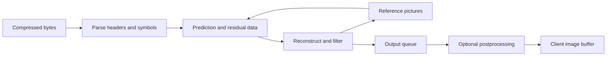
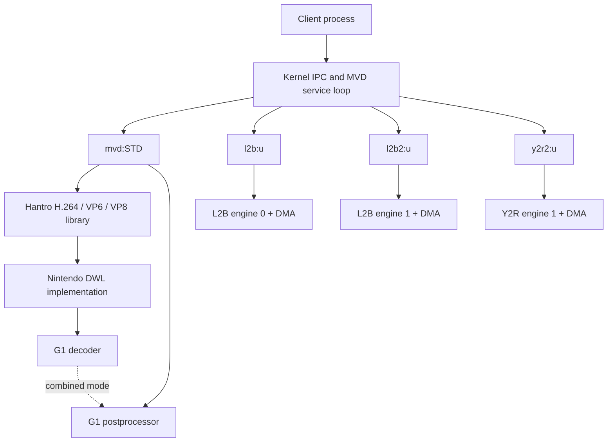
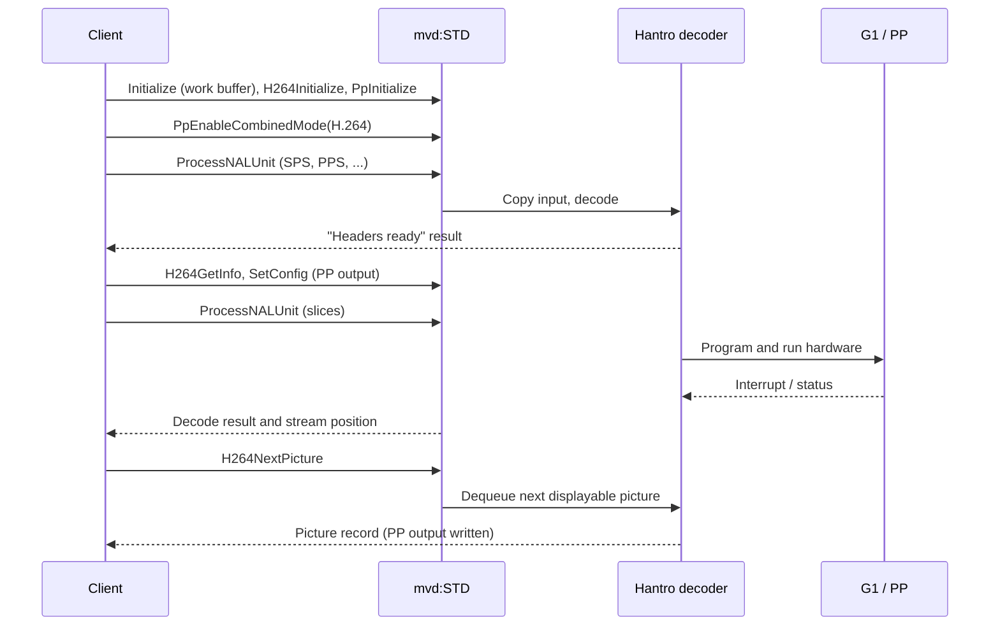

# The New 3DS MVD system module

MVD is the New Nintendo 3DS system module that drives the console's video-decoding and pixel-conversion hardware. It exposes four services:

* **`mvd:STD`** decodes H.264, VP6 and VP8 (including a WebP still-image mode) on a Hantro G1 decoder, and drives the G1 **postprocessor** (PP), which converts, scales and crops decoded pictures.
* **`l2b:u`** and **`l2b2:u`** drive two instances of the L2B engine, which converts RGB-family pixels into GPU texture layout.
* **`y2r2:u`** drives a second YUV-to-RGB converter, similar to the original 3DS `y2r:u` block.

This document describes how MVD works, based on reverse engineering of an IDA database of the module (`mvd.i64`). Most of the decoder turned out to be Hantro's own G1 decoder library, so much of the work consisted of matching the binary against a copy of that library's source and recording where Nintendo's build differs. The rest is Nintendo code: the IPC services, the platform layer beneath the Hantro library, the L2B/Y2R2 drivers and the process runtime.

## Contents

1. [Reading this document](#reading-this-document)
2. [Summary of findings](#summary-of-findings)
3. [Background: codecs, pictures and pixels](#background-codecs-pictures-and-pixels)
4. [Architecture](#architecture)
5. [The Hantro G1 library inside MVD](#the-hantro-g1-library-inside-mvd)
6. [G1 hardware and effective capabilities](#g1-hardware-and-effective-capabilities)
7. [The mvd:STD interface](#the-mvdstd-interface)
8. [Result codes](#result-codes)
9. [Work memory and addresses](#work-memory-and-addresses)
10. [Postprocessor configuration](#postprocessor-configuration)
11. [Decoder internals](#decoder-internals)
12. [H.264 in detail](#h264-in-detail)
13. [Error recovery and hardware workarounds](#error-recovery-and-hardware-workarounds)
14. [L2B and Y2R2](#l2b-and-y2r2)
15. [Nintendo's DWL platform layer](#nintendos-dwl-platform-layer)
16. [Process runtime](#process-runtime)
17. [Known defects and sharp edges](#known-defects-and-sharp-edges)
18. [Open questions](#open-questions)
19. [Method and evidence](#method-and-evidence)
20. [Client library reference](#client-library-reference)
21. [Appendix A: internal structure layouts](#appendix-a-internal-structure-layouts)
22. [Appendix B: G1 register fields](#appendix-b-g1-register-fields)
23. [References](#references)

## Reading this document

**What the findings rest on.** Nearly everything here comes from static analysis of the binary: control flow, constants, structure accesses and data tables, checked against the Hantro source where a counterpart exists. No stream was decoded on a console, no malformed input was fed to the module, and no hardware register was read or written during the investigation. Where a statement is about *silicon* behavior rather than about *what the code does*, the text says what evidence supports it.

**Assumed hardware.** The database was captured from a running process, but its MMIO segments contain zero-filled placeholders rather than real register contents. To reason about which code paths are live, this document assumes a single console revision whose G1 identification and capability registers are those published in GBATEK (ASIC ID `0x67312398`; see [G1 hardware](#g1-hardware-and-effective-capabilities)). These values are reference data, not a measurement made for this project.

**Conventions.**

* Hexadecimal values are written `0x…`. Unless stated otherwise, addresses are **virtual addresses in the MVD process**. Physical addresses are labeled as such.
* Code addresses inside the module are omitted; functions are referred to by name. Upstream Hantro names are used where the function has a Hantro counterpart. Names beginning with `Mvd` are descriptive names given during the analysis to Nintendo-specific or otherwise unmatched code; they are not original symbols.
* The module is 32-bit ARM. Pointers and words are four bytes. `u8`/`u16`/`u32` and `s8`/`s16`/`s32` are unsigned and signed integers of the given width. Structure offsets are in bytes.
* The G1 register map is described by *register word index*. Multiply by four for the byte offset within the register bank.
* Hantro library functions return small signed status codes (0 = OK, negative = error). The service converts these to 3DS result words; this document calls the former *native status* and the latter *results*.
* "IPC header" means the full 32-bit request header in `cmdbuf[0]`, `(command << 16) | (normal_words << 6) | translated_words`, for example `0x00080142`. "Command" alone means the command number.

## Summary of findings

| Area | Finding |
|---|---|
| Provenance | The decoder, postprocessor and register-access code are the Hantro G1 decoder library (H.264 "h264high", VP6, VP8 and PP components). Nintendo supplied the platform layer, the IPC services, the L2B/Y2R2 drivers and the runtime. |
| Services | Four services, one session each. All 33 `mvd:STD` commands, the 23 commands shared by `l2b:u`/`l2b2:u` and the 45 `y2r2:u` commands are identified. |
| Codecs | H.264, VP6, VP8 and WebP (VP8 intra-only) are usable on the assumed hardware. VP7 code is present but the hardware reports no VP7 support. MVC (stereo H.264) code is present but software unconditionally disables it. |
| H.264 bit depth | The SPS parser reads and discards the bit-depth fields, and reference pictures are allocated with 8-bit sample storage. Nothing supports native 10-bit (High10) decoding; the question is not settled by hardware tests. |
| Postprocessor | The 284-byte `mvd:STD` configuration structure is Hantro's `PPConfig`, and the pixel-format constants are Hantro's. |
| Memory | Decoded pictures live in the client-supplied work buffer. The picture addresses returned to the client are client virtual addresses in that buffer. |
| L2B/Y2R2 | RGBA8888 output is stored as bytes `AA BB GG RR` in increasing address order (the little-endian word `0xRRGGBBAA`). L2B replaces the input alpha with its alpha register. |
| Hardware workarounds | An H.264 `frame_num` bit-12 stream patch and a VP8 motion-vector concealment path exist, but both are disabled on the assumed hardware. |
| Defects | Several service-layer bugs were found statically, including an unbounded loop in `SetupOutputBuffers`, an uninitialized cache-maintenance length in `SetConfig`, and a broken clearing loop in `PpRelease`. See [known defects](#known-defects-and-sharp-edges). |
| Database state | All 800 functions have names; 726 of 730 G1 register-field definitions are named. |

## Background: codecs, pictures and pixels

This section explains the vocabulary used in the rest of the document. Readers familiar with video decoding can skip it.

### From a compressed stream to a picture

A compressed video stream is a sequence of instructions for reconstructing pictures, not an array of pixels. A **codec** (H.264, VP8, …) defines how these instructions are encoded. A **container** (MP4, WebM, RIFF) packages streams together with timing and metadata. MVD decodes codec data; it does not parse containers, with the partial exception noted for WebP below.

Most decoders work on small regions. A region is predicted either from already-decoded neighboring pixels in the same picture (**intra prediction**) or from previously decoded pictures (**inter prediction**). A **motion vector** says where in a reference picture to sample from. The stream then supplies a **residual**, a correction to the prediction, which is compactly represented using a transform and quantization and then compressed further by **entropy coding**. Reconstruction adds the residual to the prediction and usually runs a **loop filter** to smooth block edges; the filtered picture can itself serve as a reference.

The basic unit is the **macroblock**, a 16×16 region of luma samples. Pictures are stored padded to whole macroblocks, and a **crop rectangle** says which part should be displayed. Stored width, visible width and the **stride** (distance in bytes between rows in memory) are therefore separate quantities.



In MVD, parsing and bookkeeping run on the ARM CPU, while the G1 hardware performs the reconstruction work.

### H.264 terms

H.264 (also called AVC) divides a stream into **NAL units**. A NAL can carry a sequence parameter set (**SPS**), a picture parameter set (**PPS**), or a coded **slice** of a picture. The parameter sets say how to interpret subsequent slices. An **access unit** is the set of NALs for one picture. In the "Annex B" byte-stream format, NALs are separated by start codes (`00 00 01`), and *emulation-prevention bytes* are inserted so payload data never looks like a start code.

An **IDR** picture resets all reference state. The **decoded picture buffer (DPB)** holds pictures that are still needed as references or that are waiting to be displayed. Pictures are decoded in a different order from the one in which they are displayed, so a successfully decoded picture is not necessarily ready for output. **Picture order count (POC)** determines display order; `frame_num` is a separate counter used for reference management.

| Term | Meaning |
|---|---|
| CAVLC, CABAC | The two H.264 entropy-coding methods: context-adaptive variable-length coding and context-adaptive binary arithmetic coding |
| VLC mode, RLC mode | Two ways the Hantro library drives the hardware. In VLC mode the hardware decodes the entropy-coded bitstream itself. In RLC mode software decodes it and hands the hardware run/level coefficient data and per-macroblock control words. These are implementation modes, not stream formats |
| Short-term, long-term reference | Two classes of reference picture with different retention rules |
| MMCO | Memory-management control operation: a stream command that changes which pictures remain references |
| VUI, HRD | Video usability information (aspect ratio, color, timing) and hypothetical reference decoder parameters (buffering model) |
| SAR | Sample aspect ratio |
| MVC | Multiview coding, the H.264 extension used for stereo video |
| Field | One of the two interleaved half-pictures of interlaced video |
| Profile, level, bit depth | Respectively the set of coding tools a stream may use, its resource limits, and the precision of each sample. These are independent of each other |
| Exp-Golomb | The variable-length integer code used by most H.264 header fields |

### VP8, VP7, VP6 and WebP

VP8 has key frames, which decode without references, and inter frames, which can predict from three retained pictures called **last**, **golden** and **alternate**. Some decoded frames are kept only as references and never shown. VP8 uses a boolean arithmetic coder whose **probability contexts** can be updated by each frame, either permanently or for that frame only; this is why MVD saves and restores entropy state. Coefficient data is split into several **partitions**. See [RFC 6386](https://www.rfc-editor.org/rfc/rfc6386).

VP7 and VP6 are earlier, separate codecs, not VP8 profiles. MVD handles VP7 and VP8 through one API. VP6 has its own API and its own Huffman-table machinery.

**WebP** is an image container. Lossy WebP carries a single VP8 intra frame; lossless WebP uses an unrelated bitstream. MVD's "WebP" mode is the VP8 decoder restricted to intra-only frames, with optional output in horizontal slices. It does not implement lossless WebP, animation or the RIFF container in general.

**Error concealment** is the attempt to produce a usable picture after data is lost or damaged. Repeating the last good picture is called **freeze**; estimating motion to synthesize a new picture is **motion-vector concealment**. Neither restores the missing information.

### Pixel formats

Decoded video separates brightness (**luma**, Y) from two color-difference channels (**chroma**, Cb and Cr, loosely U and V). In **4:2:0** sampling each chroma channel has half the luma resolution in both directions, so an 8-bit 16×16 macroblock occupies 256 luma bytes plus two 8×8 chroma blocks, **384 bytes** in total. Monochrome (4:0:0) has luma only.

* **Planar** layout stores Y, Cb and Cr as three separate planes.
* **Semiplanar** layout stores a Y plane followed by a single plane with interleaved Cb/Cr pairs. This is the G1 decoder's native output.
* **Packed** YUV formats such as YUYV interleave luma and chroma in one stream.
* **Tiled** layouts group pixels into small blocks for GPU or hardware access. Tiling reorders whole pixels; it does not change byte order within a pixel.

A packed RGB format has two descriptions that are easy to confuse: the bit layout of the pixel as an integer, and the order of its bytes in memory. On a little-endian CPU the word `0xRRGGBBAA` is stored as the bytes `AA BB GG RR`.

### Hardware and platform terms

| Term | Meaning |
|---|---|
| G1 | Hantro's (now VeriSilicon's) multi-format video decoder IP block, with an attached postprocessor |
| DWL | "Decoder wrapper layer", the Hantro library's platform interface for memory allocation, register access, hardware reservation and interrupt waits. Each platform supplies its own implementation |
| Synthesis configuration | Read-only G1 registers describing which features were built into the chip |
| Fuse registers | Read-only G1 registers that can disable features after manufacture. Software combines them with the synthesis configuration to obtain effective capabilities |
| Bus address | The address used by a hardware engine to access memory. On the 3DS this is a physical address, distinct from the CPU's virtual address |
| DMA, DRQ, FIFO | Direct memory access; a DMA request signal from a peripheral; the peripheral's streaming data port |
| Clean, invalidate | Writing dirty cache lines to memory; discarding cached copies so that later reads fetch from memory |

## Architecture

### Services and hardware blocks

MVD registers four services, each limited to one session. The `mvd:STD` session state is just two pointers: the current decoder instance and the postprocessor instance. H.264, VP6 and VP8 decoders are alternatives that occupy the same decoder slot, so only one codec can be initialized at a time. The two L2B services share a command dispatcher but have separate engine contexts.

| Service | Hardware | CPU register bank | Interrupt |
|---|---|---|---|
| `mvd:STD` | G1 decoder and postprocessor | `0x1ED07000` (physical `0x10207000`) | `0x4F` |
| `l2b:u` | L2B engine 0 | `0x1EC30000` (physical `0x10130000`) | `0x45` |
| `l2b2:u` | L2B engine 1 | `0x1EC31000` (physical `0x10131000`) | `0x46` |
| `y2r2:u` | Y2R engine 1 | `0x1EC32000` (physical `0x10132000`) | `0x4E` |

Physical addresses follow from the usual 3DS I/O mapping (virtual `0x1EC00000` corresponds to physical `0x10100000`); the G1 correspondence is confirmed by GBATEK. L2B and Y2R2 also have DMA FIFO ports at separate addresses, listed in the [L2B/Y2R2 chapter](#dma).



The postprocessor works either standalone (convert an image already in memory) or in **combined mode**, where it is attached to a decoder and processes each output picture. L2B and Y2R2 are independent: decoded video does not pass through them unless the client sends it there.

### A typical H.264 session



One input submission does not always produce one picture. A picture may be held back for reordering, headers may arrive in their own submission, and one submission may need several calls to consume. `Peek` inspects the next picture without dequeuing it. The postprocessor's `GetNextOutput` command selects a PP output buffer; it does not decode anything.

### Two memory domains

MVD manages memory in two unrelated places:

* **The module heap**, 1 MiB at `0x08000000`, holds decoder objects and software scratch. It is an ordinary heap with free-list reuse and coalescing.
* **The client work buffer**, supplied with `Initialize`, holds everything the hardware touches: reference pictures, output pictures and hardware tables. Allocation is a bump pointer that never moves backwards; individual frees do nothing.

The consequences, including the fact that decoded-picture addresses are client addresses, are described in [work memory and addresses](#work-memory-and-addresses).

## The Hantro G1 library inside MVD

### Evidence of shared code

The comparison source is the Hantro G1 decoder library as shipped in buildroot-ltc (`system/hlibg1v6`, commit `31cf5593a5bb4de4608425886e93f4be628f87f4`). MVD's decoder code shares far more with it than a compatible register map would require:

| MVD function | Hantro source | Shared fingerprints |
|---|---|---|
| `PPInit` | `pp/ppapi.c` | Same product gate (`0x8170` / `0x6731`), DWL client type 4, same allocate/clear/initialize/configure/release sequence |
| `PPSetConfig` | `pp/ppapi.c` | Same multibuffer address substitution, previous/current configuration copies, BT.601/BT.709 coefficient branches and hardware setup |
| `PPCheckConfig` | `pp/ppinternal.c` | Same sequence of checks (input, crop, rotation, output, scaling, framebuffer, RGB, masks, deinterlace, range map) and the same error codes |
| `PPDecCombinedModeEnable` | `pp/ppapi.c` | Same idle/already-linked checks and callback registration, with codec cases reduced to H.264, VP6, VP8 and WebP |
| `H264DecInit`, `H264DecDecode`, `H264DecGetInfo` | `h264high/h264decapi.c` | Same arguments, self-pointer validation, capability gates, 20-byte input and 12-byte output records, state machine, status values and info fields |
| `VP6DecInit` | `vp6/vp6hwd_api.c` | Same DWL client type 7, reference count clamped to 3..16, concealment and tiled-reference handling |
| `VP8DecInit` | `vp8/vp8decapi.c` | Same VP7/VP8/WebP selector, DWL client type 10, buffer minimums 3/4/1 and mode-specific branches |
| `SetDecRegister`, `GetDecRegister` | `common/regdrv.c` | Identical table-driven field insertion/extraction |
| Register-field table | `common/8170table.h` | Long runs of identical (word, width, shift) triples in the same order |

Beyond these entry points, the H.264 parser, DPB management, CAVLC readers, VUI/HRD parsing, VP6 Huffman construction, VP8 probability handling and the reference-buffer heuristics all match function by function (see [H.264 in detail](#h264-in-detail)). Eighty-odd constant tables, including the CABAC initialization table, the CAVLC code tables, the VP6 and VP8 probability tables and the scaling-list defaults, match the source byte for byte (see [constant data](#constant-data)).

Nintendo's build is nevertheless a different branch from the comparison source, not the same revision. The exact upstream release and Nintendo's patch history are unknown.

### Differences from the comparison source

These differences matter to anyone importing Hantro headers into a disassembler, because a wholesale import gives wrong offsets:

* **No MMU argument.** The Linux API's init functions take an extra `mmuEnable` argument that MVD's do not. `PPInit` takes only its instance-output pointer.
* **Linear-memory descriptors are 12 bytes** (virtual address, bus address, size). The Linux `DWLLinearMem_t` has a fourth `uid` word. Every structure that embeds descriptors is therefore smaller in MVD; the H.264 DPB, for example, is 1680 bytes instead of 1820.
* **Short enums.** Enumerated fields in the H.264 picture and macroblock records, and the PP status fields in the decoder-to-PP interface, are single bytes.
* **Capability structure.** MVD's is 100 bytes. The source's `DWLHwConfig` (84 bytes) orders its members differently; the separate `DecHwConfig` in `inc/decapicommon.h` matches MVD's first 22 words exactly, and MVD appends three words: hardware error concealment, programmable stride and field-DPB support.
* **Public output records.** H.264 info is 0x40 bytes (source 0x3C), with an extra DPB-mode word after `interlacedSequence`. VP8 info is 0x28 bytes and VP6 info 0x24 bytes (source 0x24 and 0x20), each with an extra byte that is always zero. VP8 picture records gain luma and chroma stride words.
* **Decoder-to-PP interface** is 104 bytes, adding luma and chroma strides.
* **PP container** is 0x57C bytes, stores two bottom-field addresses per output buffer and keeps the combined-mode result as a signed halfword.
* **Register table** has 730 entries versus the source's 701. Enumeration ordinals cannot be copied across; names were transferred by aligning the triple sequences.
* **H.264** splits the source's `mvc` flag into two words (`mvcEnabled` and `mvcDpbLimit`, see [MVC](#mvc)), adds a word to the access-unit-boundary state, and adds a `frame_num` hardware workaround ([workarounds](#h264-frame_num-bit-12-workaround)).
* **VP8** adds separate chroma buffers, stride controls, user-supplied output buffers and a hardware-concealment path.
* **Tiled references.** `DecSetupTiledReference` takes a fourth argument, the DPB mode, and allows tiled references for interlaced streams when field-DPB mode is selected; the source always disables them for interlaced streams.

The DWL functions present in MVD are Nintendo's implementation of the DWL interface, built on the 3DS kernel's memory, DMA and interrupt services. The Linux DWL (device nodes, `mmap`) is not included.

## G1 hardware and effective capabilities

### Register bank

The G1 register bank is mapped at `0x1ED07000` (physical `0x10207000`). It is a 512-byte bank; GBATEK reports it mirrored throughout `0x10207200..0x10207FFF`. Decoder registers occupy words 0..59 and postprocessor registers words 60..100.

| Byte offset | Word | Contents |
|---|---:|---|
| `0x000` | 0 | ASIC ID: product number in the high halfword, revision in the low halfword |
| `0x004` | 1 | Decoder control, interrupt enable and interrupt status |
| `0x008..0x0C4` | 2..49 | Decoder configuration, stream, picture and buffer registers |
| `0x0C8` | 50 | Decoder synthesis configuration word 1 (read-only) |
| `0x0D8` | 54 | Decoder synthesis configuration word 2 (read-only) |
| `0x0E4` | 57 | Decoder fuse status (read-only) |
| `0x0F0` | 60 | PP control, interrupt enable and interrupt status |
| `0x0F4..0x17C` | 61..95 | PP configuration registers |
| `0x18C` | 99 | PP fuse status (read-only) |
| `0x190` | 100 | PP synthesis configuration (read-only) |

Register fields are accessed through a table of (word index, width, shift) triples, in the style of Hantro's `8170table.h`. [Appendix B](#appendix-b-g1-register-fields) lists all 730 fields.

MVD's register writer silently drops writes outside these word indices:

```text
1..49, 51, 55, 59..74, 79..95
```

That is, byte offsets `0x004..0x0C4`, `0x0CC`, `0x0DC`, `0x0EC..0x128` and `0x13C..0x17C`. This agrees with the writable ranges in GBATEK's register dump. The ID, synthesis and fuse words, and the holes between them, can never be written. The check does not test alignment; all normal callers pass word-aligned offsets.

### Reference register values

GBATEK publishes these values for the New 3DS G1. They are the assumed hardware state for the rest of this document:

| Physical address | Offset | Value | Meaning |
|---|---|---|---|
| `0x10207000` | `0x000` | `0x67312398` | Product `0x6731` (G1), revision `0x2398` |
| `0x102070C8` | `0x0C8` | `0x07B4AF80` | Decoder synthesis word 1 |
| `0x102070D8` | `0x0D8` | `0xC09A0000` | Decoder synthesis word 2 |
| `0x102070E4` | `0x0E4` | `0x8516FFFF` | Decoder fuse word |
| `0x1020718C` | `0x18C` | `0xFFFFFFFF` | PP fuse word |
| `0x10207190` | `0x190` | `0xFF874780` | PP synthesis word |

The dump shows `FFFFFFFF` for read/write registers; those are not treated as meaningful initial state.

### From registers to capabilities

`DWLReadAsicConfig` clears a 100-byte capability record, reads the synthesis words, reads the fuse words for the relevant product IDs, and limits each capability by its fuse. It extracts fields for H.264, MPEG-4, VC-1, MPEG-2, JPEG, VP6, VP7, VP8, AVS, RealVideo, the postprocessor, reference buffering and tiling, even though MVD has software for only some of these. The maximum decoder width combines the low eleven bits of synthesis word 1 with extension bits in word 2. The PP width uses thirteen bits of the PP synthesis word.

**MVC support is cleared unconditionally.** The capability word for MVC is set to zero before fuse filtering and never set afterwards, so `H264DecSetMvc` (command `0x06`) always fails with "unsupported format". This is a software decision that does not depend on the hardware registers.

Applying the binary's extraction and filtering logic to the reference values gives:

| Capability | Synthesis | Fuse / software | Effective |
|---|---:|---|---:|
| H.264 | 3 | Enabled | 3 (high-profile tier) |
| MPEG-4 | 1 | Fused off | 0 |
| Sorenson Spark | 1 | Fused off | 0 |
| VP6 | 1 | Enabled | 1 |
| VP7 | 0 | Fused off | 0 |
| VP8 | 1 | Enabled | 1 |
| WebP | 1 | Uses the VP8 fuse | 1 |
| MPEG-2, VC-1, JPEG, AVS, RealVideo, custom MPEG-4 | 0 | — | 0 |
| MVC | 0 | Cleared by software | 0 |
| Maximum decoder width | 1920 | Fuse limit 1920 | 1920 |
| Maximum PP output width | 1920 | Fuse limit 4096 | 1920 |
| Reference buffer | 1, plus flags | Enabled | Bitmask 11 |
| Tiled references | 1 | — | 1 |
| Hardware error concealment | 0 | — | 0 |
| Programmable stride | 0 | — | 0 |
| Field-DPB ordering | 0 | — | 0 |

H.264 capability 3 is the library's highest profile tier. It selects the library's high-profile software paths, such as extra per-macroblock motion-vector storage in the DPB, but says nothing about bit depth; see [bit depth](#bit-depth-and-high10). The JPEG-extension bit is set in the synthesis word, but JPEG itself is not, so the extension is irrelevant.

The PP synthesis word advertises alpha blending, deinterlacing, dithering, tiled 4×4 output, pixel-accurate output, blend cropping, configurable endianness and tiled input. Its scaling field (bits 27:26) is 3, which `PPSelectOutputSize` treats as fast-scaling support mode 1. The PP fuse word removes nothing. Software separately limits PP output height to 4096. These are the limits the validation code checks against; they do not mean every combination has been exercised.

Product checks in the library distinguish the legacy `0x8170` part, the G1 `0x6731`, and thresholds around `0x8190` and `0x9170`. Seeing these constants in branches says nothing about which chip a console has; only the ID register does.

### Client and decoder type numbers

Three unrelated numbering schemes appear around decoder selection, and they should not be confused with each other or with pixel formats:

* **DWL client types** passed to `MvdDwlCreate`: 1 = H.264, 4 = PP, 7 = VP6, 10 = VP8 family.
* **PP combined-mode decoder types** passed to `PpEnableCombinedMode`: 1 = H.264, 6 = VP6, 9 = VP8, 10 = WebP. The range check accepts 1..11, but only these four have cases; the others return a parameter error.
* **VP8 decoder format** passed to `Vp8Initialize`: 1 = VP7, 2 = VP8, 3 = WebP.

### Interrupts

The decoder event is created and bound to interrupt `0x4F` once, guarded by a global flag. The same event serves the decoder and the postprocessor. L2B engines use interrupts `0x45` and `0x46`, and Y2R2 uses `0x4E`.

## The mvd:STD interface

### Dispatch

The dispatcher switches on the low byte of the command number (`header >> 16`). Commands that carry handles or buffers check the header and descriptor shape; many scalar-only commands go straight to their handler without checking the header at all. The request encodings below are what a well-formed client sends, not a guarantee that malformed headers are rejected.

Commands that need to access client memory take the client's process handle, sent as a shared-handle descriptor (`0x00000000`) followed by the handle (normally `CUR_PROCESS_HANDLE`). The PP configuration commands use mapped buffers (descriptor low nibble `0xC` for a buffer the server reads, `0xA` for one it writes). Invalid descriptors and unknown commands get a reply with header `0x00000040` and an error result.

### Command table

The IPC header column is the full `cmdbuf[0]` value. Replies all begin with a result word; the reply column lists what follows it. Client-side C prototypes are in the [client library reference](#client-library-reference).

| Cmd | IPC header | Name | Request after header | Reply after result |
|---|---|---|---|---|
| `01` | `0x00010082` | Initialize | work-buffer address, size; process handle | — |
| `02` | `0x00020000` | Shutdown | — | — |
| `03` | `0x00030300` | CalculateWorkBufSize | 12-word size request ([below](#work-buffer-sizing)) | byte count |
| `04` | `0x000400C0` | CalculateImageSize | width, height, output format | byte count |
| `05` | `0x00050100` | H264Initialize | `s8` no-output-reordering, `s8` freeze concealment, `s8` display smoothing, reference-format word | — |
| `06` | `0x00060000` | H264EnableMvc | — | — |
| `07` | `0x00070000` | H264Release | — | — |
| `08` | `0x00080142` | H264Decode (ProcessNALUnit) | stream address, stream bus address, size, picture ID, skip-non-reference; process handle | current stream address, current bus address, bytes left |
| `09` | `0x00090042` | H264NextPicture | `s8` end-of-stream; process handle | 0x40-byte picture |
| `0A` | `0x000A0000` | H264GetInfo | — | 0x40-byte info |
| `0B` | `0x000B0000` | H264Peek | — | 0x40-byte picture |
| `0C` | `0x000C0100` | Vp8Initialize | `u8` format, `s8` freeze concealment, buffer count, reference-format word | — |
| `0D` | `0x000D0000` | Vp8Release | — | — |
| `0E` | `0x000E0202` | Vp8Decode | 8-word `VP8DecInput`; process handle | one word |
| `0F` | `0x000F0042` | Vp8NextPicture | `s8` end-of-stream; process handle | 0x40-byte picture |
| `10` | `0x00100000` | Vp8GetInfo | — | 0x28-byte info |
| `11` | `0x00110000` | Vp8Peek | — | 0x40-byte picture |
| `12` | `0x001200C0` | Vp6Initialize | `s8` freeze concealment, buffer count, reference-format word | — |
| `13` | `0x00130000` | Vp6Release | — | — |
| `14` | `0x001400C2` | Vp6Decode | stream address, stream bus address, size; process handle | one word |
| `15` | `0x00150042` | Vp6NextPicture | `s8` end-of-stream; process handle | 0x24-byte picture |
| `16` | `0x00160000` | Vp6GetInfo | — | 0x24-byte info |
| `17` | `0x00170000` | Vp6Peek | — | 0x24-byte picture |
| `18` | `0x00180000` | PpInitialize | — | — |
| `19` | `0x00190000` | PpRelease | — | — |
| `1A` | `0x001A0000` | PpGetResult | — | — |
| `1B` | `0x001B0040` | PpEnableCombinedMode | `u8` decoder type | — |
| `1C` | `0x001C0000` | PpDisableCombinedMode | — | — |
| `1D` | `0x001D0042` | GetConfig | size; writable buffer | buffer descriptor |
| `1E` | `0x001E0044` | SetConfig | size; process handle; readable buffer | buffer descriptor |
| `1F` | `0x001F0902` | SetupOutputBuffers | count, 17 luma/chroma address pairs, per-buffer size; process handle | — |
| `20` | `0x00200002` | GetNextOutput | process handle | luma (or RGB) address, chroma address |
| `21` | `0x00210100` | OverrideOutputBuffers | current luma, current chroma, replacement luma, replacement chroma addresses | — |

The three byte-sized arguments of `05`, and the other `s8` arguments, are sign-extended by the dispatcher.

### Lifecycle

**Decoding H.264 through the postprocessor:**

1. `Initialize` (`01`) with the work buffer.
2. `H264Initialize` (`05`), `PpInitialize` (`18`), then `PpEnableCombinedMode` (`1B`) with decoder type 1.
3. Feed NAL units with `H264Decode` (`08`). When the result is "headers ready", call `H264GetInfo` (`0A`) and configure the PP output with `SetConfig` (`1E`).
4. Retrieve pictures with `H264NextPicture` (`09`). This runs the linked postprocessor as needed. A result of `0x17002` means a picture was dequeued.
5. At the end of the stream, call `H264NextPicture` with a nonzero end-of-stream argument to drain the remaining pictures.
6. Tear down in reverse: `PpDisableCombinedMode` (`1C`), `PpRelease` (`19`), `H264Release` (`07`), `Shutdown` (`02`).

libctru's `mvdstdInit`/`mvdstdExit` follow this sequence.

**Converting a single image with the postprocessor** needs no decoder: `Initialize`, `PpInitialize`, `SetConfig`, then `PpGetResult` (`1A`), then `PpRelease` and `Shutdown`. `PpGetResult` checks that the PP is idle and, if no decoder is attached, runs it and waits for completion. With a decoder attached it instead returns the stored result of the last combined-mode operation.

### Codec-specific notes

**H.264 initialization (`05`).** The four arguments are Hantro's `noOutputReordering`, `useFreezeConcealment`, `useDisplaySmoothing` and `referenceFrameFormat`. In the reference-format word, bit 0 requests tiled references and bit 30 requests field-DPB mode. It is not a pixel format.

**MVC (`06`).** `H264EnableMvc` calls `H264DecSetMvc`, which checks the MVC capability. Since software always clears that capability, the command always fails. See [MVC](#mvc).

**H.264 decode (`08`).** `NextPicture` (`09`) dequeues; `Peek` (`0B`) does not. The stream address returned by `08` points into a module-internal copy of the input that has already been freed; use the bus address and bytes-left values to track consumption (see [compressed input](#compressed-input)).

**VP8 family (`0C`, `0E`).** The format byte selects 1 = VP7, 2 = VP8, 3 = WebP; the capability check is for VP7 or for VP8/WebP respectively. Buffer counts are capped at 16, with a minimum of 3 for VP7 and 4 for VP8; WebP always uses one. `Vp8Decode` takes the eight words of `VP8DecInput`: stream address, stream bus address, byte length, WebP slice height, and optional user luma address, luma bus address, chroma address and chroma bus address. The service copies the stream for parsing and forwards the user-buffer fields unchanged; whether they are used depends on the WebP and buffer modes.

**VP6 (`12`).** The buffer count is clamped to 3..16. Concealment can be disabled by a compatibility path for the old `0x8170` product.

**Combined mode (`1B`).** Only decoder types 1 (H.264), 6 (VP6), 9 (VP8) and 10 (WebP) are implemented. There is no VP7 case, so VP7 cannot use combined mode even though a VP7 decoder can be initialized.

### Output records

All fields are 32-bit unless noted. The reply always contains the whole record, even on paths that did not fill it, so check the result before using any field: treat info as valid only with `0x17000` (OK), and a picture only with `0x17002` (picture ready).

**H.264 info (`0A`), 0x40 bytes**

| Offset | Field |
|---|---|
| `0x00`, `0x04` | Stored picture width, height |
| `0x08`, `0x0C` | Video range, matrix coefficients |
| `0x10`, `0x14`, `0x18`, `0x1C` | Crop left, width, top, height |
| `0x20` | Output pixel format |
| `0x24`, `0x28` | Sample aspect ratio width, height |
| `0x2C`, `0x30` | Monochrome, interlaced sequence |
| `0x34` | DPB storage mode (frame/field); -1 before the first sequence |
| `0x38` | Picture buffer count |
| `0x3C` | Number of PP output buffers needed in multibuffer mode |

**H.264 picture (`09`, `0B`), 0x40 bytes**

| Offset | Field |
|---|---|
| `0x00`, `0x04` | Stored width, height |
| `0x08`, `0x0C`, `0x10`, `0x14` | Crop left, width, top, height |
| `0x18`, `0x1C` | Output address, output bus address |
| `0x20` | Picture ID (as passed to `08`) |
| `0x24` | IDR flag |
| `0x28` | Number of concealed macroblocks |
| `0x2C`, `0x30`, `0x34` | Interlaced, field picture, top field |
| `0x38` | MVC view ID |
| `0x3C` | `u8` output layout (raster or tiled), then padding |

`Peek` does not necessarily fill every field that `NextPicture` fills.

**VP8 info (`10`), 0x28 bytes**

| Offset | Field |
|---|---|
| `0x00`, `0x04` | Version, profile |
| `0x08`, `0x0C` | Coded width, height |
| `0x10`, `0x14` | Frame width, height (rounded up to macroblocks) |
| `0x18`, `0x1C` | Scaled width, height |
| `0x20` | `u8`, always written as zero; `0x21..0x23` are uninitialized padding |
| `0x24` | Output pixel format |

**VP8 picture (`0F`, `11`), 0x40 bytes**

| Offset | Field |
|---|---|
| `0x00`, `0x04` | Coded width, height |
| `0x08`, `0x0C` | Frame width, height |
| `0x10`, `0x14` | Luma stride, chroma stride (the stored stride when nonzero, otherwise the frame stride) |
| `0x18`, `0x1C` | Luma address, luma bus address |
| `0x20`, `0x24` | Chroma address, chroma bus address |
| `0x28` | Picture ID |
| `0x2C` | Intra-frame flag |
| `0x30` | Golden-frame flag |
| `0x34` | Number of concealed macroblocks |
| `0x38` | Slice rows (WebP slicing) |
| `0x3C` | `u8` output layout, then padding |

Several of these metadata fields (picture ID, flags, concealed count) are explicitly zeroed in this build.

**VP6 info (`16`), 0x24 bytes:** version, profile, frame width, frame height, scaled width, scaled height, scaling mode, then a `u8` at `0x1C` that is always zero, three bytes of uninitialized padding, and the output pixel format at `0x20`.

**VP6 picture (`15`, `17`), 0x24 bytes:** frame width, frame height, output address, output bus address, picture ID, intra flag, golden flag, concealed macroblocks, and a `u8` output layout plus padding. `NextPicture` zeroes the picture ID, both flags and the concealed count.

The extra zero byte in the VP6 and VP8 info records has no counterpart in the Hantro headers and no reader in MVD. Only the byte is zeroed, not its four-byte slot.

### PP configuration transport

`GetConfig` (`1D`) copies the current 0x11C-byte `PPConfig` into the client's buffer. `SetConfig` (`1E`) passes the client's mapped buffer directly to `PPSetConfig`. Neither uses the explicit size word to bound the access; the size is not a version negotiation, and the buffer must be a full `PPConfig`.

In multibuffer mode, `PPSetConfig` substitutes the current output buffer's addresses into the configuration. It also keeps a copy of the previous configuration and writes the standard color-conversion coefficients into its internal copy. See [postprocessor configuration](#postprocessor-configuration).

### Multibuffer output

In multibuffer mode the postprocessor writes each decoded picture into one of up to 17 client-registered output buffers, which lets the client hold several converted frames while decoding continues.

* **`SetupOutputBuffers` (`1F`)** translates each client address pair to bus addresses, saves both forms, and calls `PPDecSetMultipleOutput`. The Hantro routine requires 1..17 entries, a linked decoder and nonzero luma addresses. The service's own translation loop runs *before* that validation and trusts the client's count; see [known defects](#known-defects-and-sharp-edges).
* **`GetNextOutput` (`20`)** asks the PP for the buffer that holds the next displayed picture, looks up its luma bus address among the saved mappings, and returns the matching client address pair. If the buffered picture was produced with an older configuration, the PP is run again first.
* **`OverrideOutputBuffers` (`21`)** replaces the buffer at the PP's current display index, provided both current addresses match. It requires the PP to be idle, in combined mode and in multibuffer mode. The service records the extra client mapping only on the first override; later overrides do not update it.

## Result codes

### Conversion from native status

The Hantro library returns signed native status codes. MVD converts them in two steps. First, a normalization step maps the status to a small positive number:

* PP timeout (-257) becomes 455, PP system error (-259) becomes 457, and the VP8 "slice ready" status 6 becomes 56.
* Otherwise a negative status `s` becomes `|s| + 200` if `|s| < 900`, or `|s| - 100` if `|s| >= 900`.
* Positive statuses pass through. The result is truncated to 16 bits.

Second, a decision tree (not a simple addition to a base value) maps the normalized number to a 3DS result. Lifecycle and sizing commands (Initialize, Shutdown, release and size queries) bypass this and return 0 directly on success. Errors from the kernel or from service-level checks also do not follow this table.

**Success and informational results**

| Native | Result | Meaning |
|---:|---|---|
| 0 | `0x00017000` | OK |
| 1 | `0x00017001` | Stream processed (input consumed, nothing else to report) |
| 2 | `0x00017002` | Picture ready (a picture was dequeued) |
| 3 | `0x00017003` | Picture decoded |
| 4 | `0x00017004` | Headers ready (dimensions known; configure output now) |
| 5 | `0x00017005` | Advanced tools (H.264 stream needs the software RLC path) |
| 6 (H.264) | `0x00017006` | Pending flush |
| 6 (VP8) | `0x00017038` | Slice ready (WebP sliced output) |
| 7 | `0x00017007` | Non-reference picture skipped |

Not every decoder emits every status.

**Errors**

| Native | Result | Meaning |
|---:|---|---|
| -1 | `0xE16170C9` | Parameter error |
| -2 | `0xD96170CA` | Stream error |
| -3 | `0xD96170CB` | Not initialized |
| -4 | `0xD86170CC` | Memory allocation failure |
| -5 | `0xD96170CD` | Decoder initialization failure |
| -6 | `0xD96170CE` | Invalid headers |
| -8 | `0xD96170D0` | Unsupported stream |
| -254 | `0xD96171C6` | Hardware reservation failure |
| -255 (decoder), -257 (PP) | `0xD96171C7` | Hardware timeout |
| -256 | `0xF96171C8` | Hardware bus error |
| -257 (decoder), -259 (PP) | `0xD96171C9` | System error |
| -258 | `0xD96171CA` | DWL error |
| -512 (PP) | `0xD96172C8` | Combined-mode error |
| -513 (PP) | `0xD96172C9` | Decoder runtime error |
| -999 | `0xD9617383` | Evaluation limit |
| -1000 | `0xD9617384` | Unsupported format |

PP configuration errors -64 through -83 map consecutively to `0xD9617108` through `0xD961711B`. In order, they report an invalid: input size, input address, input format, crop, rotation, output size, output address, output format, video adjustment, RGB masks, framebuffer, mask 1, mask 2, deinterlace setting, input picture structure, input range mapping; and then unsupported alpha blending, deinterlacing, dithering and scaling. For example, `0xD961710F` is "invalid output format".

**Unmapped statuses become 0.** Values without a case fall through to a raw zero result. PP_BUSY (-128, normalized to 328) is one of them. A zero result from a converted path therefore does not prove success. The decision tree also has narrow default ranges between its cases, so do not extrapolate the tables above to other values.

## Work memory and addresses

### Work-buffer sizing

`CalculateWorkBufSize` (`03`) returns the work-buffer size for a decoding scenario. Its request has 12 normal words; the calculation uses only these bytes (offsets relative to the first word after the header):

| Offset | Meaning |
|---|---|
| `0x00` | Unused |
| `0x01` | Enable the level-based estimate |
| `0x02` | Level-estimate flags |
| `0x03` | Double the level estimate's picture storage |
| `0x04` | Level index (0..16) |
| `0x05`, `0x06` | Enable estimate A, reference count A |
| `0x07`, `0x08` | Enable estimate B, reference count B |
| `0x09..0x27` | Unused |
| `0x28`, `0x2C` | Width, height (u32) |

The result is the **maximum** of the enabled estimates, not their sum. It is zero if nothing is enabled or if the 32-bit product width × height is zero.

Let `M = ceil(width / 16) * ceil(height / 16)` (the macroblock count) and `Y = 384 * M` (bytes in one 4:2:0 picture).

* **Estimate A:** `Y * clamp(countA, 2, 16) + 67584`
* **Estimate B:** `Y * clamp(countB, 2, 16) + 2136`
* **Level estimate:** contributes zero unless the flags byte is nonzero (any bit). Look up the level record; if `M > maxFrameMbs`, contribute zero. Otherwise let `R = min(floor(maxDpbMbs / M), 16)`; if `R` is zero, contribute zero. Let `S = Y * (R + 1)`. If `flags & 6`, add `floor(S / 6)`. If the doubling byte is set, double `S`. The estimate is `S + 4040`.

What estimates A and B correspond to is not established. The code computes `M` in floating point with `ceilf`, so extremely large dimensions can overflow or lose precision.

The level table has 17 records of (index, `maxFrameMbs`, `maxDpbMbs`), indexed by the level byte without a bounds check. The index follows libctru's `MVD_H264_LEVEL_*` values. These are allocation limits taken from the H.264 level definitions, not a statement of which levels the hardware decodes.

| Index | maxFrameMbs | maxDpbMbs |
|---:|---:|---:|
| 0, 1 | 99 | 396 |
| 2 | 396 | 900 |
| 3, 4, 5 | 396 | 2376 |
| 6 | 792 | 4752 |
| 7, 8 | 1620 | 8100 |
| 9 | 3600 | 18000 |
| 10 | 5120 | 20480 |
| 11, 12 | 8192 | 32768 |
| 13 | 8704 | 34816 |
| 14 | 22080 | 110400 |
| 15, 16 | 36864 | 184320 |

### Image-size query

`CalculateImageSize` (`04`) clamps each dimension to 1920. It returns two bytes per pixel for formats `0x010001` (YUYV) and `0x040002` (RGB565), and four for `0x041002` (BGR32). Any other format hits an assertion; if the assertion returns, the four-byte calculation is used. This is a helper for the three common output formats, not a general image-size calculator.

### Address translation

The 3DS gives processes fixed windows onto physically contiguous "linear" memory. MVD's address translation handles two of them:

| Virtual range | Bus (physical) base | Note |
|---|---|---|
| `0x14000000..0x1C000000` | `0x20000000` | Legacy linear-heap window |
| `0x30000000..0x40000000` | `0x20000000` | Current linear-heap window |

Translation subtracts the window's virtual base and adds `0x20000000`, after checking that the start and computed end fall inside the window (a zero-length range at the very end is accepted). This is arithmetic on fixed windows, not a page-table walk.

MVD's memory-copy layer decides whose memory an address belongs to by comparing it with `0x30000000`: addresses at or above belong to the client process, addresses below belong to MVD itself. Copies involving the client use cross-process DMA with cache maintenance; local copies use `memcpy`. The client process is installed as a global context around each library call and reset afterwards.

The practical consequence is that **clients must use buffers in the `0x30000000` window**. Although a `0x14000000` address translates correctly to a bus address, the copy layer would treat it as MVD-local memory.

### Where decoded pictures live

The hardware-facing allocator (`DWLMallocLinear`) carves buffers out of the client's work buffer and records, for each one, the **client's** virtual address and the corresponding bus address. Reference and output pictures are allocated this way. When a picture is returned (`output_vaddr` for H.264 and VP6, `luma_vaddr`/`chroma_vaddr` for VP8), the virtual address is therefore a pointer into the client's own work buffer, and the bus address names the same bytes for hardware. The service never copies pixels into the reply.

A client can read a decoded picture directly, without going through the postprocessor, provided it has received a picture-ready result, respects the layout and strides, and invalidates its data cache for the range. Holding on to an address does not stop the decoder from reusing that buffer for a later picture. The postprocessor is still useful for format conversion, scaling and writing to separately registered buffers.

### Compressed input

The decode commands copy the compressed input into a scratch buffer on the module heap for software parsing, while the hardware reads the stream through the client-supplied bus address. That is why both a virtual and a bus address are passed.

After an H.264 decode the service frees the scratch copy, but still returns the library's current-stream pointer, which points into it. The returned virtual address is therefore meaningless to the client. Use the returned bus address and bytes-left count to track how much input was consumed.

### Allocator behavior

* Work-buffer allocations advance a single global cursor by the exact requested size, with no rounding or alignment. Callers are responsible for alignment.
* `DWLFreeLinear` and `DWLFreeRefFrm` are empty functions: freeing a hardware buffer does not return its space to the work buffer.
* The cursor is advanced *before* the range check, and not rolled back if the check fails. The check requires a nonempty range starting at or above `0x30000000` and ending at or below `0x3FFFFFD8`.
* Small library objects (`DWLmalloc`/`DWLfree`) use the module heap and are freed normally.

The [DWL chapter](#nintendos-dwl-platform-layer) covers the rest of the platform layer.

## Postprocessor configuration

### The PPConfig structure

`MVDSTD_Config` is Hantro's `PPConfig`, exactly 0x11C (284) bytes. This is established by the field accesses in `PPCheckConfig`, the copy size in `PPGetConfig`, the defaults set by `PPInitDataStructures` and the register programming in `PPSetupHW`, and it explains why the pixel-format constants match Hantro's `ppapi.h`.

Every field is a 32-bit word. Bus addresses are physical addresses, not process pointers. Fields marked `s32` are signed.

| Offset | Field | Type |
|---|---|---|
| **Input image** | | |
| `0x000` | `ppInImg.pixFormat` | u32 |
| `0x004` | `ppInImg.picStruct` | u32 |
| `0x008` | `ppInImg.videoRange` | u32 |
| `0x00C` | `ppInImg.width` | u32 |
| `0x010` | `ppInImg.height` | u32 |
| `0x014` | `ppInImg.bufferBusAddr` (luma, or top field) | u32 |
| `0x018` | `ppInImg.bufferCbBusAddr` (chroma, or Cb) | u32 |
| `0x01C` | `ppInImg.bufferCrBusAddr` (Cr for planar input) | u32 |
| `0x020` | `ppInImg.bufferBusAddrBot` (bottom-field luma) | u32 |
| `0x024` | `ppInImg.bufferBusAddrChBot` (bottom-field chroma) | u32 |
| `0x028` | `ppInImg.vc1MultiResEnable` | u32 |
| `0x02C` | `ppInImg.vc1RangeRedFrm` | u32 |
| `0x030` | `ppInImg.vc1RangeMapYEnable` | u32 |
| `0x034` | `ppInImg.vc1RangeMapYCoeff` | u32 |
| `0x038` | `ppInImg.vc1RangeMapCEnable` | u32 |
| `0x03C` | `ppInImg.vc1RangeMapCCoeff` | u32 |
| **Input crop and rotation** | | |
| `0x040` | `ppInCrop.enable` | u32 |
| `0x044` | `ppInCrop.originX` | u32 |
| `0x048` | `ppInCrop.originY` | u32 |
| `0x04C` | `ppInCrop.height` | u32 |
| `0x050` | `ppInCrop.width` | u32 |
| `0x054` | `ppInRotation.rotation` | u32 |
| **Output image** | | |
| `0x058` | `ppOutImg.pixFormat` | u32 |
| `0x05C` | `ppOutImg.width` | u32 |
| `0x060` | `ppOutImg.height` | u32 |
| `0x064` | `ppOutImg.bufferBusAddr` (luma or RGB) | u32 |
| `0x068` | `ppOutImg.bufferChromaBusAddr` | u32 |
| **RGB conversion** | | |
| `0x06C` | `ppOutRgb.rgbTransform` | u32 |
| `0x070` | `ppOutRgb.contrast` | s32 |
| `0x074` | `ppOutRgb.brightness` | s32 |
| `0x078` | `ppOutRgb.saturation` | s32 |
| `0x07C` | `ppOutRgb.alpha` | u32 |
| `0x080` | `ppOutRgb.transparency` | u32 |
| `0x084..0x094` | `ppOutRgb.rgbTransformCoeffs.a` … `.e` | u32 ×5 |
| `0x098` | `ppOutRgb.rgbBitmask.maskR` | u32 |
| `0x09C` | `ppOutRgb.rgbBitmask.maskG` | u32 |
| `0x0A0` | `ppOutRgb.rgbBitmask.maskB` | u32 |
| `0x0A4` | `ppOutRgb.rgbBitmask.maskAlpha` | u32 |
| `0x0A8` | `ppOutRgb.ditheringEnable` | u32 |
| **Mask 1** | | |
| `0x0AC` | `ppOutMask1.enable` | u32 |
| `0x0B0`, `0x0B4` | `ppOutMask1.originX`, `originY` | s32 |
| `0x0B8`, `0x0BC` | `ppOutMask1.height`, `width` | u32 |
| `0x0C0` | `ppOutMask1.alphaBlendEna` | u32 |
| `0x0C4` | `ppOutMask1.blendComponentBase` (bus address) | u32 |
| `0x0C8`, `0x0CC` | `ppOutMask1.blendOriginX`, `blendOriginY` | s32 |
| `0x0D0`, `0x0D4` | `ppOutMask1.blendWidth`, `blendHeight` | u32 |
| **Mask 2** | | |
| `0x0D8..0x100` | `ppOutMask2`, same layout as mask 1 | |
| **Framebuffer placement** | | |
| `0x104` | `ppOutFrmBuffer.enable` | u32 |
| `0x108`, `0x10C` | `ppOutFrmBuffer.writeOriginX`, `writeOriginY` | s32 |
| `0x110`, `0x114` | `ppOutFrmBuffer.frameBufferWidth`, `frameBufferHeight` | u32 |
| **Deinterlacing** | | |
| `0x118` | `ppOutDeinterlace.enable` | u32 |

### Input description

`picStruct` describes how the input picture is stored: 0 = frame (or top field), 1 = bottom field, 2 = top and bottom fields in separate buffers, 3 = top/bottom fields stored interleaved as a frame, 4 = top field within a frame, 5 = bottom field within a frame. The four extra address words at `0x018..0x024` are the chroma planes and bottom-field planes.

`videoRange` is 0 for limited (studio) range and 1 for full range; larger values fail validation. The six VC-1 fields are part of the common PP API and are irrelevant here, since MVD has no VC-1 decoder.

The input pixel format describes the decoded image entering the postprocessor. In combined mode with H.264 it is 4:2:0 semiplanar, 4:2:0 tiled, or monochrome for a monochrome stream, and the decoder supplies the input addresses itself through callbacks.

### Pixel formats

| Value | Hantro format |
|---|---|
| `0x010001` | YCbCr 4:2:2 interleaved, Y Cb Y Cr (YUYV) |
| `0x010005` | Y Cr Y Cb (YVYU) |
| `0x010006` | Cb Y Cr Y (UYVY) |
| `0x010007` | Cr Y Cb Y (VYUY) |
| `0x010008..0x01000B` | The four interleaved 4:2:2 orders above, tiled 4×4 |
| `0x010002` | YCbCr 4:2:2 semiplanar |
| `0x010004` | YCbCr 4:4:0 |
| `0x020000` | YCbCr 4:2:0 planar |
| `0x020001` | YCbCr 4:2:0 semiplanar (Y plane, then interleaved CbCr) |
| `0x020002` | YCbCr 4:2:0 tiled |
| `0x080000` | YCbCr 4:0:0 (monochrome) |
| `0x100001` | YCbCr 4:1:1 semiplanar |
| `0x200001` | YCbCr 4:4:4 semiplanar |
| `0x040000` | RGB16 with custom masks |
| `0x040001` | RGB 5:5:5 |
| `0x040002` | RGB 5:6:5 |
| `0x040003` | BGR 5:5:5 |
| `0x040004` | BGR 5:6:5 |
| `0x041000` | RGB32 with custom masks |
| `0x041001` | RGB32 |
| `0x041002` | BGR32 |

**The RGB names are Hantro's bit-layout names, and libctru uses the opposite convention**: libctru calls `0x040002` BGR565 and `0x040004` RGB565. Keep this in mind when mixing documentation. The PP's output endianness and swap settings also affect how the bytes land in memory.

For `0x020001` output, the addresses at `0x064` and `0x068` are the luma and chroma planes of a single picture.

Not every format is accepted in every mode. The input-format check (`PPIsInPixFmtOk`) allows:

* 4:2:0 semiplanar: standalone and combined. 4:2:0 tiled: the same, except with JPEG (irrelevant here).
* 4:2:0 planar and YUYV: standalone only. The other three interleaved 4:2:2 orders: standalone only, and not on the legacy `0x8170` product.
* Monochrome: combined with H.264 (or JPEG) only; not on `0x8170` for H.264.
* 4:2:2 semiplanar, 4:4:0, 4:1:1 and 4:4:4: combined with JPEG only. Since MVD has no JPEG decoder, these cannot be used.

The output-format check (`PPIsOutPixFmtOk`) allows 4:2:0 semiplanar, YUYV and all the RGB formats. The other interleaved 4:2:2 orders are excluded on `0x8170`, and the tiled 4×4 formats additionally require the tiled-output capability. Tiled output (checked by `PPCheckTiledOutput`) also requires output dimensions and enabled mask origins/sizes to be multiples of four, and cannot be combined with framebuffer placement.

### Cropping and rotation

The crop rectangle is in input coordinates. Its origin must be a multiple of 16 and its width and height multiples of 8. The minimum width is 16 standalone or 48 in combined mode; the minimum height is 16. The origin and size are each checked against the input size separately; this block does not check that `origin + size` fits.

Rotation (`0x054`): 0 = none, 1 = 90° right, 2 = 90° left, 3 = horizontal flip, 4 = vertical flip, 5 = 180°. Combined mode rejects rotation for the 4:4:0, 4:2:2 semiplanar, 4:1:1 and 4:4:4 inputs.

### RGB conversion

`rgbTransform` (`0x06C`) selects the YCbCr-to-RGB coefficients: 0 = custom (from `a`..`e`), 1 = BT.601, 2 = BT.709. For 1 and 2, `PPSetConfig` writes the standard values below into its internal copy of the configuration, choosing the row by input range:

| Transform / range | a | b | c | d | e |
|---|---:|---:|---:|---:|---:|
| BT.601 limited | 298 | 409 | 208 | 100 | 516 |
| BT.601 full | 256 | 350 | 179 | 86 | 443 |
| BT.709 limited | 298 | 459 | 137 | 55 | 544 |
| BT.709 full | 256 | 403 | 120 | 48 | 475 |

The signed adjustments are contrast (-64..64), brightness (-128..127) and saturation (-64..128). The constraints on `alpha` and `transparency` depend on whether the output is 16- or 32-bit. Dithering (`0x0A8`) requires hardware support.

For the custom RGB formats, the four channel masks at `0x098..0x0A4` must each be a single contiguous run of set bits (zero is allowed), must not overlap, and must fit in 16 bits for RGB16.

### Masks, blending and framebuffer placement

Masks 1 and 2 each define a rectangle in output coordinates (signed origin, width, height). If alpha blending is enabled for a mask, its blend source is a bus address that must be nonzero and eight-byte aligned, and an optional crop rectangle selects the part of the blend source to use. Mask geometry and blend cropping have further hardware-dependent checks.

Framebuffer placement writes the output into a larger buffer at a signed position. Negative coordinates are allowed; validation only requires that some of the output overlaps the framebuffer. Semiplanar output requires an even vertical position and even framebuffer height. The framebuffer width is limited to 4096.

Deinterlacing (`0x118`) requires hardware support and a 4:2:0 or monochrome input.

### Dimensions and scaling

The limits often quoted for the Hantro PP, 2048 standalone and 4672 in combined mode, apply only to the legacy `0x8170` product. For the G1:

* Standalone input: up to 4096 in each dimension, width and height multiples of 16.
* Combined input: up to 511 × 16 = 8176 (1024 × 16 for WebP), multiples of 8. The decoder's own limits are much tighter; passing PP validation does not mean the decoder accepts that size.
* Minimum input width is 16 standalone or 48 combined; minimum input height is 16.
* Output: at least 16 in each dimension, at most the capability width (1920 on the reference hardware) by 4096.
* Scaling: after crop and rotation, upscaling is limited to 3× the input width and `3 × inputHeight − 2` in height, and downscaling to 1/70. Upscaling in one direction while downscaling in the other is rejected.
* All required plane addresses must be nonzero and eight-byte aligned. In combined mode the input addresses come from the decoder, so only the output addresses are checked.

### Service-layer caveat

`SetConfig` performs cache maintenance on the output buffer, but only computes the buffer length for the three formats `0x010001`, `0x040002` and `0x041002`. For any other format the length register is uninitialized when the cache operation runs. For other formats, the amount of memory maintained depends on whatever that register happens to contain; see [known defects](#known-defects-and-sharp-edges).

## Decoder internals

### Object sizes

Each decoder is a single heap-allocated container. The sizes below were confirmed from allocation sizes, clears, copy lengths and array strides in the binary, not just from compiling the Hantro headers (which give different sizes, as explained [above](#differences-from-the-comparison-source)). Full layouts of the main structures are in [Appendix A](#appendix-a-internal-structure-layouts).

| Structure | Bytes | Notes |
|---|---:|---|
| Linear-memory descriptor | 12 | Virtual address, bus address, size |
| H.264 container | 15860 | Contains the 14864-byte decoder storage at offset 308 and 176 bytes of hardware buffers at 15172 |
| H.264 DPB | 1680 | Backed up and restored as a unit around hardware runs |
| H.264 DPB picture | 52 | |
| H.264 output-queue record | 36 | |
| VP6 container | 2424 | Includes 260 bytes of hardware buffers and the 1480-byte parser state |
| VP8 container | 4224 | Includes 812 bytes of hardware buffers, the 2612-byte parser state and a 36-byte boolean decoder |
| Reference-buffer controller | 228 | Shared by all three codecs |
| Output buffer queue | 16 | Used by VP6 and VP8 |
| Decoder-to-PP interface | 104 | |
| PP container | 1404 | |

### Decoder-to-PP interface

In combined mode, each decoder container holds a PP block: the PP instance pointer, start/end/query callbacks, the 104-byte interface record that tells the PP where the picture is, and a 20-byte query result. The interface follows Hantro's `DecPpInterface` and appends luma and chroma strides; `PPDecStartPp` compares nonzero strides against the input width.

The query result has five words: tiled mode, pipeline accepted, deinterlace required, multibuffer mode, and configuration changed. When the PP accepts **pipelining**, the decoder and PP run together and the PP reads the picture as it is written; the decoder then passes dimensions and layout but zero input addresses. Otherwise the decoder passes the output or reference buffer addresses after decoding. H.264 also coordinates reordered output and field pairs, and keeps track of up to 17 pictures sent to the PP in multibuffer mode (`h264PpMultiInit`, `h264PpMultiAddPic`, `h264PpMultiRemovePic`, `h264PpMultiFindPic`).

A helper that sets the PP's input addresses from the interface record, factored out of `PPDecStartPp`, sets both chroma bases equal to the luma bases for monochrome input.

### Common register initialization

All three decoders call a shared routine to program the common decoder configuration: output endianness 1, input endianness 0, stream endianness 1, maximum burst 16, advanced prefetch enabled with threshold 8, all three 32-bit swaps enabled, hardware timeout enabled, internal clock gating disabled, interrupts enabled, and AXI IDs zero. It uses the priority-mode field on the legacy `0x8170` product and the single-command-disable field otherwise, and clears the latency, data-discard and one unidentified field (register ordinal 598).

### H.264 decode path

1. `H264DecDecode` validates the instance and input, then runs the parser (`h264bsdDecode`) until it reaches a picture, a header change or an error.
2. A header change allocates software resources and DPB storage (`h264bsdAllocateSwResources`, `h264AllocateResources`), and returns "headers ready".
3. In VLC mode, `H264SetupVlcRegs` programs the hardware to read the bitstream. In RLC mode, `PrepareIntra4x4ModeData`, `PrepareMvData` and `PrepareRlcCount` build the per-macroblock data in software.
4. The active DPB and picture-order state are backed up, so that they can be restored if the decoder must fall back to RLC mode.
5. `H264RunAsic` programs references and layout, starts the PP if linked, waits for the interrupt, reads the status and updates the stream position from the hardware's stream-base register.
6. `h264UpdateAfterPictureDecode` updates reference and output bookkeeping. Dequeuing a picture for display is a separate operation (`NextPicture`).

The decoder's internal state is 1 for normal decoding, 2 when the hardware ran out of input mid-picture (the next call continues the picture, and the current call returns "stream processed"), and 3 when a new header must wait until earlier pictures are drained.

When a picture is lost, `h264InitPicFreezeOutput` copies a usable reference into the output if one exists, and otherwise fills it with neutral samples, updating the concealed-macroblock count.

The tiled-reference setup enables tiled references when the hardware supports them and either the stream is progressive or field-DPB mode is selected. On the reference hardware field-DPB support is zero, so tiled references are used only for progressive streams.

### VP6 decode path

The parser state matches Hantro's `PB_INSTANCE` field for field, once alignment is accounted for: a stream reader and two boolean decoders, the Huffman state pointer, version, profile, frame flags, dimensions, filter settings, motion-vector and coefficient probabilities, and scan-order tables.

`Vp6StrmInit`, `VP6HWLoadFrameHeader` and `VP6HWDecodeProbUpdates` parse the frame. `VP6HwdAsicProbUpdate` packs the probabilities into the hardware table, `VP6HwdAsicInitPicture` programs references and filtering, and `VP6HwdAsicStrmPosUpdate` sets the partition addresses and bit offsets. `vp6PreparePpRun` and `VP6HwdAsicRun` coordinate the PP and wait for completion.

A change of dimensions frees and reallocates the picture buffers, sets state 3 and returns "headers ready"; the next call resumes decoding in state 1. A successful frame updates the previous and golden references. On error, concealment can output the previous reference instead. The output queue never hands out a buffer that is still an active reference.

VP6 can use Huffman coding for DCT tokens instead of the boolean coder. `VP6HWAllocateHuffman` allocates a 4544-byte workspace holding the DC, AC and zero-run probabilities, the Huffman trees built from them, and the lookup tables sent to hardware. `VP6HW_BuildHuffTree` builds each tree by repeatedly combining the lowest-weight nodes, kept in a sorted list; `VP6HW_CreateHuffmanLUT` walks the tree to emit 16-bit table entries containing code and length. Tree nodes are two 16-bit entries, each holding a selector bit (token or child index) and a seven-bit value. All of this matches Hantro's `vp6huffdec.c`.

### VP8, VP7 and WebP decode path

`vp8hwdDecodeFrameTag` reads the version, key-frame flag, show-frame flag and first-partition size. `vp8hwdDecodeFrameHeader` parses either VP7 or VP8 header syntax, and `vp8hwdSetPartitionOffsets` computes where each coefficient partition starts, reporting an error if a partition would extend past the input.

The parser holds both the current and a saved copy of the entropy probabilities. If the frame says its probability updates are temporary, the saved probabilities (and, for VP7, the scan order) are restored after the hardware run. The last, golden and alternate references can each be refreshed or copied independently.

The internal state is 1 after initialization, 3 when new headers were found, 4 during normal decoding, and 5 in the middle of a sliced picture. A dimension change returns "headers ready" in state 3; the next call allocates pictures and moves to state 4. In WebP sliced mode, the hardware stops after each band of rows and the call returns "slice ready" in state 5; `VP8HwdAsicContPicture` resumes with the remaining rows on the next call. WebP decoding is intra-only and can write directly into caller-supplied luma/chroma buffers.

Compared with the Hantro source, MVD's VP8 hardware-buffer structure adds stride controls, separate luma and chroma picture arrays, two motion-vector buffers, and 16-entry arrays of user luma/chroma addresses. Two synthesis-word-2 capability fields, bits 13:12 and bit 11, are read as hardware error concealment and programmable stride; both are zero on the reference hardware.

Ordinary VP8 video must be at least 48 pixels in each dimension, no wider than the decoder limit (1920), and at most `0x1000000` bytes of padded area. The WebP path permits up to 16384 (`0x4000`) in each direction, subject to further allocation, area and slicing checks. These are software checks; no large image was decoded to confirm them.

### Reference buffering

The "reference buffer" is a G1 feature that caches part of the reference picture on chip. Four functions matching Hantro's `common/refbuffer.c` (`InitMemAccess`, `UpdateMemModel`, `GetSettings`, `DecideParityMode`) decide per picture whether to use it: they estimate memory costs per decoding mode, predict how much of the reference will be reused and at which vertical offset, and decide whether using the opposite field parity pays off. Buffering is disabled for pictures 16 macroblocks wide or less. The cost constants are Hantro's model values, not measured 3DS bus timings.

## H.264 in detail

### Parser coverage

The match with Hantro's `h264high` sources extends through the whole software parser. Representative counterparts:

| Function | Source file (under `h264high/`) |
|---|---|
| `h264bsdExtractNalUnit` | `legacy/h264hwd_byte_stream.c` |
| `h264bsdDecodeNalUnit` | `legacy/h264hwd_nal_unit.c` |
| `h264bsdCheckAccessUnitBoundary`, `h264bsdActivateParamSets` | `h264hwd_storage.c` |
| `h264bsdDecodeSeqParamSet`, `ScalingList`, `FallbackScaling`, `DecodeMvcExtension` | `legacy/h264hwd_seq_param_set.c` |
| `h264bsdDecodePicParamSet` | `legacy/h264hwd_pic_param_set.c` |
| `h264bsdDecodeSliceHeader`, `RefPicListReordering`, `DecRefPicMarking` | `legacy/h264hwd_slice_header.c` |
| `h264bsdDecodeSliceData` | `h264hwd_slice_data.c` |
| `h264bsdDecodeMacroblockLayerCavlc`, `h264bsdDecodeMacroblock`, `WriteRlcToAsic` | `h264hwd_macroblock_layer.c` |
| `h264bsdDecodeResidualBlockCavlc` and its table readers | `h264hwd_cavlc.c` |
| `PrepareInterPrediction`, `PrepareIntraPrediction` | `h264hwd_inter_prediction.c`, `h264hwd_intra_prediction.c` |
| `h264bsdInitDpb`, `h264bsdReorderRefPicList`, `h264bsdCheckGapsInFrameNum`, MMCO helpers | `h264hwd_dpb.c` |
| `h264bsdDecodeVuiParameters`, `h264bsdDecodeHrdParameters` | `legacy/h264hwd_vui.c` |
| `h264bsdDecodePicOrderCnt` | `legacy/h264hwd_pic_order_cnt.c` |

The four CAVLC table readers (`DecodeCoeffToken`, `DecodeLevelPrefix`, `DecodeTotalZeros`, `DecodeRunBefore`) agree with the source in their nC ranges, lookahead shifts, thresholds, the chroma-DC special case and their packed value/length results.

The per-macroblock records are: a 1124-byte macroblock layer (including 468 16-bit run/level words and 28 coefficient counts), and 160 bytes of persistent state per macroblock with 16 motion vectors and pointers to the A/B/C/D neighbors. Each slice header holds two 276-byte reordering records of 17 commands and a 716-byte marking record of 35 MMCO entries. These are storage capacities, not limits on what a stream may contain.

Some behaviors worth knowing when reading the code:

* `h264bsdExtractNalUnit` removes emulation-prevention bytes in place on the RLC path, so its input buffer is modified.
* `h264bsdCompareSeqParamSets` copies scaling-list data into the stored SPS despite its name.
* `h264bsdGetRefPicData` returns a reference slot index, or -1, rather than a data pointer.
* `IsReference` takes a DPB picture **by value**: the first 16 bytes arrive in R0–R3 and the remaining 36 on the stack, with the field selector after them. This is an unusual but source-faithful ABI and explains the large struct copies in the comparison routines.
* Several functions omit arguments that the source declares but never uses, for example `SlidingWindowRefPicMarking`, `Mmcop4`, `Mmcop5`, `h264DpbUpdateOutputList` and `VP6HWConfigureMvEntropyDecoder`.

### Access-unit boundary detection

MVD's access-unit-boundary state is 76 bytes, four more than the source's. The extra word, stored after `prevFrameNum`, holds the previous frame number with the [workaround](#h264-frame_num-bit-12-workaround) mask removed:

```c
aub.maskedPrevFrameNum = aub.prevFrameNum & ~workarounds.h264.frameNumMask;
```

`h264bsdCheckAccessUnitBoundary` treats a change of `frame_num` as the start of a new picture only if the new value matches neither stored value. The other boundary conditions (field flags, reference status, POC, IDR status and ID, view) are unchanged. When the workaround is disabled the mask is zero and the two stored values are identical.

### DPB allocation

`h264bsdInitDpb` clears the DPB, clamps the maximum reference count to at least 1, sets the long-term index limit to "none" (`0xFFFF`) and the previous output index to `0xFF`. The DPB size is the reference count if output reordering is disabled, and otherwise the size derived from the level (or VUI). `h264bsdResetDpb` reuses an existing allocation when the picture size and effective DPB size have not changed.

The number of picture buffers is:

```text
maxRefFrames     = max(requestedRefFrames, 1)
dpbSize          = noReordering ? maxRefFrames : requestedDpbSize
buffers          = dpbSize + 1
if displaySmoothing:
    buffers     += noReordering ? 1 : dpbSize + 1
else if multiBufferPp:
    buffers      = dpbSize + 2
```

The first `dpbSize + 1` buffers belong to DPB slots; any others go to a free list. Each buffer has ownership bits (1 = DPB, 2 = output queue). `DpbBufFree` and `OutBufFree` clear these bits and recycle buffers; they do not free memory.

Each picture buffer holds `M` macroblocks of samples plus, on high-profile-capable hardware, 64 bytes per macroblock of motion vectors for direct prediction:

| Configuration | Bytes per picture |
|---|---|
| 4:2:0, no high-profile support | `384·M + 32` |
| 4:2:0, high-profile support | `448·M + 32` |
| Monochrome, high-profile support | `320·M + 32` |

A second chroma output, if requested, adds `128·M`. Two details differ from the source: MVD requests 32 extra bytes per buffer, and it does not clear the output-record array after allocating it. The purpose of the 32 bytes is unknown.

### Reference status and marking

Each 52-byte DPB picture has one status byte per field:

| Value | Status |
|---:|---|
| 0 | Unused |
| 1 | Non-existing (a gap filled in for a missing `frame_num`) |
| 2 | Short-term reference |
| 3 | Long-term reference |
| 4 | Empty |

A field selector (0 = top, 1 = bottom, 2 = frame) says which fields a predicate looks at. `IsReference` on a frame requires both fields to be references; the field variants accept either. `IsShortTerm` counts non-existing pictures as short-term. `IsExisting` excludes non-existing, unused and empty. `FindDpbPic` looks up short-term pictures by `frameNum` and long-term pictures by `picNum`, returning -1 if not found.

`h264bsdMarkDecRefPic` handles non-reference pictures, IDR pictures, adaptive marking and the sliding window. It also handles the second field of a frame, delayed output with display smoothing, and records the picture ID, error count, IDR, tiling and field flags. The MMCO operations are:

| MMCO | Action |
|---:|---|
| 1 | Mark a short-term picture or field unused |
| 2 | Mark a long-term picture or field unused (inlined in the parent) |
| 3 | Convert a short-term picture to long-term, removing any conflicting long-term assignment |
| 4 | Set the long-term index limit and drop references beyond it |
| 5 | Mark all references unused, output all displayable pictures and reset numbering |
| 6 | Assign a long-term index to the current picture |

As in the source, the results of MMCO 1 to 3 are ignored. The sliding window removes the oldest short-term reference once the limit is reached.

**MMCO 6 differs from the source.** MVD rejects the operation only if `numRefFrames > maxRefFrames` (an unsigned "higher" branch), so equality reaches the insertion code, whereas the source requires `numRefFrames < maxRefFrames`. MVD's parent then checks `numRefFrames > maxRefFrames` after adaptive marking and reports failure, but the helper may already have changed the state. No stream exercising this was tested.

### Reference lists and output order

`ShellSort` and `ShellSortF` sort `dpbSize + 1` entries with gaps 7, 3 and 1. For P slices, short-term references come first in descending picture number, followed by long-term references in ascending long-term number. For B slices, short-term references are ordered around the current POC, followed by long-term references. `H264InitRefPicList` builds B list 0, B list 1 and the P list, writes them to the hardware registers, and saves the P list for error handling. The frame version swaps the first two entries of list 1 when the two lists would otherwise be identical, as the standard requires.

`OutputPicture` picks the displayable picture with the smallest POC, copies it into a 36-byte record in the output ring, and marks it as owned by output. The ring has `dpbSize + 1` entries; when it overflows, the oldest record is discarded. `h264DpbUpdateOutputList` queues each picture immediately when reordering is disabled, and otherwise outputs pictures while the DPB is over capacity. `h264bsdDpbOutputPicture` returns the next record, or nothing if the queue is empty or output is suppressed.

### Intra prediction setup

The intra-prediction functions (`Intra16x16Prediction`, `Intra4x4Prediction`, `DetermineIntra4x4PredMode`, `CheckIntraChromaPrediction`, `GetIntraNeighbour`) do not reconstruct pixels; the hardware does that. In RLC mode they check that the neighbors needed by each prediction mode are available (respecting constrained intra prediction), derive the predicted 4×4 modes, and build the hardware's per-macroblock control words. Chroma mode 0 needs no neighbor, mode 1 needs the left neighbor A, mode 2 the upper neighbor B, and mode 3 needs A, B and the upper-left D.

Neighbors are described by two-byte records (macroblock selector, block index): selectors 0..3 name neighbors A..D, 4 the current macroblock, and `0xFF` an unavailable one. Three constant tables of 24 records (16 luma, 4 Cb, 4 Cr blocks) give the A, B and D neighbor of each 4×4 block. A neighbor is available if it exists and belongs to the same slice.

### SPS, VUI and other parameter parsing

**Picture order count.** `h264bsdDecodePicOrderCnt` implements all three POC types, including wraparound, fields and the MMCO 5 reset.

**Slice groups.** `DecodeBoxOutMap` and `DecodeForegroundLeftOverMap` build the box-out and foreground/leftover slice-group maps for FMO streams.

**DPB size.** `GetDpbSize` computes `min(16, levelDpbBytes / (384 · picSizeInMbs))` from the level table, returning `0x7FFFFFFF` for invalid input. This is separate from the service's work-buffer calculation.

**Parameter-set validity.** `h264bsdValidParamSets` searches the 256 PPS slots for one whose SPS exists and which passes `CheckPps`. Storage initialization marks the SPS and PPS IDs invalid (32 and 256). `h264bsdRbspTrailingBits` consumes the rest of the byte without checking the stuffing pattern (the source's check is compiled only in pedantic mode).

**Scaling matrices.** `ScalingList` reads eight lists (six 4×4, two 8×8). Deltas wrap modulo 256, and a first delta that yields zero selects the default list. `FallbackScaling` uses the default for lists 0, 3, 6 and 7 and copies the previous list otherwise. The default tables and zigzag scans are byte-identical to the source.

**VUI and HRD.** The VUI parser fills Hantro's 952-byte `vuiParameters_t`, and the HRD parser its 412-byte `hrdParameters_t`. The VUI is cleared before parsing; when a section is absent, defaults apply:

* Video format 5 and color descriptors 2 ("unspecified").
* Bitstream restrictions: motion vectors may cross picture boundaries, byte/bit denominators 2/1, maximum motion-vector lengths 16, and reorder count and frame-buffer limit 16.
* Missing NAL HRD: rate and size 288000001; missing VCL HRD: 240000001; CPB count 1 and delay lengths 24.

Two behaviors are inherited from the source. If an HRD parse fails, the VUI parser returns *success* immediately, leaving the remaining fields at their defaults. And HRD rejects a CPB count above 32 and raw rate/size values of `0xFFFFFFFF`, but the scaled arithmetic that follows has no overflow check. MVD omits the source's optional pedantic checks on zero timing values and several restriction limits.

The SPS parser uses the VUI's `max_dec_frame_buffering` when bitstream restrictions are present. It rejects `num_reorder_frames > max_dec_frame_buffering`, a buffering limit below `num_ref_frames`, and a limit above the level's DPB size; a limit of zero becomes one. If the VUI parser returns `0xFFFFFFFF`, the restriction flag is forced on and the limit reset to the level's DPB size.

**Aspect ratio.** `h264GetSarInfo` expands the predefined `aspect_ratio_idc` values and delegates code 255 (extended SAR) to `h264bsdSarSize`, which returns the explicit width and height. The table preserves two unusual values from the Hantro source: code 6 returns 24:1 and code 7 returns 20:11. Unknown codes give 0:0.

### MVC

MVD keeps two separate MVC words in the H.264 storage, where the Hantro source has one:

| Word | Role |
|---|---|
| `mvcEnabled` | Set to 1 by `H264DecSetMvc` (command `0x06`) after the capability check. Gates acceptance of MVC NAL types 14, 15 and 20. When nonzero, `H264DecGetInfo` doubles the reported number of PP buffers needed. |
| `mvcDpbLimit` | Copied from `mvcEnabled` when a prefix NAL (type 14) is processed. When set, `h264bsdAllocateSwResources` caps the requested DPB size at 8. |

Only decoder initialization clears `mvcDpbLimit`; ordinary picture resets and parameter-set activation leave it alone, so it behaves as a latch that stays set until the decoder is reinitialized. The cap applies to the *requested* reordering DPB size. When reordering is disabled, the effective DPB size comes from the reference count instead, and the total number of buffers can exceed eight in any case. The SPS parser still allows 16 references (15 for a subset SPS).

**None of this is reachable on the console**: the MVC capability is always zero, so command `0x06` fails before setting `mvcEnabled`, and MVC NALs are rejected. The `DecodeMvcExtension` subset-SPS parser and the MVC branches in the reference-list code are dormant.

### Bit depth and High10

There is no evidence that MVD decodes 10-bit H.264, and two independent pieces of evidence against it:

1. **The SPS parser discards the bit depth.** For `profile_idc >= 100`, `h264bsdDecodeSeqParamSet` reads `chroma_format_idc` and both `bit_depth_*_minus8` fields, but writes both depth values into the same scratch word and never checks or stores them. It also does not effectively range-check `chroma_format_idc`. This matches the Hantro source. So a 10-bit or 4:2:2 SPS is accepted, but that says nothing about decoding it.
2. **Picture storage is 8-bit.** `h264bsdInitDpb` allocates 384 bytes of samples per 4:2:0 macroblock (256 for monochrome), with motion-vector data placed immediately after. That is exactly one byte per sample. The high-profile flag passed to allocation is the hardware's H.264 profile tier (`h264ProfileSupport == 3`), and it adds motion-vector storage, not wider samples.

This rules out native 10-bit output in the DPB. It does not by itself rule out a hypothetical internal 10-bit decode written out at 8 bits, and it does not say whether a High10 stream is rejected by the hardware, decoded incorrectly, or decoded and down-converted. The upstream Linux Hantro driver rejects nonzero `bit_depth_luma_minus8`, which is consistent but concerns different software.

3DBrew's profile table reports High10 results from browser playback tests, but the linked test page is no longer available (both HTTP and HTTPS return 404), so the stream's actual SPS and output could not be checked. Settling the question needs a genuine 10-bit test stream (`profile_idc = 110`, both depth fields equal to 2, a detailed test pattern, at least one predicted picture), an 8-bit control stream, a software-decoded reference, and every MVD result plus the decoded output captured on a console.

## Error recovery and hardware workarounds

MVD contains three mechanisms beyond ordinary decoding. Two of them are dormant on the reference hardware.

| Mechanism | Purpose | In the Hantro source? | Active on reference hardware? |
|---|---|---|---|
| H.264 `frame_num` bit-12 patch | Work around a hardware problem by editing the slice header before the hardware sees it | Framework yes; this H.264 case no | No: disabled for G1 revision `>= 0x2390` |
| VP8 motion-vector concealment | Synthesize a picture after damaged input using estimated motion | No | No: needs the hardware error-concealment capability, which is 0 |
| VP8 freeze recovery | Repeat the last good picture and keep entropy state consistent | Yes, extended in MVD | Yes, except for two latch paths that need the concealment capability |

Code that has no counterpart in the comparison source is not necessarily Nintendo's; it may come from a different Hantro release.

### H.264 `frame_num` bit-12 workaround

**Activation.** Hantro's `InitWorkarounds` sets per-codec workaround flags from the ASIC ID. MVD's version has an extra H.264 case, and its workaround union is 16 bytes instead of the source's 8. `H264DecInit` calls it; the H.264 workaround is on by default, but for product `0x6731` with revision `>= 0x2390` it is turned off. The reference console's revision is `0x2398`, so **the workaround is disabled**. When enabled, `H264DecInit` sets `frameNumMask = 0x1000`.

The H.264 view of the workaround union:

| Offset | Field | Meaning |
|---|---|---|
| `0x0` | `enabled` | Workaround applies to this ASIC |
| `0x4` | (reserved) | Always zero; shares storage with an MPEG flag in another view |
| `0x8` | `frameNumMask` | `0x1000` when enabled, otherwise 0 |
| `0xC` | `annexBPatchActive` | Set when a patch succeeded on input that began with a start code |

**What it does.** In VLC mode only, and only when the workaround is enabled, `H264DecDecode` calls a helper (named `MvdH264PatchFrameNumBit12` in the database) after parsing a slice header:

```c
u32 MvdH264PatchFrameNumBit12(u8 *stream, u32 length, u32 frameNum,
                              u32 maxFrameNum, u32 *initialStartCodeBytes);
```

The helper:

1. Sets `*initialStartCodeBytes` to 0 and returns unless bit 12 of `frameNum` is set.
2. Derives the `frame_num` field width as `log2(maxFrameNum)`.
3. Accepts either raw NAL data or Annex B data. For Annex B it records the length of the initial start code, and may skip over other NALs to reach a slice NAL (type 1, 5 or 20).
4. Skips the NAL header (one byte, or four for type 20) and reads `first_mb_in_slice`, `slice_type` and `pic_parameter_set_id`.
5. Checks that the following fixed-width field equals `frameNum`, then **clears bit 12 of it in the input buffer**:

```text
bitIndex = bitPosInWord + frameNumBitWidth - 13
bytes[bitIndex >> 3] &= ~(0x80 >> (bitIndex & 7))
```

So the hardware sees `frame_num` with bit 12 cleared, while the software parser keeps the true value. The helper returns 1 only if the patch succeeded *and* the input began with a start code; raw NAL input can be patched while the helper returns 0. When it returns 1 with a nonzero prefix length, the caller skips the start code in the hardware stream pointer and length, and later uses `annexBPatchActive` to find the next start code and fix up the stream position.

The masked copy of the previous frame number in the [access-unit boundary state](#access-unit-boundary-detection) keeps the software from mistaking the patched header for a new picture.

**Why it exists is unknown.** The code shows precisely which bit is cleared and how the software compensates, but no erratum or source comment explaining the underlying hardware fault was found. Since the workaround is inactive on the reference hardware, this does not affect how the console behaves.

### VP8 motion-vector concealment

**Activation.** `VP8DecInit` sets `hardwareEcSupport` from the hardware capability (synthesis word 2, bits 13:12) only when the caller did *not* request freeze concealment; otherwise it stays zero. On the reference hardware the capability is zero anyway, and no IPC path overrides it. Both call sites in `VP8DecDecode` require `hardwareEcSupport`:

* **Missing or empty input**, if the freeze-until-key-frame latch is clear and the previous picture was not a key frame: reset the restart position and run temporal extrapolation.
* **Damaged picture or hardware error**, if the previous picture was not a key frame, or extrapolation is disabled, or a restart position is set: run concealment from the restart position. Otherwise the ordinary corrupted-reference handling runs.

So **motion-vector concealment never runs on the reference hardware**.

**How it works.** A workspace of 36 bytes per 4×4 block (16 per macroblock) accumulates weighted vectors. Packed motion vectors hold signed X in bits 31:18, signed Y in bits 17:5 and a reference ID in bits 2:0.

* *Temporal extrapolation* projects each 4×4 block of the previous picture that used the last reference by its negated motion vector. Fractional positions spread the vector's weight over up to four neighboring blocks. Each block's weighted average becomes its new vector (zero if it received no weight).
* *Spatial replacement* collects up to twenty vectors from blocks surrounding a damaged macroblock, votes among reference IDs 0, 4 and 5 (0 wins ties with anything, 4 wins ties with 5), averages the vectors for the winner, and assigns the result to all sixteen blocks.

With extrapolation, spatial replacement covers the macroblocks before the restart point and extrapolated vectors fill the rest; without it, spatial replacement covers the restart macroblock to the end. The concealment runner then reprograms the hardware to use the generated vectors: writing new motion vectors is disabled, the generated buffer is supplied as the direct-mode motion-vector base, and register field 579 (word 48, bits 13:12) is set to 1 instead of 0. Values 2 and 3 of that field are unknown.

The neighbor-collection helper has a missing boundary check for the lower-left neighbor; see [known defects](#known-defects-and-sharp-edges). Because the whole path is gated off, it is not reachable on the reference hardware.

### VP8 freeze recovery

`vp8hwdFreeze` corresponds to the source function of the same name, which updates picture and output counts, selects the previous reference for output and disables PP pipelining. MVD's version adds entropy restoration, a freeze latch and motion-vector-buffer clearing:

* If the frame's coefficient probabilities had been decoded but the frame did not ask for persistent entropy updates, the saved 0x44D-byte entropy block and 64-byte VP7 scan order are restored.
* Otherwise, if hardware concealment is supported and an entropy refresh has been seen, the routine sets `forceFreezeUntilKeyFrame`, marks the picture broken and clears the previous motion-vector buffer. A second setter of the latch follows missing-input concealment.

A picture is decoded normally if it is a key frame, or the picture-broken flag is clear, or both the caller's freeze option and the latch are clear. Otherwise freeze recovery runs. Only a **successfully decoded** key frame clears both the broken flag and the latch.

Freeze recovery itself is not gated by the concealment capability, so it runs on the reference hardware; only the two latch-setting paths are dormant. A "picture decoded" result during recovery may therefore deliver a repeat of the previous reference rather than a new picture.

### Postprocessor rounding workaround

`PPInitHW` enables a horizontal coefficient-rounding workaround only when `ASIC ID >> 3 == 216408617`, that is, for IDs `0x67311148..0x6731114F`. It is inactive on `0x67312398`. MPEG and RealVideo workaround branches inherited in `InitWorkarounds` are irrelevant, since MVD has no such decoders.

## L2B and Y2R2

L2B and Y2R2 are simple streaming converters. The client configures formats and dimensions, sets up DMA to feed input into the engine's FIFO and to drain its output FIFO, then starts the conversion. They share nothing with the G1 and do not use the Hantro result codes.

### Hardware resources

| Engine | Service | Register bank | Interrupt |
|---|---|---|---|
| L2B 0 | `l2b:u` | `0x1EC30000` (physical `0x10130000`) | `0x45` |
| L2B 1 | `l2b2:u` | `0x1EC31000` (physical `0x10131000`) | `0x46` |
| Y2R 1 | `y2r2:u` | `0x1EC32000` (physical `0x10132000`) | `0x4E` |

The Y2R driver can address engine 0 at `0x1EC02000` (the original 3DS Y2R block, physical `0x10102000`) or engine 1 at `0x1EC32000`, but `y2r2:u` always uses engine 1.

The DMA ports are separate from the register banks:

| Transfer | DMA device | FIFO address | Physical |
|---|---:|---|---|
| L2B 0 input | 23 | `0x1EE30000` | `0x10330000` |
| L2B 0 output | 24 | `0x1EE30200` | `0x10330200` |
| L2B 1 input | 25 | `0x1EE31000` | `0x10331000` |
| L2B 1 output | 26 | `0x1EE31200` | `0x10331200` |
| Y2R2 Y input | 18 | `0x1EE32000` | `0x10332000` |
| Y2R2 U input | 19 | `0x1EE32080` | `0x10332080` |
| Y2R2 V input | 20 | `0x1EE32100` | `0x10332100` |
| Y2R2 YUYV input | 21 | `0x1EE32180` | `0x10332180` |
| Y2R2 RGB output | 22 | `0x1EE32200` | `0x10332200` |

### IPC conventions

These conventions apply to both L2B services and to Y2R2:

* **Scalar setters** take one word and use only its low byte or halfword. **Scalar getters** reply with the result and one word, of which only the low one or two bytes are written; the rest of the word is whatever was in the reply buffer.
* **DMA setup commands** take four normal words (client virtual address, size, signed 16-bit transfer unit, signed 16-bit gap) followed by the client's process handle as a shared-handle descriptor. These are the only commands whose header is checked exactly (`(cmd << 16) | 0x102`); a malformed one gets header `0x40` and result `0xD9001830`.
* **Other commands** are dispatched on `(header >> 16) & 0xFF` alone, so the upper command bits and word counts are ignored.
* **Unknown commands** get header `0x40` and result `0xD900182F`.
* **Event getters** reply with a shared-handle descriptor and the event handle. The client must close it.

In the tables below, "Req" and "Reply" give the number of normal/translated words, and the last column lists the data written after the result.

### l2b:u and l2b2:u commands

Both services implement the same 23 commands, each on its own engine.

| Cmd | IPC header | Name | Req | Reply | Data |
|---|---|---|---|---|---|
| `01` | `0x00010040` | SetInputFormat | 1/0 | 1/0 | |
| `02` | `0x00020000` | GetInputFormat | 0/0 | 2/0 | `u8` format |
| `03` | `0x00030040` | SetOutputFormat | 1/0 | 1/0 | |
| `04` | `0x00040000` | GetOutputFormat | 0/0 | 2/0 | `u8` format |
| `05` | `0x00050040` | SetTransferEndInterrupt | 1/0 | 1/0 | |
| `06` | `0x00060000` | GetTransferEndInterrupt | 0/0 | 2/0 | `u8` enabled |
| `07` | `0x00070000` | GetTransferEndEvent | 0/0 | 1/2 | event handle |
| `08` | `0x00080102` | SetSending | 4/2 | 1/0 | |
| `09` | `0x00090000` | IsDoneSending | 0/0 | 2/0 | `u8` done |
| `0A` | `0x000A0102` | SetReceiving | 4/2 | 1/0 | |
| `0B` | `0x000B0000` | IsDoneReceiving | 0/0 | 2/0 | `u8` done |
| `0C` | `0x000C0040` | SetInputLineWidth | 1/0 | 1/0 | |
| `0D` | `0x000D0000` | GetInputLineWidth | 0/0 | 2/0 | `u16` width |
| `0E` | `0x000E0040` | SetInputLines | 1/0 | 1/0 | |
| `0F` | `0x000F0000` | GetInputLines | 0/0 | 2/0 | `u16` lines |
| `10` | `0x00100040` | SetAlpha | 1/0 | 1/0 | |
| `11` | `0x00110000` | GetAlpha | 0/0 | 2/0 | `u16` alpha |
| `12` | `0x00120000` | StartConversion | 0/0 | 1/0 | |
| `13` | `0x00130000` | StopConversion | 0/0 | 1/0 | |
| `14` | `0x00140000` | IsBusyConversion | 0/0 | 2/0 | `u8` busy |
| `15` | `0x00150080` | SetPackageParameter | 2/0 | 1/0 | |
| `16` | `0x00160000` | GetPackageParameter | 0/0 | 5/0 | 8-byte parameter block; last two advertised words not written |
| `17` | `0x00170000` | PingProcess | 0/0 | 2/0 | `u8` session count |

`SetPackageParameter` and `GetPackageParameter` use this eight-byte block:

| Offset | Field |
|---|---|
| 0 | `u8` input format |
| 1 | `u8` output format |
| 2 | `s16` line width |
| 4 | `s16` line count |
| 6 | `u16` alpha |

The setter applies the fields in order and stops at the first failure, without undoing the earlier ones. The "done" queries check DMA state and return immediately; they are not waits.

### y2r2:u commands

The command set follows `y2r:u` (as implemented by libctru) through command `2C`, and adds a getter, `2D`.

| Cmd | IPC header | Name | Req | Reply | Data |
|---|---|---|---|---|---|
| `01` | `0x00010040` | SetInputFormat | 1/0 | 1/0 | |
| `02` | `0x00020000` | GetInputFormat | 0/0 | 2/0 | `u8` format |
| `03` | `0x00030040` | SetOutputFormat | 1/0 | 1/0 | |
| `04` | `0x00040000` | GetOutputFormat | 0/0 | 2/0 | `u8` format |
| `05` | `0x00050040` | SetRotation | 1/0 | 1/0 | |
| `06` | `0x00060000` | GetRotation | 0/0 | 2/0 | `u8` rotation |
| `07` | `0x00070040` | SetBlockAlignment | 1/0 | 1/0 | |
| `08` | `0x00080000` | GetBlockAlignment | 0/0 | 2/0 | `u8` alignment |
| `09` | `0x00090040` | SetSpacialDithering | 1/0 | 1/0 | |
| `0A` | `0x000A0000` | GetSpacialDithering | 0/0 | 2/0 | `u8` enabled |
| `0B` | `0x000B0040` | SetTemporalDithering | 1/0 | 1/0 | |
| `0C` | `0x000C0000` | GetTemporalDithering | 0/0 | 2/0 | `u8` enabled |
| `0D` | `0x000D0040` | SetTransferEndInterrupt | 1/0 | 1/0 | |
| `0E` | `0x000E0000` | GetTransferEndInterrupt | 0/0 | 2/0 | `u8` enabled |
| `0F` | `0x000F0000` | GetTransferEndEvent | 0/0 | 1/2 | event handle |
| `10` | `0x00100102` | SetSendingY | 4/2 | 1/0 | |
| `11` | `0x00110102` | SetSendingU | 4/2 | 1/0 | |
| `12` | `0x00120102` | SetSendingV | 4/2 | 1/0 | |
| `13` | `0x00130102` | SetSendingYUYV | 4/2 | 1/0 | |
| `14` | `0x00140000` | IsDoneSendingYUYV | 0/0 | 2/0 | `u8` done |
| `15` | `0x00150000` | IsDoneSendingY | 0/0 | 2/0 | `u8` done |
| `16` | `0x00160000` | IsDoneSendingU | 0/0 | 2/0 | `u8` done |
| `17` | `0x00170000` | IsDoneSendingV | 0/0 | 2/0 | `u8` done |
| `18` | `0x00180102` | SetReceiving | 4/2 | 1/0 | |
| `19` | `0x00190000` | IsDoneReceiving | 0/0 | 2/0 | `u8` done |
| `1A` | `0x001A0040` | SetInputLineWidth | 1/0 | 1/0 | |
| `1B` | `0x001B0000` | GetInputLineWidth | 0/0 | 2/0 | `u16` width |
| `1C` | `0x001C0040` | SetInputLines | 1/0 | 1/0 | |
| `1D` | `0x001D0000` | GetInputLines | 0/0 | 2/0 | `u16` lines |
| `1E` | `0x001E0100` | SetCoefficients | 4/0 | 1/0 | |
| `1F` | `0x001F0000` | GetCoefficients | 0/0 | 5/0 | 16-byte coefficients |
| `20` | `0x00200040` | SetStandardCoefficient | 1/0 | 1/0 | |
| `21` | `0x00210040` | GetStandardCoefficient | 1/0 | 5/0 | 16-byte coefficients |
| `22` | `0x00220040` | SetAlpha | 1/0 | 1/0 | |
| `23` | `0x00230000` | GetAlpha | 0/0 | 2/0 | `u16` alpha |
| `24` | `0x00240200` | SetDitheringWeightParams | 8/0 | 1/0 | |
| `25` | `0x00250000` | GetDitheringWeightParams | 0/0 | 9/0 | 32-byte weights |
| `26` | `0x00260000` | StartConversion | 0/0 | 1/0 | |
| `27` | `0x00270000` | StopConversion | 0/0 | 1/0 | |
| `28` | `0x00280000` | IsBusyConversion | 0/0 | 2/0 | `u8` busy |
| `29` | `0x002900C0` | SetConversionParams | 3/0 | 1/0 | |
| `2A` | `0x002A0000` | PingProcess | 0/0 | 2/0 | `u8` session count |
| `2B` | `0x002B0000` | DriverInitialize | 0/0 | 1/0 | |
| `2C` | `0x002C0000` | DriverFinalize | 0/0 | 1/0 | |
| `2D` | `0x002D0000` | GetConversionParams | 0/0 | 8/0 | 12-byte parameters; last four advertised words not written |

Coefficients are eight 16-bit values (16 bytes, four words). Dithering weights are sixteen 16-bit values (32 bytes, eight words).

`SetConversionParams` and `GetConversionParams` use a packed 12-byte structure, the same as libctru's `Y2RU_ConversionParams`:

| Offset | Field |
|---|---|
| 0 | `u8` input format |
| 1 | `u8` output format |
| 2 | `u8` rotation |
| 3 | `u8` block alignment |
| 4 | `s16` line width |
| 6 | `s16` line count |
| 8 | `u8` standard-coefficient index |
| 9 | unused |
| 10 | `u16` alpha |

The server copies exactly three words for command `29`, regardless of the header. (libctru's `Y2RU_SetConversionParams` sends header `0x002901C0`, advertising seven words; the libctru-mvd client sends `0x002900C0`.) `GetConversionParams` reconstructs the coefficient index by comparing the current coefficients with the four standard sets, and returns 4 if none matches; it does not write the unused byte.

### Registers

Offsets are relative to the engine's register bank.

| Offset | Width | Contents |
|---|---|---|
| `0x00` | 32 | Control and status (below) |
| `0x04` | 16 | Input line width |
| `0x06` | 16 | Input line count |
| `0x08` | — | Written with 1 during initialization; a reset or strobe of incompletely known effect (Y2R writes a halfword, L2B a word) |
| `0x10..0x1E` | 16 ×8 | Y2R only: conversion coefficients |
| `0x20` | 16 | Alpha (only the low eight bits are used) |
| `0x100`, `0x108`, `0x110`, `0x118` | 16 | Y2R only: dithering weights |

Control register bits, from the driver's field masks and GBATEK:

| Bits | L2B | Y2R |
|---|---|---|
| 0..1 / 0..2 | Input format (bits 0..1) | Input format (bits 0..2) |
| 8..9 | Output format | Output format |
| 10..11 | — | Rotation |
| 12 | — | Block alignment (0 = linear, 1 = 8×8 tiled) |
| 16 | — | Spatial dithering |
| 17 | — | Temporal dithering |
| 22 | Input DMA enable | Input DMA enable |
| 23 | Output DMA enable | Output DMA enable |
| 24 | Input DRQ | Y input DRQ (tentative) |
| 25 | Output DRQ | U input DRQ (tentative) |
| 26 | — | V input DRQ (tentative) |
| 27 | — | YUYV input DRQ |
| 28 | — | Output DRQ |
| 29 | DRQ interrupt enable (tentative); cleared at initialization | Same |
| 30 | Transfer-end interrupt enable | Transfer-end interrupt enable |
| 31 | Start (write) / busy (read) | Start (write) / busy (read) |

Initialization enables bits 22 and 23 and clears bit 29; finalization clears 22 and 23. Before starting a conversion, the driver's status helpers read the control word and, if their DRQ bit is set, write the whole word back with that bit set. Any other set bits are written back too, and whether this acknowledges or clears anything is not established.

**Formats.** The format setters clear their field and OR in the new value, without range checks, so out-of-range values can spill into neighboring bits. The same is true of the Y2R rotation and alignment setters. Valid values follow libctru's Y2R enums: input 0..4, output 0..3, rotation 0..3, alignment 0..1. L2B uses the same output IDs as Y2R, and the same IDs for its input (see [pixel packing](#pixel-packing)).

**Dimensions.** Both drivers require the line width to be a positive multiple of 8, at most 1024; 1024 is written as 0. L2B applies the same rule to the line count. Y2R's line-count setter is different: it rejects 0 and values above 1024, **returns success without writing anything for exactly 1024**, and otherwise writes the low ten bits (so negative values are masked rather than rejected). Getters return the raw register value and do not turn 0 back into 1024. Width and line arguments are sign-extended from 16 bits.

**Start and stop.** `StartConversion` fails if conversion is blocked, performs the status write-back sequence if the engine is idle, and sets bit 31. It does not wait. `StopConversion` clears bit 31; DMA channels are stopped separately.

**Coefficients.** The first five coefficients are masked to ten bits when written; the last three (offsets) are written as full 16-bit values. `SetStandardCoefficient` loads one of four presets, whose raw halfword values are:

| Index | Coefficients |
|---|---|
| 0 | 256, 358, 182, 88, 453, 59793, 4334, 58277 |
| 1 | 256, 403, 119, 47, 475, 59085, 2684, 57935 |
| 2 | 298, 408, 208, 100, 516, 58402, 4338, 56677 |
| 3 | 298, 458, 136, 54, 540, 57596, 2460, 56287 |

These correspond to libctru's `COEFFICIENT_ITU_R_BT_601`, `…_709`, `…_601_SCALING` and `…_709_SCALING` presets. `GetStandardCoefficient` rejects index 4 or higher with `0xE0E053ED`.

**Dithering weights.** Each of the four weight registers packs four two-bit weights: `(w0 & 3) << 2 | (w1 & 3) << 6 | (w2 & 3) << 10 | w3 << 14`. Initialization writes the weight groups `[1,2,3,0]`, `[3,0,1,2]`, `[0,3,2,1]` and `[2,1,0,3]`, clears the coefficients and alpha, and disables both kinds of dithering.

### DMA

The DMA configuration uses the kernel's `DmaConfig`/`DmaDeviceConfig` layout (as declared in libctru): channel -1 (any), no endian swap, and flags 6 for sending (destination is a device, wait until available) or 5 for receiving (source is a device). The device side gets alignment mask 4, burst size `B`, transfer size `unit`, burst stride `B` and transfer stride `unit + gap`. `B` starts at 64 and is halved until it divides `unit`; a zero unit therefore uses 64. The driver does not reject zero or negative units or gaps.

Before sending, the driver cleans the source range from the data cache (`svcStoreProcessDataCache`); before receiving, it invalidates the destination range (`svcInvalidateProcessDataCache`). The results of these calls are ignored.

Setting up a transfer stops any previous transfer on that channel, and (unless conversion is blocked) closes the old handle, starts the new transfer, and polls until the transfer has started: a send waits for any state other than 0, a receive for state 2 or higher. There is no timeout. If starting the DMA fails with description `0x3F0`, the driver still enters this polling loop with a zero handle, which never changes state, so the call hangs. Other start failures cause a panic.

`IsDone*` does a zero-timeout wait on the DMA handle; a zero handle counts as done. `SetSendingYUYV` reuses the Y channel, and stops and closes the Y, U and V channels first.

### Session lifecycle

Interrupt events are created and bound (priority 8) at module startup, and destroyed only at module shutdown; they outlive client sessions.

**L2B.** Opening a session initializes the engine registers (ignoring the result) and marks the session open. Closing it stops and closes both DMA channels and finalizes the registers.

**Y2R2.** The client must call `DriverInitialize` (`2B`) after opening, and `DriverFinalize` (`2C`) before closing; closing the session also runs the finalize code. Neither command reports the result of the underlying register initialization or finalization. Most scalar commands do not check whether the driver has been initialized.

During module termination, the drivers set a "terminating" flag that makes DMA setup return early. The L2B send path then skips closing the client's process handle, so the handle leaks during teardown.

### Results

| Condition | L2B | Y2R2 |
|---|---|---|
| Already initialized/open | `0xD8216FF9` | `0xD82053F9` |
| Not initialized/open | `0xD8216FF8` | `0xD82053F8` |
| Invalid engine | `0xE0E16C02` | `0xE0E05002` |
| Invalid dimensions | `0xE0E16FFD` | `0xE0E053FD` |
| Invalid coefficient index | — | `0xE0E053ED` |
| Conversion blocked | `0xC9416C01` | `0xC9405001` |

"Conversion blocked" is checked by the code, but no path that sets the blocking flag was found.

### Pixel packing

**RGBA8888 output is stored as the bytes `AA BB GG RR` in increasing address order**, which is the little-endian word `0xRRGGBBAA`. The evidence:

1. GBATEK's [GPU texture format table](https://problemkaputt.de/gbatek.htm#3dsgputextureformats) puts red in bits 31:24 and alpha in bits 7:0 for RGBA8888.
2. GBATEK's [L2B description](https://problemkaputt.de/gbatek.htm#3dsvideol2bregistersrgbtorgbaconverternew3ds) says L2B converts into texture format, and the author's [hardware investigation](https://forums.nesdev.org/viewtopic.php?start=210&t=18490) (March 2020) reports observing L2B and Y2R output with alpha in the low bits.
3. MVD programs the format fields directly, configures DMA with no endian swap, and does not reorder bytes in software.

| ID | L2B input | L2B / Y2R output | Layout |
|---|---|---|---|
| 0 | RGBX8888 (input alpha ignored) | RGBA8888 | `0xRRGGBBAA`, bytes `AA BB GG RR` |
| 1 | RGB888 | RGB888 | `0xRRGGBB`, bytes `BB GG RR` |
| 2 | RGBX5551 (input alpha ignored) | RGBA5551 | R 15:11, G 10:6, B 5:1, A 0 |
| 3 | RGB565 | RGB565 | R 15:11, G 10:5, B 4:0 |

These IDs match libctru's Y2R output enum. They are unrelated to the Hantro PP format numbers.

**L2B replaces alpha.** The output alpha comes from the alpha register (the whole byte for format 0, its top bit for format 2), so converting RGBA8888 to RGBA8888 does not preserve the input's alpha.

Channel packing is separate from pixel placement: L2B writes GPU-tiled order, and Y2R writes linear or 8×8-tiled order depending on control bit 12. The DMA gap settings also affect where each transfer unit lands.

A worked example (not executed on hardware): with R = `0x11`, G = `0x22`, B = `0x33` and alpha register `0xA5`, output format 0 produces the word `0x112233A5`, stored as `A5 33 22 11`. An 8×8 block of constant RGB888 input (`33 22 11` repeated) makes the check independent of tiling.

### Numerical behavior

**Y2R arithmetic.** Yuri Kunde Schlesner's [conversion implementation](https://github.com/azahar-emu/azahar/blob/3e6663da433d98a0bf4db1256ea3ccdefd404a0c/src/core/hw/y2r.cpp) (2015), described as matching the original Y2R hardware in the author's tests, uses ten-bit multipliers `C0..C4`, signed 16-bit offsets `Or`, `Og`, `Ob` and 8-bit samples:

```text
Tr = C0*Y + C1*V
Tg = C0*Y - C2*V - C3*U
Tb = C0*Y + C4*U

channel(T, O) = clamp(((T >> 3) + O + 24) >> 5, 0, 255)
```

The shifts are arithmetic, and the rounding bias is 24/32 = 0.75 rather than 0.5 (the same author's libctru documentation also mentions this bias). MVD's coefficient writer matches this representation: five ten-bit multipliers and three 16-bit offsets. Whether the Y2R2 block uses exactly the same arithmetic has not been measured. A simple discriminating test: set `C0 = 64` and every other coefficient and offset to 0, disable dithering, and convert Y = 0, 1, 2, 3. The model predicts 0, 1, 1, 1; a 0.5-bias model predicts 0, 0, 1, 1.

**L2B channel expansion.** How L2B expands 5- and 6-bit channels to 8 bits, and how it rounds when reducing them, is unknown. Constant-color blocks would distinguish the obvious candidates:

| Input channel | Zero-fill | Bit replication | Scale and round |
|---|---:|---:|---:|
| 5-bit 3 | 24 | 24 | 25 |
| 5-bit 4 | 32 | 33 | 33 |
| 6-bit 11 | 44 | 44 | 45 |
| 6-bit 16 | 64 | 65 | 65 |

**Dimension 1024.** Three setters encode 1024 as a zero register value, but what the hardware does with zero has not been observed. Note that `SetInputLines(1024)` on Y2R2 is not a valid test of this, because that call writes nothing: the previous height stays in effect. The same no-op happens during driver initialization, so the line count after `DriverInitialize` depends on the effect of the `+0x08` strobe and on previous hardware state.

**Timing.** MVD exposes three separate completion signals: the transfer-end event, the busy bit, and the DMA channel state. The libctru Y2R header records that, for a 400×240 image with a one-line receive unit, the transfer-end event can fire before all output has arrived, and that larger units avoided this. The conversion event alone is therefore not proof that the destination buffer is complete. Nothing here establishes throughput, FIFO thresholds or the exact meaning of bit 29.

## Nintendo's DWL platform layer

The DWL is the Hantro library's interface to the platform. Nintendo's implementation is small.

### Register access

`DWLReadReg` reads a word at `0x1ED07000 + offset`. `DWLWriteReg` writes only to the permitted word indices listed in [G1 hardware](#register-bank) and silently drops other writes. `DWLEnableHW` performs a cache flush for the PP (below) before writing the control register; `DWLDisableHW` is a plain filtered write.

### Instances and allocation

`MvdDwlCreate` allocates a 44-byte instance for client types 1, 4, 7 or 10 (H.264, PP, VP6, VP8). It records the type, clears the last allocation sizes, sets a word to 400 (purpose unknown), and clears a global flag that marks the next allocation as a reference frame.

`DWLMallocLinear` and `DWLMallocRefFrm` allocate from the client work buffer as described in [allocator behavior](#allocator-behavior); `DWLMallocRefFrm` just sets the reference-frame flag first. `DWLmalloc` and `DWLfree` use the module heap.

### Hardware reservation

Hardware reservation (`MvdDwlReserveHardware`) takes one of two recursive locks, one for the decoder and one for the PP, using a **non-blocking** try-lock. If the hardware is busy, reservation fails immediately with -1 rather than waiting.

### Waiting for the hardware

`DWLWaitHwReady` ignores its timeout argument. For decoder clients it loops:

1. Check the decoder interrupt status bits (19:12 of register word 1). If any are set, return 0.
2. Otherwise wait on the shared hardware event with a one-second timeout, clear the event, and repeat.

The PP loop is the same except that it checks PP status bits (19:12 of word 60), and also stops when the decoder's bit 18 is set. A timed-out wait returns 1. Because a spurious event restarts the one-second wait, there is no overall one-second deadline.

### PP cache flush before enable

Before enabling the PP, the DWL flushes the output buffer from the client's data cache (`svcFlushProcessDataCache`), ignoring the result. It reads the output width, height and format back from the PP registers: for RGB output, bit 28 of register word 79 selects 2 or 4 bytes per pixel; for format 3 it uses 2 bytes per pixel; other formats are not flushed. It uses only the low eleven bits of the width and height registers, ignoring the extension bits used for larger pictures.

The output bus address is converted to a client address by adding `0x10000000` when the address is at least `0x20000000` **or** `address + size <= 0x30000000`, and otherwise returning 0. The OR (rather than AND) is really there in the code, so this is not a strict range check.

## Process runtime

The rest of MVD is a conventional 3DS system-module runtime. Nothing here is specific to video, but it explains the service loop, locking and error reporting.

### Startup

The entry point:

1. Clears BSS.
2. Initializes the C locale.
3. Initializes SDK state: an address arbiter, the cached TLS base, address-arena records for `0x0E000000..0x10000000` and `0x10000000..0x14000000` (bookkeeping only; nothing is mapped), the initial thread's runtime state, a cached process-info value, and an `srv:` reference.
4. Maps the 1 MiB heap at `0x08000000`.
5. Runs thirteen static initializers from a table of self-relative offsets (the absolute initializer table is empty). They set up the service contexts and handle arrays, the Y2R state, the DWL handles and hardware locks, the fatal-error state, a thread handle, an event object and the heap-registry lock.
6. Calls `main`, then `svcExitProcess`.

Some initializers load a destructor address and then execute NOPs where a call to register it would be; destructors are never registered.

### Service loop

`main` registers the four services and waits on nine handles: a notification semaphore, the four service ports, and up to four client sessions. The dispatch table holds four handler pointers followed by four context pointers (the STD state, the two L2B contexts and the Y2R context). Each session slot records its service index and context.

After handling a request, the loop replies to that session while waiting for the next event; when there is nothing to reply to it writes `0xFFFF0000` to the command header first. When the kernel reports a closed session (`0xC920181A`), the loop closes the handle, runs the L2B/Y2R cleanup for that service, and moves the last session into the freed slot. On termination notification it sets the termination flag, closes the L2B sessions, finalizes Y2R, and then keeps serving until all client sessions are gone before unregistering the services and releasing the interrupts.

### srv: and notifications

The `srv:` connection is reference-counted. Connecting retries every 500 µs while the port is not yet available. After connecting, `RegisterClient` runs and the reference count is incremented even if registration fails. The SRV commands used are `RegisterClient` (1), `EnableNotification` (2), `RegisterService` (3), `UnregisterService` (4) and `ReceiveNotification` (0xB).

Notification handlers are kept in a circular list of entries (vtable, links, notification ID). Lookup returns the first match; duplicate IDs are not rejected. Handlers run while the notification lock is held. Member-function callbacks use the usual ARM C++ pointer-to-member encoding: `this` is adjusted by `adj >> 1`, and bit 0 of the adjustment selects a virtual call through the object's vtable.

### Locks

The runtime's recursive lock is 12 bytes: a signed counter (1 = free, -1 = held, more negative values count waiters), the owner's TLS pointer, and the recursion depth. Contention uses the kernel address arbiter (`svcArbitrateAddress`), and waiters retry after wakeup. Timeouts and arbitration errors are ignored. The DWL uses a non-blocking variant for hardware reservation.

A separate eight-byte wait object is used by fatal-error reporting. In state -2, "waiting" makes a single arbitration call and returns, so the fatal-report wait is not an infinite loop as it may appear.

### Error handling and fatal reports

Results are built in the standard 3DS layout: level in bits 31:27, summary in 26:21, module from bit 10, description in 9:0.

When an SDK call fails unexpectedly, the handler consults a byte in the kernel configuration page at `0x1FF80014` (3DBrew calls this `UNITINFO`) and a signed policy byte in MVD. In the strict case (both low bits clear), level -1 results are reported through `err:f` and all failures then panic. Otherwise, results with level -7 or +1 are ignored and everything else is reported. The meaning of the configuration bits is not established.

Fatal reports use the standard 128-byte `err:f` packet (type, revision, result, PC, process ID, title IDs, 96-byte payload). MVD fills in the type, revision `0xE56D`, result, PC and process ID; title IDs and payload stay zero. Reporting sends `err:f` command 1 under a lock. If the port is not available (`0xD0401834`), type 2 reports sleep 5 ms and retry; others give up. Types 2 and 5 then return to the caller; other types block on the wait object described under [locks](#locks).

An optional global abort callback, if installed, is cleared and then called with six words (reason, four zeros, and an auxiliary value whose meaning is unknown).

### Thread-local storage

The TLS block begins with sixteen words cleared at startup. Offset `0x5C` points to a 32-byte runtime state (termination callbacks and handler, flags, and an optional emergency buffer), which for the main thread lives inline at `0x60`. The IPC command buffer starts at `0x80`. The emergency-buffer feature (136 bytes, with up to 128 usable) is compiled in but disabled by a constant.

### Heap

The heap is an "expanded heap" with signature `0x45585048` (the multi-character constant `'EXPH'`), placed in the 1 MiB region after a 100-byte heap object.

* Every block has a 16-byte header: a signature (`0x4652` free, `0x5544` used), a metadata halfword, the payload size, and previous/next pointers. The used-block metadata stores the low eight bits of the group ID, the number of alignment bytes absorbed in front of the block (seven bits), and the allocation direction.
* Allocation rounds the size up to a multiple of four (zero becomes one). A positive alignment searches the free list from the front and aligns up; a negative alignment searches from the back and aligns down. The policy is first fit, or best fit if enabled. A leftover fragment is split off as a new free block if it is at least 20 bytes (16-byte header plus 4 bytes), otherwise it is absorbed into the allocation.
* MVD's `malloc` always uses alignment 4, group 0, first fit, and no clearing. `calloc` multiplies the count and size in 32 bits **without an overflow check** and then clears the result.
* Free recovers the block's full extent (including absorbed padding), and inserts it into the address-ordered free list, merging with adjacent free blocks. It does not validate the signature or detect double frees.

Heaps can be nested; each heap header registers itself as a child of the heap that contains it, or in a root list.

### Other runtime pieces

MVD's internal `memcpy` bodies return `destination + size`; a wrapper restores the usual return value. Unsigned division returns quotient and remainder in R0 and R1, and division by zero calls a handler that just returns. The system calls wrapped by MVD follow the standard kernel ABI (`svcConnectToPort`, `svcControlMemory`, `svcCreateAddressArbiter`, `svcGetProcessInfo`, `svcSleepThread`, `svcGetProcessId`, `svcArbitrateAddress`, `svcDuplicateHandle`, `svcBreak`, and the IPC and cache-maintenance calls).

## Known defects and sharp edges

These were found by reading the code. None was triggered on a console, and none is claimed to be exploitable; they describe what the code does with unusual input or in unusual states.

### mvd:STD

* **`SetupOutputBuffers` (`1F`) trusts the client's count.** It translates and stores address pairs for as many entries as the client asks, into a fixed-size stack table and a fixed-size global mapping table, *before* the Hantro routine enforces its 1..17 limit. Counts above 17 overflow those tables. The loop index is a `u8`, so a count above 255 can also keep the loop from terminating.
* **`GetNextOutput` (`20`)** allocates an eight-byte object without checking for failure, and scans the saved mappings even if `PPGetNextOutput` failed. It matches only the luma bus address, the last duplicate wins, and if nothing matches the output is left unwritten.
* **`OverrideOutputBuffers` (`21`)** records the replacement's client addresses only on the first override; after that the mapping used by `GetNextOutput` is stale.
* **`PpRelease` (`19`)** tries to clear the output-mapping table, but each store uses the current count as the index instead of the loop counter, so the old entries are not cleared. It then resets the count.
* **`SetConfig` (`1E`)** computes the cache-maintenance length only for output formats `0x010001`, `0x040002` and `0x041002`. For any other format the length is an uninitialized register.
* **`GetConfig`/`SetConfig` (`1D`/`1E`)** ignore the size word and always access 0x11C bytes.
* **Replies copy whole structures** even on paths that did not fill them, so a non-error result is not enough to trust every field (see [output records](#output-records)).
* **The stream address returned by `H264Decode` (`08`)** points into freed module memory (see [compressed input](#compressed-input)).

### L2B and Y2R2

* Byte and halfword getters write only part of their reply word. `GetPackageParameter` (L2B `16`) and `GetConversionParams` (Y2R2 `2D`) advertise more reply words than they write, and `2D` copies its unwritten padding byte.
* `GetStandardCoefficient` (Y2R2 `21`) with an index of 4 or more returns an error but still copies 16 bytes of uninitialized scratch into the reply.
* If the kernel refuses to start a DMA transfer with description `0x3F0`, the driver polls a zero handle forever.
* During module termination, L2B `SetSending` does not close the client's process handle.
* Y2R2 `SetInputLines(1024)` succeeds without writing the register.
* Format, rotation and alignment setters do not range-check their values, so bad values can set neighboring control bits.

### Platform layer

* The work-buffer allocator advances its cursor before validating the range and never rolls it back. After translation it checks the virtual pointer rather than the bus address.
* The PP cache-flush helper's address conversion uses OR where a range check would use AND, and ignores the width/height extension bits.
* `DWLWaitHwReady` ignores its timeout.
* `calloc` has no multiplication-overflow check; heap `free` does not validate signatures or detect double frees.
* The `srv:` reference count is incremented even when `RegisterClient` fails.

### Codec code

* **MMCO 6** accepts `numRefFrames == maxRefFrames`, one more than the Hantro source allows, and may modify the DPB before the parent notices the error (see [reference status and marking](#reference-status-and-marking)).
* **VUI parsing** returns success when an embedded HRD parse fails, and the HRD scaled-value arithmetic has no overflow check (both inherited from Hantro).
* **VP8 concealment** (dormant): the neighbor collector lacks a lower-left boundary check. When the X position is nonzero but the row is outside the allowed range, a slot can keep the value `0xFFFFFFFF`, and the vote histogram is then incremented at an index that lands on the stack word just below the stack pointer. The path is unreachable on the reference hardware because the concealment capability is zero.

## Open questions

| Question | What is known | What would settle it |
|---|---|---|
| Does High10 H.264 work? | Bit depth is discarded by the parser; DPB storage is 8-bit | A genuine 10-bit stream and an 8-bit control decoded on a console, compared with a software reference |
| How does L2B expand and quantize channels? | Packing, formats and alpha replacement | Output samples from constant-color test blocks |
| Does Y2R2 use the original Y2R arithmetic? | Coefficient widths match the published Y2R model | Measurements on Y2R2, including dithering |
| What does a zero dimension register mean? | Three setters write 1024 as 0; Y2R2 height 1024 is a no-op | Readback, byte counts and completion state from a path that really writes 0 |
| What do the status write-backs, bit 29 and the `+0x08` strobe do? | Access widths, masks, whole-word write-back | Hardware observation or authoritative register documentation |
| When is a conversion really complete? | Event, busy bit and DMA state are separate; libctru documents an early event | Time-correlated observation of all three plus the output buffer |
| Why does the H.264 `frame_num` workaround exist? | Exactly what it patches and on which revisions | An erratum or source commentary |
| Four unnamed G1 register fields (ordinals 8, 128, 282, 598) | Positions, aliases, usage (see [Appendix B](#appendix-b-g1-register-fields)) | A matching register specification or a new consumer |
| What was the zero byte in VP6/VP8 info for? | Always written as zero; no reader | A matching Hantro header |
| Exact provenance | Hantro G1 library of a related branch; SDK/runtime identified by behavior | Matching releases or original symbols |

The assumption of a single console revision settles whether the dormant workaround and concealment paths run (they do not). Other console revisions, if any exist with different G1 IDs, were not considered.

## Method and evidence

### Approach

The analysis combined these steps:

1. Inventory the service registration, dispatch tables and call graph before naming anything.
2. Separate IPC words from library arguments, checking signed byte and halfword extraction against the instructions.
3. Attribute a function to Hantro only when several independent fingerprints agree: control flow, constants, error codes, allocation and copy sizes, table contents, callbacks and callers.
4. Recover structure layouts from actual accesses. Compare against the source compiled for 32-bit ARM with short enums, keep explicit padding, and record MVD's variants rather than importing incompatible Linux structures.
5. Give descriptive names to Nintendo and runtime code, and keep "unknown purpose" distinct from "known to be always zero".
6. Read the disassembly wherever the decompiler's output was ambiguous: shared epilogues, register preservation, stack-slot reuse, signedness and output widths.
7. Save, reopen and regenerate decompilations to confirm annotations persisted.

IDA initially misread several spots, and correcting them changed the reading of the code. For example, what looked like a separate H.264 helper calling an uninitialized pointer is actually the shared error epilogue of `h264bsdDecode` (reached through Thumb `BL` instructions used as long jumps); a region shown as data in the L2B dispatcher is real code containing the DMA header checks; and an apparent instruction sequence in the VP8 code is the ARM `svcStoreProcessDataCache` veneer. No instruction bytes were modified.

### Register-field names

The binary's register table has 730 entries; Hantro's `8170table.h` has 701. Because MVD's table has insertions, names cannot be copied by position. Instead, the sequences of (word, width, shift) triples were aligned, requiring runs of at least three matching triples. This transferred 698 names. Identical triples on their own are not enough, because fields for different codecs overlap on the same bits.

28 more fields were named from how the code uses them:

* `HWIF_DEC_IRQ` (ordinal 9), from the interrupt-clear code.
* 26 fields given `MVD_HWIF_` names because they have no source counterpart: extension (high) bits of the PP output size, mask coordinates and framebuffer-crossing values; the 13-bit display width; high bits of the stream length and picture height in macroblocks; H.264 field-DPB mode; the VP8 intra-only flag, stride and separate-chroma enables, encoded strides, vertical start macroblock and concealment mode; and ordinal 19, a duplicate of the data-discard enable identified by its place in the common initialization sequence.
* `HWIF_DEC_ABORT_E` (ordinal 10, word 1 bit 5), using the name from Hantro's G2 register table and corroborated for the G1 by NXP's Hantro driver, which writes this bit to abort a running decoder. MVD never uses it.

Four fields remain unnamed:

| Ordinal | Location | Why it is unnamed |
|---|---|---|
| 8 | Word 1 bit 11 | The G2 table has an abort-interrupt status bit here, but a Linux patch describes abort status as G2-only, and MVD never uses it |
| 128 | Word 7 bit 13 | Sits in the VC-1 part of the table; VP8's `CH_MV_RES` aliases the bit, but neither fits |
| 282 | All of word 20 | Same triple as `HWIF_REFER6_BASE` (ordinal 281), next to VP8 stride fields; no user |
| 598 | Word 58 bit 31 | Only ever written as zero during initialization |

Register names inherited from other codecs do not mean MVD can decode those formats. The register map covers every mode the G1 supports; MVD uses only some of them.

### Constant data

The module's whole read-only data section was compared byte for byte with every integer-literal array initializer in the Hantro `h264high`, `vp6`, `vp8` and `common` sources, encoded at their declared element widths. Of 75 candidate arrays of at least 16 bytes, 69 matched in full. Together with register-selector tables (checked by translating each source `HWIF_*` name through MVD's register numbering), small tables and structured records, 88 arrays covering 15,802 bytes were identified and typed, in addition to seven that were already named. They include:

* H.264: the 920-word CABAC initialization table, all CAVLC code tables (`coeffToken*`, `totalZeros*`, `runBefore*`), coded-block-pattern maps, default scaling lists and zigzag scans, the initial reference-list values, the slice-group `CeilLog2NumSliceGroups` table and the register-selector arrays for reference bases and lists.
* VP8/VP7: the six quantizer lookup tables, motion-compensation filter taps, default and update probabilities for coefficients and motion vectors, the VP7 default scan and feature bits, and the scan, tap and partition register-selector tables.
* VP6: mode vector-quantization tables, baseline, DC, AC, zero-run and motion-vector probabilities, the bicubic filter set, deblocking limits, scan bands and the DC node equations.
* The reference-buffer memory-cost model.

Some tables are byte-identical to each other (for example the three initial reference lists, Y and UV AC quantizer tables, and the VP7 default scan versus the H.264 4×4 zigzag). In those cases the placement was decided by which code reads which copy.

The CABAC table is copied into a hardware buffer whose tail holds runtime data: after the 3680 bytes of CABAC contexts come 136 bytes of picture-order counts for the reference pictures and 224 bytes of scaling lists.

Eight source tables have no match in the binary; in each case the source either never uses them, uses them only under `#if 0`, or uses them only in pedantic-check code that MVD omits (`stuffingTable`, `h264bsdQpC`, `VP6HWCoeffToBand`, `VP6HWCoeffToHuffBand`, `VP6HWMode2Frame`, `VP6HW_BilinearFilters`, `refFieldMode`, `refTopc`). This is consistent with the linker discarding unused data.

### Limits of the evidence

* Direct binary evidence establishes command encodings, branches, structure offsets, copies, unchecked paths and result conversion.
* Source matches establish Hantro ancestry, not a specific release or compiler.
* The hardware register values are published reference data, and published research (GBATEK, emulator and libctru work) supports the pixel-format and DMA conclusions. None of this is a fresh measurement.
* Statements about which paths are live are deductions from the assumed register values.
* The database is not a verified copy of a particular firmware file. Its code and read-only bytes were hashed before and after annotation to confirm nothing was changed.

## Client library reference

The `libctru-mvd` directory contains a completed client for all four services, extending libctru's original `mvd:STD` client. Its headers are [`mvd.h`](libctru-mvd/include/3ds/services/mvd.h), [`l2b.h`](libctru-mvd/include/3ds/services/l2b.h) and [`y2r2.h`](libctru-mvd/include/3ds/services/y2r2.h); they document every field and argument. The listings below give each wrapper's prototype with the IPC header it sends.

These are client prototypes, not server handler signatures: the session handle is implicit, and the wrappers add process-handle descriptors themselves. Output pointers receive reply data and add no request words. A wrapper may fail its own argument validation without sending anything.

### mvd:STD

Only one decoder family can be initialized at a time. `MVDSTD_InputFormat` describes the decoded pixels entering the postprocessor; it does not select a codec.

```c
/* 0x00010082 */ Result MVDSTD_Initialize(u32* work_buffer, u32 size);
/* 0x00020000 */ Result MVDSTD_Shutdown(void);
/* 0x00030300 */ Result MVDSTD_CalculateWorkBufSize(const MVDSTD_CalculateWorkBufSizeConfig* config, u32* size);
/* 0x000400C0 */ Result MVDSTD_CalculateImageSize(u32 width, u32 height, MVDSTD_PixelFormat format, u32* size);
/* 0x00050100 */ Result MVDSTD_H264Initialize(s8 no_output_reordering, s8 freeze_concealment, s8 display_smoothing, u32 reference_format);
/* 0x00060000 */ Result MVDSTD_H264EnableMvc(void);
/* 0x00070000 */ Result MVDSTD_H264Release(void);
/* 0x00080142 */ Result MVDSTD_ProcessNALUnit(u32 stream_vaddr, u32 stream_bus_address, u32 size, u32 picture_id, u32 skip_nonreference, MVDSTD_ProcessNALUnitOut* out);
/* 0x00090042 */ Result MVDSTD_H264NextPicture(s8 end_of_stream, MVDSTD_H264Picture* picture);
/* 0x000A0000 */ Result MVDSTD_H264GetInfo(MVDSTD_H264Info* info);
/* 0x000B0000 */ Result MVDSTD_H264Peek(MVDSTD_H264Picture* picture);
/* 0x000C0100 */ Result MVDSTD_Vp8Initialize(MVDSTD_Vp8Format format, s8 freeze_concealment, u32 buffer_count, u32 reference_format);
/* 0x000D0000 */ Result MVDSTD_Vp8Release(void);
/* 0x000E0202 */ Result MVDSTD_Vp8Decode(const MVDSTD_Vp8Input* input);
/* 0x000F0042 */ Result MVDSTD_Vp8NextPicture(s8 end_of_stream, MVDSTD_Vp8Picture* picture);
/* 0x00100000 */ Result MVDSTD_Vp8GetInfo(MVDSTD_Vp8Info* info);
/* 0x00110000 */ Result MVDSTD_Vp8Peek(MVDSTD_Vp8Picture* picture);
/* 0x001200C0 */ Result MVDSTD_Vp6Initialize(s8 freeze_concealment, u32 buffer_count, u32 reference_format);
/* 0x00130000 */ Result MVDSTD_Vp6Release(void);
/* 0x001400C2 */ Result MVDSTD_Vp6Decode(u32 stream_vaddr, u32 stream_bus_address, u32 size);
/* 0x00150042 */ Result MVDSTD_Vp6NextPicture(s8 end_of_stream, MVDSTD_Vp6Picture* picture);
/* 0x00160000 */ Result MVDSTD_Vp6GetInfo(MVDSTD_Vp6Info* info);
/* 0x00170000 */ Result MVDSTD_Vp6Peek(MVDSTD_Vp6Picture* picture);
/* 0x00180000 */ Result MVDSTD_PpInitialize(void);
/* 0x00190000 */ Result MVDSTD_PpRelease(void);
/* 0x001A0000 */ Result MVDSTD_PpGetResult(void);
/* 0x001B0040 */ Result MVDSTD_PpEnableCombinedMode(u8 decoder_type);
/* 0x001C0000 */ Result MVDSTD_PpDisableCombinedMode(void);
/* 0x001D0042 */ Result MVDSTD_GetConfig(MVDSTD_Config* config);
/* 0x001E0044 */ Result MVDSTD_SetConfig(MVDSTD_Config* config);
/* 0x001F0902 */ Result mvdstdSetupOutputBuffers(MVDSTD_OutputBuffersEntryList* entrylist, u32 bufsize);
/* 0x00200002 */ Result MVDSTD_GetNextOutput(MVDSTD_OutputBuffersEntry* output);
/* 0x00210100 */ Result mvdstdOverrideOutputBuffers(void* cur_outdata0, void* cur_outdata1, void* new_outdata0, void* new_outdata1);
```

### l2b:u and l2b2:u

Every function takes an `L2B_Engine`: `L2B_ENGINE_0` selects `l2b:u` and `L2B_ENGINE_1` selects `l2b2:u`. The engine chooses which local service handle is used; it is not sent to the server. Open each service with `l2bInit(engine)`.

```c
/* 0x00010040 */ Result L2BU_SetInputFormat(L2B_Engine engine, L2BU_Format value);
/* 0x00020000 */ Result L2BU_GetInputFormat(L2B_Engine engine, L2BU_Format* value);
/* 0x00030040 */ Result L2BU_SetOutputFormat(L2B_Engine engine, L2BU_Format value);
/* 0x00040000 */ Result L2BU_GetOutputFormat(L2B_Engine engine, L2BU_Format* value);
/* 0x00050040 */ Result L2BU_SetTransferEndInterrupt(L2B_Engine engine, bool value);
/* 0x00060000 */ Result L2BU_GetTransferEndInterrupt(L2B_Engine engine, bool* value);
/* 0x00070000 */ Result L2BU_GetTransferEndEvent(L2B_Engine engine, Handle* event);
/* 0x00080102 */ Result L2BU_SetSending(L2B_Engine engine, const void* buffer, u32 size, s16 transfer_unit, s16 transfer_gap);
/* 0x00090000 */ Result L2BU_IsDoneSending(L2B_Engine engine, bool* value);
/* 0x000A0102 */ Result L2BU_SetReceiving(L2B_Engine engine, void* buffer, u32 size, s16 transfer_unit, s16 transfer_gap);
/* 0x000B0000 */ Result L2BU_IsDoneReceiving(L2B_Engine engine, bool* value);
/* 0x000C0040 */ Result L2BU_SetInputLineWidth(L2B_Engine engine, u16 value);
/* 0x000D0000 */ Result L2BU_GetInputLineWidth(L2B_Engine engine, u16* value);
/* 0x000E0040 */ Result L2BU_SetInputLines(L2B_Engine engine, u16 value);
/* 0x000F0000 */ Result L2BU_GetInputLines(L2B_Engine engine, u16* value);
/* 0x00100040 */ Result L2BU_SetAlpha(L2B_Engine engine, u16 value);
/* 0x00110000 */ Result L2BU_GetAlpha(L2B_Engine engine, u16* value);
/* 0x00120000 */ Result L2BU_StartConversion(L2B_Engine engine);
/* 0x00130000 */ Result L2BU_StopConversion(L2B_Engine engine);
/* 0x00140000 */ Result L2BU_IsBusyConversion(L2B_Engine engine, bool* value);
/* 0x00150080 */ Result L2BU_SetPackageParameter(L2B_Engine engine, const L2BU_ConversionParams* params);
/* 0x00160000 */ Result L2BU_GetPackageParameter(L2B_Engine engine, L2BU_ConversionParams* params);
/* 0x00170000 */ Result L2BU_PingProcess(L2B_Engine engine, u8* value);
```

### y2r2:u

The `Y2R2U_*` names keep this client separate from libctru's `Y2RU_*` client for `y2r:u`, so both can be used together. `Y2R2U_SetSpatialDithering` and `Y2R2U_GetSpatialDithering` are macro aliases for the "Spacial" spellings.

```c
/* 0x00010040 */ Result Y2R2U_SetInputFormat(Y2R2U_InputFormat format);
/* 0x00020000 */ Result Y2R2U_GetInputFormat(Y2R2U_InputFormat* format);
/* 0x00030040 */ Result Y2R2U_SetOutputFormat(Y2R2U_OutputFormat format);
/* 0x00040000 */ Result Y2R2U_GetOutputFormat(Y2R2U_OutputFormat* format);
/* 0x00050040 */ Result Y2R2U_SetRotation(Y2R2U_Rotation rotation);
/* 0x00060000 */ Result Y2R2U_GetRotation(Y2R2U_Rotation* rotation);
/* 0x00070040 */ Result Y2R2U_SetBlockAlignment(Y2R2U_BlockAlignment alignment);
/* 0x00080000 */ Result Y2R2U_GetBlockAlignment(Y2R2U_BlockAlignment* alignment);
/* 0x00090040 */ Result Y2R2U_SetSpacialDithering(bool enable);
/* 0x000A0000 */ Result Y2R2U_GetSpacialDithering(bool* enabled);
/* 0x000B0040 */ Result Y2R2U_SetTemporalDithering(bool enable);
/* 0x000C0000 */ Result Y2R2U_GetTemporalDithering(bool* enabled);
/* 0x000D0040 */ Result Y2R2U_SetTransferEndInterrupt(bool should_interrupt);
/* 0x000E0000 */ Result Y2R2U_GetTransferEndInterrupt(bool* should_interrupt);
/* 0x000F0000 */ Result Y2R2U_GetTransferEndEvent(Handle* end_event);
/* 0x00100102 */ Result Y2R2U_SetSendingY(const void* src_buf, u32 image_size, s16 transfer_unit, s16 transfer_gap);
/* 0x00110102 */ Result Y2R2U_SetSendingU(const void* src_buf, u32 image_size, s16 transfer_unit, s16 transfer_gap);
/* 0x00120102 */ Result Y2R2U_SetSendingV(const void* src_buf, u32 image_size, s16 transfer_unit, s16 transfer_gap);
/* 0x00130102 */ Result Y2R2U_SetSendingYUYV(const void* src_buf, u32 image_size, s16 transfer_unit, s16 transfer_gap);
/* 0x00140000 */ Result Y2R2U_IsDoneSendingYUYV(bool* is_done);
/* 0x00150000 */ Result Y2R2U_IsDoneSendingY(bool* is_done);
/* 0x00160000 */ Result Y2R2U_IsDoneSendingU(bool* is_done);
/* 0x00170000 */ Result Y2R2U_IsDoneSendingV(bool* is_done);
/* 0x00180102 */ Result Y2R2U_SetReceiving(void* dst_buf, u32 image_size, s16 transfer_unit, s16 transfer_gap);
/* 0x00190000 */ Result Y2R2U_IsDoneReceiving(bool* is_done);
/* 0x001A0040 */ Result Y2R2U_SetInputLineWidth(u16 line_width);
/* 0x001B0000 */ Result Y2R2U_GetInputLineWidth(u16* line_width);
/* 0x001C0040 */ Result Y2R2U_SetInputLines(u16 num_lines);
/* 0x001D0000 */ Result Y2R2U_GetInputLines(u16* num_lines);
/* 0x001E0100 */ Result Y2R2U_SetCoefficients(const Y2R2U_ColorCoefficients* coefficients);
/* 0x001F0000 */ Result Y2R2U_GetCoefficients(Y2R2U_ColorCoefficients* coefficients);
/* 0x00200040 */ Result Y2R2U_SetStandardCoefficient(Y2R2U_StandardCoefficient coefficient);
/* 0x00210040 */ Result Y2R2U_GetStandardCoefficient(Y2R2U_ColorCoefficients* coefficients, Y2R2U_StandardCoefficient standardCoeff);
/* 0x00220040 */ Result Y2R2U_SetAlpha(u16 alpha);
/* 0x00230000 */ Result Y2R2U_GetAlpha(u16* alpha);
/* 0x00240200 */ Result Y2R2U_SetDitheringWeightParams(const Y2R2U_DitheringWeightParams* params);
/* 0x00250000 */ Result Y2R2U_GetDitheringWeightParams(Y2R2U_DitheringWeightParams* params);
/* 0x00260000 */ Result Y2R2U_StartConversion(void);
/* 0x00270000 */ Result Y2R2U_StopConversion(void);
/* 0x00280000 */ Result Y2R2U_IsBusyConversion(bool* is_busy);
/* 0x002900C0 */ Result Y2R2U_SetConversionParams(const Y2R2U_ConversionParams* params);
/* 0x002A0000 */ Result Y2R2U_PingProcess(u8* ping);
/* 0x002B0000 */ Result Y2R2U_DriverInitialize(void);
/* 0x002C0000 */ Result Y2R2U_DriverFinalize(void);
/* 0x002D0000 */ Result Y2R2U_GetConversionParams(Y2R2U_ConversionParams* params);
```

### Lifecycle and convenience functions

| Function | Commands sent | Behavior |
|---|---|---|
| `Result mvdstdOpen(void);` | none | Gets the `mvd:STD` handle; allocates nothing |
| `void mvdstdClose(void);` | none | Closes the handle; the caller must already have released everything and called `Shutdown` |
| `Result mvdstdInit(MVDSTD_Mode mode, MVDSTD_InputFormat input_type, MVDSTD_OutputFormat output_type, u32 size, MVDSTD_InitStruct* initstruct);` | `01`, `05` (video mode), `18`, `1B` (video mode) | First call allocates the work buffer and initializes H.264 and PP (video mode) or PP only; later calls just add a reference. Cleans up partial initialization on failure |
| `void mvdstdExit(void);` | `09` and `1C` (video mode), `19`, `07` (video mode), `02` | Last reference only: drains with end-of-stream, detaches and releases the PP, releases H.264, shuts down and frees the work buffer |
| `Result mvdstdCalculateBufferSize(const MVDSTD_CalculateWorkBufSizeConfig* config, u32* size_out);` | `03` | Opens the service temporarily if needed |
| `void mvdstdGenerateDefaultConfig(MVDSTD_Config* config, u32 input_width, u32 input_height, u32 output_width, u32 output_height, u32* vaddr_colorconv_indata, u32* vaddr_outdata0, u32* vaddr_outdata1);` | none | Fills a `PPConfig`, converting the given addresses to bus addresses |
| `Result mvdstdConvertImage(MVDSTD_Config* config);` | `1E`, then `1A` | Standalone PP conversion |
| `Result mvdstdProcessVideoFrame(void* inbuf_vaddr, size_t size, u32 flag, MVDSTD_ProcessNALUnitOut* out);` | `08` | Decodes a buffer in linear memory, passing its `0x30000000`-window address (via `osConvertOldLINEARMemToNew`) and physical address, and cycling the picture ID through 0..17 |
| `Result mvdstdRenderVideoFrame(MVDSTD_Config* config, bool wait);` | `1E` (if `config` is not NULL), `09` | Dequeues a picture; with `wait`, repeats while pictures are returned |
| `static inline bool mvdstdIsLegacyDecodeSuccess(Result result);` | none | Result predicate; `MVD_CHECKNALUPROC_SUCCESS(x)` expands to it |
| `Result l2bInit(L2B_Engine engine);` | none | Gets the selected L2B handle; the server initializes the engine when the session opens |
| `void l2bExit(L2B_Engine engine);` | none | Closes the handle on the last reference; the server cleans up on session close |
| `Result y2r2Init(void);` | `2B` | First reference gets the handle and calls `DriverInitialize` |
| `void y2r2Exit(void);` | `2C` | Last reference calls `DriverFinalize` and closes the handle |

### Using the results

Codec and PP commands usually return `MVD_STATUS_OK` (`0x17000`) on success, while lifecycle, sizing and L2B/Y2R2 commands return 0. Info records are valid only with `MVD_STATUS_OK`, and pictures only with `MVD_STATUS_PICTURE_READY` (`0x17002`). The client sanitizes unwritten reply fields and padding. Event handles returned by the getters belong to the caller and must be closed. Optional `mvd:STD` output pointers may be NULL to discard a reply; L2B/Y2R2 output pointers are required. The client cannot work around the server-side defects listed [above](#known-defects-and-sharp-edges).

## Appendix A: internal structure layouts

These layouts were recovered from the binary's accesses, allocation sizes and copies, and checked against the Hantro source where a counterpart exists. The `Mvd*` names are the analysis names used in the IDA database; where a Hantro name exists for a member it is used. `MvdLinearMem` is the 12-byte linear-memory descriptor (virtual address, bus address, size). `MvdRefBuffer` (228 bytes) is Hantro's reference-buffer controller, `MvdBoolCoder` (36 bytes) the boolean decoder, `MvdBufferQueue` (16 bytes) the VP6/VP8 output queue, and `MvdCodecPp`/`MvdH264Pp` the per-codec PP block described in [decoder internals](#decoder-to-pp-interface).

The VUI and HRD records are exactly Hantro's `vuiParameters_t` (952 bytes) and `hrdParameters_t` (412 bytes), and are not repeated here. The public `PPConfig` layout is in [postprocessor configuration](#the-ppconfig-structure).

### Postprocessor and capabilities

#### MvdPpContainer (1404 bytes)

The postprocessor instance. `ppRegs` shadows G1 register words 60..100. `MvdPpBufferData` is five words: top luma/chroma bus addresses, bottom luma/chroma bus addresses and the setup ID. `PPOutputBuffers` is a count followed by 17 luma/chroma address pairs.

| Offset | Member | Type | Bytes |
|---|---|---|---:|
| `0x0` | `ppRegs` | `u32[41]` | 164 |
| `0xA4` | `ppCfg` | `PPConfig` | 284 |
| `0x1C0` | `prevCfg` | `PPConfig` | 284 |
| `0x2DC` | `combinedModeBuffers` | `PPOutputBuffers` | 140 |
| `0x368` | `bufferData` | `MvdPpBufferData[17]` | 340 |
| `0x4BC` | `displayIndex` | `u32` | 4 |
| `0x4C0` | `currentSetupID` | `u32` | 4 |
| `0x4C4` | `prevOutSetupID` | `u32` | 4 |
| `0x4C8` | `combinedResult` | `s16` | 2 |
| `0x4CA` | `resultPadding` | `u16` | 2 |
| `0x4CC` | `status` | `u32` | 4 |
| `0x4D0` | `pipeline` | `u32` | 4 |
| `0x4D4` | `multiBuffer` | `u32` | 4 |
| `0x4D8` | `dwl` | `void *` | 4 |
| `0x4DC` | `decInst` | `void *` | 4 |
| `0x4E0` | `decType` | `u32` | 4 |
| `0x4E4` | `frmBufferLumaOrRgbOffset` | `s32` | 4 |
| `0x4E8` | `frmBufferChromaOffset` | `s32` | 4 |
| `0x4EC` | `outFormat` | `u32` | 4 |
| `0x4F0` | `outStartCh` | `u32` | 4 |
| `0x4F4` | `outCrFirst` | `u32` | 4 |
| `0x4F8` | `outTiled4x4` | `u32` | 4 |
| `0x4FC` | `inFormat` | `u32` | 4 |
| `0x500` | `inStartCh` | `u32` | 4 |
| `0x504` | `inCrFirst` | `u32` | 4 |
| `0x508` | `rgbDepth` | `u32` | 4 |
| `0x50C` | `inWidth` | `u32` | 4 |
| `0x510` | `inHeight` | `u32` | 4 |
| `0x514` | `altRegs` | `u32` | 4 |
| `0x518` | `maxOutWidth` | `u32` | 4 |
| `0x51C` | `maxOutHeight` | `u32` | 4 |
| `0x520` | `blendEna` | `u32` | 4 |
| `0x524` | `deintEna` | `u32` | 4 |
| `0x528` | `ditherEna` | `u32` | 4 |
| `0x52C` | `scalingEna` | `u32` | 4 |
| `0x530` | `tiledEna` | `u32` | 4 |
| `0x534` | `pixAccSupport` | `u32` | 4 |
| `0x538` | `blendCropSupport` | `u32` | 4 |
| `0x53C` | `fastScalingSupport` | `u32` | 4 |
| `0x540` | `fastVerticalDownscale` | `u32` | 4 |
| `0x544` | `fastHorizontalDownscale` | `u32` | 4 |
| `0x548` | `fastVerticalDownscaleDisable` | `u32` | 4 |
| `0x54C` | `fastHorizontalDownscaleDisable` | `u32` | 4 |
| `0x550` | `cVnorm` | `u32` | 4 |
| `0x554` | `cVfast` | `u32` | 4 |
| `0x558` | `cHnorm` | `u32` | 4 |
| `0x55C` | `cHfast` | `u32` | 4 |
| `0x560` | `cHfast4x` | `u32` | 4 |
| `0x564` | `horizontalRoundingWorkaround` | `u32` | 4 |
| `0x568` | `fastScaleMode` | `u32` | 4 |
| `0x56C` | `hwId` | `u32` | 4 |
| `0x570` | `hwEndianVer` | `u32` | 4 |
| `0x574` | `tiledModeSupport` | `u32` | 4 |
| `0x578` | `webpSupport` | `u32` | 4 |

#### MvdDecPpInterface (104 bytes)

Hantro's `DecPpInterface` with two stride words appended. The two status fields are one-byte enums.

| Offset | Member | Type | Bytes |
|---|---|---|---:|
| `0x0` | `ppStatus` | `u8` | 1 |
| `0x1` | `multiBufStat` | `u8` | 1 |
| `0x2` | `padding` | `u8[2]` | 2 |
| `0x4` | `inputBusLuma` | `u32` | 4 |
| `0x8` | `inputBusChroma` | `u32` | 4 |
| `0xC` | `bottomBusLuma` | `u32` | 4 |
| `0x10` | `bottomBusChroma` | `u32` | 4 |
| `0x14` | `picStruct` | `u32` | 4 |
| `0x18` | `topField` | `u32` | 4 |
| `0x1C` | `inwidth` | `u32` | 4 |
| `0x20` | `inheight` | `u32` | 4 |
| `0x24` | `usePipeline` | `u32` | 4 |
| `0x28` | `littleEndian` | `u32` | 4 |
| `0x2C` | `wordSwap` | `u32` | 4 |
| `0x30` | `croppedW` | `u32` | 4 |
| `0x34` | `croppedH` | `u32` | 4 |
| `0x38` | `bufferIndex` | `u32` | 4 |
| `0x3C` | `displayIndex` | `u32` | 4 |
| `0x40` | `prevAnchorDisplayIndex` | `u32` | 4 |
| `0x44` | `rangeRed` | `u32` | 4 |
| `0x48` | `rangeMapYEnable` | `u32` | 4 |
| `0x4C` | `rangeMapYCoeff` | `u32` | 4 |
| `0x50` | `rangeMapCEnable` | `u32` | 4 |
| `0x54` | `rangeMapCCoeff` | `u32` | 4 |
| `0x58` | `tiledInputMode` | `u32` | 4 |
| `0x5C` | `progressiveSequence` | `u32` | 4 |
| `0x60` | `lumaStride` | `u32` | 4 |
| `0x64` | `chromaStride` | `u32` | 4 |

#### MvdDwlHwConfig (100 bytes)

Capability record filled by `DWLReadAsicConfig`. The first 22 words match Hantro's `DecHwConfig`; the last three are MVD additions. `jpegProgSupport` is never written (progressive JPEG is reported as `jpegSupport == 2`).

| Offset | Member | Type | Bytes |
|---|---|---|---:|
| `0x0` | `mpeg4Support` | `u32` | 4 |
| `0x4` | `customMpeg4Support` | `u32` | 4 |
| `0x8` | `h264Support` | `u32` | 4 |
| `0xC` | `vc1Support` | `u32` | 4 |
| `0x10` | `mpeg2Support` | `u32` | 4 |
| `0x14` | `jpegSupport` | `u32` | 4 |
| `0x18` | `jpegProgSupport` | `u32` | 4 |
| `0x1C` | `maxDecPicWidth` | `u32` | 4 |
| `0x20` | `ppSupport` | `u32` | 4 |
| `0x24` | `ppConfig` | `u32` | 4 |
| `0x28` | `maxPpOutPicWidth` | `u32` | 4 |
| `0x2C` | `sorensonSparkSupport` | `u32` | 4 |
| `0x30` | `refBufSupport` | `u32` | 4 |
| `0x34` | `tiledModeSupport` | `u32` | 4 |
| `0x38` | `vp6Support` | `u32` | 4 |
| `0x3C` | `vp7Support` | `u32` | 4 |
| `0x40` | `vp8Support` | `u32` | 4 |
| `0x44` | `avsSupport` | `u32` | 4 |
| `0x48` | `jpegESupport` | `u32` | 4 |
| `0x4C` | `rvSupport` | `u32` | 4 |
| `0x50` | `mvcSupport` | `u32` | 4 |
| `0x54` | `webpSupport` | `u32` | 4 |
| `0x58` | `hardwareEcSupport` | `u32` | 4 |
| `0x5C` | `strideSupport` | `u32` | 4 |
| `0x60` | `fieldDpbSupport` | `u32` | 4 |

#### MvdDwlFuseStatus (76 bytes)

Fuse-derived limits read by `DWLReadAsicFuseStatus`.

| Offset | Member | Type | Bytes |
|---|---|---|---:|
| `0x0` | `h264Support` | `u32` | 4 |
| `0x4` | `mpeg4Support` | `u32` | 4 |
| `0x8` | `mpeg2Support` | `u32` | 4 |
| `0xC` | `sorensonSparkSupport` | `u32` | 4 |
| `0x10` | `jpegSupport` | `u32` | 4 |
| `0x14` | `vp6Support` | `u32` | 4 |
| `0x18` | `vp7Support` | `u32` | 4 |
| `0x1C` | `vp8Support` | `u32` | 4 |
| `0x20` | `vc1Support` | `u32` | 4 |
| `0x24` | `progressiveJpegSupport` | `u32` | 4 |
| `0x28` | `ppSupport` | `u32` | 4 |
| `0x2C` | `ppConfig` | `u32` | 4 |
| `0x30` | `maxDecPicWidth` | `u32` | 4 |
| `0x34` | `maxPpOutPicWidth` | `u32` | 4 |
| `0x38` | `refBufSupport` | `u32` | 4 |
| `0x3C` | `avsSupport` | `u32` | 4 |
| `0x40` | `rvSupport` | `u32` | 4 |
| `0x44` | `mvcSupport` | `u32` | 4 |
| `0x48` | `customMpeg4Support` | `u32` | 4 |

### Decoder containers

#### MvdH264Container (15860 bytes)

`storage` holds the parser state, parameter sets, DPBs and slice headers; its main sub-structures are listed further below. `workarounds` is the union described in [the `frame_num` workaround](#h264-frame_num-bit-12-workaround).

| Offset | Member | Type | Bytes |
|---|---|---|---:|
| `0x0` | `checksum` | `void *` | 4 |
| `0x4` | `decStat` | `u32` | 4 |
| `0x8` | `picNumber` | `u32` | 4 |
| `0xC` | `asicRunning` | `u32` | 4 |
| `0x10` | `rlcMode` | `u32` | 4 |
| `0x14` | `tryVlc` | `u32` | 4 |
| `0x18` | `reallocate` | `u32` | 4 |
| `0x1C` | `pHwStreamStart` | `const u8 *` | 4 |
| `0x20` | `hwStreamStartBus` | `u32` | 4 |
| `0x24` | `hwBitPos` | `u32` | 4 |
| `0x28` | `hwLength` | `u32` | 4 |
| `0x2C` | `streamPosUpdated` | `u32` | 4 |
| `0x30` | `nalStartCode` | `u32` | 4 |
| `0x34` | `modeChange` | `u32` | 4 |
| `0x38` | `gapsCheckedForThis` | `u32` | 4 |
| `0x3C` | `packetDecoded` | `u32` | 4 |
| `0x40` | `forceRlcMode` | `u32` | 4 |
| `0x44` | `h264Regs` | `u32[60]` | 240 |
| `0x134` | `storage` | `MvdH264Storage` | 14864 |
| `0x3B44` | `asicBuff` | `MvdH264AsicBuffers` | 176 |
| `0x3BF4` | `dwl` | `const void *` | 4 |
| `0x3BF8` | `refBufSupport` | `u32` | 4 |
| `0x3BFC` | `tiledModeSupport` | `u32` | 4 |
| `0x3C00` | `tiledReferenceEnable` | `u32` | 4 |
| `0x3C04` | `h264ProfileSupport` | `u32` | 4 |
| `0x3C08` | `is8190` | `u32` | 4 |
| `0x3C0C` | `maxDecPicWidth` | `u32` | 4 |
| `0x3C10` | `allowDpbFieldOrdering` | `u32` | 4 |
| `0x3C14` | `dpbMode` | `u32` | 4 |
| `0x3C18` | `refBufferCtrl` | `MvdRefBuffer` | 228 |
| `0x3CFC` | `keepHwReserved` | `u32` | 4 |
| `0x3D00` | `skipNonReference` | `u32` | 4 |
| `0x3D04` | `workarounds` | `MvdDecoderWorkarounds` | 16 |
| `0x3D14` | `pp` | `MvdH264Pp` | 224 |

Known members of the 14864-byte `MvdH264Storage` (offsets relative to `storage`):

| Offset | Member | Type | Bytes |
|---|---|---|---:|
| `0x4CC` | `mb` | `MvdH264MbStorage *` | 4 |
| `0x1F50` | `aub` | `MvdH264Aub` | 76 |
| `0x3548` | `mbLayer` | `MvdH264MbLayer` | 1124 |
| `0x39DC` | `mvcEnabled` | `u32` | 4 |
| `0x39E0` | `mvcDpbLimit` | `u32` | 4 |
| `0x39E4` | `view` | `u32` | 4 |

The storage also holds the SPS/PPS pointer arrays, four DPBs, two picture-order states, the current image, the previous NAL header, four slice headers and stream state.

#### MvdVp6Container (2424 bytes)

| Offset | Member | Type | Bytes |
|---|---|---|---:|
| `0x0` | `checksum` | `void *` | 4 |
| `0x4` | `decStat` | `u32` | 4 |
| `0x8` | `picNumber` | `u32` | 4 |
| `0xC` | `asicRunning` | `u32` | 4 |
| `0x10` | `width` | `u32` | 4 |
| `0x14` | `height` | `u32` | 4 |
| `0x18` | `vp6Regs` | `u32[60]` | 240 |
| `0x108` | `asicBuff` | `MvdVp6AsicBuffers` | 260 |
| `0x20C` | `dwl` | `const void *` | 4 |
| `0x210` | `refBufSupport` | `u32` | 4 |
| `0x214` | `tiledModeSupport` | `u32` | 4 |
| `0x218` | `tiledReferenceEnable` | `u32` | 4 |
| `0x21C` | `refBufferCtrl` | `MvdRefBuffer` | 228 |
| `0x300` | `pb` | `MvdVp6Pb` | 1480 |
| `0x8C8` | `pp` | `MvdCodecPp` | 140 |
| `0x954` | `pictureBroken` | `u32` | 4 |
| `0x958` | `intraFreeze` | `u32` | 4 |
| `0x95C` | `refToOut` | `u32` | 4 |
| `0x960` | `outCount` | `u32` | 4 |
| `0x964` | `numBuffers` | `u32` | 4 |
| `0x968` | `bq` | `MvdBufferQueue` | 16 |

#### MvdVp6Pb (1480 bytes)

VP6 parser state; matches Hantro's `PB_INSTANCE` with explicit padding.

| Offset | Member | Type | Bytes |
|---|---|---|---:|
| `0x0` | `strm` | `MvdVp6Stream` | 24 |
| `0x18` | `br` | `MvdBoolCoder` | 36 |
| `0x3C` | `br2` | `MvdBoolCoder` | 36 |
| `0x60` | `huff` | `MvdVp6Huffman *` | 4 |
| `0x64` | `Vp3VersionNo` | `u8` | 1 |
| `0x65` | `VpProfile` | `u8` | 1 |
| `0x66` | `FrameType` | `u8` | 1 |
| `0x67` | `padding103` | `u8` | 1 |
| `0x68` | `VFragments` | `u32` | 4 |
| `0x6C` | `HFragments` | `u32` | 4 |
| `0x70` | `OutputWidth` | `u32` | 4 |
| `0x74` | `OutputHeight` | `u32` | 4 |
| `0x78` | `ScalingMode` | `u32` | 4 |
| `0x7C` | `PredictionFilterMode` | `u8` | 1 |
| `0x7D` | `PredictionFilterMvSizeThresh` | `u8` | 1 |
| `0x7E` | `padding126` | `u8[2]` | 2 |
| `0x80` | `PredictionFilterVarThresh` | `u32` | 4 |
| `0x84` | `PredictionFilterAlpha` | `u8` | 1 |
| `0x85` | `padding133` | `u8[3]` | 3 |
| `0x88` | `RefreshGoldenFrame` | `u32` | 4 |
| `0x8C` | `MultiStream` | `u32` | 4 |
| `0x90` | `Buff2Offset` | `u32` | 4 |
| `0x94` | `UseHuffman` | `u32` | 4 |
| `0x98` | `UseLoopFilter` | `u8` | 1 |
| `0x99` | `padding153` | `u8[3]` | 3 |
| `0x9C` | `DctQMask` | `u32` | 4 |
| `0xA0` | `MvSignProbs` | `u8[2]` | 2 |
| `0xA2` | `IsMvShortProb` | `u8[2]` | 2 |
| `0xA4` | `MvShortProbs` | `u8[2][7]` | 14 |
| `0xB2` | `MvSizeProbs` | `u8[2][8]` | 16 |
| `0xC2` | `probXmitted` | `u8[4][2][10]` | 80 |
| `0x112` | `probModeSame` | `u8[4][10]` | 40 |
| `0x13A` | `probMode` | `u8[4][10][9]` | 360 |
| `0x2A2` | `DcProbs` | `u8[22]` | 22 |
| `0x2B8` | `AcProbs` | `u8[396]` | 396 |
| `0x444` | `DcNodeContexts` | `u8[30]` | 30 |
| `0x462` | `ZeroRunProbs` | `u8[2][14]` | 28 |
| `0x47E` | `ModifiedScanOrder` | `u8[64]` | 64 |
| `0x4BE` | `MergedScanOrder` | `u8[129]` | 129 |
| `0x53F` | `EobOffsetTable` | `u8[64]` | 64 |
| `0x57F` | `ScanBands` | `u8[64]` | 64 |
| `0x5BF` | `probModeUpdate` | `u8` | 1 |
| `0x5C0` | `probMvUpdate` | `u8` | 1 |
| `0x5C1` | `scanUpdate` | `u8` | 1 |
| `0x5C2` | `probDcUpdate` | `u8` | 1 |
| `0x5C3` | `probAcUpdate` | `u8` | 1 |
| `0x5C4` | `probZrlUpdate` | `u8` | 1 |
| `0x5C5` | `padding1477` | `u8[3]` | 3 |

#### MvdVp8Container (4224 bytes)

The fields from `pictureBroken` onwards hold freeze and concealment state; see [VP8 freeze recovery](#vp8-freeze-recovery).

| Offset | Member | Type | Bytes |
|---|---|---|---:|
| `0x0` | `checksum` | `void *` | 4 |
| `0x4` | `decMode` | `u32` | 4 |
| `0x8` | `decStat` | `u32` | 4 |
| `0xC` | `picNumber` | `u32` | 4 |
| `0x10` | `asicRunning` | `u32` | 4 |
| `0x14` | `width` | `u32` | 4 |
| `0x18` | `height` | `u32` | 4 |
| `0x1C` | `vp8Regs` | `u32[60]` | 240 |
| `0x10C` | `asicBuff` | `MvdVp8AsicBuffers` | 812 |
| `0x438` | `dwl` | `const void *` | 4 |
| `0x43C` | `refBufSupport` | `u32` | 4 |
| `0x440` | `refBufferCtrl` | `MvdRefBuffer` | 228 |
| `0x524` | `decoder` | `MvdVp8Decoder` | 2612 |
| `0xF58` | `bc` | `MvdBoolCoder` | 36 |
| `0xF7C` | `pp` | `MvdCodecPp` | 140 |
| `0x1008` | `pictureBroken` | `u32` | 4 |
| `0x100C` | `intraFreeze` | `u32` | 4 |
| `0x1010` | `outCount` | `u32` | 4 |
| `0x1014` | `refToOut` | `u32` | 4 |
| `0x1018` | `pendingPicToPp` | `u32` | 4 |
| `0x101C` | `bq` | `MvdBufferQueue` | 16 |
| `0x102C` | `numBuffers` | `u32` | 4 |
| `0x1030` | `intraOnly` | `u32` | 4 |
| `0x1034` | `sliceConcealment` | `u32` | 4 |
| `0x1038` | `userMem` | `u32` | 4 |
| `0x103C` | `sliceHeight` | `u32` | 4 |
| `0x1040` | `totDecodedRows` | `u32` | 4 |
| `0x1044` | `outputRows` | `u32` | 4 |
| `0x1048` | `tiledModeSupport` | `u32` | 4 |
| `0x104C` | `tiledReferenceEnable` | `u32` | 4 |
| `0x1050` | `hardwareEcSupport` | `u32` | 4 |
| `0x1054` | `strideSupport` | `u32` | 4 |
| `0x1058` | `concealmentActive` | `u32` | 4 |
| `0x105C` | `concealStartMbX` | `u32` | 4 |
| `0x1060` | `concealStartMbY` | `u32` | 4 |
| `0x1064` | `previousKeyFrame` | `u32` | 4 |
| `0x1068` | `forceFreezeUntilKeyFrame` | `u32` | 4 |
| `0x106C` | `entropyRefreshSeen` | `u32` | 4 |
| `0x1070` | `concealment` | `MvdVp8EcState` | 16 |

#### MvdVp8AsicBuffers (812 bytes)

MVD adds the stride fields, separate chroma pictures and the user-buffer arrays.

| Offset | Member | Type | Bytes |
|---|---|---|---:|
| `0x0` | `width` | `u32` | 4 |
| `0x4` | `height` | `u32` | 4 |
| `0x8` | `strideEnable` | `u32` | 4 |
| `0xC` | `userMem` | `u32` | 4 |
| `0x10` | `lumaStride` | `u32` | 4 |
| `0x14` | `chromaStride` | `u32` | 4 |
| `0x18` | `encodedLumaStride` | `u32` | 4 |
| `0x1C` | `encodedChromaStride` | `u32` | 4 |
| `0x20` | `lumaPlaneSize` | `u32` | 4 |
| `0x24` | `probTbl` | `MvdLinearMem` | 12 |
| `0x30` | `segmentMap` | `MvdLinearMem` | 12 |
| `0x3C` | `outBuffer` | `MvdLinearMem *` | 4 |
| `0x40` | `prevOutBuffer` | `MvdLinearMem *` | 4 |
| `0x44` | `refBuffer` | `MvdLinearMem *` | 4 |
| `0x48` | `goldenBuffer` | `MvdLinearMem *` | 4 |
| `0x4C` | `alternateBuffer` | `MvdLinearMem *` | 4 |
| `0x50` | `pictures` | `MvdLinearMem[16]` | 192 |
| `0x110` | `chromaPictures` | `MvdLinearMem[16]` | 192 |
| `0x1D0` | `mvs` | `MvdLinearMem[2]` | 24 |
| `0x1E8` | `currMvIndex` | `u32` | 4 |
| `0x1EC` | `prevMvIndex` | `u32` | 4 |
| `0x1F0` | `outBufferI` | `u32` | 4 |
| `0x1F4` | `refBufferI` | `u32` | 4 |
| `0x1F8` | `goldenBufferI` | `u32` | 4 |
| `0x1FC` | `alternateBufferI` | `u32` | 4 |
| `0x200` | `prevOutBufferI` | `u32` | 4 |
| `0x204` | `wholePicConcealed` | `u32` | 4 |
| `0x208` | `disableOutWriting` | `u32` | 4 |
| `0x20C` | `segmentMapSize` | `u32` | 4 |
| `0x210` | `partition1Base` | `u32` | 4 |
| `0x214` | `partition1BitOffset` | `u32` | 4 |
| `0x218` | `partition2Base` | `u32` | 4 |
| `0x21C` | `dcPred` | `s32[2]` | 8 |
| `0x224` | `dcMatch` | `s32[2]` | 8 |
| `0x22C` | `userLuma` | `u32 *[16]` | 64 |
| `0x26C` | `userLumaBus` | `u32[16]` | 64 |
| `0x2AC` | `userChroma` | `u32 *[16]` | 64 |
| `0x2EC` | `userChromaBus` | `u32[16]` | 64 |

### H.264 structures

#### MvdH264Dpb (1680 bytes)

Each of the 17 `MvdH264DpbPicture` entries is 52 bytes, with the two field-status bytes at offsets 24 and 25.

| Offset | Member | Type | Bytes |
|---|---|---|---:|
| `0x0` | `buffer` | `MvdH264DpbPicture[17]` | 884 |
| `0x374` | `list` | `u32[17]` | 68 |
| `0x3B8` | `currentOut` | `MvdH264DpbPicture *` | 4 |
| `0x3BC` | `currentOutPos` | `u32` | 4 |
| `0x3C0` | `outBuf` | `MvdH264DpbOutPicture *` | 4 |
| `0x3C4` | `numOut` | `u32` | 4 |
| `0x3C8` | `outIndexW` | `u32` | 4 |
| `0x3CC` | `outIndexR` | `u32` | 4 |
| `0x3D0` | `maxRefFrames` | `u32` | 4 |
| `0x3D4` | `dpbSize` | `u32` | 4 |
| `0x3D8` | `maxFrameNum` | `u32` | 4 |
| `0x3DC` | `maxLongTermFrameIdx` | `u32` | 4 |
| `0x3E0` | `numRefFrames` | `u32` | 4 |
| `0x3E4` | `fullness` | `u32` | 4 |
| `0x3E8` | `prevRefFrameNum` | `u32` | 4 |
| `0x3EC` | `lastContainsMmco5` | `u32` | 4 |
| `0x3F0` | `noReordering` | `u32` | 4 |
| `0x3F4` | `flushed` | `u32` | 4 |
| `0x3F8` | `picSizeInMbs` | `u32` | 4 |
| `0x3FC` | `dirMvOffset` | `u32` | 4 |
| `0x400` | `poc` | `MvdLinearMem` | 12 |
| `0x40C` | `delayedOut` | `u32` | 4 |
| `0x410` | `delayedId` | `u32` | 4 |
| `0x414` | `interlaced` | `u32` | 4 |
| `0x418` | `ch2Offset` | `u32` | 4 |
| `0x41C` | `numFreeBuffers` | `u32` | 4 |
| `0x420` | `freeBuffers` | `u32[17]` | 68 |
| `0x464` | `memStat` | `u32[34]` | 136 |
| `0x4EC` | `totBuffers` | `u32` | 4 |
| `0x4F0` | `picBuffers` | `MvdLinearMem[34]` | 408 |
| `0x688` | `noOutput` | `u32` | 4 |
| `0x68C` | `prevOutIdx` | `u32` | 4 |

#### MvdH264Aub (76 bytes)

Access-unit-boundary state; `maskedPrevFrameNum` is MVD's addition.

| Offset | Member | Type | Bytes |
|---|---|---|---:|
| `0x0` | `nuPrev` | `MvdH264Nal` | 32 |
| `0x20` | `prevFrameNum` | `u32` | 4 |
| `0x24` | `maskedPrevFrameNum` | `u32` | 4 |
| `0x28` | `prevIdrPicId` | `u32` | 4 |
| `0x2C` | `prevPicOrderCntLsb` | `u32` | 4 |
| `0x30` | `prevDeltaPicOrderCntBottom` | `s32` | 4 |
| `0x34` | `prevDeltaPicOrderCnt` | `s32[2]` | 8 |
| `0x3C` | `prevFieldPicFlag` | `u32` | 4 |
| `0x40` | `prevBottomFieldFlag` | `u32` | 4 |
| `0x44` | `firstCallFlag` | `u32` | 4 |
| `0x48` | `newPicture` | `u32` | 4 |

#### MvdH264SliceHeader (1364 bytes)

| Offset | Member | Type | Bytes |
|---|---|---|---:|
| `0x0` | `firstMbInSlice` | `u32` | 4 |
| `0x4` | `sliceType` | `u32` | 4 |
| `0x8` | `picParameterSetId` | `u32` | 4 |
| `0xC` | `frameNum` | `u32` | 4 |
| `0x10` | `idrPicId` | `u32` | 4 |
| `0x14` | `pocLength` | `u32` | 4 |
| `0x18` | `pocLengthHw` | `u32` | 4 |
| `0x1C` | `picOrderCntLsb` | `u32` | 4 |
| `0x20` | `deltaPicOrderCntBottom` | `s32` | 4 |
| `0x24` | `deltaPicOrderCnt` | `s32[2]` | 8 |
| `0x2C` | `redundantPicCnt` | `u32` | 4 |
| `0x30` | `numRefIdxActiveOverrideFlag` | `u32` | 4 |
| `0x34` | `numRefIdxL0Active` | `u32` | 4 |
| `0x38` | `numRefIdxL1Active` | `u32` | 4 |
| `0x3C` | `sliceQpDelta` | `s32` | 4 |
| `0x40` | `disableDeblockingFilterIdc` | `u32` | 4 |
| `0x44` | `sliceAlphaC0Offset` | `s32` | 4 |
| `0x48` | `sliceBetaOffset` | `s32` | 4 |
| `0x4C` | `sliceGroupChangeCycle` | `u32` | 4 |
| `0x50` | `refPicListReordering` | `MvdH264RefReordering` | 276 |
| `0x164` | `refPicListReorderingL1` | `MvdH264RefReordering` | 276 |
| `0x278` | `decRefPicMarking` | `MvdH264RefMarking` | 716 |
| `0x544` | `cabacInitIdc` | `u32` | 4 |
| `0x548` | `fieldPicFlag` | `u32` | 4 |
| `0x54C` | `bottomFieldFlag` | `u32` | 4 |
| `0x550` | `directSpatialMvPredFlag` | `u32` | 4 |

#### MvdH264RefReordering (276 bytes)

| Offset | Member | Type | Bytes |
|---|---|---|---:|
| `0x0` | `refPicListReorderingFlagL0` | `u32` | 4 |
| `0x4` | `command` | `MvdH264RefReorderOp[17]` | 272 |

#### MvdH264RefReorderOp (16 bytes)

| Offset | Member | Type | Bytes |
|---|---|---|---:|
| `0x0` | `reorderingOfPicNumsIdc` | `u32` | 4 |
| `0x4` | `absDiffPicNum` | `u32` | 4 |
| `0x8` | `longTermPicNum` | `u32` | 4 |
| `0xC` | `absDiffViewIdx` | `u32` | 4 |

#### MvdH264RefMarking (716 bytes)

| Offset | Member | Type | Bytes |
|---|---|---|---:|
| `0x0` | `strmLen` | `u32` | 4 |
| `0x4` | `noOutputOfPriorPicsFlag` | `u32` | 4 |
| `0x8` | `longTermReferenceFlag` | `u32` | 4 |
| `0xC` | `adaptiveRefPicMarkingModeFlag` | `u32` | 4 |
| `0x10` | `operation` | `MvdH264Mmco[35]` | 700 |

#### MvdH264Mmco (20 bytes)

| Offset | Member | Type | Bytes |
|---|---|---|---:|
| `0x0` | `memoryManagementControlOperation` | `u32` | 4 |
| `0x4` | `differenceOfPicNums` | `u32` | 4 |
| `0x8` | `longTermPicNum` | `u32` | 4 |
| `0xC` | `longTermFrameIdx` | `u32` | 4 |
| `0x10` | `maxLongTermFrameIdx` | `u32` | 4 |

#### MvdH264MbLayer (1124 bytes)

| Offset | Member | Type | Bytes |
|---|---|---|---:|
| `0x0` | `filterOffsetA` | `s32` | 4 |
| `0x4` | `filterOffsetB` | `s32` | 4 |
| `0x8` | `disableDeblockingFilterIdc` | `u32` | 4 |
| `0xC` | `mbType` | `u8` | 1 |
| `0xD` | `padding` | `u8[3]` | 3 |
| `0x10` | `codedBlockPattern` | `u32` | 4 |
| `0x14` | `mbQpDelta` | `s32` | 4 |
| `0x18` | `mbPred` | `MvdH264MbPred` | 132 |
| `0x9C` | `subMbType` | `u8[4]` | 4 |
| `0xA0` | `residual` | `MvdH264Residual` | 964 |

#### MvdH264MbPred (132 bytes)

| Offset | Member | Type | Bytes |
|---|---|---|---:|
| `0x0` | `prevIntra4x4PredModeFlag` | `u32[16]` | 64 |
| `0x40` | `remIntra4x4PredMode` | `u32[16]` | 64 |
| `0x80` | `intraChromaPredMode` | `u32` | 4 |

#### MvdH264Residual (964 bytes)

| Offset | Member | Type | Bytes |
|---|---|---|---:|
| `0x0` | `rlc` | `unsigned __int16[468]` | 936 |
| `0x3A8` | `totalCoeff` | `u8[28]` | 28 |

#### MvdH264MbStorage (160 bytes)

Persistent per-macroblock state. `MvdH264Mv` is two signed 16-bit components.

| Offset | Member | Type | Bytes |
|---|---|---|---:|
| `0x0` | `mbType` | `u8` | 1 |
| `0x1` | `mbType_asic` | `u8` | 1 |
| `0x2` | `padding` | `u8[2]` | 2 |
| `0x4` | `sliceId` | `u32` | 4 |
| `0x8` | `qpY` | `u32` | 4 |
| `0xC` | `totalCoeff` | `u8[24]` | 24 |
| `0x24` | `intra4x4PredMode` | `u8[16]` | 16 |
| `0x34` | `intra4x4PredMode_asic` | `u8[16]` | 16 |
| `0x44` | `refIdxL0` | `u8[4]` | 4 |
| `0x48` | `refID` | `u8[4]` | 4 |
| `0x4C` | `mv` | `MvdH264Mv[16]` | 64 |
| `0x8C` | `decoded` | `u32` | 4 |
| `0x90` | `mbA` | `struct MvdH264MbStorage *` | 4 |
| `0x94` | `mbB` | `struct MvdH264MbStorage *` | 4 |
| `0x98` | `mbC` | `struct MvdH264MbStorage *` | 4 |
| `0x9C` | `mbD` | `struct MvdH264MbStorage *` | 4 |

### VP6 and VP8 leaf structures

#### MvdVp6Huffman (4544 bytes)

Allocated by `VP6HWAllocateHuffman`.

| Offset | Member | Type | Bytes |
|---|---|---|---:|
| `0x0` | `DcHuffProbs` | `u32[2][12]` | 96 |
| `0x60` | `DcHuffTree` | `MvdVp6HuffNode[2][12]` | 96 |
| `0xC0` | `AcHuffProbs` | `u32[3][2][6][12]` | 1728 |
| `0x780` | `AcHuffTree` | `MvdVp6HuffNode[3][2][6][12]` | 1728 |
| `0xE40` | `ZeroHuffProbs` | `u32[2][14]` | 112 |
| `0xEB0` | `ZeroHuffTree` | `MvdVp6HuffNode[2][14]` | 112 |
| `0xF20` | `DcHuffLUT` | `unsigned __int16[2][12]` | 48 |
| `0xF50` | `AcHuffLUT` | `unsigned __int16[2][3][4][12]` | 576 |
| `0x1190` | `ZeroHuffLUT` | `unsigned __int16[2][12]` | 48 |

#### MvdVp6HuffNode (4 bytes)

Each `MvdVp6TokenOrPtr` is 16 bits: a selector in bit 0 (token or child index), a seven-bit value in bits 7:1, and eight unused bits.

| Offset | Member | Type | Bytes |
|---|---|---|---:|
| `0x0` | `left` | `MvdVp6TokenOrPtr` | 2 |
| `0x2` | `right` | `MvdVp6TokenOrPtr` | 2 |

#### MvdVp6SortNode (12 bytes)

Work node used while building a Huffman tree.

| Offset | Member | Type | Bytes |
|---|---|---|---:|
| `0x0` | `next` | `s32` | 4 |
| `0x4` | `freq` | `u32` | 4 |
| `0x8` | `token` | `MvdVp6TokenOrPtr` | 2 |
| `0xA` | `padding` | `unsigned __int16` | 2 |

#### MvdVp8EcState (16 bytes)

Motion-vector concealment workspace descriptor.

| Offset | Member | Type | Bytes |
|---|---|---|---:|
| `0x0` | `accumulators` | `MvdVp8EcAccumulator *` | 4 |
| `0x4` | `widthInMbs` | `u32` | 4 |
| `0x8` | `heightInMbs` | `u32` | 4 |
| `0xC` | `vectorsPerMb` | `u32` | 4 |

#### MvdVp8EcAccumulator (36 bytes)

| Offset | Member | Type | Bytes |
|---|---|---|---:|
| `0x0` | `weight` | `u32[3]` | 12 |
| `0xC` | `weightedVector` | `MvdVp8Mv[3]` | 24 |

## Appendix B: G1 register fields

This is MVD's register-field table in its own ordinal order. Each field is a (word, width, shift) triple; the byte offset is relative to the G1 bank at `0x1ED07000` (physical `0x10207000`). `HWIF_*` names come from Hantro's `8170table.h` (and, for ordinal 10, the G2 table); `MVD_HWIF_*` names were assigned from how MVD uses the field. Ordinals 728 and 729 are the aggregate decoder and PP interrupt-status fields. See [register-field names](#register-field-names) for how the names were established and why four remain unnamed.

Many fields overlap, because different codecs reuse the same register bits for different purposes. A field existing in this table does not mean MVD uses it.

<details>
<summary>All 730 fields</summary>

| Ordinal | Name | Word | Offset | Width | Shift |
|---:|---|---:|---|---:|---:|
| 0 | `HWIF_DEC_PIC_INF` | 1 | `0x004` | 1 | 24 |
| 1 | `HWIF_DEC_TIMEOUT` | 1 | `0x004` | 1 | 18 |
| 2 | `HWIF_DEC_SLICE_INT` | 1 | `0x004` | 1 | 17 |
| 3 | `HWIF_DEC_ERROR_INT` | 1 | `0x004` | 1 | 16 |
| 4 | `HWIF_DEC_ASO_INT` | 1 | `0x004` | 1 | 15 |
| 5 | `HWIF_DEC_BUFFER_INT` | 1 | `0x004` | 1 | 14 |
| 6 | `HWIF_DEC_BUS_INT` | 1 | `0x004` | 1 | 13 |
| 7 | `HWIF_DEC_RDY_INT` | 1 | `0x004` | 1 | 12 |
| 8 | — | 1 | `0x004` | 1 | 11 |
| 9 | `HWIF_DEC_IRQ` | 1 | `0x004` | 1 | 8 |
| 10 | `HWIF_DEC_ABORT_E` | 1 | `0x004` | 1 | 5 |
| 11 | `HWIF_DEC_IRQ_DIS` | 1 | `0x004` | 1 | 4 |
| 12 | `HWIF_DEC_E` | 1 | `0x004` | 1 | 0 |
| 13 | `HWIF_DEC_AXI_RD_ID` | 2 | `0x008` | 8 | 24 |
| 14 | `HWIF_DEC_TIMEOUT_E` | 2 | `0x008` | 1 | 23 |
| 15 | `HWIF_DEC_STRSWAP32_E` | 2 | `0x008` | 1 | 22 |
| 16 | `HWIF_DEC_STRENDIAN_E` | 2 | `0x008` | 1 | 21 |
| 17 | `HWIF_DEC_INSWAP32_E` | 2 | `0x008` | 1 | 20 |
| 18 | `HWIF_DEC_OUTSWAP32_E` | 2 | `0x008` | 1 | 19 |
| 19 | `MVD_HWIF_DEC_DATA_DISC_E_ALIAS` | 2 | `0x008` | 1 | 18 |
| 20 | `HWIF_DEC_DATA_DISC_E` | 2 | `0x008` | 1 | 18 |
| 21 | `HWIF_TILED_MODE_MSB` | 2 | `0x008` | 1 | 17 |
| 22 | `HWIF_DEC_OUT_TILED_E` | 2 | `0x008` | 1 | 17 |
| 23 | `HWIF_DEC_LATENCY` | 2 | `0x008` | 6 | 11 |
| 24 | `HWIF_DEC_CLK_GATE_E` | 2 | `0x008` | 1 | 10 |
| 25 | `HWIF_DEC_IN_ENDIAN` | 2 | `0x008` | 1 | 9 |
| 26 | `HWIF_DEC_OUT_ENDIAN` | 2 | `0x008` | 1 | 8 |
| 27 | `HWIF_PRIORITY_MODE` | 2 | `0x008` | 3 | 5 |
| 28 | `HWIF_TILED_MODE_LSB` | 2 | `0x008` | 1 | 7 |
| 29 | `HWIF_DEC_ADV_PRE_DIS` | 2 | `0x008` | 1 | 6 |
| 30 | `HWIF_DEC_SCMD_DIS` | 2 | `0x008` | 1 | 5 |
| 31 | `HWIF_DEC_MAX_BURST` | 2 | `0x008` | 5 | 0 |
| 32 | `HWIF_DEC_MODE` | 3 | `0x00C` | 4 | 28 |
| 33 | `HWIF_RLC_MODE_E` | 3 | `0x00C` | 1 | 27 |
| 34 | `HWIF_SKIP_MODE` | 3 | `0x00C` | 1 | 26 |
| 35 | `HWIF_DIVX3_E` | 3 | `0x00C` | 1 | 25 |
| 36 | `HWIF_PJPEG_E` | 3 | `0x00C` | 1 | 24 |
| 37 | `HWIF_PIC_INTERLACE_E` | 3 | `0x00C` | 1 | 23 |
| 38 | `HWIF_PIC_FIELDMODE_E` | 3 | `0x00C` | 1 | 22 |
| 39 | `HWIF_PIC_B_E` | 3 | `0x00C` | 1 | 21 |
| 40 | `HWIF_PIC_INTER_E` | 3 | `0x00C` | 1 | 20 |
| 41 | `HWIF_PIC_TOPFIELD_E` | 3 | `0x00C` | 1 | 19 |
| 42 | `HWIF_FWD_INTERLACE_E` | 3 | `0x00C` | 1 | 18 |
| 43 | `HWIF_SORENSON_E` | 3 | `0x00C` | 1 | 17 |
| 44 | `HWIF_REF_TOPFIELD_E` | 3 | `0x00C` | 1 | 16 |
| 45 | `HWIF_DEC_OUT_DIS` | 3 | `0x00C` | 1 | 15 |
| 46 | `HWIF_FILTERING_DIS` | 3 | `0x00C` | 1 | 14 |
| 47 | `MVD_HWIF_VP8_INTRA_ONLY` | 3 | `0x00C` | 1 | 13 |
| 48 | `HWIF_MVC_E` | 3 | `0x00C` | 1 | 13 |
| 49 | `HWIF_PIC_FIXED_QUANT` | 3 | `0x00C` | 1 | 13 |
| 50 | `HWIF_WRITE_MVS_E` | 3 | `0x00C` | 1 | 12 |
| 51 | `HWIF_REFTOPFIRST_E` | 3 | `0x00C` | 1 | 11 |
| 52 | `HWIF_SEQ_MBAFF_E` | 3 | `0x00C` | 1 | 10 |
| 53 | `HWIF_PICORD_COUNT_E` | 3 | `0x00C` | 1 | 9 |
| 54 | `HWIF_DEC_AHB_HLOCK_E` | 3 | `0x00C` | 1 | 8 |
| 55 | `HWIF_DEC_AXI_WR_ID` | 3 | `0x00C` | 8 | 0 |
| 56 | `HWIF_PIC_MB_WIDTH` | 4 | `0x010` | 9 | 23 |
| 57 | `HWIF_MB_WIDTH_OFF` | 4 | `0x010` | 4 | 19 |
| 58 | `HWIF_PIC_MB_HEIGHT_P` | 4 | `0x010` | 8 | 11 |
| 59 | `HWIF_MB_HEIGHT_OFF` | 4 | `0x010` | 4 | 7 |
| 60 | `HWIF_ALT_SCAN_E` | 4 | `0x010` | 1 | 6 |
| 61 | `HWIF_TOPFIELDFIRST_E` | 4 | `0x010` | 1 | 5 |
| 62 | `HWIF_REF_FRAMES` | 4 | `0x010` | 5 | 0 |
| 63 | `HWIF_PIC_MB_W_EXT` | 4 | `0x010` | 3 | 3 |
| 64 | `HWIF_PIC_MB_H_EXT` | 4 | `0x010` | 3 | 0 |
| 65 | `HWIF_PIC_REFER_FLAG` | 4 | `0x010` | 1 | 0 |
| 66 | `HWIF_STRM_START_BIT` | 5 | `0x014` | 6 | 26 |
| 67 | `HWIF_SYNC_MARKER_E` | 5 | `0x014` | 1 | 25 |
| 68 | `HWIF_TYPE1_QUANT_E` | 5 | `0x014` | 1 | 24 |
| 69 | `HWIF_CH_QP_OFFSET` | 5 | `0x014` | 5 | 19 |
| 70 | `HWIF_CH_QP_OFFSET2` | 5 | `0x014` | 5 | 14 |
| 71 | `HWIF_FIELDPIC_FLAG_E` | 5 | `0x014` | 1 | 0 |
| 72 | `HWIF_INTRADC_VLC_THR` | 5 | `0x014` | 3 | 16 |
| 73 | `HWIF_VOP_TIME_INCR` | 5 | `0x014` | 16 | 0 |
| 74 | `HWIF_DQ_PROFILE` | 5 | `0x014` | 1 | 24 |
| 75 | `HWIF_DQBI_LEVEL` | 5 | `0x014` | 1 | 23 |
| 76 | `HWIF_RANGE_RED_FRM_E` | 5 | `0x014` | 1 | 22 |
| 77 | `HWIF_FAST_UVMC_E` | 5 | `0x014` | 1 | 20 |
| 78 | `HWIF_TRANSDCTAB` | 5 | `0x014` | 1 | 17 |
| 79 | `HWIF_TRANSACFRM` | 5 | `0x014` | 2 | 15 |
| 80 | `HWIF_TRANSACFRM2` | 5 | `0x014` | 2 | 13 |
| 81 | `HWIF_MB_MODE_TAB` | 5 | `0x014` | 3 | 10 |
| 82 | `HWIF_MVTAB` | 5 | `0x014` | 3 | 7 |
| 83 | `HWIF_CBPTAB` | 5 | `0x014` | 3 | 4 |
| 84 | `HWIF_2MV_BLK_PAT_TAB` | 5 | `0x014` | 2 | 2 |
| 85 | `HWIF_4MV_BLK_PAT_TAB` | 5 | `0x014` | 2 | 0 |
| 86 | `HWIF_QSCALE_TYPE` | 5 | `0x014` | 1 | 24 |
| 87 | `HWIF_CON_MV_E` | 5 | `0x014` | 1 | 4 |
| 88 | `HWIF_INTRA_DC_PREC` | 5 | `0x014` | 2 | 2 |
| 89 | `HWIF_INTRA_VLC_TAB` | 5 | `0x014` | 1 | 1 |
| 90 | `HWIF_FRAME_PRED_DCT` | 5 | `0x014` | 1 | 0 |
| 91 | `HWIF_JPEG_QTABLES` | 5 | `0x014` | 2 | 11 |
| 92 | `HWIF_JPEG_MODE` | 5 | `0x014` | 3 | 8 |
| 93 | `HWIF_JPEG_FILRIGHT_E` | 5 | `0x014` | 1 | 7 |
| 94 | `HWIF_JPEG_STREAM_ALL` | 5 | `0x014` | 1 | 6 |
| 95 | `HWIF_CR_AC_VLCTABLE` | 5 | `0x014` | 1 | 5 |
| 96 | `HWIF_CB_AC_VLCTABLE` | 5 | `0x014` | 1 | 4 |
| 97 | `HWIF_CR_DC_VLCTABLE` | 5 | `0x014` | 1 | 3 |
| 98 | `HWIF_CB_DC_VLCTABLE` | 5 | `0x014` | 1 | 2 |
| 99 | `HWIF_CR_DC_VLCTABLE3` | 5 | `0x014` | 1 | 1 |
| 100 | `HWIF_CB_DC_VLCTABLE3` | 5 | `0x014` | 1 | 0 |
| 101 | `HWIF_STRM1_START_BIT` | 5 | `0x014` | 6 | 18 |
| 102 | `HWIF_HUFFMAN_E` | 5 | `0x014` | 1 | 17 |
| 103 | `HWIF_MULTISTREAM_E` | 5 | `0x014` | 1 | 16 |
| 104 | `HWIF_BOOLEAN_VALUE` | 5 | `0x014` | 8 | 8 |
| 105 | `HWIF_BOOLEAN_RANGE` | 5 | `0x014` | 8 | 0 |
| 106 | `HWIF_ALPHA_OFFSET` | 5 | `0x014` | 5 | 5 |
| 107 | `HWIF_BETA_OFFSET` | 5 | `0x014` | 5 | 0 |
| 108 | `HWIF_START_CODE_E` | 6 | `0x018` | 1 | 31 |
| 109 | `HWIF_INIT_QP` | 6 | `0x018` | 6 | 25 |
| 110 | `HWIF_CH_8PIX_ILEAV_E` | 6 | `0x018` | 1 | 24 |
| 111 | `MVD_HWIF_STREAM_LEN_EXT` | 6 | `0x018` | 8 | 24 |
| 112 | `HWIF_STREAM_LEN` | 6 | `0x018` | 24 | 0 |
| 113 | `HWIF_CABAC_E` | 7 | `0x01C` | 1 | 31 |
| 114 | `HWIF_BLACKWHITE_E` | 7 | `0x01C` | 1 | 30 |
| 115 | `HWIF_DIR_8X8_INFER_E` | 7 | `0x01C` | 1 | 29 |
| 116 | `HWIF_WEIGHT_PRED_E` | 7 | `0x01C` | 1 | 28 |
| 117 | `HWIF_WEIGHT_BIPR_IDC` | 7 | `0x01C` | 2 | 26 |
| 118 | `MVD_HWIF_H264_PIC_MB_H_EXT` | 7 | `0x01C` | 1 | 25 |
| 119 | `HWIF_FRAMENUM_LEN` | 7 | `0x01C` | 5 | 16 |
| 120 | `HWIF_FRAMENUM` | 7 | `0x01C` | 16 | 0 |
| 121 | `HWIF_BITPLANE0_E` | 7 | `0x01C` | 1 | 31 |
| 122 | `HWIF_BITPLANE1_E` | 7 | `0x01C` | 1 | 30 |
| 123 | `HWIF_BITPLANE2_E` | 7 | `0x01C` | 1 | 29 |
| 124 | `HWIF_ALT_PQUANT` | 7 | `0x01C` | 5 | 24 |
| 125 | `HWIF_DQ_EDGES` | 7 | `0x01C` | 4 | 20 |
| 126 | `HWIF_TTMBF` | 7 | `0x01C` | 1 | 19 |
| 127 | `HWIF_PQINDEX` | 7 | `0x01C` | 5 | 14 |
| 128 | — | 7 | `0x01C` | 1 | 13 |
| 129 | `HWIF_BILIN_MC_E` | 7 | `0x01C` | 1 | 12 |
| 130 | `HWIF_UNIQP_E` | 7 | `0x01C` | 1 | 11 |
| 131 | `HWIF_HALFQP_E` | 7 | `0x01C` | 1 | 10 |
| 132 | `HWIF_TTFRM` | 7 | `0x01C` | 2 | 8 |
| 133 | `HWIF_2ND_BYTE_EMUL_E` | 7 | `0x01C` | 1 | 7 |
| 134 | `HWIF_DQUANT_E` | 7 | `0x01C` | 1 | 6 |
| 135 | `HWIF_VC1_ADV_E` | 7 | `0x01C` | 1 | 5 |
| 136 | `HWIF_PJPEG_FILDOWN_E` | 7 | `0x01C` | 1 | 26 |
| 137 | `HWIF_PJPEG_WDIV8` | 7 | `0x01C` | 1 | 25 |
| 138 | `HWIF_PJPEG_HDIV8` | 7 | `0x01C` | 1 | 24 |
| 139 | `HWIF_PJPEG_AH` | 7 | `0x01C` | 4 | 20 |
| 140 | `HWIF_PJPEG_AL` | 7 | `0x01C` | 4 | 16 |
| 141 | `HWIF_PJPEG_SS` | 7 | `0x01C` | 8 | 8 |
| 142 | `HWIF_PJPEG_SE` | 7 | `0x01C` | 8 | 0 |
| 143 | `HWIF_DCT1_START_BIT` | 7 | `0x01C` | 6 | 26 |
| 144 | `HWIF_DCT2_START_BIT` | 7 | `0x01C` | 6 | 20 |
| 145 | `HWIF_CH_MV_RES` | 7 | `0x01C` | 1 | 13 |
| 146 | `HWIF_INIT_DC_MATCH0` | 7 | `0x01C` | 3 | 9 |
| 147 | `HWIF_INIT_DC_MATCH1` | 7 | `0x01C` | 3 | 6 |
| 148 | `HWIF_VP7_VERSION` | 7 | `0x01C` | 1 | 5 |
| 149 | `HWIF_CONST_INTRA_E` | 8 | `0x020` | 1 | 31 |
| 150 | `HWIF_FILT_CTRL_PRES` | 8 | `0x020` | 1 | 30 |
| 151 | `HWIF_RDPIC_CNT_PRES` | 8 | `0x020` | 1 | 29 |
| 152 | `HWIF_8X8TRANS_FLAG_E` | 8 | `0x020` | 1 | 28 |
| 153 | `HWIF_REFPIC_MK_LEN` | 8 | `0x020` | 11 | 17 |
| 154 | `HWIF_IDR_PIC_E` | 8 | `0x020` | 1 | 16 |
| 155 | `HWIF_IDR_PIC_ID` | 8 | `0x020` | 16 | 0 |
| 156 | `HWIF_MV_SCALEFACTOR` | 8 | `0x020` | 8 | 24 |
| 157 | `HWIF_REF_DIST_FWD` | 8 | `0x020` | 5 | 19 |
| 158 | `HWIF_REF_DIST_BWD` | 8 | `0x020` | 5 | 14 |
| 159 | `HWIF_LOOP_FILT_LIMIT` | 8 | `0x020` | 4 | 14 |
| 160 | `HWIF_VARIANCE_TEST_E` | 8 | `0x020` | 1 | 13 |
| 161 | `HWIF_MV_THRESHOLD` | 8 | `0x020` | 3 | 10 |
| 162 | `HWIF_VAR_THRESHOLD` | 8 | `0x020` | 10 | 0 |
| 163 | `HWIF_DIVX_IDCT_E` | 8 | `0x020` | 1 | 8 |
| 164 | `HWIF_DIVX3_SLICE_SIZE` | 8 | `0x020` | 8 | 0 |
| 165 | `HWIF_PJPEG_REST_FREQ` | 8 | `0x020` | 16 | 0 |
| 166 | `HWIF_RV_PROFILE` | 8 | `0x020` | 2 | 30 |
| 167 | `HWIF_RV_OSV_QUANT` | 8 | `0x020` | 2 | 28 |
| 168 | `HWIF_RV_FWD_SCALE` | 8 | `0x020` | 14 | 14 |
| 169 | `HWIF_RV_BWD_SCALE` | 8 | `0x020` | 14 | 0 |
| 170 | `HWIF_INIT_DC_COMP0` | 8 | `0x020` | 16 | 16 |
| 171 | `HWIF_INIT_DC_COMP1` | 8 | `0x020` | 16 | 0 |
| 172 | `HWIF_PPS_ID` | 9 | `0x024` | 8 | 24 |
| 173 | `HWIF_REFIDX1_ACTIVE` | 9 | `0x024` | 5 | 19 |
| 174 | `HWIF_REFIDX0_ACTIVE` | 9 | `0x024` | 5 | 14 |
| 175 | `HWIF_POC_LENGTH` | 9 | `0x024` | 8 | 0 |
| 176 | `HWIF_ICOMP0_E` | 9 | `0x024` | 1 | 24 |
| 177 | `HWIF_ISCALE0` | 9 | `0x024` | 8 | 16 |
| 178 | `HWIF_ISHIFT0` | 9 | `0x024` | 16 | 0 |
| 179 | `HWIF_STREAM1_LEN` | 9 | `0x024` | 24 | 0 |
| 180 | `HWIF_MB_CTRL_BASE` | 9 | `0x024` | 32 | 0 |
| 181 | `HWIF_PIC_SLICE_AM` | 9 | `0x024` | 13 | 0 |
| 182 | `HWIF_COEFFS_PART_AM` | 9 | `0x024` | 4 | 24 |
| 183 | `HWIF_DIFF_MV_BASE` | 10 | `0x028` | 32 | 0 |
| 184 | `HWIF_PINIT_RLIST_F9` | 10 | `0x028` | 5 | 25 |
| 185 | `HWIF_PINIT_RLIST_F8` | 10 | `0x028` | 5 | 20 |
| 186 | `HWIF_PINIT_RLIST_F7` | 10 | `0x028` | 5 | 15 |
| 187 | `HWIF_PINIT_RLIST_F6` | 10 | `0x028` | 5 | 10 |
| 188 | `HWIF_PINIT_RLIST_F5` | 10 | `0x028` | 5 | 5 |
| 189 | `HWIF_PINIT_RLIST_F4` | 10 | `0x028` | 5 | 0 |
| 190 | `HWIF_ICOMP1_E` | 10 | `0x028` | 1 | 24 |
| 191 | `HWIF_ISCALE1` | 10 | `0x028` | 8 | 16 |
| 192 | `HWIF_ISHIFT1` | 10 | `0x028` | 16 | 0 |
| 193 | `HWIF_SEGMENT_BASE` | 10 | `0x028` | 32 | 0 |
| 194 | `HWIF_SEGMENT_UPD_E` | 10 | `0x028` | 1 | 1 |
| 195 | `HWIF_SEGMENT_E` | 10 | `0x028` | 1 | 0 |
| 196 | `HWIF_I4X4_OR_DC_BASE` | 11 | `0x02C` | 32 | 0 |
| 197 | `HWIF_PINIT_RLIST_F15` | 11 | `0x02C` | 5 | 25 |
| 198 | `HWIF_PINIT_RLIST_F14` | 11 | `0x02C` | 5 | 20 |
| 199 | `HWIF_PINIT_RLIST_F13` | 11 | `0x02C` | 5 | 15 |
| 200 | `HWIF_PINIT_RLIST_F12` | 11 | `0x02C` | 5 | 10 |
| 201 | `HWIF_PINIT_RLIST_F11` | 11 | `0x02C` | 5 | 5 |
| 202 | `HWIF_PINIT_RLIST_F10` | 11 | `0x02C` | 5 | 0 |
| 203 | `HWIF_ICOMP2_E` | 11 | `0x02C` | 1 | 24 |
| 204 | `HWIF_ISCALE2` | 11 | `0x02C` | 8 | 16 |
| 205 | `HWIF_ISHIFT2` | 11 | `0x02C` | 16 | 0 |
| 206 | `HWIF_DCT3_START_BIT` | 11 | `0x02C` | 6 | 24 |
| 207 | `HWIF_DCT4_START_BIT` | 11 | `0x02C` | 6 | 18 |
| 208 | `HWIF_DCT5_START_BIT` | 11 | `0x02C` | 6 | 12 |
| 209 | `HWIF_DCT6_START_BIT` | 11 | `0x02C` | 6 | 6 |
| 210 | `HWIF_DCT7_START_BIT` | 11 | `0x02C` | 6 | 0 |
| 211 | `HWIF_RLC_VLC_BASE` | 12 | `0x030` | 32 | 0 |
| 212 | `HWIF_DEC_OUT_BASE` | 13 | `0x034` | 32 | 0 |
| 213 | `MVD_HWIF_DPB_FIELD_MODE` | 13 | `0x034` | 1 | 1 |
| 214 | `HWIF_REFER0_BASE` | 14 | `0x038` | 32 | 0 |
| 215 | `HWIF_REFER0_FIELD_E` | 14 | `0x038` | 1 | 1 |
| 216 | `HWIF_REFER0_TOPC_E` | 14 | `0x038` | 1 | 0 |
| 217 | `HWIF_JPG_CH_OUT_BASE` | 14 | `0x038` | 32 | 0 |
| 218 | `HWIF_REFER1_BASE` | 15 | `0x03C` | 32 | 0 |
| 219 | `HWIF_REFER1_FIELD_E` | 15 | `0x03C` | 1 | 1 |
| 220 | `HWIF_REFER1_TOPC_E` | 15 | `0x03C` | 1 | 0 |
| 221 | `HWIF_JPEG_SLICE_H` | 15 | `0x03C` | 8 | 0 |
| 222 | `HWIF_REFER2_BASE` | 16 | `0x040` | 32 | 0 |
| 223 | `HWIF_REFER2_FIELD_E` | 16 | `0x040` | 1 | 1 |
| 224 | `HWIF_REFER2_TOPC_E` | 16 | `0x040` | 1 | 0 |
| 225 | `HWIF_AC1_CODE6_CNT` | 16 | `0x040` | 7 | 24 |
| 226 | `HWIF_AC1_CODE5_CNT` | 16 | `0x040` | 6 | 16 |
| 227 | `HWIF_AC1_CODE4_CNT` | 16 | `0x040` | 5 | 11 |
| 228 | `HWIF_AC1_CODE3_CNT` | 16 | `0x040` | 4 | 7 |
| 229 | `HWIF_AC1_CODE2_CNT` | 16 | `0x040` | 3 | 3 |
| 230 | `HWIF_AC1_CODE1_CNT` | 16 | `0x040` | 2 | 0 |
| 231 | `HWIF_REFER3_BASE` | 17 | `0x044` | 32 | 0 |
| 232 | `HWIF_REFER3_FIELD_E` | 17 | `0x044` | 1 | 1 |
| 233 | `HWIF_REFER3_TOPC_E` | 17 | `0x044` | 1 | 0 |
| 234 | `HWIF_AC1_CODE10_CNT` | 17 | `0x044` | 8 | 24 |
| 235 | `HWIF_AC1_CODE9_CNT` | 17 | `0x044` | 8 | 16 |
| 236 | `HWIF_AC1_CODE8_CNT` | 17 | `0x044` | 8 | 8 |
| 237 | `HWIF_AC1_CODE7_CNT` | 17 | `0x044` | 8 | 0 |
| 238 | `HWIF_REFER4_BASE` | 18 | `0x048` | 32 | 0 |
| 239 | `HWIF_REFER4_FIELD_E` | 18 | `0x048` | 1 | 1 |
| 240 | `HWIF_REFER4_TOPC_E` | 18 | `0x048` | 1 | 0 |
| 241 | `HWIF_PIC_HEADER_LEN` | 18 | `0x048` | 16 | 16 |
| 242 | `HWIF_PIC_4MV_E` | 18 | `0x048` | 1 | 13 |
| 243 | `HWIF_RANGE_RED_REF_E` | 18 | `0x048` | 1 | 11 |
| 244 | `HWIF_VC1_DIFMV_RANGE` | 18 | `0x048` | 2 | 9 |
| 245 | `HWIF_MV_RANGE` | 18 | `0x048` | 2 | 6 |
| 246 | `HWIF_OVERLAP_E` | 18 | `0x048` | 1 | 5 |
| 247 | `HWIF_OVERLAP_METHOD` | 18 | `0x048` | 2 | 3 |
| 248 | `HWIF_ALT_SCAN_FLAG_E` | 18 | `0x048` | 1 | 19 |
| 249 | `HWIF_FCODE_FWD_HOR` | 18 | `0x048` | 4 | 15 |
| 250 | `HWIF_FCODE_FWD_VER` | 18 | `0x048` | 4 | 11 |
| 251 | `HWIF_FCODE_BWD_HOR` | 18 | `0x048` | 4 | 7 |
| 252 | `HWIF_FCODE_BWD_VER` | 18 | `0x048` | 4 | 3 |
| 253 | `HWIF_MV_ACCURACY_FWD` | 18 | `0x048` | 1 | 2 |
| 254 | `HWIF_MV_ACCURACY_BWD` | 18 | `0x048` | 1 | 1 |
| 255 | `HWIF_MPEG4_VC1_RC` | 18 | `0x048` | 1 | 1 |
| 256 | `HWIF_PREV_ANC_TYPE` | 18 | `0x048` | 1 | 0 |
| 257 | `HWIF_AC1_CODE14_CNT` | 18 | `0x048` | 8 | 24 |
| 258 | `HWIF_AC1_CODE13_CNT` | 18 | `0x048` | 8 | 16 |
| 259 | `HWIF_AC1_CODE12_CNT` | 18 | `0x048` | 8 | 8 |
| 260 | `HWIF_AC1_CODE11_CNT` | 18 | `0x048` | 8 | 0 |
| 261 | `HWIF_GREF_SIGN_BIAS` | 18 | `0x048` | 1 | 0 |
| 262 | `HWIF_REFER5_BASE` | 19 | `0x04C` | 32 | 0 |
| 263 | `HWIF_REFER5_FIELD_E` | 19 | `0x04C` | 1 | 1 |
| 264 | `HWIF_REFER5_TOPC_E` | 19 | `0x04C` | 1 | 0 |
| 265 | `HWIF_TRB_PER_TRD_D0` | 19 | `0x04C` | 27 | 0 |
| 266 | `HWIF_ICOMP3_E` | 19 | `0x04C` | 1 | 24 |
| 267 | `HWIF_ISCALE3` | 19 | `0x04C` | 8 | 16 |
| 268 | `HWIF_ISHIFT3` | 19 | `0x04C` | 16 | 0 |
| 269 | `HWIF_AC2_CODE4_CNT` | 19 | `0x04C` | 5 | 27 |
| 270 | `HWIF_AC2_CODE3_CNT` | 19 | `0x04C` | 4 | 23 |
| 271 | `HWIF_AC2_CODE2_CNT` | 19 | `0x04C` | 3 | 19 |
| 272 | `HWIF_AC2_CODE1_CNT` | 19 | `0x04C` | 2 | 16 |
| 273 | `HWIF_AC1_CODE16_CNT` | 19 | `0x04C` | 8 | 8 |
| 274 | `HWIF_AC1_CODE15_CNT` | 19 | `0x04C` | 8 | 0 |
| 275 | `HWIF_SCAN_MAP_1` | 19 | `0x04C` | 6 | 24 |
| 276 | `HWIF_SCAN_MAP_2` | 19 | `0x04C` | 6 | 18 |
| 277 | `HWIF_SCAN_MAP_3` | 19 | `0x04C` | 6 | 12 |
| 278 | `HWIF_SCAN_MAP_4` | 19 | `0x04C` | 6 | 6 |
| 279 | `HWIF_SCAN_MAP_5` | 19 | `0x04C` | 6 | 0 |
| 280 | `HWIF_AREF_SIGN_BIAS` | 19 | `0x04C` | 1 | 0 |
| 281 | `HWIF_REFER6_BASE` | 20 | `0x050` | 32 | 0 |
| 282 | — | 20 | `0x050` | 32 | 0 |
| 283 | `MVD_HWIF_VP8_STRIDE_E` | 20 | `0x050` | 1 | 1 |
| 284 | `MVD_HWIF_VP8_SEPARATE_CHROMA_E` | 20 | `0x050` | 1 | 0 |
| 285 | `HWIF_REFER6_FIELD_E` | 20 | `0x050` | 1 | 1 |
| 286 | `HWIF_REFER6_TOPC_E` | 20 | `0x050` | 1 | 0 |
| 287 | `HWIF_TRB_PER_TRD_DM1` | 20 | `0x050` | 27 | 0 |
| 288 | `HWIF_ICOMP4_E` | 20 | `0x050` | 1 | 24 |
| 289 | `HWIF_ISCALE4` | 20 | `0x050` | 8 | 16 |
| 290 | `HWIF_ISHIFT4` | 20 | `0x050` | 16 | 0 |
| 291 | `HWIF_AC2_CODE8_CNT` | 20 | `0x050` | 8 | 24 |
| 292 | `HWIF_AC2_CODE7_CNT` | 20 | `0x050` | 8 | 16 |
| 293 | `HWIF_AC2_CODE6_CNT` | 20 | `0x050` | 7 | 8 |
| 294 | `HWIF_AC2_CODE5_CNT` | 20 | `0x050` | 6 | 0 |
| 295 | `HWIF_SCAN_MAP_6` | 20 | `0x050` | 6 | 24 |
| 296 | `HWIF_SCAN_MAP_7` | 20 | `0x050` | 6 | 18 |
| 297 | `HWIF_SCAN_MAP_8` | 20 | `0x050` | 6 | 12 |
| 298 | `HWIF_SCAN_MAP_9` | 20 | `0x050` | 6 | 6 |
| 299 | `HWIF_SCAN_MAP_10` | 20 | `0x050` | 6 | 0 |
| 300 | `HWIF_REFER7_BASE` | 21 | `0x054` | 32 | 0 |
| 301 | `MVD_HWIF_VP8_LUMA_STRIDE_CODE` | 21 | `0x054` | 5 | 27 |
| 302 | `MVD_HWIF_VP8_CHROMA_STRIDE_CODE` | 21 | `0x054` | 5 | 22 |
| 303 | `HWIF_REFER7_FIELD_E` | 21 | `0x054` | 1 | 1 |
| 304 | `HWIF_REFER7_TOPC_E` | 21 | `0x054` | 1 | 0 |
| 305 | `HWIF_TRB_PER_TRD_D1` | 21 | `0x054` | 27 | 0 |
| 306 | `HWIF_AC2_CODE12_CNT` | 21 | `0x054` | 8 | 24 |
| 307 | `HWIF_AC2_CODE11_CNT` | 21 | `0x054` | 8 | 16 |
| 308 | `HWIF_AC2_CODE10_CNT` | 21 | `0x054` | 8 | 8 |
| 309 | `HWIF_AC2_CODE9_CNT` | 21 | `0x054` | 8 | 0 |
| 310 | `HWIF_SCAN_MAP_11` | 21 | `0x054` | 6 | 24 |
| 311 | `HWIF_SCAN_MAP_12` | 21 | `0x054` | 6 | 18 |
| 312 | `HWIF_SCAN_MAP_13` | 21 | `0x054` | 6 | 12 |
| 313 | `HWIF_SCAN_MAP_14` | 21 | `0x054` | 6 | 6 |
| 314 | `HWIF_SCAN_MAP_15` | 21 | `0x054` | 6 | 0 |
| 315 | `HWIF_REFER8_BASE` | 22 | `0x058` | 32 | 0 |
| 316 | `HWIF_DCT_STRM1_BASE` | 22 | `0x058` | 32 | 0 |
| 317 | `HWIF_REFER8_FIELD_E` | 22 | `0x058` | 1 | 1 |
| 318 | `HWIF_REFER8_TOPC_E` | 22 | `0x058` | 1 | 0 |
| 319 | `HWIF_AC2_CODE16_CNT` | 22 | `0x058` | 8 | 24 |
| 320 | `HWIF_AC2_CODE15_CNT` | 22 | `0x058` | 8 | 16 |
| 321 | `HWIF_AC2_CODE14_CNT` | 22 | `0x058` | 8 | 8 |
| 322 | `HWIF_AC2_CODE13_CNT` | 22 | `0x058` | 8 | 0 |
| 323 | `HWIF_SCAN_MAP_16` | 22 | `0x058` | 6 | 24 |
| 324 | `HWIF_SCAN_MAP_17` | 22 | `0x058` | 6 | 18 |
| 325 | `HWIF_SCAN_MAP_18` | 22 | `0x058` | 6 | 12 |
| 326 | `HWIF_SCAN_MAP_19` | 22 | `0x058` | 6 | 6 |
| 327 | `HWIF_SCAN_MAP_20` | 22 | `0x058` | 6 | 0 |
| 328 | `HWIF_REFER9_BASE` | 23 | `0x05C` | 32 | 0 |
| 329 | `HWIF_DCT_STRM2_BASE` | 23 | `0x05C` | 32 | 0 |
| 330 | `HWIF_REFER9_FIELD_E` | 23 | `0x05C` | 1 | 1 |
| 331 | `HWIF_REFER9_TOPC_E` | 23 | `0x05C` | 1 | 0 |
| 332 | `HWIF_DC1_CODE8_CNT` | 23 | `0x05C` | 4 | 28 |
| 333 | `HWIF_DC1_CODE7_CNT` | 23 | `0x05C` | 4 | 24 |
| 334 | `HWIF_DC1_CODE6_CNT` | 23 | `0x05C` | 4 | 20 |
| 335 | `HWIF_DC1_CODE5_CNT` | 23 | `0x05C` | 4 | 16 |
| 336 | `HWIF_DC1_CODE4_CNT` | 23 | `0x05C` | 4 | 12 |
| 337 | `HWIF_DC1_CODE3_CNT` | 23 | `0x05C` | 4 | 8 |
| 338 | `HWIF_DC1_CODE2_CNT` | 23 | `0x05C` | 3 | 4 |
| 339 | `HWIF_DC1_CODE1_CNT` | 23 | `0x05C` | 2 | 0 |
| 340 | `HWIF_SCAN_MAP_21` | 23 | `0x05C` | 6 | 24 |
| 341 | `HWIF_SCAN_MAP_22` | 23 | `0x05C` | 6 | 18 |
| 342 | `HWIF_SCAN_MAP_23` | 23 | `0x05C` | 6 | 12 |
| 343 | `HWIF_SCAN_MAP_24` | 23 | `0x05C` | 6 | 6 |
| 344 | `HWIF_SCAN_MAP_25` | 23 | `0x05C` | 6 | 0 |
| 345 | `HWIF_REFER10_BASE` | 24 | `0x060` | 32 | 0 |
| 346 | `HWIF_DCT_STRM3_BASE` | 24 | `0x060` | 32 | 0 |
| 347 | `HWIF_REFER10_FIELD_E` | 24 | `0x060` | 1 | 1 |
| 348 | `HWIF_REFER10_TOPC_E` | 24 | `0x060` | 1 | 0 |
| 349 | `HWIF_DC1_CODE16_CNT` | 24 | `0x060` | 4 | 28 |
| 350 | `HWIF_DC1_CODE15_CNT` | 24 | `0x060` | 4 | 24 |
| 351 | `HWIF_DC1_CODE14_CNT` | 24 | `0x060` | 4 | 20 |
| 352 | `HWIF_DC1_CODE13_CNT` | 24 | `0x060` | 4 | 16 |
| 353 | `HWIF_DC1_CODE12_CNT` | 24 | `0x060` | 4 | 12 |
| 354 | `HWIF_DC1_CODE11_CNT` | 24 | `0x060` | 4 | 8 |
| 355 | `HWIF_DC1_CODE10_CNT` | 24 | `0x060` | 4 | 4 |
| 356 | `HWIF_DC1_CODE9_CNT` | 24 | `0x060` | 4 | 0 |
| 357 | `HWIF_SCAN_MAP_26` | 24 | `0x060` | 6 | 24 |
| 358 | `HWIF_SCAN_MAP_27` | 24 | `0x060` | 6 | 18 |
| 359 | `HWIF_SCAN_MAP_28` | 24 | `0x060` | 6 | 12 |
| 360 | `HWIF_SCAN_MAP_29` | 24 | `0x060` | 6 | 6 |
| 361 | `HWIF_SCAN_MAP_30` | 24 | `0x060` | 6 | 0 |
| 362 | `HWIF_REFER11_BASE` | 25 | `0x064` | 32 | 0 |
| 363 | `HWIF_DCT_STRM4_BASE` | 25 | `0x064` | 32 | 0 |
| 364 | `HWIF_REFER11_FIELD_E` | 25 | `0x064` | 1 | 1 |
| 365 | `HWIF_REFER11_TOPC_E` | 25 | `0x064` | 1 | 0 |
| 366 | `HWIF_DC2_CODE8_CNT` | 25 | `0x064` | 4 | 28 |
| 367 | `HWIF_DC2_CODE7_CNT` | 25 | `0x064` | 4 | 24 |
| 368 | `HWIF_DC2_CODE6_CNT` | 25 | `0x064` | 4 | 20 |
| 369 | `HWIF_DC2_CODE5_CNT` | 25 | `0x064` | 4 | 16 |
| 370 | `HWIF_DC2_CODE4_CNT` | 25 | `0x064` | 4 | 12 |
| 371 | `HWIF_DC2_CODE3_CNT` | 25 | `0x064` | 4 | 8 |
| 372 | `HWIF_DC2_CODE2_CNT` | 25 | `0x064` | 3 | 4 |
| 373 | `HWIF_DC2_CODE1_CNT` | 25 | `0x064` | 2 | 0 |
| 374 | `HWIF_SCAN_MAP_31` | 25 | `0x064` | 6 | 24 |
| 375 | `HWIF_SCAN_MAP_32` | 25 | `0x064` | 6 | 18 |
| 376 | `HWIF_SCAN_MAP_33` | 25 | `0x064` | 6 | 12 |
| 377 | `HWIF_SCAN_MAP_34` | 25 | `0x064` | 6 | 6 |
| 378 | `HWIF_SCAN_MAP_35` | 25 | `0x064` | 6 | 0 |
| 379 | `HWIF_REFER12_BASE` | 26 | `0x068` | 32 | 0 |
| 380 | `HWIF_DCT_STRM5_BASE` | 26 | `0x068` | 32 | 0 |
| 381 | `HWIF_REFER12_FIELD_E` | 26 | `0x068` | 1 | 1 |
| 382 | `HWIF_REFER12_TOPC_E` | 26 | `0x068` | 1 | 0 |
| 383 | `HWIF_DC2_CODE16_CNT` | 26 | `0x068` | 4 | 28 |
| 384 | `HWIF_DC2_CODE15_CNT` | 26 | `0x068` | 4 | 24 |
| 385 | `HWIF_DC2_CODE14_CNT` | 26 | `0x068` | 4 | 20 |
| 386 | `HWIF_DC2_CODE13_CNT` | 26 | `0x068` | 4 | 16 |
| 387 | `HWIF_DC2_CODE12_CNT` | 26 | `0x068` | 4 | 12 |
| 388 | `HWIF_DC2_CODE11_CNT` | 26 | `0x068` | 4 | 8 |
| 389 | `HWIF_DC2_CODE10_CNT` | 26 | `0x068` | 4 | 4 |
| 390 | `HWIF_DC2_CODE9_CNT` | 26 | `0x068` | 4 | 0 |
| 391 | `HWIF_SCAN_MAP_36` | 26 | `0x068` | 6 | 24 |
| 392 | `HWIF_SCAN_MAP_37` | 26 | `0x068` | 6 | 18 |
| 393 | `HWIF_SCAN_MAP_38` | 26 | `0x068` | 6 | 12 |
| 394 | `HWIF_SCAN_MAP_39` | 26 | `0x068` | 6 | 6 |
| 395 | `HWIF_SCAN_MAP_40` | 26 | `0x068` | 6 | 0 |
| 396 | `HWIF_REFER13_BASE` | 27 | `0x06C` | 32 | 0 |
| 397 | `HWIF_REFER13_FIELD_E` | 27 | `0x06C` | 1 | 1 |
| 398 | `HWIF_REFER13_TOPC_E` | 27 | `0x06C` | 1 | 0 |
| 399 | `HWIF_DC3_CODE8_CNT` | 27 | `0x06C` | 4 | 28 |
| 400 | `HWIF_DC3_CODE7_CNT` | 27 | `0x06C` | 4 | 24 |
| 401 | `HWIF_DC3_CODE6_CNT` | 27 | `0x06C` | 4 | 20 |
| 402 | `HWIF_DC3_CODE5_CNT` | 27 | `0x06C` | 4 | 16 |
| 403 | `HWIF_DC3_CODE4_CNT` | 27 | `0x06C` | 4 | 12 |
| 404 | `HWIF_DC3_CODE3_CNT` | 27 | `0x06C` | 4 | 8 |
| 405 | `HWIF_DC3_CODE2_CNT` | 27 | `0x06C` | 3 | 4 |
| 406 | `HWIF_DC3_CODE1_CNT` | 27 | `0x06C` | 2 | 0 |
| 407 | `HWIF_BITPL_CTRL_BASE` | 27 | `0x06C` | 32 | 0 |
| 408 | `HWIF_REFER14_BASE` | 28 | `0x070` | 32 | 0 |
| 409 | `HWIF_DCT_STRM6_BASE` | 28 | `0x070` | 32 | 0 |
| 410 | `HWIF_REFER14_FIELD_E` | 28 | `0x070` | 1 | 1 |
| 411 | `HWIF_REFER14_TOPC_E` | 28 | `0x070` | 1 | 0 |
| 412 | `HWIF_REF_INVD_CUR_1` | 28 | `0x070` | 16 | 16 |
| 413 | `HWIF_REF_INVD_CUR_0` | 28 | `0x070` | 16 | 0 |
| 414 | `HWIF_DC3_CODE16_CNT` | 28 | `0x070` | 4 | 28 |
| 415 | `HWIF_DC3_CODE15_CNT` | 28 | `0x070` | 4 | 24 |
| 416 | `HWIF_DC3_CODE14_CNT` | 28 | `0x070` | 4 | 20 |
| 417 | `HWIF_DC3_CODE13_CNT` | 28 | `0x070` | 4 | 16 |
| 418 | `HWIF_DC3_CODE12_CNT` | 28 | `0x070` | 4 | 12 |
| 419 | `HWIF_DC3_CODE11_CNT` | 28 | `0x070` | 4 | 8 |
| 420 | `HWIF_DC3_CODE10_CNT` | 28 | `0x070` | 4 | 4 |
| 421 | `HWIF_DC3_CODE9_CNT` | 28 | `0x070` | 4 | 0 |
| 422 | `HWIF_SCAN_MAP_41` | 28 | `0x070` | 6 | 24 |
| 423 | `HWIF_SCAN_MAP_42` | 28 | `0x070` | 6 | 18 |
| 424 | `HWIF_SCAN_MAP_43` | 28 | `0x070` | 6 | 12 |
| 425 | `HWIF_SCAN_MAP_44` | 28 | `0x070` | 6 | 6 |
| 426 | `HWIF_SCAN_MAP_45` | 28 | `0x070` | 6 | 0 |
| 427 | `HWIF_REFER15_BASE` | 29 | `0x074` | 32 | 0 |
| 428 | `HWIF_DCT_STRM7_BASE` | 29 | `0x074` | 32 | 0 |
| 429 | `HWIF_REFER15_FIELD_E` | 29 | `0x074` | 1 | 1 |
| 430 | `HWIF_REFER15_TOPC_E` | 29 | `0x074` | 1 | 0 |
| 431 | `HWIF_REF_INVD_CUR_3` | 29 | `0x074` | 16 | 16 |
| 432 | `HWIF_REF_INVD_CUR_2` | 29 | `0x074` | 16 | 0 |
| 433 | `HWIF_SCAN_MAP_46` | 29 | `0x074` | 6 | 24 |
| 434 | `HWIF_SCAN_MAP_47` | 29 | `0x074` | 6 | 18 |
| 435 | `HWIF_SCAN_MAP_48` | 29 | `0x074` | 6 | 12 |
| 436 | `HWIF_SCAN_MAP_49` | 29 | `0x074` | 6 | 6 |
| 437 | `HWIF_SCAN_MAP_50` | 29 | `0x074` | 6 | 0 |
| 438 | `HWIF_REFER1_NBR` | 30 | `0x078` | 16 | 16 |
| 439 | `HWIF_REFER0_NBR` | 30 | `0x078` | 16 | 0 |
| 440 | `HWIF_REF_DIST_CUR_1` | 30 | `0x078` | 16 | 16 |
| 441 | `HWIF_REF_DIST_CUR_0` | 30 | `0x078` | 16 | 0 |
| 442 | `HWIF_FILT_TYPE` | 30 | `0x078` | 1 | 31 |
| 443 | `HWIF_FILT_SHARPNESS` | 30 | `0x078` | 3 | 28 |
| 444 | `HWIF_FILT_MB_ADJ_0` | 30 | `0x078` | 7 | 21 |
| 445 | `HWIF_FILT_MB_ADJ_1` | 30 | `0x078` | 7 | 14 |
| 446 | `HWIF_FILT_MB_ADJ_2` | 30 | `0x078` | 7 | 7 |
| 447 | `HWIF_FILT_MB_ADJ_3` | 30 | `0x078` | 7 | 0 |
| 448 | `HWIF_REFER3_NBR` | 31 | `0x07C` | 16 | 16 |
| 449 | `HWIF_REFER2_NBR` | 31 | `0x07C` | 16 | 0 |
| 450 | `HWIF_SCAN_MAP_51` | 31 | `0x07C` | 6 | 24 |
| 451 | `HWIF_SCAN_MAP_52` | 31 | `0x07C` | 6 | 18 |
| 452 | `HWIF_SCAN_MAP_53` | 31 | `0x07C` | 6 | 12 |
| 453 | `HWIF_SCAN_MAP_54` | 31 | `0x07C` | 6 | 6 |
| 454 | `HWIF_SCAN_MAP_55` | 31 | `0x07C` | 6 | 0 |
| 455 | `HWIF_REF_DIST_CUR_3` | 31 | `0x07C` | 16 | 16 |
| 456 | `HWIF_REF_DIST_CUR_2` | 31 | `0x07C` | 16 | 0 |
| 457 | `HWIF_FILT_REF_ADJ_0` | 31 | `0x07C` | 7 | 21 |
| 458 | `HWIF_FILT_REF_ADJ_1` | 31 | `0x07C` | 7 | 14 |
| 459 | `HWIF_FILT_REF_ADJ_2` | 31 | `0x07C` | 7 | 7 |
| 460 | `HWIF_FILT_REF_ADJ_3` | 31 | `0x07C` | 7 | 0 |
| 461 | `HWIF_REFER5_NBR` | 32 | `0x080` | 16 | 16 |
| 462 | `HWIF_REFER4_NBR` | 32 | `0x080` | 16 | 0 |
| 463 | `HWIF_SCAN_MAP_56` | 32 | `0x080` | 6 | 24 |
| 464 | `HWIF_SCAN_MAP_57` | 32 | `0x080` | 6 | 18 |
| 465 | `HWIF_SCAN_MAP_58` | 32 | `0x080` | 6 | 12 |
| 466 | `HWIF_SCAN_MAP_59` | 32 | `0x080` | 6 | 6 |
| 467 | `HWIF_SCAN_MAP_60` | 32 | `0x080` | 6 | 0 |
| 468 | `HWIF_REF_INVD_COL_1` | 32 | `0x080` | 16 | 16 |
| 469 | `HWIF_REF_INVD_COL_0` | 32 | `0x080` | 16 | 0 |
| 470 | `HWIF_FILT_LEVEL_0` | 32 | `0x080` | 6 | 18 |
| 471 | `HWIF_FILT_LEVEL_1` | 32 | `0x080` | 6 | 12 |
| 472 | `HWIF_FILT_LEVEL_2` | 32 | `0x080` | 6 | 6 |
| 473 | `HWIF_FILT_LEVEL_3` | 32 | `0x080` | 6 | 0 |
| 474 | `HWIF_REFER7_NBR` | 33 | `0x084` | 16 | 16 |
| 475 | `HWIF_REFER6_NBR` | 33 | `0x084` | 16 | 0 |
| 476 | `HWIF_SCAN_MAP_61` | 33 | `0x084` | 6 | 24 |
| 477 | `HWIF_SCAN_MAP_62` | 33 | `0x084` | 6 | 18 |
| 478 | `HWIF_SCAN_MAP_63` | 33 | `0x084` | 6 | 12 |
| 479 | `HWIF_REF_INVD_COL_3` | 33 | `0x084` | 16 | 16 |
| 480 | `HWIF_REF_INVD_COL_2` | 33 | `0x084` | 16 | 0 |
| 481 | `HWIF_QUANT_DELTA_0` | 33 | `0x084` | 5 | 27 |
| 482 | `HWIF_QUANT_DELTA_1` | 33 | `0x084` | 5 | 22 |
| 483 | `HWIF_QUANT_0` | 33 | `0x084` | 11 | 11 |
| 484 | `HWIF_QUANT_1` | 33 | `0x084` | 11 | 0 |
| 485 | `HWIF_REFER9_NBR` | 34 | `0x088` | 16 | 16 |
| 486 | `HWIF_REFER8_NBR` | 34 | `0x088` | 16 | 0 |
| 487 | `HWIF_PRED_BC_TAP_0_3` | 34 | `0x088` | 10 | 22 |
| 488 | `HWIF_PRED_BC_TAP_1_0` | 34 | `0x088` | 10 | 12 |
| 489 | `HWIF_PRED_BC_TAP_1_1` | 34 | `0x088` | 10 | 2 |
| 490 | `HWIF_REFER11_NBR` | 35 | `0x08C` | 16 | 16 |
| 491 | `HWIF_REFER10_NBR` | 35 | `0x08C` | 16 | 0 |
| 492 | `HWIF_PRED_BC_TAP_1_2` | 35 | `0x08C` | 10 | 22 |
| 493 | `HWIF_PRED_BC_TAP_1_3` | 35 | `0x08C` | 10 | 12 |
| 494 | `HWIF_PRED_BC_TAP_2_0` | 35 | `0x08C` | 10 | 2 |
| 495 | `HWIF_REFER13_NBR` | 36 | `0x090` | 16 | 16 |
| 496 | `HWIF_REFER12_NBR` | 36 | `0x090` | 16 | 0 |
| 497 | `HWIF_PRED_BC_TAP_2_1` | 36 | `0x090` | 10 | 22 |
| 498 | `HWIF_PRED_BC_TAP_2_2` | 36 | `0x090` | 10 | 12 |
| 499 | `HWIF_PRED_BC_TAP_2_3` | 36 | `0x090` | 10 | 2 |
| 500 | `HWIF_REFER15_NBR` | 37 | `0x094` | 16 | 16 |
| 501 | `HWIF_REFER14_NBR` | 37 | `0x094` | 16 | 0 |
| 502 | `HWIF_PRED_BC_TAP_3_0` | 37 | `0x094` | 10 | 22 |
| 503 | `HWIF_PRED_BC_TAP_3_1` | 37 | `0x094` | 10 | 12 |
| 504 | `HWIF_PRED_BC_TAP_3_2` | 37 | `0x094` | 10 | 2 |
| 505 | `HWIF_REFER_LTERM_E` | 38 | `0x098` | 32 | 0 |
| 506 | `HWIF_PRED_BC_TAP_3_3` | 38 | `0x098` | 10 | 22 |
| 507 | `HWIF_PRED_BC_TAP_4_0` | 38 | `0x098` | 10 | 12 |
| 508 | `HWIF_PRED_BC_TAP_4_1` | 38 | `0x098` | 10 | 2 |
| 509 | `HWIF_REFER_VALID_E` | 39 | `0x09C` | 32 | 0 |
| 510 | `HWIF_PRED_BC_TAP_4_2` | 39 | `0x09C` | 10 | 22 |
| 511 | `HWIF_PRED_BC_TAP_4_3` | 39 | `0x09C` | 10 | 12 |
| 512 | `HWIF_PRED_BC_TAP_5_0` | 39 | `0x09C` | 10 | 2 |
| 513 | `HWIF_QTABLE_BASE` | 40 | `0x0A0` | 32 | 0 |
| 514 | `HWIF_DIR_MV_BASE` | 41 | `0x0A4` | 32 | 0 |
| 515 | `HWIF_BINIT_RLIST_B2` | 42 | `0x0A8` | 5 | 25 |
| 516 | `HWIF_BINIT_RLIST_F2` | 42 | `0x0A8` | 5 | 20 |
| 517 | `HWIF_BINIT_RLIST_B1` | 42 | `0x0A8` | 5 | 15 |
| 518 | `HWIF_BINIT_RLIST_F1` | 42 | `0x0A8` | 5 | 10 |
| 519 | `HWIF_BINIT_RLIST_B0` | 42 | `0x0A8` | 5 | 5 |
| 520 | `HWIF_BINIT_RLIST_F0` | 42 | `0x0A8` | 5 | 0 |
| 521 | `HWIF_PRED_BC_TAP_5_1` | 42 | `0x0A8` | 10 | 22 |
| 522 | `HWIF_PRED_BC_TAP_5_2` | 42 | `0x0A8` | 10 | 12 |
| 523 | `HWIF_PRED_BC_TAP_5_3` | 42 | `0x0A8` | 10 | 2 |
| 524 | `HWIF_PJPEG_DCCB_BASE` | 42 | `0x0A8` | 32 | 0 |
| 525 | `HWIF_BINIT_RLIST_B5` | 43 | `0x0AC` | 5 | 25 |
| 526 | `HWIF_BINIT_RLIST_F5` | 43 | `0x0AC` | 5 | 20 |
| 527 | `HWIF_BINIT_RLIST_B4` | 43 | `0x0AC` | 5 | 15 |
| 528 | `HWIF_BINIT_RLIST_F4` | 43 | `0x0AC` | 5 | 10 |
| 529 | `HWIF_BINIT_RLIST_B3` | 43 | `0x0AC` | 5 | 5 |
| 530 | `HWIF_BINIT_RLIST_F3` | 43 | `0x0AC` | 5 | 0 |
| 531 | `HWIF_PRED_BC_TAP_6_0` | 43 | `0x0AC` | 10 | 22 |
| 532 | `HWIF_PRED_BC_TAP_6_1` | 43 | `0x0AC` | 10 | 12 |
| 533 | `HWIF_PRED_BC_TAP_6_2` | 43 | `0x0AC` | 10 | 2 |
| 534 | `HWIF_PJPEG_DCCR_BASE` | 43 | `0x0AC` | 32 | 0 |
| 535 | `HWIF_BINIT_RLIST_B8` | 44 | `0x0B0` | 5 | 25 |
| 536 | `HWIF_BINIT_RLIST_F8` | 44 | `0x0B0` | 5 | 20 |
| 537 | `HWIF_BINIT_RLIST_B7` | 44 | `0x0B0` | 5 | 15 |
| 538 | `HWIF_BINIT_RLIST_F7` | 44 | `0x0B0` | 5 | 10 |
| 539 | `HWIF_BINIT_RLIST_B6` | 44 | `0x0B0` | 5 | 5 |
| 540 | `HWIF_BINIT_RLIST_F6` | 44 | `0x0B0` | 5 | 0 |
| 541 | `HWIF_PRED_BC_TAP_6_3` | 44 | `0x0B0` | 10 | 22 |
| 542 | `HWIF_PRED_BC_TAP_7_0` | 44 | `0x0B0` | 10 | 12 |
| 543 | `HWIF_PRED_BC_TAP_7_1` | 44 | `0x0B0` | 10 | 2 |
| 544 | `HWIF_BINIT_RLIST_B11` | 45 | `0x0B4` | 5 | 25 |
| 545 | `HWIF_BINIT_RLIST_F11` | 45 | `0x0B4` | 5 | 20 |
| 546 | `HWIF_BINIT_RLIST_B10` | 45 | `0x0B4` | 5 | 15 |
| 547 | `HWIF_BINIT_RLIST_F10` | 45 | `0x0B4` | 5 | 10 |
| 548 | `HWIF_BINIT_RLIST_B9` | 45 | `0x0B4` | 5 | 5 |
| 549 | `HWIF_BINIT_RLIST_F9` | 45 | `0x0B4` | 5 | 0 |
| 550 | `HWIF_PRED_BC_TAP_7_2` | 45 | `0x0B4` | 10 | 22 |
| 551 | `HWIF_PRED_BC_TAP_7_3` | 45 | `0x0B4` | 10 | 12 |
| 552 | `HWIF_PRED_TAP_2_M1` | 45 | `0x0B4` | 2 | 10 |
| 553 | `HWIF_PRED_TAP_2_4` | 45 | `0x0B4` | 2 | 8 |
| 554 | `HWIF_PRED_TAP_4_M1` | 45 | `0x0B4` | 2 | 6 |
| 555 | `HWIF_PRED_TAP_4_4` | 45 | `0x0B4` | 2 | 4 |
| 556 | `HWIF_PRED_TAP_6_M1` | 45 | `0x0B4` | 2 | 2 |
| 557 | `HWIF_PRED_TAP_6_4` | 45 | `0x0B4` | 2 | 0 |
| 558 | `HWIF_BINIT_RLIST_B14` | 46 | `0x0B8` | 5 | 25 |
| 559 | `HWIF_BINIT_RLIST_F14` | 46 | `0x0B8` | 5 | 20 |
| 560 | `HWIF_BINIT_RLIST_B13` | 46 | `0x0B8` | 5 | 15 |
| 561 | `HWIF_BINIT_RLIST_F13` | 46 | `0x0B8` | 5 | 10 |
| 562 | `HWIF_BINIT_RLIST_B12` | 46 | `0x0B8` | 5 | 5 |
| 563 | `HWIF_BINIT_RLIST_F12` | 46 | `0x0B8` | 5 | 0 |
| 564 | `HWIF_QUANT_DELTA_2` | 46 | `0x0B8` | 5 | 27 |
| 565 | `HWIF_QUANT_DELTA_3` | 46 | `0x0B8` | 5 | 22 |
| 566 | `HWIF_QUANT_2` | 46 | `0x0B8` | 11 | 11 |
| 567 | `HWIF_QUANT_3` | 46 | `0x0B8` | 11 | 0 |
| 568 | `HWIF_PINIT_RLIST_F3` | 47 | `0x0BC` | 5 | 25 |
| 569 | `HWIF_PINIT_RLIST_F2` | 47 | `0x0BC` | 5 | 20 |
| 570 | `HWIF_PINIT_RLIST_F1` | 47 | `0x0BC` | 5 | 15 |
| 571 | `HWIF_PINIT_RLIST_F0` | 47 | `0x0BC` | 5 | 10 |
| 572 | `HWIF_BINIT_RLIST_B15` | 47 | `0x0BC` | 5 | 5 |
| 573 | `HWIF_BINIT_RLIST_F15` | 47 | `0x0BC` | 5 | 0 |
| 574 | `HWIF_QUANT_DELTA_4` | 47 | `0x0BC` | 5 | 27 |
| 575 | `HWIF_QUANT_4` | 47 | `0x0BC` | 11 | 11 |
| 576 | `HWIF_QUANT_5` | 47 | `0x0BC` | 11 | 0 |
| 577 | `HWIF_STARTMB_X` | 48 | `0x0C0` | 9 | 23 |
| 578 | `MVD_HWIF_STARTMB_Y` | 48 | `0x0C0` | 9 | 14 |
| 579 | `MVD_HWIF_VP8_CONCEALMENT_MODE` | 48 | `0x0C0` | 2 | 12 |
| 580 | `HWIF_PRED_BC_TAP_0_0` | 49 | `0x0C4` | 10 | 22 |
| 581 | `HWIF_PRED_BC_TAP_0_1` | 49 | `0x0C4` | 10 | 12 |
| 582 | `HWIF_PRED_BC_TAP_0_2` | 49 | `0x0C4` | 10 | 2 |
| 583 | `HWIF_REFBU_E` | 51 | `0x0CC` | 1 | 31 |
| 584 | `HWIF_REFBU_THR` | 51 | `0x0CC` | 12 | 19 |
| 585 | `HWIF_REFBU_PICID` | 51 | `0x0CC` | 5 | 14 |
| 586 | `HWIF_REFBU_EVAL_E` | 51 | `0x0CC` | 1 | 13 |
| 587 | `HWIF_REFBU_FPARMOD_E` | 51 | `0x0CC` | 1 | 12 |
| 588 | `HWIF_REFBU_Y_OFFSET` | 51 | `0x0CC` | 9 | 0 |
| 589 | `HWIF_REFBU_HIT_SUM` | 52 | `0x0D0` | 16 | 16 |
| 590 | `HWIF_REFBU_INTRA_SUM` | 52 | `0x0D0` | 16 | 0 |
| 591 | `HWIF_REFBU_Y_MV_SUM` | 53 | `0x0D4` | 22 | 0 |
| 592 | `HWIF_REFBU2_BUF_E` | 55 | `0x0DC` | 1 | 31 |
| 593 | `HWIF_REFBU2_THR` | 55 | `0x0DC` | 12 | 19 |
| 594 | `HWIF_REFBU2_PICID` | 55 | `0x0DC` | 5 | 14 |
| 595 | `HWIF_APF_THRESHOLD` | 55 | `0x0DC` | 14 | 0 |
| 596 | `HWIF_REFBU_TOP_SUM` | 56 | `0x0E0` | 16 | 16 |
| 597 | `HWIF_REFBU_BOT_SUM` | 56 | `0x0E0` | 16 | 0 |
| 598 | — | 58 | `0x0E8` | 1 | 31 |
| 599 | `HWIF_DEC_CH8PIX_BASE` | 59 | `0x0EC` | 32 | 0 |
| 600 | `HWIF_PP_BUS_INT` | 60 | `0x0F0` | 1 | 13 |
| 601 | `HWIF_PP_RDY_INT` | 60 | `0x0F0` | 1 | 12 |
| 602 | `HWIF_PP_IRQ` | 60 | `0x0F0` | 1 | 8 |
| 603 | `HWIF_PP_IRQ_DIS` | 60 | `0x0F0` | 1 | 4 |
| 604 | `HWIF_PP_PIPELINE_E` | 60 | `0x0F0` | 1 | 1 |
| 605 | `HWIF_PP_E` | 60 | `0x0F0` | 1 | 0 |
| 606 | `HWIF_PP_AXI_RD_ID` | 61 | `0x0F4` | 8 | 24 |
| 607 | `HWIF_PP_AXI_WR_ID` | 61 | `0x0F4` | 8 | 16 |
| 608 | `HWIF_PP_AHB_HLOCK_E` | 61 | `0x0F4` | 1 | 15 |
| 609 | `HWIF_PP_SCMD_DIS` | 61 | `0x0F4` | 1 | 14 |
| 610 | `HWIF_PP_IN_A2_ENDSEL` | 61 | `0x0F4` | 1 | 13 |
| 611 | `HWIF_PP_IN_A1_SWAP32` | 61 | `0x0F4` | 1 | 12 |
| 612 | `HWIF_PP_IN_A1_ENDIAN` | 61 | `0x0F4` | 1 | 11 |
| 613 | `HWIF_PP_IN_SWAP32_E` | 61 | `0x0F4` | 1 | 10 |
| 614 | `HWIF_PP_DATA_DISC_E` | 61 | `0x0F4` | 1 | 9 |
| 615 | `HWIF_PP_CLK_GATE_E` | 61 | `0x0F4` | 1 | 8 |
| 616 | `HWIF_PP_IN_ENDIAN` | 61 | `0x0F4` | 1 | 7 |
| 617 | `HWIF_PP_OUT_ENDIAN` | 61 | `0x0F4` | 1 | 6 |
| 618 | `HWIF_PP_OUT_SWAP32_E` | 61 | `0x0F4` | 1 | 5 |
| 619 | `HWIF_PP_MAX_BURST` | 61 | `0x0F4` | 5 | 0 |
| 620 | `HWIF_DEINT_E` | 62 | `0x0F8` | 1 | 31 |
| 621 | `HWIF_DEINT_THRESHOLD` | 62 | `0x0F8` | 14 | 16 |
| 622 | `HWIF_DEINT_BLEND_E` | 62 | `0x0F8` | 1 | 15 |
| 623 | `HWIF_DEINT_EDGE_DET` | 62 | `0x0F8` | 15 | 0 |
| 624 | `HWIF_PP_IN_LU_BASE` | 63 | `0x0FC` | 32 | 0 |
| 625 | `HWIF_PP_IN_CB_BASE` | 64 | `0x100` | 32 | 0 |
| 626 | `HWIF_PP_IN_CR_BASE` | 65 | `0x104` | 32 | 0 |
| 627 | `HWIF_PP_OUT_LU_BASE` | 66 | `0x108` | 32 | 0 |
| 628 | `HWIF_PP_OUT_CH_BASE` | 67 | `0x10C` | 32 | 0 |
| 629 | `HWIF_CONTRAST_THR1` | 68 | `0x110` | 8 | 24 |
| 630 | `HWIF_CONTRAST_OFF2` | 68 | `0x110` | 10 | 10 |
| 631 | `HWIF_CONTRAST_OFF1` | 68 | `0x110` | 10 | 0 |
| 632 | `HWIF_PP_IN_START_CH` | 69 | `0x114` | 1 | 31 |
| 633 | `HWIF_PP_IN_CR_FIRST` | 69 | `0x114` | 1 | 30 |
| 634 | `HWIF_PP_OUT_START_CH` | 69 | `0x114` | 1 | 29 |
| 635 | `HWIF_PP_OUT_CR_FIRST` | 69 | `0x114` | 1 | 28 |
| 636 | `HWIF_COLOR_COEFFA2` | 69 | `0x114` | 10 | 18 |
| 637 | `HWIF_COLOR_COEFFA1` | 69 | `0x114` | 10 | 8 |
| 638 | `HWIF_CONTRAST_THR2` | 69 | `0x114` | 8 | 0 |
| 639 | `MVD_HWIF_PP_OUT_H_EXT` | 70 | `0x118` | 2 | 30 |
| 640 | `HWIF_COLOR_COEFFD` | 70 | `0x118` | 10 | 20 |
| 641 | `HWIF_COLOR_COEFFC` | 70 | `0x118` | 10 | 10 |
| 642 | `HWIF_COLOR_COEFFB` | 70 | `0x118` | 10 | 0 |
| 643 | `MVD_HWIF_PP_OUT_W_EXT` | 71 | `0x11C` | 2 | 30 |
| 644 | `HWIF_CROP_STARTX` | 71 | `0x11C` | 9 | 21 |
| 645 | `HWIF_ROTATION_MODE` | 71 | `0x11C` | 3 | 18 |
| 646 | `HWIF_COLOR_COEFFF` | 71 | `0x11C` | 8 | 10 |
| 647 | `HWIF_COLOR_COEFFE` | 71 | `0x11C` | 10 | 0 |
| 648 | `HWIF_CROP_STARTY` | 72 | `0x120` | 8 | 24 |
| 649 | `HWIF_RANGEMAP_COEF_Y` | 72 | `0x120` | 5 | 18 |
| 650 | `HWIF_PP_IN_HEIGHT` | 72 | `0x120` | 8 | 9 |
| 651 | `HWIF_PP_IN_WIDTH` | 72 | `0x120` | 9 | 0 |
| 652 | `HWIF_PP_BOT_YIN_BASE` | 73 | `0x124` | 32 | 0 |
| 653 | `HWIF_PP_BOT_CIN_BASE` | 74 | `0x128` | 32 | 0 |
| 654 | `HWIF_RANGEMAP_Y_E` | 79 | `0x13C` | 1 | 31 |
| 655 | `HWIF_RANGEMAP_C_E` | 79 | `0x13C` | 1 | 30 |
| 656 | `HWIF_YCBCR_RANGE` | 79 | `0x13C` | 1 | 29 |
| 657 | `HWIF_RGB_PIX_IN32` | 79 | `0x13C` | 1 | 28 |
| 658 | `HWIF_RGB_R_PADD` | 79 | `0x13C` | 5 | 23 |
| 659 | `HWIF_RGB_G_PADD` | 79 | `0x13C` | 5 | 18 |
| 660 | `HWIF_SCALE_WRATIO` | 79 | `0x13C` | 18 | 0 |
| 661 | `HWIF_PP_FAST_SCALE_E` | 80 | `0x140` | 1 | 30 |
| 662 | `HWIF_PP_IN_STRUCT` | 80 | `0x140` | 3 | 27 |
| 663 | `HWIF_HOR_SCALE_MODE` | 80 | `0x140` | 2 | 25 |
| 664 | `HWIF_VER_SCALE_MODE` | 80 | `0x140` | 2 | 23 |
| 665 | `HWIF_RGB_B_PADD` | 80 | `0x140` | 5 | 18 |
| 666 | `HWIF_SCALE_HRATIO` | 80 | `0x140` | 18 | 0 |
| 667 | `HWIF_WSCALE_INVRA` | 81 | `0x144` | 16 | 16 |
| 668 | `HWIF_HSCALE_INVRA` | 81 | `0x144` | 16 | 0 |
| 669 | `HWIF_R_MASK` | 82 | `0x148` | 32 | 0 |
| 670 | `HWIF_G_MASK` | 83 | `0x14C` | 32 | 0 |
| 671 | `HWIF_B_MASK` | 84 | `0x150` | 32 | 0 |
| 672 | `HWIF_PP_IN_FORMAT` | 85 | `0x154` | 3 | 29 |
| 673 | `HWIF_PP_OUT_FORMAT` | 85 | `0x154` | 3 | 26 |
| 674 | `HWIF_PP_OUT_HEIGHT` | 85 | `0x154` | 11 | 15 |
| 675 | `HWIF_PP_OUT_WIDTH` | 85 | `0x154` | 11 | 4 |
| 676 | `HWIF_PP_OUT_TILED_E` | 85 | `0x154` | 1 | 3 |
| 677 | `HWIF_PP_OUT_SWAP16_E` | 85 | `0x154` | 1 | 2 |
| 678 | `HWIF_PP_CROP8_R_E` | 85 | `0x154` | 1 | 1 |
| 679 | `HWIF_PP_CROP8_D_E` | 85 | `0x154` | 1 | 0 |
| 680 | `HWIF_PP_IN_FORMAT_ES` | 86 | `0x158` | 3 | 29 |
| 681 | `HWIF_RANGEMAP_COEF_C` | 86 | `0x158` | 5 | 23 |
| 682 | `HWIF_MASK1_ABLEND_E` | 86 | `0x158` | 1 | 22 |
| 683 | `HWIF_MASK1_STARTY` | 86 | `0x158` | 11 | 11 |
| 684 | `HWIF_MASK1_STARTX` | 86 | `0x158` | 11 | 0 |
| 685 | `MVD_HWIF_MASK1_STARTX_EXT` | 87 | `0x15C` | 2 | 29 |
| 686 | `MVD_HWIF_MASK1_STARTY_EXT` | 87 | `0x15C` | 2 | 27 |
| 687 | `MVD_HWIF_MASK2_STARTX_EXT` | 87 | `0x15C` | 2 | 25 |
| 688 | `MVD_HWIF_MASK2_STARTY_EXT` | 87 | `0x15C` | 2 | 23 |
| 689 | `HWIF_MASK2_ABLEND_E` | 87 | `0x15C` | 1 | 22 |
| 690 | `HWIF_MASK2_STARTY` | 87 | `0x15C` | 11 | 11 |
| 691 | `HWIF_MASK2_STARTX` | 87 | `0x15C` | 11 | 0 |
| 692 | `HWIF_EXT_ORIG_WIDTH` | 88 | `0x160` | 9 | 23 |
| 693 | `HWIF_MASK1_E` | 88 | `0x160` | 1 | 22 |
| 694 | `HWIF_MASK1_ENDY` | 88 | `0x160` | 11 | 11 |
| 695 | `HWIF_MASK1_ENDX` | 88 | `0x160` | 11 | 0 |
| 696 | `MVD_HWIF_MASK1_ENDX_EXT` | 89 | `0x164` | 2 | 29 |
| 697 | `MVD_HWIF_MASK1_ENDY_EXT` | 89 | `0x164` | 2 | 27 |
| 698 | `MVD_HWIF_MASK2_ENDX_EXT` | 89 | `0x164` | 2 | 25 |
| 699 | `MVD_HWIF_MASK2_ENDY_EXT` | 89 | `0x164` | 2 | 23 |
| 700 | `HWIF_MASK2_E` | 89 | `0x164` | 1 | 22 |
| 701 | `HWIF_MASK2_ENDY` | 89 | `0x164` | 11 | 11 |
| 702 | `HWIF_MASK2_ENDX` | 89 | `0x164` | 11 | 0 |
| 703 | `HWIF_RIGHT_CROSS_E` | 90 | `0x168` | 1 | 29 |
| 704 | `HWIF_LEFT_CROSS_E` | 90 | `0x168` | 1 | 28 |
| 705 | `HWIF_UP_CROSS_E` | 90 | `0x168` | 1 | 27 |
| 706 | `HWIF_DOWN_CROSS_E` | 90 | `0x168` | 1 | 26 |
| 707 | `HWIF_UP_CROSS` | 90 | `0x168` | 11 | 15 |
| 708 | `MVD_HWIF_DOWN_CROSS_EXT` | 90 | `0x168` | 2 | 11 |
| 709 | `HWIF_DOWN_CROSS` | 90 | `0x168` | 11 | 0 |
| 710 | `HWIF_DITHER_SELECT_R` | 91 | `0x16C` | 2 | 30 |
| 711 | `HWIF_DITHER_SELECT_G` | 91 | `0x16C` | 2 | 28 |
| 712 | `HWIF_DITHER_SELECT_B` | 91 | `0x16C` | 2 | 26 |
| 713 | `HWIF_PP_TILED_MODE` | 91 | `0x16C` | 2 | 22 |
| 714 | `HWIF_RIGHT_CROSS` | 91 | `0x16C` | 11 | 11 |
| 715 | `HWIF_LEFT_CROSS` | 91 | `0x16C` | 11 | 0 |
| 716 | `HWIF_PP_IN_H_EXT` | 92 | `0x170` | 3 | 29 |
| 717 | `HWIF_PP_IN_W_EXT` | 92 | `0x170` | 3 | 26 |
| 718 | `HWIF_CROP_STARTY_EXT` | 92 | `0x170` | 3 | 23 |
| 719 | `HWIF_CROP_STARTX_EXT` | 92 | `0x170` | 3 | 20 |
| 720 | `MVD_HWIF_RIGHT_CROSS_EXT` | 92 | `0x170` | 2 | 18 |
| 721 | `MVD_HWIF_LEFT_CROSS_EXT` | 92 | `0x170` | 2 | 16 |
| 722 | `MVD_HWIF_UP_CROSS_EXT` | 92 | `0x170` | 2 | 14 |
| 723 | `MVD_HWIF_DISPLAY_WIDTH` | 92 | `0x170` | 13 | 0 |
| 724 | `HWIF_ABLEND1_BASE` | 93 | `0x174` | 32 | 0 |
| 725 | `HWIF_ABLEND2_BASE` | 94 | `0x178` | 32 | 0 |
| 726 | `HWIF_ABLEND2_SCANL` | 95 | `0x17C` | 13 | 13 |
| 727 | `HWIF_ABLEND1_SCANL` | 95 | `0x17C` | 13 | 0 |
| 728 | `HWIF_DEC_IRQ_STAT` | 1 | `0x004` | 7 | 12 |
| 729 | `HWIF_PP_IRQ_STAT` | 60 | `0x0F0` | 2 | 12 |

</details>

## References

| Reference | Used for |
|---|---|
| Hantro G1 decoder library, buildroot-ltc `system/hlibg1v6`, commit `31cf5593a5bb4de4608425886e93f4be628f87f4` | Function, structure, register-table and constant-data comparison. A related branch, not the exact source of MVD |
| [libctru](https://github.com/devkitPro/libctru), commit `0a376398d19505df3c236342827a3a72a42dd41e` | Client command vocabulary; kernel, DMA and `err:f` ABIs; Y2R enums and presets |
| [3DBrew: MVD Services](https://www.3dbrew.org/wiki/MVD_Services) (revision 21607) | Starting vocabulary for the services; its claims were checked against the binary rather than taken as given |
| [3DBrew: Y2R Registers](https://www.3dbrew.org/wiki/Y2R_Registers) | Register vocabulary for the original Y2R block |
| [GBATEK](https://problemkaputt.de/gbatek.htm) and its author's [hardware research](https://forums.nesdev.org/viewtopic.php?start=210&t=18490) | G1 register values; L2B/Y2R register, format and DRQ descriptions; texture formats |
| [Azahar Y2R implementation](https://github.com/azahar-emu/azahar/blob/3e6663da433d98a0bf4db1256ea3ccdefd404a0c/src/core/hw/y2r.cpp) and [libctru Y2R commit](https://github.com/devkitPro/libctru/commit/8a7601098887e6c723a3f32b9283370d480e90e2) | Published Y2R arithmetic model |
| [yuriks/hwtests Y2R tests](https://github.com/yuriks/hwtests/tree/b0672822b89add7c283f9c141a939f54fbfaab82/source/tests/y2r) | Checked for existing measurements; covers only `y2r:u`, 128×128 images, no L2B/Y2R2 cases |
| [NXP Hantro driver](https://coral.googlesource.com/linux-imx/+/refs/heads/release-beaker/drivers/mxc/hantro/hantrodec.c) and [register definitions](https://coral.googlesource.com/linux-imx/+/refs/heads/release-beaker/drivers/mxc/hantro/dwl_defs.h) | G1 abort-control bit |
| [Linux Hantro IRQ patch discussion](https://lkml.iu.edu/hypermail/linux/kernel/2010.1/04574.html) | Evidence that abort status is a G2 feature |
| [Linux Hantro driver, v6.12](https://github.com/torvalds/linux/blob/v6.12/drivers/media/platform/verisilicon/hantro_drv.c#L257) | Rejection of H.264 bit depths above 8 in another G1 driver |
| Rockchip MPP at commit `14729dd578e570e5f00fd1dd2113f5429012d64b`: [H.264 VDPU1 registers](https://github.com/rockchip-linux/mpp/blob/14729dd578e570e5f00fd1dd2113f5429012d64b/mpp/hal/rkdec/h264d/hal_h264d_vdpu1_reg.h), [VP8 VDPU1 registers](https://github.com/rockchip-linux/mpp/blob/14729dd578e570e5f00fd1dd2113f5429012d64b/mpp/hal/vpu/vp8d/hal_vp8d_vdpu1_reg.h) | Comparison for the unnamed register fields |
| [Hex-Rays: ARM BL jumps](https://hex-rays.com/blog/igors-tip-of-the-week-134-arm-bl-jumps) | Thumb `BL` used as a long jump |
| [ITU-T H.264](https://www.itu.int/rec/T-REC-H.264), [RFC 6386 (VP8)](https://www.rfc-editor.org/rfc/rfc6386), [WebP container](https://developers.google.com/speed/webp/docs/riff_container) | Codec background |

The per-topic analysis notes in `RE/` and the original `writeup.md` keep the full investigation record, including code addresses and the complete function inventory.
